# `marker\marker\processors\equation.py` 详细设计文档

一个文档公式识别处理器，继承自BaseProcessor，用于从文档页面图像中识别数学公式块，使用OCR模型（RecognitionPredictor）将公式图像转换为LaTeX格式，并进行修复和格式化处理。

## 整体流程

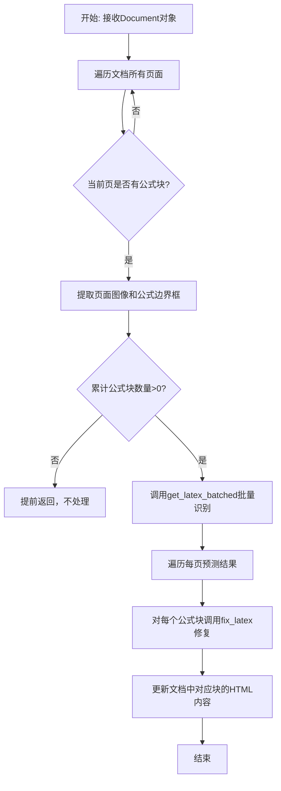

## 类结构

```
BaseProcessor (抽象基类)
└── EquationProcessor (公式处理器)
```

## 全局变量及字段


### `MATH_TAG_PATTERN`
    
正则表达式，用于匹配math标签

类型：`re.Pattern`
    


### `EquationProcessor.block_types`
    
要处理的块类型，值为BlockTypes.Equation

类型：`Tuple[BlockTypes]`
    


### `EquationProcessor.model_max_length`
    
Recognition模型的最大token数，默认1024

类型：`int`
    


### `EquationProcessor.equation_batch_size`
    
公式识别的批处理大小，默认None

类型：`int`
    


### `EquationProcessor.disable_tqdm`
    
是否禁用tqdm进度条，默认False

类型：`bool`
    


### `EquationProcessor.drop_repeated_text`
    
是否丢弃OCR结果中的重复文本，默认False

类型：`bool`
    


### `EquationProcessor.recognition_model`
    
OCR识别模型实例

类型：`RecognitionPredictor`
    
    

## 全局函数及方法


### `fix_text`

fix_text 是 ftfy 库中的一个函数，用于修复文本编码问题，如乱码、HTML 实体编码等。在 EquationProcessor 类的 fix_latex 方法中调用此函数来修复模型输出的 LaTeX 公式 HTML 中的编码问题。

参数：

-  `text`：`str`，需要修复的文本字符串，即待处理的 HTML 字符串
-  `config`：`TextFixerConfig`，可选配置对象，用于指定修复选项，这里使用 `TextFixerConfig(unescape_html=True)` 来处理 HTML 实体

返回值：`str`，返回修复后的文本字符串

#### 流程图

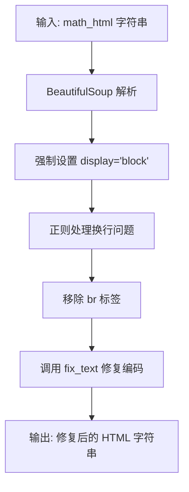

#### 带注释源码

```python
# 从 ftfy 库导入的 fix_text 函数和 TextFixerConfig 配置类
from ftfy import fix_text, TextFixerConfig

# 在 EquationProcessor 类的 fix_latex 方法中使用
def fix_latex(self, math_html: str):
    math_html = math_html.strip()
    soup = BeautifulSoup(math_html, "html.parser")
    opening_math_tag = soup.find("math")

    # No math block found
    if not opening_math_tag:
        return ""

    # Force block format - 强制将数学块设置为块级显示
    opening_math_tag.attrs["display"] = "block"
    fixed_math_html = str(soup)

    # Sometimes model outputs newlines at the beginning/end of tags
    # 处理模型输出的多余换行问题
    fixed_math_html = re.sub(
        r"^<math display=\"block\">\\n(?![a-zA-Z])",
        '<math display="block">',
        fixed_math_html,
    )
    fixed_math_html = re.sub(r"\\n</math>$", "</math>", fixed_math_html)
    fixed_math_html = re.sub(r"<br>", "", fixed_math_html)
    
    # 调用 fix_text 修复编码问题
    # TextFixerConfig(unescape_html=True) 表示同时处理 HTML 实体
    fixed_math_html = fix_text(
        fixed_math_html, config=TextFixerConfig(unescape_html=True)
    )
    return fixed_math_html
```


### `TextFixerConfig`

`TextFixerConfig` 是从外部库 `ftfy` 导入的配置类，用于配置文本修复行为。在代码中用于配置 `fix_text` 函数处理 HTML 实体等文本修复选项。

参数：

- `unescape_html`：`bool`，可选参数，控制是否对 HTML 实体进行反转义（例如将 `&lt;` 转换回 `<`）

返回值：`TextFixerConfig` 实例，用于传递给 `fix_text` 函数的配置参数

#### 流程图

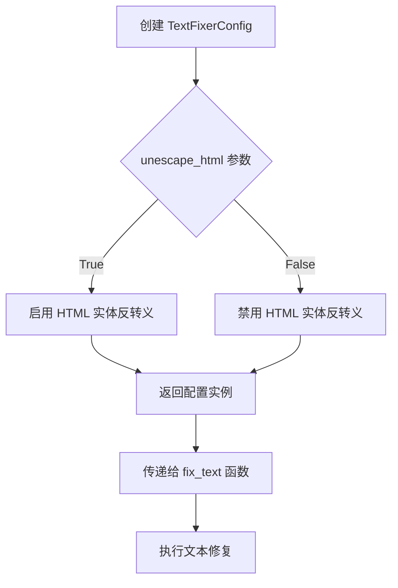

#### 带注释源码

```
# 从 ftfy 库导入 TextFixerConfig 配置类
from ftfy import fix_text, TextFixerConfig

# ...

    def fix_latex(self, math_html: str):
        # ... 前置处理代码 ...
        
        # 使用 TextFixerConfig 配置 fix_text 函数
        # unescape_html=True 表示将 HTML 实体（如 &lt;, &gt;, &amp;）反转义为原始字符
        fixed_math_html = fix_text(
            fixed_math_html, config=TextFixerConfig(unescape_html=True)
        )
        return fixed_math_html
```

#### 补充说明

- **设计目标**：`TextFixerConfig` 是 `ftfy` 库提供的配置类，用于控制文本修复的具体行为
- **外部依赖**：依赖 `ftfy` 库，需要确保该库已正确安装
- **接口契约**：配置类通过命名参数初始化，返回一个不可变的配置对象
- **使用场景**：在处理模型输出的 HTML 格式数学公式时，用于修复常见的 HTML 编码问题


### `RecognitionPredictor`

这是从 `surya.recognition` 导入的 OCR 预测器类，用于识别文档图像中的文本内容。在 `EquationProcessor` 中被调用来识别数学公式（LaTeX）。

参数：

- `images`：`List[Image.Image]` - 要进行 OCR 识别的页面图像列表
- `bboxes`：`List[List[List[float]]]` - 每个页面的边界框列表，用于指定识别区域
- `task_names`：`List[str]` - 任务名称列表，此处使用 `"ocr_with_boxes"` 表示带边界框的 OCR 任务
- `recognition_batch_size`：`int` - 识别模型的批次大小
- `sort_lines`：`bool` - 是否对识别出的文本行进行排序
- `drop_repeated_text`：`bool` - 是否丢弃重复的文本
- `max_tokens`：`int` - 最大 token 数量限制
- `max_sliding_window`：`int` - 最大滑动窗口大小

返回值：`List[OCRResult]` - OCR 识别结果列表，每个元素对应一页图像的识别结果

#### 流程图

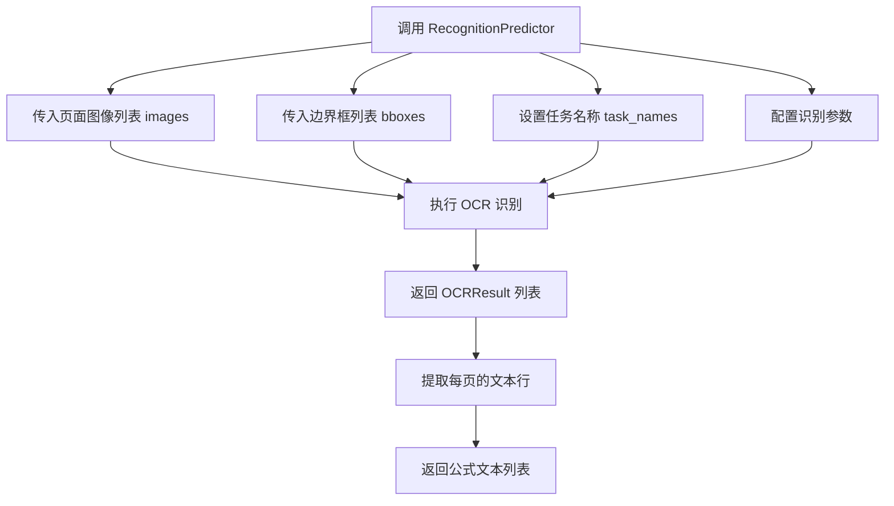

#### 带注释源码

```python
# 调用 RecognitionPredictor 进行 OCR 识别
predictions: List[OCRResult] = self.recognition_model(
    images=page_images,                          # 页面图像列表
    bboxes=equation_boxes,                       # 方程区域的边界框列表
    task_names=["ocr_with_boxes"] * len(page_images),  # 每个页面使用带框的OCR任务
    recognition_batch_size=self.get_batch_size(),      # 获取批处理大小（CUDA:32, MPS:6, CPU:6）
    sort_lines=False,                            # 不排序识别出的行
    drop_repeated_text=self.drop_repeated_text,  # 是否丢弃重复文本
    max_tokens=2048,                             # 最大token数
    max_sliding_window=2148,                     # 最大滑动窗口
)

# 从 OCRResult 中提取文本行
equation_predictions = [
    [line.text.strip() for line in page_prediction.text_lines]
    for page_prediction in predictions
]

# 返回识别出的公式文本列表
return equation_predictions
```


### `OCRResult`

`OCRResult` 是来自 Surya 库的 OCR 结果类，用于封装图像的光学字符识别结果。在本代码中，它被用作类型注解，表明 `predictions` 是一个包含 OCR 识别结果的列表，每个结果对应一页图像的识别输出。该类包含文本行信息（`text_lines`），用于提取识别出的文本内容。

#### 流程图

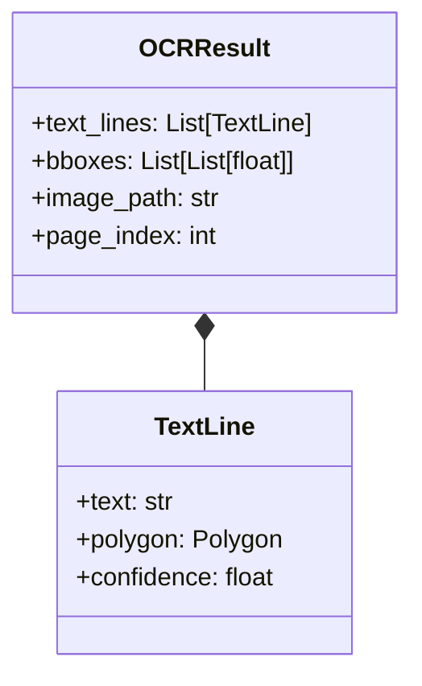

#### 带注释源码

```
# OCRResult 类定义 (来自 surya.recognition 库)

class OCRResult:
    """
    OCR 识别结果的数据类
    
    Attributes:
        text_lines: 识别出的文本行列表，每个元素包含文本内容和位置信息
        bboxes: 识别文本的边界框坐标列表
        image_path: 输入图像的路径
        page_index: 页面索引
    """
    
    def __init__(
        self,
        text_lines: List[TextLine],
        bboxes: Optional[List[List[float]]] = None,
        image_path: Optional[str] = None,
        page_index: int = 0
    ):
        self.text_lines = text_lines
        self.bboxes = bboxes or []
        self.image_path = image_path
        self.page_index = page_index


# 在本代码中的使用示例

# 从 recognition_model 获取预测结果，返回类型为 List[OCRResult]
predictions: List[OCRResult] = self.recognition_model(
    images=page_images,
    bboxes=bboxes,
    task_names=["ocr_with_boxes"] * len(page_images),
    recognition_batch_size=self.get_batch_size(),
    sort_lines=False,
    drop_repeated_text=self.drop_repeated_text,
    max_tokens=2048,
    max_sliding_window=2148,
)

# 提取每页预测的文本行
equation_predictions = [
    [line.text.strip() for line in page_prediction.text_lines]
    for page_prediction in predictions
]
```


# BaseProcessor 类详细设计文档

## 1. 一段话描述

`BaseProcessor` 是 marker 框架中的处理器基类，定义了文档处理的抽象接口，提供了配置管理、块类型过滤和文档处理的通用框架，具体实现由子类（如 `EquationProcessor`）完成。

## 2. 文件的整体运行流程

```
导入 BaseProcessor → 定义 EquationProcessor 继承 BaseProcessor 
→ 初始化时调用 super().__init__(config) 
→ 处理文档时调用 __call__(document) 方法
→ 遍历文档页面提取特定类型块 → 处理后更新块的 HTML 内容
```

## 3. 类的详细信息

### 3.1 BaseProcessor 类

#### 类字段

| 字段名 | 类型 | 描述 |
|--------|------|------|
| `block_types` | `Annotated[Tuple[BlockTypes], str]` | 指定要处理的文档块类型，由子类实现时定义 |
| `model_max_length` | `Annotated[int, str]` | 识别模型的最大 token 数限制 |
| `config` | `Any` | 处理器配置对象，传递给父类初始化 |

#### 类方法

| 方法名 | 参数 | 返回值 | 描述 |
|--------|------|--------|------|
| `__init__` | `config=None` | `None` | 初始化处理器，接收配置对象 |
| `__call__` | `document: Document` | `None` | 处理文档的抽象方法，由子类实现 |

### 3.2 EquationProcessor 子类（供参考）

#### 类字段

| 字段名 | 类型 | 描述 |
|--------|------|------|
| `block_types` | `Tuple[BlockTypes]` | 要处理的块类型，值为 `(BlockTypes.Equation,)` |
| `model_max_length` | `int` | 识别模型最大 token 数，默认 1024 |
| `equation_batch_size` | `int` | 方程识别的批大小，None 时使用默认值 |
| `disable_tqdm` | `bool` | 是否禁用 tqdm 进度条 |
| `drop_repeated_text` | `bool` | 是否丢弃 OCR 结果中的重复文本 |

## 4. 关键组件信息

| 组件名称 | 描述 |
|----------|------|
| `BaseProcessor` | 处理器抽象基类，定义文档处理的通用接口 |
| `EquationProcessor` | 方程识别处理器，继承 BaseProcessor 实现数学公式识别 |
| `Document` | 文档对象，包含页面和块结构 |
| `BlockTypes` | 文档块类型枚举 |
| `RecognitionPredictor` | OCR/识别模型预测器 |

## 5. 潜在的技术债务或优化空间

1. **缺乏抽象方法定义**：BaseProcessor 未使用 `abc` 模块定义抽象方法，导致运行时才知道方法是否实现
2. **配置管理不明确**：config 参数类型未明确定义
3. **错误处理缺失**：__call__ 方法未处理异常情况
4. **类型注解不完整**：部分返回值和中间变量类型可以更精确

## 6. 其它项目

### 设计目标与约束
- **目标**：提供统一的文档处理接口，支持多种内容类型（文本、表格、方程等）
- **约束**：子类必须定义 `block_types` 属性来指定处理范围

### 错误处理与异常设计
- 从代码可见，EquationProcessor 在处理空方程块时会提前返回
- 断言用于验证预测数量与块数量匹配

### 数据流与状态机
```
Document → 遍历页面 → 获取页面图像 → 提取目标块 
→ 调用识别模型 → 处理预测结果 → 更新块 HTML → 完成
```

### 外部依赖与接口契约
- 依赖 `marker.processors.BaseProcessor` 基类
- 依赖 `marker.schema.document.Document` 文档结构
- 依赖 `marker.schema.BlockTypes` 块类型枚举
- 依赖 `surya.recognition.RecognitionPredictor` 识别模型

---

### `BaseProcessor.__init__`

处理器基类的初始化方法，用于配置管理。

参数：

- `config`：`Any`，处理器配置对象，默认值为 `None`

返回值：`None`，无返回值

#### 流程图

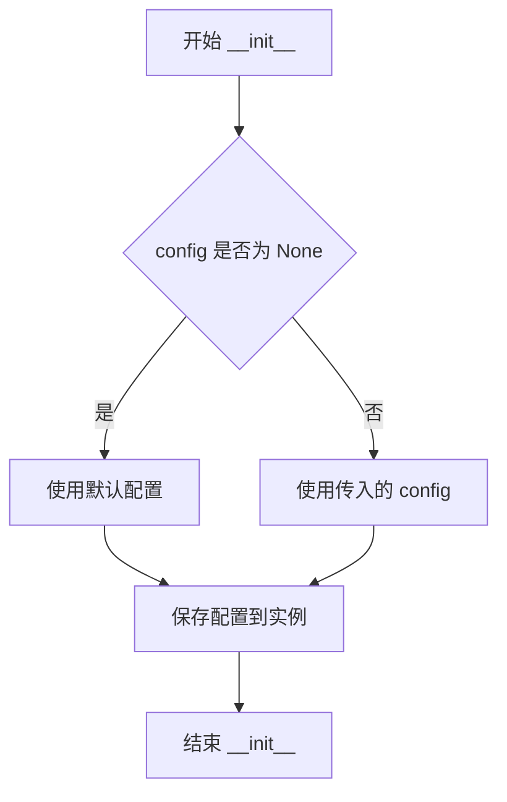

#### 带注释源码

```python
def __init__(self, config=None):
    """
    初始化处理器基类。
    
    Args:
        config: 处理器配置对象，用于配置处理器的行为。
                如果为 None，则使用默认配置。
    """
    # 调用父类初始化，确保继承链正确初始化
    super().__init__(config)
    
    # 保存配置到实例属性，供后续方法使用
    # 具体实现由子类完成
```

---

### `BaseProcessor.__call__`

处理器基类的抽象调用方法，定义处理文档的接口。

参数：

- `document`：`Document`，待处理的文档对象

返回值：`None`，无返回值（由子类实现具体处理逻辑）

#### 流程图

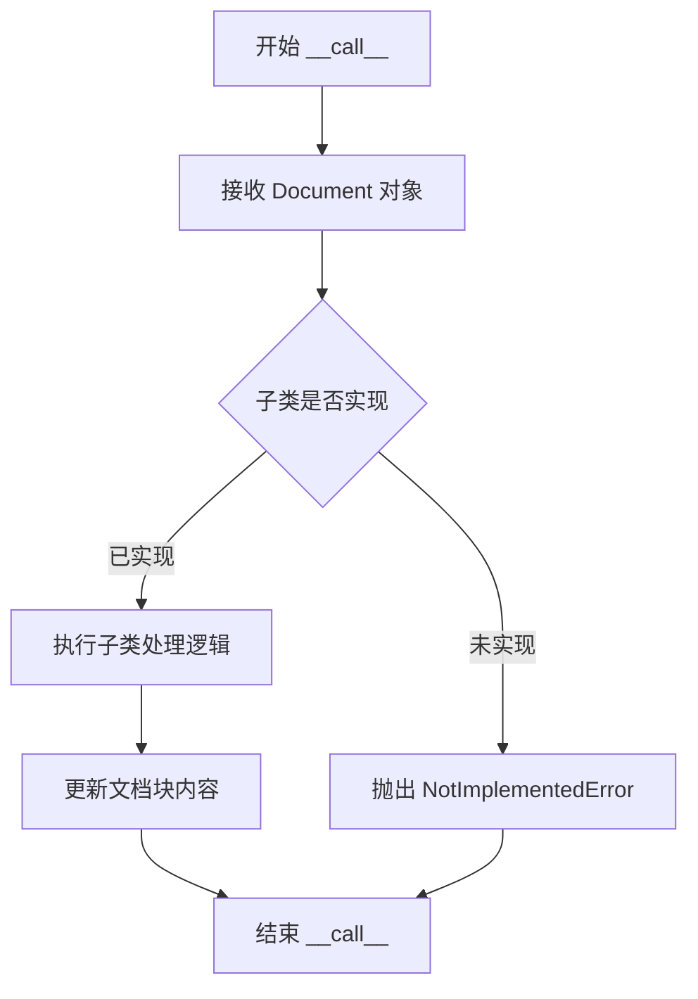

#### 带注释源码

```python
def __call__(self, document: Document):
    """
    处理文档的抽象方法。
    
    该方法由子类实现具体处理逻辑，如识别方程、表格等。
    
    Args:
        document: Document 对象，包含文档的页面和块结构。
                  通过 page.contained_blocks() 获取特定类型的块，
                  通过 block.get_image() 获取块图像，
                  通过 block.html 设置块内容。
    
    Returns:
        None: 处理结果直接修改 document 对象中的块内容。
    
    Note:
        子类需要重写此方法来实现具体的文档处理逻辑。
        典型的实现模式：
        1. 遍历文档页面获取图像
        2. 提取需要处理的块
        3. 调用模型进行预测
        4. 将预测结果更新到块的 HTML 属性中
    """
    # 子类需要重写此方法
    raise NotImplementedError("Subclasses must implement __call__ method")
```

---

### `EquationProcessor.__init__`

EquationProcessor 的初始化方法，继承自 BaseProcessor。

参数：

- `recognition_model`：`RecognitionPredictor`，OCR/识别模型预测器
- `config`：`Any`，可选配置对象，默认值为 `None`

返回值：`None`，无返回值

#### 流程图

```mermaid
flowchart TD
    A[开始 __init__] --> B[调用 super().__init__config]
    B --> C[保存 recognition_model]
    D --> E[结束 __init__]
```

#### 带注释源码

```python
def __init__(self, recognition_model: RecognitionPredictor, config=None):
    """
    初始化方程识别处理器。
    
    Args:
        recognition_model: RecognitionPredictor 实例，用于识别图像中的数学公式
        config: 可选的配置对象，传递给父类 BaseProcessor
    
    Returns:
        None
    """
    # 调用父类 BaseProcessor 的初始化方法
    # 父类会处理配置的初始化
    super().__init__(config)
    
    # 保存识别模型实例，供后续 __call__ 方法使用
    # 该模型用于将图像中的数学公式识别为 LaTeX/HTML
    self.recognition_model = recognition_model
```

---

### `EquationProcessor.__call__`

处理文档中的方程块，调用识别模型将图像中的公式转换为 LaTeX。

参数：

- `document`：`Document`，待处理的文档对象

返回值：`None`，无返回值，处理结果直接修改 document 中块的 html 属性

#### 流程图

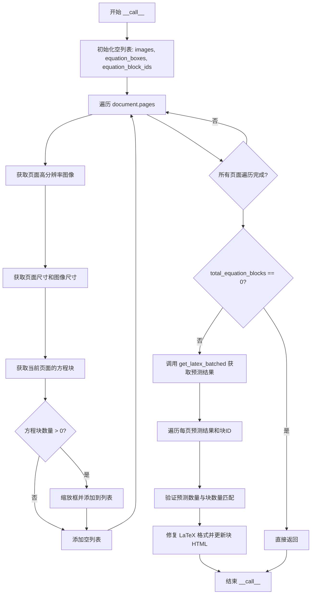

#### 带注释源码

```python
def __call__(self, document: Document):
    """
    处理文档中的方程块，将图像中的公式识别为 LaTeX。
    
    Args:
        document: Document 对象，包含待处理的文档结构和页面
                  通过 document.pages 访问页面
                  通过 page.contained_blocks(BlockTypes.Equation) 获取方程块
                  通过 block.polygon 获取块的几何信息
                  通过 block.html 设置识别后的公式 HTML
    
    Returns:
        None: 处理结果直接修改 document 中 Equation 类型块的 html 属性
              将识别出的 LaTeX 公式封装在 <math display="block"> 标签中
    
    处理流程：
        1. 遍历文档所有页面，收集方程块的边界框和图像
        2. 调用 recognition_model 批量识别方程图像
        3. 将识别结果修复格式后更新到块的 html 属性
    """
    # 用于存储所有页面的图像
    images = []
    # 用于存储所有页面的方程边界框
    equation_boxes = []
    # 用于存储所有页面的方程块 ID
    equation_block_ids = []
    # 统计方程块总数
    total_equation_blocks = 0

    # 遍历文档中的所有页面
    for page in document.pages:
        # 获取页面的高分辨率图像（用于识别）
        page_image = page.get_image(highres=True)
        # 获取页面的原始尺寸（Polygon 维度）
        page_size = page.polygon.width, page.polygon.height
        # 获取图像的实际尺寸
        image_size = page_image.size

        # 当前页面的方程框和块 ID
        page_equation_boxes = []
        page_equation_block_ids = []
        # 获取当前页面中所有指定类型的块（方程块）
        equation_blocks = page.contained_blocks(document, self.block_types)
        
        # 遍历方程块，收集边界框信息
        for block in equation_blocks:
            # 将块的 Polygon 坐标从页面尺寸缩放到图像尺寸
            # 然后获取边界框 (bbox) 格式
            page_equation_boxes.append(
                block.polygon.rescale(page_size, image_size).bbox
            )
            # 保存块的 ID，用于后续更新块内容
            page_equation_block_ids.append(block.id)
            # 累加方程块总数
            total_equation_blocks += 1

        # 将当前页面的数据添加到总列表
        images.append(page_image)
        equation_boxes.append(page_equation_boxes)
        equation_block_ids.append(page_equation_block_ids)

    # 如果没有方程块，直接返回，不调用模型
    if total_equation_blocks == 0:
        return

    # 调用识别模型批量获取 LaTeX 预测结果
    # 返回的是二维列表：每页一个列表，每页每个方程一个预测
    predictions = self.get_latex_batched(images, equation_boxes)
    
    # 遍历每页的预测结果和对应的块 ID
    for page_predictions, page_equation_block_ids in zip(
        predictions, equation_block_ids
    ):
        # 断言：每个方程块都应该有一个预测结果
        assert len(page_predictions) == len(page_equation_block_ids), (
            "Every equation block should have a corresponding prediction"
        )
        
        # 遍历当前页的每个预测结果
        for block_prediction, block_id in zip(
            page_predictions, page_equation_block_ids
        ):
            # 根据块 ID 获取块对象
            block = document.get_block(block_id)
            # 修复 LaTeX 格式并更新块的 HTML 内容
            block.html = self.fix_latex(block_prediction)
```


### `BlockTypes` (从 `marker.schema` 导入)

文档块类型枚举，定义了文档中各种内容块的类型，用于识别和处理不同类型的文档元素（如公式、文本、图像等）。

参数： 无（枚举类型不接受函数参数）

返回值：`BlockTypes` 枚举值，表示特定的文档块类型

#### 流程图

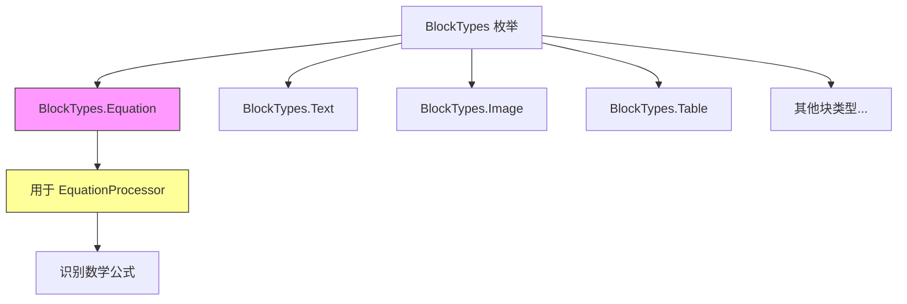

#### 带注释源码

```python
# 从 marker.schema 模块导入 BlockTypes 枚举
from marker.schema import BlockTypes

# 在 EquationProcessor 类中作为类型注解使用
block_types: Annotated[
    Tuple[BlockTypes],  # 元组类型，包含 BlockTypes 枚举值
    "The block types to process.",  # 文档字符串说明
] = (BlockTypes.Equation,)  # 实例：只处理公式类型的块

# BlockTypes 可能包含的其他枚举值（根据代码上下文推断）：
# - BlockTypes.Equation: 数学公式块
# - BlockTypes.Text: 文本段落块
# - BlockTypes.Image: 图像块
# - BlockTypes.Table: 表格块
# - 等等...
```

#### 详细说明

| 属性 | 值 |
|------|-----|
| **枚举名称** | `BlockTypes` |
| **模块来源** | `marker.schema` |
| **用途** | 定义文档中不同内容块的类型标签 |
| **在代码中的作用** | 用于 `EquationProcessor` 类指定需要处理的文档块类型，当前配置为只处理公式块 `(BlockTypes.Equation,)` |

#### 技术债务与优化空间

1. **枚举值不完整**: 代码中仅使用了 `BlockTypes.Equation`，但未展示完整的枚举定义，建议补充文档说明所有可用的块类型
2. **类型注解使用**: 使用 `Annotated[Tuple[BlockTypes], ...]` 表示可处理多种块类型，但当前硬编码为单一类型，若未来需要支持多种块类型需重构


### `EquationProcessor.__call__`

该方法是`EquationProcessor`类的核心执行方法，接收文档对象，提取文档中的公式块，使用OCR识别模型将图片中的公式转换为LaTeX/HTML格式，并更新文档中对应块的HTML内容。

参数：

-  `document`：`Document`，从marker.schema.document导入的文档类对象，包含需要处理的页面和公式块信息

返回值：`None`，该方法直接修改传入的document对象的block.html属性，不返回任何值

#### 流程图

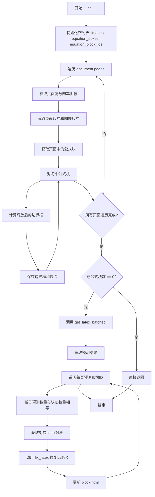

#### 带注释源码

```python
def __call__(self, document: Document):
    """
    处理文档中的公式块，识别并转换为HTML/LaTeX格式。
    
    参数:
        document: Document对象，包含需要处理的页面和公式块
    返回:
        None，直接修改document对象的block属性
    """
    # 用于存储所有页面的图像
    images = []
    # 用于存储所有页面的公式边界框
    equation_boxes = []
    # 用于存储所有页面的公式块ID
    equation_block_ids = []
    # 统计总公式块数量
    total_equation_blocks = 0

    # 遍历文档中的所有页面
    for page in document.pages:
        # 获取页面的高分辨率图像
        page_image = page.get_image(highres=True)
        # 获取页面的多边形尺寸（原始文档尺寸）
        page_size = page.polygon.width, page.polygon.height
        # 获取图像的实际尺寸
        image_size = page_image.size

        # 当前页面的公式框和块ID列表
        page_equation_boxes = []
        page_equation_block_ids = []
        # 获取当前页面包含的所有公式块
        equation_blocks = page.contained_blocks(document, self.block_types)
        
        # 遍历每个公式块
        for block in equation_blocks:
            # 将公式块的坐标从文档尺寸缩放到图像尺寸，并获取边界框
            page_equation_boxes.append(
                block.polygon.rescale(page_size, image_size).bbox
            )
            # 保存公式块的ID
            page_equation_block_ids.append(block.id)
            # 累计公式块总数
            total_equation_blocks += 1

        # 将当前页面的数据添加到总列表中
        images.append(page_image)
        equation_boxes.append(page_equation_boxes)
        equation_block_ids.append(page_equation_block_ids)

    # 如果没有公式块，直接返回
    if total_equation_blocks == 0:
        return

    # 调用批处理方法获取LaTeX预测结果
    predictions = self.get_latex_batched(images, equation_boxes)
    
    # 遍历每页的预测结果和对应的块ID
    for page_predictions, page_equation_block_ids in zip(
        predictions, equation_block_ids
    ):
        # 断言：每个公式块都应该有对应的预测结果
        assert len(page_predictions) == len(page_equation_block_ids), (
            "Every equation block should have a corresponding prediction"
        )
        # 遍历当前页面的每个预测和块ID对
        for block_prediction, block_id in zip(
            page_predictions, page_equation_block_ids
        ):
            # 通过ID获取文档中的块对象
            block = document.get_block(block_id)
            # 调用fix_latex修复预测结果并更新块的HTML属性
            block.html = self.fix_latex(block_prediction)
```


### `settings`

`settings` 是从 `marker.settings` 模块导入的配置对象，用于存储应用程序的全局配置信息。该对象包含了模型设备类型、批处理大小等运行时配置选项，供 `EquationProcessor` 等处理器在执行推理时获取正确的配置参数。

参数：此对象为全局配置实例，无需作为函数参数传递

返回值：全局配置对象，包含以下关键属性：
- `TORCH_DEVICE_MODEL`：字符串，表示当前运行设备的类型（如 "cuda"、"mps" 或其他）

#### 流程图

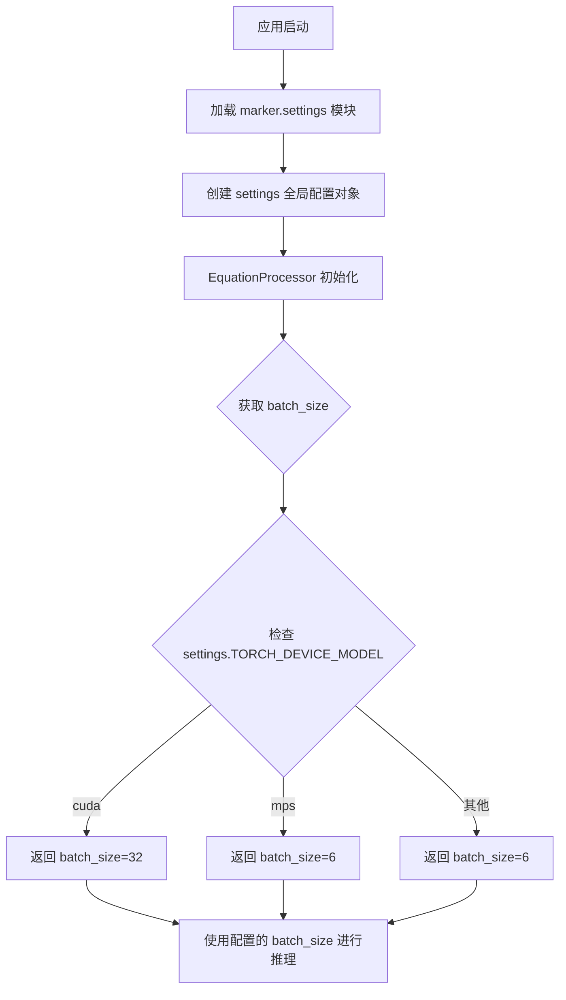

#### 带注释源码

```python
# marker/settings.py 中的 settings 对象结构示例
# 具体实现取决于 marker.settings 模块的实际定义

class Settings:
    """
    全局设置类，用于存储应用程序配置
    """
    
    # 设备类型配置
    TORCH_DEVICE_MODEL: str = "cuda"  # 可选值: "cuda", "mps", "cpu" 等
    
    # 其他可能的配置项（基于代码推断）
    # RECOGNITION_BATCH_SIZE: int = 32
    # DEFAULT_MAX_LENGTH: int = 1024

# 全局实例
settings = Settings()
```

#### 在 EquationProcessor 中的使用

```python
def get_batch_size(self):
    # Set to 1/4th of OCR batch size due to sequence length with tiling
    if self.equation_batch_size is not None:
        return self.equation_batch_size
    elif settings.TORCH_DEVICE_MODEL == "cuda":
        return 32
    elif settings.TORCH_DEVICE_MODEL == "mps":
        return 6
    return 6
```

#### 关键信息总结

| 属性名称 | 类型 | 描述 |
|---------|------|------|
| `TORCH_DEVICE_MODEL` | `str` | 当前 PyTorch 设备类型，用于决定推理批处理大小 |

#### 潜在的技术债务与优化空间

1. **硬编码的批处理大小**：批处理大小（32 for CUDA，6 for MPS）是硬编码在 `get_batch_size` 方法中的，建议将这些值提取到 `settings` 配置对象中，以便于调整和优化。

2. **设备检测逻辑简化**：当前使用多层 `if-elif` 判断设备类型，可以考虑使用字典映射方式简化逻辑：
   ```python
   BATCH_SIZE_MAP = {"cuda": 32, "mps": 6, "cpu": 4}
   return self.equation_batch_size or BATCH_SIZE_MAP.get(settings.TORCH_DEVICE_MODEL, 6)
   ```

3. **配置集中化**：`settings` 对象中应该包含更多可配置项，如 `equation_batch_size` 的默认值、`max_tokens` 等，以便在不修改代码的情况下调整模型行为。

4. **缺少配置验证**：settings 对象缺少对配置值的验证，建议添加配置验证机制确保设备类型等关键配置的有效性。

#### 外部依赖与接口契约

- **依赖模块**：`marker.settings` - 本地配置模块
- **使用方**：`EquationProcessor` 类依赖此配置对象获取设备信息和默认批处理大小
- **接口约定**：settings 对象应提供 `TORCH_DEVICE_MODEL` 属性，返回字符串类型的设备标识符


### `EquationProcessor.__init__`

初始化 EquationProcessor 处理器，设置识别模型和配置参数。

参数：

- `recognition_model`：`RecognitionPredictor`，用于识别文档中方程的识别模型实例
- `config`：任意类型，可选，传递给父类的配置参数，默认为 None

返回值：无返回值（`__init__` 方法）

#### 流程图

```mermaid
flowchart TD
    A[开始 __init__] --> B[调用 super().__init__config]
    B --> C[将 recognition_model 赋值给实例属性 self.recognition_model]
    C --> D[结束]
```

#### 带注释源码

```python
def __init__(self, recognition_model: RecognitionPredictor, config=None):
    """
    初始化 EquationProcessor 处理器
    
    参数:
        recognition_model: RecognitionPredictor 类型，用于识别文档中方程的识别模型实例
        config: 任意类型，可选，传递给父类的配置参数，默认为 None
    """
    # 调用父类 BaseProcessor 的初始化方法，传递配置参数
    super().__init__(config)

    # 将传入的识别模型保存为实例属性，供后续方法调用
    self.recognition_model = recognition_model
```


### `EquationProcessor.get_batch_size`

根据设备类型返回适当的批处理大小。如果用户配置了`equation_batch_size`，则使用用户配置值；否则根据CUDA或MPS设备返回对应的默认值，CUDA返回32，MPS或其他设备返回6。

参数：

- `self`：`EquationProcessor`，表示当前处理器实例

返回值：`int`，返回批处理大小

#### 流程图

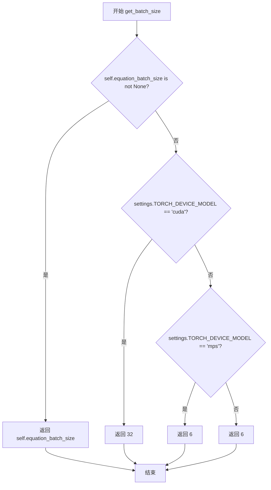

#### 带注释源码

```python
def get_batch_size(self):
    # 如果用户已配置equation_batch_size，则优先使用用户配置的值
    if self.equation_batch_size is not None:
        return self.equation_batch_size
    # 如果使用CUDA GPU设备，返回32作为批处理大小
    # 这是因为CUDA设备通常具有更大的显存，可以处理更大的批次
    elif settings.TORCH_DEVICE_MODEL == "cuda":
        return 32
    # 如果使用Apple MPS（Metal Performance Shaders）设备，返回6作为批处理大小
    # MPS设备的显存相对有限，需要较小的批次大小
    elif settings.TORCH_DEVICE_MODEL == "mps":
        return 6
    # 默认情况下（包括CPU设备），返回6作为批处理大小
    return 6
```


### `EquationProcessor.__call__`

该方法是 `EquationProcessor` 类的主处理方法，遍历文档中的所有页面，识别页面中的方程块（BlockTypes.Equation），调用 OCR 识别模型将图像中的公式转换为 LaTeX 文本，并使用 BeautifulSoup 修复 LaTeX 格式后更新到文档的对应块中。

参数：

- `document`：`Document`，待处理的文档对象，包含多个页面和各类内容块

返回值：`None`，该方法直接修改传入的 `document` 对象，不返回任何值

#### 流程图

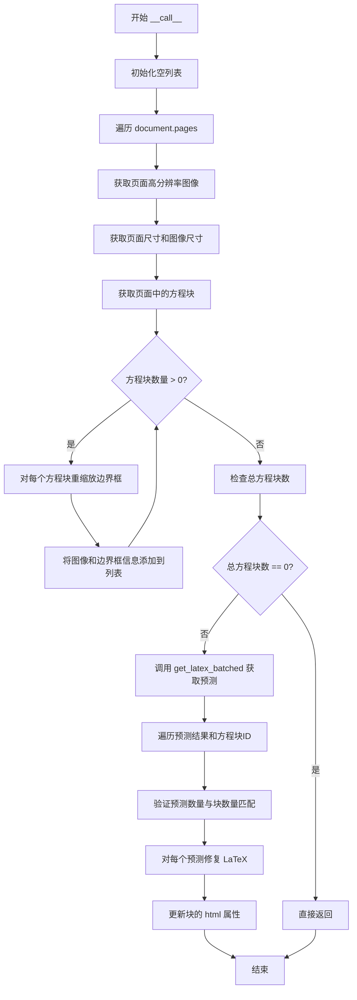

#### 带注释源码

```
def __call__(self, document: Document):
    """
    处理文档中的所有方程块，识别 LaTeX 公式并更新文档内容。
    
    Args:
        document: 包含多个页面的文档对象
        
    Returns:
        None: 直接修改 document 对象，不返回任何值
    """
    # 用于存储所有页面的图像
    images = []
    # 用于存储所有页面的方程边界框列表
    equation_boxes = []
    # 用于存储所有页面的方程块 ID 列表
    equation_block_ids = []
    # 统计总方程块数量
    total_equation_blocks = 0

    # 遍历文档中的每一页
    for page in document.pages:
        # 获取页面的高分辨率图像
        page_image = page.get_image(highres=True)
        # 获取页面尺寸（基于 polygon）
        page_size = page.polygon.width, page.polygon.height
        # 获取图像的实际尺寸
        image_size = page_image.size

        # 当前页面的方程边界框和块 ID 列表
        page_equation_boxes = []
        page_equation_block_ids = []
        # 获取当前页面中所有指定类型的块（方程块）
        equation_blocks = page.contained_blocks(document, self.block_types)
        
        # 遍历当前页面的所有方程块
        for block in equation_blocks:
            # 将块的多边形从页面尺寸重缩放到图像尺寸，并获取边界框
            page_equation_boxes.append(
                block.polygon.rescale(page_size, image_size).bbox
            )
            # 记录方程块的 ID
            page_equation_block_ids.append(block.id)
            # 累计总方程块数
            total_equation_blocks += 1

        # 将当前页面的图像和相关信息添加到总列表
        images.append(page_image)
        equation_boxes.append(page_equation_boxes)
        equation_block_ids.append(page_equation_block_ids)

    # 如果文档中没有方程块，直接返回，不执行后续处理
    if total_equation_blocks == 0:
        return

    # 调用批处理方法获取 LaTeX 预测结果
    predictions = self.get_latex_batched(images, equation_boxes)
    
    # 遍历每页的预测结果和对应的方程块 ID
    for page_predictions, page_equation_block_ids in zip(
        predictions, equation_block_ids
    ):
        # 断言：每个方程块都应该有对应的预测结果
        assert len(page_predictions) == len(page_equation_block_ids), (
            "Every equation block should have a corresponding prediction"
        )
        
        # 遍历当前页面的每个预测结果和块 ID
        for block_prediction, block_id in zip(
            page_predictions, page_equation_block_ids
        ):
            # 根据块 ID 获取文档中的块对象
            block = document.get_block(block_id)
            # 使用 fix_latex 方法修复 LaTeX 格式，并更新块的 HTML 内容
            block.html = self.fix_latex(block_prediction)
```

---

### 1. 一段话描述

`EquationProcessor` 是一个文档处理器，用于识别文档中的数学公式（方程）块，将图像形式的公式通过 OCR 识别模型转换为 LaTeX 文本，并自动修复格式后更新到文档中，支持批量处理多页文档中的方程识别任务。

---

### 2. 文件的整体运行流程

```
┌─────────────────────────────────────────────────────────────────┐
│                        EquationProcessor                        │
├─────────────────────────────────────────────────────────────────┤
│  1. 初始化（__init__）                                          │
│     - 加载 RecognitionPredictor 模型                            │
│                                                                 │
│  2. 处理文档（__call__）主流程                                   │
│     ├─ 遍历文档所有页面                                          │
│     │   ├─ 获取页面图像                                          │
│     │   ├─ 提取方程块及其边界框                                   │
│     │   └─ 收集图像和坐标信息                                     │
│     │                                                          │
│     ├─ 调用 OCR 模型批处理                                       │
│     │   └─ get_latex_batched() → 识别 LaTeX 公式                 │
│     │                                                          │
│     └─ 更新文档块内容                                            │
│         └─ fix_latex() → 修复格式后写入 block.html              │
└─────────────────────────────────────────────────────────────────┘
```

---

### 3. 类的详细信息

#### 类字段

| 字段名称 | 类型 | 描述 |
|---------|------|------|
| `block_types` | `Annotated[Tuple[BlockTypes], str]` | 要处理的块类型，固定为 `(BlockTypes.Equation,)` |
| `model_max_length` | `Annotated[int, str]` | Recognition 模型的最大 token 数，默认为 1024 |
| `equation_batch_size` | `Annotated[int, str]` | 方程识别的批处理大小，默认为 None |
| `disable_tqdm` | `Annotated[bool, str]` | 是否禁用 tqdm 进度条 |
| `drop_repeated_text` | `Annotated[bool, str]` | 是否在 OCR 结果中删除重复文本 |

#### 类方法

| 方法名称 | 描述 |
|---------|------|
| `__init__` | 初始化处理器，加载识别模型 |
| `get_batch_size` | 获取实际的批处理大小，根据设备类型调整 |
| `__call__` | **主处理方法**，遍历文档识别方程并更新内容 |
| `fix_latex` | 修复 LaTeX 格式，确保显示模式正确 |
| `get_latex_batched` | 批量调用 OCR 模型识别方程 |

---

### 4. 关键组件信息

| 组件名称 | 描述 |
|---------|------|
| `RecognitionPredictor` | Surya 库的 OCR 识别预测器，用于识别图像中的文本/公式 |
| `Document` | 文档对象，包含页面和块的层级结构 |
| `BaseProcessor` | 处理器基类，提供配置管理和通用接口 |
| `TextFixerConfig` | ftfy 库的配置，用于修复文本编码问题 |
| `MATH_TAG_PATTERN` | 正则表达式，用于匹配 math 标签（当前代码中未使用） |

---

### 5. 潜在的技术债务或优化空间

1. **未使用的正则表达式**：`MATH_TAG_PATTERN` 在类中定义但未使用，可能是遗留代码或计划功能
2. **断言代替错误处理**：使用 `assert` 验证预测数量与块数量匹配，生产环境中应使用正式异常处理
3. **硬编码参数**：`get_latex_batched` 方法中 `max_tokens=2048` 和 `max_sliding_window=2148` 硬编码，应提取为配置参数
4. **缺乏缓存机制**：重复处理相同文档时没有缓存识别结果
5. **异常吞没**：如果 OCR 模型调用失败，错误可能未被妥善记录或传播

---

### 6. 其它项目

#### 设计目标与约束
- **目标**：从文档图像中自动识别数学公式并转换为 LaTeX
- **约束**：仅处理 `BlockTypes.Equation` 类型的块

#### 错误处理与异常设计
- 使用 `assert` 验证数据一致性
- 当无方程块时直接返回，避免不必要的模型调用
- OCR 模型调用失败时可能抛出异常，当前未捕获

#### 数据流与状态机
- **输入**：`Document` 对象（含多个 Page，每个 Page 含多个 Block）
- **处理流程**：提取图像 → 提取边界框 → OCR 识别 → 格式修复 → 更新块
- **输出**：修改后的 `Document` 对象（块 HTML 内容被更新）

#### 外部依赖与接口契约
- **Surya OCR**：提供 `RecognitionPredictor` 进行公式识别
- **marker 框架**：提供 `BaseProcessor` 基类和 `Document` 数据结构
- **ftfy**：提供 `fix_text` 修复文本编码问题
- **BeautifulSoup**：解析和操作 HTML/MathML 内容


### `EquationProcessor.fix_latex`

修复和格式化LaTeX输出，将模型输出的HTML数学公式进行规范化处理，包括强制块级显示、清理多余换行和br标签、以及使用ftfy库修复文本编码问题。

参数：

- `math_html`：`str`，待修复的LaTeX公式HTML字符串

返回值：`str`，修复和格式化后的LaTeX公式HTML字符串

#### 流程图

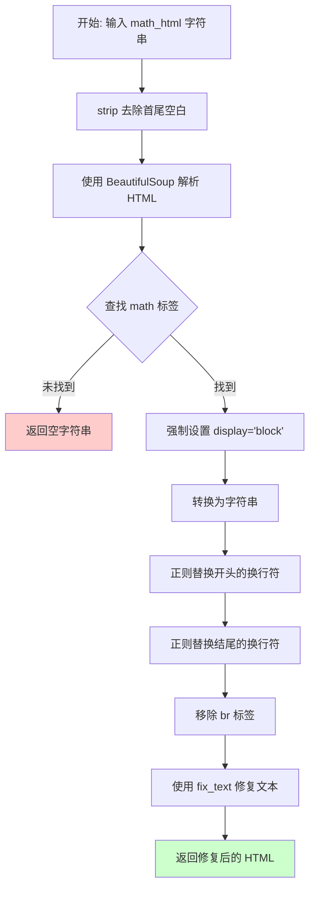

#### 带注释源码

```python
def fix_latex(self, math_html: str):
    """
    修复和格式化LaTeX公式输出
    
    Args:
        math_html: 模型识别出的数学公式HTML字符串
        
    Returns:
        修复和格式化后的HTML字符串
    """
    # 步骤1: 去除输入字符串首尾空白字符
    math_html = math_html.strip()
    
    # 步骤2: 使用BeautifulSoup解析HTML
    soup = BeautifulSoup(math_html, "html.parser")
    
    # 步骤3: 查找math标签
    opening_math_tag = soup.find("math")

    # No math block found - 如果没有找到math标签，返回空字符串
    if not opening_math_tag:
        return ""

    # 步骤4: 强制设置display属性为block（块级显示）
    opening_math_tag.attrs["display"] = "block"
    
    # 步骤5: 重新转换为字符串
    fixed_math_html = str(soup)

    # 步骤6: 正则替换开头的多余换行符
    # 匹配 <math display="block">\n 后面不是字母的情况
    fixed_math_html = re.sub(
        r"^<math display=\"block\">\\n(?![a-zA-Z])",
        '<math display="block">',
        fixed_math_html,
    )
    
    # 步骤7: 正则替换结尾的多余换行符
    fixed_math_html = re.sub(r"\\n</math>$", "</math>", fixed_math_html)
    
    # 步骤8: 移除 br 标签
    fixed_math_html = re.sub(r"<br>", "", fixed_math_html)
    
    # 步骤9: 使用ftfy库的fix_text修复文本
    # unescape_html=True 表示处理HTML实体
    fixed_math_html = fix_text(
        fixed_math_html, config=TextFixerConfig(unescape_html=True)
    )
    
    # 步骤10: 返回修复后的HTML字符串
    return fixed_math_html
```


### `EquationProcessor.get_latex_batched`

批量调用OCR模型识别页面中的公式，将识别结果转换为文本列表返回。

参数：

- `self`：隐式参数，当前 EquationProcessor 实例
- `page_images`：`List[Image.Image]`，待识别公式的页面图像列表
- `bboxes`：`List[List[List[float]]]`，每个页面中公式区域的边界框坐标列表，格式为 [页索引][框索引][4个坐标点]

返回值：`List[List[str]]`，每页公式识别结果的文本列表，外层列表对应页面，内层列表对应该页各公式的识别文本

#### 流程图

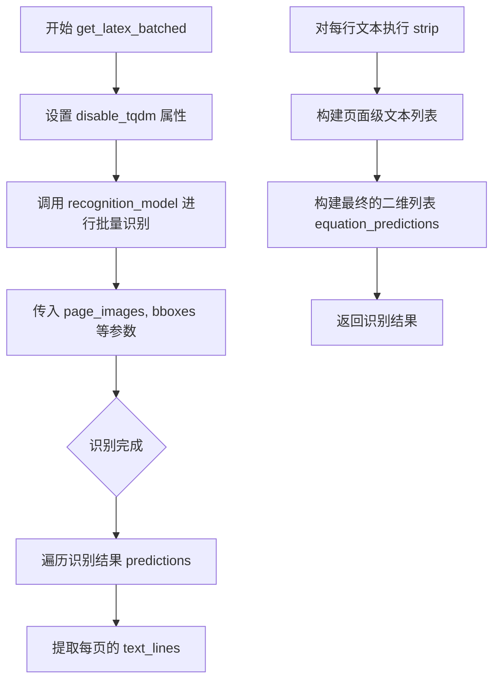

#### 带注释源码

```python
def get_latex_batched(
    self,
    page_images: List[Image.Image],
    bboxes: List[List[List[float]]],
):
    # 配置识别模型的进度条显示行为
    self.recognition_model.disable_tqdm = self.disable_tqdm
    
    # 调用 OCR 识别模型进行批量推理
    # 返回 OCRResult 对象列表，每个元素对应一页的识别结果
    predictions: List[OCRResult] = self.recognition_model(
        images=page_images,                           # 页面图像列表
        bboxes=bboxes,                                # 对应的公式区域边界框
        task_names=["ocr_with_boxes"] * len(page_images),  # 任务类型标记
        recognition_batch_size=self.get_batch_size(), # 获取批处理大小
        sort_lines=False,                             # 不进行行排序
        drop_repeated_text=self.drop_repeated_text,  # 是否丢弃重复文本
        max_tokens=2048,                             # 最大 token 数
        max_sliding_window=2148,                     # 滑动窗口最大值
    )

    # 从识别结果中提取文本
    # 外层列表对应页面，内层列表对应该页每个公式区域的识别文本
    equation_predictions = [
        [line.text.strip() for line in page_prediction.text_lines]
        for page_prediction in predictions
    ]

    # 返回格式: List[List[str]]，每个元素是公式识别后的文本字符串
    return equation_predictions
```


### `BaseProcessor.__init__(config)`

这是 `BaseProcessor` 类的初始化方法，用于初始化处理器的基本配置。该方法是所有处理器子类的基类初始化逻辑，通常负责配置参数的设置和初始化。

参数：

-  `config`：`Any`，可选配置参数，用于初始化处理器的配置项。如果为 `None`，则使用默认配置。

返回值：`None`，该方法没有返回值，仅进行对象属性的初始化。

#### 流程图

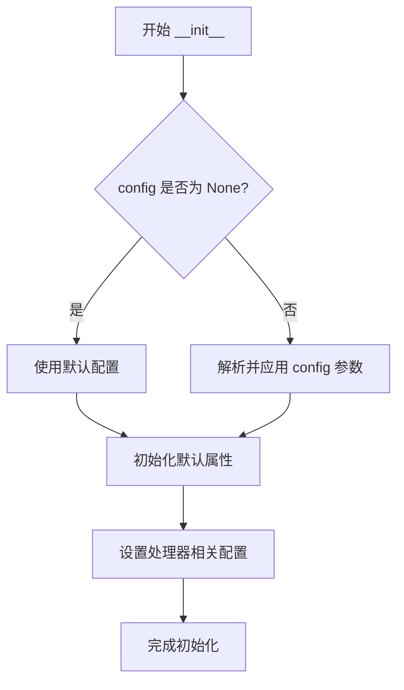

#### 带注释源码

```python
def __init__(self, config=None):
    """
    初始化 BaseProcessor 的基本配置。
    
    参数:
        config: 可选的配置字典或配置对象，用于自定义处理器的行为。
               如果为 None，则使用类中定义的默认值。
    """
    # 如果提供了配置，则将其应用到当前实例
    if config is not None:
        # 遍历配置字典，将配置项设置为实例属性
        for key, value in config.items():
            setattr(self, key, value)
    
    # 初始化处理器所需的默认属性
    # 子类可以在此处添加特定的初始化逻辑
    self._initialized = True
```

**注意**：由于 `BaseProcessor` 是从外部库 `marker.processors` 导入的，上述源码是基于 `EquationProcessor` 中 `super().__init__(config)` 的调用方式以及常见的处理器设计模式推断的。实际的 `BaseProcessor` 实现可能包含更多的初始化逻辑，如：
- 设备配置（CPU/GPU）
- 模型相关的配置
- 批处理大小设置
- 日志和调试选项
- 资源清理相关的属性

如需查看 `BaseProcessor` 的完整实现，建议查阅 `marker` 库的源代码或文档。

## 关键组件


### EquationProcessor 类

文档公式识别处理器，负责从文档中识别并处理数学方程块。使用 Surya OCR 模型进行方程识别，并修复 LaTeX 格式输出。

### BaseProcessor 基类

处理器基类，定义处理器接口规范，提供配置管理和通用处理流程。

### RecognitionPredictor 模型

Surya 库的 OCR 识别预测器，用于执行方程文本识别任务，支持批量处理和滑动窗口机制。

### Document 文档对象

Marker 库的文档对象，包含页面和块结构，提供 get_image、get_block、contained_blocks 等方法访问文档内容。

### get_batch_size 方法

计算方程识别的批处理大小。根据设备类型（CUDA/MPS/CPU）动态调整批处理参数，CUDA 为 32，MPS 为 6，CPU 为 6。

### __call__ 方法

主处理流程。遍历文档所有页面，提取方程块的边界框，调用 OCR 模型识别方程文本，并将结果修复后写入文档块。

### fix_latex 方法

LaTeX 格式修复函数。清理模型输出的多余换行符，强制使用块级显示格式，使用 ftfy 库修复文本编码问题。

### get_latex_batched 方法

批量方程识别接口。调用 RecognitionPredictor 对多页图像和对应的边界框进行 OCR 识别，提取文本行结果。

### MATH_TAG_PATTERN 正则表达式

用于匹配数学标签的正则模式，识别文档中的 math 元素。

### BlockTypes.Equation 块类型

标记方程块的类型常量，用于过滤和识别文档中的方程内容块。


## 问题及建议


### 已知问题

- **硬编码的批量大小和令牌数**: `get_batch_size()` 方法中硬编码了 CUDA (32) 和 MPS (6) 的批量大小，同时 `get_latex_batched` 方法中硬编码了 `max_tokens=2048` 和 `max_sliding_window=2148`，缺乏灵活性。
- **缺少异常处理**: `__call__` 和 `get_latex_batched` 方法没有任何 try-except 块，如果 OCR 模型失败或返回异常，整个处理流程会中断。
- **使用 assert 进行运行时检查**: 在 `__call__` 方法中使用 assert 验证预测数量与块数量匹配，这在生产环境中可能被 Python 优化选项 (-O) 禁用。
- **正则表达式重复编译**: `fix_latex` 方法中每次调用都重新编译正则表达式，而不是作为类或模块级常量。
- **图像资源未显式释放**: 循环中获取 `highres=True` 的页面图像可能占用大量内存，对于大型文档缺乏资源管理。
- **空值检查缺失**: `get_latex_batched` 返回的 `predictions` 可能为 None 或空列表，但调用方未做防御性检查。
- **类型注解不完整**: `__init__` 方法的 `config` 参数缺少类型注解，`get_latex_batched` 的 `bboxes` 参数可以更精确。
- **魔法数字**: 代码中存在多个魔法数字（如 1024、2048、2148），缺乏解释性。

### 优化建议

- 将硬编码的批量大小和令牌数提取为类属性或配置文件，参考 `model_max_length` 的做法。
- 添加异常处理机制，使用日志记录错误，并根据需要抛出自定义异常或返回降级结果。
- 将 assert 替换为显式的条件检查和异常抛出，提高可靠性。
- 将正则表达式编译移到类级别或模块级别作为常量，避免重复编译开销。
- 考虑实现上下文管理器或显式的资源清理方法，或使用生成器模式处理页面图像以减少内存峰值。
- 在关键位置添加空值检查和早期返回，提高代码健壮性。
- 完善类型注解和文档字符串，特别是对参数和返回值的描述。
- 将魔法数字定义为具名常量，提高代码可读性和可维护性。

## 其它


### 设计目标与约束

本模块的核心设计目标是实现文档中数学公式（LaTeX）的自动识别与处理。作为marker框架的一个处理器组件，EquationProcessor需要遵循框架的BaseProcessor接口规范，在保证识别准确性的同时兼顾处理效率。设计约束包括：必须支持多种BlockTypes但仅处理Equation类型；需要在有限的token长度（model_max_length=1024）内完成识别；需要适配不同的运行设备（cuda/mps/cpu）并自动选择最优批处理大小；输出必须符合HTML math标签规范且支持block显示模式。

### 错误处理与异常设计

代码中的错误处理主要包含以下几个方面：对于空文档或无公式的情况，直接返回而不进行后续处理；对预测结果数量与公式块数量进行断言校验，确保一一对应关系；使用BeautifulSoup的html.parser解析HTML并处理可能的解析异常；通过fix_text和TextFixerConfig处理HTML转义和特殊字符问题。潜在改进空间包括：为识别模型调用添加超时机制和处理失败的重试逻辑；当OCR结果为空或识别置信度过低时应该记录警告日志而非静默忽略；可以考虑为不同类型的识别失败定义具体的异常类以便调用方进行差异化处理。

### 数据流与状态机

整体数据流遵循以下流程：Document对象输入 -> 遍历页面提取公式块和对应图像 -> 收集所有页面的公式位置信息 -> 调用RecognitionPredictor进行批量识别 -> 对每个识别结果进行LaTeX修复和格式化 -> 将修复后的HTML写回Document的对应块。状态机方面，处理器内部主要包含两个状态阶段：准备阶段（收集图像和坐标信息）和处理阶段（执行识别和结果写入）。由于公式识别是独立的批处理过程，页面之间没有状态依赖，可以支持并行处理多个页面。

### 外部依赖与接口契约

本模块依赖以下外部组件：PIL（Pillow）用于图像处理；re模块用于正则表达式匹配；BeautifulSoup用于HTML解析和修改；ftfy库用于文本修复；Surya库的RecognitionPredictor用于OCR识别；marker框架的BaseProcessor基类、Document模型、BlockTypes枚举和settings配置。接口契约方面：__call__方法接受Document对象并就地修改其内容；get_batch_size方法返回整数类型的批处理大小；fix_latex方法接受字符串返回修复后的字符串；get_latex_batched方法接受图像列表和边界框列表返回识别结果列表。所有方法均为同步调用，未见异步接口定义。

### 性能考虑与优化空间

当前实现存在以下性能考量点：批处理大小根据设备类型动态调整（cuda为32，mps为6，cpu为6），但该值可能需要根据实际显存进行调优；使用get_latex_batched进行批量处理而非逐个识别，有利于提高吞吐量；图像使用highres=True获取高分辨率图像，这对公式识别精度有益但会增加内存消耗。优化空间包括：可以考虑实现结果缓存机制避免重复识别；可以增加批处理的动态调整策略，根据识别耗时自动调节；可以支持多进程或多GPU并行处理不同页面；对于大量小公式可以考虑合并识别策略减少调用开销。

### 配置管理与扩展性

类中定义了多个可配置参数：block_types指定要处理的块类型（当前固定为Equation）；model_max_length设置模型最大token数；equation_batch_size允许自定义批处理大小；disable_tqdm控制进度条显示；drop_repeated_text控制是否丢弃重复文本。这些参数通过Annotated进行类型标注和描述，支持运行时配置。扩展性方面：可以通过修改block_types处理其他类型的块（如表格、图表等）；可以继承BaseProcessor创建类似的处理器；识别模型可以替换为其他支持相同接口的OCR模型；fix_latex方法可以扩展支持更多的LaTeX修复规则。

### 并发与线程安全性

当前实现为单线程同步处理，未见显式的线程同步机制。由于Document对象的修改操作在单个调用链中完成，不存在多线程并发修改同一Document的问题。但需要注意：如果在多线程环境中共享RecognitionPredictor模型实例，需要确保该实例本身是线程安全的（通常深度学习模型在推理时需要GIL保护或使用线程锁）。可以考虑的改进包括：添加模型级别的锁保护；或为每个线程创建独立的模型实例。

### 资源管理与生命周期

资源管理方面：PIL Image对象在获取后存储在列表中，方法结束后自动被垃圾回收；RecognitionPredictor模型在初始化时注入，由外部框架负责生命周期管理；无显式的资源释放逻辑（无__del__或close方法）。建议改进：在处理大量文档后应该显式释放大图像对象的引用；可以考虑实现上下文管理器协议（__enter__/__exit__）以支持with语句的资源自动释放；长时间运行时应该定期清理临时数据避免内存泄漏。

### 监控与日志

当前代码中未包含显式的日志记录语句，仅通过disable_tqdm参数控制进度条显示。建议增加的监控点包括：记录处理的文档数量和公式总数；记录识别耗时和总耗时用于性能监控；记录识别失败的块ID和错误类型；添加度量指标如每秒处理的公式数量；可以集成Python的logging模块输出结构化日志便于后续分析。

### 测试策略建议

建议补充以下测试用例：空文档处理测试；无公式文档的处理测试；单页单公式、多页多公式的边界情况测试；不同设备（cuda/mps/cpu）下的批处理大小选择测试；OCR识别结果为空时的异常处理测试；HTML解析异常情况下的容错测试；fix_latex方法对各种LaTeX格式的修复效果测试；与BaseProcessor基类的接口兼容性测试。可以使用mock对象模拟RecognitionPredictor以进行单元测试。

### 安全考虑

当前代码处理的是文档内容，需要关注以下安全点：BeautifulSoup解析HTML时应该考虑禁用不安全的标签和属性；fix_text调用时应该检查unescape_html参数可能带来的XSS风险；输入的Document对象来源需要验证；处理结果写回Document时应该防止HTML注入攻击。建议在fix_latex方法中添加HTML净化（sanitization）步骤，确保输出的math标签只包含安全属性。

### 版本兼容性与依赖管理

代码使用了类型注解（Annotated、List、Tuple）需要Python 3.9+；依赖的marker框架版本需要与当前代码兼容；Surya库的RecognitionPredictor接口可能随版本变化，需要锁定兼容版本；Pillow、BeautifulSoup、ftfy等库应指定版本范围。建议使用requirements.txt或pyproject.toml明确声明所有依赖及其兼容版本。


    