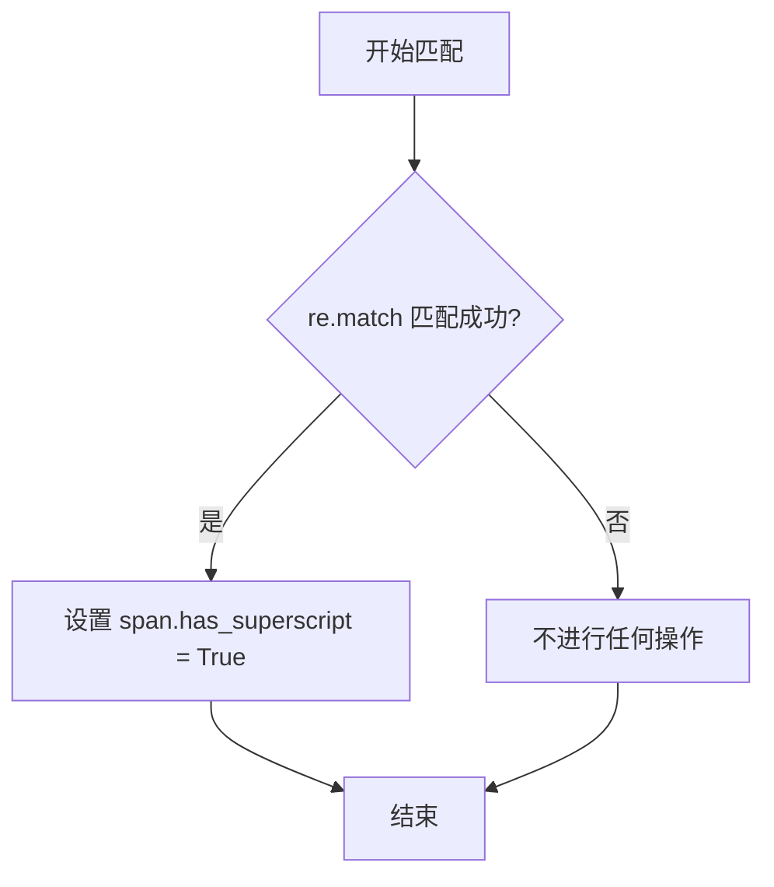
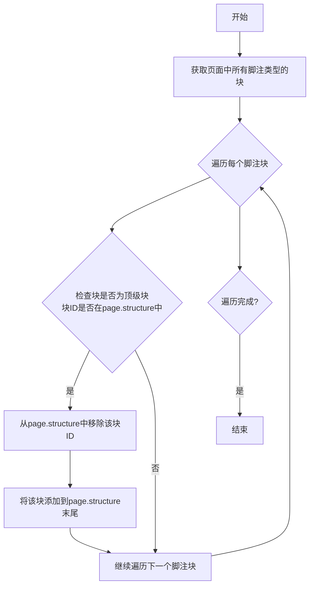

# `marker\marker\processors\footnote.py` 详细设计文档

这是一个脚注处理器，负责将文档中的脚注（footnotes）移动到页面底部，并重新标记被错误识别的文本块，同时为脚注中的特定内容分配上标属性。

## 整体流程

```mermaid
graph TD
    A[开始] --> B[遍历document.pages]
B --> C{还有页面未处理?}
C -- 是 --> D[获取当前页]
C -- 否 --> Z[结束]
D --> E[push_footnotes_to_bottom]
E --> F[获取脚注块]
F --> G{脚注块是顶层结构?}
G -- 是 --> H[从structure中移除并添加到末尾]
G -- 否 --> I[assign_superscripts]
I --> J[获取脚注块中的Span]
J --> K{正则匹配 ^\[0-9\W\]+ ?}
K -- 是 --> L[设置has_superscript=True]
K -- 否 --> M[跳出循环]
L --> C
H --> I
```

## 类结构

```
BaseProcessor (基类)
└── FootnoteProcessor (脚注处理器)
```

## 全局变量及字段


### `re`
    
Python正则表达式模块，用于文本模式匹配

类型：`module`
    


### `BaseProcessor`
    
marker.processors中的基类处理器，提供处理器的基础接口

类型：`class`
    


### `BlockTypes`
    
marker.schema中的块类型枚举，定义文档中各种块的类型

类型：`enum`
    


### `Document`
    
marker.schema.document中的文档类，表示整个文档的结构和数据

类型：`class`
    


### `PageGroup`
    
marker.schema.groups中的页面组类，表示文档中的单个页面及其结构

类型：`class`
    


### `FootnoteProcessor.block_types`
    
类属性，指定该处理器处理的块类型为脚注类型

类型：`tuple[BlockTypes.Footnote]`
    
    

## 全局函数及方法


### `re.match`

`re.match` 是 Python 标准库 `re` 模块中的正则表达式匹配函数，用于从字符串开头匹配正则表达式模式。在本代码中，它用于检测脚注文本是否以数字或非字母数字字符开头，以判断是否为上标格式。

参数：

- `pattern`：`str`，正则表达式模式字符串，代码中为 `r"^[0-9\W]+"`，匹配以数字或非单词字符开头的字符串
- `string`：`str`，要匹配的文本，代码中为 `span.text`，即脚注块中文本的 span 内容

返回值：`re.Match | None`，如果从字符串开头匹配成功，返回一个 Match 对象；否则返回 `None`

#### 流程图



#### 带注释源码

```python
# 导入 re 模块以使用正则表达式功能
import re

# ... (其他导入和类定义)

def assign_superscripts(self, page: PageGroup, document: Document):
    """
    为脚注块中的 span 分配上标属性
    """
    # 获取当前页面的所有脚注块
    footnote_blocks = page.contained_blocks(document, self.block_types)

    # 遍历每个脚注块
    for block in footnote_blocks:
        # 遍历脚注块中的所有 span
        for span in block.contained_blocks(document, (BlockTypes.Span,)):
            # 使用 re.match 检查 span 文本是否以数字或非单词字符开头
            # pattern: r"^[0-9\W]+" - 匹配开头的一个或多个数字或非单词字符
            # string: span.text - 要匹配的文本内容
            # 返回值: Match 对象如果匹配成功, None 如果匹配失败
            if re.match(r"^[0-9\W]+", span.text):
                # 如果匹配成功,将该 span 标记为上标
                span.has_superscript = True
            # 只处理第一个 span,然后跳出内层循环
            break
```


### `FootnoteProcessor.__call__`

该方法是 `FootnoteProcessor` 类的核心调用入口，遍历文档中的所有页面，对每个页面调用 `push_footnotes_to_bottom` 将脚注推到页面底部，并调用 `assign_superscripts` 为脚注文本分配上标属性。

参数：

- `self`：`FootnoteProcessor`，`FootnoteProcessor` 类的实例本身
- `document`：`Document`，待处理的文档对象，包含所有页面和脚注信息

返回值：`None`，该方法不返回任何值，仅执行副作用操作

#### 流程图

```mermaid
graph TD
    A[开始 __call__] --> B[遍历 document.pages 中的所有页面]
    B --> C{当前是否还有未处理的页面}
    C -->|是| D[获取当前页面 page]
    C -->|否| H[结束]
    D --> E[调用 push_footnotes_to_bottom(page, document)]
    E --> F[调用 assign_superscripts(page, document)]
    F --> B
```

#### 带注释源码

```python
def __call__(self, document: Document):
    """
    处理文档中的所有页面，将脚注推到页面底部并分配上标。
    
    参数:
        document: Document 对象，包含要处理的文档内容
    """
    # 遍历文档中的所有页面
    for page in document.pages:
        # 将当前页面的脚注推到页面底部
        self.push_footnotes_to_bottom(page, document)
        # 为当前页面的脚注分配上标标记
        self.assign_superscripts(page, document)
```


### `FootnoteProcessor.push_footnotes_to_bottom`

该方法用于将文档页面中的脚注块移动到页面结构的底部，确保脚注在文档中显示在正确位置。它首先获取当前页面的所有脚注类型块，然后遍历这些块，检查是否为顶级块，如果是则将其从页面结构中移除并重新添加到结构末尾。

参数：

- `self`：`FootnoteProcessor`，隐含的实例自身参数
- `page`：`PageGroup`，页面组对象，包含页面的结构和块信息，用于定位和操作脚注块
- `document`：`Document`，文档对象，提供对所有页面和块的访问能力，用于检索脚注块的内容

返回值：`None`，该方法直接修改 `page` 对象的结构，不返回任何值

#### 流程图



#### 带注释源码

```python
def push_footnotes_to_bottom(self, page: PageGroup, document: Document):
    """
    将脚注块移动到页面结构的底部
    
    参数:
        page: PageGroup - 页面组对象，包含页面的结构和块
        document: Document - 文档对象，用于检索块信息
    """
    # 获取当前页面中所有脚注类型的块
    # 调用contained_blocks方法，传入脚注类型的元组
    footnote_blocks = page.contained_blocks(document, self.block_types)

    # 遍历所有脚注块
    for block in footnote_blocks:
        # 检查该块是否为顶级块
        # 通过检查块的ID是否存在于页面的structure列表中来判断
        if block.id in page.structure:
            # 如果是顶级块，先从页面结构中移除
            page.structure.remove(block.id)
            # 然后重新添加到页面结构的末尾，实现推到底部的效果
            page.add_structure(block)
```


### `FootnoteProcessor.assign_superscripts`

该方法用于将脚注块中的跨度（Span）标记为上标（superscript），通过正则表达式匹配脚注编号（数字或非单词字符），并设置 `has_superscript` 属性为 `True`。

参数：

- `self`：`FootnoteProcessor`，类的实例本身
- `page`：`PageGroup`，页面组对象，包含当前处理的页面信息
- `document`：`Document`，文档对象，用于访问文档内容和结构

返回值：`None`，该方法无返回值，直接修改 `span` 对象的 `has_superscript` 属性

#### 流程图

```mermaid
flowchart TD
    A[开始 assign_superscripts] --> B[获取脚注块列表]
    B --> C{遍历每个脚注块}
    C --> D[获取块中的所有 Span]
    D --> E{遍历每个 Span}
    E --> F{正则匹配 Span 文本}
    F -->|匹配成功 ^[0-9\W]+| G[设置 span.has_superscript = True]
    F -->|匹配失败| H[跳过]
    G --> I[break 跳出循环]
    H --> I
    I --> C
    C --> J[结束]
    
    style G fill:#ff9999
    style I fill:#ffcc99
```

#### 带注释源码

```python
def assign_superscripts(self, page: PageGroup, document: Document):
    """
    为脚注块中的跨度标记上标属性
    
    参数:
        page: PageGroup - 当前处理的页面组对象
        document: Document - 文档对象，用于访问块内容
    返回:
        None
    """
    # 1. 获取当前页面中所有脚注类型的块
    footnote_blocks = page.contained_blocks(document, self.block_types)

    # 2. 遍历每个脚注块
    for block in footnote_blocks:
        # 3. 获取该脚注块中所有的 Span（文本跨度）
        for span in block.contained_blocks(document, (BlockTypes.Span,)):
            # 4. 使用正则表达式检查文本是否以数字或非单词字符开头
            #    ^[0-9\W]+ 匹配：数字开头，或非单词字符（标点符号等）开头
            if re.match(r"^[0-9\W]+", span.text):
                # 5. 如果匹配成功，设置该 span 为上标
                span.has_superscript = True
            # 6. 【注意】这里存在逻辑问题：break 在 if 外面
            #    这意味着只检查每个脚注块的第一个 span 就跳出循环
            #    可能是技术债务或逻辑错误
            break
```

#### 潜在技术债务

1. **逻辑错误**：`break` 语句位于 `if` 块外部，导致对于每个脚注块只检查第一个 `span`，无论是否匹配都会跳出循环。如果脚注编号不在第一个 `span` 中，将无法正确识别
2. **正则表达式局限**：`r"^[0-9\W]+"` 只匹配以数字或非单词字符开头的文本，可能遗漏其他格式的脚注编号（如罗马数字、字母等）
3. **缺少错误处理**：没有处理 `contained_blocks` 返回空列表或 `span.text` 为 `None` 的边界情况

## 关键组件


### FootnoteProcessor 类

处理脚注的核心类，继承自 BaseProcessor，负责将脚注推送到页面底部并重新标记错误标记的文本块。

### push_footnotes_to_bottom 方法

将脚注块移动到页面底部的逻辑，通过从页面结构中移除脚注块并重新添加到结构末尾来实现。

### assign_superscripts 方法

为脚注块中的上标文本分配标记，使用正则表达式匹配数字和非单词字符开头的 span 文本。

### block_types 类属性

定义了要处理的块类型为 Footnote 类型，用于过滤和识别文档中的脚注块。

### 正则表达式匹配逻辑

使用 `^[0-9\W]+` 正则表达式识别以数字或非单词字符开头的文本，用于判断是否为上标内容。

### 页面结构管理

通过 page.structure 管理页面中块的顺序，支持块的移除和添加操作，实现脚注位置的调整。


## 问题及建议


### 已知问题

-   **逻辑错误 - assign_superscripts 中的 break 语句**：在遍历 span 的循环中，`break` 语句位于循环内部而非条件判断后，导致每次仅检查每个 block 的第一个 span 就会被中断退出，无法检查所有 span。如果意图是只检查第一个 span，建议添加注释说明；如果是 bug，应移除 break 以检查所有 span。
-   **正则表达式未预编译**：`re.match(r"^[0-9\W]+", span.text)` 在每次调用时都会重新编译正则表达式，建议将其预编译为类常量以提升性能。
-   **重复调用 contained_blocks**：两个方法 `push_footnotes_to_bottom` 和 `assign_superscripts` 都独立调用了 `page.contained_blocks(document, self.block_types)`，造成重复计算，建议在 `__call__` 中获取一次后传递给两个方法。
-   **缺少类型注解**：方法参数和部分局部变量缺少类型注解（如 `block`、`footnote_blocks` 等），影响代码可读性和静态分析。
-   **空列表未做处理**：当 `footnote_blocks` 为空时，代码仍会执行遍历操作，虽然不会报错但无实际意义，可添加早期返回优化。
-   **注释与代码不一致**：代码中没有明确说明"relabeling mislabeled text blocks"这一功能的具体实现，类文档描述与实际功能可能有偏差。

### 优化建议

-   预编译正则表达式为类常量：`SUPERSCRIPT_PATTERN = re.compile(r"^[0-9\W]+")`，并相应修改调用方式。
-   在 `__call__` 方法中预先获取 `footnote_blocks`，避免重复调用。
-   为所有方法参数和关键变量添加类型注解。
-   检查 `assign_superscripts` 中 `break` 的业务逻辑是否为预期行为，必要时移除或添加说明注释。
-   添加输入参数的空值检查和早期返回逻辑，提升代码健壮性。

## 其它


### 设计目标与约束

本处理器的主要设计目标是将文档中的脚注（footnotes）移动到页面底部，并对包含数字或符号的脚注文本标记为上标格式。设计约束包括：1) 仅处理BlockTypes.Footnote类型的块；2) 依赖Document和PageGroup对象的数据结构；3) 假设传入的document对象包含有效的pages集合。

### 错误处理与异常设计

当前代码缺少显式的错误处理机制。潜在风险包括：1) 如果document.pages为None或空，for循环将静默跳过；2) 如果page.contained_blocks返回None可能导致AttributeError；3) 如果block.id不在page.structure中，remove操作会抛出ValueError。建议添加空值检查和异常捕获逻辑。

### 数据流与状态机

数据流：Document对象 → 遍历pages → 对每个PageGroup调用push_footnotes_to_bottom和assign_superscripts → 修改page.structure和span.has_superscript属性。无复杂状态机，仅包含两个主要状态转换：脚注块从原位置移除并添加到结构底部，以及span的has_superscript属性被设置为True。

### 外部依赖与接口契约

主要依赖：1) marker.processors.BaseProcessor - 基类，定义处理器接口；2) marker.schema.BlockTypes - 枚举类型，定义块类型；3) marker.schema.document.Document - 文档数据模型；4) marker.schema.groups.PageGroup - 页面组数据模型。接口契约：__call__方法接受Document对象并原地修改，无返回值；contained_blocks方法返回指定类型的块列表；structure属性用于管理页面块的层级顺序。

### 性能考量与优化空间

1) 在assign_superscripts中，break语句位于for循环内部，导致每个footnote_block仅处理第一个Span，逻辑可能不完整；2) 重复调用page.contained_blocks两次，可缓存结果；3) 正则表达式re.match(r"^[0-9\W]+", span.text)可预编译以提升性能；4) push_footnotes_to_bottom中多次操作page.structure可能产生性能开销，建议批量处理。

### 安全性分析

代码使用正则表达式处理文本内容，未发现SQL注入或命令注入风险。依赖marker库的安全实现，需确保marker库版本保持更新。

### 测试策略建议

建议测试场景：1) 包含多个脚注的页面；2) 脚注文本包含纯数字、纯符号、混合内容；3) 空页面或无脚注的页面；4) 脚注在页面结构中的不同位置；5) 嵌套的块结构。

### 配置与可扩展性

block_types类属性定义了处理的块类型，当前硬编码为Footnote类型。如需扩展支持其他块类型（如Endnote），可将此属性改为可配置或添加更多块类型到元组中。

    