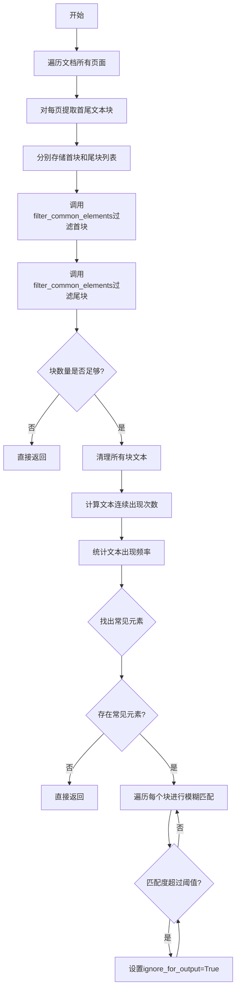
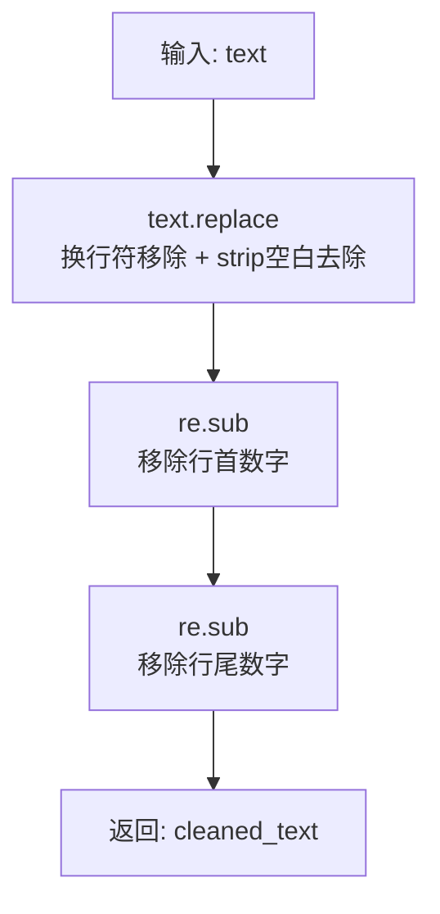
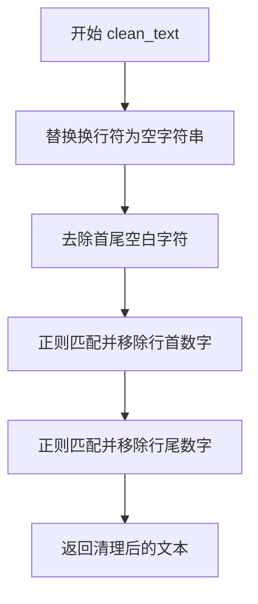
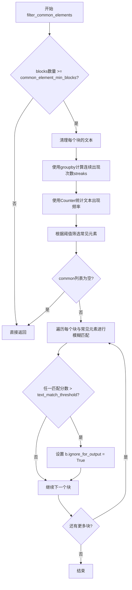

# `marker\marker\processors\ignoretext.py` 详细设计文档

一个文档后处理器，用于识别和过滤文档中重复出现的常见元素（如页眉、页脚、页码等），通过文本相似度匹配和出现频率统计来标记需要忽略的文本块。

## 整体流程



## 类结构

```
BaseProcessor (基类)
└── IgnoreTextProcessor (文本过滤处理器)
```

## 全局变量及字段


### `__call__`
    
处理器入口，遍历文档提取首尾块并过滤常见元素

类型：`Callable[[Document], None]`
    


### `clean_text`
    
静态方法，清理文本去除数字和换行符

类型：`Callable[[str], str]`
    


### `filter_common_elements`
    
核心过滤逻辑，识别并标记常见元素

类型：`Callable[[Document, List[Block]], None]`
    


### `IgnoreTextProcessor.block_types`
    
要处理的文本块类型

类型：`tuple`
    


### `IgnoreTextProcessor.common_element_threshold`
    
文本块出现在多少比例页面上的最小阈值

类型：`float`
    


### `IgnoreTextProcessor.common_element_min_blocks`
    
判定为常见元素的最少出现次数

类型：`int`
    


### `IgnoreTextProcessor.max_streak`
    
连续出现的最大允许次数

类型：`int`
    


### `IgnoreTextProcessor.text_match_threshold`
    
模糊匹配的最小分数(0-100)

类型：`int`
    
    

## 全局函数及方法


### `IgnoreTextProcessor.clean_text`

该静态方法用于清理文本字符串，通过移除换行符、去除首尾空白以及使用正则表达式移除行首和行尾的数字，从而标准化文本内容以便进行后续的相似度比较和公共元素识别。

参数：

- `text`：`str`，需要清理的原始文本字符串

返回值：`str`，清理后的文本字符串，已移除换行符、首尾空白以及行首行尾的数字

#### 流程图



#### 带注释源码

```python
@staticmethod
def clean_text(text):
    """
    静态方法：清理文本字符串
    
    处理步骤：
    1. 移除换行符并去除首尾空白
    2. 使用正则表达式移除行首数字（如 "1. ", "123 "）
    3. 使用正则表达式移除行尾数字（如 " 1", " 123"）
    
    Args:
        text: 需要清理的原始文本字符串
        
    Returns:
        str: 清理后的文本字符串
    """
    # 第一步：移除所有换行符并去除首尾空白字符
    text = text.replace("\n", "").strip()
    
    # 第二步：使用正则表达式移除行首的数字和空白
    # 正则表达式 "^\d+\s*" 匹配：
    #   ^      - 行首位置
    #   \d+    - 一个或多个数字
    #   \s*    - 零个或多个空白字符
    text = re.sub(r"^\d+\s*", "", text)  # remove numbers at the start of the line
    
    # 第三步：使用正则表达式移除行尾的数字和空白
    # 正则表达式 "\s*\d+$" 匹配：
    #   \s*    - 零个或多个空白字符
    #   \d+    - 一个或多个数字
    #   $      - 行尾位置
    text = re.sub(r"\s*\d+$", "", text)  # remove numbers at the end of the line
    
    # 返回清理后的文本
    return text
```


### `IgnoreTextProcessor.__call__`

处理器入口方法，遍历文档提取每个页面的首尾文本块，并调用过滤方法去除常见的重复元素（如页眉、页脚、页码）。

参数：

- `self`：`IgnoreTextProcessor`，当前处理器实例
- `document`：`Document`，待处理的文档对象，包含多个页面

返回值：`None`，该方法直接修改文档中块的属性，不返回任何值

#### 流程图

```mermaid
flowchart TD
    A([开始 __call__]) --> B[初始化空列表: first_blocks, last_blocks]
    B --> C{遍历 document.pages}
    C -->|每页| D[初始化: initial_block = None, last_block = None]
    D --> E{遍历页面内指定类型的块}
    E --> F{块结构存在?}
    F -->|是| G{首次遇到块?}
    G -->|是| H[initial_block = block]
    G -->|否| I
    H --> I
    I --> J[last_block = block]
    J --> E
    F -->|否| E
    E -->|遍历结束| K{initial_block 存在?}
    K -->|是| L[first_blocks.append(initial_block)]
    K -->|否| M
    L --> N{last_block 存在?}
    M --> N
    N -->|是| O[last_blocks.append(last_block)]
    N -->|否| P
    O --> C
    P --> C
    C -->|遍历完成| Q[filter_common_elements(document, first_blocks)]
    Q --> R[filter_common_elements(document, last_blocks)]
    R --> S([结束])
```

#### 带注释源码

```python
def __call__(self, document: Document):
    """
    处理器入口方法，提取并过滤文档中每页的首尾块
    
    处理流程：
    1. 遍历文档每一页，提取该页的第一个和最后一个文本块
    2. 分别收集到 first_blocks 和 last_blocks 列表
    3. 对两个列表调用 filter_common_elements 过滤常见元素
    """
    # 存储每页的首块（第一个文本块）
    first_blocks = []
    # 存储每页的尾块（最后一个文本块）
    last_blocks = []
    
    # 遍历文档中的所有页面
    for page in document.pages:
        # 初始化当前页的首块和尾块
        initial_block = None
        last_block = None
        
        # 遍历当前页中符合条件的所有块（Text、SectionHeader、TextInlineMath）
        for block in page.contained_blocks(document, self.block_types):
            # 仅处理有结构的块
            if block.structure is not None:
                # 记录第一个符合条件的块作为首块
                if initial_block is None:
                    initial_block = block
                
                # 持续更新尾块为最后遍历到的块
                last_block = block
        
        # 将当前页的首块添加到列表（如果存在）
        if initial_block is not None:
            first_blocks.append(initial_block)
        # 将当前页的尾块添加到列表（如果存在）
        if last_block is not None:
            last_blocks.append(last_block)
    
    # 过滤首块中的常见元素（页眉等）
    self.filter_common_elements(document, first_blocks)
    # 过滤尾块中的常见元素（页脚、页码等）
    self.filter_common_elements(document, last_blocks)
```


### IgnoreTextProcessor.clean_text

该静态方法用于清理文本内容，通过移除换行符、首尾空白字符以及行首行尾的数字（通常为页码），为后续的文本匹配和比对提供标准化的输入格式。

参数：

- `text`：`str`，需要清理的原始文本内容

返回值：`str`，清理后的文本内容

#### 流程图



#### 带注释源码

```python
@staticmethod
def clean_text(text):
    """
    清理文本，去除换行符和数字（用于页码去除）
    
    处理步骤：
    1. 移除所有换行符
    2. 去除首尾空白
    3. 移除行首数字（可能是页码或编号）
    4. 移除行尾数字（可能是页码或编号）
    """
    # 第一步：移除文本中的换行符，并将结果 strip 去除首尾空白
    text = text.replace("\n", "").strip()
    
    # 第二步：使用正则表达式移除行首的数字（可能有空格）
    # 例如："1 Introduction" -> "Introduction"
    # 正则解释：^ 表示行首，\d+ 表示一个或多个数字，\s* 表示零个或多个空白字符
    text = re.sub(r"^\d+\s*", "", text)  # remove numbers at the start of the line
    
    # 第三步：使用正则表达式移除行尾的数字（可能有空格）
    # 例如："Page 1" -> "Page "
    # 正则解释：\s* 表示零个或多个空白字符，\d+$ 表示一个或多个数字并以数字结尾
    text = re.sub(r"\s*\d+$", "", text)  # remove numbers at the end of the line
    
    # 返回清理后的文本
    return text
```


### `IgnoreTextProcessor.filter_common_elements`

该方法用于识别并标记文档中的常见元素（如页眉、页脚、页码等重复性内容）。通过统计文本出现频率和连续出现次数来判断哪些元素是常见的，并将匹配到的元素标记为忽略，以防止这些非核心内容干扰文档结构分析。

参数：

- `self`：`IgnoreTextProcessor`，类的实例引用，包含配置阈值
- `document`：`Document`，文档对象，用于获取块的原始文本
- `blocks`：`List[Block]`，待分析的块列表（通常为每页的首块或尾块）

返回值：`None`，该方法直接修改 `Block` 对象的 `ignore_for_output` 属性，无返回值

#### 流程图



#### 带注释源码

```python
def filter_common_elements(self, document, blocks: List[Block]):
    # 检查是否有足够的块来分析常见元素
    # 如果块数量少于最小阈值，则无法有效识别常见元素，直接返回
    if len(blocks) < self.common_element_min_blocks:
        return

    # 清理每个块的原始文本：去除换行符、首尾空白、首尾数字
    # clean_text 是静态方法，负责标准化文本以便比较
    text = [self.clean_text(b.raw_text(document)) for b in blocks]

    # 使用 groupby 计算每个文本的连续出现次数（streak）
    # 例如：['a', 'a', 'b', 'a', 'a'] -> 'a'的最大streak为2，'b'为1
    # streaks 字典存储每个唯一文本的最大连续出现次数
    streaks = {}
    for key, group in groupby(text):
        streaks[key] = max(streaks.get(key, 0), len(list(group)))

    # 统计每个文本在所有块中的总出现次数
    counter = Counter(text)

    # 筛选常见元素的条件：
    # 1. 出现次数 >= 总块数 * 阈值比例 (frequency condition)
    #    或 连续出现次数 >= 最大连续阈值 (streak condition)
    # 2. 总出现次数 > 最小块数阈值（确保不是偶然出现）
    common = [
        k for k, v in counter.items()
        if (v >= len(blocks) * self.common_element_threshold or streaks[k] >= self.max_streak)
        and v > self.common_element_min_blocks
    ]

    # 如果没有找到常见元素，直接返回
    if len(common) == 0:
        return

    # 遍历每个块，与常见元素列表进行模糊匹配
    for t, b in zip(text, blocks):
        # 检查当前块的文本是否与任一常见元素相似
        # 使用 rapidfuzz 的 fuzz.ratio 计算相似度分数
        # 如果任一常见元素的匹配分数超过阈值，则标记该块为忽略
        if any(fuzz.ratio(t, common_element) > self.text_match_threshold for common_element in common):
            b.ignore_for_output = True
```

## 关键组件


### IgnoreTextProcessor 类

主处理器类，用于识别和忽略文档中的常见文本块（如页眉、页脚、页码等重复性内容）。

### block_types 属性

定义了需要处理的文档块类型，包括 Text、SectionHeader 和 TextInlineMath。

### common_element_threshold 参数

最小比例阈值，用于确定文本块在多少比例的页面中出现时才被识别为常见元素。

### common_element_min_blocks 参数

最小块数阈值，确保只有出现次数达到一定数量的块才会被考虑为常见元素。

### max_streak 参数

最大连续出现次数阈值，用于识别连续重复的文本块（如连续的页眉或页脚）。

### text_match_threshold 参数

模糊匹配的最小分数（0-100），用于判断文本块是否与常见元素相似。

### __call__ 方法

遍历文档的每一页，提取每个页面的第一个和最后一个指定类型的块，然后调用过滤方法处理这些块。

### clean_text 静态方法

清理文本内容，去除换行符、首尾空格，以及行首行尾的数字（用于处理页码）。

### filter_common_elements 方法

核心过滤逻辑，计算文本出现频率和连续出现次数，根据阈值判断是否为常见元素，并将匹配的块标记为忽略。

### BaseProcessor 基类

处理器基类，提供了处理器的基础接口和通用功能。

### Document 文档类

表示整个文档对象，包含页面集合和块结构。

### Block 块类

表示文档中的基本内容块，包含原始文本和结构信息。

### rapidfuzz.fuzz.ratio 模糊匹配

使用 rapidfuzz 库进行模糊字符串匹配，计算两个文本之间的相似度分数。

### groupby 连续分组

使用 itertools.groupby 对连续出现的相同文本进行分组，计算最大连续出现次数。

### Counter 频率统计

使用 collections.Counter 统计文本块的出现频率，辅助识别常见元素。


## 问题及建议


### 已知问题

-   **streaks 计算逻辑错误**：使用 `groupby` 计算连续出现次数时，`len(list(group))` 会消耗迭代器，导致无法正确获取完整的分组长度。且 `groupby` 只能识别连续相同的元素，无法得到真正的最大出现次数。
-   **模糊匹配性能问题**：`filter_common_elements` 中使用嵌套循环对每个文本块与所有 common 元素进行模糊匹配，时间复杂度为 O(n*m*k)，其中 n 为块数量，m 为 common 元素数量，k 为模糊匹配计算量。
-   **正则表达式重复编译**：`clean_text` 方法中每次调用都重新编译正则表达式 `^\d+\s*` 和 `\s*\d+$`，未预编译正则表达式。
-   **列表推导式内存占用**：一次性将所有 blocks 的清理后文本加载到内存中，对于大型文档会占用较多内存。
-   **索引配对风险**：`zip(text, blocks)` 假设两个列表顺序一致，但 `clean_text` 可能产生相同的文本，导致与原始 blocks 配对错位。
-   **缺少输入验证**：`__call__` 方法未验证 `document` 参数的有效性，未检查 `document.pages` 是否为空。

### 优化建议

-   **修复 streaks 计算**：使用 `Counter` 替代 `groupby` 来计算每个文本的出现次数，或在 `groupby` 循环中正确累加计数。
-   **预编译正则表达式**：在类级别预编译 `clean_text` 中使用的正则表达式，提升执行效率。
-   **优化模糊匹配**：可考虑使用 `rapidfuzz.process.cdist` 进行批量匹配，或先对 common 元素建立索引（如 Trie 树）减少匹配次数。
-   **增量处理**：对于大型文档，可考虑分批处理 blocks，减少内存峰值。
-   **添加输入验证**：在方法入口添加参数有效性检查，增强健壮性。
-   **提取 magic numbers**：将阈值常量提取为类或模块级配置常量，提高可维护性。

## 其它


### 设计目标与约束

设计目标：该处理器的主要目标是在文档渲染输出时过滤掉常见的重复元素（如页眉、页脚、页码等），以减少冗余信息的干扰，提高文档处理的准确性和效率。

约束条件：
- 仅处理指定的BlockTypes（Text、SectionHeader、TextInlineMath）
- 依赖模糊匹配算法进行文本相似度判断
- 需要足够数量的页面（>= common_element_min_blocks）才能进行有效的公共元素检测

### 错误处理与异常设计

异常处理机制：
- 当blocks列表长度小于common_element_min_blocks时，直接返回，不进行过滤操作
- 当common元素列表为空时，直接返回，避免无效的遍历操作
- 使用try-except捕获rapidfuzz库的fuzz.ratio()可能抛出的异常
- 正则表达式操作使用re.sub()，需处理可能的正则表达式错误

边界情况处理：
- 空文档：遍历document.pages时直接跳过
- 页面无符合条件BlockType的block：initial_block和last_block保持None，不加入列表
- 文本清理后为空字符串：仍参与计数和匹配过程

### 数据流与状态机

数据处理流程：
1. 初始化阶段：收集每个页面的第一个和最后一个符合条件的block
2. 文本提取阶段：对收集的blocks进行文本清理
3. 统计阶段：计算文本出现频次和连续出现次数（streaks）
4. 筛选阶段：根据阈值条件识别公共元素
5. 标记阶段：将匹配公共元素的block标记为ignore_for_output=True

状态转换：
- 初始状态：block.ignore_for_output = False
- 处理后状态：block.ignore_for_output = True（对于被识别为公共元素的block）

### 外部依赖与接口契约

外部依赖：
- rapidfuzz库：提供fuzz.ratio()模糊匹配功能
- re库：用于正则表达式文本清理
- collections.Counter：统计文本出现频次
- itertools.groupby：计算连续出现次数
- marker.processors.BaseProcessor：基类接口
- marker.schema.blocks.Block：Block对象结构
- marker.schema.document.Document：文档对象结构

接口契约：
- 输入：Document对象，包含多个Page对象
- 输出：修改Document中block的ignore_for_output属性
- __call__方法：接收Document参数，无返回值
- clean_text静态方法：接收字符串，返回清理后的字符串
- filter_common_elements方法：接收Document和List[Block]参数，无返回值

### 性能考虑

时间复杂度：
- O(n*m) 其中n为blocks数量，m为common元素数量
- 模糊匹配fuzz.ratio()的时间复杂度与字符串长度相关
- groupby和Counter操作复杂度为O(n)

空间复杂度：
- O(n) 用于存储text列表和streaks字典
- O(m) 用于存储common元素列表

优化建议：
- 可以添加缓存机制存储已匹配的模糊匹配结果
- 可以在第一次扫描时直接构建streaks，避免二次遍历
- 对于大型文档，可以考虑分批处理

### 安全性考虑

输入验证：
- 验证document参数不为None
- 验证document.pages可迭代
- 验证block.raw_text()返回有效字符串

文本清理安全：
- 正则表达式使用预编译模式提升性能
- 避免使用eval()或exec()等危险函数
- 处理特殊字符时进行转义

### 可扩展性

扩展方向：
- 添加更多BlockTypes支持
- 实现自定义匹配算法接口
- 添加多语言支持
- 支持配置多个阈值配置文件
- 可扩展为支持自定义过滤规则

模块化设计：
- clean_text方法可独立使用
- filter_common_elements方法支持复用
- 配置参数通过Annotated类型定义，便于外部配置

### 测试策略

单元测试：
- 测试clean_text方法的各种输入输出
- 测试filter_common_elements的阈值逻辑
- 测试边界条件（空列表、单元素列表等）

集成测试：
- 测试与BaseProcessor基类的集成
- 测试在完整Document处理流程中的表现

测试用例设计：
- 典型场景：多页文档包含页眉页脚
- 边界场景：单页文档、无公共元素文档
- 异常场景：空文档、None值输入

### 配置管理

配置参数：
- common_element_threshold：浮点数，默认0.2
- common_element_min_blocks：整数，默认3
- max_streak：整数，默认3
- text_match_threshold：整数，默认90
- block_types：元组，包含Text、SectionHeader、TextInlineMath

配置方式：
- 通过类属性直接定义
- 支持运行时修改
- 可通过子类重写进行自定义

### 并发/线程安全

线程安全性：
- 该处理器设计为无状态或轻量级状态
- 多个Document对象可并行处理
- 同一Document对象不建议并发调用

并发优化：
- 可使用多进程处理多个独立文档
- 建议单进程内串行处理同一文档的不同页面

### 资源管理

内存管理：
- 及时释放不需要的中间变量
- 大型文档建议分批处理
- 避免在循环中创建大量临时对象

资源释放：
- 无外部文件资源需要释放
- 无网络连接资源
- 无数据库连接资源

### 监控与日志

监控指标：
- 被标记为公共元素的block数量
- 处理页面的数量
- 过滤操作的成功/失败次数

日志记录：
- 可添加DEBUG级别日志记录处理详情
- 可添加INFO级别日志记录处理统计
- 可添加WARNING级别日志记录异常情况


    