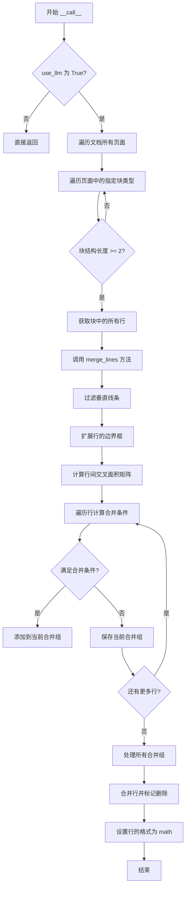
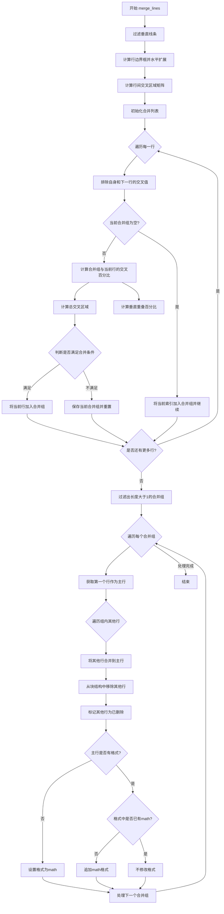
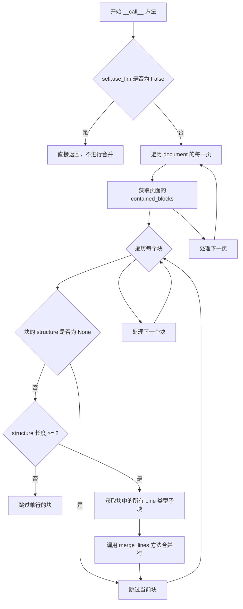

# `marker\marker\processors\line_merge.py` 详细设计文档

一个用于合并文档中行内数学公式行的处理器，通过计算行之间的几何交叉面积和垂直重叠比例来判断是否可以合并，同时支持使用LLM来提高准确性。

## 整体流程



## 类结构

```
BaseProcessor (基类)
└── LineMergeProcessor (行合并处理器)
```

## 全局变量及字段


### `LineMergeProcessor.block_types`
    
处理的块类型元组，包含Text、TextInlineMath、Caption、Footnote和SectionHeader

类型：`tuple`
    


### `LineMergeProcessor.min_merge_pct`
    
最小交叉面积合并百分比，用于判断是否合并线条

类型：`Annotated[float, string]`
    


### `LineMergeProcessor.block_expand_threshold`
    
边界框扩展百分比，用于扩展线条的横向边界

类型：`Annotated[float, string]`
    


### `LineMergeProcessor.min_merge_ydist`
    
行间最小y距离，用于判断线条是否在同一行

类型：`Annotated[float, string]`
    


### `LineMergeProcessor.intersection_pct_threshold`
    
最大交叉块集中度阈值，用于判断合并的交集是否集中

类型：`Annotated[float, string]`
    


### `LineMergeProcessor.vertical_overlap_pct_threshold`
    
最小垂直重叠百分比，用于判断垂直方向的重叠程度

类型：`Annotated[float, string]`
    


### `LineMergeProcessor.use_llm`
    
是否使用LLM提高准确性，控制是否启用LLM增强功能

类型：`Annotated[bool, string]`
    
    

## 全局函数及方法


### `matrix_intersection_area`

计算两个边界框列表之间所有组合的交叉区域面积矩阵，用于确定哪些行（lines）之间存在重叠以及重叠的程度。

参数：

- `bbox_list1`：`List[Tuple[float, float, float, float]]`，第一个边界框列表，每个元素为 (x1, y1, x2, y2) 格式的元组
- `bbox_list2`：`List[Tuple[float, float, float, float]]`，第二个边界框列表，每个元素为 (x1, y1, x2, y2) 格式的元组

返回值：`List[List[float]]`，二维矩阵，其中 `result[i][j]` 表示 `bbox_list1[i]` 与 `bbox_list2[j]` 之间的交叉区域面积

#### 流程图

```mermaid
flowchart TD
    A[开始] --> B[接收两个边界框列表]
    B --> C[初始化结果矩阵]
    C --> D{遍历 bbox_list1 中的每个边界框 i}
    D --> E{遍历 bbox_list2 中的每个边界框 j}
    E --> F{计算边界框 i 和 j 的交叉区域}
    F --> G{交叉区域面积 > 0?}
    G -->|是| H[记录交叉面积到矩阵[i][j]]
    G -->|否| I[记录面积为0]
    H --> J{是否还有下一个 j?}
    I --> J
    J -->|是| E
    J -->|否| K{是否还有下一个 i?}
    K -->|是| D
    K -->|否| L[返回交叉面积矩阵]
    L --> M[结束]
```

#### 带注释源码

```python
# 从 marker.util 模块导入的函数
# 注意：实际实现不在此代码文件中，以下为基于使用方式的推断

def matrix_intersection_area(bbox_list1, bbox_list2):
    """
    计算两个边界框列表之间的交叉面积矩阵。
    
    参数:
        bbox_list1: 第一个边界框列表，格式为 [(x1, y1, x2, y2), ...]
        bbox_list2: 第二个边界框列表，格式为 [(x1, y1, x2, y2), ...]
    
    返回:
        二维矩阵，其中 result[i][j] 表示 bbox_list1[i] 与 bbox_list2[j] 的交叉面积
    """
    # 初始化结果矩阵
    result = []
    
    # 遍历第一个列表中的每个边界框
    for bbox1 in bbox_list1:
        row = []
        # 遍历第二个列表中的每个边界框
        for bbox2 in bbox_list2:
            # 计算两个边界框的交叉区域
            x_left = max(bbox1[0], bbox2[0])
            y_top = max(bbox1[1], bbox2[1])
            x_right = min(bbox1[2], bbox2[2])
            y_bottom = min(bbox1[3], bbox2[3])
            
            # 计算交叉区域宽度和高度
            width = max(0, x_right - x_left)
            height = max(0, y_bottom - y_top)
            
            # 计算面积
            area = width * height
            row.append(area)
        
        result.append(row)
    
    return result


# 在 LineMergeProcessor 中的使用示例:
# line_bboxes = [l.polygon.expand(self.block_expand_threshold, 0).bbox for l in lines]
# intersections = matrix_intersection_area(line_bboxes, line_bboxes)
# # 结果是一个 NxN 矩阵，其中 N 是行的数量
# # intersections[i][j] 表示第 i 行和第 j 行之间的交叉面积
```

#### 在 `LineMergeProcessor.merge_lines` 中的调用上下文

```python
def merge_lines(self, lines: List[Line], block: Block):
    # ... 前置代码省略 ...
    
    # 扩展每个行的边界框（水平方向扩展）
    line_bboxes = [l.polygon.expand(self.block_expand_threshold, 0).bbox for l in lines]
    
    # 计算所有行边界框之间的交叉面积矩阵
    # 返回一个 NxN 的二维列表
    intersections = matrix_intersection_area(line_bboxes, line_bboxes)
    
    # 后续逻辑使用此矩阵判断哪些行应该合并
    # ...
```


### `LineMergeProcessor.__init__`

该方法是 `LineMergeProcessor` 类的构造函数，负责初始化处理器实例。它调用父类 `BaseProcessor` 的构造函数，将配置对象传递给父类，以完成基础处理器的初始化工作。

参数：

-  `config`：未指定类型（通常为配置对象），用于配置处理器的行为参数

返回值：`None`，无返回值

#### 流程图

```mermaid
flowchart TD
    A[开始 __init__] --> B[接收 config 参数]
    B --> C[调用 super().__init__config]
    C --> D[BaseProcessor 初始化]
    D --> E[结束 __init__]
```

#### 带注释源码

```
def __init__(self, config):
    """
    初始化 LineMergeProcessor 实例。
    
    参数:
        config: 配置对象，用于初始化父类 BaseProcessor
    """
    super().__init__(config)  # 调用父类 BaseProcessor 的初始化方法，传递配置参数
```


### `LineMergeProcessor.merge_lines`

该方法用于合并符合条件的行，主要用于处理文档中的内联数学公式。它通过计算行间的相交区域、垂直重叠度等指标，找出应该合并的相邻行，并将它们合并为单个行，同时将其他行标记为已删除。

参数：

- `lines`：`List[Line]`，要处理的行对象列表
- `block`：`Block`，包含这些行的块对象，用于从块结构中移除被合并的行

返回值：`None`，该方法直接修改传入的 `block` 对象和 `Line` 对象，不返回任何值

#### 流程图



#### 带注释源码

```python
def merge_lines(self, lines: List[Line], block: Block):
    # 步骤1: 过滤垂直线条
    # 跳过高度大于宽度5倍的线条，这些被认为是垂直线条不适合合并
    lines = [l for l in lines if l.polygon.width * 5 > l.polygon.height]
    
    # 步骤2: 计算扩展后的边界框
    # 对每个线条的水平方向进行扩展，扩展幅度为块宽度的指定百分比
    line_bboxes = [l.polygon.expand(self.block_expand_threshold, 0).bbox for l in lines]
    
    # 步骤3: 计算所有线条两两之间的交叉区域矩阵
    intersections = matrix_intersection_area(line_bboxes, line_bboxes)

    # 步骤4: 初始化合并结果存储
    merges = []  # 存储所有需要合并的组
    merge = []   # 存储当前正在构建的合并组

    # 步骤5: 遍历所有线条，找出可以合并的组
    for i in range(len(line_bboxes)):
        intersection_row = intersections[i]
        intersection_row[i] = 0  # 将自身交叉值置零，避免与自身比较
        
        # 如果不是最后一行，将下一行的交叉值置零
        # 这样可以确保只从左侧开始评估合并
        if i < len(line_bboxes) - 1:
            intersection_row[i+1] = 0

        # 如果当前合并组为空，将当前索引加入并跳过
        if len(merge) == 0:
            merge.append(i)
            continue

        # 步骤6: 计算当前行与已有合并组的交叉区域
        # 计算合并组内所有行与当前行的交叉面积总和
        merge_intersection = sum([intersection_row[m] for m in merge])
        
        # 计算当前行的面积
        line_area = lines[i].polygon.area
        
        # 计算交叉面积占当前行面积的比例
        intersection_pct = merge_intersection / max(1, line_area)

        # 计算当前行与所有其他行的总交叉面积
        total_intersection = max(1, sum(intersection_row))

        # 步骤7: 计算垂直重叠
        # 获取合并组第一行的垂直范围
        line_start = lines[merge[0]].polygon.y_start
        line_end = lines[merge[0]].polygon.y_end

        # 计算当前行与合并组第一行的垂直重叠区域
        vertical_overlap_start = max(line_start, lines[i].polygon.y_start)
        vertical_overlap_end = min(line_end, lines[i].polygon.y_end)
        vertical_overlap = max(0, vertical_overlap_end - vertical_overlap_start)
        
        # 计算垂直重叠占当前行高度的比例
        vertical_overlap_pct = vertical_overlap / max(1, lines[i].polygon.height)

        # 步骤8: 判断是否满足所有合并条件
        if all([
            # 条件1: 交叉面积足够大（超过最小合并百分比）
            intersection_pct >= self.min_merge_pct,
            # 条件2: 垂直重叠足够大（在同一行内）
            vertical_overlap_pct > self.vertical_overlap_pct_threshold,
            # 条件3: 交叉区域集中度高（与合并组的交叉占与所有行的交叉的主要部分）
            merge_intersection / total_intersection > self.intersection_pct_threshold
        ]):
            # 满足条件，将当前行加入合并组
            merge.append(i)
        else:
            # 不满足条件，保存当前合并组并开始新的合并组
            merges.append(merge)
            merge = []

    # 处理最后一个合并组（如果存在）
    if merge:
        merges.append(merge)

    # 步骤9: 过滤出包含多个行的合并组（单行不需要合并）
    merges = [m for m in merges if len(m) > 1]
    
    # 步骤10: 记录已合并的行索引，避免重复处理
    merged = set()
    
    # 步骤11: 执行实际的合并操作
    for merge in merges:
        # 过滤掉已经被合并的行
        merge = [m for m in merge if m not in merged]
        
        # 跳过长度小于2的合并组
        if len(merge) < 2:
            continue

        # 获取合并组中的第一行作为主行
        line: Line = lines[merge[0]]
        merged.add(merge[0])
        
        # 遍历合并组中的其他行
        for idx in merge[1:]:
            other_line: Line = lines[idx]
            # 将其他行合并到主行
            line.merge(other_line)
            # 从块结构中移除被合并的行
            block.structure.remove(other_line.id)
            # 标记该行已被删除
            other_line.removed = True
            merged.add(idx)

        # 步骤12: 设置合并后行的格式为数学公式
        # 这种合并模式通常表示这是数学公式
        if not line.formats:
            line.formats = ["math"]
        elif "math" not in line.formats:
            line.formats.append("math")
```


### `LineMergeProcessor.__call__`

这是 `LineMergeProcessor` 类的主入口方法，用于处理文档中的行合并操作。该方法遍历文档的每一页和每个块，检查是否满足合并条件，并对包含多行的块调用 `merge_lines` 方法进行行合并，主要用于合并内联数学公式的行。

参数：

-  `document`：`Document`，待处理的文档对象，包含文档的所有页面和块结构

返回值：`None`，该方法没有返回值，直接在文档对象上进行原地修改

#### 流程图



#### 带注释源码

```python
def __call__(self, document: Document):
    """
    处理文档的主入口方法，用于合并内联数学公式的行。
    
    参数:
        document: Document - 待处理的文档对象
        
    返回值:
        None - 方法直接在文档对象上进行原地修改
    """
    # Merging lines only needed for inline math
    # 如果不使用LLM，则直接返回，不进行行合并操作
    # 这是因为在不使用LLM的情况下，行合并可能不是必需的
    if not self.use_llm:
        return

    # 遍历文档中的每一页
    for page in document.pages:
        # 遍历当前页面中符合指定块类型的块
        # 块类型包括：Text, TextInlineMath, Caption, Footnote, SectionHeader
        for block in page.contained_blocks(document, self.block_types):
            # 如果块的structure为None，说明块没有子结构，跳过
            if block.structure is None:
                continue

            # 如果块结构中的元素少于2个，则不需要合并，跳过
            # 只有包含多行的块才可能需要合并
            if not len(block.structure) >= 2:  # Skip single lines
                continue

            # 获取当前块中所有Line类型的子块
            lines = block.contained_blocks(document, (BlockTypes.Line,))
            # 调用merge_lines方法进行行合并
            self.merge_lines(lines, block)
```

## 关键组件


### LineMergeProcessor（行合并处理器）

核心处理器类，继承自 BaseProcessor，负责检测并合并文档中的行内数学公式行。通过计算行之间的几何交集面积和垂直重叠度来确定哪些行应该被合并。

### block_types（块类型过滤）

定义了需要处理的文档块类型元组，包括 Text、TextInlineMath、Caption、Footnote 和 SectionHeader。用于在文档中筛选需要执行行合并操作的块。

### min_merge_pct（最小合并百分比）

浮点类型配置参数，值为 0.015（1.5%），定义了两行之间需要达到的最小交集面积百分比，作为判断是否应该合并的阈值条件之一。

### block_expand_threshold（块扩展阈值）

浮点类型配置参数，值为 0.05（5%），用于在计算交集前扩展行的边界框宽度，使合并判断更加灵活和准确。

### vertical_overlap_pct_threshold（垂直重叠阈值）

浮点类型配置参数，值为 0.8（80%），定义了两行之间必须达到的最小垂直重叠百分比，确保只在同一行内的元素才被合并。

### intersection_pct_threshold（交集集中度阈值）

浮点类型配置参数，值为 0.5（50%），用于判断当前合并候选行的交集面积是否集中在一个块上，防止与多个块同时产生交集的行被错误合并。

### use_llm（LLM使用标志）

布尔类型配置参数，默认为 False，控制是否使用大语言模型来提升行合并的准确性。当为 False 时处理器直接跳过处理。

### merge_lines（行合并核心方法）

核心业务逻辑方法，接收行列表和块对象作为参数。通过构建行的边界框交集矩阵，计算每对行之间的几何关系，结合垂直重叠度判断是否应该将多行合并为一行，最终将多个物理行合并为一个逻辑行并标记为数学格式。

### matrix_intersection_area（矩阵交集面积计算）

外部工具函数，被 merge_lines 方法调用，接收两个边界框列表并返回它们之间的交集面积矩阵，用于后续的几何关系判断。

### __call__（处理器入口方法）

实现 Processor 接口的调用方法，接收 Document 对象作为参数。遍历文档中的所有页面和符合条件的块，对包含至少两行的块执行行合并操作。

### Line（行对象）

从 marker.schema.text 导入的文本行类，代表文档中的单个文本行，包含多边形几何信息（polygon）、面积计算（area）、格式标记（formats）以及 merge 方法用于合并操作。

### Block（块对象）

从 marker.schema.blocks 导入的文档块类，代表文档中的结构块，包含 structure 属性用于管理子元素，以及 contained_blocks 方法用于获取子块。

### Document（文档对象）

代表整个文档的根对象，包含 pages 属性存储所有页面，提供了遍历和访问文档内容的接口。

### 几何判断逻辑

代码中的核心算法逻辑，包含垂直线条过滤（宽度小于高度5倍）、边界框扩展、垂直重叠计算（y_start 和 y_end 的交集）等，用于精确判断行与行之间的空间关系。

### 格式标记机制

在成功合并行后自动将 "math" 格式添加到合并后的行对象中，标记该内容为数学公式，体现出对行内数学公式的自动识别能力。


## 问题及建议


### 已知问题

- **未使用的配置参数**：`min_merge_ydist`参数在类中定义但在`merge_lines`方法中完全没有使用，导致配置冗余。
- **硬编码的魔法数字**：代码中存在未参数化的硬编码值，如`l.polygon.width * 5 > l.polygon.height`中的数字5，应考虑作为可配置参数。
- **逻辑复杂度过高**：`merge_lines`方法包含大量嵌套的if语句和多层计算，导致代码可读性和维护性较差。
- **边界条件处理不完善**：虽然使用了`max(1, ...)`来防止除零，但这种防护方式分散在各处，应该统一处理。
- **注释与实现不符**：类文档说明是"用于合并行内数学公式"，但实际处理的块类型包括Text、Caption、Footnote、SectionHeader等多种类型。
- **过早返回问题**：当`use_llm=False`时，处理器直接返回而不执行任何操作，这意味着其他配置参数（如`min_merge_pct`）在LLM禁用时完全无效，可能不是预期行为。
- **重复计算性能损耗**：在循环中每次迭代都重复计算`line_area`、`total_intersection`等值，可以预先计算以提高性能。
- **变量命名语义不清**：如`merge_intersection`实际表示的是"当前行与已合并行的交集面积"，命名容易产生误解。

### 优化建议

- 移除未使用的`min_merge_ydist`参数，或实现其对应的逻辑。
- 将硬编码的"5"提取为类属性或配置参数`vertical_line_threshold`。
- 重构`merge_lines`方法，将复杂的条件判断拆分为独立的辅助方法，提高可读性。
- 在类级别添加统一的边界条件处理逻辑，或使用Python的数学工具库简化计算。
- 修正文档注释以准确反映实际处理的块类型范围。
- 明确`use_llm`参数的业务逻辑，如果该参数仅用于控制是否使用LLM增强，则不应影响基础合并功能。
- 优化循环结构，将可预先计算的值提取到循环外部。
- 改进变量命名，如将`merge_intersection`改为`merged_lines_intersection_area`以提高代码自解释性。


## 其它


### 设计目标与约束

本处理器的主要设计目标是识别并合并文档中的内联数学公式行，通过计算行的相交面积、垂直重叠度等几何特征来判断相邻行是否应被合并。设计约束包括：仅在`use_llm`配置为True时执行合并逻辑；仅处理包含至少2行的块结构；过滤掉高度远大于宽度的垂直线条；合并后的行会被标记为"math"格式。

### 错误处理与异常设计

代码中错误处理较为简单，主要依赖防御性编程。当块结构为空或行数少于2时直接返回。当计算过程中出现除零风险时使用`max(1, ...)`进行保护。若块的结构为None则跳过处理。若合并过程中行已被处理过（`m not in merged`）则跳过。潜在异常：若`polygon`属性不存在或`expand`方法失败会导致AttributeError；若`matrix_intersection_area`返回异常格式数据可能导致索引错误。

### 数据流与状态机

数据流：Document -> 页面遍历 -> 块类型过滤 -> 行提取 -> 几何计算 -> 合并判断 -> 行合并与结构更新。状态机：初始状态（遍历文档）-> 块过滤状态 -> 行提取状态 -> 合并计算状态 -> 合并执行状态 -> 完成状态。状态转换由循环和条件判断驱动，无显式状态机实现。

### 外部依赖与接口契约

外部依赖：1) `BaseProcessor`基类 - 提供配置初始化和处理器接口；2) `BlockTypes`枚举 - 定义支持的块类型；3) `Block`、`Line`、`Document`类 - 文档结构模型；4) `matrix_intersection_area`工具函数 - 计算矩阵形式的几何相交面积。接口契约：1) `__call__(self, document: Document)` - 接收Document对象并原地修改；2) `merge_lines(self, lines: List[Line], block: Block)` - 接收行列表和所属块，行合并后修改block.structure；3) 配置参数通过config传递并使用Annotated进行类型注解和描述。

### 性能考虑

性能热点：1) `matrix_intersection_area`对O(n²)行进行计算，大文档可能较慢；2) 每次循环重复计算`merge_intersection`和`total_intersection`；3) 嵌套循环遍历合并列表。优化建议：1) 对大量行考虑空间索引或分块处理；2) 缓存已计算的交集结果；3) 考虑使用numpy向量化操作替代纯Python循环。

### 配置管理

配置通过`Annotated`进行类型标注和文档化，支持的配置项包括：`min_merge_pct`(0.015)最小相交面积百分比；`block_expand_threshold`(0.05)边界框扩展阈值；`min_merge_ydist`(5)最小Y距离；`intersection_pct_threshold`(0.5)最大相交块阈值；`vertical_overlap_pct_threshold`(0.8)垂直重叠百分比阈值；`use_llm`(False)是否使用LLM。这些配置通过config对象在初始化时传入。

### 并发与线程安全性

代码本身不涉及多线程，Document对象在多线程环境下可能被共享。`merge_lines`方法修改block.structure和Line对象属性（`removed`、`formats`），属于原地修改操作，存在潜在的线程安全问题。若在多线程环境中使用，需要对Document对象加锁或使用深拷贝。

### 兼容性考虑

代码依赖marker库的具体类和方法，若marker库版本升级可能导致接口变化。特别是`polygon`属性访问、`contained_blocks`方法、`structure`属性的使用都与marker库版本紧密相关。类型注解使用了Python 3.9+的`Annotated`语法。

### 测试策略

测试应覆盖：1) 空文档和单行块的边界情况；2) 不同相交面积阈值的合并行为；3) 垂直重叠计算的正确性；4) 多次合并同一行的去重处理；5) use_llm=False时的跳过逻辑；6) 水平线条过滤逻辑；7) 数学格式标记逻辑。

### 安全性考虑

代码不涉及用户输入处理或网络请求，安全性风险较低。潜在风险：若config对象可被外部控制，可能通过构造异常配置导致除零错误或内存溢出。建议对配置值进行范围校验。

### 可维护性与扩展性

代码结构清晰，方法职责明确。主要改进空间：1) 将合并判断逻辑抽取为独立方法以提高可测试性；2) 添加日志记录合并决策过程；3) 将硬编码的过滤条件（如`width * 5 > height`）配置化；4) 考虑使用策略模式支持不同的合并策略。

### 版本历史与变更记录

当前版本为初始实现，代码注释表明该处理器专门用于合并内联数学公式行。merge方法假设来自同一Block对象，未处理跨块合并的场景。

### 边界条件与特殊场景

1) 仅包含单行的块被跳过；2) 垂直线条（高度>宽度*5）被过滤；3) 每行只与相邻行评估合并，避免跨越多行合并；4) 已合并的行标记为removed，防止重复处理；5) 当没有足够的交集面积或垂直重叠时不执行合并。

    