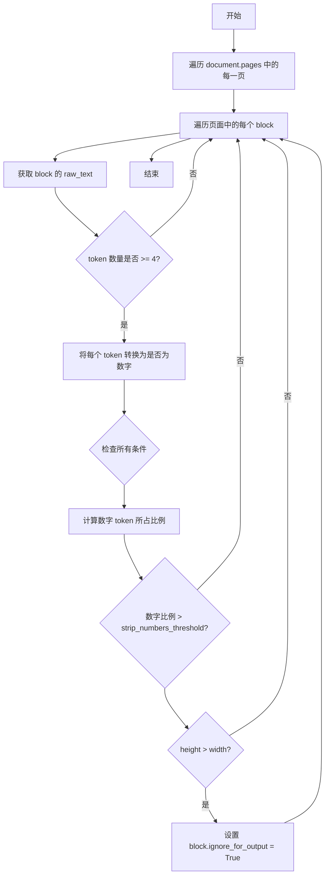
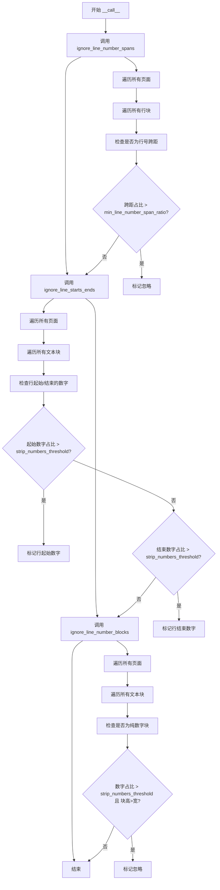
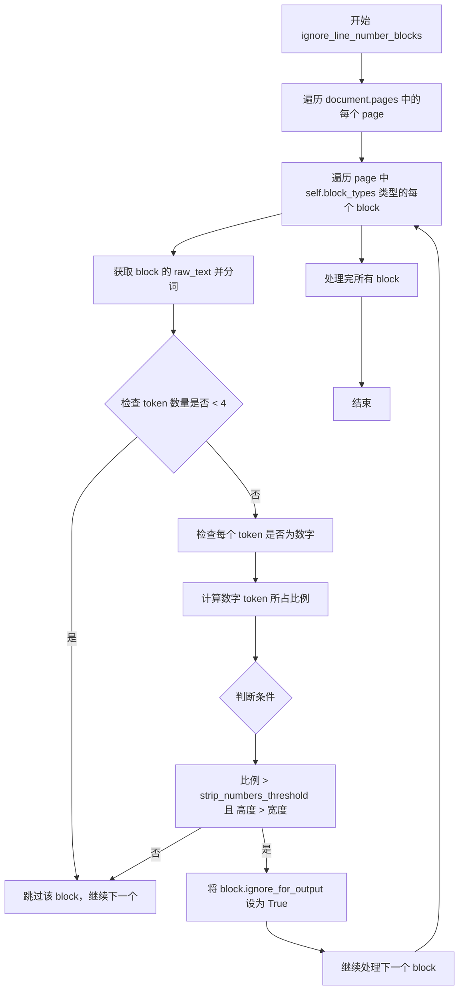
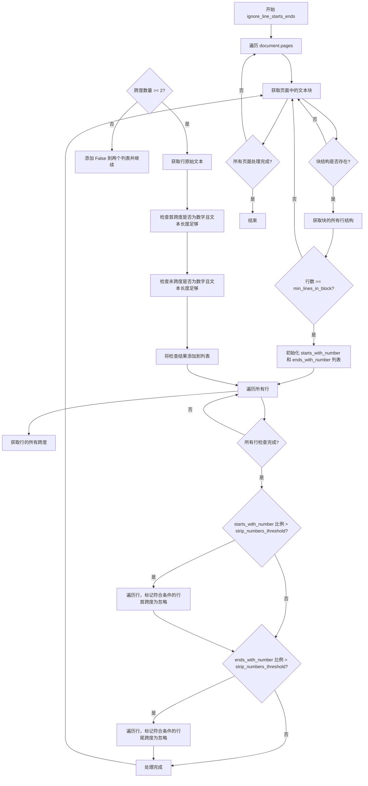

# `marker\marker\processors\line_numbers.py` 详细设计文档

一个用于忽略PDF或文档中行号的专业处理器，通过检测文本块中的数字比例、行号跨度、行的起始和结束位置来识别并标记行号，以便在后续处理中将其忽略。

## 整体流程

```mermaid
graph TD
    A[开始: 接收Document对象] --> B[调用ignore_line_number_spans]
    B --> B1[遍历所有页面]
    B1 --> B2[遍历每行的所有Span]
    B2 --> B3{检测最左侧Span是否为纯数字?}
    B3 -- 是 --> B4[收集line_number_spans]
    B3 -- 否 --> B5[跳过]
    B4 --> B6{line_number_spans比例 > min_line_number_span_ratio?}
    B6 -- 是 --> B7[标记span.ignore_for_output = True]
    B6 -- 否 --> C[调用ignore_line_number_blocks]
    C --> C1[遍历页面中的所有Block]
    C1 --> C2{Block类型在block_types中?}
    C2 -- 是 --> C3{文本tokens数量 >= 4?]
    C3 -- 是 --> C4{数字token比例 > strip_numbers_threshold?]
    C4 -- 是 --> C5{Block高度 > 宽度?}
    C5 -- 是 --> C6[标记block.ignore_for_output = True]
    C5 -- 否 --> D[调用ignore_line_starts_ends]
    D --> D1[遍历页面Block]
    D1 --> D2{Block结构为空?]
    D2 -- 否 --> D3{行数 >= min_lines_in_block?]
    D3 -- 是 --> D4[遍历所有行检测起始/结束数字]
    D4 --> D5{起始数字比例 > strip_numbers_threshold?]
    D5 -- 是 --> D6[标记起始Span为忽略]
    D5 -- 否 --> D7{结束数字比例 > strip_numbers_threshold?}
    D7 -- 是 --> D8[标记结束Span为忽略]
    D7 -- 否 --> E[结束处理]
```

## 类结构

```
BaseProcessor (基类)
└── LineNumbersProcessor (行号处理器)
    ├── ignore_line_number_spans (忽略行号跨度)
    ├── ignore_line_number_blocks (忽略行号块)
    └── ignore_line_starts_ends (忽略行的起始和结束数字)
```

## 全局变量及字段


### `line_count`
    
当前页面的行数计数

类型：`int`
    


### `line_number_spans`
    
收集到的行号Span列表

类型：`List[Span]`
    


### `leftmost_span`
    
行中最左侧的Span

类型：`Span`
    


### `raw_text`
    
块的原始文本

类型：`str`
    


### `tokens`
    
文本分割后的token列表

类型：`List[str]`
    


### `tokens_are_numbers`
    
token是否为数字的布尔列表

类型：`List[bool]`
    


### `all_lines`
    
所有行的结构块

类型：`List`
    


### `starts_with_number`
    
每行是否以数字开头的布尔列表

类型：`List[bool]`
    


### `ends_with_number`
    
每行是否以数字结尾的布尔列表

类型：`List[bool]`
    


### `spans`
    
行中的所有span

类型：`List`
    


### `starts`
    
当前行是否以数字开头

类型：`bool`
    


### `ends`
    
当前行是否以数字结尾

类型：`bool`
    


### `span`
    
要标记忽略的span

类型：`Span`
    


### `LineNumbersProcessor.block_types`
    
要处理的块类型(Text, TextInlineMath)

类型：`tuple`
    


### `LineNumbersProcessor.strip_numbers_threshold`
    
数字比例阈值(默认0.6)

类型：`float`
    


### `LineNumbersProcessor.min_lines_in_block`
    
块中最少行数(默认4)

类型：`int`
    


### `LineNumbersProcessor.min_line_length`
    
最小行长度(默认10)

类型：`int`
    


### `LineNumbersProcessor.min_line_number_span_ratio`
    
行号跨度最小比例(默认0.6)

类型：`float`
    
    

## 全局函数及方法


### `LineNumbersProcessor.__init__`

初始化 `LineNumbersProcessor` 处理器实例，调用父类 `BaseProcessor` 的构造函数完成基础配置设置。

参数：

- `config`：任意类型，传递给父类的配置对象，用于初始化处理器的各项参数

返回值：`None`，`__init__` 方法不返回值，用于初始化对象状态

#### 流程图

```mermaid
flowchart TD
    A[开始 __init__] --> B[接收 config 参数]
    B --> C[调用 super().__init__config]
    C --> D[初始化 LineNumbersProcessor 实例]
    D --> E[结束]
```

#### 带注释源码

```python
def __init__(self, config):
    """
    初始化 LineNumbersProcessor 处理器
    
    参数:
        config: 配置对象，传递给父类 BaseProcessor 进行初始化
               包含处理器所需的各种配置参数
    """
    super().__init__(config)  # 调用父类 BaseProcessor 的构造函数，传递配置参数
```


### `LineNumbersProcessor.ignore_line_number_spans`

该方法通过遍历文档页面中的行（Line）块，检测并识别位于行首的最左侧跨度（span），如果该跨度的文本为纯数字且在整个页面行数中达到指定比例阈值，则将其标记为忽略，以确保行号不被当作文档内容输出。

参数：

- `document`：`Document`，待处理的文档对象，包含页面和块结构

返回值：`None`，无返回值；该方法直接修改 `document` 中符合条件的 span 对象的 `ignore_for_output` 属性

#### 流程图

```mermaid
flowchart TD
    A[开始] --> B[遍历 document.pages]
    B --> C[初始化 line_count = 0]
    C --> D[初始化 line_number_spans = []]
    D --> E[遍历 page.contained_blocks<br/>筛选 BlockTypes.Line 类型]
    E --> F{ block.structure is None? }
    F -->|是| G[跳过当前 block]
    F -->|否| H[line_count += 1]
    H --> I[遍历 block.contained_blocks<br/>筛选 BlockTypes.Span 类型]
    I --> J[查找最左侧 span<br/>比较 polygon.x_start]
    J --> K{ 找到最左侧 span? }
    K -->|否| L[跳过]
    K -->|是| M{ span.text.strip.isnumeric()? }
    M -->|否| L
    M -->|是| N[将 span 添加到 line_number_spans]
    N --> E
    L --> E
    G --> E
    E --> O{ 所有 Line 块遍历完成? }
    O -->|否| E
    O -->|是| P{ line_count > 0? }
    P -->|否| Q[继续处理下一页]
    P -->|是| R{ len(line_number_spans) / line_count ><br/>min_line_number_span_ratio? }
    R -->|否| Q
    R -->|是| S[遍历 line_number_spans]
    S --> T[设置 span.ignore_for_output = True]
    T --> Q
    Q --> U{ 所有页面遍历完成? }
    U -->|否| B
    U -->|是| V[结束]
```

#### 带注释源码

```python
def ignore_line_number_spans(self, document: Document):
    """
    检测并忽略行号跨度。
    遍历文档页面中的行块，识别位于行首的纯数字跨度，
    如果该类跨度在页面中达到一定比例，则将其标记为忽略输出。
    """
    # 遍历文档中的所有页面
    for page in document.pages:
        line_count = 0  # 记录当前页面的总行数
        line_number_spans = []  # 存储被识别为行号的跨度
        
        # 遍历当前页面中所有类型为 Line 的块
        for block in page.contained_blocks(document, (BlockTypes.Line,)):
            # 跳过结构为空的块
            if block.structure is None:
                continue

            line_count += 1  # 行数加一
            leftmost_span = None  # 初始化最左侧跨度为 None
            
            # 遍历块中的所有 Span，找到最左侧的跨度
            for span in block.contained_blocks(document, (BlockTypes.Span,)):
                # 如果当前 span 更靠左，或者 leftmost_span 为空
                if leftmost_span is None or span.polygon.x_start < leftmost_span.polygon.x_start:
                    leftmost_span = span

            # 如果存在最左侧跨度且其文本为纯数字
            if leftmost_span is not None and leftmost_span.text.strip().isnumeric():
                # 将其识别为行号跨度并添加
                line_number_spans.append(leftmost_span)

        # 计算行号跨度占比，判断是否超过阈值
        if line_count > 0 and len(line_number_spans) / line_count > self.min_line_number_span_ratio:
            # 遍历所有被识别为行号的跨度，标记为忽略输出
            for span in line_number_spans:
                span.ignore_for_output = True
```


### `LineNumbersProcessor.ignore_line_starts_ends`

该方法用于检测并忽略文档中位于行首或行尾的数字，识别可能的行号。通过分析每个文本块的结构，统计以数字开头或结尾的行数比例，当超过配置阈值时，将对应的行首或行尾span标记为忽略，以免影响后续处理。

参数：

-  `document`：`Document`，待处理的文档对象，包含页面和块结构

返回值：`None`，该方法直接修改document对象中相关块的ignore_for_output属性，无返回值

#### 流程图

```mermaid
flowchart TD
    A[开始 ignore_line_starts_ends] --> B[遍历document.pages]
    B --> C[遍历页面中的contained_blocks]
    C --> D{"block.structure is None?"}
    D -->|Yes| C
    D -->|No| E[获取block的所有行 all_lines]
    E --> F{"len(all_lines) < min_lines_in_block?"}
    F -->|Yes| C
    F -->|No| G[初始化 starts_with_number, ends_with_number 列表]
    G --> H[遍历 all_lines 中的每行]
    H --> I[获取行的所有 spans]
    I --> J{"len(spans) < 2?"}
    J -->|Yes| K[向两个列表添加 False]
    J -->|No| L[检查 spans[0] 是否为数字且剩余长度>min_line_length]
    L --> M[检查 spans[-1] 是否为数字且剩余长度>min_line_length]
    K --> N["计算 starts_with_number 比例"]
    M --> N
    N --> O{"比例 > strip_numbers_threshold?"}
    O -->|Yes| P[遍历 lines, 标记符合条件的行首 span.ignore_for_output = True]
    O -->|No| Q["计算 ends_with_number 比例"]
    P --> Q
    Q --> R{"比例 > strip_numbers_threshold?"}
    R -->|Yes| S[遍历 lines, 标记符合条件的行尾 span.ignore_for_output = True]
    R -->|No| T[继续下一个 block 或结束]
    S --> T
```

#### 带注释源码

```python
def ignore_line_starts_ends(self, document: Document):
    """
    检测并忽略行起始/结束的数字（行号）
    """
    # 遍历文档中的每一页
    for page in document.pages:
        # 遍历页面中属于指定类型的块（文本和行内数学）
        for block in page.contained_blocks(document, self.block_types):
            # 如果块结构为空，跳过该块
            if block.structure is None:
                continue

            # 获取块中的所有行结构块
            all_lines = block.structure_blocks(document)
            # 如果行数少于最小要求，跳过该块
            if len(all_lines) < self.min_lines_in_block:
                continue

            # 初始化列表，用于记录每行是否以数字开头/结尾
            starts_with_number = []
            ends_with_number = []
            
            # 遍历每一行进行分析
            for line in all_lines:
                # 获取该行包含的所有span
                spans = line.structure_blocks(document)
                # 如果span数量少于2，无法判断首尾，跳过
                if len(spans) < 2:
                    starts_with_number.append(False)
                    ends_with_number.append(False)
                    continue

                # 获取行的原始文本
                raw_text = line.raw_text(document)
                
                # 检查行首：第一个span是纯数字 且 剩余文本长度大于最小要求
                starts = all([
                    spans[0].text.strip().isdigit(),
                    len(raw_text) - len(spans[0].text.strip()) > self.min_line_length
                ])

                # 检查行尾：最后一个span是纯数字 且 前面文本长度大于最小要求
                ends = all([
                    spans[-1].text.strip().isdigit(),
                    len(raw_text) - len(spans[-1].text.strip()) > self.min_line_length
                ])

                # 记录该行的判断结果
                starts_with_number.append(starts)
                ends_with_number.append(ends)

            # 如果以数字开头的行比例超过阈值，则标记这些行首的span
            if sum(starts_with_number) / len(starts_with_number) > self.strip_numbers_threshold:
                for starts, line in zip(starts_with_number, all_lines):
                    if starts:
                        # 获取行首span并标记为忽略输出
                        span = page.get_block(line.structure[0])
                        span.ignore_for_output = True

            # 如果以数字结尾的行比例超过阈值，则标记这些行尾的span
            if sum(ends_with_number) / len(ends_with_number) > self.strip_numbers_threshold:
                for ends, line in zip(ends_with_number, all_lines):
                    if ends:
                        # 获取行尾span并标记为忽略输出
                        span = page.get_block(line.structure[-1])
                        span.ignore_for_output = True
```


### `LineNumbersProcessor.ignore_line_number_blocks`

该方法用于检测并忽略文档中的行号块。它遍历页面中的文本块，检查每个块的标记是否大部分为数字，并且块的高度是否大于宽度（类似于垂直页码的布局），如果满足条件则将该块标记为忽略输出。

参数：

- `document`：`Document`，需要处理的文档对象

返回值：`None`，无返回值（该方法直接修改 document 对象的 block 属性）

#### 流程图



#### 带注释源码

```python
def ignore_line_number_blocks(self, document: Document):
    """
    检测并忽略行号块。
    该方法遍历文档中的所有页面和文本块，检查每个块是否满足行号块的特征：
    1. 块中的大部分 token 都是数字
    2. 块的高度大于宽度（垂直方向，符合页码的典型特征）
    如果满足这两个条件，则将该块标记为忽略输出。
    
    参数:
        document: Document 对象，包含需要处理的页面和块
    返回:
        None (直接修改 document 中块的 ignore_for_output 属性)
    """
    # 遍历文档中的每一页
    for page in document.pages:
        # 遍历页面中符合类型的块（Text 或 TextInlineMath）
        for block in page.contained_blocks(document, self.block_types):
            # 获取块的原始文本
            raw_text = block.raw_text(document)
            # 将文本按空白字符分割成 token 列表
            tokens = raw_text.strip().split()
            
            # 如果 token 数量少于 4，跳过该块（行号块通常有较多行）
            if len(tokens) < 4:
                continue

            # 检查每个 token 是否为数字
            tokens_are_numbers = [token.isdigit() for token in tokens]
            
            # 检查所有条件是否满足
            if all([
                # 条件1: 数字 token 所占比例大于阈值
                sum(tokens_are_numbers) / len(tokens) > self.strip_numbers_threshold,
                # 条件2: 块的高度大于宽度（确保是垂直方向的块，符合页码特征）
                block.polygon.height > block.polygon.width
            ]):
                # 满足条件，将该块标记为忽略输出
                block.ignore_for_output = True
```


### `LineNumbersProcessor.__init__`

这是一个初始化方法，用于构造 `LineNumbersProcessor` 类的实例。该方法接受配置对象作为参数，并将其传递给父类 `BaseProcessor` 的构造函数，以完成处理器的初始化工作。

参数：

- `self`：`LineNumbersProcessor`，表示当前类的实例对象
- `config`：任意类型（由父类 `BaseProcessor` 定义），用于配置处理器的行为参数

返回值：`None`，该方法没有显式返回值

#### 流程图

```mermaid
flowchart TD
    A[开始 __init__] --> B[接收 config 参数]
    B --> C[调用 super().__init__(config)]
    C --> D[调用父类 BaseProcessor 的初始化方法]
    D --> E[完成初始化]
    E --> F[返回 None]
```

#### 带注释源码

```python
def __init__(self, config):
    """
    初始化 LineNumbersProcessor 实例。
    
    参数:
        config: 配置对象，用于设置处理器的行为参数。
               该参数会被传递给父类 BaseProcessor 的构造函数。
    """
    # 调用父类 BaseProcessor 的 __init__ 方法
    # 传递配置对象以完成基类的初始化
    super().__init__(config)
```


### `LineNumbersProcessor.__call__`

该方法是 `LineNumbersProcessor` 类的核心调用入口，接收一个 `Document` 对象作为参数，依次调用三个私有方法来识别并忽略文档中的行号：第一识别行号跨距（行号在行首的情况），第二识别行号在行的起始和结束位置，第三识别独立的行号块。

参数：

- `self`：`LineNumbersProcessor`，`LineNumbersProcessor` 类的实例本身
- `document`：`Document`，待处理的文档对象，包含页面的所有内容和结构信息

返回值：`None`，该方法直接修改 `document` 对象的属性（设置 `ignore_for_output = True`），不返回任何值

#### 流程图



#### 带注释源码

```python
def __call__(self, document: Document):
    """
    处理文档，识别并忽略其中的行号。
    
    该方法是LineNumbersProcessor的主入口，通过依次调用三个方法来全面识别
    文档中不同位置和形态的行号：行跨距中的行号、行首/行尾的行号、以及
    独立的行号块。
    
    Args:
        document: Document对象，包含待处理的文档内容，包括页面、块、跨距等
        
    Returns:
        None: 直接修改document对象的ignore_for_output属性，不返回任何值
    """
    # 方法1：忽略行跨距中的行号
    # 识别位于行首的连续数字跨距，如果占比超过阈值则标记为行号
    self.ignore_line_number_spans(document)
    
    # 方法2：忽略行起始和结束位置的行号
    # 识别行首或行尾的数字，如果超过阈值的行都有此特征则标记为行号
    self.ignore_line_starts_ends(document)
    
    # 方法3：忽略独立的行号块
    # 识别主要由数字组成的文本块（如垂直页码），如果占比超过阈值则标记为行号
    self.ignore_line_number_blocks(document)
```


### `LineNumbersProcessor.ignore_line_number_spans`

该方法用于检测并忽略文档中的行号span，通过遍历页面中的行块，找出最左侧且内容为纯数字的span，当这类span占行总数的比例超过阈值时，将其标记为忽略输出，从而实现对行号的识别和过滤。

参数：

- `self`：`LineNumbersProcessor`，隐式参数，指向当前类的实例
- `document`：`Document`，待处理的文档对象，包含页面和块的结构信息

返回值：`None`，该方法直接修改 document 对象的状态，不返回任何值

#### 流程图

```mermaid
flowchart TD
    A[开始 ignore_line_number_spans] --> B[遍历 document.pages]
    B --> C{还有页面未处理?}
    C -->|是| D[初始化 line_count = 0, line_number_spans = []]
    D --> E[遍历页面中的 Line 类型的块]
    E --> F{当前 Line 块还有未处理的?}
    F -->|是| G{block.structure is None?}
    G -->|是| F
    G -->|否| H[line_count += 1]
    H --> I[寻找最左边的 Span]
    I --> J{最左边 Span 存在且 text.isnumeric()?}
    J -->|是| K[将 span 添加到 line_number_spans]
    J -->|否| F
    K --> F
    F -->|否| L{line_count > 0 且<br/>len(line_number_spans)/line_count > min_line_number_span_ratio?}
    L -->|是| M[遍历 line_number_spans 设置 span.ignore_for_output = True]
    L -->|否| C
    M --> C
    C -->|否| N[结束]
```

#### 带注释源码

```python
def ignore_line_number_spans(self, document: Document):
    """
    检测并忽略行号span。
    逻辑：遍历页面中的行块，找出最左侧且为纯数字的span，
    当这类span达到一定比例时将其标记为忽略输出。
    """
    # 遍历文档中的所有页面
    for page in document.pages:
        # 初始化当前页的行计数器和行号span列表
        line_count = 0
        line_number_spans = []
        
        # 遍历当前页面中所有 Line 类型的块
        for block in page.contained_blocks(document, (BlockTypes.Line,)):
            # 如果块结构为空，跳过该块
            if block.structure is None:
                continue

            # 累计行数
            line_count += 1
            
            # 寻找当前行块中最左侧的 span
            leftmost_span = None
            for span in page.contained_blocks(document, (BlockTypes.Span,)):
                # 比较 x_start 坐标找最左边的 span
                if leftmost_span is None or span.polygon.x_start < leftmost_span.polygon.x_start:
                    leftmost_span = span

            # 如果存在最左边的 span 且其文本为纯数字
            if leftmost_span is not None and leftmost_span.text.strip().isnumeric():
                # 将其记录为可能的行号 span
                line_number_spans.append(leftmost_span)

        # 检查行号 span 的比例是否超过阈值
        # 只有当存在行且行号 span 比例超过 min_line_number_span_ratio 时才执行忽略
        if line_count > 0 and len(line_number_spans) / line_count > self.min_line_number_span_ratio:
            # 遍历所有识别出的行号 span，设置忽略标记
            for span in line_number_spans:
                span.ignore_for_output = True
```


### `LineNumbersProcessor.ignore_line_number_blocks`

该方法用于识别并忽略文档中由纯数字行组成的块（即整块都是行号的块），通过检测块内 token 的数字比例和块的形状特征（高度大于宽度）来判断是否为行号块，从而将这些块标记为不参与输出。

参数：

- `self`：`LineNumbersProcessor`，当前处理器实例
- `document`：`Document`，待处理的文档对象，包含页面和块的结构信息

返回值：`None`，该方法直接修改文档对象的块属性，不返回任何值

#### 流程图



#### 带注释源码

```python
def ignore_line_number_blocks(self, document: Document):
    """
    忽略由纯数字行组成的块。
    该方法通过检测块内 token 的数字比例和块的垂直形状特征来判断是否为行号块。
    
    判断逻辑：
    1. 块内的 token 数量必须 >= 4（避免误判短文本）
    2. 数字 token 的比例超过 strip_numbers_threshold（默认 0.6）
    3. 块的高度大于宽度（表示这是垂直排列的行号，如侧边栏行号）
    """
    # 遍历文档中的所有页面
    for page in document.pages:
        # 遍历页面中符合类型条件的块（Text 和 TextInlineMath）
        for block in page.contained_blocks(document, self.block_types):
            # 获取块的原始文本内容
            raw_text = block.raw_text(document)
            # 将文本按空白字符分割为 token 列表
            tokens = raw_text.strip().split()
            
            # 如果 token 数量少于 4，认为该块不可能是行号块，跳过
            if len(tokens) < 4:
                continue
            
            # 检查每个 token 是否为纯数字
            tokens_are_numbers = [token.isdigit() for token in tokens]
            
            # 判断是否满足忽略条件：
            # 条件1：数字 token 的比例 > strip_numbers_threshold（默认 0.6，即 60% 以上为数字）
            # 条件2：块的高度 > 宽度（确保是垂直排列的块，如侧边栏的行号）
            if all([
                sum(tokens_are_numbers) / len(tokens) > self.strip_numbers_threshold,
                block.polygon.height > block.polygon.width  # Ensure block is taller than it is wide, like vertical page numbers
            ]):
                # 将该块标记为忽略输出，后续处理时将跳过此块
                block.ignore_for_output = True
```


### `LineNumbersProcessor.ignore_line_starts_ends`

该方法用于检测并忽略文档中段落行首或行尾的数字（即行号），通过分析每个文本块中的行结构，识别连续多行以数字开头或结尾的模式，当这类数字出现的比例超过配置的阈值时，将其标记为忽略，以防干扰正文内容。

参数：

- `self`：`LineNumbersProcessor`，当前处理器实例的引用
- `document`：`Document`，待处理的文档对象，包含页面和块的完整结构信息

返回值：`None`，该方法直接修改文档中块的状态，不返回任何值

#### 流程图



#### 带注释源码

```python
def ignore_line_starts_ends(self, document: Document):
    """
    检测并忽略段落行首或行尾的数字（行号）。
    
    该方法遍历文档中的每个页面和文本块，分析块中每行的结构，
    识别以数字开头或结尾的行。当这类行的比例超过阈值时，
    将对应的数字跨度标记为忽略，防止其干扰正文内容。
    
    Args:
        document: Document 对象，包含待处理的文档结构和内容
    
    Returns:
        None：直接修改 document 中块的 ignore_for_output 属性
    """
    # 遍历文档中的所有页面
    for page in document.pages:
        # 获取页面中属于指定类型（Text 或 TextInlineMath）的所有块
        for block in page.contained_blocks(document, self.block_types):
            # 跳过没有结构信息的块（如图片、表格等）
            if block.structure is None:
                continue

            # 获取块中的所有行结构
            all_lines = block.structure_blocks(document)
            # 如果行数少于最小要求，跳过该块（避免误判小块内容）
            if len(all_lines) < self.min_lines_in_block:
                continue

            # 用于记录每行是否以数字开头/结尾
            starts_with_number = []
            ends_with_number = []
            
            # 遍历块中的每一行
            for line in all_lines:
                # 获取该行中的所有跨度（span）
                spans = line.structure_blocks(document)
                
                # 如果行中跨度少于2个，无法判断首尾，跳过该行
                if len(spans) < 2:
                    starts_with_number.append(False)
                    ends_with_number.append(False)
                    continue

                # 获取该行的原始文本内容
                raw_text = line.raw_text(document)
                
                # 检查行首是否为数字：
                # 1. 首跨度文本是纯数字
                # 2. 去掉首跨度后剩余文本长度 > 最小行长度要求（避免短行误判）
                starts = all([
                    spans[0].text.strip().isdigit(),
                    len(raw_text) - len(spans[0].text.strip()) > self.min_line_length
                ])

                # 检查行尾是否为数字：
                # 1. 末跨度文本是纯数字
                # 2. 去掉末跨度后剩余文本长度 > 最小行长度要求
                ends = all([
                    spans[-1].text.strip().isdigit(),
                    len(raw_text) - len(spans[-1].text.strip()) > self.min_line_length
                ])

                # 记录该行的检查结果
                starts_with_number.append(starts)
                ends_with_number.append(ends)

            # 判断行首数字的比例是否超过阈值
            if sum(starts_with_number) / len(starts_with_number) > self.strip_numbers_threshold:
                # 遍历所有行，将符合条件的行首跨度标记为忽略
                for starts, line in zip(starts_with_number, all_lines):
                    if starts:
                        # 获取行首跨度对应的块并标记
                        span = page.get_block(line.structure[0])
                        span.ignore_for_output = True

            # 判断行尾数字的比例是否超过阈值
            if sum(ends_with_number) / len(ends_with_number) > self.strip_numbers_threshold:
                # 遍历所有行，将符合条件的行尾跨度标记为忽略
                for ends, line in zip(ends_with_number, all_lines):
                    if ends:
                        # 获取行尾跨度对应的块并标记
                        span = page.get_block(line.structure[-1])
                        span.ignore_for_output = True
```

## 关键组件


### LineNumbersProcessor

主处理器类，继承自 BaseProcessor，用于识别并忽略 PDF 或文档中的行号。通过多种策略检测行号：检测行号跨度、检测行号块、以及检测行首/行尾的数字。

### strip_numbers_threshold

配置参数，类型为 float，值为 0.6。表示块中文本行或标记中必须为数字的比例，才能将其视为行号。

### min_lines_in_block

配置参数，类型为 int，值为 4。表示块中必须包含的最小行数，用于确保小块被忽略，因为它们不太可能包含有意义的行号。

### min_line_length

配置参数，类型为 int，值为 10。表示一行（以字符计）的最小长度，用于在检查数字前缀或后缀时将其视为重要内容，防止短行产生误报。

### min_line_number_span_ratio

配置参数，类型为 float，值为 0.6。表示检测到的行号跨度与总行数的最小比例，用于将行号跨度识别为真正的行号。

### ignore_line_number_spans

方法，用于检测并忽略行中的行号跨度。遍历页面中的所有行块，找出最左边的数字跨度，如果数字行占比超过阈值，则将这些跨度标记为忽略。

### ignore_line_number_blocks

方法，用于检测并忽略包含大量纯数字的文本块。检查文本块中的标记，如果大部分标记都是数字且块的高度大于宽度（竖向排版的页码），则将其标记为忽略。

### ignore_line_starts_ends

方法，用于检测并忽略行首或行尾的数字。遍历块中的所有行，检查行首或行尾是否为数字，如果超过阈值的行都有数字前缀或后缀，则将这些数字标记为忽略。

## 问题及建议


### 已知问题

- **除零风险**：在 `ignore_line_number_spans` 方法中，`len(line_number_spans) / line_count` 以及在 `ignore_line_starts_ends` 中的 `sum(starts_with_number) / len(starts_with_number)` 和 `sum(ends_with_number) / len(ends_with_number)` 都没有对除数进行零值检查，虽然代码中有 `if line_count > 0` 的判断，但 `len(starts_with_number)` 可能为0（当 `all_lines` 为空时），导致潜在的 `ZeroDivisionError`。

- **类型注解缺失**：方法参数 `document: Document` 的类型注解正确，但内部变量如 `line_count`、`line_number_spans`、`all_lines` 等都缺乏类型注解，影响代码可维护性和静态分析。

- **重复计算与遍历**：代码多次调用 `page.contained_blocks(document, ...)` 和 `block.raw_text(document)`，在大型文档上可能造成性能开销，且 `block.structure_blocks(document)` 在循环中被反复调用。

- **魔法数字未配置化**：`ignore_line_starts_ends` 中 `if len(spans) < 2` 的判断使用了硬编码值2，这个阈值也应该像其他参数一样可配置。

- **方法职责过载**：`ignore_line_starts_ends` 方法内部混合了行首和行尾的检测逻辑，代码行数较长（超过50行），违反了单一职责原则。

- **潜在的空引用风险**：`span = page.get_block(line.structure[0])` 和 `span = page.get_block(line.structure[-1])` 假设 `line.structure` 始终存在且非空，如果结构异常可能导致索引错误或返回 None。

- **注释不完整**：部分字段的注释被截断（如 `min_line_length` 的描述 "Prevents false positives for short lines." 后不完整），且缺少对类级别常量 `block_types` 的文档说明。

### 优化建议

- **添加零值保护**：在使用除法前检查分母是否为零，例如在 `ignore_line_starts_ends` 中添加 `if len(all_lines) == 0: continue`。

- **提取公共逻辑**：将 `ignore_line_starts_ends` 拆分为两个独立方法 `ignore_line_starts` 和 `ignore_line_ends`，减少方法复杂度。

- **缓存计算结果**：对于需要多次获取的 `block.raw_text(document)` 和 `page.contained_blocks(document, ...)` 结果，可以考虑在方法开始时缓存一次。

- **增加类型注解**：为所有局部变量添加明确的类型注解，提高代码可读性和 IDE 支持。

- **配置化硬编码值**：将 `len(spans) < 2` 中的2提取为类属性或配置参数。

- **添加防御性检查**：在使用 `line.structure` 索引前检查其长度和有效性，例如 `if line.structure and len(line.structure) > 0`。

- **完善文档注释**：补充缺失的注释描述，确保所有公开接口都有完整的文档字符串。

## 其它


### 设计目标与约束

本处理器的主要设计目标是从文档中自动识别并移除行号标记，以提升文档内容的纯净度。核心约束包括：仅处理文本和内联数学块类型；通过可配置阈值（strip_numbers_threshold、min_line_number_span_ratio）控制识别精度；要求块的高度大于宽度以识别垂直页面数字；最小行数以避免误判小块文本。

### 错误处理与异常设计

代码中主要通过以下方式处理异常情况：
- **空值检查**：`if block.structure is None: continue` 和 `if leftmost_span is None: continue` 防止对空结构进行操作
- **除零保护**：`if line_count > 0 and len(line_number_spans) / line_count > ...` 确保除法运算安全
- **列表长度保护**：`if len(tokens) < 4: continue` 和 `if len(spans) < 2: continue` 避免处理过小的数据集合
- **边界条件**：通过 `min_lines_in_block`、`min_line_length` 等参数设置处理下限，防止过度处理

### 数据流与状态机

处理器遵循线性数据流处理模式：
1. **入口**：调用 `__call__` 方法，传入 Document 对象
2. **第一阶段**：`ignore_line_number_spans` - 遍历所有行块，识别左侧行号跨距（span）
3. **第二阶段**：`ignore_line_starts_ends` - 遍历文本块，识别行首或行尾的数字模式
4. **第三阶段**：`ignore_line_number_blocks` - 遍历文本块，识别整块为纯数字的情况（垂直页面数字）
5. **状态标记**：通过设置 `span.ignore_for_output = True` 或 `block.ignore_for_output = True` 标记需要忽略的元素

### 外部依赖与接口契约

**依赖项**：
- `marker.processors.BaseProcessor`：基类，提供处理器基础架构
- `marker.schema.BlockTypes`：枚举类型，定义块类型常量
- `marker.schema.document.Document`：文档对象模型，包含页面和块的层次结构

**接口契约**：
- 输入：`__call__(self, document: Document)` 接收 Document 对象
- 输出：通过修改 Document 对象的内部状态（设置 `ignore_for_output` 标志）实现行号忽略
- 约束：document 必须包含有效的页面和块结构

### 性能考虑

- **时间复杂度**：O(n × m)，其中 n 为页数，m 为每页的块数，三次遍历文档
- **空间复杂度**：O(k)，主要用于存储临时列表如 `line_number_spans`、`starts_with_number`、`ends_with_number`
- **优化建议**：可考虑合并三次遍历为单次遍历，减少 Document 对象的访问次数

### 测试策略

- 单元测试：针对每个阈值参数设计边界测试用例
- 集成测试：使用真实 PDF 文档测试行号识别准确性
- 回归测试：确保修改后对已有文档的处理结果保持一致

### 配置管理

所有阈值参数通过 Annotated 类型进行类型标注和描述：
- `strip_numbers_threshold`: 默认 0.6，控制数字行识别敏感度
- `min_lines_in_block`: 默认 4，最小行数限制
- `min_line_length`: 默认 10，最小行字符长度
- `min_line_number_span_ratio`: 默认 0.6，行号跨距占比阈值

    