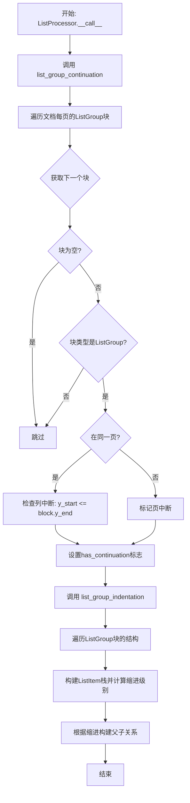
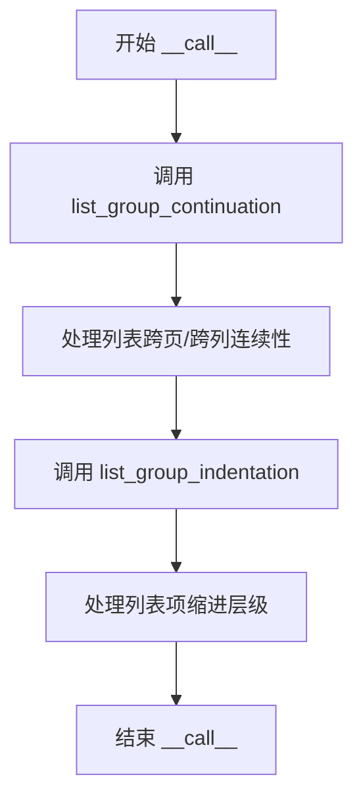
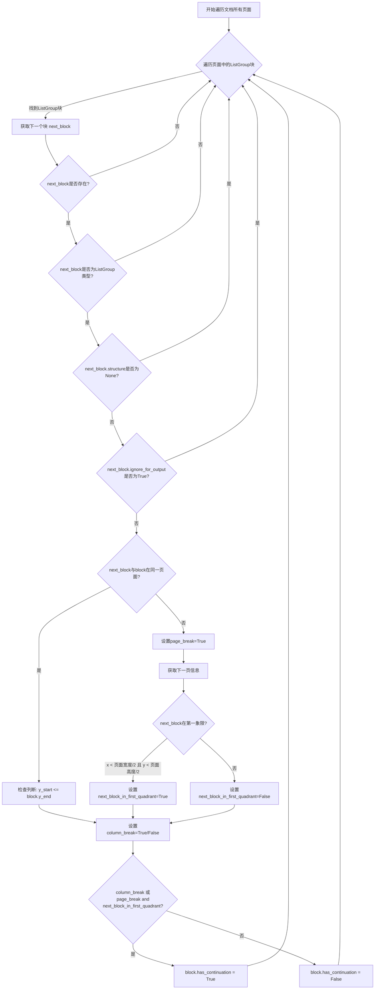
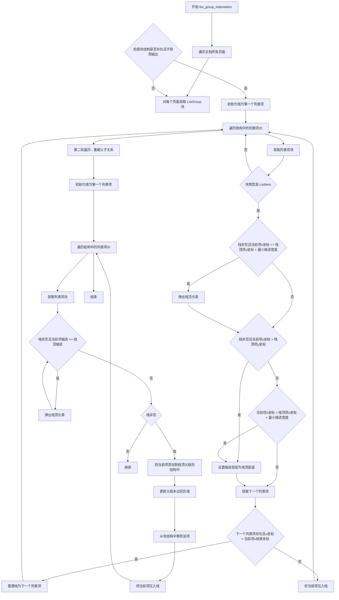

# `marker\marker\processors\list.py` 详细设计文档

A document processor that merges lists across pages and columns by detecting list continuations and calculating proper indentation levels for nested list items.

## 整体流程



## 类结构

```
BaseProcessor (抽象基类)
└── ListProcessor (列表处理器)
```

## 全局变量及字段


### `ListProcessor.block_types`
    
要处理的块类型，值为(BlockTypes.ListGroup,)

类型：`Tuple[BlockTypes]`
    


### `ListProcessor.ignored_block_types`
    
忽略的块类型，包括页眉和页脚

类型：`Tuple[BlockTypes]`
    


### `ListProcessor.min_x_indent`
    
最小水平缩进百分比，用于判断嵌套列表层级

类型：`float`
    
    

## 全局函数及方法


### `ListProcessor.__init__`

该方法是`ListProcessor`类的构造函数，用于初始化列表处理器实例。它接收配置对象作为参数，并调用父类`BaseProcessor`的构造函数完成基础初始化。

参数：

- `config`：未指定具体类型，从代码上下文推断为配置对象（通常为`DictConfig`或类似配置类），用于传递处理器所需的配置参数

返回值：`None`，`__init__`方法不返回值

#### 流程图

```mermaid
flowchart TD
    A[开始 __init__] --> B[接收 config 参数]
    B --> C[调用 super().__init__config]
    C --> D[结束初始化]
```

#### 带注释源码

```
def __init__(self, config):
    """
    初始化 ListProcessor 实例
    
    参数:
        config: 配置对象，包含处理器所需的配置参数
    """
    super().__init__(config)  # 调用父类 BaseProcessor 的构造函数进行初始化
```


### `ListProcessor.__call__`

这是 `ListProcessor` 类的主入口方法，用于处理文档中的列表项跨页和跨列的合并与缩进关系。该方法依次调用 `list_group_continuation` 和 `list_group_indentation` 两个核心处理方法，分别实现列表连续性检测和缩进层级重建。

参数：

- `document`：`Document`，需要处理的文档对象，包含页面和块结构信息

返回值：`None`，该方法无返回值，直接修改传入的 `document` 对象

#### 流程图



#### 带注释源码

```
def __call__(self, document: Document):
    """
    处理文档中的列表项，实现跨页/跨列列表的合并与缩进层级处理
    
    参数:
        document: Document对象，包含需要处理的列表块结构
    
    返回值:
        None（直接修改document对象）
    """
    # 步骤1: 处理列表的跨页和跨列连续性
    # 检测列表项是否存在跨页或跨列的延续关系
    self.list_group_continuation(document)
    
    # 步骤2: 处理列表项的缩进层级
    # 根据水平和垂直位置关系重建列表项的层级结构
    self.list_group_indentation(document)
```


### `ListProcessor.list_group_continuation`

该方法用于检测跨页或跨列的列表延续关系，通过分析相邻块的位置信息（页面ID、坐标多边形）来判断列表是否在不同页面或不同列之间延续，并将判断结果存储在块的`has_continuation`属性中。

参数：

- `document`：`Document`，待处理的文档对象，包含页面的所有块信息

返回值：`None`，无返回值，仅修改document中相关块的`has_continuation`属性

#### 流程图



#### 带注释源码

```python
def list_group_continuation(self, document: Document):
    """
    检测列表块的跨页或跨列延续关系
    
    遍历文档中的所有ListGroup块，检查每个块是否有延续到下一页或下一列的列表项。
    如果存在延续，则设置block.has_continuation为True。
    """
    # 遍历文档中的所有页面
    for page in document.pages:
        # 遍历当前页面中的所有ListGroup块
        for block in page.contained_blocks(document, self.block_types):
            # 获取下一个块，忽略PageHeader和PageFooter类型的块
            next_block = document.get_next_block(block, self.ignored_block_types)
            
            # 如果没有下一个块，跳过当前块
            if next_block is None:
                continue
            
            # 如果下一个块不是ListGroup类型，跳过
            if next_block.block_type not in self.block_types:
                continue
            
            # 如果下一个块没有structure属性，跳过
            if next_block.structure is None:
                continue
            
            # 如果下一个块被标记为忽略输出，跳过
            if next_block.ignore_for_output:
                continue

            # 初始化列断和页断标志
            column_break, page_break = False, False
            next_block_in_first_quadrant = False

            # 判断next_block是否与block在同一页面
            if next_block.page_id == block.page_id:  
                # 同一页面：检查列断
                # 如果下一个块的起始y坐标小于等于当前块的结束y坐标，认为存在列断
                column_break = next_block.polygon.y_start <= block.polygon.y_end
            else:
                # 不同页面：标记为页断
                page_break = True
                
                # 获取下一页信息
                next_page = document.get_page(next_block.page_id)
                
                # 检查下一个块是否在下一页的第一象限
                # 第一象限定义：x坐标小于页面宽度的一半 且 y坐标小于页面高度的一半
                next_block_in_first_quadrant = (next_block.polygon.x_start < next_page.polygon.width // 2) and \
                    (next_block.polygon.y_start < next_page.polygon.height // 2)

            # 设置has_continuation标志
            # 条件：存在列断，或者（存在页断且下一个块在第一象限）
            block.has_continuation = column_break or (page_break and next_block_in_first_quadrant)
```


### `ListProcessor.list_group_indentation`

该方法用于根据列表项的水平和垂直位置信息，确定列表项的缩进层级，并建立列表项之间的父子层级关系。

参数：

- `document`：`Document`，待处理的文档对象，包含了所有页面和块的结构信息

返回值：`None`，该方法直接修改文档中列表块的缩进层级，不返回任何值

#### 流程图



#### 带注释源码

```python
def list_group_indentation(self, document: Document):
    """
    根据列表项的几何位置确定缩进层级，并建立父子关系
    """
    # 遍历文档中的所有页面
    for page in document.pages:
        # 获取当前页面中的所有 ListGroup 块
        for block in page.contained_blocks(document, self.block_types):
            # 跳过没有结构或被忽略的块
            if block.structure is None:
                continue
            if block.ignore_for_output:
                continue

            # 初始化栈，用于追踪当前缩进层级
            # 栈存储 ListItem 对象
            stack: List[ListItem] = [block.get_next_block(page, None)]
            
            # 第一轮遍历：确定每个列表项的缩进层级
            for list_item_id in block.structure:
                # 根据ID获取列表项块
                list_item_block: ListItem = page.get_block(list_item_id)

                # 仅处理 ListItem 类型的块（有时可能是 Line）
                if list_item_block.block_type != BlockTypes.ListItem:
                    continue

                # 如果当前项的起始x坐标小于等于栈顶元素的起始x坐标 + 最小缩进宽度，
                # 则弹出栈顶元素（返回到上一缩进层级）
                while stack and list_item_block.polygon.x_start <= stack[-1].polygon.x_start + (self.min_x_indent * page.polygon.width):
                    stack.pop()

                # 如果栈非空且当前项的起始y坐标大于栈顶元素的起始y坐标，
                # 说明当前项可能是嵌套在栈顶项下面的子项
                if stack and list_item_block.polygon.y_start > stack[-1].polygon.y_start:
                    # 继承栈顶元素的缩进层级
                    list_item_block.list_indent_level = stack[-1].list_indent_level
                    
                    # 如果当前项的起始x坐标大于栈顶元素的起始x坐标 + 最小缩进宽度，
                    # 则增加一级缩进
                    if list_item_block.polygon.x_start > stack[-1].polygon.x_start + (self.min_x_indent * page.polygon.width):
                        list_item_block.list_indent_level += 1

                # 获取当前列表项的下一个块
                next_list_item_block = block.get_next_block(page, list_item_block)
                
                # 检查是否存在列分隔（即下一个块的起始x坐标大于当前块的结束x坐标）
                # 如果存在列分隔，重置栈；否则将当前块压入栈
                if next_list_item_block is not None and next_list_item_block.polygon.x_start > list_item_block.polygon.x_end:
                    stack = [next_list_item_block]  # 重置栈以处理新列
                else:
                    stack.append(list_item_block)

            # 第二轮遍历：根据缩进层级建立列表项的父子关系
            stack: List[ListItem] = [block.get_next_block(page, None)]
            for list_item_id in block.structure.copy():  # 使用副本以安全删除
                list_item_block: ListItem = page.get_block(list_item_id)

                # 弹出所有缩进层级大于等于当前项的栈元素
                while stack and list_item_block.list_indent_level <= stack[-1].list_indent_level:
                    stack.pop()

                # 如果栈非空，当前项成为栈顶元素的子项
                if stack:
                    current_parent = stack[-1]
                    # 将当前项添加到父级的结构中
                    current_parent.add_structure(list_item_block)
                    # 合并父级和子级的多边形区域
                    current_parent.polygon = current_parent.polygon.merge([list_item_block.polygon])

                    # 从当前块的结构中移除该项
                    block.remove_structure_items([list_item_id])
                
                # 将当前项压入栈
                stack.append(list_item_block)
```

## 关键组件


### ListProcessor（列表处理器）

核心处理器类，继承自BaseProcessor，负责合并跨页面和跨列的列表文档元素，协调调用列表延续检测和缩进层级处理两个核心方法。

### list_group_continuation（列表延续检测）

检测列表项是否跨越列或页面边界继续存在。通过比较相邻块的空间位置（polygon坐标），判断是否存在列分隔符或页面分隔符，并设置has_continuation标志。

### list_group_indentation（列表缩进层级处理）

基于水平位置（x_start）和垂直位置（y_start）计算列表项的嵌套层级。使用栈结构动态维护当前列表项的父子关系，根据x_indent阈值和y坐标判断缩进级别变化，并构建树形结构。

### polygon空间索引

通过polygon对象的y_start、y_end、x_start、x_end等坐标属性进行空间位置判断，实现列表项的列分隔符检测和页面内相对位置计算。

### min_x_indent阈值策略

定义最小水平缩进百分比（默认为0.01即1%页面宽度），作为判断列表项是否构成新嵌套层级的量化阈值，用于区分同级列表项和嵌套列表项。

### 栈结构层级管理

使用List[ListItem]栈来追踪当前处理路径上的父级列表项，通过pop操作回退层级，通过append操作深入子层级，实现列表嵌套关系的动态构建。

### 列分隔符与页面分隔符检测

通过比较相邻块polygon的y坐标判断列分隔符（同一页面内y_start <= y_end），通过比较page_id判断页面分隔符，并结合第一象限位置判断跨页延续。

### ignore_for_output过滤机制

在处理过程中检查block.ignore_for_output标志，跳过标记为忽略的块，实现列表项的条件过滤和输出控制。


## 问题及建议


### 已知问题

-   **代码重复**：`list_group_indentation` 方法中存在两段几乎相同的代码结构，都使用 `stack: List[ListItem] = [block.get_next_block(page, None)]` 初始化栈并遍历 `block.structure`，违反了 DRY 原则。
-   **魔法数字和硬编码逻辑**：`column_break` 的判断逻辑 `next_block.polygon.y_start <= block.polygon.y_end` 和四象限判断中的 `0.5` 系数缺乏注释说明，可维护性差。
-   **不必要的拷贝**：`block.structure.copy()` 在第二个循环中创建了完整的列表拷贝，对于大型文档可能会带来内存开销。
-   **变量作用域混淆**：`stack` 变量在两个连续的循环中被重复声明和使用，第二次使用前未清空，可能导致逻辑混乱。
-   **缺少错误处理**：对 `document.get_page()` 等方法可能返回 `None` 的情况没有进行防御性检查。
-   **注释不足**：`list_group_indentation` 方法的复杂嵌套逻辑缺少整体流程注释，难以理解其层次关系构建策略。

### 优化建议

-   **提取重复逻辑**：将 `list_group_indentation` 中遍历列表项的逻辑提取为私有方法，如 `_process_list_items_iteration`，接收结构遍历逻辑作为参数。
-   **添加常量定义**：将判断阈值（如四象限判断的 `0.5`）提取为类级别常量或配置参数，并添加详细注释解释其业务含义。
-   **优化数据结构**：考虑使用生成器模式或迭代器替代 `block.structure.copy()`，或确认拷贝的必要性后添加注释说明。
-   **改进变量命名**：将 `stack` 改为更描述性的名称如 `parent_stack`，并在第二个循环前显式重置或说明其用途。
-   **增加防御性检查**：在调用 `document.get_page()` 等方法后检查返回值是否为 `None`，避免后续属性访问抛出异常。
-   **增强代码注释**：为 `list_group_indentation` 方法添加文档字符串，说明其如何通过缩进判断实现列表层次关系构建。

## 其它


### 设计目标与约束

**设计目标**：
- 实现跨页和跨列列表的智能合并，保持列表的层级结构完整性
- 通过缩进级别计算来识别列表项的嵌套关系
- 优化列表项的几何位置判断逻辑，提高处理准确性

**设计约束**：
- 依赖marker框架的BaseProcessor基类
- 需要Document对象提供页面和块的管理接口
- 最小缩进阈值(min_x_indent)以页面宽度的百分比表示，默认0.01(1%)

### 错误处理与异常设计

**异常处理机制**：
- 使用try-except捕获潜在异常，但代码中未显式抛出自定义异常
- 对None值进行显式检查（如next_block、structure、ignore_for_output）
- 继续处理循环中的下一个块，而非中断整个流程

**边界情况处理**：
- 空结构（structure is None）跳过处理
- 被忽略的块（ignore_for_output）不参与列表合并
- 列断（column break）通过x坐标比较判断，重置堆栈

### 数据流与状态机

**主流程**：
1. 调用list_group_continuation方法：标记跨页/跨列的列表块
2. 调用list_group_indentation方法：计算列表项的缩进级别并重建层级结构

**状态机**：
- **初始状态**：列表块无has_continuation标志
- **检查状态**：判断下一个块是否在同一页、是否跨列、是否跨页
- **标记状态**：设置has_continuation标志
- **缩进计算状态**：使用栈结构维护当前列表项的层级关系
- **结构重建状态**：根据缩进级别构建父子关系

### 外部依赖与接口契约

**外部依赖**：
- `marker.processors.BaseProcessor`：处理器基类
- `marker.schema.BlockTypes`：块类型枚举
- `marker.schema.blocks.ListItem`：列表项块类
- `marker.schema.document.Document`：文档类

**接口契约**：
- `__call__(document: Document)`：接受Document对象，处理整个文档
- `list_group_continuation(document: Document)`：处理列表跨页/跨列的连续性标记
- `list_group_indentation(document: Document)`：处理列表项缩进和层级关系

### 性能考虑

**性能优化点**：
- 使用栈（stack）数据结构而非递归，减少函数调用开销
- 一次性遍历页面块，避免重复迭代
- 原地修改文档结构，无需额外内存分配

**潜在性能瓶颈**：
- 双重嵌套循环遍历所有页面和块
- 每个列表项都进行多边形几何计算
- 结构重建时频繁的列表操作

### 安全性考虑

**输入验证**：
- 验证document参数是否为Document类型
- 验证config参数是否包含必要配置
- 块类型检查确保只处理ListGroup块

**数据完整性**：
- 修改polygon时使用merge方法合并几何信息
- remove_structure_items原子性移除结构项

### 测试策略

**单元测试**：
- 测试list_group_continuation方法的各种场景（同页、跨页、跨列）
- 测试list_group_indentation方法的缩进计算逻辑
- 测试边界条件（空结构、忽略块）

**集成测试**：
- 测试与BaseProcessor基类的集成
- 测试多页文档的列表处理
- 测试复杂嵌套列表的结构重建

### 配置说明

**配置参数**：
- `config`：传递给基类的配置对象
- `block_types`：处理的块类型元组，默认为(BlockTypes.ListGroup,)
- `ignored_block_types`：忽略的块类型元组，包含PageHeader和PageFooter
- `min_x_indent`：最小缩进百分比，默认0.01

### 使用示例

```python
from marker.converters import Converter
from marker.processors import ListProcessor

# 初始化处理器
config = {...}  # 配置参数
processor = ListProcessor(config)

# 处理文档
converter = Converter(processor=processor)
document = converter.convert("input.pdf")

# ListProcessor自动处理列表
result = processor(document)
```

### 版本历史和变更记录

**初始版本**：
- 实现基础的列表跨页合并功能
- 实现基于缩进的列表层级计算
- 实现列表结构的重建逻辑


    