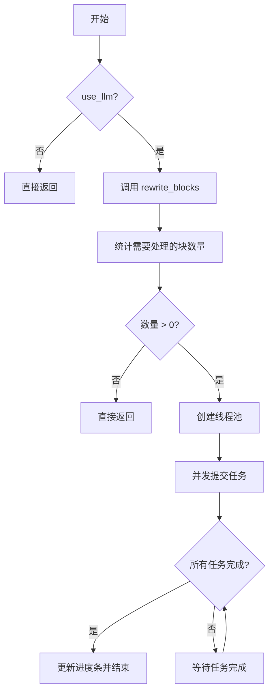
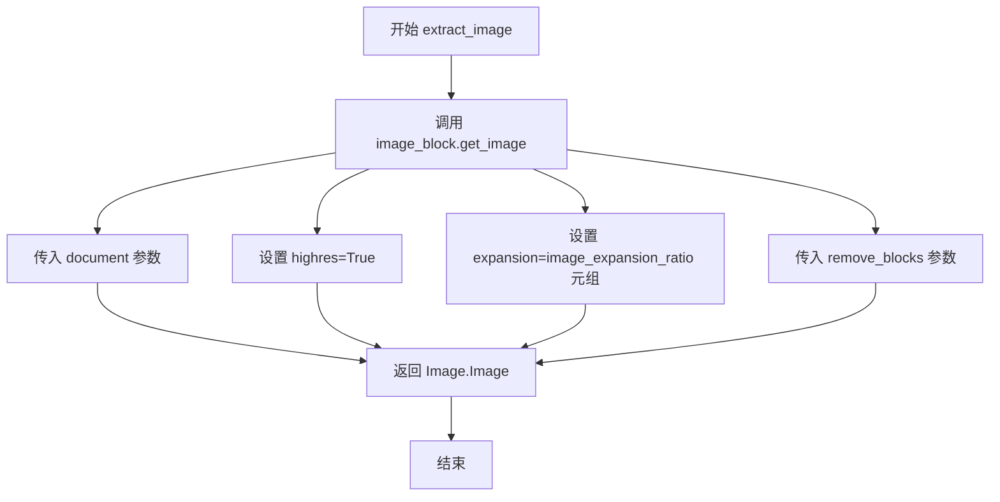
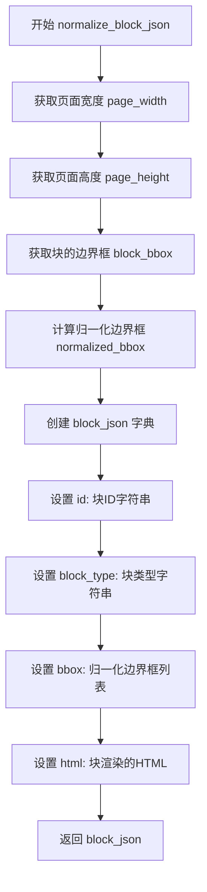
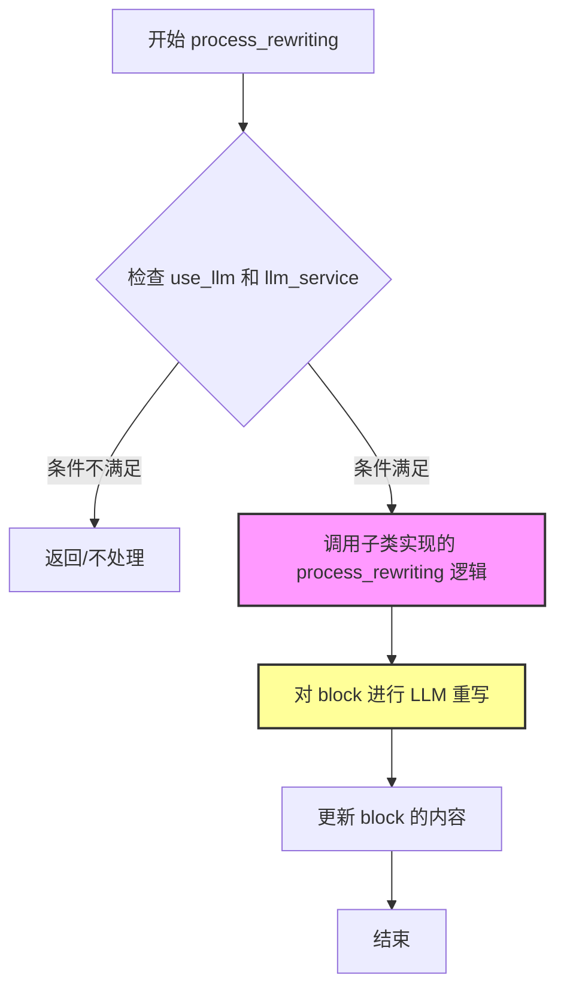
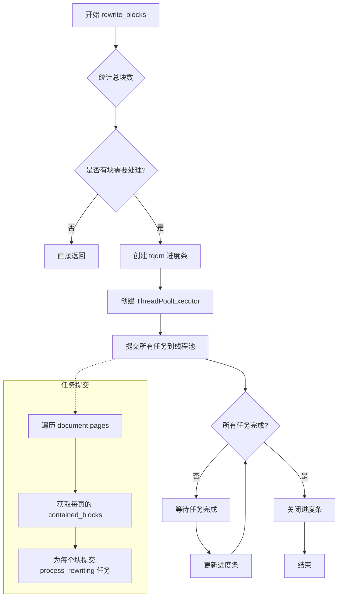
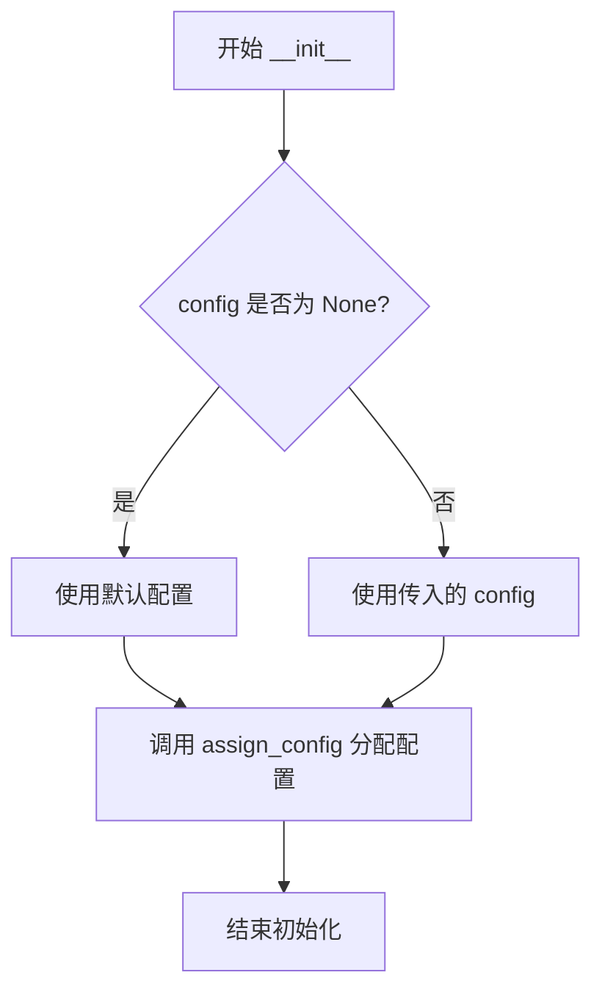
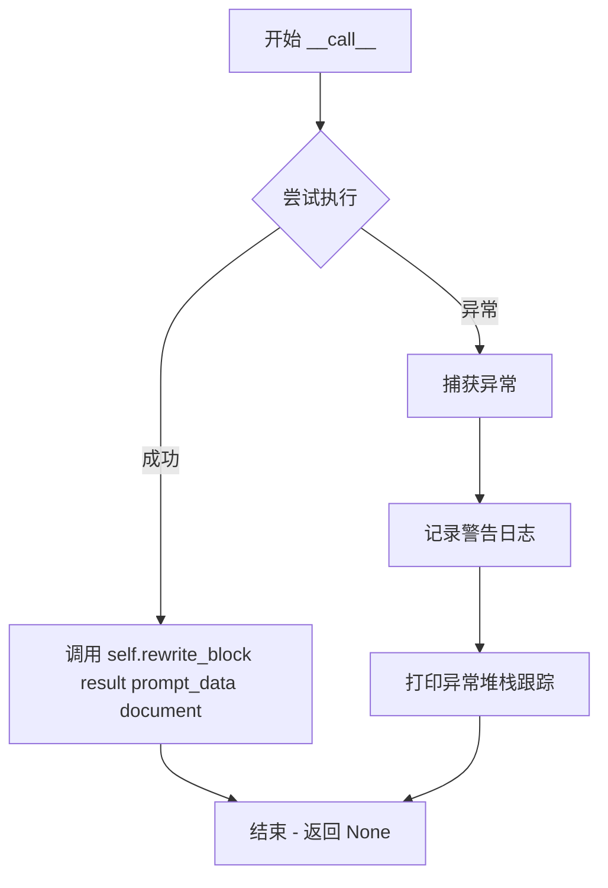
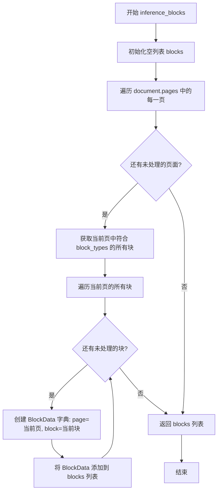
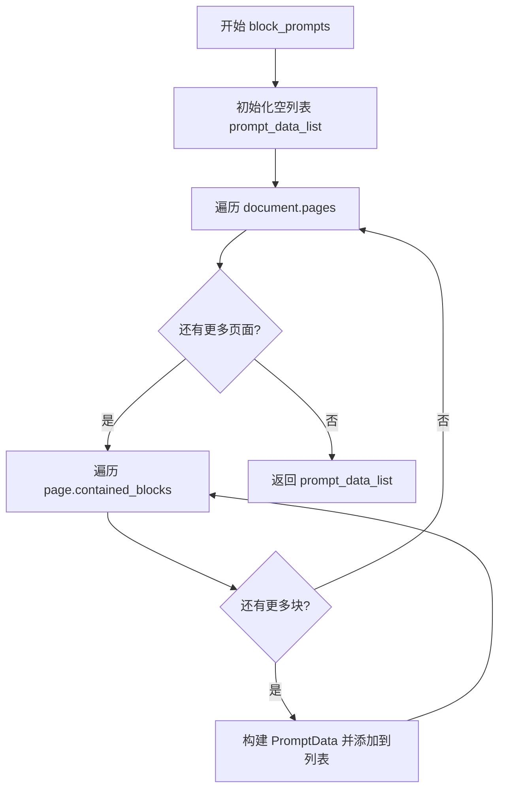
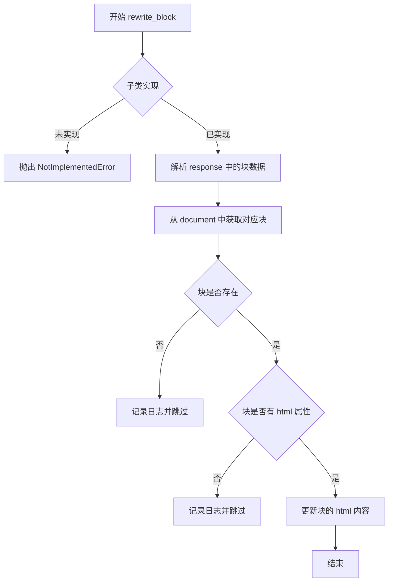

# `marker\marker\processors\llm\__init__.py` 详细设计文档

这是一个基于LLM（大型语言模型）的文档块处理器基类实现，提供将文档块内容进行重写或转换的能力，支持并发处理和图像提取，包含复杂块处理器和简单块处理器两种实现模式。

## 整体流程



## 类结构

```
BaseProcessor (抽象基类)
└── BaseLLMProcessor
    ├── BaseLLMComplexBlockProcessor
    └── BaseLLMSimpleBlockProcessor
```

## 全局变量及字段


### `logger`
    
全局日志记录器实例

类型：`Logger`
    


### `PromptData.prompt`
    
用于LLM的提示词

类型：`str`
    


### `PromptData.image`
    
图像对象

类型：`Image.Image`
    


### `PromptData.block`
    
文档块对象

类型：`Block`
    


### `PromptData.schema`
    
Pydantic数据模型

类型：`BaseModel`
    


### `PromptData.page`
    
页面组对象

类型：`PageGroup`
    


### `PromptData.additional_data`
    
额外数据字典

类型：`dict | None`
    


### `BlockData.page`
    
页面组对象

类型：`PageGroup`
    


### `BlockData.block`
    
文档块对象

类型：`Block`
    


### `BaseLLMProcessor.max_concurrency`
    
最大并发请求数，默认为3

类型：`int`
    


### `BaseLLMProcessor.image_expansion_ratio`
    
图像裁剪扩展比例，默认为0.01

类型：`float`
    


### `BaseLLMProcessor.use_llm`
    
是否使用LLM模型，默认为False

类型：`bool`
    


### `BaseLLMProcessor.disable_tqdm`
    
是否禁用进度条，默认为False

类型：`bool`
    


### `BaseLLMProcessor.block_types`
    
块类型列表

类型：`None`
    


### `BaseLLMProcessor.llm_service`
    
LLM服务实例

类型：`BaseService`
    
    

## 全局函数及方法


### `BaseLLMProcessor.__init__`

该方法是 `BaseLLMProcessor` 类的构造函数，负责初始化处理器的配置和 LLM 服务。它调用父类构造函数，并根据 `use_llm` 标志决定是否设置 LLM 服务实例。

参数：

- `llm_service`：`BaseService`，用于与 LLM 模型交互的服务实例
- `config`：`any`，可选的配置对象，用于初始化处理器参数，默认为 None

返回值：`None`，该方法不返回任何值

#### 流程图

```mermaid
flowchart TD
    A[开始 __init__] --> B[调用 super().__init__config]
    B --> C{self.use_llm is True?}
    C -->|是| D[设置 self.llm_service = llm_service]
    C -->|否| E[设置 self.llm_service = None 并返回]
    D --> F[结束]
    E --> F
```

#### 带注释源码

```python
def __init__(self, llm_service: BaseService, config=None):
    """
    初始化 BaseLLMProcessor 实例。
    
    Args:
        llm_service: BaseService 实例，用于调用 LLM 服务进行块转换
        config: 可选的配置对象，用于初始化处理器参数
    """
    # 调用父类 BaseProcessor 的初始化方法
    # 继承父类的配置初始化逻辑
    super().__init__(config)

    # 默认将 llm_service 设为 None
    self.llm_service = None

    # 如果不使用 LLM，则直接返回，不初始化 llm_service
    # 这种设计允许在不需要 LLM 功能时跳过服务初始化
    if not self.use_llm:
        return

    # 只有当 use_llm 为 True 时，才设置 llm_service
    # 确保 LLM 服务只在需要时被注入
    self.llm_service = llm_service
```


### `BaseLLMProcessor.extract_image`

该方法用于从文档中提取指定图像块的高分辨率图像，支持可选的块过滤功能。

参数：

- `self`：`BaseLLMProcessor`，处理器实例本身
- `document`：`Document`，文档对象，包含页面和块信息
- `image_block`：`Block`，需要提取图像的图像块
- `remove_blocks`：`Sequence[BlockTypes] | None`，可选参数，需要在图像提取时移除的块类型序列

返回值：`Image.Image`，提取后的 PIL 图像对象

#### 流程图



#### 带注释源码

```
def extract_image(
    self,
    document: Document,
    image_block: Block,
    remove_blocks: Sequence[BlockTypes] | None = None,
) -> Image.Image:
    """
    从文档中提取图像块的高分辨率图像
    
    参数:
        document: 文档对象，包含所有页面和块信息
        image_block: 要提取图像的图像块对象
        remove_blocks: 可选的块类型序列，用于在图像裁剪时排除这些块
    
    返回:
        提取后的 PIL Image 对象
    """
    # 调用图像块的 get_image 方法，传入文档和配置参数
    # highres=True 表示提取高分辨率图像
    # expansion 参数控制图像扩展比例，用于保留更多上下文区域
    # remove_blocks 参数用于过滤掉不需要包含在图像中的块类型
    return image_block.get_image(
        document,
        highres=True,
        expansion=(self.image_expansion_ratio, self.image_expansion_ratio),
        remove_blocks=remove_blocks,
    )
```


### `BaseLLMProcessor.normalize_block_json`

该方法将文档块（Block）的边界框（Bounding Box）从原始像素坐标归一化到0-1000的标准化范围，并生成包含块ID、类型、归一化边界框和HTML渲染结果的JSON字典，供LLM处理使用。

参数：

- `block`：`Block`，要处理的文档块对象
- `document`：`Document`，包含所有页面和块的完整文档对象
- `page`：`PageGroup`，块所在的页面组对象，用于获取页面尺寸

返回值：`dict`，包含归一化后块信息的字典，包含id（块ID字符串）、block_type（块类型字符串）、bbox（归一化到0-1000的边界框坐标列表）、html（块的HTML渲染结果）

#### 流程图



#### 带注释源码

```python
def normalize_block_json(self, block: Block, document: Document, page: PageGroup):
    """
    Get the normalized JSON representation of a block for the LLM.
    """
    # 从页面对象获取页面的宽度（像素）
    page_width = page.polygon.width
    # 从页面对象获取页面的高度（像素）
    page_height = page.polygon.height
    # 从块对象获取原始边界框坐标 [x1, y1, x2, y2]
    block_bbox = block.polygon.bbox

    # 将边界框坐标归一化到 0-1000 范围
    # 计算公式：原始坐标 / 页面尺寸 * 1000
    normalized_bbox = [
        (block_bbox[0] / page_width) * 1000,  # 归一化左上角 x 坐标
        (block_bbox[1] / page_height) * 1000,  # 归一化左上角 y 坐标
        (block_bbox[2] / page_width) * 1000,    # 归一化右下角 x 坐标
        (block_bbox[3] / page_height) * 1000,  # 归一化右下角 y 坐标
    ]

    # 构建包含块信息的 JSON 字典
    block_json = {
        "id": str(block.id),                                    # 块的唯一标识符
        "block_type": str(block.id.block_type),                 # 块的类型（如文本、图片等）
        "bbox": normalized_bbox,                                # 归一化后的边界框
        "html": json_to_html(block.render(document)),           # 块的 HTML 渲染结果
    }

    # 返回归一化后的块 JSON 数据
    return block_json
```


### `BaseLLMProcessor.load_blocks`

该方法负责将 LLM 响应中包含的 JSON 字符串块解析为 Python 对象列表。它接收一个包含 "blocks" 键的字典，其中每个 block 都是一个 JSON 字符串，然后使用 `json.loads` 将其反序列化为 Python 对象。

参数：

- `response`：`dict`，包含 "blocks" 键的响应字典，其中 "blocks" 是一个 JSON 字符串列表

返回值：`list[dict]`，解析后的 Python 字典对象列表

#### 流程图

```mermaid
flowchart TD
    A[开始 load_blocks] --> B[获取 response['blocks']]
    B --> C{遍历 blocks}
    C -->|每个 block| D[json.loads(block)]
    D --> E[添加到结果列表]
    E --> C
    C --> F[返回解析后的列表]
    F --> G[结束]
```

#### 带注释源码

```python
def load_blocks(self, response: dict):
    """
    将响应中的 JSON 字符串块解析为 Python 对象列表。
    
    参数:
        response: 包含 "blocks" 键的字典，值为 JSON 字符串列表
        
    返回:
        解析后的 Python 对象（字典）列表
    """
    # 遍历 response 中的 "blocks" 字段，每个元素是 JSON 字符串
    # 使用 json.loads 将其反序列化为 Python 字典对象
    return [json.loads(block) for block in response["blocks"]]
```


### `BaseLLMProcessor.handle_rewrites`

该方法接收LLM重写后的块数据列表，解析每个块的标识符，从文档中定位对应的块对象，并将重写后的HTML内容更新到原块中。若块不存在或解析失败则跳过并记录日志。

参数：

- `blocks`：`list`，包含重写后块数据的列表，每个元素为字典，需包含 `id`（块标识符）和 `html`（重写后的HTML内容）字段
- `document`：`Document`，文档对象，用于根据块标识符检索和更新块

返回值：`None`，该方法直接修改文档中的块对象，不返回任何值

#### 流程图

```mermaid
flowchart TD
    A[开始 handle_rewrites] --> B{遍历 blocks 中的每个 block_data}
    B --> C[解析 block_id: 去除首尾斜杠并分割]
    C --> D[构建 BlockId 对象: page_id, block_id, block_type]
    D --> E{从 document 获取 block}
    E -->|块存在| F{检查 block 是否有 html 属性}
    E -->|块不存在| G[记录调试日志并继续下一轮]
    F -->|有 html 属性| H[更新 block.html 为 block_data['html']]
    F -->|无 html 属性| I[跳过当前块]
    H --> J{处理过程中是否发生异常}
    G --> J
    I --> J
    J -->|发生异常| K[捕获异常并记录调试日志]
    K --> B
    J -->|无异常| B
    B -->|遍历完成| L[结束]
```

#### 带注释源码

```python
def handle_rewrites(self, blocks: list, document: Document):
    """
    处理LLM重写后的块数据，更新文档中对应块的HTML内容。
    
    Args:
        blocks: 包含重写块数据的列表，每个元素需包含 'id' 和 'html' 字段
        document: 文档对象，用于检索和更新块
    """
    # 遍历每个待重写的块数据
    for block_data in blocks:
        try:
            # 1. 解析块标识符：去除首尾斜杠后分割
            # 原始格式类似: "/page_id/block_type/block_id"
            block_id = block_data["id"].strip().lstrip("/")
            
            # 2. 分割获取各组成部分：空字符串、页面ID、块类型、块ID
            _, page_id, block_type, block_id = block_id.split("/")
            
            # 3. 构建 BlockId 对象，用于文档检索
            # 使用 getattr 从 BlockTypes 枚举获取对应的块类型
            block_id = BlockId(
                page_id=page_id,
                block_id=block_id,
                block_type=getattr(BlockTypes, block_type),
            )
            
            # 4. 从文档中获取对应的块对象
            block = document.get_block(block_id)
            if not block:
                # 块不存在时记录调试日志并跳过
                logger.debug(f"Block {block_id} not found in document")
                continue

            # 5. 检查块是否具有 html 属性，若有则更新
            if hasattr(block, "html"):
                block.html = block_data["html"]
        except Exception as e:
            # 异常处理：解析失败时记录调试日志并继续处理下一个块
            logger.debug(f"Error parsing block ID {block_data['id']}: {e}")
            continue
```


### `BaseLLMComplexBlockProcessor.__call__`

该方法是 `BaseLLMComplexBlockProcessor` 类的核心调用入口，使得该处理器实例可以像函数一样被调用。它负责检查 LLM 是否启用并在文档上执行块重写操作，同时妥善处理可能出现的异常情况。

参数：

- `document`：`Document`，待处理的文档对象，包含需要被 LLM 重写的页面和块内容

返回值：`None`，该方法不返回任何值，主要通过副作用（修改文档内容）产生作用

#### 流程图

```mermaid
flowchart TD
    A[开始 __call__] --> B{self.use_llm 为 True 且 self.llm_service 不为 None?}
    B -->|否| C[直接返回]
    B -->|是| D[执行 self.rewrite_blocks(document)]
    D --> E{是否发生异常?}
    E -->|否| F[正常结束]
    E -->|是| G[捕获异常并记录警告日志]
    G --> F
    
    style C fill:#f9f,color:#000
    style F fill:#9f9,color:#000
    style G fill:#ffcccb,color:#000
```

#### 带注释源码

```python
def __call__(self, document: Document):
    """
    使处理器实例可调用，对文档执行块重写操作。
    
    Args:
        document: Document 对象，包含待处理的页面和块数据
        
    Returns:
        None: 该方法通过修改 document 的内容产生副作用，无返回值
    """
    # 检查是否启用 LLM 处理且 LLM 服务已正确初始化
    # 如果未启用 LLM 或服务为空，则直接返回，不执行任何操作
    if not self.use_llm or self.llm_service is None:
        return

    try:
        # 调用内部方法执行实际的块重写逻辑
        # 该方法会遍历文档中的所有页面和指定类型的块
        # 通过线程池并发处理这些块
        self.rewrite_blocks(document)
    except Exception as e:
        # 捕获重写过程中可能发生的任何异常
        # 记录警告日志但不完全中断执行流程
        # 这确保了即使部分块处理失败，整体流程仍可继续
        logger.warning(f"Error rewriting blocks in {self.__class__.__name__}: {e}")
```


### `BaseLLMComplexBlockProcessor.process_rewriting`

这是一个抽象方法，用于对文档中的单个块进行 LLM 重写处理。具体逻辑由子类实现。

参数：

- `self`：`BaseLLMComplexBlockProcessor`，隐含的实例参数
- `document`：`Document`，待处理的文档对象
- `page`：`PageGroup`，当前块所在的页面组
- `block`：`Block`，待重写的块对象

返回值：`None`（该方法抛出 `NotImplementedError`，需由子类实现具体逻辑）

#### 流程图



#### 带注释源码

```python
def process_rewriting(self, document: Document, page: PageGroup, block: Block):
    """
    对文档中的单个块进行 LLM 重写处理。
    
    这是一个抽象方法，具体逻辑由子类实现。
    子类需要实现如何利用 LLM 服务对 block 进行内容重写，
    并将结果更新到 document 中。
    
    参数:
        document: Document, 整个文档对象，包含所有页面和块
        page: PageGroup, 当前块所属的页面组
        block: Block, 需要被 LLM 重写的块
    
    返回:
        无返回值（子类实现时可根据需求设计返回值）
    
    异常:
        NotImplementedError: 当子类未实现该方法时抛出
    """
    raise NotImplementedError()
```


### `BaseLLMComplexBlockProcessor.rewrite_blocks`

该方法负责使用 LLM 重写文档中的多个块。它通过线程池并发处理所有符合条件的内容块，利用 tqdm 显示处理进度，并在处理完成后关闭进度条。

参数：

- `self`：实例本身
- `document`：`Document`，待处理的文档对象，包含所有页面和块的信息

返回值：`None`，该方法直接修改文档中的块内容，无返回值

#### 流程图



#### 带注释源码

```python
def rewrite_blocks(self, document: Document):
    """
    使用 LLM 重写文档中的所有符合条件的内容块。
    通过线程池并发处理这些块，并使用 tqdm 显示处理进度。
    
    Args:
        document: Document 对象，包含待处理的文档内容
        
    Returns:
        None: 直接在原文档对象上修改块内容
    """
    
    # 第一步：统计所有需要处理的块总数
    # 遍历文档的每一页，统计符合 block_types 类型的块数量
    total_blocks = sum(
        len(page.contained_blocks(document, self.block_types))
        for page in document.pages
    )
    
    # 如果没有需要处理的块，直接返回，避免不必要的资源消耗
    if total_blocks == 0:
        return

    # 第二步：初始化进度条
    # 使用 tqdm 显示处理进度，desc 为进度条描述信息
    pbar = tqdm(
        total=total_blocks,
        desc=f"{self.__class__.__name__} running",
        disable=self.disable_tqdm  # 可选的禁用进度条配置
    )
    
    # 第三步：使用线程池并发处理所有块
    # max_workers 控制最大并发数（来自类属性 max_concurrency）
    with ThreadPoolExecutor(max_workers=self.max_concurrency) as executor:
        # 构建任务列表：为每个页面中的每个符合类型的块提交一个处理任务
        # 使用 as_completed 可以实现任务完成即处理，提高效率
        for future in as_completed(
            [
                executor.submit(self.process_rewriting, document, page, block)
                for page in document.pages
                for block in page.contained_blocks(document, self.block_types)
            ]
        ):
            # 第四步：获取任务结果
            # 调用 result() 会抛出任务中产生的异常，确保错误被及时发现
            future.result()  # Raise exceptions if any occurred
            
            # 每完成一个任务更新一次进度条
            pbar.update(1)

    # 第五步：清理资源，关闭进度条
    pbar.close()
```


### `BaseLLMSimpleBlockProcessor.__init__`

这是 `BaseLLMSimpleBlockProcessor` 类的初始化方法，负责配置处理器的配置参数。该方法继承自 `BaseLLMProcessor`，但进行了简化，不需要 LLM 服务即可初始化。

参数：

- `config`：任意类型，可选，配置参数，用于初始化处理器的各项配置

返回值：`None`，无返回值

#### 流程图



#### 带注释源码

```python
def __init__(self, config=None):
    """
    初始化 BaseLLMSimpleBlockProcessor 实例。
    
    注意：此方法覆盖了父类 BaseLLMProcessor 的 __init__，
    简化了初始化逻辑，不需要传入 llm_service 参数。
    
    参数:
        config: 可选的配置对象，用于配置处理器的各项参数。
               如果为 None，则使用默认配置。
    """
    # 调用 assign_config 将配置分配给当前对象的类属性
    # assign_config 是 marker.util 中的工具函数，用于将配置字典
    # 或配置对象的值赋值为类的字段
    assign_config(self, config)
```


### `BaseLLMSimpleBlockProcessor.__call__`

该方法是 `BaseLLMSimpleBlockProcessor` 类的实例调用接口，用于调用 LLM 重写单个块（block）。它接收 LLM 返回的结果、提示数据和文档对象作为参数，委托给 `rewrite_block` 方法执行具体的重写逻辑，并处理可能的异常情况。

参数：

- `result`：`dict`，LLM 调用后返回的响应结果字典，包含待处理的块数据
- `prompt_data`：`PromptData`，提示数据字典，包含 prompt、image（图像）、block（块对象）、schema（数据模型）、page（页面组）和 additional_data（附加数据）
- `document`：`Document`，文档对象，包含完整的文档结构和内容信息

返回值：`None`，该方法没有返回值

#### 流程图



#### 带注释源码

```python
def __call__(self, result: dict, prompt_data: PromptData, document: Document):
    """
    实例调用接口，用于重写单个块。
    
    参数:
        result: LLM 返回的响应结果字典
        prompt_data: 包含提示信息的字典数据
        document: 文档对象
    """
    try:
        # 尝试调用 rewrite_block 方法执行块的重写逻辑
        # rewrite_block 方法在子类中实现，具体逻辑因业务场景而异
        self.rewrite_block(result, prompt_data, document)
    except Exception as e:
        # 捕获所有异常并记录警告日志
        # 这里使用 logger.warning 而不是 logger.error，暗示该异常不影响主流程
        logger.warning(f"Error rewriting block in {self.__class__.__name__}: {e}")
        # 打印完整的异常堆栈信息，便于调试
        traceback.print_exc()
    # 注意：该方法没有显式返回值，隐式返回 None
```


### `BaseLLMSimpleBlockProcessor.inference_blocks`

该方法用于从文档中提取所有符合指定块类型的页面和块组合，并以 `BlockData` 列表的形式返回，供后续的提示数据生成和块重写使用。

参数：

- `self`：`BaseLLMSimpleBlockProcessor`，当前处理器实例
- `document`：`Document`，需要处理的文档对象，包含所有页面和块信息

返回值：`List[BlockData]`，返回包含页面和块信息的字典列表，其中 `BlockData` 是 TypedDict，包含 `page`（PageGroup 类型）和 `block`（Block 类型）字段

#### 流程图



#### 带注释源码

```python
def inference_blocks(self, document: Document) -> List[BlockData]:
    """
    从文档中提取所有符合指定块类型的页面和块组合。
    
    参数:
        document: Document 对象，包含所有页面和块信息
        
    返回:
        List[BlockData]: 包含 page 和 block 的字典列表
    """
    blocks = []
    # 遍历文档中的所有页面
    for page in document.pages:
        # 获取当前页面中符合 block_types 条件的所有块
        # block_types 是类属性，定义了需要处理的块类型
        for block in page.contained_blocks(document, self.block_types):
            # 将页面和块组合成 BlockData 字典并添加到列表
            blocks.append({"page": page, "block": block})
    # 返回收集到的所有块数据
    return blocks
```


### `BaseLLMSimpleBlockProcessor.block_prompts`

该方法是一个抽象方法，用于根据文档对象生成需要处理的提示数据列表（包含提示词、图像、块、模式配置和页面信息）。它遍历文档的每一页，筛选特定类型的块，并为每个块构建 `PromptData` 供 LLM 处理。

参数：

- `document`：`Document`，待处理的文档对象，包含所有页面和块的信息

返回值：`List[PromptData]`，提示数据列表，每个元素包含提示词、图像、块、模式配置和页面信息

#### 流程图



#### 带注释源码

```python
def block_prompts(self, document: Document) -> List[PromptData]:
    """
    生成需要处理的提示数据列表。
    
    该方法是一个抽象方法，需要在子类中实现具体逻辑。
    它遍历文档的每一页，根据 block_types 筛选特定类型的块，
    并为每个块构建 PromptData 供 LLM 处理。
    
    参数:
        document: Document 对象，包含待处理的文档内容
        
    返回值:
        List[PromptData]: 提示数据列表，每个元素是一个 TypedDict，
        包含 prompt、image、block、schema、page 和 additional_data
        
    注意:
        此方法默认抛出 NotImplementedError，需要在子类中重写
    """
    raise NotImplementedError()
```


### `BaseLLMSimpleBlockProcessor.rewrite_block`

该方法是 `BaseLLMSimpleBlockProcessor` 类中的抽象方法，用于使用 LLM 服务重写单个文档块（Block）。它接收 LLM 响应、提示数据和文档对象，并在子类中实现具体的块重写逻辑。当前实现抛出 `NotImplementedError`，表明这是一个需要子类重写的接口方法。

参数：

- `self`：实例本身
- `response`：`dict`，LLM 服务返回的响应结果，包含重写后的块数据
- `prompt_data`：`PromptData`，包含提示词信息、图像、目标块、输出 schema、所属页面等数据的字典
- `document`：`Document`，整个文档对象，用于获取和更新块信息

返回值：`None`，该方法没有返回值（通过修改 `document` 中的块对象来更新内容）

#### 流程图



#### 带注释源码

```python
def rewrite_block(
    self, response: dict, prompt_data: PromptData, document: Document
):
    """
    使用 LLM 响应重写单个文档块。
    
    参数:
        response: LLM 服务返回的响应字典，包含重写后的块内容
        prompt_data: 提示数据，包含原始块、图像、schema 等信息
        document: 文档对象，用于获取和更新块
    
    注意:
        这是一个抽象方法，需要在子类中实现具体逻辑。
        当前实现抛出 NotImplementedError。
    """
    raise NotImplementedError()
```

## 关键组件


### PromptData

用于存储LLM调用所需的提示数据的字典类型，包含prompt字符串、图像对象、块对象、schema模型、页面组和可选的附加数据。

### BlockData

用于存储页面组和块信息的简单字典类型，作为块处理流程中的数据传输对象。

### BaseLLMProcessor

基于BaseProcessor的LLM处理基类，提供块提取、归一化、加载和重写等核心功能。包含max_concurrency并发控制、image_expansion_ratio图像扩展比例、use_llm开关、disable_tqdm进度条控制等配置字段，以及extract_image图像提取、normalize_block_json块归一化、load_blocks块加载、handle_rewrites重写处理等核心方法。

### BaseLLMComplexBlockProcessor

继承自BaseLLMProcessor的复杂块处理器类，用于处理需要更复杂逻辑的文档块。使用ThreadPoolExecutor实现并发处理，通过rewrite_blocks方法遍历所有页面和块，支持进度条显示，调用process_rewriting方法执行具体的块重写逻辑。

### BaseLLMSimpleBlockProcessor

继承自BaseLLMProcessor的简单块处理器类，用于处理单个块的LLM转换。实现inference_blocks方法收集待处理块，block_prompts方法生成块提示数据，rewrite_block方法执行单块重写，采用回调模式通过__call__方法处理结果。

### 张量索引与惰性加载

代码中通过document.get_block(block_id)实现按需加载块，避免一次性加载所有块到内存。contained_blocks方法返回页面包含的特定类型块，实现惰性遍历。

### 反量化支持

normalize_block_json方法将块的几何坐标从原始像素尺寸归一化到0-1000范围，消除不同页面尺寸带来的差异，实现坐标系的统一处理。

### 量化策略

使用TypedDict定义数据结构减少内存开销，通过max_concurrency参数控制并发数量平衡性能和资源消耗，支持disable_tqdm禁用进度条减少I/O开销。


## 问题及建议


### 已知问题

-   **BaseLLMProcessor.__init__ 逻辑冗余**：`self.llm_service = None` 赋值在 if 块之外，无论 `use_llm` 是否为 True 都会执行，前面的条件判断 return 后该赋值仍会执行，逻辑冗余
-   **BaseLLMSimpleBlockProcessor.__init__ 未调用父类初始化**：覆盖了父类的 `__init__` 方法但没有调用 `super().__init__`，导致父类中的一些初始化逻辑（如配置处理）可能被跳过
-   **异常处理不完善**：`BaseLLMComplexBlockProcessor.rewrite_blocks` 中 `future.result()` 会立即抛出异常，但 `pbar.update(1)` 可能在异常发生前已执行，导致进度条计数不准确；且异常仅记录 warning，不会重试或上报
-   **缺少抽象方法定义**：虽然 `BaseLLMSimpleBlockProcessor` 中的 `block_prompts` 和 `rewrite_block` 方法抛出 `NotImplementedError`，但没有使用 `abc` 模块进行真正的抽象类定义，无法在编译时检测子类是否实现这些方法
-   **类型标注不一致**：`inference_blocks` 方法返回类型声明为 `List[BlockData]`，但实际返回的是普通字典列表 `List[dict]`，与 TypedDict 定义不符
-   **字符串操作效率较低**：`handle_rewrites` 中使用多次 `split`、`strip`、`lstrip` 组合解析 block id，可以优化为更高效的解析方式
-   **硬编码数值**：`normalize_block_json` 中硬编码了归一化范围 `1000`，这个值应该可通过配置调整
- **进度条资源未及时释放**：虽然使用了 `pbar.close()`，但在异常情况下可能无法正确关闭，建议使用上下文管理器

### 优化建议

-   **重构初始化逻辑**：清理 `BaseLLMProcessor.__init__` 中的冗余代码，将 `self.llm_service = None` 移到条件判断之前或合并到 if-else 逻辑中
-   **添加父类初始化调用**：在 `BaseLLMSimpleBlockProcessor.__init__` 中调用 `super().__init__(config)` 或确保必要的初始化逻辑被保留
-   **改进异常处理**：将 `future.result()` 包裹在 try-except 中，确保进度条计数准确；考虑添加重试机制或更详细的错误收集
-   **使用 abc 模块**：将 `BaseLLMSimpleBlockProcessor` 继承自 `ABC`，并使用 `@abstractmethod` 装饰器定义抽象方法
-   **修正类型标注**：将 `inference_blocks` 的返回类型改为 `List[dict]` 或正确构造 `BlockData` 对象
-   **优化字符串解析**：预先编译正则表达式或使用更高效的解析逻辑处理 block id
-   **配置化硬编码值**：将归一化范围等硬编码值提取为类属性或配置参数
-   **使用上下文管理器**：将 tqdm 进度条放入 `with` 语句中，确保资源正确释放

## 其它


### 设计目标与约束

**设计目标**：
- 提供一个灵活的框架，利用LLM将文档块（Block）转换为HTML或其他格式
- 支持并发处理以提高性能
- 提供两种处理模式：复杂块处理（多线程）和简单块处理（单块）

**约束**：
- 依赖外部LLM服务（BaseService）
- 需要PIL处理图像
- 需要pydantic进行数据验证
- 线程池最大并发数受`max_concurrency`限制（默认3）

### 错误处理与异常设计

**异常处理策略**：
- `BaseLLMComplexBlockProcessor.rewrite_blocks`: 使用try-except捕获异常并记录警告日志，允许继续处理其他块
- `BaseLLMSimpleBlockProcessor.__call__`: 捕获异常后记录警告并打印完整堆栈跟踪
- `handle_rewrites`: 遍历处理块时捕获异常并跳过失败的块，记录debug级别日志

**异常分类**：
- `NotImplementedError`: 子类必须实现的抽象方法（process_rewriting、block_prompts、rewrite_block）
- 块解析异常：块ID解析失败时跳过该块
- LLM服务异常：在调用链中传播，由上层处理

### 数据流与状态机

**主要数据流**：
1. **复杂块处理流程**：
   - `rewrite_blocks` → 遍历所有页面和目标块类型 → 提交到线程池 → `process_rewriting` → LLM调用 → 更新文档块

2. **简单块处理流程**：
   - `inference_blocks` → 收集所有待处理块 → `block_prompts` → 生成Prompt数据 → `rewrite_block` → 更新结果字典

**状态转换**：
- 初始状态：use_llm=False，llm_service=None
- 就绪状态：use_llm=True，llm_service已设置
- 处理中：线程池活跃执行任务
- 完成状态：所有块处理完毕或total_blocks=0提前返回

### 外部依赖与接口契约

**核心依赖**：
- `marker.output.json_to_html`: 将JSON转换为HTML
- `marker.processors.BaseProcessor`: 处理器基类
- `marker.schema`: 文档块结构定义
- `marker.services.BaseService`: LLM服务接口
- `PIL.Image`: 图像处理
- `pydantic.BaseModel`: 数据验证模型
- `concurrent.futures.ThreadPoolExecutor`: 并发处理

**接口契约**：
- `BaseService`: 必须提供LLM调用能力
- `Block`: 必须提供get_image、polygon、bbox、render等方法
- `Document`: 必须提供get_block、pages属性
- `PageGroup`: 必须提供contained_blocks方法

### 配置管理

**配置项**：
- `max_concurrency`: 最大并发请求数（默认3）
- `image_expansion_ratio`: 图像裁剪扩展比例（默认0.01）
- `use_llm`: 是否启用LLM处理（默认False）
- `disable_tqdm`: 是否禁用进度条（默认False）

**配置来源**：通过config字典传入，由`assign_config`函数分配

### 性能考虑

**性能优化点**：
- 使用ThreadPoolExecutor实现并发处理
- 图像提取支持highres参数按需获取高分辨率
- 当无块需要处理时提前返回，避免不必要的计算

**性能瓶颈**：
- LLM服务响应时间
- 图像提取的I/O操作
- JSON序列化/反序列化开销

### 安全性考虑

**安全措施**：
- 块ID解析时使用strip和lstrip防止注入
- 异常捕获防止单点失败导致整个流程中断
- 日志记录便于审计追踪

### 测试策略

**测试重点**：
- 块ID解析的边界情况
- 图像提取的参数验证
- 并发处理下的线程安全性
- 异常处理的完整性

### 并发与线程安全

**并发模型**：
- 使用ThreadPoolExecutor管理线程生命周期
- 通过as_completed实现任务完成即处理
- 进度条更新在主线程中完成

**线程安全考量**：
- document对象在多线程间共享，需确保底层实现线程安全
- 块更新操作（setattr）应考虑同步机制


    