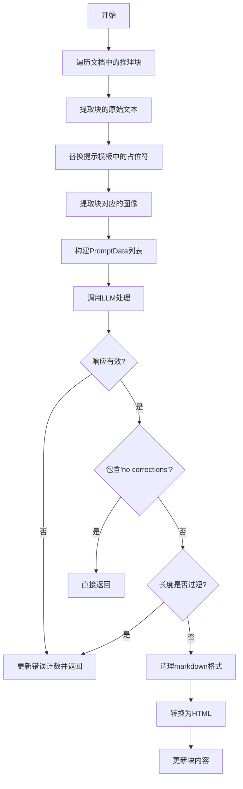
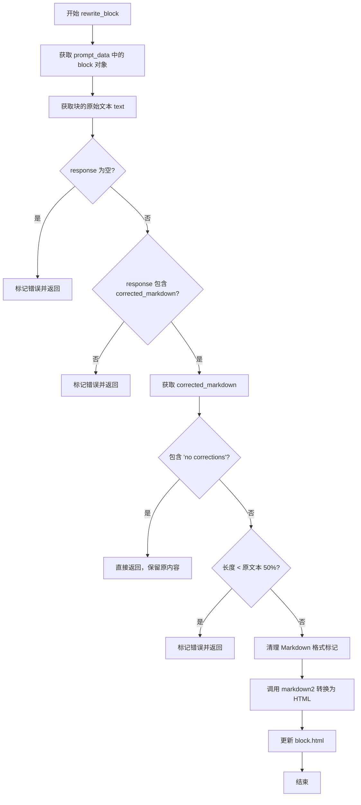

# `marker\marker\processors\llm\llm_complex.py` 详细设计文档

这是一个基于LLM的复杂区域处理器，用于将文档图像中的复杂文本区域（如表格、数学公式、代码块等）转换为格式化的Markdown表示，通过调用语言模型进行文本校正和格式化。

## 整体流程



## 类结构

```
BaseLLMSimpleBlockProcessor (基类)
└── LLMComplexRegionProcessor
    └── ComplexSchema (Pydantic模型)
```

## 全局变量及字段


### `List`
    
Python类型提示中的列表类型，用于注解列表对象

类型：`typing.List`
    


### `markdown2`
    
Markdown到HTML的转换库，用于将校正后的markdown转换为HTML

类型：`module`
    


### `BaseModel`
    
Pydantic数据验证基类，用于定义数据结构模型

类型：`pydantic.BaseModel`
    


### `PromptData`
    
LLM提示数据结构，包含提示词、图像、块和模式信息

类型：`marker.processors.llm.PromptData`
    


### `BaseLLMSimpleBlockProcessor`
    
LLM简单块处理器基类，提供块处理的基本框架和方法

类型：`marker.processors.llm.BaseLLMSimpleBlockProcessor`
    


### `BlockTypes`
    
文档块类型枚举，定义了各种文档块的类型标识

类型：`marker.schema.BlockTypes`
    


### `Document`
    
文档数据结构，包含文档的元数据和内容块

类型：`marker.schema.document.Document`
    


### `ComplexSchema`
    
Pydantic模型类，用于验证LLM返回的校正markdown数据

类型：`class`
    


### `LLMComplexRegionProcessor.block_types`
    
处理的块类型，值为(BlockTypes.ComplexRegion,)，指定该处理器仅处理复杂区域块

类型：`tuple`
    


### `LLMComplexRegionProcessor.complex_region_prompt`
    
LLM提示词模板，包含详细的格式化规则和示例，用于指导LLM正确校正markdown文本

类型：`str`
    


### `ComplexSchema.corrected_markdown`
    
LLM返回的校正后markdown文本，包含从图像中提取并校正的内容

类型：`str`
    
    

## 全局函数及方法


# LLMComplexRegionProcessor 设计文档

## 一段话描述

`LLMComplexRegionProcessor` 是一个基于 LLM 的复杂文本区域处理器，继承自 `BaseLLMSimpleBlockProcessor`，专门用于处理文档中的复杂区域块（如表格、表格数据等），通过大型语言模型将图像中提取的文本转换为格式规范的 Markdown 表示，并对返回的结果进行校验和转换。

## 文件的整体运行流程

```
1. 初始化阶段
   └── 加载 complex_region_prompt 模板（包含 Markdown 格式规则和示例）

2. 处理阶段
   ├── block_prompts() 方法
   │   ├── 遍历文档中的 ComplexRegion 类型块
   │   ├── 提取块文本和图像
   │   ├── 替换 prompt 模板中的 {extracted_text} 占位符
   │   └── 返回 PromptData 列表（包含 prompt、image、block、schema、page）

3. LLM 推理阶段
   └── 将 PromptData 发送给 LLM 进行处理

4. 重写阶段
   └── rewrite_block() 方法
       ├── 解析 LLM 响应
       ├── 校验响应有效性（检查 corrected_markdown 字段）
       ├── 处理特殊标记（"no corrections"、长度校验）
       └── 将 Markdown 转换为 HTML 并更新块内容

5. 完成
   └── 返回处理后的 Document 对象
```

## 类的详细信息

### 1. LLMComplexRegionProcessor 类

#### 类字段

- `block_types`：元组类型，指定处理的块类型为 `(BlockTypes.ComplexRegion,)`

- `complex_region_prompt`：字符串类型，包含用于指导 LLM 进行文本纠正的完整提示词模板，包含 Markdown 格式规则、示例输入输出

#### 类方法

##### block_prompts()

- **名称**：`block_prompts`
- **参数**：
  - `document`：`Document` 类型，文档对象，包含所有块和页面信息
- **返回值**：`List[PromptData]` 类型，包含所有复杂区域块的提示数据列表
- **描述**：遍历文档中的所有复杂区域块，为每个块生成 LLM 推理所需的提示数据

##### rewrite_block()

- **名称**：`rewrite_block`
- **参数**：
  - `response`：`dict` 类型，LLM 返回的响应字典
  - `prompt_data`：`PromptData` 类型，包含原始提示数据和块信息
  - `document`：`Document` 类型，文档对象
- **返回值**：无（`None`）
- **描述**：根据 LLM 的响应重写块内容，包括校验响应有效性、处理特殊标记、将 Markdown 转换为 HTML

### 2. ComplexSchema 类

#### 类字段

- `corrected_markdown`：字符串类型，表示 LLM 纠正后的 Markdown 文本

#### 类方法

无显式方法，继承自 Pydantic 的 `BaseModel`，自动生成验证器和序列化方法

## 全局变量和全局函数

无独立的全局变量或全局函数

## 关键组件信息

| 组件名称 | 一句话描述 |
|---------|-----------|
| BaseLLMSimpleBlockProcessor | 基础 LLM 简单块处理器父类，提供块处理和 LLM 交互的通用框架 |
| PromptData | 提示数据结构，包含 prompt、image、block、schema、page 等字段 |
| Document | 文档对象模型，包含文档的所有块和页面信息 |
| BlockTypes | 块类型枚举，定义不同类型的文档块 |
| markdown2 | Markdown 转 HTML 的转换库 |
| ComplexSchema | Pydantic 模型，定义 LLM 响应的数据结构 |

## 潜在的技术债务或优化空间

1. **错误处理不够健壮**：`rewrite_block` 方法中的错误处理较为简单，仅通过 `llm_error_count` 元数据标记错误，未实现重试机制

2. **Prompt 模板硬编码**：复杂的 prompt 模板直接写在类中，难以动态调整和维护

3. **缺少缓存机制**：对于相同内容的块，可能会重复调用 LLM，可以考虑添加结果缓存

4. **Markdown 转换依赖外部库**：使用 `markdown2` 库，但未对转换失败的情况进行处理

5. **长度校验阈值硬编码**：`.5` (50%) 的长度阈值硬编码在代码中，应作为配置参数

6. **类型注解不完整**：部分变量（如 `text`、`image`）使用了局部变量但类型注解不够明确

## 其它项目

### 设计目标与约束

- **目标**：准确地将图像中的复杂文本区域（特别是表格、表单等）转换为格式规范的 Markdown
- **约束**：
  - 不能遗漏任何原文信息
  - 输出必须符合 Markdown 语法规范
  - 处理的块类型仅限于 `ComplexRegion`

### 错误处理与异常设计

- **响应为空或无 corrected_markdown**：标记 `llm_error_count=1`
- **响应包含 "no corrections"**：保留原始内容，不进行修改
- **响应长度过短**（小于原文 50%）：标记 `llm_error_count=1`
- **Markdown 转换异常**：依赖 markdown2 库自身异常处理

### 数据流与状态机

```
Document -> block_prompts() -> PromptData List -> LLM Inference
                                                      |
                                                      v
Document <- rewrite_block() <- response <- LLM Response
```

### 外部依赖与接口契约

- **marker.processors.llm.PromptData**：输入数据结构
- **marker.schema.BlockTypes.ComplexRegion**：块类型标识
- **marker.schema.document.Document**：文档对象接口
- **markdown2.markdown()**：Markdown 到 HTML 的转换接口
- **pydantic.BaseModel**：数据验证接口

---

## 详细方法文档

### `LLMComplexRegionProcessor.block_prompts`

#### 描述

该方法遍历文档中的所有复杂区域块，为每个块生成 LLM 推理所需的提示数据。它从每个块中提取原始文本和图像，并将提示词模板中的占位符替换为实际文本。

参数：

- `document`：`Document` 类型，文档对象，包含所有块和页面信息

返回值：`List[PromptData]` 类型，包含所有复杂区域块的提示数据列表，每个元素包含：
  - `prompt`：替换后的完整提示词
  - `image`：提取的块图像
  - `block`：原始块对象
  - `schema`：响应数据结构（`ComplexSchema`）
  - `page`：所在页面对象

#### 流程图

```mermaid
flowchart TD
    A[开始 block_prompts] --> B[初始化空列表 prompt_data]
    B --> C[遍历 document 中的 inference_blocks]
    C --> D{还有更多块?}
    D -->|是| E[获取当前块]
    E --> F[调用 block.raw_text 获取原始文本]
    F --> G[替换 prompt 模板中的 {extracted_text}]
    G --> H[调用 extract_image 提取块图像]
    H --> I[构建 PromptData 字典]
    I --> J[添加到 prompt_data 列表]
    J --> C
    D -->|否| K[返回 prompt_data 列表]
    K --> L[结束]
```

#### 带注释源码

```python
def block_prompts(self, document: Document) -> List[PromptData]:
    """
    为文档中的每个复杂区域块生成 LLM 推理所需的提示数据
    
    参数:
        document: Document 对象，包含文档的所有块和页面
        
    返回:
        PromptData 列表，每个元素包含 prompt、image、block、schema、page
    """
    prompt_data = []
    # 遍历文档中所有需要推理的 ComplexRegion 类型的块
    for block in self.inference_blocks(document):
        # 从块中提取原始文本内容
        text = block["block"].raw_text(document)
        # 将文本替换到 prompt 模板中
        prompt = self.complex_region_prompt.replace("{extracted_text}", text)
        # 提取块的图像用于 LLM 分析
        image = self.extract_image(document, block["block"])
        # 构建提示数据结构，包含 schema 指定响应格式
        prompt_data.append({
            "prompt": prompt,          # 完整的提示词
            "image": image,             # 块图像数据
            "block": block["block"],   # 原始块对象引用
            "schema": ComplexSchema,   # Pydantic 响应模型
            "page": block["page"]      # 所在页面对象
        })
    return prompt_data
```

---

### `LLMComplexRegionProcessor.rewrite_block`

#### 描述

该方法根据 LLM 的响应重写文档块的内容。它首先验证响应的有效性，然后处理特殊标记（如 "no corrections"），最后将纠正后的 Markdown 文本转换为 HTML 并更新到块中。

参数：

- `response`：`dict` 类型，LLM 返回的响应字典，应包含 `corrected_markdown` 字段
- `prompt_data`：`PromptData` 类型，包含原始提示数据和块信息
- `document`：`Document` 类型，文档对象，用于访问块内容

返回值：无（`None`），直接修改块对象

#### 流程图



#### 带注释源码

```python
def rewrite_block(self, response: dict, prompt_data: PromptData, document: Document):
    """
    根据 LLM 响应重写块内容
    
    参数:
        response: LLM 返回的响应字典
        prompt_data: 包含原始提示数据和块信息的字典
        document: Document 对象，用于访问块内容
    """
    # 从 prompt_data 中获取对应的块对象
    block = prompt_data["block"]
    # 获取块的原始文本内容
    text = block.raw_text(document)

    # 检查响应是否为空或不包含 corrected_markdown 字段
    if not response or "corrected_markdown" not in response:
        # 标记错误计数，设为 1 表示出错
        block.update_metadata(llm_error_count=1)
        return

    # 获取纠正后的 Markdown 文本
    corrected_markdown = response["corrected_markdown"]

    # 如果响应包含 'no corrections'，说明 LLM 认为无需修改
    # 保留原始内容，直接返回
    if "no corrections" in corrected_markdown.lower():
        return

    # 长度校验：如果纠正后的文本长度小于原文的 50%
    # 说明可能是部分响应或 LLM 出现错误
    if len(corrected_markdown) < len(text) * .5:
        block.update_metadata(llm_error_count=1)
        return

    # 清理 Markdown 代码块标记
    # LLM 可能返回 ```markdown ... ``` 格式，需要移除这些标记
    corrected_markdown = corrected_markdown.strip().lstrip("```markdown").rstrip("```").strip()
    
    # 将 Markdown 转换为 HTML
    # 使用 markdown2 库的 tables 扩展来支持表格转换
    block.html = markdown2.markdown(corrected_markdown, extras=["tables"])
```

---

### `ComplexSchema`

#### 描述

`ComplexSchema` 是一个 Pydantic 数据模型，用于定义 LLM 响应的结构化数据格式。它只有一个必填字段 `corrected_markdown`，确保 LLM 返回的响应包含正确格式化的 Markdown 文本。

参数：

- `corrected_markdown`：`str` 类型，LLM 纠正后的 Markdown 文本

返回值：Pydantic 模型实例

#### 带注释源码

```python
class ComplexSchema(BaseModel):
    """
    LLM 响应的数据结构定义
    
    用于验证 LLM 返回的响应是否包含必需的字段，
    并提供类型检查和自动补全功能
    """
    corrected_markdown: str  # LLM 纠正后的 Markdown 文本
```


### `LLMComplexRegionProcessor.block_prompts`

该方法负责为文档中的复杂区域（ComplexRegion）块生成 LLM 提示数据。它遍历文档中的推理块，提取每个块的文本和图像，填充预定义的提示模板，并将生成的提示数据（包含提示词、图像、块引用、模式架构和页码）收集到列表中返回给调用者。

参数：

- `document`：`Document`，输入的文档对象，用于提取需要处理的块和文本内容

返回值：`List[PromptData]`，[PromptData](marker/processors/llm.md#PromptData) 类型的列表，每个元素包含用于 LLM 处理的提示词、图像、块引用、模式架构和页码信息

#### 流程图

```mermaid
flowchart TD
    A[开始 block_prompts] --> B[初始化空列表 prompt_data]
    B --> C[遍历 inference_blocks(document)]
    C --> D{还有更多块?}
    D -->|是| E[获取当前块的原始文本 text]
    E --> F[使用 text 替换提示模板中的 {extracted_text}]
    F --> G[提取当前块对应的图像 image]
    G --> H[构建字典: prompt, image, block, schema=ComplexSchema, page]
    H --> I[将字典添加到 prompt_data 列表]
    I --> C
    D -->|否| J[返回 prompt_data 列表]
    J --> K[结束]
```

#### 带注释源码

```python
def block_prompts(self, document: Document) -> List[PromptData]:
    """
    为文档中的复杂区域块生成 LLM 提示数据
    
    该方法遍历文档中所有 ComplexRegion 类型的块，为每个块准备：
    - 填充好的提示词模板
    - 对应的图像内容
    - 块引用
    - 响应的模式架构
    - 所在页码信息
    
    参数:
        document: Document 对象，包含待处理的文档内容
        
    返回:
        List[PromptData]: 提示数据列表，每个元素包含处理所需的所有信息
    """
    # 初始化用于存储提示数据的空列表
    prompt_data = []
    
    # 遍历文档中的推理块（ComplexRegion 类型的块）
    for block in self.inference_blocks(document):
        # 步骤1: 获取当前块的原始文本内容
        text = block["block"].raw_text(document)
        
        # 步骤2: 将提取的文本填充到提示模板中，替换占位符
        prompt = self.complex_region_prompt.replace("{extracted_text}", text)
        
        # 步骤3: 从文档中提取当前块对应的图像
        image = self.extract_image(document, block["block"])
        
        # 步骤4: 构建提示数据字典，包含所有 LLM 处理所需信息
        prompt_data.append({
            "prompt": prompt,           # 填充好的提示词
            "image": image,             # 块对应的图像
            "block": block["block"],    # 原始块引用
            "schema": ComplexSchema,    # 响应解析模式
            "page": block["page"]       # 块所在页码
        })
    
    # 返回生成的提示数据列表
    return prompt_data
```


### `LLMComplexRegionProcessor.rewrite_block`

该方法负责处理大语言模型返回的复杂区域（如图文混排区域）的校正响应，将LLM生成的Markdown校正文本转换为HTML格式，并更新文档块的内容。

参数：

- `self`：`LLMComplexRegionProcessor`，类的实例本身
- `response`：`dict`，LLM返回的响应字典，应包含 `corrected_markdown` 键
- `prompt_data`：`PromptData`，包含提示数据和相关块的字典，至少包含 `block` 键
- `document`：`Document`，文档对象，用于获取块的原始文本

返回值：`None`，该方法无返回值，通过直接修改 `block.html` 来更新块内容

#### 流程图

```mermaid
graph TD
    A[Start rewrite_block] --> B[Get block from prompt_data]
    B --> C[Get original text raw_text]
    C --> D{response valid and<br/>has corrected_markdown?}
    D -->|No| E[Update block metadata<br/>llm_error_count=1]
    D -->|Yes| F{no corrections<br/>in corrected_markdown?}
    E --> Z[Return]
    F -->|Yes| Z
    F -->|No| G{len(corrected_markdown)<br/>&lt; len(text) * 0.5?}
    G -->|Yes| E
    G -->|No| H[Strip markdown code block<br/>markers from corrected_markdown]
    H --> I[Convert markdown to HTML<br/>using markdown2 with tables]
    I --> J[Update block.html]
    J --> Z
```

#### 带注释源码

```python
def rewrite_block(self, response: dict, prompt_data: PromptData, document: Document):
    # 从prompt_data中获取需要处理的块
    block = prompt_data["block"]
    # 获取块的原始文本内容
    text = block.raw_text(document)

    # 检查响应是否有效
    # 如果response为空或不包含corrected_markdown键，则认为处理失败
    if not response or "corrected_markdown" not in response:
        # 更新块的元数据，记录错误次数
        block.update_metadata(llm_error_count=1)
        return

    # 获取LLM校正后的markdown内容
    corrected_markdown = response["corrected_markdown"]

    # 如果LLM标记为"no corrections"，说明原始内容无需修改，直接返回
    if "no corrections" in corrected_markdown.lower():
        return

    # 潜在的部分响应检查
    # 如果校正后的内容长度少于原始文本的50%，可能是LLM处理不完整
    if len(corrected_markdown) < len(text) * .5:
        block.update_metadata(llm_error_count=1)
        return

    # 清理markdown格式标记
    # LLM可能返回带```markdown```代码块包装的内容，需要去除这些标记
    corrected_markdown = corrected_markdown.strip().lstrip("```markdown").rstrip("```").strip()

    # 将校正后的markdown转换为HTML
    # 使用markdown2库并启用tables扩展以支持表格转换
    block.html = markdown2.markdown(corrected_markdown, extras=["tables"])
```

## 关键组件


### LLMComplexRegionProcessor

这是一个基于LLM的复杂文本区域处理器，继承自BaseLLMSimpleBlockProcessor，用于将图像中的文本块转换为格式化的Markdown表示，支持表格、数学公式、代码块等多种复杂格式的处理。

### ComplexSchema

Pydantic数据模型，定义了LLM响应的结构，包含一个字符串类型的corrected_markdown字段，用于接收LLM校正后的Markdown文本。

### complex_region_prompt

系统提示词模板，定义了LLM作为文本校正专家的角色和任务规范，包含详细的Markdown格式规则（斜体、粗体、代码、标题、列表、链接、表格等）和处理步骤说明。

### block_prompts方法

从文档中提取复杂文本块，为每个块生成包含图像和提示词的PromptData列表。参数包括document (Document类型)，返回List[PromptData]。

### rewrite_block方法

处理LLM响应，将校正后的Markdown转换为HTML并更新文档块。参数包括response (dict类型)、prompt_data (PromptData类型)、document (Document类型)，无返回值。

### BlockTypes.ComplexRegion

块类型标识符，用于标识需要处理的复杂文本区域类型。

### markdown2库

外部依赖库，用于将Markdown文本转换为HTML，支持额外的表格功能。

## 问题及建议


### 已知问题

-   **未使用的Schema验证**：定义了`ComplexSchema`用于响应验证，但在`rewrite_block`方法中直接通过字典键访问`response["corrected_markdown"]`，未使用pydantic模型进行类型验证和数据校验
-   **硬编码的魔法值**：长度阈值`0.5`、错误标记字符串`"no corrections"`等硬编码在代码中，缺乏配置化和可扩展性
-   **重复计算**：在`block_prompts`和`rewrite_block`中都调用了`block.raw_text(document)`，存在重复计算性能开销
-   **图像提取空值处理缺失**：`extract_image`可能返回`None`，但代码中未做空值检查
-   **异常处理不足**：`markdown2.markdown`转换失败时缺乏异常捕获和降级处理
-   **Prompt模板灵活性差**：`complex_region_prompt`作为类属性固定，不支持运行时定制或多语言扩展

### 优化建议

-   **启用Schema验证**：在`rewrite_block`中使用`ComplexSchema`验证LLM响应，确保数据完整性和类型安全
-   **提取配置常量**：将魔法值提取为类属性或配置项，如`MIN_CORRECTION_RATIO = 0.5`、`NO_CORRECTION_FLAG = "no corrections"`
-   **缓存文本计算**：在方法间传递`raw_text`结果，避免重复调用`block.raw_text(document)`
-   **添加空值保护**：对`extract_image`返回值进行空检查，防止后续处理崩溃
-   **增强异常处理**：为`markdown2.markdown`调用添加try-except，失败时保留原始HTML或记录日志
-   **支持Prompt注入**：将`complex_region_prompt`改为可配置或支持模板参数化，增强灵活性

## 其它


### 设计目标与约束

**设计目标：**
- 实现对图像中复杂文本区域（表格、公式、特殊格式等）的OCR后处理和校正
- 将提取的文本转换为标准markdown格式，最大程度保留原始图像的语义和格式
- 通过LLM能力提升文本识别的准确性和完整性

**约束条件：**
- 输入必须是已经过OCR处理的Document对象
- 依赖marker框架的BlockTypes.ComplexRegion类型块
- 必须返回符合ComplexSchema格式的响应
- 处理过程需要访问LLM服务，存在网络延迟和调用失败风险

### 错误处理与异常设计

**错误处理策略：**
- **LLM响应为空或格式错误**：增加llm_error_count=1元数据，记录错误但不中断流程
- **响应中包含"no corrections"**：认为原始提取正确，直接返回不做修改
- **响应长度异常**：若corrected_markdown长度小于原始文本的50%，判定为部分响应或错误，增加llm_error_count=1
- **markdown转换失败**：使用markdown2库的tables extra处理表格，支持基本markdown解析

**异常分类：**
- 网络超时：LLM服务不可用
- 响应格式不符：ComplexSchema验证失败
- 图像提取失败：extract_image方法异常

### 数据流与状态机

**数据流：**
1. Document对象输入 → block_prompts()提取ComplexRegion类型块
2. 对每个块调用extract_image()获取图像
3. 替换prompt模板中的{extracted_text}占位符
4. 发送prompt+image到LLM服务
5. LLM返回response包含corrected_markdown
6. rewrite_block()处理响应，更新block的html属性
7. 最终输出包含校正后HTML的Document对象

**状态转换：**
- 初始状态 → 处理中 → 完成/错误状态
- 错误状态可重试，最终可能需要人工介入

### 外部依赖与接口契约

**外部依赖：**
- `marker.processors.llm.PromptData`：LLM调用数据结构
- `marker.processors.llm.BaseLLMSimpleBlockProcessor`：基类，提供inference_blocks、extract_image等方法
- `marker.schema.BlockTypes.ComplexRegion`：复杂区域块类型枚举
- `marker.schema.document.Document`：文档对象
- `markdown2`：markdown转HTML库
- `pydantic.BaseModel`：ComplexSchema数据验证

**接口契约：**
- 输入：Document对象，包含ComplexRegion类型的块
- 输出：更新html属性的Document对象
- prompt_data结构：包含prompt、image、block、schema、page五个字段
- LLM响应必须包含corrected_markdown字符串字段

### 性能考虑

- 串行处理每个ComplexRegion块，可考虑并行化优化
- 图像提取可能消耗较多内存，注意资源管理
- LLM调用存在延迟，需设置超时和重试机制
- 建议添加批处理能力以提高吞吐量

### 安全性考虑

- prompt模板包含用户可控的{extracted_text}，需防止prompt注入攻击
- LLM响应需通过ComplexSchema验证，防止恶意响应
- 图像数据可能包含敏感信息，需确保处理过程的安全性

### 配置参数说明

- `complex_region_prompt`：LLM提示词模板，可通过继承类覆盖定制
- `block_types`：处理的块类型元组，当前固定为(BlockTypes.ComplexRegion,)
- markdown2的extras配置支持tables、fenced-code-blocks等扩展

### 扩展点

- 可通过继承重写complex_region_prompt定制提示词
- 可添加自定义schema验证复杂响应
- 可扩展block_prompts()支持更多块类型
- 可实现rewrite_block()的自定义后处理逻辑

### 使用示例

```python
# 初始化处理器
processor = LLMComplexRegionProcessor(llm_service, output_dir)

# 处理文档
doc = Document(...)
processed_doc = processor(doc)

# 获取校正后的内容
for page in processed_doc.pages:
    for block in page.blocks:
        if block.block_type == BlockTypes.ComplexRegion:
            print(block.html)
```

### 测试策略

- 单元测试：验证rewrite_block对各种响应格式的处理
- 集成测试：测试完整文档处理流程
- 端到端测试：使用真实图像和OCR结果验证输出质量
- 边界测试：空响应、异常格式、超长文本等场景


    