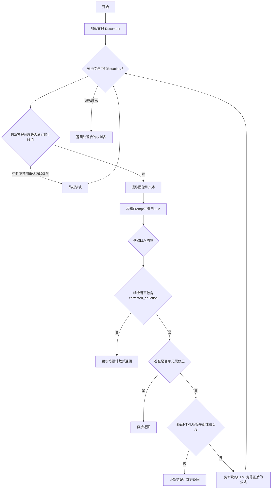
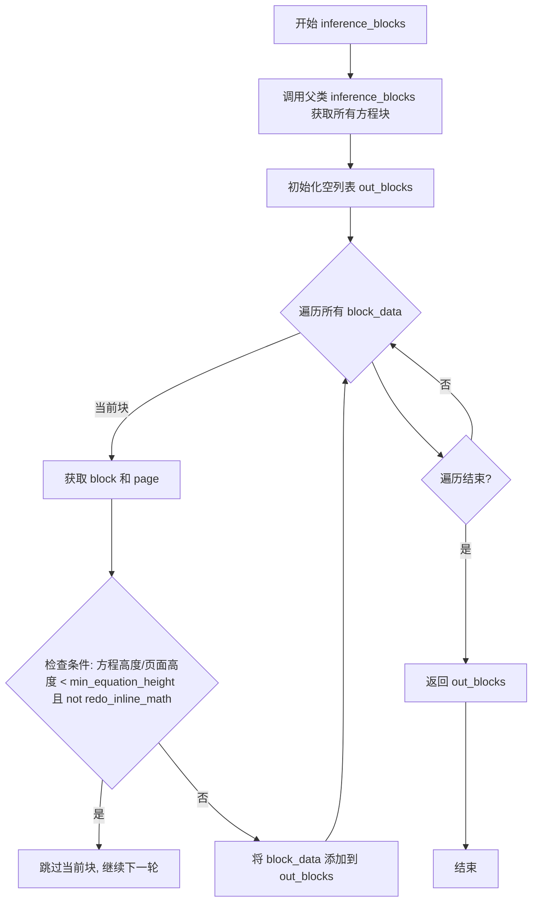
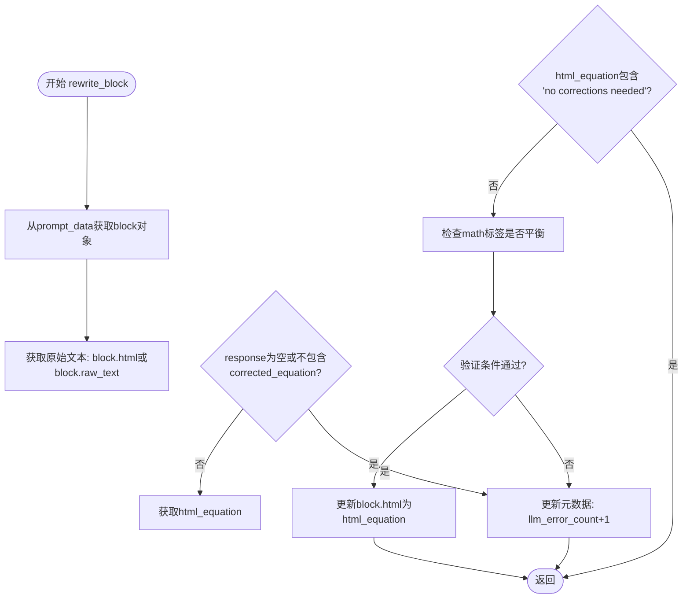

# `marker\marker\processors\llm\llm_equation.py` 详细设计文档

这是一个基于LLM的公式处理模块，用于将PDF或图像中的数学公式转换为HTML格式的LaTeX代码。继承自BaseLLMSimpleBlockProcessor，通过分析页面中的Equation类型块，使用AI模型生成或修正公式的HTML表示，支持行内公式和块级公式的识别与转换。

## 整体流程



## 类结构

```
BaseLLMSimpleBlockProcessor (基类)
└── LLMEquationProcessor (公式处理器)
    └── EquationSchema (Pydantic响应模型)
```

## 全局变量及字段


### `BaseModel`
    
Pydantic基础模型类，用于数据验证

类型：`type`
    


### `BaseLLMSimpleBlockProcessor`
    
LLM块处理器的基类，提供块处理和提示生成的基本框架

类型：`class`
    


### `PromptData`
    
提示数据字典类型，用于构建LLM调用所需的输入

类型：`type`
    


### `BlockData`
    
块数据字典类型，包含块和页面信息

类型：`type`
    


### `BlockTypes`
    
文档块类型枚举，定义各种内容块类型

类型：`enum`
    


### `Document`
    
文档类，表示整个文档及其内容结构

类型：`class`
    


### `Annotated`
    
类型注解工具，用于添加元数据到类型提示

类型：`type`
    


### `List`
    
列表类型，用于类型提示

类型：`type`
    


### `LLMEquationProcessor.block_types`
    
处理的块类型，值为(BlockTypes.Equation,)

类型：`tuple`
    


### `LLMEquationProcessor.min_equation_height`
    
最小方程高度与页面高度的比率阈值

类型：`Annotated[float]`
    


### `LLMEquationProcessor.image_expansion_ratio`
    
裁剪图像时的扩展比率

类型：`Annotated[float]`
    


### `LLMEquationProcessor.redo_inline_math`
    
是否重新处理内联数学块

类型：`Annotated[bool]`
    


### `LLMEquationProcessor.equation_latex_prompt`
    
用于生成LaTeX的LLM提示词模板

类型：`Annotated[str]`
    


### `EquationSchema.analysis`
    
LLM对公式的分析说明

类型：`str`
    


### `EquationSchema.corrected_equation`
    
修正后的HTML格式公式

类型：`str`
    
    

## 全局函数及方法


### `LLMEquationProcessor.inference_blocks`

该方法继承自 `BaseLLMSimpleBlockProcessor`，用于从文档中过滤并返回需要处理的方程块。它会根据方程块的高度与页面高度的比例以及 `redo_inline_math` 配置来筛选方程块，跳过太小的方程块（除非启用重做内联数学）。

参数：

- `document`：`Document`，需要处理的文档对象，包含所有页面和块的信息

返回值：`List[BlockData]`，过滤后的方程块数据列表，每个元素包含 block 和 page 信息

#### 流程图



#### 带注释源码

```python
def inference_blocks(self, document: Document) -> List[BlockData]:
    """
    从文档中过滤并返回需要处理的方程块。
    
    过滤逻辑：
    - 如果方程高度/页面高度 < min_equation_height 且未启用 redo_inline_math，则跳过该块
    - 否则保留该块进行后续处理
    """
    # 调用父类方法获取所有 BlockTypes.Equation 类型的块
    blocks = super().inference_blocks(document)
    
    # 初始化输出列表
    out_blocks = []
    
    # 遍历所有方程块
    for block_data in blocks:
        # 从 block_data 中提取 block 和 page 对象
        block = block_data["block"]
        page = block_data["page"]

        # If we redo inline math, we redo all equations
        # 检查是否应该跳过当前方程块
        # 条件1: 方程高度相对页面高度太小 (block.polygon.height / page.polygon.height < self.min_equation_height)
        # 条件2: 不重做内联数学 (not self.redo_inline_math)
        # 两个条件都满足时，跳过该块
        if all([
            block.polygon.height / page.polygon.height < self.min_equation_height,
            not self.redo_inline_math
        ]):
            continue  # 跳过太小的方程块
        
        # 保留该块到输出列表
        out_blocks.append(block_data)
    
    # 返回过滤后的方程块列表
    return out_blocks
```


### `LLMEquationProcessor.block_prompts`

该方法为每个检测到的方程块构建LLM调用所需的提示数据（prompt、image、block、schema、page），遍历文档中的方程块，提取对应的图像和文本，填充预定义的LaTeX提示模板，最终返回包含所有方程块处理所需信息的`PromptData`列表。

参数：

- `document`：`Document`，待处理的文档对象，包含页面和块信息

返回值：`List[PromptData]`，`PromptData`字典组成的列表，每个字典包含用于调用LLM的prompt、图像、块对象、输出schema和页对象

#### 流程图

```mermaid
flowchart TD
    A[开始 block_prompts] --> B[初始化空列表 prompt_data]
    B --> C[调用 inference_blocks 获取方程块列表]
    C --> D{遍历每个 block_data}
    D -->|是| E[从 block_data 提取 block 和 page]
    E --> F[获取方程文本: block.html 或 block.raw_text]
    F --> G[用方程文本替换 prompt 模板中的 {equation} 占位符]
    G --> H[调用 extract_image 提取方程块图像]
    H --> I[构建 PromptData 字典]
    I --> J[将字典追加到 prompt_data 列表]
    J --> D
    D -->|否| K[返回 prompt_data 列表]
    K --> L[结束]
```

#### 带注释源码

```python
def block_prompts(self, document: Document) -> List[PromptData]:
    """
    为每个方程块构建LLM调用所需的提示数据
    
    参数:
        document: Document对象，包含文档的页面和块信息
        
    返回:
        List[PromptData]: 包含prompt、image、block、schema、page的字典列表
    """
    # 初始化空列表用于存储所有方程块的提示数据
    prompt_data = []
    
    # 调用父类方法获取需要处理的方程块列表
    # inference_blocks方法会过滤掉不符合条件的方程块（如高度太小的行内公式）
    for block_data in self.inference_blocks(document):
        # 从block_data中提取具体的块对象和所属页面
        block = block_data["block"]
        
        # 获取方程的HTML表示，如果html为空则使用原始文本
        # 这是为了兼容不同格式的方程数据
        text = block.html if block.html else block.raw_text(document)
        
        # 使用方程文本替换提示模板中的{equation}占位符
        # equation_latex_prompt是一个包含示例和指令的完整提示词
        prompt = self.equation_latex_prompt.replace("{equation}", text)
        
        # 从文档中提取方程块的图像用于LLM识别
        # 图像会根据image_expansion_ratio进行适当扩展
        image = self.extract_image(document, block)
        
        # 构建PromptData字典，包含LLM调用所需的所有信息
        # schema指定了输出的JSON Schema（EquationSchema）
        prompt_data.append({
            "prompt": prompt,           # LLM的输入提示词
            "image": image,             # 方程块的图像数据
            "block": block,             # 原始方程块对象（用于后续更新）
            "schema": EquationSchema,   # 输出格式schema，包含analysis和corrected_equation字段
            "page": block_data["page"]  # 方程块所在的页面对象
        })
    
    # 返回所有方程块的提示数据列表
    return prompt_data
```


### `LLMEquationProcessor.rewrite_block`

该方法用于根据LLM返回的响应重写方程块的HTML内容。它从prompt_data中获取原始块，检查LLM响应是否包含校正后的方程式，验证HTML标签是否平衡，并更新块的HTML内容。

参数：

- `response`：`dict`，LLM返回的响应字典，包含校正后的方程HTML
- `prompt_data`：`PromptData`，包含待处理的块、图像和提示信息的PromptData对象
- `document`：`Document`，正在处理的文档对象，用于获取块的原始文本

返回值：`None`，该方法为void类型，不返回任何值

#### 流程图



#### 带注释源码

```python
def rewrite_block(self, response: dict, prompt_data: PromptData, document: Document):
    """
    根据LLM响应重写块的HTML内容
    
    参数:
        response: LLM返回的响应字典，应包含corrected_equation字段
        prompt_data: 包含块信息和提示数据的PromptData对象
        document: 文档对象，用于获取块的原始文本
    """
    # 从prompt_data中获取待处理的块
    block = prompt_data["block"]
    # 获取块的HTML内容，如果为空则使用原始文本
    text = block.html if block.html else block.raw_text(document)

    # 检查响应是否有效且包含校正后的方程
    if not response or "corrected_equation" not in response:
        # 记录错误计数并返回
        block.update_metadata(llm_error_count=1)
        return

    # 从响应中获取校正后的HTML方程
    html_equation = response["corrected_equation"]

    # 如果响应表明不需要校正，则直接返回
    if "no corrections needed" in html_equation.lower():
        return

    # 检查HTML中math标签是否成对出现（平衡）
    balanced_tags = html_equation.count("<math") == html_equation.count("</math>")
    
    # 验证方程式的有效性：
    # 1. html_equation不为空
    # 2. math标签成对平衡
    # 3. 校正后的HTML长度至少为原始文本的30%
    if not all([
        html_equation,
        balanced_tags,
        len(html_equation) > len(text) * .3,
    ]):
        # 验证失败，记录错误计数并返回
        block.update_metadata(llm_error_count=1)
        return

    # 所有验证通过，更新块的HTML内容
    block.html = html_equation
```

## 关键组件


### LLMEquationProcessor

主处理器类，继承自 `BaseLLMSimpleBlockProcessor`，负责将文档中的数学公式图像转换为 LaTeX/HTML 格式。处理流程包括：过滤符合条件的方程块、提取图像和文本、调用 LLM 生成校正后的方程 HTML、验证并更新块内容。

### EquationSchema

Pydantic 数据模型，定义 LLM 响应的结构化输出。包含 `analysis` 字段用于存储 LLM 对方程的分析，以及 `corrected_equation` 字段用于存储校正后的 HTML 方程代码。

### min_equation_height

最小方程高度比率参数，类型为 float，默认值为 0.06。用于过滤掉相对于页面高度过小的方程块，减少不必要的处理开销。

### image_expansion_ratio

图像扩展比率参数，类型为 float，默认值为 0.05。用于在裁剪方程图像时进行边缘扩展，防止因边界框过紧导致方程内容被截断。

### redo_inline_math

内联数学块重做标志，类型为 bool，默认值为 False。控制是否对内联数学块进行重新处理，设为 True 时会处理所有方程块而非仅处理块级方程。

### equation_latex_prompt

方程 LaTeX 提示词模板，类型为 str，包含详细的指令说明。要求 LLM 将数学方程图像转换为 KaTeX 兼容的 HTML 格式，使用 `<math>` 和 `<math display="block">` 标签作为分隔符。

### inference_blocks

块推理方法，继承自父类并进行了定制。遍历文档中的方程块，根据 `min_equation_height` 和 `redo_inline_math` 参数过滤不符合条件的方程块，返回需要处理的块数据列表。

### block_prompts

块提示生成方法，为每个待处理的方程块生成 LLM 提示词和图像。方法提取块的 HTML 或原始文本，替换提示词模板中的占位符，并返回包含提示词、图像、块和模式信息的 PromptData 列表。

### rewrite_block

块重写方法，处理 LLM 响应并更新方程块内容。验证响应的有效性，检查 HTML 标签是否平衡，确保校正后的方程长度符合阈值，然后将更新后的 HTML 赋值给块。

### 潜在技术债务

1. **错误处理不完善**：仅通过 `llm_error_count` 元数据标记错误，缺少重试机制和详细错误日志
2. **硬编码阈值**：长度阈值 0.3 (.3) 和高度阈值 0.06 为硬编码值，缺乏灵活性配置
3. **提示词耦合**：提示词模板与处理器紧耦合，难以动态替换或扩展
4. **文本提取回退**：先尝试 `block.html` 再尝试 `block.raw_text(document)`，两个分支逻辑重复

### 设计目标与约束

1. 仅处理 `BlockTypes.Equation` 类型的块
2. 使用 Google Gemini 模型进行方程识别和转换
3. 输出必须为 KaTeX 兼容的 HTML 格式
4. 支持块级方程和内联方程两种模式

### 外部依赖

1. **pydantic.BaseModel**：用于定义 EquationSchema 数据验证模型
2. **marker.processors.llm.BaseLLMSimpleBlockProcessor**：父类，提供 LLM 处理器基础功能
3. **marker.schema.BlockTypes**：枚举类型，定义块类型常量
4. **marker.schema.document.Document**：文档对象模型，提供块和页面访问接口


## 问题及建议


### 已知问题

- **字符串替换缺乏容错性**：`block_prompts`方法中使用`self.equation_latex_prompt.replace("{equation}", text)`进行占位符替换，如果prompt模板中不存在`{equation}`占位符，该操作会静默失败，导致提示词不完整。
- **硬编码阈值缺乏灵活性**：`min_equation_height=0.06`和`len(text) * .3`等数值硬编码在类定义中，无法根据不同文档类型或使用场景进行动态调整。
- **重复代码模式**：`block.html if block.html else block.raw_text(document)`逻辑在`block_prompts`和`rewrite_block`方法中重复出现，违反DRY原则。
- **参数未被使用**：`image_expansion_ratio`属性已定义但在`extract_image`调用时未传递该参数，导致配置失效。
- **验证逻辑不够严格**：`balanced_tags`仅检查`<math>`标签数量是否相等，未验证标签嵌套顺序或有效性和`<math display="block">`与`<math>`的配对情况。
- **缺少图像提取异常处理**：`extract_image`调用未捕获可能的异常，可能导致整个处理流程中断。
- **元数据累积无清理机制**：`llm_error_count`持续累加但无重置逻辑，长期运行可能产生溢出风险。
- **类型注解不完整**：`super().inference_blocks(document)`的返回类型与`List[BlockData]`的对应关系未明确验证。

### 优化建议

- 将占位符替换改为`format`或字符串模板方式，并增加存在性检查，必要时抛出明确的配置错误。
- 将阈值参数化为可配置项，或提供基于文档特征的自动调整机制。
- 提取公共方法如`get_block_text(block, document)`以消除重复代码。
- 在`extract_image`调用时正确传递`image_expansion_ratio`参数以启用图像扩展功能。
- 增强标签验证逻辑，使用HTML解析库验证标签完整性和正确配对。
- 添加图像提取的异常捕获和降级处理逻辑。
- 在适当场景下重置错误计数或使用滑动窗口机制。
- 补充完整的类型注解和运行时类型检查。

## 其它


### 设计目标与约束

设计目标是将图像中的数学公式转换为正确的HTML和LaTeX格式，利用LLM进行方程式的分析和校正。约束包括：仅处理BlockTypes.Equation类型的块；最小方程高度与页面高度的比例阈值为0.06；仅支持特定的HTML标签（math, i, b, p, br）；输出必须为有效的KaTeX兼容LaTeX代码。

### 错误处理与异常设计

错误处理机制包括：当LLM响应为空或不包含"corrected_equation"字段时，调用block.update_metadata(llm_error_count=1)记录错误；当HTML方程式为空、math标签不平衡、或长度小于原文本的30%时，同样记录错误；当检测到"no corrections needed"时，直接返回不做处理。异常主要通过元数据中的llm_error_count字段进行追踪，而非抛出异常。

### 数据流与状态机

数据流为：Document输入 → inference_blocks()过滤不符合高度要求的块 → block_prompts()生成prompt和提取图像 → 调用LLM推理 → rewrite_block()处理响应并更新block的HTML。状态转换包括：原始方程块 → 过滤检查 → 生成prompt → LLM处理 → 响应验证 → HTML更新或错误记录。

### 外部依赖与接口契约

外部依赖包括：pydantic用于数据验证（EquationSchema）；marker.processors.llm模块中的BaseLLMSimpleBlockProcessor、PromptData、BlockData；marker.schema中的BlockTypes和Document。接口契约：inference_blocks()返回List[BlockData]；block_prompts()返回List[PromptData]；rewrite_block()接收response字典、PromptData和Document参数并更新block的html属性。

### 配置与参数设计

主要配置参数包括：min_equation_height（最小方程高度阈值，默认0.06）；image_expansion_ratio（图像裁剪扩展比例，默认0.05）；redo_inline_math（是否重做行内数学块，默认False）；equation_latex_prompt（LLM提示词模板）。这些参数均使用Annotated进行类型标注和描述。

### 性能考虑与优化空间

潜在优化点：inference_blocks()方法中每次调用super().inference_blocks()会获取所有块，可以考虑缓存结果；block_prompts()中多次调用block.html和block.raw_text()，可以合并为一次调用；equation_latex_prompt作为类属性每次实例化都会加载大字符串，可以考虑模块级常量；图像提取extract_image()可能成为性能瓶颈，可考虑异步处理或缓存。

### 并发与线程安全

该类本身未实现线程安全机制。如果在多线程环境下使用，block.html的更新操作和元数据更新可能存在竞态条件。建议在并发场景下使用锁保护或使用线程安全的数据结构。

### 测试策略建议

应包含单元测试：inference_blocks()的高度过滤逻辑测试；block_prompts()的prompt生成格式测试；rewrite_block()的错误处理分支测试；EquationSchema的字段验证测试。集成测试：完整的Document处理流程测试；LLM响应模拟测试；多种方程格式（行内、块级、多方程）的处理测试。

### 版本兼容性与依赖管理

依赖版本要求：pydantic（建议v2.x）；marker框架需兼容当前版本。建议在requirements.txt或pyproject.toml中明确指定版本范围，并定期更新以获取安全补丁和新功能。


    