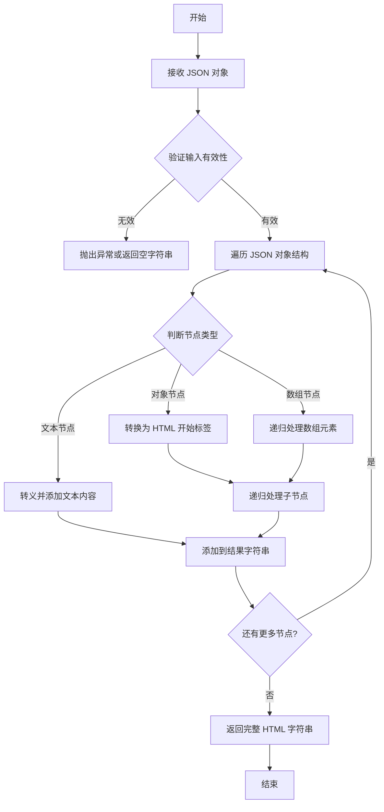
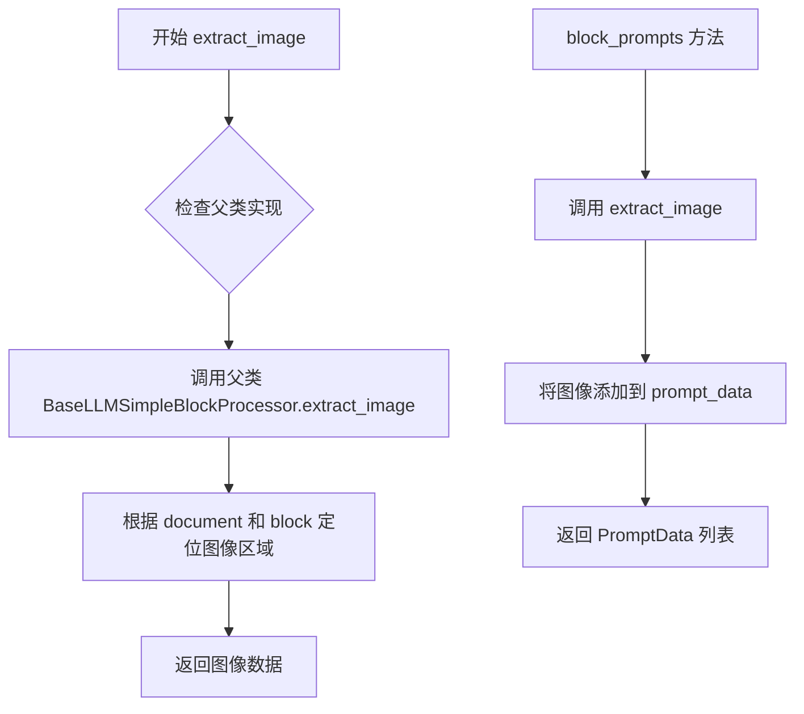
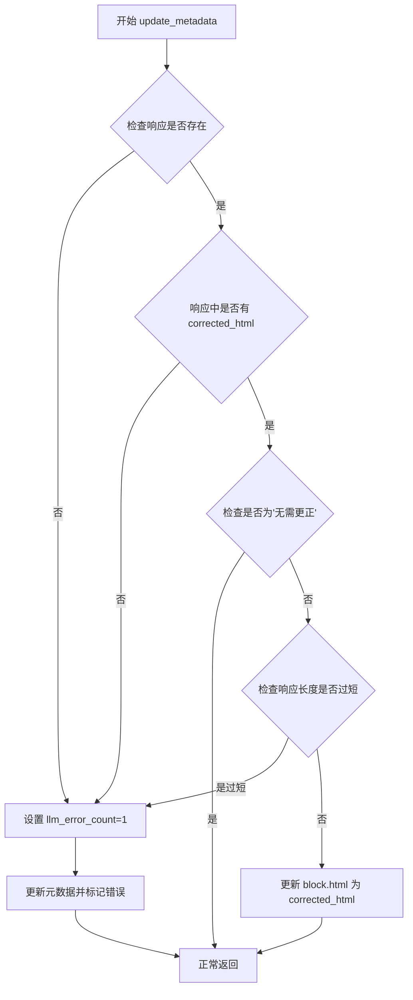
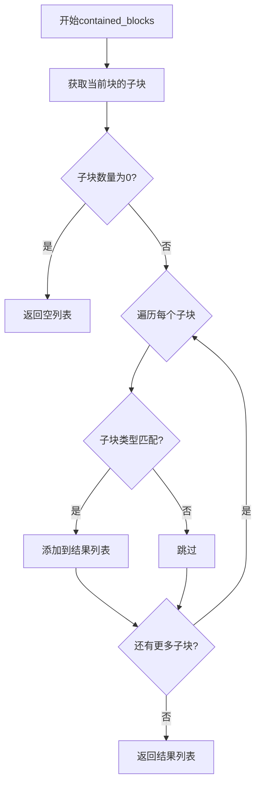
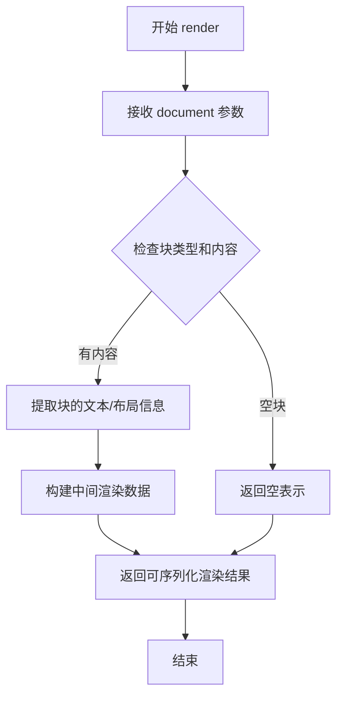
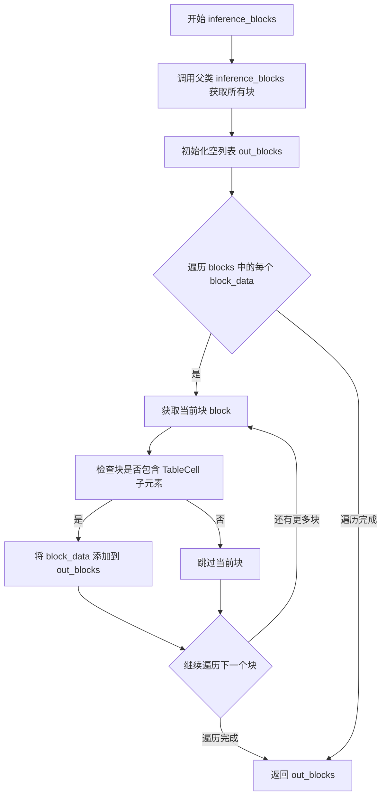
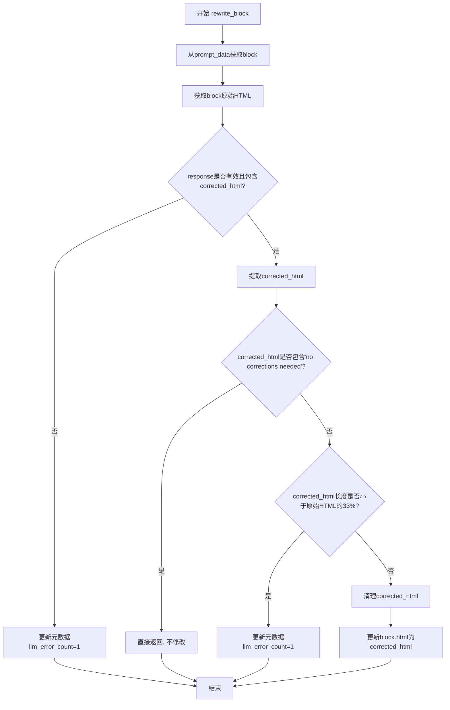

# `marker\marker\processors\llm\llm_form.py` 详细设计文档

这是一个基于LLM的表单处理器，用于纠正文档图像中表单的HTML表示形式。该处理器继承自BaseLLMSimpleBlockProcessor，通过AI分析表单图像和现有HTML，修正其中的错误并生成更准确的HTML表示。

## 整体流程

```mermaid
graph TD
    A[开始处理文档] --> B[调用 inference_blocks]
    B --> C{检查块是否有TableCell子元素}
    C -- 否 --> D[跳过该块]
    C -- 是 --> E[收集有效的Form块]
    E --> F[调用 block_prompts 生成提示]
    F --> G[为每个Form块提取图像]
    G --> H[替换提示模板中的{block_html}]
    H --> I[调用LLM处理提示]
    I --> J[调用 rewrite_block 处理响应]
    J --> K{响应是否有效?}
    K -- 无响应或无corrected_html --> L[更新元数据llm_error_count=1]
    K -- 是 --> M{包含'No corrections needed'?}
    M -- 是 --> N[跳过更新]
    M -- 否 --> O{长度检查通过?}
    O -- 否 --> L
    O -- 是 --> P[清理HTML标签]
    P --> Q[更新block.html]
    Q --> R[结束]
```

## 类结构

```
BaseLLMSimpleBlockProcessor (基类)
└── LLMFormProcessor (表单处理器)
```

## 全局变量及字段


### `LLMFormProcessor`
    
继承自BaseLLMSimpleBlockProcessor，用于使用LLM重写表单块

类型：`class`
    


### `FormSchema`
    
Pydantic模型，用于验证LLM响应的结构

类型：`class`
    


### `LLMFormProcessor.block_types`
    
指定处理的块类型为BlockTypes.Form

类型：`tuple`
    


### `LLMFormProcessor.form_rewriting_prompt`
    
LLM表单重写提示模板，包含详细的指令和示例

类型：`str`
    


### `LLMFormProcessor.inference_blocks`
    
重写父类方法，筛选出包含TableCell子元素的Form块

类型：`method`
    


### `LLMFormProcessor.block_prompts`
    
为每个Form块生成LLM提示数据和提取对应的图像

类型：`method`
    


### `LLMFormProcessor.rewrite_block`
    
处理LLM响应，根据修正后的HTML更新块内容

类型：`method`
    


### `FormSchema.comparison`
    
LLM对原HTML与图像的比较说明

类型：`str`
    


### `FormSchema.corrected_html`
    
修正后的HTML表示

类型：`str`
    
    

## 全局函数及方法


### `json_to_html`

该函数是 `marker.output` 模块中提供的工具函数，用于将 JSON 对象转换为 HTML 字符串表示。在 `LLMFormProcessor` 类中，该函数被用于将表单块的渲染结果（JSON 格式）转换为 HTML 字符串，以便后续通过 LLM 进行错误纠正处理。

参数：

-  `json_obj`：任意类型，从 `block.render(document)` 返回的 JSON 对象，表示表单块的渲染数据

返回值：`str`，返回转换后的 HTML 字符串表示

#### 流程图



*注：实际实现可能因 marker 库版本而异，以上流程图基于函数使用方式的推理。*

#### 带注释源码

```python
# 从 marker.output 模块导入 json_to_html 函数
# 该函数定义在 marker 库中，此处仅为引用使用
from marker.output import json_to_html

# 在 LLMFormProcessor 类中的使用示例：

def block_prompts(self, document: Document) -> List[PromptData]:
    """
    生成表单块的提示数据
    """
    prompt_data = []
    for block_data in self.inference_blocks(document):
        block = block_data["block"]
        # 调用 json_to_html 将 block.render(document) 的 JSON 输出转换为 HTML 字符串
        block_html = json_to_html(block.render(document))
        # 将转换后的 HTML 用于构建 prompt
        prompt = self.form_rewriting_prompt.replace("{block_html}", block_html)
        image = self.extract_image(document, block)
        prompt_data.append({
            "prompt": prompt,
            "image": image,
            "block": block,
            "schema": FormSchema,
            "page": block_data["page"]
        })
    return prompt_data


def rewrite_block(self, response: dict, prompt_data: PromptData, document: Document):
    """
    根据 LLM 响应重写表单块
    """
    block = prompt_data["block"]
    # 再次调用 json_to_html 获取当前 HTML 表示
    block_html = json_to_html(block.render(document))

    if not response or "corrected_html" not in response:
        block.update_metadata(llm_error_count=1)
        return

    corrected_html = response["corrected_html"]

    # 检查是否需要更正
    if "no corrections needed" in corrected_html.lower():
        return

    # 检查响应是否过短（可能是部分响应）
    if len(corrected_html) < len(block_html) * .33:
        block.update_metadata(llm_error_count=1)
        return

    # 清理 HTML 格式标记
    corrected_html = corrected_html.strip().lstrip("```html").rstrip("```").strip()
    # 更新块的 HTML 内容
    block.html = corrected_html
```

---

### 补充说明

由于 `json_to_html` 函数定义在外部库 `marker.output` 中，本文档仅提供其在当前代码中的使用方式和推理分析。如需查看该函数的完整实现源码，请参考 [marker 库源代码](https://github.com/VikParuchuri/marker)。


### `LLMFormProcessor.extract_image`

该方法继承自父类 `BaseLLMSimpleBlockProcessor`，用于从文档中提取指定 block 对应的图像区域，供后续 LLM 处理使用。

参数：

- `document`：`Document`，原始文档对象，包含页面和渲染信息
- `block`：`Block`，需要提取图像的块对象（如 Form 块）

返回值：`Image`（或类似图像类型），返回指定块在文档中对应的图像数据

#### 流程图



#### 带注释源码

```python
def block_prompts(self, document: Document) -> List[PromptData]:
    """
    生成表单块的 Prompt 数据列表
    """
    prompt_data = []
    for block_data in self.inference_blocks(document):
        block = block_data["block"]
        # 将 block 渲染为 HTML
        block_html = json_to_html(block.render(document))
        
        # 替换 prompt 模板中的占位符
        prompt = self.form_rewriting_prompt.replace("{block_html}", block_html)
        
        # 【关键】调用继承自父类的 extract_image 方法
        # 从文档中提取当前 block 对应的图像区域
        image = self.extract_image(document, block)
        
        # 组装 PromptData，包含：
        # - prompt: 格式化后的提示词
        # - image: 提取的图像数据
        # - block: 原始块对象
        # - schema: 输出解析 Schema
        # - page: 所在页码
        prompt_data.append({
            "prompt": prompt,
            "image": image,
            "block": block,
            "schema": FormSchema,
            "page": block_data["page"]
        })
    return prompt_data
```


### `block.update_metadata`

描述：`update_metadata` 是一个继承自父类的方法，用于更新块的元数据。在当前代码中，它被用于记录 LLM 处理错误，当 LLM 返回无效响应或响应长度异常时，将 `llm_error_count` 设为 1 以标记处理失败。

参数：

- `llm_error_count`：`int`，表示 LLM 处理过程中的错误计数，用于跟踪处理异常情况

返回值：`None`，该方法通常用于更新内部状态，不返回任何值

#### 流程图



#### 带注释源码

```python
def rewrite_block(self, response: dict, prompt_data: PromptData, document: Document):
    block = prompt_data["block"]  # 从 prompt_data 获取 block 对象
    block_html = json_to_html(block.render(document))  # 将 block 渲染为 HTML

    # 处理空响应或缺少 corrected_html 的情况
    if not response or "corrected_html" not in response:
        # 调用继承的 update_metadata 方法，记录 LLM 错误
        block.update_metadata(llm_error_count=1)
        return

    corrected_html = response["corrected_html"]

    # 如果 LLM 判定无需更正，则直接返回
    if "no corrections needed" in corrected_html.lower():
        return

    # 检查响应长度是否异常（过短可能表示部分响应）
    if len(corrected_html) < len(block_html) * .33:
        # 记录错误计数
        block.update_metadata(llm_error_count=1)
        return

    # 清理 HTML 标签（去除 markdown 代码块标记）
    corrected_html = corrected_html.strip().lstrip("```html").rstrip("```").strip()
    block.html = corrected_html  # 更新 block 的 HTML 内容
    
    # 注意：此处未显式调用 update_metadata 表示处理成功
```

> **注意**：由于 `update_metadata` 方法继承自父类（`Block` 类），其完整实现未在当前文件中展示。以上分析基于方法调用上下文和代码逻辑推断。


### `Block.contained_blocks`

该方法用于从当前块中提取指定类型的子块。它接受一个文档对象和块类型元组作为参数，遍历当前块的子层级结构，筛选出匹配指定类型的块并返回。

参数：

- `document`：`Document`，包含完整文档结构和渲染信息的文档对象
- `block_types`：`Tuple[BlockTypes, ...]`，要提取的子块类型元组，例如 `(BlockTypes.TableCell,)`

返回值：`List[Block]`，符合指定类型的子块列表

#### 流程图



#### 带注释源码

```python
def contained_blocks(self, document: Document, block_types: Tuple[BlockTypes, ...]) -> List[Block]:
    """
    从当前块中提取指定类型的子块
    
    参数:
        document: Document - 包含完整文档结构和渲染信息的文档对象
        block_types: Tuple[BlockTypes, ...] - 要提取的子块类型元组
    
    返回:
        List[Block] - 符合指定类型的子块列表
    """
    # 获取当前块的所有子块
    children = self.children
    
    # 初始化结果列表
    out_blocks = []
    
    # 遍历所有子块
    for child in children:
        # 检查子块的类型是否在指定类型元组中
        if child.block_type in block_types:
            out_blocks.append(child)
    
    return out_blocks
```

#### 在 `LLMFormProcessor.inference_blocks` 中的使用示例

```python
def inference_blocks(self, document: Document) -> List[BlockData]:
    # 调用父类方法获取基础块数据
    blocks = super().inference_blocks(document)
    out_blocks = []
    
    # 遍历每个块数据
    for block_data in blocks:
        block = block_data["block"]
        
        # 使用contained_blocks方法提取TableCell类型的子块
        # 这是代码中实际调用contained_blocks的地方
        children = block.contained_blocks(document, (BlockTypes.TableCell,))
        
        # 如果没有子块则跳过
        if not children:
            continue
        
        # 将有子块的块数据添加到输出列表
        out_blocks.append(block_data)
    
    return out_blocks
```


### `Block.render`

该方法是 Block 基类中定义的核心渲染方法，负责将文档块（Block）渲染为可被 `json_to_html` 处理的中间表示格式。在 `LLMFormProcessor` 中，通过调用此方法获取表单块的 HTML 表示，再交由 LLM 进行纠错和格式优化。

参数：

-  `document`：`Document`，包含完整文档上下文的对象，用于解析块的内容和元数据

返回值：`Any`，返回渲染后的块数据，通常为字典或类似结构，可被 `json_to_html` 转换为 HTML 字符串

#### 流程图



#### 带注释源码

```python
# Block 类的 render 方法（在 marker 库中定义，此处为调用点示例）
# 位置：marker/schema/blocks.py（推测）

def render(self, document: Document) -> Any:
    """
    渲染块内容为中间表示格式
    
    参数:
        document: Document对象，包含文档的完整上下文和已解析的内容
        
    返回:
        可被 json_to_html 转换为 HTML 的中间数据格式
    """
    # 在 LLMFormProcessor 中的调用方式：
    # block_html = json_to_html(block.render(document))
    
    # 1. 从 document 中获取块的原始数据
    # 2. 将块的布局、文本、样式等信息序列化为中间格式
    # 3. 返回包含以下信息的字典：
    #    - text: 块的文本内容
    #    - layout: 块的位置和尺寸信息
    #    - structure: HTML 标签结构
    #    - attributes: 样式和属性
```

#### 在 `LLMFormProcessor` 中的调用示例

```python
# 文件：LLMFormProcessor 类
# 方法：block_prompts

def block_prompts(self, document: Document) -> List[PromptData]:
    """构建表单块的提示数据"""
    prompt_data = []
    for block_data in self.inference_blocks(document):
        block = block_data["block"]
        # 调用 Block.render 方法获取块的渲染表示
        block_html = json_to_html(block.render(document))
        # block.render(document) 返回的中间数据被 json_to_html 转换为 HTML 字符串
        prompt = self.form_rewriting_prompt.replace("{block_html}", block_html)
        image = self.extract_image(document, block)
        prompt_data.append({
            "prompt": prompt,
            "image": image,
            "block": block,
            "schema": FormSchema,
            "page": block_data["page"]
        })
    return prompt_data


# 方法：rewrite_block

def rewrite_block(self, response: dict, prompt_data: PromptData, document: Document):
    """根据 LLM 响应重写块内容"""
    block = prompt_data["block"]
    # 再次调用 render 获取原始 HTML 用于比较
    block_html = json_to_html(block.render(document))

    if not response or "corrected_html" not in response:
        block.update_metadata(llm_error_count=1)
        return

    corrected_html = response["corrected_html"]

    # 检查是否无需更正
    if "no corrections needed" in corrected_html.lower():
        return

    # 检查响应是否不完整（长度过短）
    if len(corrected_html) < len(block_html) * .33:
        block.update_metadata(llm_error_count=1)
        return

    # 清理 HTML 格式标记并更新块内容
    corrected_html = corrected_html.strip().lstrip("```html").rstrip("```").strip()
    block.html = corrected_html
```


### `LLMFormProcessor.inference_blocks`

重写父类方法，筛选出包含TableCell子元素的Form块

参数：

-  `document`：`Document`，待处理的文档对象

返回值：`List[BlockData]`，过滤后的Form块列表，仅包含含有TableCell子元素的块

#### 流程图



#### 带注释源码

```python
def inference_blocks(self, document: Document) -> List[BlockData]:
    # 调用父类方法，获取当前文档中所有Form类型的块
    blocks = super().inference_blocks(document)
    
    # 初始化输出列表，用于存储符合条件的块
    out_blocks = []
    
    # 遍历父类返回的所有块
    for block_data in blocks:
        # 从块数据中获取具体的块对象
        block = block_data["block"]
        
        # 检查当前块是否包含TableCell类型的子元素
        # contained_blocks 方法返回指定类型的子块列表
        children = block.contained_blocks(document, (BlockTypes.TableCell,))
        
        # 如果没有TableCell子元素，则跳过当前块
        if not children:
            continue
        
        # 当前块包含TableCell子元素，将其添加到输出列表
        out_blocks.append(block_data)
    
    # 返回过滤后的块列表，仅保留包含TableCell的Form块
    return out_blocks
```


### `LLMFormProcessor.block_prompts`

为每个Form块生成LLM提示数据和提取对应的图像

参数：

-  `document`：`Document`，待处理的文档对象

返回值：`List[PromptData]`，包含提示、图像、块、模式和页面的字典列表

#### 流程图

```mermaid
flowchart TD
    A[开始 block_prompts] --> B[创建空列表 prompt_data]
    B --> C[遍历 inference_blocks 返回的 block_data]
    C --> D{检查 block 是否有子块}
    D -->|无 TableCell 子块| E[跳过当前 block]
    D -->|有 TableCell 子块| F[将 block_data 添加到 out_blocks]
    E --> C
    F --> C
    C --> G{遍历每个 block_data}
    G --> H[从 block_data 获取 block]
    H --> I[使用 json_to_html 渲染 block 为 HTML]
    I --> J[替换 form_rewriting_prompt 中的 {block_html}]
    J --> K[使用 extract_image 提取 block 对应的图像]
    K --> L[构建 PromptData 字典]
    L --> M[将字典追加到 prompt_data 列表]
    M --> G
    G --> N[返回 prompt_data 列表]
    N --> O[结束]
```

#### 带注释源码

```python
def block_prompts(self, document: Document) -> List[PromptData]:
    """
    为每个 Form 块生成 LLM 提示数据和提取对应的图像
    
    参数:
        document: Document - 待处理的文档对象
        
    返回值:
        List[PromptData] - 包含提示、图像、块、模式和页面的字典列表
    """
    # 初始化用于存储所有 Form 块提示数据的列表
    prompt_data = []
    
    # 遍历通过 inference_blocks 方法筛选出的 Form 块
    for block_data in self.inference_blocks(document):
        # 从 block_data 中提取具体的块对象
        block = block_data["block"]
        
        # 使用 json_to_html 将 block 的 JSON 表示转换为 HTML 字符串
        block_html = json_to_html(block.render(document))
        
        # 替换提示模板中的占位符 {block_html} 为实际的 HTML 内容
        prompt = self.form_rewriting_prompt.replace("{block_html}", block_html)
        
        # 从文档中提取与当前 block 对应的图像数据
        image = self.extract_image(document, block)
        
        # 构建包含完整提示信息的字典
        prompt_data.append({
            "prompt": prompt,          # LLM 使用的提示词
            "image": image,            # 块对应的图像数据
            "block": block,            # 原始块对象
            "schema": FormSchema,      # 期望的响应 JSON Schema
            "page": block_data["page"] # 块所在的页面
        })
    
    # 返回所有 Form 块的提示数据列表
    return prompt_data
```

#### 关键实现细节

| 组件 | 说明 |
|------|------|
| `inference_blocks()` | 父类方法，返回包含 TableCell 子块的 Form 块 |
| `json_to_html()` | 将 block 的 JSON 表示转换为 HTML 字符串 |
| `form_rewriting_prompt` | 用于指导 LLM 校正表单 HTML 的提示模板 |
| `extract_image()` | 提取文档中指定 block 对应的图像区域 |
| `FormSchema` | Pydantic 模型，定义 LLM 响应应包含的字段 |


### `LLMFormProcessor.rewrite_block`

处理LLM响应，根据修正后的HTML更新块内容。该方法接收LLM返回的响应字典，验证响应有效性，提取修正后的HTML，并直接修改文档块的内容。

参数：

- `response`：`dict`，LLM返回的响应字典，包含修正后的HTML内容
- `prompt_data`：`PromptData`，包含原始提示信息的字典，其中包含待处理的block对象
- `document`：`Document`，文档对象，用于渲染和更新块内容

返回值：`None`，无返回值，直接修改block的HTML

#### 流程图



#### 带注释源码

```python
def rewrite_block(self, response: dict, prompt_data: PromptData, document: Document):
    # 从prompt_data中提取待处理的block对象
    block = prompt_data["block"]
    
    # 获取当前block的原始HTML表示
    block_html = json_to_html(block.render(document))

    # 检查response是否有效且包含修正后的HTML
    if not response or "corrected_html" not in response:
        # 响应无效，记录错误计数并退出
        block.update_metadata(llm_error_count=1)
        return

    # 提取LLM修正后的HTML内容
    corrected_html = response["corrected_html"]

    # 如果LLM认为无需修正，则直接返回
    if "no corrections needed" in corrected_html.lower():
        return

    # 检测是否为不完整的响应（长度异常短）
    # 如果修正后的HTML长度小于原始HTML的33%，可能是部分响应
    if len(corrected_html) < len(block_html) * .33:
        block.update_metadata(llm_error_count=1)
        return

    # 清理修正后的HTML：去除Markdown代码块标记
    corrected_html = corrected_html.strip().lstrip("```html").rstrip("```").strip()
    
    # 更新block的HTML内容为修正后的版本
    block.html = corrected_html
```

## 关键组件


### LLMFormProcessor

表单块LLM处理器的核心类，继承自BaseLLMSimpleBlockProcessor，用于通过LLM纠正表单HTML表示中的错误，确保表单的labels和values以正确的表格格式呈现。

### form_rewriting_prompt

提示词模板，定义了LLM如何纠正表单HTML的指令和示例，包含"Only use the tags `table, p, span, i, b, th, td, tr, and div`"的约束，以及对比分析和输出格式说明。

### FormSchema

Pydantic数据模型，定义LLM输出的结构化格式，包含comparison字段用于描述对比分析结果，corrected_html字段用于传递纠正后的HTML内容。

### inference_blocks方法

过滤方法，遍历父类返回的块数据，只保留包含TableCell类型子块的Form块，确保只处理有效的表单块。

### block_prompts方法

构建LLM提示的方法，为每个Form块生成包含prompt、image、block、schema和page信息的PromptData列表，使用json_to_html将块渲染为HTML并替换提示模板中的占位符。

### rewrite_block方法

处理LLM响应的核心方法，验证响应有效性、检查"no corrections needed"标记、处理部分响应异常，并将纠正后的HTML更新到块对象中，同时维护llm_error_count元数据。

### BlockTypes.Form

表单块类型标识，与TableCell子块配合使用，用于识别和处理文档中的表单元素。

### json_to_html工具函数

将JSON格式的块数据转换为HTML字符串表示，用于渲染表单块和生成LLM提示。


## 问题及建议


### 已知问题

- **魔法数字和硬编码字符串**：`.33`阈值和`"no corrections needed"`、`"corrected_html"`等字符串硬编码在方法中，缺乏常量定义，难以维护和配置。
- **错误处理不完善**：`rewrite_block`方法仅检查`"corrected_html"`键是否存在，未验证HTML内容的有效性，也未对`json_to_html`、`block.render()`等可能失败的调用进行异常捕获。
- **代码重复**：`block_html = json_to_html(block.render(document))`在`block_prompts`和`rewrite_block`中重复实现，可提取为类方法避免重复。
- **Schema使用不一致**：定义了`FormSchema`用于验证LLM响应，但在`rewrite_block`中未使用该schema进行验证，`comparison`字段被完全忽略。
- **缺少类型提示**：部分方法如`block_prompts`缺少返回类型注解，影响代码可读性和静态分析。
- **可测试性差**：庞大的prompt模板作为类属性难以单元测试，且高度依赖外部LLM和图像提取逻辑。
- **状态更新非原子**：`block.update_metadata(llm_error_count=1)`在并发场景下可能存在竞态条件。

### 优化建议

- 提取魔法数字`0.33`为类常量`MIN_CORRECTION_LENGTH_RATIO`，硬编码字符串移至类属性或配置模块。
- 为所有外部调用添加try-except异常处理，验证`corrected_html`是否为有效HTML（可使用正则或解析库）。
- 将重复的`block_html`计算提取为私有方法如`_get_block_html(block, document)`。
- 在`rewrite_block`中使用`FormSchema`验证LLM响应，确保数据合法性。
- 补充方法返回类型提示，完善文档字符串说明各方法的职责和异常抛出情况。
- 将prompt模板移至外部模板文件或配置，支持动态加载以提升可测试性。
- 考虑使用线程锁或原子操作处理`llm_error_count`的增量更新。

## 其它


### 设计目标与约束

本处理器的设计目标是使用大型语言模型（LLM）校正文档中表单（Form）块的HTML表示错误，使其更准确地反映原始表单图像的内容。设计约束包括：1）仅使用特定的HTML标签（table, p, span, i, b, th, td, tr, div）进行格式化；2）表单的标签应显示在表格左侧，值显示在右侧；3）不能遗漏表单中的任何文本；4）必须保持与原始表单的高度一致性。

### 错误处理与异常设计

代码实现了多层次的错误处理机制：1）当LLM响应为空或不包含"corrected_html"字段时，通过`block.update_metadata(llm_error_count=1)`记录错误并返回；2）当响应包含"No corrections needed"时，判定原始HTML无需校正，直接返回；3）当校正后的HTML长度小于原始HTML的33%时，判定为部分响应或无效响应，记录错误并返回；4）使用`try-except`块处理HTML清理过程中的异常，确保程序不会因格式问题崩溃。这些设计确保了处理器在各种边界情况下都能优雅地处理。

### 数据流与状态机

数据流遵循以下状态机流程：初始状态（Document输入）→ 提取表单块（inference_blocks方法）→ 生成Prompt（block_prompts方法）→ LLM推理 → 校正HTML（rewrite_block方法）→ 更新Block元数据。具体流程：1）通过`inference_blocks`从文档中提取包含TableCell子块的Form类型块；2）为每个块生成包含HTML和图像的Prompt；3）调用LLM获取校正后的HTML；4）在`rewrite_block`中验证响应，清理HTML标记，并更新块的html属性。

### 外部依赖与接口契约

本模块依赖以下外部组件：1）`marker.output.json_to_html` - 将JSON格式的块渲染转换为HTML字符串；2）`marker.processors.llm.PromptData` - LLM提示数据结构，包含prompt、image、block、schema、page字段；3）`marker.processors.llm.BaseLLMSimpleBlockProcessor` - 基类处理器，提供提取图像和调用LLM的接口；4）`marker.schema.BlockTypes` - 块类型枚举，包含Form枚举值；5）`marker.schema.document.Document` - 文档对象模型；6）`pydantic.BaseModel` - 用于FormSchema的响应验证。所有接口契约遵循marker框架的统一规范。

### 性能考虑与优化空间

当前实现存在以下优化空间：1）在`inference_blocks`方法中，每次迭代都调用`block.contained_blocks(document, (BlockTypes.TableCell,))`，可以考虑缓存结果；2）`form_rewriting_prompt`字符串模板在每次调用时都进行replace操作，可以预先格式化；3）块处理是串行执行的，对于大量表单块的文档，可以考虑并行处理；4）图像提取和LLM调用可以采用批量处理模式，减少网络开销；5）可以考虑添加超时机制和重试逻辑，提高LLM调用的可靠性。

### 安全性考虑

代码涉及HTML处理和LLM输出解析，需要注意：1）LLM输出的HTML应进行安全过滤，防止XSS攻击；2）用户提供的prompt模板应该进行验证和清理；3）处理过程中应避免直接执行不可信的HTML代码；4）可以考虑添加输出长度限制，防止LLM返回过大的内容。当前代码中`lstrip("```html").rstrip("```").strip()`的清理方式较为简单，可能存在边界情况未覆盖。

### 配置与可扩展性

当前设计支持以下可扩展性特性：1）通过继承`BaseLLMSimpleBlockProcessor`可以轻松添加新的块处理器；2）`block_types`类属性定义了处理的块类型，可动态配置；3）`form_rewriting_prompt`作为类属性，可以通过子类化或属性赋值进行定制；4）`FormSchema`定义了明确的响应结构，便于验证和扩展。可以考虑将prompt模板提取到外部配置文件，支持多语言和自定义格式化规则。

    