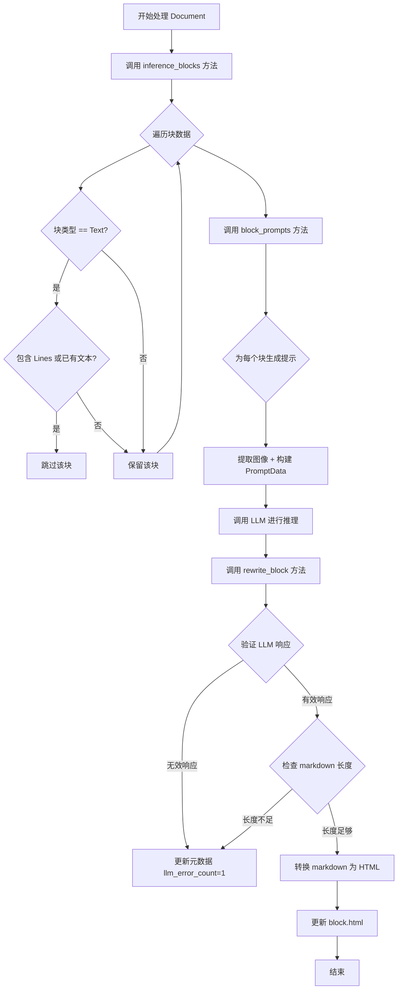
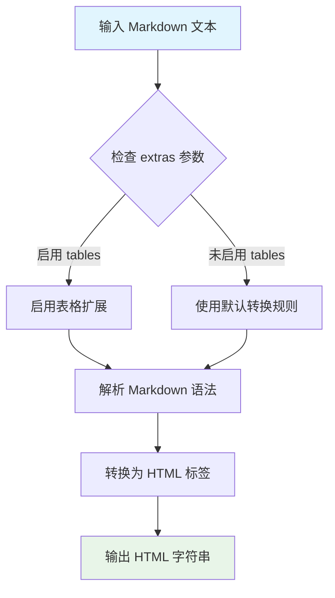
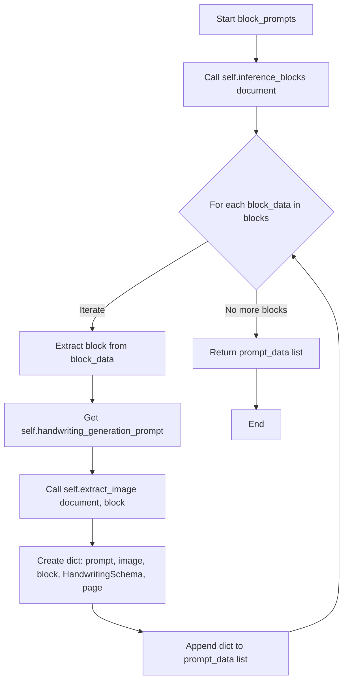

# `marker\marker\processors\llm\llm_handwriting.py` 详细设计文档

一个基于LLM的手写识别处理器模块，通过调用大语言模型将图像中的手写文本块转换为Markdown格式的HTML输出，支持文本和手写两种块类型的处理。

## 整体流程



## 类结构

```
BaseLLMSimpleBlockProcessor (marker.processors.llm)
└── LLMHandwritingProcessor
    └── HandwritingSchema (pydantic.BaseModel)
```

## 全局变量及字段


### `BlockTypes`
    
枚举类，定义块类型常量（Handwriting, Text, Line等）

类型：`enum`
    


### `BlockData`
    
块数据结构类型，包含block、page等信息

类型：`dict/typing.Dict`
    


### `PromptData`
    
提示数据结构类型，包含prompt、image、block、schema、page等信息

类型：`dict/typing.Dict`
    


### `Document`
    
文档对象类型，表示待处理的文档实体

类型：`class`
    


### `LLMHandwritingProcessor.block_types`
    
处理的块类型，包含 Handwriting 和 Text

类型：`tuple`
    


### `LLMHandwritingProcessor.handwriting_generation_prompt`
    
LLM 手写识别提示词模板

类型：`Annotated[str]`
    


### `HandwritingSchema.markdown`
    
LLM返回的markdown格式文本

类型：`str`
    
    

## 全局函数及方法


### `markdown2.markdown`

该函数是 `markdown2` 库的核心函数，用于将 Markdown 格式的文本转换为 HTML。在代码中主要用于将 LLM 生成的 Markdown 内容转换为 HTML，以便在文档渲染时使用，支持表格等 Markdown 扩展语法。

参数：

- `text`：`str`，需要转换的 Markdown 文本内容
- `extras`：`List[str]`，可选的扩展功能列表，代码中传入 `["tables"]` 以启用表格支持

返回值：`str`，转换后的 HTML 字符串

#### 流程图



#### 带注释源码

```python
# markdown2 库的 markdown 函数源码分析
# 位置：markdown2.py (第三方库)

def markdown(
    text: str,              # 输入的 Markdown 文本
    *args,                  # 额外位置参数
    **kwargs                # 关键字参数，如 extras=['tables']
) -> str:
    """
    将 Markdown 文本转换为 HTML
    
    参数:
        text: 要转换的 Markdown 字符串
        *args: 额外参数（如 safemode, html4tags 等已废弃参数）
        **kwargs: 关键字参数
            - extras: 功能扩展列表，如 ['tables', 'code-friendly', 'fenced-code-blocks']
            - safe_mode: 安全模式 (已废弃)
            - html4tags: 使用 HTML4 标签 (已废弃)
    
    返回:
        转换后的 HTML 字符串
    """
    
    # 1. 初始化转换器实例
    md = Markdown(*args, **kwargs)
    
    # 2. 处理输入文本
    #    - 处理 Unicode 字符
    #    - 规范化行结束符
    text = text.replace('\r\n', '\n').replace('\r', '\n')
    
    # 3. 如果启用了 tables 扩展，添加表格处理器
    if 'tables' in md.extras:
        md.postprocessors.add(
            TablePreprocessor(md),
            '>table',
            20  # 优先级
        )
    
    # 4. 执行转换流程
    #    a) 预处理 (Preprocessing)
    #    b) 块级解析 (Block parsing) - 段落、标题、列表等
    #    c) 行内解析 (Inline parsing) - 粗体、斜体、链接等
    #    d) 后处理 (Postprocessing)
    
    html = md.convert(text)
    
    return html


# 在 LLMHandwritingProcessor.rewrite_block 中的实际调用
class LLMHandwritingProcessor:
    def rewrite_block(self, response: dict, prompt_data: PromptData, document: Document):
        block = prompt_data["block"]
        raw_text = block.raw_text(document)

        if not response or "markdown" not in response:
            block.update_metadata(llm_error_count=1)
            return

        markdown = response["markdown"]
        # 检查 Markdown 长度是否合理（至少是原始文本的 50%）
        if len(markdown) < len(raw_text) * .5:
            block.update_metadata(llm_error_count=1)
            return

        # 清理 Markdown 代码块标记
        markdown = markdown.strip().lstrip("```markdown").rstrip("```").strip()
        
        # 调用 markdown2.markdown 将 Markdown 转换为 HTML
        # extras=["tables"] 启用 GitHub 风格的表格支持
        block.html = markdown2.markdown(markdown, extras=["tables"])
```


### `LLMHandwritingProcessor.inference_blocks`

该方法继承自 `BaseLLMSimpleBlockProcessor`，用于推理并过滤需要处理的文档块。它首先调用父类方法获取所有基础块，然后对 Text 类型的块进行过滤——如果 Text 块已经包含行（Line）或已有文本内容，则跳过处理，最终返回需要进一步处理的块列表。

参数：

- `document`：`Document`，输入的文档对象，包含待处理的文档内容

返回值：`List[BlockData]`，返回过滤后的块数据列表，这些块将用于后续的 LLM 处理

#### 流程图

```mermaid
flowchart TD
    A[开始 inference_blocks] --> B[调用父类 super().inference_blocks 获取基础块列表]
    B --> C[初始化空列表 out_blocks]
    C --> D{遍历 blocks 中的每个 block_data}
    D --> E[获取 block_data 中的 raw_text 和 block 对象]
    E --> F{block.block_type == BlockTypes.Text?}
    F -->|是| G[检查 Text 块是否包含行或已有文本]
    G --> H{len(lines) > 0 或 len(raw_text.strip()) > 0?}
    H -->|是| I[continue 跳过此块, 不加入 out_blocks]
    H -->|否| J[将 block_data 加入 out_blocks]
    F -->|否| J
    J --> K{blocks 遍历完毕?}
    K -->|否| D
    K -->|是| L[返回 out_blocks]
```

#### 带注释源码

```python
def inference_blocks(self, document: Document) -> List[BlockData]:
    """
    推理并过滤需要处理的文档块。
    
    该方法首先调用父类方法获取所有基础块，然后对 Text 类型的块进行过滤：
    - 如果 Text 块已经包含行(Line)块，则跳过
    - 如果 Text 块已经有文本内容，则跳过
    - 其他块（如 Handwriting 块）将保留在输出中
    """
    # 调用父类的 inference_blocks 方法，获取基础块列表
    # 父类方法会根据 block_types 属性筛选特定类型的块
    blocks = super().inference_blocks(document)
    
    # 初始化输出块列表
    out_blocks = []
    
    # 遍历父类返回的所有块
    for block_data in blocks:
        # 获取当前块的原始文本内容
        raw_text = block_data["block"].raw_text(document)
        # 获取 block 对象引用
        block = block_data["block"]

        # 对于 Text 类型的块进行检查：如果已经包含行或已有文本内容，则跳过处理
        # 原因：Text 块如果已经有内容，说明已经被 OCR 处理过，不需要再进行 LLM 处理
        if block.block_type == BlockTypes.Text:
            # 检查该 Text 块是否包含子块 Line
            lines = block.contained_blocks(document, (BlockTypes.Line,))
            # 如果包含行或有实际文本内容，则跳过此块
            if len(lines) > 0 or len(raw_text.strip()) > 0:
                continue
        
        # 将通过过滤的块添加到输出列表
        out_blocks.append(block_data)
    
    # 返回过滤后的块列表
    return out_blocks
```


### `LLMHandwritingProcessor.block_prompts`

该方法接收一个文档对象，遍历通过 `inference_blocks` 获取的文本块，为每个手写或文本块生成包含提示词、图像、块数据、Schema 和页码的 PromptData 列表，供后续 LLM 调用进行手写识别和 Markdown 转换。

参数：

- `document`：`Document`，待处理的文档对象，包含需要处理的块信息

返回值：`List[PromptData]`，包含每个块的提示词、图像、块引用、Schema 和页码信息的字典列表

#### 流程图



#### 带注释源码

```python
def block_prompts(self, document: Document) -> List[PromptData]:
    """
    为每个块生成包含图像和提示词的数据，供后续LLM处理使用
    
    参数:
        document: Document对象，包含待处理的文档和块信息
    
    返回:
        List[PromptData]: 包含每个块的prompt、image、block、schema和page的字典列表
    """
    # 初始化用于存储所有块prompt数据的列表
    prompt_data = []
    
    # 调用父类方法获取需要处理的块数据（包含Handwriting和Text类型块）
    for block_data in self.inference_blocks(document):
        # 从block_data中提取当前块对象
        block = block_data["block"]
        
        # 获取手写识别专用的提示词模板
        prompt = self.handwriting_generation_prompt
        
        # 从文档中提取当前块对应的图像内容
        image = self.extract_image(document, block)

        # 构建包含完整LLM调用所需信息的字典
        # - prompt: 用于指导LLM进行OCR的提示词
        # - image: 待识别的图像数据
        # - block: 原始块引用，用于后续结果写入
        # - schema: HandwritingSchema，定义LLM输出格式（包含markdown字段）
        # - page: 块所在页码
        prompt_data.append({
            "prompt": prompt,
            "image": image,
            "block": block,
            "schema": HandwritingSchema,
            "page": block_data["page"]
        })
    
    # 返回所有块的prompt数据列表，供LLM批处理使用
    return prompt_data
```


### `LLMHandwritingProcessor.rewrite_block`

该方法负责将 LLM 生成的 markdown 响应转换为 HTML 并更新到文档块中，同时包含错误处理逻辑，用于验证响应有效性和内容完整性。

参数：

- `response`：`dict`，LLM 调用返回的响应字典，应包含 "markdown" 键
- `prompt_data`：`PromptData`，包含块信息和提示数据的字典，需要通过 "block" 键获取目标块
- `document`：`Document`，文档对象，用于获取块的原始文本

返回值：`None`，该方法直接修改 block 对象的 html 属性和元数据，无返回值

#### 流程图

```mermaid
flowchart TD
    A[开始 rewrite_block] --> B[从 prompt_data 获取 block]
    B --> C[获取 block 的原始文本 raw_text]
    C --> D{response 是否为空或无 'markdown' 键?}
    D -->|是| E[更新块元数据 llm_error_count += 1]
    D -->|否| F[获取 response['markdown']]
    E --> Z[返回]
    F --> G{markdown 长度 >= raw_text 长度 * 0.5?}
    G -->|否| E
    G -->|是| H[清理 markdown 字符串]
    H --> I[使用 markdown2 转换为 HTML]
    I --> J[将 HTML 赋值给 block.html]
    J --> Z
```

#### 带注释源码

```python
def rewrite_block(self, response: dict, prompt_data: PromptData, document: Document):
    """
    将 LLM 响应转换为 HTML 并更新文档块
    
    参数:
        response: LLM 返回的响应字典，应包含 'markdown' 键
        prompt_data: 包含块信息和提示数据的字典，通过 'block' 键获取目标块
        document: 文档对象，用于获取块的原始文本进行长度验证
    """
    # 从 prompt_data 中提取目标块对象
    block = prompt_data["block"]
    
    # 获取该块的原始文本内容，用于后续长度校验
    raw_text = block.raw_text(document)

    # 验证响应有效性：检查响应不为空且包含 markdown 内容
    if not response or "markdown" not in response:
        # 记录错误计数并提前返回
        block.update_metadata(llm_error_count=1)
        return

    # 提取 LLM 生成的 markdown 内容
    markdown = response["markdown"]
    
    # 内容完整性校验：确保生成的文本长度不少于原始文本的 50%
    # 防止 LLM 过度精简或遗漏内容
    if len(markdown) < len(raw_text) * .5:
        block.update_metadata(llm_error_count=1)
        return

    # 清理 markdown 字符串，移除可能的 markdown 代码块标记
    markdown = markdown.strip().lstrip("```markdown").rstrip("```").strip()
    
    # 使用 markdown2 库将 markdown 转换为 HTML
    # 启用 tables 扩展以支持表格转换
    block.html = markdown2.markdown(markdown, extras=["tables"])
```

## 关键组件


### LLMHandwritingProcessor

核心处理器类，继承自BaseLLMSimpleBlockProcessor，负责使用LLM模型对文档中的手写文本和空文本块进行OCR识别，将图像转换为Markdown格式。支持BlockTypes.Handwriting和BlockTypes.Text两种块类型。

### handwriting_generation_prompt

预定义的提示词模板，包含详细的Markdown格式化规则，指导LLM如何准确地将图像中的文本内容转换为Markdown格式，包括斜体、粗体、代码块、标题、列表、链接、数学公式和表格等格式。

### inference_blocks方法

继承父类方法后进行过滤处理，跳过已包含行内容的Text块和已有实际文本内容的Text块，仅返回需要OCR处理的手写块或空文本块。

### block_prompts方法

遍历过滤后的块，为每个块准备PromptData，包含提示词、提取的图像、块对象、响应schema和页码信息，用于后续LLM调用。

### rewrite_block方法

处理LLM响应，验证响应有效性，计算识别文本长度是否合理，使用markdown2将Markdown转换为HTML，并更新块的html属性。

### HandwritingSchema

Pydantic数据模型，定义LLM响应格式必须包含markdown字段，用于结构化LLM输出。

### 块过滤逻辑

通过contained_blocks方法检查Text块是否包含Line子块，避免重复处理已有内容的文本块，提高处理效率。

### 错误处理机制

通过update_metadata记录llm_error_count标记处理失败的块，包括响应为空、缺少markdown字段或识别文本过短的情况。


## 问题及建议


### 已知问题

-   **Magic Number 硬编码**：长度阈值 `0.5`（`len(markdown) < len(raw_text) * .5`）是硬编码的魔法数字，缺乏可配置性，未来调整阈值需要修改源码。
-   **Prompt 模板过长**：`handwriting_generation_prompt` 作为类属性包含超过 2000 字符的提示词，违反单一职责原则，不利于维护和国际化扩展。
-   **异常处理不完善**：`rewrite_block` 方法仅检查 `response` 是否包含 `"markdown"` 键，对于其他可能的错误（如网络异常、超时、LLM 返回格式错误）缺乏详细日志和分类处理。
-   **类型提示不精确**：`block_prompts` 方法返回 `List[dict]` 而非 `List[PromptData]`，降低了类型安全和代码可读性。
-   **重复计算**：`inference_blocks` 方法中 `block.raw_text(document)` 在循环内每次都重新计算，可提取到循环外。
-   **Schema 定义位置**：`HandwritingSchema` 定义在类外部但未作为模块级常量导出，不利于类型复用和模块化设计。
-   **文档缺失**：所有类和方法均无 docstring，违反了代码可维护性最佳实践。

### 优化建议

-   将 `0.5` 阈值提取为类属性或配置项（如 `min_length_ratio`），并添加类型注解和文档说明。
-   将 `handwriting_generation_prompt` 移至独立的配置文件或资源文件，支持多语言和动态加载。
-   在 `rewrite_block` 中增加详细的异常处理和日志记录，例如使用结构化日志区分不同类型的错误（解析错误、长度错误、网络错误等）。
-   修正 `block_prompts` 的返回类型为 `List[PromptData]`，或定义明确的数据类替代 dict 以提高类型安全。
-   优化 `inference_blocks` 中的循环逻辑，避免重复调用 `raw_text(document)`。
-   为 `HandwritingSchema` 添加模块级导出，考虑将其移至专用模块以提高复用性。
-   为所有公共方法添加 Google 风格或 NumPy 风格的 docstring，说明参数、返回值和可能抛出的异常。

## 其它


### 设计目标与约束

该处理器旨在利用大语言模型（LLM）将图像中的手写文本和文本块转换为 Markdown 格式，再转换为 HTML。主要设计目标包括：1）准确识别并转换手写内容为结构化文本；2）支持多种文本格式（斜体、粗体、代码、标题、列表、链接、数学公式、表格等）；3）通过 Pydantic 模型验证 LLM 响应格式；4）过滤已包含文本内容的文本块以避免重复处理。约束条件包括依赖外部 LLM API（如 Gemini）进行推理，以及需要提前提取图像块供模型使用。

### 错误处理与异常设计

错误处理主要通过 `block.update_metadata(llm_error_count=1)` 记录处理失败状态。具体场景包括：1）响应为空或不包含 "markdown" 字段时，标记错误计数并返回；2）生成的 Markdown 长度少于原始文本的 50% 时，视为识别不完整，标记错误计数并返回。错误设计采用增量计数而非直接抛出异常，允许系统在部分失败情况下继续处理其他块。

### 外部依赖与接口契约

主要外部依赖包括：1）`markdown2` 库用于将 Markdown 转换为 HTML，支持表格等扩展功能；2）`pydantic` 的 `BaseModel` 用于定义响应Schema验证；3）`marker` 框架的 `BlockTypes`、`Document`、`BlockData` 等类定义块类型和文档结构。接口契约方面，`inference_blocks` 方法返回需要处理的块列表，`block_prompts` 方法生成 LLM 提示数据（包含 prompt、image、block、schema、page），`rewrite_block` 方法根据 LLM 响应更新块内容。

### 性能考虑与优化空间

潜在性能优化点：1）`inference_blocks` 方法中每次迭代都调用 `block.contained_blocks()` 和 `block.raw_text()`，可考虑缓存结果；2）文本块过滤逻辑可以提前到父类处理，减少重复遍历；3）可以考虑批量处理多个块而非逐个调用 LLM；4）`HandwritingSchema` 定义简单，可考虑扩展支持更多字段验证。当前实现为同步处理，大批量文档处理时可能成为瓶颈。

### 使用示例与调用流程

典型调用流程：1）实例化 `LLMHandwritingProcessor`；2）传入 `Document` 对象调用处理方法；3）系统自动提取需要处理的块，生成提示数据；4）调用 LLM 获取识别结果；5）通过 `rewrite_block` 方法将结果转换为 HTML 并更新块元数据。使用时需确保 Document 对象已正确初始化，且图像提取组件可用。

### 关键数据结构的序列化与反序列化

`HandwritingSchema` 定义了 LLM 响应的预期结构，包含 `markdown: str` 字段。该 Pydantic 模型在 `block_prompts` 方法中作为 schema 传递给 LLM，用于指导模型输出格式并在解析响应时进行验证。响应数据通过 `response["markdown"]` 键提取，经验证后使用 `markdown2` 转换为 HTML 格式存储到 `block.html` 属性中。

### 并发与线程安全性

当前实现为单线程同步处理，未使用显式锁或线程安全机制。`block.update_metadata()` 方法调用需确保在单线程环境或由外部同步机制保护。在多文档并发处理场景下，建议每个文档使用独立的处理器实例以避免状态污染。

### 版本兼容性考虑

代码依赖 `marker` 框架的内部 API（如 `BlockTypes.Handwriting`、`BlockTypes.Text`、`BlockTypes.Line`），这些枚举值可能随框架版本变化。建议锁定 marker 框架版本，并在升级时进行回归测试。`markdown2` 库的使用较为稳定，版本兼容性较好。


    