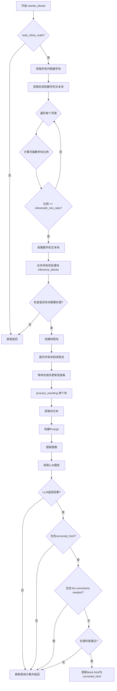
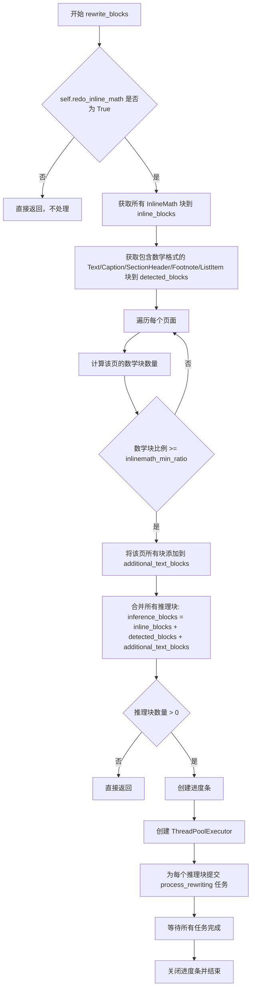
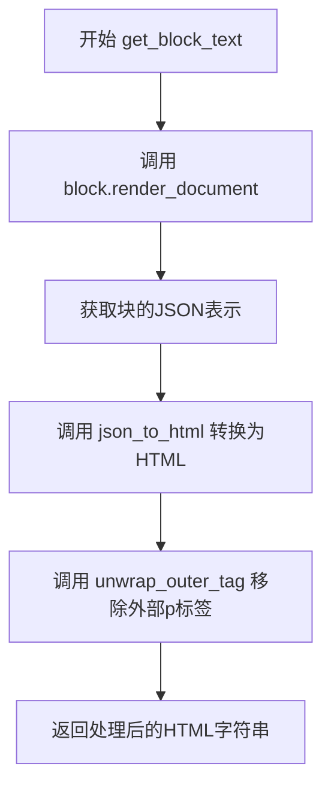
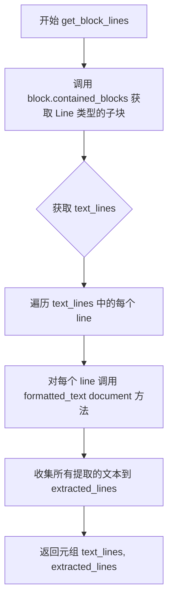

# `marker\marker\processors\llm\llm_mathblock.py` 详细设计文档

这是一个使用LLM对文档中的文本和数学公式块进行重写的处理器。它通过分析页面中的内联数学块和包含数学格式的其他文本块，使用LLM服务校正文本错误和数学表达式，并更新文档块的HTML内容。

## 整体流程



## 类结构

```
BaseLLMComplexBlockProcessor (基类)
└── LLMMathBlockProcessor (当前类)
    └── LLMTextSchema (内部数据模型, Pydantic BaseModel)
```

## 全局变量及字段


### `ThreadPoolExecutor`
    
用于并发执行任务的线程池执行器

类型：`class`
    


### `as_completed`
    
返回迭代器，按完成顺序返回已完成的Future对象

类型：`function`
    


### `List`
    
Python typing中的列表类型

类型：`type`
    


### `Tuple`
    
Python typing中的元组类型

类型：`type`
    


### `Annotated`
    
用于添加元数据的类型注解

类型：`type`
    


### `BaseModel`
    
Pydantic基础模型类，用于数据验证

类型：`class`
    


### `tqdm`
    
进度条显示库

类型：`class`
    


### `json_to_html`
    
将JSON转换为HTML的函数

类型：`function`
    


### `unwrap_outer_tag`
    
移除外层HTML标签的函数

类型：`function`
    


### `BaseLLMComplexBlockProcessor`
    
LLM复杂块处理器基类

类型：`class`
    


### `BlockTypes`
    
块类型枚举类

类型：`class`
    


### `Block`
    
文档块基类

类型：`class`
    


### `InlineMath`
    
内联数学块类

类型：`class`
    


### `Document`
    
文档类

类型：`class`
    


### `PageGroup`
    
页面组类

类型：`class`
    


### `LLMTextSchema`
    
LLM文本模式类，用于定义LLM返回的数据结构

类型：`class`
    


### `LLMMathBlockProcessor.redo_inline_math`
    
是否重新处理内联数学

类型：`Annotated[bool]`
    


### `LLMMathBlockProcessor.inlinemath_min_ratio`
    
判断是否包含数学的阈值比例

类型：`Annotated[float]`
    


### `LLMMathBlockProcessor.block_types`
    
主要处理的块类型(TextInlineMath)

类型：`tuple`
    


### `LLMMathBlockProcessor.additional_block_types`
    
次要块类型(Text, Caption, SectionHeader, Footnote)

类型：`tuple`
    


### `LLMMathBlockProcessor.text_math_rewriting_prompt`
    
LLM重写提示词模板

类型：`str`
    


### `LLMTextSchema.analysis`
    
LLM分析结果

类型：`str`
    


### `LLMTextSchema.corrected_html`
    
校正后的HTML内容

类型：`str`
    
    

## 全局函数及方法


### `LLMMathBlockProcessor.rewrite_blocks`

该方法是 Marker 库中 LLMMathBlockProcessor 类的主入口方法，用于使用 LLM 服务重写文档中包含数学内容的文本块。它通过检测文档中的内联数学块和被识别为包含数学的其他块，根据页面内数学块的密度比例决定是否将该页的所有文本块纳入处理范围，最后使用 ThreadPoolExecutor 并行调用 process_rewriting 方法对每个块进行重写。

参数：

- `self`：`LLMMathBlockProcessor`，当前类的实例，包含配置参数如 redo_inline_math、inlinemath_min_ratio 等
- `document`：`Document`，文档对象，包含所有页面和块的信息，用于检索和更新块内容

返回值：`None`，该方法直接修改 document 中块的 html 属性，不返回任何值

#### 流程图



#### 带注释源码

```python
def rewrite_blocks(self, document: Document):
    """
    重写文档中所有需要处理的数学相关块
    主入口方法，遍历文档的页面和块，使用 LLM 服务重写包含数学内容的块
    """
    # 如果不需要重写内联数学，直接返回
    if not self.redo_inline_math:
        return

    # 获取文档中所有的内联数学块 (InlineMath 类型)
    # inline_blocks: List[InlineMath] = [(page, block), ...]
    inline_blocks: List[InlineMath] = [
        (page, block)
        for page in document.pages
        for block in page.contained_blocks(document, self.block_types)
    ]

    # 获取其他被检测到包含数学格式的块
    # 这些块原本不是 InlineMath 类型，但内部包含数学格式的 Line 块
    detected_blocks = [
        (page, block)
        for page in document.pages
        for block in page.contained_blocks(
            document,
            (
                BlockTypes.Text,
                BlockTypes.Caption,
                BlockTypes.SectionHeader,
                BlockTypes.Footnote,
                BlockTypes.ListItem,
            ),
        )
        if any(
            [
                b.formats and "math" in b.formats
                for b in block.contained_blocks(document, (BlockTypes.Line,))
            ]
        )
    ]

    # 如果一个页面有足够多的数学块，则假设该页所有块都可能包含数学
    # 这是一个启发式策略，用于处理数学密集的文档（如数学教材）
    additional_text_blocks = []
    for page in document.pages:
        # 统计该页的内联数学块数量
        page_inlinemath_blocks = [
            im for im in inline_blocks if im[0].page_id == page.page_id
        ]
        # 统计该页检测到的数学块数量
        page_detected_blocks = [
            db for db in detected_blocks if db[0].page_id == page.page_id
        ]
        # 该页数学块总数
        math_block_count = len(page_inlinemath_blocks) + len(page_detected_blocks)

        # 获取该页所有可能包含数学的块
        additional_blocks = page.contained_blocks(
            document, self.additional_block_types + self.block_types
        )

        # 如果数学块占比超过阈值，则将该页所有块加入处理队列
        if (
            math_block_count / max(1, len(additional_blocks))
            < self.inlinemath_min_ratio
        ):
            continue  # 该页数学密度不够，跳过

        # 将该页额外的块加入处理列表
        for b in additional_blocks:
            if b not in detected_blocks and b not in inline_blocks:
                additional_text_blocks.append((page, b))

    # 合并所有需要推理的块
    inference_blocks = inline_blocks + detected_blocks + additional_text_blocks

    # 如果没有块需要处理，直接返回
    total_blocks = len(inference_blocks)
    if total_blocks == 0:
        return

    # 创建进度条显示处理进度
    pbar = tqdm(
        total=total_blocks,
        desc=f"{self.__class__.__name__} running",
        disable=self.disable_tqdm
    )
    
    # 使用线程池并行处理所有块
    with ThreadPoolExecutor(max_workers=self.max_concurrency) as executor:
        # 提交所有任务到线程池
        for future in as_completed(
            [
                executor.submit(self.process_rewriting, document, b[0], b[1])
                for b in inference_blocks
            ]
        ):
            # 等待任务完成，异常会被抛出
            future.result()  # Raise exceptions if any occurred
            pbar.update(1)

    pbar.close()
```


### `LLMMathBlockProcessor.get_block_text`

获取指定块的HTML文本表示，将块的渲染结果转换为HTML格式并移除外部标签。

参数：

- `self`：隐式参数，`LLMMMBlockProcessor` 实例，当前处理器对象
- `block`：`Block`，需要获取HTML文本的块对象
- `document`：`Document`，文档对象，提供块的上下文和渲染所需的数据

返回值：`str`，处理后的HTML文本字符串

#### 流程图



#### 带注释源码

```python
def get_block_text(self, block: Block, document: Document) -> str:
    """
    获取块的HTML文本表示
    
    参数:
        block: Block - 需要转换的块对象
        document: Document - 文档对象，用于块的渲染和上下文
    
    返回:
        str - 处理后的HTML文本字符串
    """
    # 第一步：将块对象渲染为JSON格式
    # block.render(document) 返回块的中间表示（通常是字典/JSON结构）
    html = json_to_html(block.render(document))
    
    # 第二步：移除外层标签
    # unwrap_outer_tag 函数会检查HTML是否被额外的<p>标签包裹
    # 如果存在外层p标签，则移除它，保留内部内容
    # 例如：'<p>content</p>' -> 'content'
    html = unwrap_outer_tag(html)
    
    # 第三步：返回处理后的HTML字符串
    return html
```


### `LLMMathBlockProcessor.get_block_lines`

该方法用于从给定的块中提取所有文本行及其格式化后的文本内容，返回包含原始行对象和提取文本的元组。

参数：

- `self`：`LLMMathBlockProcessor`，当前类实例
- `block`：`Block`，需要提取行的块对象
- `document`：`Document`，文档对象，用于访问块内容和格式化文本

返回值：`Tuple[list, list]`，包含两个列表的元组——第一个列表是块中所有的行对象（`BlockTypes.Line`），第二个列表是对应行对象的格式化文本字符串

#### 流程图



#### 带注释源码

```python
def get_block_lines(self, block: Block, document: Document) -> Tuple[list, list]:
    """
    获取块的行和提取的文本
    
    参数:
        block: Block - 需要提取行的块对象
        document: Document - 文档对象，用于访问块内容和格式化文本
    
    返回:
        Tuple[list, list] - 包含(行对象列表, 提取的文本字符串列表)
    """
    # 获取 block 中所有 BlockTypes.Line 类型的子块
    text_lines = block.contained_blocks(document, (BlockTypes.Line,))
    
    # 遍历每个行对象，调用 formatted_text 方法提取格式化后的文本
    extracted_lines = [line.formatted_text(document) for line in text_lines]
    
    # 返回包含原始行对象和提取文本的元组
    return text_lines, extracted_lines
```


### `LLMMathBlockProcessor.process_rewriting`

该方法负责处理单个文档块的重写逻辑，通过提取块的文本和图像，利用LLM服务校正文本中的错误（包括数学公式、格式等），并将校正后的HTML更新到原块中。

参数：

- `self`：`LLMMathBlockProcessor`，当前处理器实例
- `document`：`Document`，文档对象，包含所有页面和块的完整数据
- `page`：`PageGroup`，页面组对象，表示块所在的页面
- `block`：`Block`，要重写的单个块对象

返回值：`None`，该方法直接修改块对象的属性，不返回任何值

#### 流程图

```mermaid
flowchart TD
    A[开始 process_rewriting] --> B[获取块文本: get_block_text]
    B --> C[构建提示: 替换{extracted_html}占位符]
    C --> D[提取图像: extract_image]
    D --> E[调用LLM服务: llm_service]
    E --> F{响应是否存在且包含corrected_html?}
    F -->|否| G[更新元数据: llm_error_count=1]
    G --> Z[结束]
    F -->|是| H{corrected_html是否为空?}
    H -->|是| G
    H -->|否| I{包含'No corrections needed'?}
    I -->|是| Z
    I -->|否| J{校正HTML长度 < 原始文本60%?}
    J -->|是| G
    J -->|否| K[更新块HTML: block.html = corrected_html]
    K --> Z
```

#### 带注释源码

```python
def process_rewriting(self, document: Document, page: PageGroup, block: Block):
    # 步骤1: 获取块的HTML表示文本
    # 调用get_block_text方法将块转换为HTML字符串
    block_text = self.get_block_text(block, document)
    
    # 步骤2: 构建重写提示
    # 将提取的HTML文本替换到提示模板的{extracted_html}占位符位置
    prompt = self.text_math_rewriting_prompt.replace("{extracted_html}", block_text)

    # 步骤3: 提取块的图像
    # 从文档中提取该块对应的图像，用于LLM视觉理解
    image = self.extract_image(document, block)
    
    # 步骤4: 调用LLM服务进行文本校正
    # 传入提示、图像、块信息，并指定期望的响应模式LLMTextSchema
    response = self.llm_service(prompt, image, block, LLMTextSchema)

    # 步骤5: 验证LLM响应
    # 检查响应是否存在且包含corrected_html字段
    if not response or "corrected_html" not in response:
        # 如果响应无效，记录错误计数并返回
        block.update_metadata(llm_error_count=1)
        return

    # 获取校正后的HTML内容
    corrected_html = response["corrected_html"]
    
    # 步骤6: 检查校正内容是否为空
    if not corrected_html:
        block.update_metadata(llm_error_count=1)
        return

    # 步骤7: 检查是否不需要校正
    # LLM返回"No corrections needed"表示原文无需修改
    if "no corrections needed" in corrected_html.lower():
        return

    # 步骤8: 长度校验，防止LLM生成过短/无效内容
    # 如果校正后的HTML长度少于原始文本的60%，认为是错误响应
    if len(corrected_html) < len(block_text) * 0.6:
        block.update_metadata(llm_error_count=1)
        return

    # 步骤9: 更新块的HTML内容
    # 所有验证通过后，将校正后的HTML赋值给块对象
    block.html = corrected_html
```

## 关键组件


### 张量索引与惰性加载

该组件通过`contained_blocks`方法实现文档块的惰性加载，使用块类型作为索引键进行高效查询。在`rewrite_blocks`方法中，通过多轮迭代收集不同类型的块（InlineMath块、检测到数学的块、额外的文本块），避免一次性加载所有块到内存。

### 反量化支持

该组件将提取的文本中的数学表达式转换为HTML格式的`<math>...</math>`标签，并确保使用KaTeX兼容的简洁LaTeX格式。在`process_rewriting`方法中，通过正则匹配"No corrections needed"来判断是否需要更新块内容，实现对数学表达式的精确修复和格式化。

### 量化策略

该组件通过`inlinemath_min_ratio`参数（默认0.4）设定阈值，判断页面中数学块的占比。当数学块占比超过阈值时，系统会假设该页所有块都可能包含数学，从而扩大处理范围。这种自适应策略平衡了处理精度与计算开销。


## 问题及建议


### 已知问题

- **异常处理不完善**：`process_rewriting` 方法中调用 `self.llm_service` 时没有 try-except 包裹，若 LLM 服务调用失败会直接抛出未处理异常；`future.result()` 会触发异常但缺少具体的错误日志记录
- **空值边界条件未处理**：`block_text` 可能为空字符串，导致 `"no corrections needed" in corrected_html.lower()` 和长度比较逻辑出现意外行为
- **硬编码的魔法数字**：`0.6` (长度比率阈值) 和 `0.4` (inlinemath_min_ratio) 缺乏常量定义和注释说明，降低了代码可维护性
- **重复的块类型定义**：`BlockTypes.ListItem` 在 `detected_blocks` 筛选中使用，但未包含在 `additional_block_types` 元组中，造成逻辑不一致
- **进度条未使用上下文管理器**：`pbar.close()` 应使用 `tqdm` 的上下文管理器模式以确保资源正确释放
- **类型注解缺失**：多个方法缺少返回类型注解，如 `get_block_text`、`get_block_lines`、`process_rewriting`；`disable_tqdm` 和 `max_concurrency` 属性也缺少类型定义
- **未使用的参数**：`process_rewriting` 方法的 `page` 参数在方法体内未被使用，但传入了该参数
- **字符串替换无验证**：`text_math_rewriting_prompt.replace("{extracted_html}", block_text)` 若 `block_text` 包含特殊字符可能导致 prompt 结构异常

### 优化建议

- 为 LLM 服务调用添加重试机制和指数退避策略，提高失败容错率
- 将魔法数字提取为类常量或配置属性，并添加类型注解和文档字符串
- 使用 `tqdm` 的上下文管理器 (`with tqdm(...) as pbar`) 管理进度条生命周期
- 对 `block_text` 为空的情况提前校验并跳过处理，避免无效的 LLM 调用
- 补充方法返回类型注解，统一代码风格
- 移除 `process_rewriting` 中未使用的 `page` 参数，或考虑在方法内使用该参数进行更细粒度的处理
- 将 `detected_blocks` 和 `additional_block_types` 的块类型定义统一管理，避免重复和遗漏

## 其它


### 设计目标与约束

本模块的设计目标是使用LLM服务对文档中的数学表达式和文本进行自动纠正和重写，确保数学公式以正确的LaTeX格式呈现，并修正提取过程中的文本错误。核心约束包括：仅在`redo_inline_math`配置为True时执行重写操作；通过`inlinemath_min_ratio`参数控制是否将页面所有文本块纳入处理范围；使用ThreadPoolExecutor实现并发处理但不超过`max_concurrency`限制；LLM调用必须符合指定的输出schema格式。

### 错误处理与异常设计

本模块采用分层错误处理策略：1) 对于LLM调用失败或返回格式错误，设置`llm_error_count=1`元数据并跳过当前块处理；2) 对于返回"no corrections needed"的响应，视为正常情况直接返回；3) 对于纠正后HTML长度小于原文本60%的情况，判定为LLM产生错误响应并记录错误计数；4) ThreadPoolExecutor中的异常通过`future.result()`主动抛出，确保任何子任务失败都能被感知；5) 进度条在无块处理时自动禁用，避免无效输出。所有错误都不中断整体流程，采用fail-safe模式保证部分块处理成功。

### 数据流与状态机

数据流分为三个主要阶段：1) 收集阶段：扫描文档获取所有内联数学块、检测到数学格式的文本块、以及根据页面数学密度额外纳入的文本块；2) 并发处理阶段：将收集到的块通过ThreadPoolExecutor分发到多个线程，每个线程调用LLM服务获取纠正后的HTML；3) 更新阶段：将LLM返回的正确HTML更新到对应块的html属性。状态转换通过块对象的元数据（`llm_error_count`）记录处理状态，无需独立状态机实现。

### 外部依赖与接口契约

本模块依赖以下外部组件：1) `BaseLLMComplexBlockProcessor`：基类，提供`llm_service`方法调用LLM服务、`extract_image`方法提取块对应的图像、`max_concurrency`和`disable_tqdm`配置属性；2) `Document`、`PageGroup`、`Block`：文档模型对象，提供`contained_blocks`、`render`等方法；3) `BlockTypes`：枚举类型，定义所有块类型；4) `LLMTextSchema`：Pydantic模型，定义LLM响应的结构化输出格式（包含analysis和corrected_html字段）；5) `json_to_html`、`unwrap_outer_tag`：工具函数，用于块渲染和HTML后处理；6) `ThreadPoolExecutor`、`as_completed`：并发处理组件。接口契约要求`llm_service`必须返回包含`corrected_html`键的字典，且调用时传入prompt、image、block和schema四个参数。

### 配置参数说明

本模块引入两个关键配置参数：`redo_inline_math`（bool类型，默认False）控制是否启用内联数学重写功能，设为False时整个`rewrite_blocks`方法提前返回；`inlinemath_min_ratio`（float类型，默认0.4）设定页面数学块占比阈值，当页面数学块数量与总文本块数量之比超过该值时，认为该页面可能所有文本都包含数学，从而将所有文本块纳入处理范围。这两个参数共同决定了重写逻辑的触发条件和处理范围。

### 性能考虑与资源管理

性能优化体现在三个方面：1) 并发处理：使用ThreadPoolExecutor实现块级并发，通过`max_concurrency`参数控制最大并发数，避免资源过载；2) 条件跳过：当无块需要处理时直接返回，避免创建Executor；3) 进度监控：使用tqdm提供处理进度反馈，同时支持通过`disable_tqdm`参数禁用进度条输出。资源管理方面，Executor使用上下文管理器确保线程池正确释放，进度条在异常情况下也能正确关闭。

### 并发模型

采用生产者-消费者模式的变体：主线程负责收集需要处理的块（生产者），将任务提交到线程池；工作线程从线程池获取任务并执行LLM调用（消费者）；主线程通过`as_completed`监控任务完成情况并更新进度条。线程安全由Python的GIL和块对象的独立性保证，无需额外同步机制。每个块的处理是独立的，块对象状态的更新（设置html属性）虽然存在潜在竞态条件，但由于每个块只被一个线程处理，不存在并发修改同一块的情况。

### 安全性考虑

本模块处理来自文档的文本和图像数据，不直接涉及用户认证或敏感信息。安全考量包括：1) LLM提示词模板中的`{extracted_html}`占位符直接替换，可能存在提示注入风险，但鉴于输入来自文档提取而非用户直接输入，风险可控；2) 保留所有`<a href='#...'>`标签的要求体现了对文档引用关系的保护；3) 错误处理中不暴露内部实现细节到外部。整体安全性依赖于上游文档处理模块和LLM服务的安全机制。

### 使用示例

```python
# 创建处理器实例
processor = LLMMathBlockProcessor(
    redo_inline_math=True,
    inlinemath_min_ratio=0.4,
    max_concurrency=4,
    llm_service=your_llm_service  # 实现llm_service接口的服务
)

# 在文档处理流程中调用
document = ...  # 已加载的Document对象
processor.rewrite_blocks(document)
```

### 版本兼容性

本代码依赖以下包的特定版本特性：1) `pydantic>=2.0`用于BaseModel；2) `typing.Annotated`用于参数元数据；3) `concurrent.futures`（Python 3.2+）；4) `tqdm`进度条。建议使用Python 3.8+以确保所有类型注解特性正常工作。marker相关依赖应与项目其他模块保持版本一致。

    