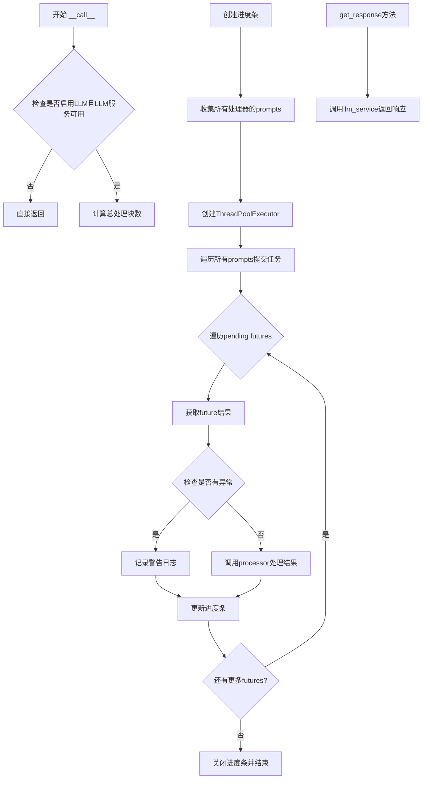
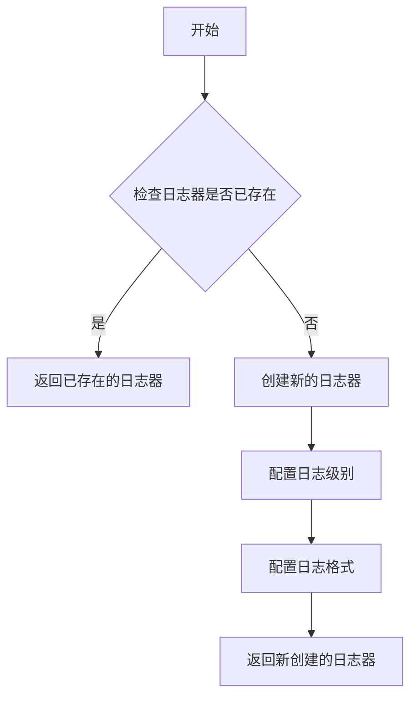
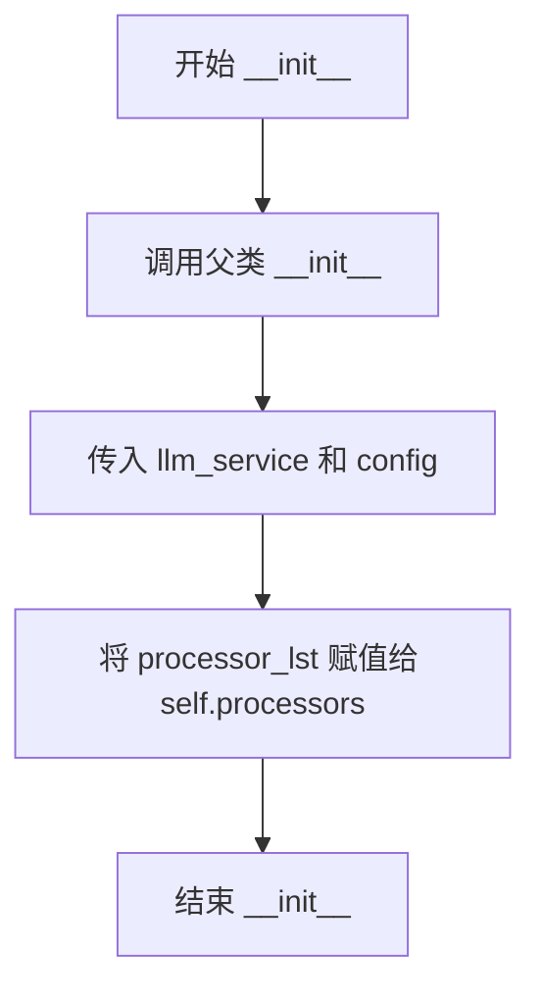
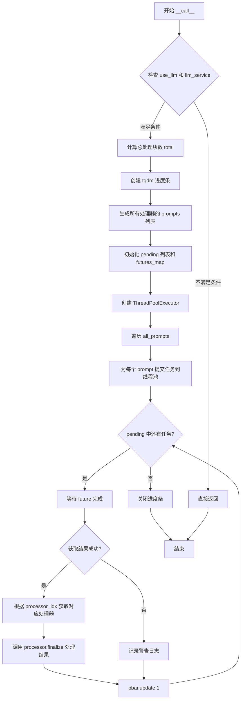
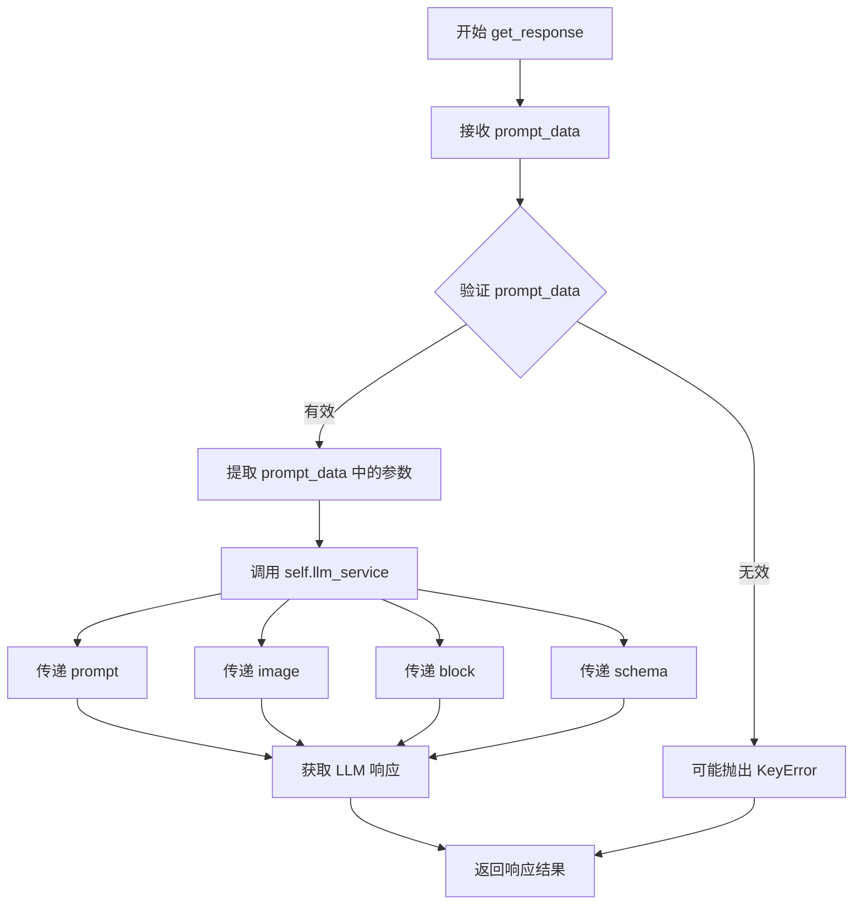

# `marker\marker\processors\llm\llm_meta.py` 详细设计文档

这是一个LLM元处理器，用于并行运行多个简单的LLM块处理器。它将多个BaseLLMSimpleBlockProcessor封装在一起，通过ThreadPoolExecutor实现并发执行，提高文档处理的效率和吞吐量。

## 整体流程



## 类结构

```
BaseLLMProcessor (基类)
└── LLMSimpleBlockMetaProcessor (实现类)
```

## 全局变量及字段


### `logger`
    
全局日志记录器，从marker.logger获取

类型：`Logger`
    


### `LLMSimpleBlockMetaProcessor.self.processors`
    
存储所有简单块处理器的列表

类型：`List[BaseLLMSimpleBlockProcessor]`
    
    

## 全局函数及方法


### `get_logger`

获取日志记录器实例，用于在模块中记录日志信息。

参数：

- 无参数

返回值：`Logger`，返回标准的Python日志记录器对象，可用于记录不同级别的日志信息

#### 流程图



#### 带注释源码

```
# 注意：此函数定义不在提供的代码中
# 这是从 marker.logger 模块导入的函数
from marker.logger import get_logger

# 使用方式
logger = get_logger()

# 在代码中用于记录警告日志
logger.warning(f"Error processing LLM response: {e}")
```

#### 说明

`get_logger` 函数是从外部模块 `marker.logger` 导入的，其完整定义不在当前代码片段中。从代码中的使用方式可以推断：

1. **调用方式**：`logger = get_logger()` - 不需要参数
2. **返回值用途**：返回一个日志记录器对象，赋值给 `logger` 变量
3. **使用场景**：在 `except` 块中记录错误信息 `logger.warning(f"Error processing LLM response: {e}")`

由于 `get_logger` 的定义位于 `marker.logger` 模块中（未在当前代码中提供），无法提供该函数的完整实现源码。


### `LLMSimpleBlockMetaProcessor.__init__`

初始化 LLM 简单块元处理器，接受处理器列表、LLM 服务和配置，并初始化父类。

参数：

- `self`：`LLMSimpleBlockMetaProcessor`，当前实例对象
- `processor_lst`：`List[BaseLLMSimpleBlockProcessor]`，处理器列表，包含所有需要并行运行的简单块处理器
- `llm_service`：`BaseService`，LLM 服务实例，用于调用大语言模型处理请求
- `config`：任意类型（可选），配置对象，默认为 None，用于传递额外配置参数

返回值：`None`，无返回值（初始化方法）

#### 流程图



#### 带注释源码

```python
def __init__(
    self,
    processor_lst: List[BaseLLMSimpleBlockProcessor],
    llm_service: BaseService,
    config=None,
):
    """
    初始化 LLM 简单块元处理器
    
    参数:
        processor_lst: 处理器列表，用于并行处理简单块
        llm_service: LLM 服务实例
        config: 可选配置对象
    """
    # 调用父类 BaseLLMProcessor 的初始化方法
    # 继承父类的属性和方法，设置 llm_service 和 config
    super().__init__(llm_service, config)
    
    # 将传入的处理器列表保存为实例属性
    # 供后续 __call__ 方法中使用，以并行执行所有处理器
    self.processors = processor_lst
```


### `LLMSimpleBlockMetaProcessor.__call__`

该方法是 LLM 简单块元处理器的核心并行处理入口，通过 ThreadPoolExecutor 将多个 LLM 处理器的推理任务分配到线程池中并发执行，遍历所有处理器的提示词列表并为每个提示词提交任务，最后收集结果并调用对应处理器的 finalize 方法完成文档处理。

参数：

- `document`：`Document`，待处理的文档对象，包含需要 LLM 处理的块信息

返回值：`None`，该方法直接修改传入的 document 对象，不返回任何值

#### 流程图



#### 带注释源码

```python
def __call__(self, document: Document):
    """
    并行处理文档中的 LLM 块
    核心逻辑：使用线程池并发执行多个 LLM 处理器的推理任务
    """
    # 检查是否启用 LLM 处理以及 LLM 服务是否可用
    if not self.use_llm or self.llm_service is None:
        return

    # 计算所有处理器需要处理的总块数
    # 遍历每个处理器，统计其需要推理的块数量
    total = sum(
        [len(processor.inference_blocks(document)) for processor in self.processors]
    )
    
    # 初始化进度条，显示 LLM 处理器运行状态
    # disable 用于控制是否显示进度条
    pbar = tqdm(
        desc="LLM processors running", disable=self.disable_tqdm, total=total
    )

    # 收集所有处理器的提示词列表
    # 每个处理器根据文档内容生成对应的提示词
    all_prompts = [
        processor.block_prompts(document) for processor in self.processors
    ]
    
    # pending: 存储所有提交的未来任务
    # futures_map: 建立 future 与处理器索引、提示词数据之间的映射关系
    pending = []
    futures_map = {}
    
    # 使用线程池执行并发任务
    # max_workers 控制最大并发数
    with ThreadPoolExecutor(max_workers=self.max_concurrency) as executor:
        # 遍历所有处理器的提示词列表
        for i, prompt_lst in enumerate(all_prompts):
            # 为每个提示词提交任务到线程池
            for prompt in prompt_lst:
                # 提交 get_response 任务，获取 Future 对象
                future = executor.submit(self.get_response, prompt)
                # 将 future 加入待处理列表
                pending.append(future)
                # 记录 future 与处理器索引、提示词数据的映射关系
                futures_map[future] = {"processor_idx": i, "prompt_data": prompt}

        # 等待所有任务完成并处理结果
        for future in pending:
            try:
                # 获取任务执行结果
                result = future.result()
                # 从映射中移除已完成的 future，获取关联数据
                future_data = futures_map.pop(future)
                # 根据处理器索引获取对应的处理器实例
                processor: BaseLLMSimpleBlockProcessor = self.processors[
                    future_data["processor_idx"]
                ]
                # 调用处理器的 finalize 方法处理结果
                # 传入：LLM响应结果、原始提示词数据、文档对象
                processor(result, future_data["prompt_data"], document)
            except Exception as e:
                # 捕获异常并记录警告日志，不中断其他任务
                logger.warning(f"Error processing LLM response: {e}")

            # 更新进度条计数
            pbar.update(1)

    # 关闭进度条
    pbar.close()
```

---

### 1. 一段话描述

`LLMSimpleBlockMetaProcessor` 是一个 LLM 处理器包装类，通过 `__call__` 方法利用 ThreadPoolExecutor 实现对多个 BaseLLMSimpleBlockProcessor 的并行调用，汇总所有处理器的提示词后并发提交到线程池执行，最后将 LLM 响应结果分发给对应的处理器完成文档的元数据处理。

---

### 2. 文件的整体运行流程

该模块属于 marker 库的处理层，文件运行流程如下：

1. **初始化阶段**：创建 `LLMSimpleBlockMetaProcessor` 实例，注入处理器列表和 LLM 服务
2. **入口调用**：当实例被作为函数调用时，触发 `__call__` 方法
3. **任务准备**：统计需处理块总数，生成各处理器的提示词列表
4. **并发执行**：使用线程池并发调用 `get_response` 方法获取 LLM 响应
5. **结果处理**：将响应结果路由到对应的处理器完成最终处理
6. **进度反馈**：通过 tqdm 展示处理进度

---

### 3. 类的详细信息

#### 3.1 类字段

| 字段名称 | 类型 | 描述 |
|---------|------|------|
| `processors` | `List[BaseLLMSimpleBlockProcessor]` | 存储需要并行执行的 LLM 简单块处理器列表 |
| `use_llm` | `bool` | 标记是否启用 LLM 处理功能 |
| `llm_service` | `BaseService` | LLM 服务实例，用于生成模型响应 |
| `max_concurrency` | `int` | 线程池最大并发工作线程数 |
| `disable_tqdm` | `bool` | 是否禁用 tqdm 进度条显示 |
| `config` | `Any` | 处理器配置参数 |

#### 3.2 类方法

| 方法名称 | 描述 |
|---------|------|
| `__init__` | 初始化元处理器，接受处理器列表、LLM 服务和配置 |
| `__call__` | **主处理方法**，实现并行处理逻辑的核心入口 |
| `get_response` | 内部方法，调用 LLM 服务获取响应 |

#### 3.3 全局变量和全局函数

| 名称 | 类型 | 描述 |
|-----|------|------|
| `logger` | `logging.Logger` | 模块级日志记录器，通过 `get_logger()` 获取 |

---

### 4. 关键组件信息

| 组件名称 | 一句话描述 |
|---------|-----------|
| `ThreadPoolExecutor` | Python 标准库提供的线程池执行器，用于并发任务调度 |
| `tqdm` | 进度条可视化库，用于展示 LLM 处理进度 |
| `BaseLLMSimpleBlockProcessor` | LLM 简单块处理器的抽象基类，定义提示词生成和结果处理接口 |
| `BaseLLMProcessor` | LLM 处理器的基类，提供 LLM 服务调用能力 |
| `BaseService` | 服务基类，封装 LLM 调用逻辑 |
| `Document` | 文档数据结构，包含页面和块的层级信息 |

---

### 5. 潜在的技术债务或优化空间

1. **线程池资源控制**：当前使用固定 `max_concurrency` 参数，但在高并发场景下可能耗尽系统资源，建议增加自适应调整机制或资源感知调度
2. **异常处理粒度**：仅记录警告日志，可能导致部分块处理失败但用户无感知，建议增加失败块的重试机制和详细错误报告
3. **进度条线程安全**：`pbar.update(1)` 在多线程环境下直接调用，tqdm 本身支持线程安全但高并发时可能存在竞争，建议评估性能影响
4. **内存占用**：所有 prompts 预先加载到内存，当文档很大时可能导致内存峰值，建议改为生成器或分批处理
5. **futures_map 内存泄漏**：虽然正常流程会 pop 元素，但异常情况下可能遗漏，建议使用 try-finally 确保清理

---

### 6. 其它项目

#### 6.1 设计目标与约束

- **设计目标**：通过并行处理提升多个 LLM 处理器的吞吐量，充分利用多核 CPU
- **约束条件**：依赖 `BaseLLMSimpleBlockProcessor` 的实现，必须实现 `inference_blocks`、`block_prompts` 和结果处理接口

#### 6.2 错误处理与异常设计

- 方法内部捕获 `Exception` 并记录警告日志，不抛出异常中断其他任务
- LLM 服务调用失败时不会阻止其他处理器继续执行
- 建议增强：错误发生时可选择重试或降级策略

#### 6.3 数据流与状态机

- **输入**：Document 对象 → 提取需处理块 → 生成 prompts
- **处理**：prompts → 线程池并发执行 → LLM 服务调用
- **输出**：结果分发 → 对应处理器 finalize → 修改 Document 对象

#### 6.4 外部依赖与接口契约

- 依赖 `concurrent.futures.ThreadPoolExecutor` 实现并发
- 依赖 `tqdm` 库显示进度
- 依赖 marker 内部的 `BaseLLMSimpleBlockProcessor` 和 `BaseService` 接口
- 接口契约：`processor.inference_blocks(document)` 返回可迭代块，`processor.block_prompts(document)` 返回提示词列表，`processor(result, prompt_data, document)` 执行结果处理


### `LLMSimpleBlockMetaProcessor.get_response`

获取 LLM 服务响应的辅助方法，从提示数据中提取必要参数并调用 LLM 服务获取结果。

参数：

- `prompt_data`：`Dict[str, Any]`，包含 prompt、image、block、schema 键的字典，用于构建 LLM 服务调用参数

返回值：`Any`，LLM 服务返回的响应结果，具体类型取决于 `BaseService` 的实现

#### 流程图



#### 带注释源码

```python
def get_response(self, prompt_data: Dict[str, Any]):
    """
    获取 LLM 服务响应的辅助方法。
    
    该方法是一个简单的包装器，从 prompt_data 字典中提取必要参数，
    并将它们传递给 llm_service 进行处理。这是并行处理流程中的一个环节，
    每个 Future 都会调用此方法获取单个块的 LLM 响应。
    
    参数:
        prompt_data (Dict[str, Any]): 包含以下键的字典:
            - "prompt" (str): 用于 LLM 的提示文本
            - "image" (Any): 相关的图像数据
            - "block" (Any): 文档块对象
            - "schema" (Any): 响应数据模式定义
    
    返回:
        Any: LLM 服务返回的响应结果，类型取决于 BaseService 的具体实现
    
    注意:
        - 该方法不进行异常处理，异常由调用方（__call__ 方法）统一处理
        - prompt_data 中的键必须存在，否则会抛出 KeyError
    """
    return self.llm_service(
        prompt_data["prompt"],    # 提取文本提示
        prompt_data["image"],     # 提取关联图像
        prompt_data["block"],     # 提取文档块
        prompt_data["schema"],    # 提取响应模式
    )
```

## 关键组件


### LLMSimpleBlockMetaProcessor

核心处理器类，包装多个简单的LLM处理器以实现并行执行。该类继承自BaseLLMProcessor，通过ThreadPoolExecutor将多个LLM处理任务分配到不同线程并发执行，提高文档处理效率。

### ThreadPoolExecutor 并行执行器

使用线程池实现并发处理的关键组件。通过max_workers控制最大并发数，将所有prompts提交到线程池并行执行，显著提升大规模文档处理的吞吐量。

### __call__ 主处理流程

文档处理的核心入口方法。负责协调整个处理流程：检查LLM可用性、计算总处理量、收集所有处理器的prompts、提交到线程池、收集结果并调用各处理器完成最终处理。使用tqdm显示处理进度。

### get_response LLM响应获取

封装了对LLM服务的调用，接收prompt_data字典，提取prompt、image、block和schema参数，调用llm_service获取响应。实现了请求的统一入口，便于后续扩展和修改。

### 异常处理机制

通过try-except捕获线程池中每个future执行时的异常，使用logger.warning记录错误但继续处理其他任务，保证单个处理器失败不影响整体流程。

### tqdm 进度显示

集成tqdm库提供可视化进度条，显示当前已完成的处理数量和总处理量，支持disable参数以适应不同环境。

### futures_map 结果映射

使用字典维护future对象与处理器索引和prompt数据的映射关系，确保在结果返回时能够正确关联到对应的处理器并执行finalize操作。

### 惰性加载与条件执行

通过检查self.use_llm和self.llm_service是否为None来决定是否执行处理，实现按需加载和条件执行，避免不必要的计算资源消耗。


## 问题及建议


### 已知问题

-   **异常处理不完善**：仅使用 `logger.warning` 记录错误，没有区分异常类型（如超时、服务不可用等），且单个任务失败后不影响其他任务执行，可能导致部分结果丢失而用户无感知
-   **缺少重试机制**：LLM 服务调用可能因网络问题或服务暂时不可用而失败，当前实现没有任何重试逻辑
-   **资源消耗风险**：未对 `all_prompts` 的总大小进行限制，当文档包含大量 blocks 时，可能生成过多并发任务导致内存溢出或服务过载
-   **进度条更新不一致**：如果任务执行过程中抛出异常被捕获，`pbar.update(1)` 仍会执行，但实际结果未被正确处理，导致进度条显示不准确
-   **类型安全风险**：`config=None` 参数未指定类型，且 `get_response` 方法直接通过字典键访问数据（`prompt_data["prompt"]` 等），缺乏显式的类型检查和默认值处理
-   **锁竞争与 GIL 限制**：使用 `ThreadPoolExecutor` 处理 I/O 密集型任务时，Python GIL 可能限制并发效果，且线程切换有一定开销
-   **未来映射表内存泄漏风险**：`futures_map` 使用 `pop` 删除条目，但如果发生未捕获的异常，字典可能残留无用数据

### 优化建议

-   **增强异常处理**：实现分级的异常处理策略，区分可重试错误（如临时性网络故障）和不可重试错误；记录失败任务的关键信息以便后续排查
-   **添加重试机制**：使用指数退避策略对失败的 LLM 调用进行重试，配置最大重试次数和超时时间
-   **实现流量控制**：添加任务队列上限或分批处理机制，避免一次性提交过多任务；可考虑使用信号量（Semaphore）限制并发数
-   **改进进度条逻辑**：将 `pbar.update(1)` 移到成功处理结果的分支，确保进度条准确反映实际完成的任务数
-   **使用 AsyncIO**：如果 LLM 服务支持异步调用，考虑使用 `asyncio` 和 `AsyncIOEventLoopExecutor` 替代线程池，以获得更好的并发性能和更低的资源消耗
-   **增加类型注解**：为 `config` 参数添加 `Optional[Dict[str, Any]]` 类型，使用 `dict.get()` 方法配合默认值增强鲁棒性
-   **资源清理优化**：使用 `try-finally` 确保进度条在异常情况下也能正确关闭，考虑使用上下文管理器封装资源管理逻辑


## 其它


### 设计目标与约束

该代码的核心目标是将多个BaseLLMSimpleBlockProcessor并行执行，通过ThreadPoolExecutor实现并发处理，提高LLM处理的吞吐量和效率。设计约束包括：1) 依赖BaseLLMProcessor基类实现；2) 需要llm_service支持；3) 最大并发数由max_concurrency控制；4) 处理器必须实现inference_blocks、block_prompts等方法。

### 错误处理与异常设计

代码中使用了try-except捕获future.result()可能抛出的异常，并通过logger.warning记录错误，但不会中断整体流程。异常处理策略为：捕获单个处理器的异常，记录日志后继续处理其他请求，避免单点故障影响整体批处理任务。pbar.update(1)无论成功失败都会执行，确保进度条正确更新。

### 数据流与状态机

数据流如下：1) 接收Document对象；2) 计算总处理块数量；3) 收集所有处理器的prompts；4) 提交到线程池执行；5) 收集结果并调用finalize。状态机包括：初始化状态→处理中状态→完成状态。use_llm和llm_service为None时直接返回，跳过处理流程。

### 外部依赖与接口契约

外部依赖包括：concurrent.futures.ThreadPoolExecutor（并发）、tqdm（进度条）、marker.logger（日志）、marker.processors.llm（基类）、marker.schema.document（Document类）、marker.services.BaseService（LLM服务）。接口契约：llm_service必须可调用且接受(prompt, image, block, schema)四个参数；processor必须实现inference_blocks(document)、block_prompts(document)方法和__call__(result, prompt_data, document) finalize方法。

### 性能考虑与优化空间

性能特性：使用线程池实现并发，max_concurrency控制最大工作线程数，tqdm显示处理进度。优化空间：1) 可添加超时机制避免无限等待；2) 可实现重试逻辑处理临时失败；3) 进度条可优化更新频率减少开销；4) futures_map字典在pop后可考虑及时释放内存；5) 可增加缓存机制避免重复处理。

### 配置管理

config参数传递给基类，支持通过配置控制是否使用LLM（use_llm）、是否禁用tqdm（disable_tqdm）、最大并发数（max_concurrency）等。配置应在初始化时确定，运行期间保持不变。

### 线程安全性分析

ThreadPoolExecutor本身是线程安全的，但需要注意：1) self.processors列表在多线程访问时需要确保不可变或已同步；2) futures_map字典在多线程环境下的pop操作需注意原子性；3) logger.warning在多线程环境下基本安全；4) tqdm进度条更新非原子操作，但tqdm内部已处理线程安全。

### 日志记录策略

使用marker.logger.get_logger()获取日志记录器，记录级别为warning级别，记录内容为处理LLM响应时的错误信息。日志格式包含错误描述和异常详情，便于问题排查和监控。

### 资源管理与生命周期

资源管理：1) ThreadPoolExecutor使用上下文管理器确保正确关闭；2) pbar进度条在处理完成后显式关闭；3) futures_map字典在处理过程中动态清理。生命周期：创建→执行→清理，资源在__call__方法结束时释放。

### 单元测试考虑

测试重点：1) use_llm为False或llm_service为None时的跳过逻辑；2) 空处理器列表的处理；3) 异常捕获和日志记录；4) 并发执行正确性；5) 进度条更新准确性；6) futures_map映射关系正确性。

    