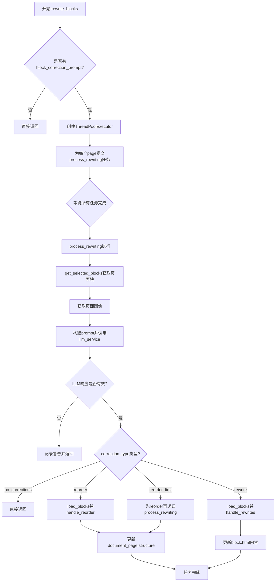
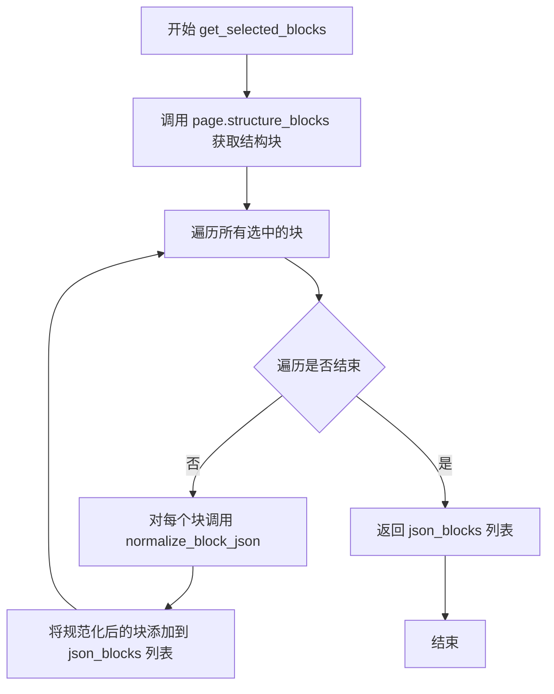
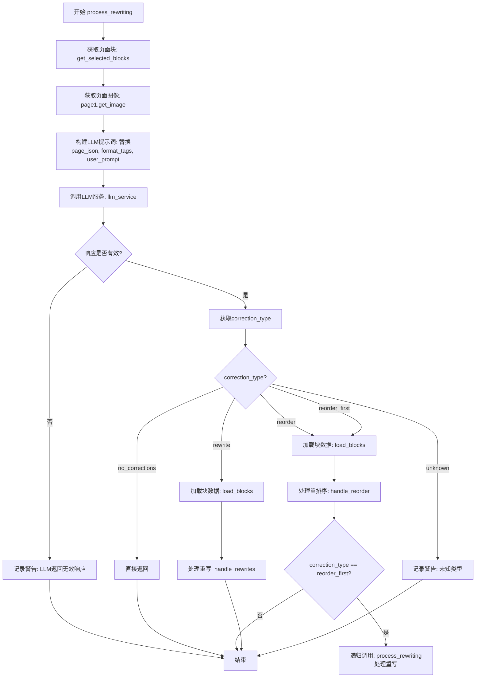
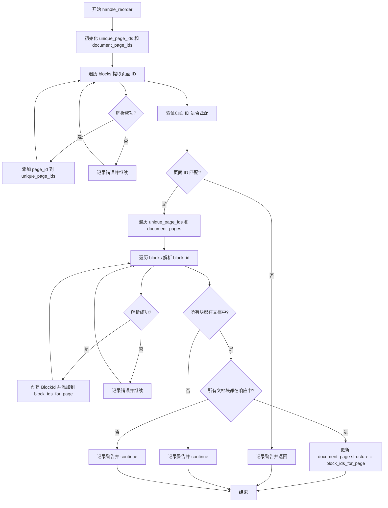
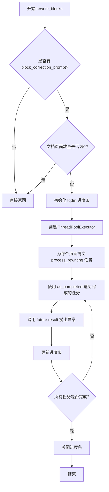

# `marker\marker\processors\llm\llm_page_correction.py` 详细设计文档

这是一个基于LLM的PDF页面内容校正处理器，通过调用大型语言模型对PDF页面中的块（blocks）进行重新排序、类型更正和HTML内容重写，以纠正PDF解析过程中可能出现的顺序错误、类型误判和内容错误。

## 整体流程



## 类结构

```
BaseLLMComplexBlockProcessor (基类)
└── LLMPageCorrectionProcessor
    ├── BlockSchema (Pydantic模型)
    └── PageSchema (Pydantic模型)
```

## 全局变量及字段


### `logger`
    
日志记录器实例，用于记录调试和警告信息

类型：`logging.Logger`
    


### `FORMAT_TAGS`
    
支持的HTML格式标签列表，包括b、i、u、del、math、sub、sup、a、code、p、img等标签

类型：`List[str]`
    


### `BLOCK_MAP`
    
块类型到HTML标签的映射字典，用于定义不同块类型对应的HTML标签集合

类型：`Dict[str, List[str]]`
    


### `ALL_TAGS`
    
所有支持的HTML标签集合，由FORMAT_TAGS和BLOCK_MAP中的所有标签去重合并而成

类型：`List[str]`
    


### `LLMPageCorrectionProcessor.block_correction_prompt`
    
用户提供的块校正提示，用于指导LLM进行页面块内容的校正和重写

类型：`Annotated[str, str]`
    


### `LLMPageCorrectionProcessor.default_user_prompt`
    
默认用户提示文本，作为块校正的通用指导原则，强调保持文本原始含义的同时进行格式化

类型：`str`
    


### `LLMPageCorrectionProcessor.page_prompt`
    
完整的页面校正提示模板，包含LLM进行页面块分析、排序和重写的详细指令和示例

类型：`str`
    


### `BlockSchema.id`
    
块的唯一标识符，遵循/page/{page_id}/{block_type}/{block_id}的格式规范

类型：`str`
    


### `BlockSchema.html`
    
块的HTML内容，表示该块在文档中呈现的HTML标记语言内容

类型：`str`
    


### `BlockSchema.block_type`
    
块的类型，标识块的种类如Text、SectionHeader、Table、Figure等

类型：`str`
    


### `PageSchema.analysis`
    
LLM的分析结果，描述对页面块结构和内容问题的分析说明

类型：`str`
    


### `PageSchema.correction_type`
    
校正类型，指示需要进行的校正操作类型如no_corrections、reorder、rewrite、reorder_first

类型：`str`
    


### `PageSchema.blocks`
    
块列表，包含页面中所有需要处理的块的schema定义列表

类型：`List[BlockSchema]`
    
    

## 全局函数及方法


### `LLMPageCorrectionProcessor.get_selected_blocks`

该方法从页面中获取需要校正的块结构，并将其规范化转换为 JSON 格式返回，供后续的 LLM 校正处理使用。

参数：

- `self`：`LLMPageCorrectionProcessor`，当前类的实例
- `document`：`Document`，文档对象，包含完整文档的数据和块信息
- `page`：`PageGroup`，页面组对象，表示当前需要处理的页面

返回值：`List[dict]`，返回规范化后的块 JSON 列表，每个元素包含块的 ID、类型、HTML 等信息

#### 流程图



#### 带注释源码

```python
def get_selected_blocks(
    self,
    document: Document,
    page: PageGroup,
) -> List[dict]:
    """
    获取页面中需要校正的块，并将其规范化为 JSON 格式
    
    参数:
        document: Document 对象，包含完整文档数据
        page: PageGroup 对象，表示当前处理的页面
    
    返回:
        List[dict]: 规范化后的块 JSON 列表
    """
    # 调用 page 的 structure_blocks 方法获取当前页面的结构块
    # 这些块是需要进行校正处理的候选块
    selected_blocks = page.structure_blocks(document)
    
    # 遍历所有选中的块，对每个块调用 normalize_block_json 进行格式化
    # normalize_block_json 会将块对象转换为包含 id、block_type、html 等信息的字典
    json_blocks = [
        self.normalize_block_json(block, document, page)
        for i, block in enumerate(selected_blocks)
    ]
    
    # 返回规范化的 JSON 块列表，供后续 process_rewriting 使用
    return json_blocks
```


### `LLMPageCorrectionProcessor.process_rewriting`

处理单个页面的重写逻辑，通过调用LLM服务对页面块进行重新排序或重写，以纠正PDF页面中的结构问题和内容错误。

参数：

- `self`：当前类实例
- `document`：`Document`，完整的文档对象，包含所有页面和块的信息
- `page1`：`PageGroup`，需要处理重写的目标页面组

返回值：`None`，该方法直接修改文档状态，不返回任何值

#### 流程图



#### 带注释源码

```python
def process_rewriting(self, document: Document, page1: PageGroup):
    """
    处理单个页面的重写逻辑
    
    该方法执行以下步骤：
    1. 获取页面中的所有结构块
    2. 获取页面对应的图像
    3. 构建包含页面块信息的LLM提示词
    4. 调用LLM服务进行分析和纠正
    5. 根据LLM返回的纠正类型执行相应操作
    
    Args:
        document: 完整的文档对象，包含所有页面和块
        page1: 需要处理的页面组对象
    
    Returns:
        None: 直接修改document对象中的块内容
    """
    
    # 第一步：获取页面的结构块列表
    # get_selected_blocks 方法将页面块转换为JSON格式
    page_blocks = self.get_selected_blocks(document, page1)
    
    # 第二步：获取页面的图像用于LLM分析
    # highres=False 表示使用低分辨率图像以提高性能
    image = page1.get_image(document, highres=False)

    # 第三步：构建LLM提示词
    # 替换模板中的占位符：
    # - {{page_json}}: 页面的JSON块表示
    # - {{format_tags}}: 允许使用的HTML标签列表
    # - {{user_prompt}}: 用户自定义的纠正提示
    prompt = (
        self.page_prompt.replace("{{page_json}}", json.dumps(page_blocks))
        .replace("{{format_tags}}", json.dumps(ALL_TAGS))
        .replace("{{user_prompt}}", self.block_correction_prompt)
    )
    
    # 第四步：调用LLM服务获取纠正建议
    # 传入提示词、图像、页面和响应模式(PageSchema)
    response = self.llm_service(prompt, image, page1, PageSchema)
    logger.debug(f"Got reponse from LLM: {response}")

    # 第五步：验证响应有效性
    if not response or "correction_type" not in response:
        logger.warning("LLM did not return a valid response")
        return

    # 第六步：根据纠正类型执行相应操作
    correction_type = response["correction_type"]
    
    # 无需纠正的情况
    if correction_type == "no_corrections":
        return
    
    # 需要重排序的情况（包括需要先重排序再重写的情况）
    elif correction_type in ["reorder", "reorder_first"]:
        # 确保blocks字段是列表格式（可能是JSON字符串）
        self.load_blocks(response)
        # 执行块的重排序操作
        self.handle_reorder(response["blocks"], page1)

        # 如果需要先重排序再重写，则递归调用自身处理重写
        # 这里实现了分步处理：先排序，排序完成后再重写
        if correction_type == "reorder_first":
            self.process_rewriting(document, page1)
    
    # 需要重写块内容的情况
    elif correction_type == "rewrite":
        # 确保blocks字段是列表格式
        self.load_blocks(response)
        # 执行块内容的重写
        self.handle_rewrites(response["blocks"], document)
    
    # 未知纠正类型的错误处理
    else:
        logger.warning(f"Unknown correction type: {correction_type}")
        return
```


### `LLMPageCorrectionProcessor.load_blocks`

该方法用于加载并解析LLM返回的块数据。如果LLM响应的`blocks`字段是JSON字符串格式，则将其解析为Python列表对象，以便后续处理流程使用。

参数：

- `response`：`dict`，LLM返回的响应字典，包含`blocks`字段，blocks可以是JSON字符串或已解析的列表

返回值：`None`，无返回值（直接修改传入的response字典）

#### 流程图

```mermaid
flowchart TD
    A[开始 load_blocks] --> B{response["blocks"] 是否为字符串?}
    B -->|是| C[使用 json.loads 解析 blocks]
    C --> D[将解析后的列表赋值回 response["blocks"]]
    B -->|否| E[blocks 已是列表, 无需处理]
    D --> F[结束]
    E --> F
```

#### 带注释源码

```python
def load_blocks(self, response):
    """
    加载并解析LLM返回的块数据。
    
    如果LLM返回的blocks字段是JSON字符串格式，
    则将其解析为Python列表对象，以便后续处理。
    
    参数:
        response: LLM返回的响应字典，包含blocks字段
    """
    # 检查response中的blocks字段是否为字符串类型
    if isinstance(response["blocks"], str):
        # 如果是字符串（JSON格式），则使用json.loads解析为Python列表
        response["blocks"] = json.loads(response["blocks"])
```


### `LLMPageCorrectionProcessor.handle_reorder`

该方法负责根据 LLM 返回的块重新排序结果，调整文档页面中块的顺序。它首先验证响应中的页面 ID 与文档页面匹配，然后解析块 ID 并更新文档页面的结构（structure），确保块按照 LLM 确定的正确阅读顺序排列。

参数：

- `blocks`：`list`，LLM 返回的需要重新排序的块列表，每个块包含 id、block_type 和 html 信息
- `page1`：`PageGroup`，当前正在处理的页面组对象，包含页面结构和块信息

返回值：`None`，该方法直接修改 `page1` 的 `structure` 属性来实现块的重新排序，不返回任何值

#### 流程图



#### 带注释源码

```python
def handle_reorder(self, blocks: list, page1: PageGroup):
    """
    根据 LLM 返回的块顺序重新排序文档页面中的块
    
    参数:
        blocks: LLM 返回的重新排序后的块列表
        page1: 需要重新排序的页面组对象
    """
    # 用于存储响应中所有唯一的页面 ID
    unique_page_ids = set()
    # 文档中当前页面的 ID 列表
    document_page_ids = [str(page1.page_id)]
    # 文档中当前页面对象列表
    document_pages = [page1]

    # 第一步：遍历所有块，提取并收集页面 ID
    for block_data in blocks:
        try:
            # 从块 ID 中解析页面 ID，格式如 "/page/0/Text/1"
            page_id, _, _ = block_data["id"].split("/")
            unique_page_ids.add(page_id)
        except Exception as e:
            logger.debug(f"Error parsing block ID {block_data['id']}: {e}")
            continue

    # 第二步：验证响应中的页面 ID 是否与文档页面匹配
    if set(document_page_ids) != unique_page_ids:
        logger.debug(
            "Some page IDs in the response do not match the document's pages"
        )
        return

    # 第三步：遍历每个页面，处理块的重新排序
    for page_id, document_page in zip(unique_page_ids, document_pages):
        # 用于存储当前页面的块 ID 列表
        block_ids_for_page = []
        
        # 遍历所有块，解析当前页面的块 ID
        for block_data in blocks:
            try:
                # 解析块 ID，格式如 "/page/0/Text/1"
                page_id, block_type, block_id = block_data["id"].split("/")
                
                # 创建 BlockId 对象
                block_id = BlockId(
                    page_id=page_id,
                    block_id=block_id,
                    block_type=getattr(BlockTypes, block_type),
                )
                block_ids_for_page.append(block_id)
            except Exception as e:
                logger.debug(f"Error parsing block ID {block_data['id']}: {e}")
                continue

            # 第四步：验证所有块都存在于文档页面中
            # Both sides should have the same values, just be reordered
            if not all(
                [
                    block_id in document_page.structure
                    for block_id in block_ids_for_page
                ]
            ):
                logger.debug(
                    f"Some blocks for page {page_id} not found in document"
                )
                continue

            # 第五步：验证所有文档块都存在于响应中
            if not all(
                [
                    block_id in block_ids_for_page
                    for block_id in document_page.structure
                ]
            ):
                logger.debug(
                    f"Some blocks in document page {page_id} not found in response"
                )
                continue

            # 第六步：更新文档页面的结构，实现块的重新排序
            # Swap the order of blocks in the document page
            document_page.structure = block_ids_for_page
```


### `LLMPageCorrectionProcessor.handle_rewrites`

该方法接收LLM返回的重写块列表，解析每个块的ID信息，从文档中定位对应的块对象，并将其HTML内容更新为LLM生成的新内容。

参数：

- `blocks`：`list`，LLM返回的待重写块列表，每个元素包含 `id` 和 `html` 字段
- `document`：`Document`，文档对象，用于通过 `get_block` 方法获取并更新块内容

返回值：`None`，该方法直接修改 `document` 中块对象的 `html` 属性，无返回值

#### 流程图

```mermaid
flowchart TD
    A[开始 handle_rewrites] --> B{遍历 blocks 列表}
    B -->|还有块未处理| C[获取当前块数据 block_data]
    C --> D[提取 block_id: 去除前后斜杠]
    D --> E[按 '/' 分割 block_id: 提取 page_id, block_type, block_id]
    E --> F[创建 BlockId 对象]
    F --> G[document.get_block 获取对应块]
    G --> H{块是否存在?}
    H -->|否| I[记录日志并跳过]
    H -->|是| J{块是否有 html 属性?}
    J -->|否| K[跳过]
    J -->|是| L[更新 block.html 为 block_data['html']]
    L --> B
    B -->|遍历完成| M[结束]
    
    C --> N[异常处理: 记录日志并跳过]
    N --> B
```

#### 带注释源码

```python
def handle_rewrites(self, blocks: list, document: Document):
    """
    处理块的HTML重写
    
    参数:
        blocks: list - LLM返回的重写块列表，每个元素包含 'id' 和 'html' 字段
        document: Document - 文档对象，用于定位和更新块
    
    返回:
        None - 直接修改document中块的html属性
    """
    # 遍历LLM返回的所有待重写块
    for block_data in blocks:
        try:
            # 1. 提取并清理block_id：去除前后空白和前导斜杠
            # 例如: "/page/0/Text/1" -> "page/0/Text/1" -> "page/0/Text/1"
            block_id = block_data["id"].strip().lstrip("/")
            
            # 2. 分割block_id获取各组件：格式为 "page/page_id/block_type/block_id"
            # 使用_忽略第一部分（通常是"page"关键字）
            _, page_id, block_type, block_id = block_id.split("/")
            
            # 3. 创建BlockId对象，用于唯一标识文档中的块
            block_id = BlockId(
                page_id=page_id,               # 页面ID
                block_id=block_id,             # 块ID
                block_type=getattr(BlockTypes, block_type),  # 块类型枚举
            )
            
            # 4. 从文档中获取对应的块对象
            block = document.get_block(block_id)
            
            # 5. 检查块是否存在
            if not block:
                logger.debug(f"Block {block_id} not found in document")
                continue  # 块不存在则跳过
            
            # 6. 检查块是否有html属性（有的是纯文本块等）
            if hasattr(block, "html"):
                # 7. 更新块的HTML内容为LLM生成的新内容
                block.html = block_data["html"]
                
        except Exception as e:
            # 异常处理：解析失败时记录日志并继续处理下一个块
            logger.debug(f"Error parsing block ID {block_data['id']}: {e}")
            continue
```


### `LLMPageCorrectionProcessor.rewrite_blocks`

该方法协调所有页面的块重写流程，遍历文档中的所有页面，为每个页面分配重写任务到线程池并发执行，并使用进度条显示处理进度。

参数：

- `document`：`Document`，需要重写块的文档对象

返回值：`None`，该方法直接修改文档中的块内容，不返回任何值

#### 流程图



#### 带注释源码

```python
def rewrite_blocks(self, document: Document):
    """
    协调所有页面的块重写流程
    
    遍历文档中的所有页面，为每个页面分配重写任务到线程池并发执行，
    并使用进度条显示处理进度。
    """
    # 检查是否存在块校正提示词，如果没有则直接返回，不进行任何处理
    if not self.block_correction_prompt:
        return

    # 获取文档中的页面总数
    total_blocks = len(document.pages)
    # 如果文档没有任何页面，则直接返回，避免无效处理
    if total_blocks == 0:
        return

    # 初始化 tqdm 进度条，显示处理进度
    # total 设置为 max(1, total_blocks - 1)，至少显示1个进度单位
    # disable 控制是否禁用进度条（根据 self.disable_tqdm 设置）
    pbar = tqdm(
        total=max(1, total_blocks - 1),
        desc=f"{self.__class__.__name__} running",
        disable=self.disable_tqdm,
    )

    # 使用线程池执行器进行并发处理
    # max_workers 控制最大并发线程数
    with ThreadPoolExecutor(max_workers=self.max_concurrency) as executor:
        # 遍历文档中的所有页面，为每个页面提交一个重写任务
        # 使用 as_completed 可以按任务完成顺序获取结果
        for future in as_completed(
            [
                executor.submit(self.process_rewriting, document, page)
                for page in document.pages
            ]
        ):
            # 调用 result() 会抛出任务中发生的任何异常
            future.result()  # Raise exceptions if any occurred
            # 每完成一个任务，更新进度条
            pbar.update(1)

    # 关闭进度条，释放资源
    pbar.close()
```

## 关键组件


### LLMPageCorrectionProcessor

PDF页面块纠正处理器，继承自BaseLLMComplexBlockProcessor，通过LLM服务分析PDF页面的结构块，根据用户提示重新排序或重写块内容，支持Text、Table、ListGroup、SectionHeader等多种块类型的校正。

### FORMAT_TAGS

支持的HTML格式化标签列表，包含b、i、u、del、math、sub、sup、a、code、p、img等标签，用于LLM生成合法HTML内容。

### BLOCK_MAP

块类型到HTML标签的映射字典，定义每种块类型对应的合法HTML标签，如Table对应table/tbody/tr/td/th，ListGroup对应ul/li，Form对应form/input/select/textarea等。

### get_selected_blocks方法

获取页面的结构块并转换为JSON格式，供LLM分析使用。参数document: Document为文档对象，page: PageGroup为页面组，返回List[dict]包含规范化后的块信息列表。

### process_rewriting方法

处理单页块重写的主逻辑方法。参数document: Document和page1: PageGroup，调用LLM服务获取校正响应，根据correction_type执行重排序或重写操作，若为reorder_first则递归处理。

### handle_reorder方法

处理块的阅读顺序重新排序。参数blocks: list和page1: PageGroup，解析块ID并验证页面ID匹配性，交换document_page.structure中的块顺序。

### handle_rewrites方法

处理块内容的重写。参数blocks: list和document: Document，解析块ID并更新对应块的html属性，实现内容的原地修改。

### rewrite_blocks方法

使用ThreadPoolExecutor并行处理所有页面的块校正。参数document: Document，内部使用tqdm显示处理进度，支持max_concurrency控制并发数。

### BlockSchema和PageSchema

Pydantic数据模型，用于验证LLM返回的JSON响应结构。BlockSchema包含id、html、block_type字段，PageSchema包含analysis、correction_type、blocks字段。

### block_correction_prompt属性

用户提示字符串属性，用于指导LLM进行块校正的具体规则和目标，默认值为default_user_prompt。

### page_prompt属性

LLM系统提示模板，包含详细的JSON块格式说明、支持的HTML标签约束、校正类型分类（reorder/rewrite/reorder_first）及输出格式规范。


## 问题及建议


### 已知问题

- **异常处理过于宽泛**：多处使用 `except Exception as e` 捕获所有异常，缺乏细粒度的异常类型处理，可能掩盖潜在的业务逻辑错误或配置问题
- **魔法字符串和魔法数字**：代码中多处使用硬编码字符串（如 `"no_corrections"`, `"reorder"`, `"rewrite"`）和数字，应提取为常量或枚举类以提高可维护性
- **进度条计算逻辑异常**：`total=max(1, total_blocks - 1)` 的计算逻辑不够清晰，当 `total_blocks` 为 0 时返回 1，为 1 时也返回 1，可能导致进度条显示不准确
- **ThreadPoolExecutor 异常处理不完善**：在 `rewrite_blocks` 方法中 `future.result()` 仅用于触发异常，若任务失败可能导致进度条更新但结果被静默忽略
- **响应验证不完整**：`process_rewriting` 方法仅检查 `correction_type` 字段是否存在，未验证 `blocks` 字段的类型和结构有效性
- **JSON 解析缺乏错误处理**：`load_blocks` 方法调用 `json.loads` 但未捕获 `json.JSONDecodeError`，可能导致程序崩溃

### 优化建议

- **提取常量定义**：将 `FORMAT_TAGS`、`BLOCK_MAP`、`ALL_TAGS` 以及各类修正类型字符串定义为类常量或枚举，提高代码可读性和可维护性
- **改进异常处理**：针对不同操作定义具体的异常类型，如 `BlockParseError`、`PageIdMismatchError` 等，便于问题定位和调试
- **完善响应验证**：在 `process_rewriting` 方法中添加响应结构的完整验证，使用 Pydantic 模型或显式字段检查确保返回数据的完整性
- **优化进度条逻辑**：重新评估 `total_blocks` 的计算方式，考虑使用 `total=max(0, total_blocks - 1)` 或根据实际处理需求调整
- **增加日志上下文**：在异常日志中添加更多上下文信息，如当前页面ID、块数量等，便于问题排查
- **考虑异步替代方案**：对于 I/O 密集型的 LLM 调用，可考虑使用 `asyncio` 替代 `ThreadPoolExecutor`，提高并发效率和资源利用率
- **添加重试机制**：对于 LLM 调用可能出现的临时性失败，可引入指数退避重试机制，提高系统鲁棒性

## 其它


### 设计目标与约束

该模块旨在通过大语言模型（LLM）自动纠正PDF页面中的内容块，包括重新排序、修改块类型和更新HTML内容。核心约束包括：仅使用预定义的格式标签（FORMAT_TAGS和BLOCK_MAP中的标签）、保持LaTeX公式在`<math>`标签内、bboxes归一化为0-1000范围、严格遵循用户提示词执行纠正操作。

### 错误处理与异常设计

代码采用分层异常处理机制：1）`process_rewriting`方法检测LLM响应有效性，无效响应时记录警告并返回；2）`load_blocks`方法处理JSON字符串解析；3）`handle_reorder`和`handle_rewrites`中使用try-except捕获块ID解析错误，记录debug日志并继续处理后续块；4）主方法`rewrite_blocks`通过`future.result()`重新抛出异常以中断执行。异常处理原则是"容错继续"而非"快速失败"，保证部分块处理失败不影响其他块。

### 数据流与状态机

数据流为：Document对象 → 获取PageGroup列表 → 对每页调用process_rewriting → 获取页面块结构和图像 → 组装prompt调用LLM服务 → 解析响应并根据correction_type分支处理 → 更新Document中的块顺序或HTML内容。状态机转换：初始状态 → LLM调用中 → 响应解析 → correction_type判断（no_corrections/reorder/reorder_first/rewrite） → 执行相应操作 → 结束。

### 外部依赖与接口契约

主要依赖：1）marker.logger.get_logger日志模块；2）marker.processors.llm.BaseLLMComplexBlockProcessor基类，需实现LLM服务调用；3）marker.schema相关模块（BlockTypes、BlockId、Document、PageGroup）；4）pydantic.BaseModel数据验证；5）concurrent.futures并发处理；6）tqdm进度条。接口契约：llm_service(prompt, image, page, schema)需返回符合PageSchema结构的字典；Document.get_block()需返回具有html属性的Block对象。

### 性能考虑与优化空间

使用ThreadPoolExecutor实现多页并发处理，默认max_concurrency控制并发数。使用tqdm显示进度，disable_tqdm可禁用。潜在优化：1）当前每页独立处理，可考虑跨页块的联合纠正；2）LLM调用是主要瓶颈，可增加请求缓存或批量处理；3）异常捕获粒度较粗，可区分可恢复和不可恢复错误；4）load_blocks中字符串解析可优化。

### 配置参数说明

block_correction_prompt：用户自定义纠正提示词，为None时跳过处理；max_concurrency：线程池最大 worker数，继承自基类；disable_tqdm：是否禁用进度条；page_prompt：LLM系统提示词模板，包含格式标签和示例；default_user_prompt：默认用户提示词。FORMAT_TAGS和BLOCK_MAP定义允许的HTML标签白名单。

### 安全性考虑

代码通过ALL_TAGS白名单限制可用HTML标签，防止注入不安全内容。块ID解析时使用strip/lstrip清理空格。LLM响应通过Pydantic模型验证结构。但缺少输入验证：page_blocks为空时仍会调用LLM；块数量为0时直接返回未做任何处理。建议增加更严格的输入校验。

### 使用示例与调用方式

```python
# 初始化处理器
processor = LLMPageCorrectionProcessor(
    block_correction_prompt="确保所有标题正确标记为SectionHeader",
    max_concurrency=4
)

# 处理文档
processor.rewrite_blocks(document)
```

### 测试策略建议

单元测试：1）测试get_selected_blocks返回正确的JSON结构；2）测试load_blocks处理字符串和字典两种输入；3）测试handle_reorder块ID解析；4）测试handle_rewrites HTML更新。集成测试：1）模拟LLM服务返回各种correction_type；2）测试多页并发处理；3）测试空文档和单页文档边界情况。Mock对象：Document、PageGroup、llm_service。

    