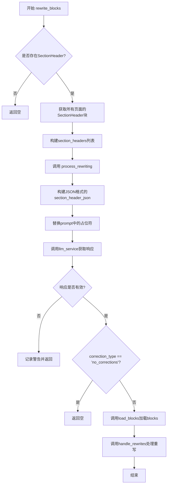
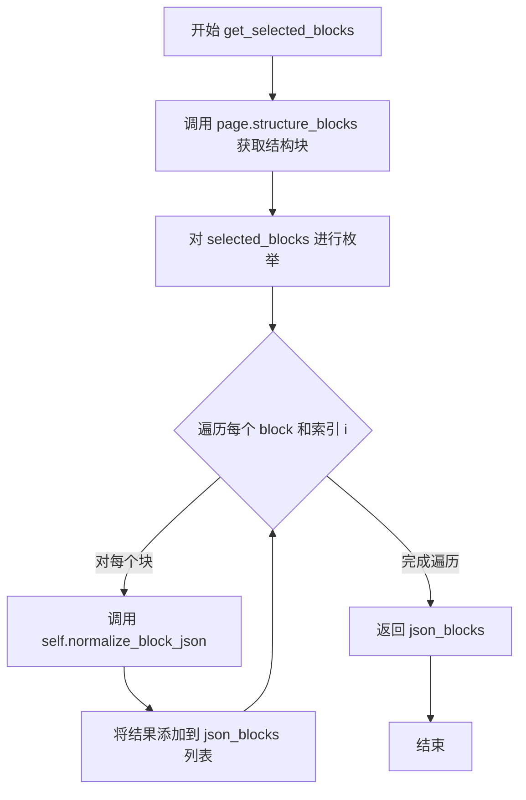
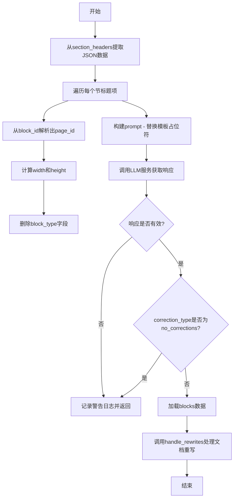
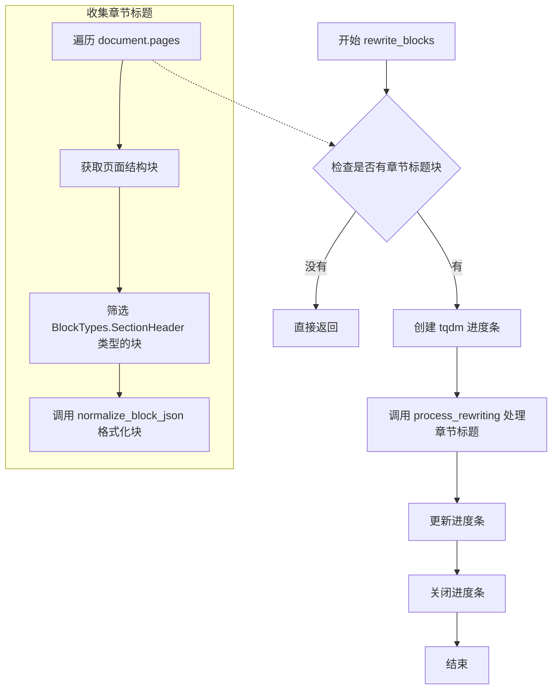

# `marker\marker\processors\llm\llm_sectionheader.py` 详细设计文档

该代码是一个PDF文档处理模块，用于使用LLM（大语言模型）分析和校正PDF文档中section header（章节标题）的层级（h1-h6）。它通过调用LLM服务来检查章节标题的HTML标签是否正确，并对不正确的标题进行修正。

## 整体流程



## 类结构

```
BaseLLMComplexBlockProcessor (基类)
└── LLMSectionHeaderProcessor (section header处理器)

BaseModel (Pydantic基类)
├── BlockSchema (块数据模型)
└── SectionHeaderSchema (section header响应模型)
```

## 全局变量及字段


### `logger`
    
日志记录器实例，通过marker.logger.get_logger获取

类型：`logging.Logger`
    


### `LLMSectionHeaderProcessor.page_prompt`
    
LLM提示词模板，包含JSON格式的section header信息和校正规则

类型：`str`
    


### `BlockSchema.id`
    
块的唯一标识符

类型：`str`
    


### `BlockSchema.html`
    
块的HTML内容

类型：`str`
    


### `SectionHeaderSchema.analysis`
    
LLM对section header的分析

类型：`str`
    


### `SectionHeaderSchema.correction_type`
    
校正类型，值为'no_corrections'或'corrections_needed'

类型：`str`
    


### `SectionHeaderSchema.blocks`
    
需要校正的块列表

类型：`List[BlockSchema]`
    
    

## 全局函数及方法


### `LLMSectionHeaderProcessor.get_selected_blocks`

该方法用于从指定的页面组中提取结构块，并将每个块标准化为JSON格式，以便后续进行LLM处理。它首先调用 `page.structure_blocks(document)` 获取页面中所有的结构块，然后通过列表推导式对每个块调用 `normalize_block_json` 方法进行格式转换。

参数：

- `document`：`Document`，文档对象，包含完整的文档内容和元数据
- `page`：`PageGroup`，页面组对象，代表需要提取结构块的特定页面

返回值：`List[dict]`，返回标准化后的JSON块列表，每个字典包含块的ID、HTML内容、边界框等信息

#### 流程图



#### 带注释源码

```python
def get_selected_blocks(
    self,
    document: Document,
    page: PageGroup,
) -> List[dict]:
    """
    从页面中获取结构块并转换为JSON格式
    
    参数:
        document: Document 对象，包含完整文档内容
        page: PageGroup 对象，表示要处理的页面
    
    返回:
        List[dict]: 包含标准化块信息的字典列表
    """
    # 获取页面中的所有结构块
    # structure_blocks 方法返回文档中该页面的所有结构化块
    selected_blocks = page.structure_blocks(document)
    
    # 对每个块调用 normalize_block_json 方法进行标准化处理
    # normalize_block_json 方法会将 Block 对象转换为包含 id、bbox、html 等信息的字典
    # i 参数表示块的索引，用于维持顺序或唯一标识
    json_blocks = [
        self.normalize_block_json(block, document, page, i)
        for i, block in enumerate(selected_blocks)
    ]
    
    # 返回转换后的JSON块列表
    return json_blocks
```


### `LLMSectionHeaderProcessor.process_rewriting`

该方法接收文档对象和节标题块列表，提取节标题的JSON数据并构建提示词，调用LLM服务分析节标题层级是否正确（h1-h6），并根据LLM返回的修正结果更新文档中错误的节标题。

参数：

- `document`：`Document`，PDF文档对象，包含文档的完整内容
- `section_headers`：`List[Tuple[Block, dict]]`，节标题块及其规范化JSON数据的元组列表

返回值：`None`，该方法直接修改文档对象中的节标题，不返回任何值

#### 流程图



#### 带注释源码

```python
def process_rewriting(
    self, document: Document, section_headers: List[Tuple[Block, dict]]
):
    """
    处理文档中节标题的重写/修正
    
    参数:
        document: Document对象，包含完整PDF文档内容
        section_headers: List[Tuple[Block, dict]]，包含(Block块, 规范化JSON)元组的列表
    
    返回:
        None: 直接修改document对象，不返回值
    """
    
    # 步骤1: 从section_headers元组列表中提取第二个元素(字典形式的JSON数据)
    section_header_json = [sh[1] for sh in section_headers]
    
    # 步骤2: 遍历每个节标题项，进行数据预处理
    for item in section_header_json:
        # 从block id中解析出page_id、block_type和block_id
        # id格式: "/page/0/SectionHeader/1" -> ["", "page", "0", "SectionHeader", "1"]
        _, _, page_id, block_type, block_id = item["id"].split("/")
        
        # 将page_id添加到item字典中
        item["page"] = page_id
        
        # 根据归一化的bbox计算width和height
        # bbox格式: [x1, y1, x2, y2]，已归一化到0-1000
        item["width"] = item["bbox"][2] - item["bbox"][0]
        item["height"] = item["bbox"][3] - item["bbox"][1]
        
        # 删除block_type字段，因为所有输入都是SectionHeader类型
        del item["block_type"]

    # 步骤3: 构建prompt，将JSON数据填入模板
    prompt = self.page_prompt.replace(
        "{{section_header_json}}", json.dumps(section_header_json)
    )
    
    # 步骤4: 调用LLM服务，传入prompt、None和文档首页
    response = self.llm_service(
        prompt, None, document.pages[0], SectionHeaderSchema
    )
    logger.debug(f"Got section header reponse from LLM: {response}")

    # 步骤5: 验证响应有效性
    if not response or "correction_type" not in response:
        logger.warning("LLM did not return a valid response")
        return

    # 步骤6: 检查修正类型
    correction_type = response["correction_type"]
    if correction_type == "no_corrections":
        # 无需修正，直接返回
        return

    # 步骤7: 加载blocks数据（处理字符串形式的JSON）
    self.load_blocks(response)
    
    # 步骤8: 执行实际的重写操作，更新文档中的节标题
    self.handle_rewrites(response["blocks"], document)
```


### `LLMSectionHeaderProcessor.load_blocks`

该方法负责解析 LLM 返回的响应中的 `blocks` 字段。如果 LLM 返回的 blocks 是 JSON 字符串格式，则将其解析为 Python 字典；否则保持原样。该方法是处理流程中的关键一步，确保后续的块重写操作能够正确处理数据结构。

参数：

-  `response`：`dict`，LLM 服务返回的响应字典，包含 `blocks` 字段，该字段可能是一个 JSON 字符串或已解析的列表

返回值：`None`，该方法不返回值，直接修改传入的 `response` 字典

#### 流程图

```mermaid
flowchart TD
    A([开始 load_blocks]) --> B{response["blocks"] 是否为字符串?}
    B -->|是| C[使用 json.loads 解析字符串为字典]
    C --> D([结束])
    B -->|否| D
```

#### 带注释源码

```python
def load_blocks(self, response):
    """
    加载并解析 LLM 响应中的 blocks 字段。
    
    如果 LLM 返回的 blocks 是字符串格式（JSON），则将其解析为 Python 字典。
    这确保了后续处理步骤可以一致地访问 blocks 数据。
    
    参数:
        response: LLM 服务返回的响应字典，包含 'blocks' 键
    """
    # 检查 blocks 字段是否为字符串类型
    # LLM 可能返回 JSON 字符串形式的 blocks，需要解析
    if isinstance(response["blocks"], str):
        # 将 JSON 字符串解析为 Python 字典/列表
        response["blocks"] = json.loads(response["blocks"])
```


### `LLMSectionHeaderProcessor.rewrite_blocks`

该方法用于处理文档中的_section header（章节标题）_块。它首先收集文档中所有页面中的章节标题块，然后使用LLM服务来校正这些标题的HTML标签级别（如h1到h6），确保章节结构层次正确。

参数：

- `document`：`Document`，待处理的文档对象，包含所有页面和块信息

返回值：`None`，该方法直接修改文档中的章节标题块，无返回值

#### 流程图



#### 带注释源码

```python
def rewrite_blocks(self, document: Document):
    # 收集文档中所有的章节标题块
    # 遍历所有页面，获取结构块，并筛选出SectionHeader类型的块
    # 使用列表推导式同时保存原始block和格式化后的JSON数据
    section_headers = [
        (block, self.normalize_block_json(block, document, page))
        for page in document.pages
        for block in page.structure_blocks(document)
        if block.block_type == BlockTypes.SectionHeader
    ]
    
    # 如果没有章节标题需要处理，直接返回，避免不必要的LLM调用
    if len(section_headers) == 0:
        return

    # 创建进度条，total=1表示整个处理过程作为单个任务
    # desc使用类名标识当前正在运行的处理器
    pbar = tqdm(
        total=1,
        desc=f"Running {self.__class__.__name__}",
        disable=self.disable_tqdm,  # 可选的禁用进度条参数
    )

    # 调用process_rewriting方法，将章节标题列表传递给LLM处理
    # 该方法会构建prompt、调用LLM服务、解析响应并更新文档中的标题块
    self.process_rewriting(document, section_headers)
    
    # 更新进度条至完成状态
    pbar.update(1)
    # 关闭进度条，释放资源
    pbar.close()
```

## 关键组件


### LLMSectionHeaderProcessor

核心处理器类，继承自BaseLLMComplexBlockProcessor，负责使用LLM纠正PDF文档中section header的层级标签（h1-h6）。

### page_prompt

LLM提示词模板，包含详细的指令和示例，用于指导LLM分析并纠正section header的层级。

### BlockSchema

Pydantic数据模型，定义section header块的JSON结构，包含id和html字段。

### SectionHeaderSchema

Pydantic响应模型，定义LLM返回的响应结构，包含analysis、correction_type和blocks字段。

### get_selected_blocks

获取页面中所有结构块的JSON表示，用于准备发送给LLM的数据。

### process_rewriting

核心处理方法，调用LLM服务纠正section header层级，并处理LLM返回的响应。

### rewrite_blocks

主入口方法，收集所有页面的section header块，调用process_rewriting进行处理。

### load_blocks

辅助方法，将字符串格式的blocks字段解析为JSON对象。

### normalize_block_json

将Block对象转换为标准JSON格式，包含bbox、page、id、html等信息。

### BlockTypes.SectionHeader

枚举类型，用于识别section header块类型。

### BaseLLMComplexBlockProcessor

基类，提供LLM处理器的基础功能，包括llm_service调用和块重写机制。

### Document

文档对象，包含所有页面信息。

### PageGroup

页面组对象，代表单个页面的结构。

### Block

块对象，代表文档中的内容块（如文本、标题等）。


## 问题及建议


### 已知问题

-   **硬编码的大型提示模板**：`page_prompt`是一个超过80行的大型字符串，直接定义在类内部，难以维护、测试和本地化，违反了单一职责原则。
-   **资源管理不当**：`rewrite_blocks`方法中手动创建tqdm进度条并手动调用`close()`，没有使用`with`语句确保资源释放，如果中间发生异常，进度条可能不会被正确关闭。
-   **脆弱的字符串解析**：`process_rewriting`方法中使用`item["id"].split("/")`来解析页面ID和块类型，依赖特定的ID格式约定，如果ID格式改变代码会崩溃，缺乏健壮性。
-   **重复代码逻辑**：`get_selected_blocks`和`rewrite_blocks`方法中都有获取section headers的逻辑，存在代码重复，可以提取为公共方法。
-   **不完整的类型注解**：`normalize_block_json`方法调用缺少参数类型注解（如`page`参数），且`get_selected_blocks`方法返回类型注解为`List[dict]`不够精确。
-   **魔法数字**：`tqdm(total=1)`中的`1`是硬编码的魔法数字，没有常量定义，意图不明确。
-   **不安全的JSON解析**：`load_blocks`方法中的JSON解析没有异常处理，如果LLM返回的JSON格式不正确会直接抛出未捕获的异常。
-   **日志级别不一致**：使用`logger.debug`记录LLM响应，但使用`logger.warning`记录无效响应，日志级别使用不够严谨。

### 优化建议

-   将`page_prompt`移至独立的配置文件或使用专门的提示管理类，实现提示模板与业务逻辑的解耦。
-   使用`with`语句管理tqdm进度条，或使用上下文管理器模式确保资源正确释放。
-   使用正则表达式或更结构化的ID解析方式，或在数据进入该类之前进行验证，避免脆弱的字符串解析。
-   将获取section headers的逻辑提取为基类方法或工具函数，消除重复代码。
-   完善所有方法和函数的类型注解，使用`Optional`类型并添加返回类型说明。
-   定义常量或配置类来管理tqdm的`total`参数值，提高代码可读性。
-   在`load_blocks`和JSON解析处添加`try-except`异常处理，提供更友好的错误信息。
-   统一日志记录策略，考虑在开发环境和生产环境使用不同的日志级别配置。

## 其它


### 设计目标与约束

设计目标是通过LLM模型自动识别并校正PDF文档中章节标题的HTML标签层级（h1至h6），确保文档结构层次清晰正确。约束条件包括：仅处理BlockTypes为SectionHeader的块；仅修改h1-h6标签，不改变其他内容；每个输出块必须且仅包含一个层级标签；处理无章节标题时直接返回不进行LLM调用。

### 错误处理与异常设计

当LLM服务返回无效响应（无response或缺少correction_type字段）时，记录warning日志并直接返回，不进行后续处理。当LLM返回的blocks字段为字符串类型时，调用json.loads进行解析转换。异常处理采用防御性编程，对关键字段进行存在性检查，避免KeyError异常。

### 数据流与状态机

数据流如下：1）rewrite_blocks方法遍历所有页面获取SectionHeader类型块；2）对每个块调用normalize_block_json转换为标准化JSON格式；3）将转换后的JSON填充到page_prompt模板中；4）调用llm_service获取LLM修正结果；5）根据correction_type决定是否执行块重写；6）调用handle_rewrites应用修正结果到文档。状态机包含两种状态：no_corrections状态（直接返回）和corrections_needed状态（执行块重写）。

### 外部依赖与接口契约

主要依赖包括：marker.logger模块的get_logger用于日志记录；marker.processors.llm模块的BaseLLMComplexBlockProcessor基类；marker.schema模块的BlockTypes枚举和Document、PageGroup、Block等数据类；pydantic的BaseModel用于数据验证。接口契约要求llm_service返回包含correction_type和blocks字段的字典，其中blocks为List[BlockSchema]类型或JSON字符串。

### 性能考虑

当文档中不存在SectionHeader块时，直接返回不调用LLM服务，避免不必要的API开销。使用tqdm显示处理进度，但当无块需要处理时禁用进度条显示。块JSON转换采用列表推导式进行批量处理，提高效率。

### 安全性考虑

LLM提示词模板中仅传输章节标题的元数据（bbox、page、id、html），不包含文档实际内容文本，降低敏感信息泄露风险。JSON解析采用防御性检查，防止恶意构造的响应导致解析异常。

### 测试策略

应针对以下场景编写单元测试：1）空章节标题列表的处理；2）LLM返回no_corrections时的行为；3）LLM返回有效修正结果时的块更新；4）blocks字段为字符串类型的JSON解析；5）无效LLM响应的错误处理。

### 配置与参数

disable_tqdm参数控制是否禁用tqdm进度条显示，默认为False显示进度。page_prompt模板中的{{section_header_json}}占位符用于动态注入章节标题JSON数据。

### 版本兼容性

依赖Python 3.x环境，需安装pydantic库用于数据模型验证，tqdm库用于进度条显示，marker项目内部模块需正确安装配置。


    