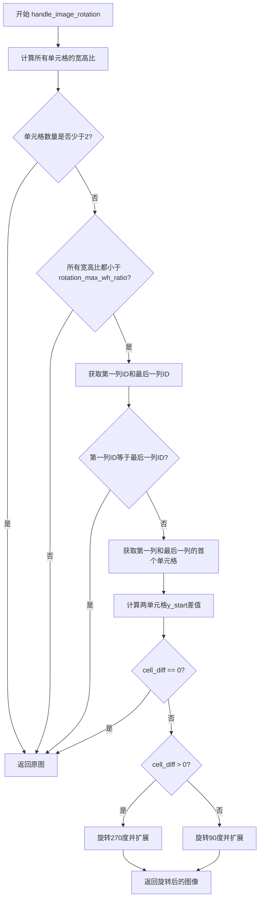
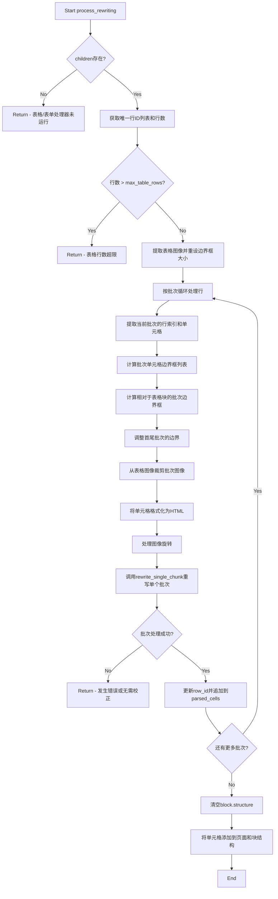
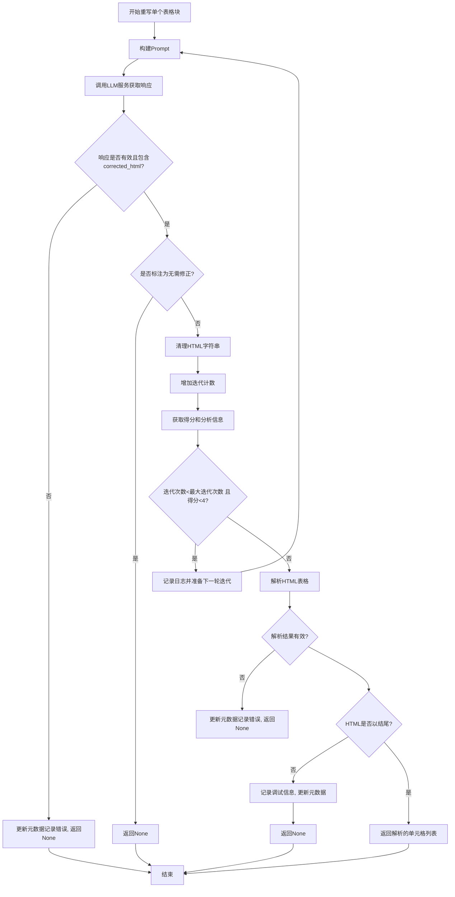
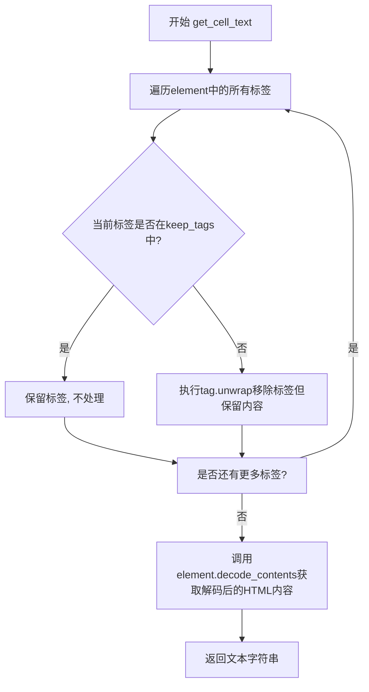
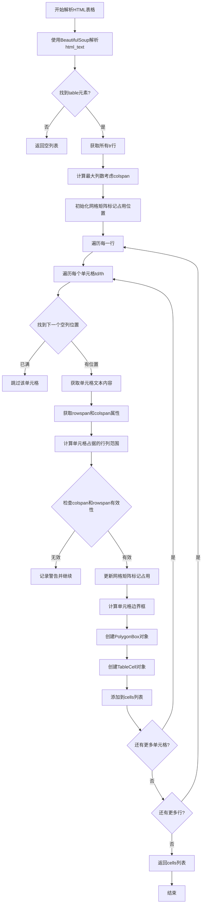

# `marker\marker\processors\llm\llm_table.py` 详细设计文档

该代码实现了一个基于LLM的表格处理器，用于从PDF或图像中提取表格内容并使用大型语言模型进行重写和纠正，以提高表格识别的准确性。处理器支持表格图像的旋转处理、分批处理大型表格、迭代重写以及HTML表格解析。

## 整体流程

```mermaid
graph TD
    A[开始处理表格块] --> B{表格有子单元格?}
    B -- 否 --> C[返回空]
    B -- 是 --> D{行数 > 最大行数?}
    D -- 是 --> E[跳过处理]
    D -- 否 --> F[提取表格图像]
    F --> G[分批处理行]
    G --> H[处理图像旋转]
    H --> I[调用LLM重写单个块]
    I --> J{LLM响应有效?}
    J -- 否 --> K[更新错误计数并返回]
    J -- 是 --> L{需要重写?}
    L -- 否 --> M[解析HTML表格]
    L -- 是 --> N{迭代次数<最大且分数<4?]
    N -- 是 --> O[继续迭代重写]
    N -- 否 --> M
    O --> I
    M --> P[返回解析的单元格]
    P --> Q[更新页面块结构]
```

## 类结构

```
BaseLLMComplexBlockProcessor (基类)
└── LLMTableProcessor (表格LLM处理器)
    └── TableSchema (Pydantic响应模型)
```

## 全局变量及字段


### `logger`
    
日志记录器实例，用于记录调试和运行信息

类型：`logging.Logger`
    


### `LLMTableProcessor.block_types`
    
要处理的块类型，包括表格和目录

类型：`Tuple[BlockTypes]`
    


### `LLMTableProcessor.max_rows_per_batch`
    
每批最大行数，超过则分块处理

类型：`int`
    


### `LLMTableProcessor.max_table_rows`
    
最大表行数，超过此行数将跳过处理

类型：`int`
    


### `LLMTableProcessor.table_image_expansion_ratio`
    
图像扩展比率，用于裁剪时扩展图像

类型：`float`
    


### `LLMTableProcessor.rotation_max_wh_ratio`
    
旋转判定宽高比阈值，小于此值认为表格已旋转

类型：`float`
    


### `LLMTableProcessor.max_table_iterations`
    
最大迭代次数，用于重写表格的最大尝试次数

类型：`int`
    


### `LLMTableProcessor.table_rewriting_prompt`
    
LLM重写提示词，用于纠正HTML表格中的错误

类型：`str`
    


### `TableSchema.comparison`
    
图片与HTML对比分析结果

类型：`str`
    


### `TableSchema.corrected_html`
    
纠正后的HTML表格内容

类型：`str`
    


### `TableSchema.analysis`
    
详细分析说明

类型：`str`
    


### `TableSchema.score`
    
纠正后HTML与原图的匹配分数，范围1-5

类型：`int`
    
    

## 全局函数及方法


### `LLMTableProcessor.handle_image_rotation`

该方法用于检测并处理表格图像的旋转问题。它通过分析表格单元格的宽高比来判断表格是否被旋转，并根据第一列和最后一列单元格的位置关系确定旋转角度，从而输出正确方向的图像供后续LLM处理。

参数：

- `children`：`List[TableCell]`，表格单元格列表，用于计算宽高比以判断是否旋转
- `image`：`Image.Image`，原始表格图像

返回值：`Image.Image`，处理后的图像（如果检测到旋转则返回旋转后的图像，否则返回原图）

#### 流程图



#### 带注释源码

```python
def handle_image_rotation(self, children: List[TableCell], image: Image.Image):
    """
    处理表格图像的旋转问题
    
    该方法通过分析表格单元格的宽高比来判断表格图像是否被旋转，
    并根据列的位置关系确定正确的旋转方向。
    
    Args:
        children: 表格单元格列表，用于计算宽高比
        image: 原始表格图像
    
    Returns:
        处理后的图像，如果检测到旋转则返回旋转后的图像，否则返回原图
    """
    # 步骤1: 计算所有子单元格的宽高比 (宽度/高度)
    ratios = [c.polygon.width / c.polygon.height for c in children]
    
    # 步骤2: 如果单元格数量少于2，无法有效判断旋转，直接返回原图
    if len(ratios) < 2:
        return image

    # 步骤3: 判断是否所有单元格的宽高比都小于阈值（0.6表示高度远大于宽度，可能是旋转后的表格）
    # 例如：正常表格单元格宽高比通常 > 1，旋转后的表格单元格宽高比 < 1
    is_rotated = all([r < self.rotation_max_wh_ratio for r in ratios])
    
    # 步骤4: 如果不是旋转状态，直接返回原图
    if not is_rotated:
        return image

    # 步骤5: 获取第一列的ID（列索引最小的列）
    first_col_id = min([c.col_id for c in children])
    # 获取第一列的所有单元格
    first_col = [c for c in children if c.col_id == first_col_id]
    # 获取第一列的第一个单元格（位置最靠上的）
    first_col_cell = first_col[0]

    # 步骤6: 获取最后一列的ID
    last_col_id = max([c.col_id for c in children])
    
    # 如果表格只有一列，无法判断旋转，直接返回原图
    if last_col_id == first_col_id:
        return image

    # 获取最后一列的第一个单元格
    last_col_cell = [c for c in children if c.col_id == last_col_id][0]
    
    # 步骤7: 计算第一列和最后一列单元格y_start位置的差值
    # 用于判断旋转方向：正差值表示需要逆时针旋转，负差值表示需要顺时针旋转
    cell_diff = first_col_cell.polygon.y_start - last_col_cell.polygon.y_start
    
    # 如果差值为0，说明位置相同，直接返回原图
    if cell_diff == 0:
        return image

    # 步骤8: 根据差值的正负决定旋转角度
    # cell_diff > 0: 第一列在最后一列下方，需要逆时针旋转270度（顺时针90度）
    # cell_diff < 0: 第一列在最后一列上方，需要顺时针旋转90度
    if cell_diff > 0:
        return image.rotate(270, expand=True)
    else:
        return image.rotate(90, expand=True)
```


### `LLMTableProcessor.process_rewriting`

表格重写主流程，该方法从文档中提取表格块中的单元格，按批次处理（以更好地处理大型表格），并使用LLM服务校正HTML表示中的任何错误。它处理图像旋转，将长表格分块处理以提高LLM准确性，并将校正后的单元格添加回页面。

参数：

- `document`：`Document`，包含要处理的表格的文档对象
- `page`：`PageGroup`，包含表格块的页面组
- `block`：`Table`，要重写的表格块

返回值：`None`，该方法就地处理表格，在多种情况下会提前返回（无返回值），成功时也不返回具体值

#### 流程图



#### 带注释源码

```python
def process_rewriting(self, document: Document, page: PageGroup, block: Table):
    # 从表格块中提取所有TableCell类型的子块
    children: List[TableCell] = block.contained_blocks(
        document, (BlockTypes.TableCell,)
    )
    # 如果没有子单元格，直接返回（表格/表单处理器可能未运行）
    if not children:
        return

    # 获取表格中的唯一行ID集合和行数
    # LLMs处理大量行的表格时效果较差
    unique_rows = set([cell.row_id for cell in children])
    row_count = len(unique_rows)
    row_idxs = sorted(list(unique_rows))

    # 如果行数超过最大限制，跳过处理
    if row_count > self.max_table_rows:
        return

    # 用于存储解析后的单元格
    parsed_cells = []
    # 用于跟踪行的偏移量（处理多批次时需要调整row_id）
    row_shift = 0
    
    # 提取表格图像
    block_image = self.extract_image(document, block)
    # 计算重缩放后的边界框
    block_rescaled_bbox = block.polygon.rescale(
        page.polygon.size, page.get_image(highres=True).size
    ).bbox
    
    # 分批处理行，每次处理max_rows_per_batch行
    for i in range(0, row_count, self.max_rows_per_batch):
        # 获取当前批次的行索引
        batch_row_idxs = row_idxs[i : i + self.max_rows_per_batch]
        # 获取属于当前批次的单元格
        batch_cells = [cell for cell in children if cell.row_id in batch_row_idxs]
        # 计算每个单元格的重缩放边界框
        batch_cell_bboxes = [
            cell.polygon.rescale(
                page.polygon.size, page.get_image(highres=True).size
            ).bbox
            for cell in batch_cells
        ]
        # 计算批次边界框（相对于表格块）
        batch_bbox = [
            min([bbox[0] for bbox in batch_cell_bboxes]) - block_rescaled_bbox[0],
            min([bbox[1] for bbox in batch_cell_bboxes]) - block_rescaled_bbox[1],
            max([bbox[2] for bbox in batch_cell_bboxes]) - block_rescaled_bbox[0],
            max([bbox[3] for bbox in batch_cell_bboxes]) - block_rescaled_bbox[1],
        ]
        
        # 确保第一个图像从起始位置开始
        if i == 0:
            batch_bbox[0] = 0
            batch_bbox[1] = 0
        # 确保最后一个图像覆盖整个高度和宽度
        elif i > row_count - self.max_rows_per_batch + 1:
            batch_bbox[2] = block_image.size[0]
            batch_bbox[3] = block_image.size[1]

        # 从表格图像裁剪批次图像
        batch_image = block_image.crop(batch_bbox)
        # 将单元格格式化为HTML
        block_html = block.format_cells(document, [], None, batch_cells)
        # 处理图像旋转
        batch_image = self.handle_image_rotation(batch_cells, batch_image)
        # 调用LLM重写单个批次
        batch_parsed_cells = self.rewrite_single_chunk(
            page, block, block_html, batch_cells, batch_image
        )
        
        # 如果处理失败或无需校正，返回
        if batch_parsed_cells is None:
            return

        # 调整row_id并追加到结果列表
        for cell in batch_parsed_cells:
            cell.row_id += row_shift
            parsed_cells.append(cell)
        # 更新行偏移量
        row_shift += max([cell.row_id for cell in batch_parsed_cells])

    # 清空块的现有结构
    block.structure = []
    # 将解析的单元格添加到页面和块结构
    for cell in parsed_cells:
        page.add_full_block(cell)
        block.add_structure(cell)
```


### `LLMTableProcessor.rewrite_single_chunk`

该方法负责使用LLM服务对表格的HTML表示进行单块重写，通过迭代方式纠正表格中的错误，直到达到足够高的匹配得分或达到最大迭代次数。

参数：

- `page`：`PageGroup`，页面组对象，包含页面的上下文信息
- `block`：`Block`，要重写的表格块对象
- `block_html`：`str`，表格的HTML表示字符串
- `children`：`List[TableCell]`，表格的单元格列表
- `image`：`Image.Image`，表格的图像表示
- `total_iterations`：`int`，当前迭代次数，默认为0

返回值：`List[TableCell]`，重写并解析后的表格单元格列表；如果发生错误或无需修正则返回`None`

#### 流程图



#### 带注释源码

```python
def rewrite_single_chunk(
    self,
    page: PageGroup,
    block: Block,
    block_html: str,
    children: List[TableCell],
    image: Image.Image,
    total_iterations: int = 0,
):
    # 1. 将表格HTML插入到重写提示模板中，生成完整的prompt
    prompt = self.table_rewriting_prompt.replace("{block_html}", block_html)

    # 2. 调用LLM服务，传入prompt、图像、块对象和期望的响应模式(TableSchema)
    response = self.llm_service(prompt, image, block, TableSchema)

    # 3. 检查响应是否有效且包含corrected_html字段
    if not response or "corrected_html" not in response:
        # 记录LLM错误计数到块的元数据中
        block.update_metadata(llm_error_count=1)
        return

    corrected_html = response["corrected_html"]

    # 4. 检查LLM是否表示无需修正(原始表格已经正确)
    if "no corrections needed" in corrected_html.lower():
        return

    # 5. 清理HTML字符串：去除首尾空白和markdown代码块标记
    corrected_html = corrected_html.strip().lstrip("```html").rstrip("```").strip()

    # 6. 增加迭代次数计数
    total_iterations += 1
    
    # 7. 从响应中提取得分和分析信息，用于判断是否需要继续迭代
    score = response.get("score", 5)
    analysis = response.get("analysis", "")
    logger.debug(f"Got table rewriting score {score} with analysis: {analysis}")
    
    # 8. 检查是否需要继续迭代：迭代次数未达上限 且 得分低于阈值(4分)
    if total_iterations < self.max_table_iterations and score < 4:
        logger.info(
            f"Table rewriting low score {score}, on iteration {total_iterations}"
        )
        # 使用修正后的HTML进行下一轮迭代
        block_html = corrected_html
        return self.rewrite_single_chunk(
            page, block, block_html, children, image, total_iterations
        )

    # 9. 解析修正后的HTML为表格单元格对象列表
    parsed_cells = self.parse_html_table(corrected_html, block, page)
    
    # 10. 验证解析结果：至少需要2个单元格才算有效表格
    if len(parsed_cells) <= 1:
        block.update_metadata(llm_error_count=1)
        logger.debug(f"Table parsing issue, only {len(parsed_cells)} cells found")
        return

    # 11. 最终验证：确保HTML以正确的table结束标签结尾
    if not corrected_html.endswith("</table>"):
        logger.debug(
            "Table parsing issue, corrected html does not end with </table>"
        )
        block.update_metadata(llm_error_count=1)
        return

    # 12. 返回解析后的单元格列表，供调用者使用
    return parsed_cells
```


### `LLMTableProcessor.get_cell_text`

该方法是一个静态工具方法，用于从HTML表格单元格元素中提取纯净的文本内容。它通过移除不需要的HTML标签（保留换行和格式标签）来获取单元格的实际文本，常用于表格解析过程中从HTML表示中提取文本数据。

参数：

- `element`：BeautifulSoup的元素对象，需要提取文本的HTML元素
- `keep_tags`：`Tuple[str, ...]`，需要保留的HTML标签列表，默认为 `("br", "i", "b", "span", "math")`，用于保留换行、粗体、斜体等格式标签

返回值：`str`，处理后的元素文本内容

#### 流程图



#### 带注释源码

```python
@staticmethod
def get_cell_text(element, keep_tags=("br", "i", "b", "span", "math")) -> str:
    """
    从HTML元素中提取文本，移除不需要的标签但保留内容
    
    参数:
        element: BeautifulSoup的元素对象
        keep_tags: 需要保留的标签元组，这些标签不会被移除
    
    返回:
        str: 处理后的文本内容
    """
    # 遍历元素中的所有标签（包括嵌套标签）
    for tag in element.find_all(True):
        # find_all(True)匹配所有标签
        # 检查当前标签名称是否在保留列表中
        if tag.name not in keep_tags:
            # 如果不在保留列表中，则解包标签
            # unwrap()移除标签本身但保留其内部内容
            # 例如: <div>text</div> -> text
            tag.unwrap()
    
    # decode_contents()返回元素的解码HTML内容
    # 保留<br>等需要保留的标签转换为换行符
    return element.decode_contents()
```


### `LLMTableProcessor.parse_html_table`

该方法负责将HTML表格内容解析为`TableCell`对象列表，通过BeautifulSoup解析HTML，计算网格结构，处理单元格的rowspan和colspan属性，最终生成带有位置信息的表格单元格对象。

参数：

- `html_text`：`str`，待解析的HTML表格文本
- `block`：`Block`，当前表格块对象，用于获取位置边界信息
- `page`：`PageGroup`，页面组对象，用于获取页面ID

返回值：`List[TableCell]`，解析后生成的表格单元格对象列表

#### 流程图



#### 带注释源码

```python
@staticmethod
def get_cell_text(element, keep_tags=("br", "i", "b", "span", "math")) -> str:
    """
    从HTML元素中提取文本内容，保留指定的标签
    参数:
        element: BeautifulSoup元素对象
        keep_tags: 需要保留的HTML标签元组
    返回:
        清理后的文本内容
    """
    # 遍历所有子标签，非保留标签则移除标签但保留内容
    for tag in element.find_all(True):
        if tag.name not in keep_tags:
            tag.unwrap()
    # 返回解码后的内部内容
    return element.decode_contents()

def parse_html_table(
    self, html_text: str, block: Block, page: PageGroup
) -> List[TableCell]:
    """
    将HTML表格解析为TableCell对象列表
    参数:
        html_text: HTML表格字符串
        block: 表格块对象，提供位置边界信息
        page: 页面组对象，提供页面ID
    返回:
        TableCell对象列表
    """
    # 使用html.parser解析HTML文本
    soup = BeautifulSoup(html_text, "html.parser")
    # 查找table元素
    table = soup.find("table")
    if not table:
        # 如果没有table标签，返回空列表
        return []

    # 获取所有tr行元素
    rows = table.find_all("tr")
    cells = []

    # 计算最大列数，考虑colspan属性
    max_cols = 0
    for row in rows:
        row_tds = row.find_all(["td", "th"])
        curr_cols = 0
        for cell in row_tds:
            # 获取colspan值，默认为1
            colspan = int(cell.get("colspan", 1))
            curr_cols += colspan
        if curr_cols > max_cols:
            max_cols = curr_cols

    # 初始化网格矩阵，True表示未被占用
    grid = [[True] * max_cols for _ in range(len(rows))]

    # 遍历每一行
    for i, row in enumerate(rows):
        cur_col = 0
        row_cells = row.find_all(["td", "th"])
        # 遍历当前行的每个单元格
        for j, cell in enumerate(row_cells):
            # 找到当前行下一个可用的列位置
            while cur_col < max_cols and not grid[i][cur_col]:
                cur_col += 1

            if cur_col >= max_cols:
                logger.info("Table parsing warning: too many columns found")
                break

            # 提取单元格文本内容
            cell_text = self.get_cell_text(cell).strip()
            # 获取rowspan和colspan，限制不超过表格范围
            rowspan = min(int(cell.get("rowspan", 1)), len(rows) - i)
            colspan = min(int(cell.get("colspan", 1)), max_cols - cur_col)
            
            # 计算单元格占据的行和列范围
            cell_rows = list(range(i, i + rowspan))
            cell_cols = list(range(cur_col, cur_col + colspan))

            # 检查colspan和rowspan有效性
            if colspan == 0 or rowspan == 0:
                logger.info("Table parsing issue: invalid colspan or rowspan")
                continue

            # 更新网格矩阵，标记被占用的位置
            for r in cell_rows:
                for c in cell_cols:
                    grid[r][c] = False

            # 计算单元格边界框，基于block的位置信息
            cell_bbox = [
                block.polygon.bbox[0] + cur_col,
                block.polygon.bbox[1] + i,
                block.polygon.bbox[0] + cur_col + colspan,
                block.polygon.bbox[1] + i + rowspan,
            ]
            # 从边界框创建PolygonBox对象
            cell_polygon = PolygonBox.from_bbox(cell_bbox)

            # 创建TableCell对象
            cell_obj = TableCell(
                text_lines=[cell_text],
                row_id=i,
                col_id=cur_col,
                rowspan=rowspan,
                colspan=colspan,
                is_header=cell.name == "th",
                polygon=cell_polygon,
                page_id=page.page_id,
            )
            cells.append(cell_obj)
            # 移动到下一个列位置
            cur_col += colspan

    return cells
```

## 关键组件


### LLM表格处理器

用于处理文档中表格的核心处理器，继承自BaseLLMComplexBlockProcessor，使用LLM纠正HTML表格表示中的错误，支持批量处理和迭代重写。

### 表格图像旋转检测与处理

检测并处理表格图像的旋转问题，通过分析首列和末列单元格的垂直位置差判断表格方向，必要时旋转图像以确保正确对齐。

### 表格批量重写流程

将长表格分块处理的主流程，每块最多处理60行，通过extract_image提取表格图像后分批调用LLM服务重写，最终合并所有批次的解析结果。

### 单块表格重写迭代

对单个表格块进行重写的核心逻辑，调用LLM服务获取纠正后的HTML，根据返回的得分（1-5分）决定是否需要迭代重写，最多迭代2次。

### HTML表格解析

将LLM返回的HTML表格文本解析为TableCell对象列表的模块，支持rowspan和colspan属性，正确构建表格网格结构。

### 表格模式定义

使用Pydantic定义的JSON响应模式，包含comparison比较、corrected_html纠正后的HTML、analysis分析文本和score得分四个字段。

### 表格单元格文本提取

静态方法，用于从HTML元素中提取单元格文本，支持保留br、i、b、span、math等标签。


## 问题及建议


### 已知问题

- **魔法数字与硬编码值**：代码中存在多个硬编码的数值和阈值，如 `rotation_max_wh_ratio = 0.6`、`max_rows_per_batch = 60`、`max_table_rows = 175` 等，这些值缺乏解释，且可能需要根据不同场景进行调整
- **错误处理不一致**：多处返回 `None` 表示错误或无需处理，但调用方需要检查返回值是否为 `None`，容易导致空指针异常；`llm_error_count` 的累加逻辑不清晰，错误计数可能无法正确反映实际错误情况
- **潜在的逻辑错误**：`handle_image_rotation` 方法中 `cell_diff > 0` 的旋转方向判断逻辑较为复杂且可能存在边界情况未覆盖；`batch_bbox` 计算中的 `i > row_count - self.max_rows_per_batch + 1` 判断条件可能存在-off-by-one 错误
- **性能效率低下**：多次遍历相同的列表（如计算 `ratios`、`unique_rows`）；`parse_html_table` 中初始化网格时使用 `[[True] * max_cols for _ in range(len(rows))]` 可能导致内层列表引用同一对象（虽然此处使用了列表推导式，但结构可优化）
- **代码重复与冗余**：`block_image.rescale` 和 `page.get_image(highres=True).size` 被多次调用，可提取为局部变量以减少重复计算
- **长方法与职责过载**：`process_rewriting` 和 `parse_html_table` 方法过长，承担了过多职责（数据提取、图像处理、HTML 解析、单元格构建等），难以维护和测试
- **类型提示不完整**：部分方法缺少返回类型注解，如 `handle_image_rotation`；`children` 参数在 `rewrite_single_chunk` 中声明了类型但未在方法体内使用
- **循环可能无限执行**：`rewrite_single_chunk` 中的递归调用依赖于 `score < 4` 和 `total_iterations < max_table_iterations`，但如果 LLM 始终返回低分且迭代次数未达上限，可能导致多次不必要的 API 调用

### 优化建议

- **提取配置类**：将魔法数字和硬编码阈值提取到独立的配置类或配置文件中，提供明确的配置项和默认值说明
- **统一错误处理机制**：定义自定义异常类或返回Result对象，明确区分"无需处理"、"处理失败"和"处理成功"三种状态，避免返回 `None` 带来的歧义
- **拆分大型方法**：将 `process_rewriting` 拆分为多个职责单一的方法，如 `extract_batch_image`、`process_batch`、`merge_results`；将 `parse_html_table` 拆分为 `build_grid`、`parse_cells`、`create_table_cells`
- **优化性能**：使用生成器表达式或列表推导式替代显式循环；将重复调用的 `page.get_image(highres=True)` 和 `block_image.rescale` 结果缓存到局部变量
- **增强代码可读性**：为复杂逻辑（如图像旋转判断、batch_bbox 计算）添加详细的注释和文档字符串；将 `TableSchema` 移至独立模块
- **完善类型提示**：为所有方法添加完整的类型注解，包括泛型类型的使用（如 `List[TableCell]`）
- **添加单元测试**：针对 `handle_image_rotation` 的各种边界情况（正常、旋转90度、270度、无旋转）编写测试用例；为 `parse_html_table` 的 colspan/rowspan 解析逻辑添加边界测试

## 其它


### 设计目标与约束

该模块的设计目标是使用LLM对表格图像进行OCR校正，生成准确的HTML表格表示。核心约束包括：1）仅处理行数小于max_table_rows（175行）的表格；2）单批次最多处理max_rows_per_batch（60行）；3）仅支持Table和TableOfContents块类型；4）LLM重写最多迭代max_table_iterations（2次）。

### 错误处理与异常设计

模块采用分层错误处理策略：1）当表格无子单元格时直接返回，不抛异常；2）当行数超过max_table_rows时跳过处理；3）LLM响应缺失或格式错误时更新元数据llm_error_count计数；4）HTML解析失败时返回空列表并记录debug日志；5）表格解析仅获得1个或更少单元格时视为解析失败；6）所有异常均不向上传播，由调用方决定是否终止流程。

### 数据流与状态机

数据流如下：process_rewriting方法接收Document、PageGroup和Table块，首先提取表格图像和单元格列表；然后按max_rows_per_batch分批处理，每批提取图像区域并生成HTML表示；接着调用handle_image_rotation处理可能的表格旋转；最后将批次数据传递给rewrite_single_chunk进行LLM重写。rewrite_single_chunk内部形成递归迭代状态机，当score<4且未达到max_iterations时进行重试。

### 外部依赖与接口契约

该模块依赖以下外部组件：1）BaseLLMComplexBlockProcessor提供LLM调用能力和图像提取能力；2）BeautifulSoup用于HTML解析；3）PIL.Image用于图像处理；4）Pydantic BaseModel用于响应schema验证；5）marker.schema模块提供Block、TableCell、Table等数据结构。输出接口包括：返回List[TableCell]给Document构建流程，通过page.add_full_block和block.add_structure将解析后的单元格添加到文档树。

### 性能考虑

模块包含多项性能优化：1）行数超过阈值直接跳过，避免无效计算；2）大批次表格按max_rows_per_batch分块处理，降低LLM处理复杂度；3）使用图像裁剪减少LLM输入尺寸；4）图像缩放使用rescale而非resize，保持纵横比；5）grid初始化时使用列表推导式而非嵌套循环。

### 并发与线程安全

该模块本身不涉及共享状态修改，主要依赖LLM服务的并发能力和Document/PageGroup的线程安全性。块处理为无状态设计，可被多线程并行调用。类字段（如max_rows_per_batch、max_table_rows等）定义为类属性，为配置常量无需线程同步。

### 配置与可扩展性

模块通过Annotated类型提示暴露7个可配置参数：block_types指定处理的块类型、max_rows_per_batch控制批处理粒度、max_table_rows设置处理上限、table_image_expansion_ratio控制图像扩展、rotation_max_wh_ratio判定旋转阈值、max_table_iterations控制重写迭代次数、table_rewriting_prompt自定义提示词模板。TableSchema可扩展添加更多LLM输出字段。

### 安全性考虑

该模块主要处理已解析的文档内容和图像，无用户输入直接处理。主要安全点：1）HTML解析使用html.parser而非lxml，避免外部实体攻击；2）LLM提示词中{block_html}占位符替换需确保输入已正确转义；3）表格单元格colspan/rowspan数值使用min限制防止整数溢出；4）图像裁剪坐标经过bbox边界检查。

    