# `marker\marker\processors\llm\llm_table_merge.py` 详细设计文档

这是一个基于LLM的PDF表格合并处理器，通过分析相邻页面或同页面的表格内容，使用大型语言模型决策是否将两个表格合并为一个更大的表格，支持跨页垂直合并、水平合并以及新增列合并等多种场景。

## 整体流程

```mermaid
graph TD
    A[开始 rewrite_blocks] --> B{no_merge_tables_across_pages?}
    B -- 是 --> C[直接返回，跳过合并]
    B -- 否 --> D[遍历文档所有页面和块]
    D --> E{识别表格块}
    E --> F[检查合并条件]
    F --> G{merge_condition?}
    G -- 是 --> H[将表格加入table_run]
    G -- 否 --> I[保存table_run到table_runs]
    I --> J[重置table_run]
    H --> K[继续遍历]
    K --> D
    J --> D
    D --> L{所有页面遍历完成?}
    L -- 是 --> M[检查table_runs是否为空]
    M -- 是 --> N[直接返回]
    M -- 否 --> O[创建ThreadPoolExecutor]
    O --> P[并行处理每个table_run]
    P --> Q[对每个table_run调用process_rewriting]
    Q --> R[在process_rewriting中]
    R --> S[获取表格图像和HTML]
    S --> T[构建LLM合并决策提示词]
    T --> U[调用llm_service获取响应]
    U --> V{响应是否有效?]
    V -- 否 --> W[更新元数据并break]
    V -- 是 --> X{merge='true'?}
    X -- 否 --> Y[更新start_block为curr_block]
    X -- 是 --> Z[validate_merge验证合并可行性]
    Z --> AA{验证通过?}
    AA -- 否 --> Y
    AA -- 是 --> AB[join_images合并图像]
    AC[join_cells合并单元格]
    AB --> AC
    AC --> AD[更新块的structure和lowres_image]
    AD --> AE[结束]
    Y --> AE
```

## 类结构

```
BaseLLMComplexBlockProcessor (基类，未在此文件中定义)
└── LLMTableMergeProcessor (主处理器类)
    └── MergeSchema (LLM响应数据模型)
```

## 全局变量及字段


### `logger`
    
日志记录器实例，用于输出程序运行日志

类型：`logging.Logger`
    


### `LLMTableMergeProcessor.block_types`
    
描述要处理的块类型

类型：`Annotated[Tuple[BlockTypes], "The block types to process."]`
    


### `LLMTableMergeProcessor.table_height_threshold`
    
表格高度阈值，用于判断是否跨页合并

类型：`Annotated[float, "The minimum height ratio relative to the page for the first table in a pair to be considered for merging."]`
    


### `LLMTableMergeProcessor.table_start_threshold`
    
第二表格起始位置阈值

类型：`Annotated[float, "The maximum percentage down the page the second table can start to be considered for merging."]`
    


### `LLMTableMergeProcessor.vertical_table_height_threshold`
    
垂直合并的高度容差

类型：`Annotated[float, "The height tolerance for 2 adjacent tables to be merged into one."]`
    


### `LLMTableMergeProcessor.vertical_table_distance_threshold`
    
垂直方向表格边缘最大距离

类型：`Annotated[int, "The maximum distance between table edges for adjacency."]`
    


### `LLMTableMergeProcessor.horizontal_table_width_threshold`
    
水平合并的宽度容差

类型：`Annotated[float, "The width tolerance for 2 adjacent tables to be merged into one."]`
    


### `LLMTableMergeProcessor.horizontal_table_distance_threshold`
    
水平方向表格边缘最大距离

类型：`Annotated[int, "The maximum distance between table edges for adjacency."]`
    


### `LLMTableMergeProcessor.column_gap_threshold`
    
列间最大间距

类型：`Annotated[int, "The maximum gap between columns to merge tables"]`
    


### `LLMTableMergeProcessor.disable_tqdm`
    
是否禁用进度条

类型：`Annotated[bool, "Whether to disable the tqdm progress bar."]`
    


### `LLMTableMergeProcessor.no_merge_tables_across_pages`
    
是否禁用跨页合并

类型：`Annotated[bool, "Whether to disable merging tables across pages and keep page delimiters."]`
    


### `LLMTableMergeProcessor.table_merge_prompt`
    
LLM表格合并提示词

类型：`Annotated[str, "The prompt to use for rewriting text."]`
    


### `MergeSchema.table1_description`
    
表格1的描述

类型：`str`
    


### `MergeSchema.table2_description`
    
表格2的描述

类型：`str`
    


### `MergeSchema.explanation`
    
合并决策的解释

类型：`str`
    


### `MergeSchema.merge`
    
是否合并

类型：`Literal["true", "false"]`
    


### `MergeSchema.direction`
    
合并方向

类型：`Literal["bottom", "right"]`
    
    

## 全局函数及方法


### `json_to_html`

将 JSON 数据转换为 HTML 字符串。该函数是 `marker.output` 模块提供的工具函数，用于将文档块的渲染结果（JSON 格式）转换为 HTML 标记语言。

#### 流程图

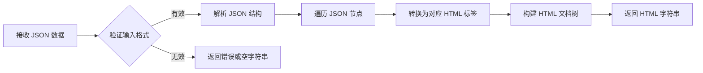

#### 带注释源码

```python
# 注意：此函数定义在 marker.output 模块中，以下为从调用方推断的函数原型
# from marker.output import json_to_html

# 在 LLMTableMergeProcessor 中的调用示例：
start_html = json_to_html(start_block.render(document))
curr_html = json_to_html(curr_block.render(document))

# 参数说明：
# - input_json: Dict 或 Any，来源于 Block.render(document) 的返回值
#   - start_block 和 curr_block 是 Block 类型对象
#   - render(document) 方法返回包含表格结构和数据的 JSON 对象

# 返回值说明：
# - 返回 str 类型的 HTML 字符串
#   - start_html 和 curr_html 变量接收转换后的 HTML 标记
#   - 这些 HTML 随后被用于构建 LLM 提示词中的表格描述

# 函数调用上下文：
# 该函数在 process_rewriting 方法中被调用，用于：
# 1. 获取表格的 HTML 表示
# 2. 将 HTML 嵌入到 table_merge_prompt 提示词模板中
# 3. 让 LLM 分析两张表格是否应该合并

prompt = self.table_merge_prompt.replace("{{table1}}", start_html).replace("{{table2}}", curr_html)
```


### `get_logger`

获取日志记录器，用于在模块中记录日志信息。

参数：

- 无参数

返回值：`logging.Logger`，返回 Python 标准库的日志记录器对象，用于记录程序运行时的日志信息。

#### 流程图

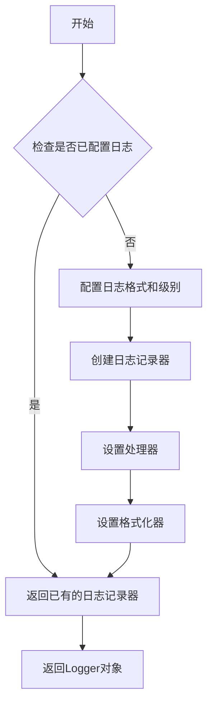

#### 带注释源码

```python
# 导入 get_logger 函数
# marker.logger 是 marker 库内部的日志模块
from marker.logger import get_logger

# 获取模块级别的日志记录器
# 通常日志记录器会根据调用模块的名称来命名
# 例如：对于 marker.converters.table 模块，日志记录器名称可能为 'marker.converters.table'
logger = get_logger()

# 使用示例（在 LLMTableMergeProcessor 类中）
# 当启用 --no_merge_tables_across_pages 标志时，记录跳过表格合并的信息
logger.info("Skipping table merging across pages due to --no_merge_tables_across_pages flag")
```

**说明：**

- `get_logger()` 函数来自外部模块 `marker.logger`，其具体实现未在当前代码文件中展示
- 该函数通常返回一个 Python 标准库 `logging.Logger` 对象
- 在当前文件中，`logger` 作为模块级变量被使用，用于记录程序运行时的关键信息
- 常见的 `get_logger` 实现会使用调用者的 `__name__` 来自动命名日志记录器，便于追踪日志来源


### `BaseLLMComplexBlockProcessor`

`BaseLLMComplexBlockProcessor` 是一个用于处理文档中复杂块（如表格、图表等）的基类，利用大语言模型（LLM）来重写或增强内容。它提供了并发处理块、调用 LLM 服务获取响应以及管理块结构的核心功能。该类定义了抽象方法 `rewrite_blocks`，子类（如 `LLMTableMergeProcessor`）需要实现此方法以实现特定的块处理逻辑。

参数：

- `document`：`Document`，需要处理的文档对象
- `block_types`：要处理的块类型元组
- `max_concurrency`：最大并发数
- `llm_service`：LLM 服务方法，用于调用模型

返回值：`None`，该类主要用于处理文档块，不直接返回值

#### 流程图

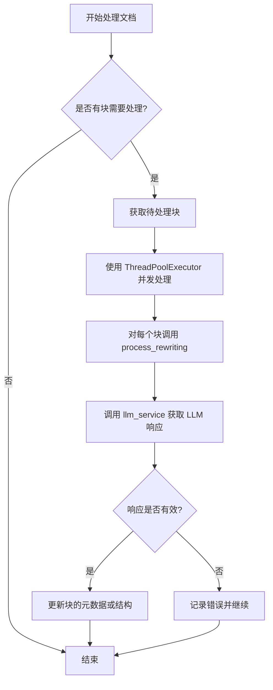

#### 带注释源码

```python
# BaseLLMComplexBlockProcessor 源码未在此代码片段中提供
# 以下为基于 LLMTableMergeProcessor 继承使用推断的基类接口

class BaseLLMComplexBlockProcessor:
    """
    处理文档中复杂块的基类，利用 LLM 进行内容重写
    """
    
    # 子类需要定义的块类型
    block_types: Tuple[BlockTypes] = NotImplemented
    
    # 最大并发处理数
    max_concurrency: int = 10
    
    def __init__(self, config=None):
        """初始化处理器"""
        self.config = config
        
    def rewrite_blocks(self, document: Document):
        """
        抽象方法：重写文档中的块
        子类必须实现此方法
        """
        raise NotImplementedError("子类必须实现 rewrite_blocks 方法")
    
    def process_rewriting(self, document: Document, blocks: List[Block]):
        """
        处理单个块或块组的重写
        """
        # 调用 LLM 服务获取响应
        response = self.llm_service(
            prompt,
            images,
            block,
            response_schema
        )
        
    def llm_service(self, prompt, images, block, response_schema):
        """
        调用 LLM 服务获取响应的抽象方法
        """
        raise NotImplementedError("子类必须实现 llm_service 方法")
```


### BlockTypes

`BlockTypes` 是来自 `marker.schema` 模块的块类型枚举，定义了文档中不同内容块的类型。该枚举在 `LLMTableMergeProcessor` 中用于识别和处理表格、目录等特定类型的块。

#### 流程图

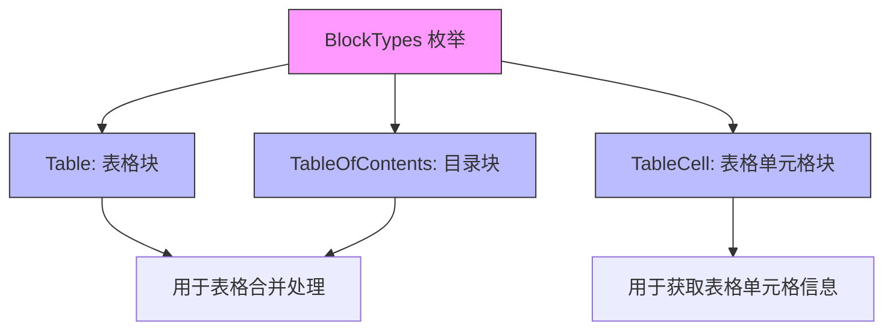

#### 带注释源码

```python
# BlockTypes 枚举在 marker.schema 中定义，以下为在本文件中使用的方式：

# 1. 在类属性中定义要处理的块类型
class LLMTableMergeProcessor(BaseLLMComplexBlockProcessor):
    block_types: Annotated[
        Tuple[BlockTypes],
        "The block types to process.",
    ] = (BlockTypes.Table, BlockTypes.TableOfContents)
    # 定义了该处理器处理的块类型为 Table 和 TableOfContents

# 2. 在 contained_blocks 方法中过滤特定类型的块
page_blocks = page.contained_blocks(document, self.block_types)
# 获取当前页中所有符合 block_types 的块

# 3. 在 process_rewriting 中获取子块
children = start_block.contained_blocks(document, (BlockTypes.TableCell,))
# 获取表格块中的所有 TableCell（表格单元格）子块

# 4. 用于块类型判断和元数据更新
curr_block.update_metadata(llm_error_count=1)
# 更新块的元数据信息
```

#### 已知枚举值（根据代码使用推断）

| 枚举值 | 类型 | 描述 |
|--------|------|------|
| `BlockTypes.Table` | 块类型枚举 | 表示表格块，用于识别PDF或文档中的表格元素 |
| `BlockTypes.TableOfContents` | 块类型枚举 | 表示目录块，用于识别文档中的目录/索引结构 |
| `BlockTypes.TableCell` | 块类型枚举 | 表示表格单元格块，用于识别表格内部的单元格元素 |

#### 使用场景说明

`BlockTypes` 枚举在 `LLMTableMergeProcessor` 中的主要用途：

1. **块过滤** - 通过 `contained_blocks()` 方法筛选特定类型的块
2. **表格合并逻辑** - 判断当前块是否为表格或目录块
3. **单元格处理** - 获取表格块的子单元格进行合并操作
4. **结构构建** - 在合并后更新块的 `structure` 属性引用新的单元格

> **注意**：完整的 `BlockTypes` 枚举定义位于 `marker.schema` 模块中，上述枚举值是根据当前代码中的使用情况推断得出的。具体枚举可能包含更多块类型，如文本、图像、标题等。


### Block

Block 类是来自 marker.schema.blocks 的基类，表示文档中的块元素（如表格、段落等）。在 LLMTableMergeProcessor 中，Block 对象代表需要合并的表格块。

参数：无（构造函数参数未在当前代码中直接显示）

返回值：无（这是类定义，非方法）

#### 流程图

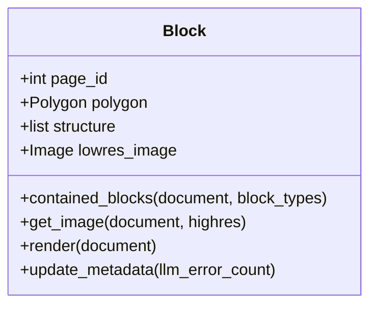

#### 带注释源码

```python
# Block 类来自 marker.schema.blocks
# 在本代码中通过以下方式使用：

# 1. 获取页面ID
prev_block.page_id  # int: 块所在的页面ID

# 2. 获取几何信息（多边形）
prev_block.polygon.height  # float: 块的高度
prev_block.polygon.width   # float: 块的宽度
prev_block.polygon.x_start # float: 块左上角x坐标
prev_block.polygon.y_start # float: 块左上角y坐标
prev_block.polygon.x_end   # float: 块右上角x坐标
prev_block.polygon.y_end   # float: 块右上角y坐标

# 3. 获取包含的子块
prev_block.contained_blocks(document, (BlockTypes.TableCell,))

# 4. 获取图像
start_block.get_image(document, highres=False)

# 5. 渲染为HTML
start_block.render(document)

# 6. 更新元数据
curr_block.update_metadata(llm_error_count=1)

# 7. 结构管理
start_block.structure = [b.id for b in merged_cells]
start_block.lowres_image = merged_image
```

---

### TableCell

TableCell 类是来自 marker.schema.blocks 的单元格类，表示表格中的单元格。在 LLMTableMergeProcessor 中，TableCell 对象代表表格的各个单元格，用于合并操作。

参数：无（构造函数参数未在当前代码中直接显示）

返回值：无（这是类定义，非方法）

#### 流程图

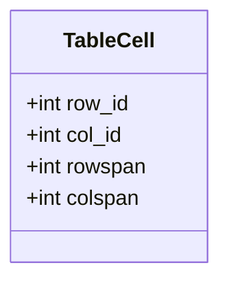

#### 带注释源码

```python
# TableCell 类来自 marker.schema.blocks
# 在本代码中通过以下方式使用：

# 1. 获取行ID和列ID
cell.row_id  # int: 单元格所在的行ID
cell.col_id  # int: 单元格所在的列ID

# 2. 获取跨行跨列信息
cell.rowspan  # int: 单元格跨越的行数
cell.colspan  # int: 单元格跨越的列数

# 3. 修改行ID和列ID（用于合并时重新编号）
# 横向合并时，增加列ID
for cell in cells2:
    cell.col_id += col_count

# 纵向合并时，增加行ID
for cell in cells2:
    cell.row_id += row_count
```


### `LLMTableMergeProcessor.rewrite_blocks`

该方法是表格合并处理器的主入口，遍历文档中的所有页面和表格块，根据空间位置、尺寸相似性等条件识别需要合并的表格对，并使用多线程并发调用 LLM 服务验证合并决策，最终将符合条件的表格合并成更大的表格块。

参数：
- `document`：`Document`，待处理的文档对象，包含页面和块结构

返回值：无（`None`），该方法直接修改文档中的表格块结构

#### 流程图

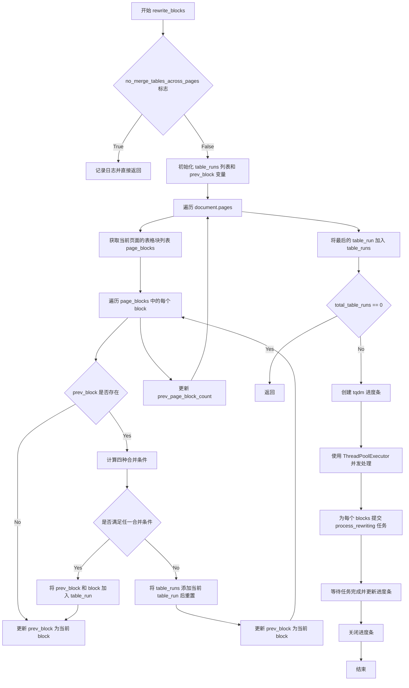

#### 带注释源码

```python
def rewrite_blocks(self, document: Document):
    # 如果配置中禁用了跨页表格合并，则直接返回，不进行任何处理
    if self.no_merge_tables_across_pages:
        logger.info("Skipping table merging across pages due to --no_merge_tables_across_pages flag")
        return

    # 初始化表格运行列表和前一个块引用
    table_runs = []
    table_run = []
    prev_block = None
    prev_page_block_count = None
    
    # 遍历文档中的所有页面
    for page in document.pages:
        # 获取当前页面中所有需要处理的块（表格和目录）
        page_blocks = page.contained_blocks(document, self.block_types)
        
        # 遍历当前页面中的每个块
        for block in page_blocks:
            merge_condition = False
            
            # 如果存在前一个块，则计算各种合并条件
            if prev_block is not None:
                # 获取前后两个块的单元格信息
                prev_cells = prev_block.contained_blocks(document, (BlockTypes.TableCell,))
                curr_cells = block.contained_blocks(document, (BlockTypes.TableCell,))
                
                # 计算行数和列数的匹配程度
                row_match = abs(self.get_row_count(prev_cells) - self.get_row_count(curr_cells)) < 5  # 相似行数
                col_match = abs(self.get_column_count(prev_cells) - self.get_column_count(curr_cells)) < 2

                # 条件1：跨页表格合并（后续页面的表格）
                subsequent_page_table = all([
                    prev_block.page_id == block.page_id - 1,  # 后续页面
                    max(prev_block.polygon.height / page.polygon.height,
                        block.polygon.height / page.polygon.height) > self.table_height_threshold,  # 占页面大部分高度
                    (len(page_blocks) == 1 or prev_page_block_count == 1),  # 页面上只有一个表格
                    (row_match or col_match)
                ])

                # 条件2：同页垂直排列的表格（上下相邻）
                same_page_vertical_table = all([
                    prev_block.page_id == block.page_id,  # 同一页面
                    (1 - self.vertical_table_height_threshold) < prev_block.polygon.height / block.polygon.height < (1 + self.vertical_table_height_threshold),  # 高度相似
                    abs(block.polygon.x_start - prev_block.polygon.x_end) < self.vertical_table_distance_threshold,  # 水平距离近
                    abs(block.polygon.y_start - prev_block.polygon.y_start) < self.vertical_table_distance_threshold,  # 垂直起点接近
                    row_match
                ])

                # 条件3：同页水平排列的表格（左右相邻）
                same_page_horizontal_table = all([
                    prev_block.page_id == block.page_id,  # 同一页面
                    (1 - self.horizontal_table_width_threshold) < prev_block.polygon.width / block.polygon.width < (1 + self.horizontal_table_width_threshold),  # 宽度相似
                    abs(block.polygon.y_start - prev_block.polygon.y_end) < self.horizontal_table_distance_threshold,  # 垂直距离近
                    abs(block.polygon.x_start - prev_block.polygon.x_start) < self.horizontal_table_distance_threshold,  # 水平起点接近
                    col_match
                ])

                # 条件4：同页新列（右侧追加列）
                same_page_new_column = all([
                    prev_block.page_id == block.page_id,  # 同一页面
                    abs(block.polygon.x_start - prev_block.polygon.x_end) < self.column_gap_threshold,  # 列间隙小
                    block.polygon.y_start < prev_block.polygon.y_end,  # 垂直范围重叠
                    block.polygon.width * (1 - self.vertical_table_height_threshold) < prev_block.polygon.width < block.polygon.width * (1 + self.vertical_table_height_threshold),  # 宽度相似
                    col_match
                ])
                
                # 任一条件满足则标记为可合并
                merge_condition = any([subsequent_page_table, same_page_vertical_table, same_page_new_column, same_page_horizontal_table])

            # 如果满足合并条件，将块加入当前表格运行
            if prev_block is not None and merge_condition:
                if prev_block not in table_run:
                    table_run.append(prev_block)
                table_run.append(block)
            else:
                # 不满足条件，保存当前表格运行并开始新的
                if table_run:
                    table_runs.append(table_run)
                table_run = []
            
            # 更新前一个块为当前块
            prev_block = block
        
        # 记录当前页面的块数量，用于后续判断
        prev_page_block_count = len(page_blocks)

    # 处理最后一组表格运行
    if table_run:
        table_runs.append(table_run)

    # 如果没有需要处理的表格，直接返回
    total_table_runs = len(table_runs)
    if total_table_runs == 0:
        return

    # 创建进度条显示处理进度
    pbar = tqdm(
        total=total_table_runs,
        desc=f"{self.__class__.__name__} running",
        disable=self.disable_tqdm,
    )

    # 使用线程池并发处理每个表格运行
    with ThreadPoolExecutor(max_workers=self.max_concurrency) as executor:
        for future in as_completed([
            executor.submit(self.process_rewriting, document, blocks)
            for blocks in table_runs
        ]):
            future.result()  # 等待任务完成，异常会在这里抛出
            pbar.update(1)

    pbar.close()
```


### `LLMTableMergeProcessor.get_row_count`

该静态方法用于计算表格的行数，通过遍历表格单元格集合，按列分组计算每列的总行跨度（rowspan）之和，并返回所有列中的最大行数作为表格的总行数。

参数：

- `cells`：`List[TableCell]`，表格单元格列表

返回值：`int`，表格的总行数

#### 流程图

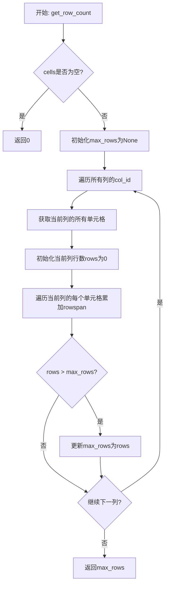

#### 带注释源码

```python
@staticmethod
def get_row_count(cells: List[TableCell]):
    # 空单元格列表直接返回0
    if not cells:
        return 0

    # 初始化最大行数为None
    max_rows = None
    # 遍历所有唯一的列ID（col_id）
    for col_id in set([cell.col_id for cell in cells]):
        # 获取当前列的所有单元格
        col_cells = [cell for cell in cells if cell.col_id == col_id]
        # 初始化当前列的行数计数
        rows = 0
        # 累加该列每个单元格的rowspan（行跨度）
        for cell in col_cells:
            rows += cell.rowspan
        # 更新最大行数
        if max_rows is None or rows > max_rows:
            max_rows = rows
    # 返回计算出的表格最大行数
    return max_rows
```


### `LLMTableMergeProcessor.get_column_count`

该静态方法用于计算表格的最大列数，通过遍历每一行的单元格并累加其 colspan 值（考虑跨列单元格），返回所有行中列数最多的值。

参数：

- `cells`：`List[TableCell]`，待处理的表格单元格列表

返回值：`int`，表格的最大列数

#### 流程图

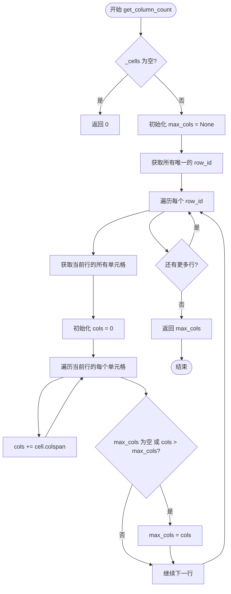

#### 带注释源码

```python
@staticmethod
def get_column_count(cells: List[TableCell]):
    """
    计算表格的最大列数。
    
    遍历表格中的每一行，累加每行中单元格的 colspan（跨列数），
    返回所有行中列数最多的值。这样可以正确处理跨列的单元格。
    
    参数:
        cells: TableCell 对象列表，代表表格中的所有单元格
        
    返回:
        表格的最大列数（整数）
    """
    # 如果单元格列表为空，直接返回 0
    if not cells:
        return 0

    # 初始化最大列数为 None
    max_cols = None
    
    # 获取表格中所有唯一的行 ID
    for row_id in set([cell.row_id for cell in cells]):
        # 获取当前行的所有单元格
        row_cells = [cell for cell in cells if cell.row_id == row_id]
        
        # 累加当前行的 colspan 值来计算列数
        cols = 0
        for cell in row_cells:
            cols += cell.colspan
        
        # 更新最大列数
        if max_cols is None or cols > max_cols:
            max_cols = cols
    
    # 返回计算得到的最大列数
    return max_cols
```


### `LLMTableMergeProcessor.rewrite_blocks`

该方法是表格合并处理器的核心入口，遍历文档中的所有页面，识别需要合并的相邻表格（跨页表格、同页垂直/水平排列的表格），并通过线程池并发调用LLM进行合并决策，最终将符合条件的表格合并为一个大表格。

参数：

-  `document`：`Document`，待处理的文档对象，包含页面和块信息，用于识别和合并表格

返回值：`None`，该方法直接修改document对象中的表格结构，不返回任何值

#### 流程图

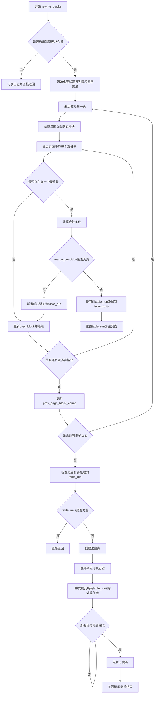

#### 带注释源码

```python
def rewrite_blocks(self, document: Document):
    # 如果配置中禁用了跨页表格合并，则直接跳过处理并记录日志
    if self.no_merge_tables_across_pages:
        logger.info("Skipping table merging across pages due to --no_merge_tables_across_pages flag")
        return

    # table_runs用于存储所有需要合并的表格组，每组是一个列表
    table_runs = []
    # table_run用于存储当前连续需要合并的表格
    table_run = []
    # prev_block记录上一个处理的表格块
    prev_block = None
    # prev_page_block_count记录上一页的表格块数量
    prev_page_block_count = None
    
    # 遍历文档的每一页
    for page in document.pages:
        # 获取当前页中所有指定类型的块（表格和目录）
        page_blocks = page.contained_blocks(document, self.block_types)
        
        # 遍历当前页的所有块
        for block in page_blocks:
            # merge_condition用于标记当前块是否需要与前一个块合并
            merge_condition = False
            
            # 如果存在前一个块，则计算合并条件
            if prev_block is not None:
                # 获取前一个块和当前块的表格单元格
                prev_cells = prev_block.contained_blocks(document, (BlockTypes.TableCell,))
                curr_cells = block.contained_blocks(document, (BlockTypes.TableCell,))
                
                # 检查行数是否相近（允许5行以内的差异）
                row_match = abs(self.get_row_count(prev_cells) - self.get_row_count(curr_cells)) < 5
                # 检查列数是否相近（允许2列以内的差异）
                col_match = abs(self.get_column_count(prev_cells) - self.get_column_count(curr_cells)) < 2

                # 条件1：跨页表格 - 表格在连续的页上，且占据页面大部分高度
                subsequent_page_table = all([
                    prev_block.page_id == block.page_id - 1,  # 当前页是前一页的下一页
                    max(prev_block.polygon.height / page.polygon.height,
                        block.polygon.height / page.polygon.height) > self.table_height_threshold,  # 表格高度超过页面阈值
                    (len(page_blocks) == 1 or prev_page_block_count == 1),  # 页面上只有这一个表格
                    (row_match or col_match)  # 行或列匹配
                ])

                # 条件2：同页垂直排列的表格 - 两个表格上下相邻且高度相似
                same_page_vertical_table = all([
                    prev_block.page_id == block.page_id,  # 在同一页
                    (1 - self.vertical_table_height_threshold) < prev_block.polygon.height / block.polygon.height < (1 + self.vertical_table_height_threshold),  # 高度相似
                    abs(block.polygon.x_start - prev_block.polygon.x_end) < self.vertical_table_distance_threshold,  # 水平距离近
                    abs(block.polygon.y_start - prev_block.polygon.y_start) < self.vertical_table_distance_threshold,  # 垂直起始位置近
                    row_match  # 行数匹配
                ])

                # 条件3：同页水平排列的表格 - 两个表格左右相邻且宽度相似
                same_page_horizontal_table = all([
                    prev_block.page_id == block.page_id,  # 在同一页
                    (1 - self.horizontal_table_width_threshold) < prev_block.polygon.width / block.polygon.width < (1 + self.horizontal_table_width_threshold),  # 宽度相似
                    abs(block.polygon.y_start - prev_block.polygon.y_end) < self.horizontal_table_distance_threshold,  # 垂直距离近
                    abs(block.polygon.x_start - prev_block.polygon.x_start) < self.horizontal_table_distance_threshold,  # 水平起始位置近
                    col_match  # 列数匹配
                ])

                # 条件4：同页新列模式 - 表格作为前一表格的新列出现
                same_page_new_column = all([
                    prev_block.page_id == block.page_id,  # 在同一页
                    abs(block.polygon.x_start - prev_block.polygon.x_end) < self.column_gap_threshold,  # 列间距在阈值内
                    block.polygon.y_start < prev_block.polygon.y_end,  # 当前表格起始位置在前一个表格范围内
                    block.polygon.width * (1 - self.vertical_table_height_threshold) < prev_block.polygon.width < block.polygon.width * (1 + self.vertical_table_height_threshold),  # 宽度相似
                    col_match  # 列数匹配
                ])
                
                # 满足任一合并条件则设置merge_condition为True
                merge_condition = any([subsequent_page_table, same_page_vertical_table, same_page_new_column, same_page_horizontal_table])

            # 如果满足合并条件，将当前块加入table_run
            if prev_block is not None and merge_condition:
                if prev_block not in table_run:
                    table_run.append(prev_block)
                table_run.append(block)
            else:
                # 不满足合并条件，说明一个表格组结束，将当前的table_run保存
                if table_run:
                    table_runs.append(table_run)
                # 重置table_run，开始新的表格组
                table_run = []
            
            # 更新prev_block为当前块
            prev_block = block
        
        # 记录当前页的块数量，用于下一页的跨页判断
        prev_page_block_count = len(page_blocks)

    # 处理最后可能剩余的table_run
    if table_run:
        table_runs.append(table_run)

    # 如果没有需要处理的表格组，直接返回
    total_table_runs = len(table_runs)
    if total_table_runs == 0:
        return

    # 创建进度条
    pbar = tqdm(
        total=total_table_runs,
        desc=f"{self.__class__.__name__} running",
        disable=self.disable_tqdm,
    )

    # 使用线程池并发处理所有表格组合并任务
    with ThreadPoolExecutor(max_workers=self.max_concurrency) as executor:
        for future in as_completed([
            executor.submit(self.process_rewriting, document, blocks)
            for blocks in table_runs
        ]):
            # 获取结果，若有异常则抛出
            future.result()
            # 更新进度条
            pbar.update(1)

    # 关闭进度条
    pbar.close()
```


### `LLMTableMergeProcessor.process_rewriting`

该方法负责处理单个表格对的合并逻辑，通过调用LLM服务判断两个表格是否应该合并以及合并的方向（底部合并或右侧合并），并在确认合并后更新文档结构。

参数：

- `document`：`Document`，包含PDF数据的文档对象，用于获取表格的图像和结构信息
- `blocks`：`List[Block]`，待处理的表格块列表，至少需要两个块才能进行合并操作

返回值：`None`，该方法直接修改文档中的表格块结构，不返回任何值

#### 流程图

```mermaid
flowchart TD
    A["开始: process_rewriting<br/>(document, blocks)"] --> B{len(blocks) < 2?}
    B -->|是| C["return<br/>(无法合并单个表格)"]
    B -->|否| D["start_block = blocks[0]<br/>(初始化起始表格)"]
    D --> E["遍历 i from 1 to len(blocks)-1"]
    E --> F["curr_block = blocks[i]<br/>(当前待合并表格)"]
    F --> G["获取start_block的表格单元格children"]
    G --> H["获取curr_block的表格单元格children_curr"]
    H --> I{children 或 children_curr为空?}
    I -->|是| J["break<br/>(表格/表单处理器未运行)"]
    I -->|否| K["获取start_block图像和HTML"]
    K --> L["获取curr_block图像和HTML"]
    L --> M["构建LLM提示词<br/>(替换table1和table2占位符)"]
    M --> N["调用llm_service获取响应<br/>(MergeSchema)"]
    N --> O{响应无效?}
    O -->|是| P["更新元数据并break"]
    O -->|否| Q["merge = response['merge']"]
    Q --> R{"true" in merge?}
    R -->|否| S["start_block = curr_block<br/>(不合并，继续下一个)"]
    R -->|是| T["direction = response['direction']"]
    T --> U["validate_merge验证合并可行性"]
    U --> V{验证通过?}
    V -->|否| S
    V -->|是| W["join_images合并图像"]
    W --> X["join_cells合并单元格"]
    X --> Y["curr_block.structure清空"]
    Y --> Z["start_block.structure更新为merged_cells的ID列表"]
    Z --> AA["start_block.lowres_image更新为merged_image"]
    AA --> AB{"i < len(blocks)-1?"]
    AB -->|是| E
    AB -->|否| AC["结束"]
    S --> AB
    J --> AC
    C --> AC
```

#### 带注释源码

```python
def process_rewriting(self, document: Document, blocks: List[Block]):
    """
    处理单个表格对的合并逻辑
    通过LLM判断两个表格是否应该合并，以及合并的方向
    """
    # 检查表格数量，如果少于2个则无法合并，直接返回
    if len(blocks) < 2:
        # Can't merge single tables
        return

    # 将第一个块设置为起始表格
    start_block = blocks[0]
    
    # 遍历剩余的表格块
    for i in range(1, len(blocks)):
        # 当前待处理的表格块
        curr_block = blocks[i]
        
        # 获取起始表格的所有子表格单元格
        children = start_block.contained_blocks(document, (BlockTypes.TableCell,))
        # 获取当前表格的所有子表格单元格
        children_curr = curr_block.contained_blocks(document, (BlockTypes.TableCell,))
        
        # 如果任一表格没有单元格，可能是表格/表单处理器未运行
        if not children or not children_curr:
            # Happens if table/form processors didn't run
            break

        # 获取表格的低分辨率图像用于LLM分析
        start_image = start_block.get_image(document, highres=False)
        curr_image = curr_block.get_image(document, highres=False)
        
        # 将表格渲染为HTML格式
        start_html = json_to_html(start_block.render(document))
        curr_html = json_to_html(curr_block.render(document))

        # 替换提示词模板中的表格HTML占位符
        prompt = self.table_merge_prompt.replace("{{table1}}", start_html).replace("{{table2}}", curr_html)

        # 调用LLM服务获取合并决策
        # 传入提示词、两个表格图像、当前块和响应模式
        response = self.llm_service(
            prompt,
            [start_image, curr_image],
            curr_block,
            MergeSchema,
        )

        # 验证响应有效性
        if not response or ("direction" not in response or "merge" not in response):
            # 记录LLM错误计数并停止处理
            curr_block.update_metadata(llm_error_count=1)
            break

        # 获取合并决策
        merge = response["merge"]

        # 如果LLM判断不应合并
        # The original table is okay
        if "true" not in merge:
            # 将当前块设为新的起始块，继续处理下一个
            start_block = curr_block
            continue

        # LLM判断应该合并，获取合并方向
        direction = response["direction"]
        
        # 验证合并方向是否符合条件（如行数/列数匹配）
        if not self.validate_merge(children, children_curr, direction):
            start_block = curr_block
            continue

        # 执行实际的合并操作
        # 合并两个表格的图像
        merged_image = self.join_images(start_image, curr_image, direction)
        # 合并两个表格的单元格
        merged_cells = self.join_cells(children, children_curr, direction)
        
        # 清空当前块的structure
        curr_block.structure = []
        # 将合并后的单元格ID列表设置到起始块
        start_block.structure = [b.id for b in merged_cells]
        # 更新起始块的低分辨率图像
        start_block.lowres_image = merged_image
```


### `LLMTableMergeProcessor.validate_merge`

该方法用于验证两个表格（Table）合并的可行性。它根据合并方向（右侧或底部）检查两个表格的维度兼容性：对于右侧合并，验证两表格的行数是否相近（允许最多5行差异）；对于底部合并，验证两表格的列数是否相近（允许最多2列差异）。

参数：

- `self`：`LLMTableMergeProcessor`，当前类的实例
- `cells1`：`List[TableCell]`，第一个表格的单元格列表
- `cells2`：`List[TableCell]`，第二个表格的单元格列表
- `direction`：`Literal['right', 'bottom']`，合并方向，'right'表示右侧水平合并，'bottom'表示底部垂直合并，默认为'right'

返回值：`bool`，返回 True 表示两个表格可以合并，返回 False 表示不能合并

#### 流程图

```mermaid
flowchart TD
    A[开始 validate_merge] --> B{检查 direction}
    B -->|right| C[获取 cells1 的行数]
    B -->|bottom| D[获取 cells1 的列数]
    C --> E[获取 cells2 的行数]
    D --> F[获取 cells2 的列数]
    E --> G{abs(cells1_row_count - cells2_row_count) < 5?}
    F --> H{abs(cells1_col_count - cells2_col_count) < 2?}
    G -->|True| I[返回 True]
    G -->|False| J[返回 False]
    H -->|True| I
    H -->|False| J
```

#### 带注释源码

```python
def validate_merge(self, cells1: List[TableCell], cells2: List[TableCell], direction: Literal['right', 'bottom'] = 'right'):
    """
    验证两个表格是否可以合并
    
    参数:
        cells1: 第一个表格的单元格列表
        cells2: 第二个表格的单元格列表
        direction: 合并方向，'right'为水平向右合并，'bottom'为垂直向下合并
    
    返回:
        bool: 是否可以合并
    """
    if direction == "right":
        # 右侧合并要求两个表格的行数相近
        # 检查两表格的行数是否相同（允许5行以内的差异）
        cells1_row_count = self.get_row_count(cells1)  # 获取第一个表格的行数
        cells2_row_count = self.get_row_count(cells2)  # 获取第二个表格的行数
        return abs(cells1_row_count - cells2_row_count) < 5  # 行数差异小于5则可合并
    elif direction == "bottom":
        # 底部合并要求两个表格的列数相近
        # 检查两表格的列数是否相同（允许2列以内的差异）
        cells1_col_count = self.get_column_count(cells1)  # 获取第一个表格的列数
        cells2_col_count = self.get_column_count(cells2)  # 获取第二个表格的列数
        return abs(cells1_col_count - cells2_col_count) < 2  # 列数差异小于2则可合并
```


### `LLMTableMergeProcessor.join_cells`

该方法用于合并两个表格的单元格，根据合并方向（右侧合并或底部合并）调整单元格的行列索引，将两个表格的单元格合并为一个统一的列表。

参数：

- `self`：`LLMTableMergeProcessor`，类实例本身，包含表格合并的上下文信息
- `cells1`：`List[TableCell]`，第一个表格的单元格列表
- `cells2`：`List[TableCell]`，第二个表格的单元格列表
- `direction`：`Literal['right', 'bottom']`，合并方向，`'right'`表示水平向右合并（列扩展），`'bottom'`表示垂直向下合并（行扩展），默认为`'right'`

返回值：`List[TableCell]`，合并后的单元格列表，包含来自两个表格的所有单元格，索引已根据合并方向调整

#### 流程图

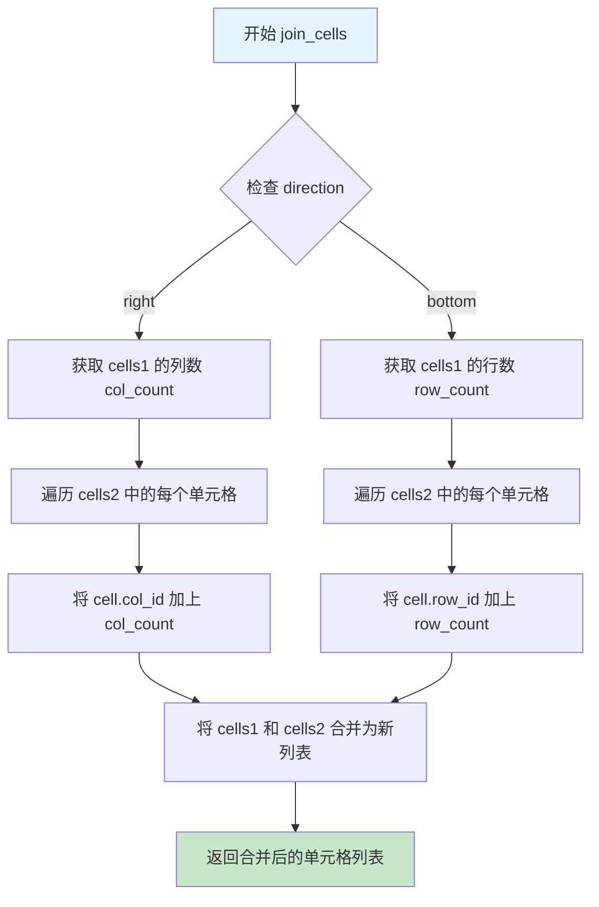

#### 带注释源码

```python
def join_cells(self, cells1: List[TableCell], cells2: List[TableCell], direction: Literal['right', 'bottom'] = 'right') -> List[TableCell]:
    """
    合并两个表格的单元格。
    
    根据合并方向调整单元格的行列索引：
    - 'right' 方向：将 cells2 的列索引向右偏移 cells1 的列数
    - 'bottom' 方向：将 cells2 的行索引向下偏移 cells1 的行数
    
    参数:
        cells1: 第一个表格的单元格列表
        cells2: 第二个表格的单元格列表
        direction: 合并方向，'right' 为水平合并，'bottom' 为垂直合并
    
    返回:
        合并后的单元格列表
    """
    if direction == 'right':
        # 水平合并：将列向右偏移
        # 获取第一个表格的列数，用于计算偏移量
        col_count = self.get_column_count(cells1)
        
        # 遍历第二个表格的所有单元格，将它们的列索引向右偏移
        for cell in cells2:
            cell.col_id += col_count
        
        # 合并两个表格的单元格
        new_cells = cells1 + cells2
    else:
        # 垂直合并：将行向下偏移
        # 获取第一个表格的行数，用于计算偏移量
        row_count = self.get_row_count(cells1)
        
        # 遍历第二个表格的所有单元格，将它们的行索引向下偏移
        for cell in cells2:
            cell.row_id += row_count
        
        # 合并两个表格的单元格
        new_cells = cells1 + cells2
    
    return new_cells
```


### `LLMTableMergeProcessor.join_images`

该静态方法用于将两个表格图像（Image.Image对象）按照指定的方向（水平拼接或垂直拼接）合并成一张新的图像，是表格合并处理流程中的关键图像处理环节。

参数：

- `image1`：`Image.Image`，待合并的第一张表格图像（左侧或上方图像）
- `image2`：`Image.Image`，待合并的第二张表格图像（右侧或下方图像）
- `direction`：`Literal['right', 'bottom']`，合并方向，'right'表示水平向右拼接，'bottom'表示垂直向下拼接，默认为'right'

返回值：`Image.Image`，合并后的新图像对象

#### 流程图

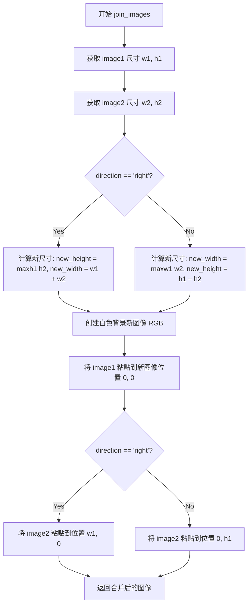

#### 带注释源码

```python
@staticmethod
def join_images(image1: Image.Image, image2: Image.Image, direction: Literal['right', 'bottom'] = 'right') -> Image.Image:
    """
    静态方法：将两张表格图像按指定方向合并为一张图像
    
    参数:
        image1: Image.Image - 第一个表格图像（合并时的基准图像）
        image2: Image.Image - 第二个表格图像（待合并的图像）
        direction: 合并方向，'right'水平拼接，'bottom'垂直拼接
    
    返回:
        Image.Image - 合并后的新图像对象
    """
    
    # 获取两张图像的宽高尺寸
    w1, h1 = image1.size
    w2, h2 = image2.size

    # 根据合并方向计算新图像的尺寸
    if direction == 'right':
        # 水平向右拼接：宽度相加，高度取两者较大值
        new_height = max(h1, h2)  # 取两张图像高度的较大者作为新高度
        new_width = w1 + w2       # 宽度简单相加
        # 创建白色背景的新RGB图像
        new_img = Image.new('RGB', (new_width, new_height), 'white')
        # 将第一张图像粘贴到左上角
        new_img.paste(image1, (0, 0))
        # 将第二张图像粘贴到第一张图像的右侧
        new_img.paste(image2, (w1, 0))
    else:
        # 垂直向下拼接：高度相加，宽度取两者较大值
        new_width = max(w1, w2)   # 取两张图像宽度的较大者作为新宽度
        new_height = h1 + h2      # 高度简单相加
        # 创建白色背景的新RGB图像
        new_img = Image.new('RGB', (new_width, new_height), 'white')
        # 将第一张图像粘贴到左上角
        new_img.paste(image1, (0, 0))
        # 将第二张图像粘贴到第一张图像的下方
        new_img.paste(image2, (0, h1))
    
    # 返回合并后的图像对象
    return new_img
```

## 关键组件


### LLMTableMergeProcessor

核心表格合并处理器，负责识别跨页或同页相邻表格并使用LLM判断合并决策，将多个表格的单元格和图像合并为统一结构。

### 表格合并条件判断逻辑 (rewrite_blocks)

实现多种合并场景的检测：跨页表格(subsequent_page_table)、同页垂直相邻表格(same_page_vertical_table)、同页水平相邻表格(same_page_horizontal_table)、同页新列表格(same_page_new_column)，通过多维度阈值控制合并触发条件。

### 表格尺寸阈值配置

包含table_height_threshold(跨页表格高度比例阈值0.6)、vertical_table_height_threshold(垂直合并高度容差0.25)、horizontal_table_width_threshold(水平合并宽度容差0.25)、vertical_table_distance_threshold(垂直距离阈值20像素)、horizontal_table_distance_threshold(水平距离阈值10像素)、column_gap_threshold(列间距阈值50像素)等配置参数。

### 表格合并提示词 (table_merge_prompt)

预定义的LLM提示词模板，用于指导模型分析两张表格图片和HTML表示，判断是否应该合并以及合并方向(bottom或right)，包含详细的表格描述、解释和JSON输出格式要求。

### process_rewriting 方法

核心处理流程：获取表格图像和HTML、使用LLM服务判断合并决策、验证合并可行性、执行单元格和图像合并、更新文档结构。

### MergeSchema

Pydantic数据模型，定义LLM响应的结构化格式，包含table1_description、table2_description、explanation、merge(true/false)、direction(bottom/right)字段。

### validate_merge 方法

合并前验证逻辑：direction为right时检查行数差异小于5，direction为bottom时检查列数差异小于2，确保合并后的表格结构有效。

### join_cells 方法

执行表格单元格合并：right方向时将cells2的col_id偏移cells1的列数，bottom方向时将cells2的row_id偏移cells1的行数，返回合并后的单元格列表。

### join_images 方法

使用PIL库执行图像拼接：right方向水平拼接两图创建新画布，bottom方向垂直拼接，返回合并后的Image对象。

### 静态方法 get_row_count 和 get_column_count

根据TableCell的rowspan和colspan属性计算表格的行数和列数，遍历所有列/行求最大覆盖范围。

### 并发处理机制

使用ThreadPoolExecutor和as_completed实现多线程表格合并处理，通过tqdm显示处理进度，支持max_concurrency配置并发数量。

### no_merge_tables_across_pages 配置

布尔标志控制是否禁用跨页表格合并，启用时直接跳过合并逻辑，保持页面分隔。


## 问题及建议


### 已知问题

- **逻辑错误**：`validate_merge` 方法中的方向判断可能存在错误。当 `direction == "right"` 时检查行数相等，当 `direction == "bottom"` 时检查列数相等，这在逻辑上看起来是反的（右侧合并应该是合并列，应该检查行数相等；底部合并应该是合并行，应该检查列数相等）。
- **魔法数字**：在 `rewrite_blocks` 方法中存在硬编码的数值如 `< 5`（行数差异容忍）、`< 2`（列数差异容忍），这些值应该提取为可配置的阈值参数，提高代码可维护性。
- **异常处理不足**：`process_rewriting` 方法中，当 `response` 为空或缺少必要字段时，仅调用 `break` 退出循环，没有记录日志信息，不利于问题排查和监控。
- **方法过长**：`rewrite_blocks` 方法超过 200 行，包含复杂的条件判断逻辑，违反单一职责原则，建议拆分为多个私有方法。
- **资源未正确释放**：虽然使用了 `ThreadPoolExecutor`，但在出现异常时 `pbar.close()` 可能不会被及时调用，建议使用上下文管理器。
- **潜在的 None 值问题**：`get_image` 和 `render` 方法的返回值未做空值检查，可能导致后续操作失败。

### 优化建议

- **修复 validate_merge 逻辑**：仔细审查并验证 `validate_merge` 方法中的方向判断逻辑是否与实际的合并行为一致。
- **提取配置参数**：将硬编码的数值（如 5、2、20、10 等）提取为类属性或配置文件，提供更灵活的配置能力。
- **增强日志记录**：在关键决策点添加详细的日志记录，包括合并决策、失败原因等，便于问题排查和系统监控。
- **重构大方法**：将 `rewrite_blocks` 拆分为多个独立方法，如 `is_subsequent_page_table()`、`is_same_page_vertical_table()` 等，提高代码可读性。
- **改进错误处理**：为可能失败的操作添加 try-except 块，并提供有意义的错误信息。
- **使用上下文管理器**：使用 `with` 语句管理 `ThreadPoolExecutor` 和进度条，确保资源正确释放。
- **添加类型注解完整性**：检查并补充所有方法的完整类型注解，特别是返回类型。

## 其它


### 设计目标与约束

本模块的设计目标是利用大语言模型(LLM)智能判断并合并跨页或同页相邻的表格，具体包括：(1) 识别应该合并的表格对；(2) 通过LLM判断合并方向（底部或右侧）；(3) 合并表格内容和对应图像。约束条件包括：表格高度/宽度需满足阈值要求、相邻表格距离需在阈值内、仅在LLM判断可以合并时才执行合并操作、禁用跨页合并时可保持页面边界。

### 错误处理与异常设计

错误处理主要体现在以下几个环节：(1) 当表格或表单处理器未运行导致TableCell为空时，process_rewriting方法会直接break退出合并流程；(2) 当LLM响应格式不正确或缺少必要字段时，会记录llm_error_count元数据并终止当前合并；(3) 当validate_merge验证失败时，会跳过当前合并并继续处理下一个表格；(4) ThreadPoolExecutor中的future.result()会捕获并重新抛出异常；(5) 使用tqdm进度条时通过disable参数控制进度条显示。异常设计采用保守策略，任一合并步骤失败不影响其他表格对的处理。

### 数据流与状态机

数据流从Document对象开始，经过rewrite_blocks方法遍历所有页面和表格块，识别满足合并条件的表格对（形成table_runs），然后通过ThreadPoolExecutor并发提交给process_rewriting方法处理。状态机逻辑如下：初始状态为prev_block=None，每遍历一个表格块则更新prev_block；当满足merge_condition时将表格加入当前table_run，否则保存当前run并新建一个；最终处理完所有表格后提交所有runs给线程池。process_rewriting内部对每个表格对执行：获取图像和HTML、调用LLM判断、验证合并可行性、执行合并（图像拼接+单元格合并）。

### 外部依赖与接口契约

主要外部依赖包括：(1) concurrent.futures.ThreadPoolExecutor - 用于并发处理多个表格合并任务；(2) pydantic.BaseModel - 定义MergeSchema结构；(3) tqdm - 显示处理进度条；(4) PIL.Image - 图像拼接操作；(5) marker.output.json_to_html - 将JSON转换为HTML；(6) marker.processors.llm.BaseLLMComplexBlockProcessor - 继承的基类，提供llm_service方法；(7) marker.schema相关模块 - 文档和块的定义。接口契约方面：rewrite_blocks接收Document对象并直接修改其内部状态；process_rewriting接收document和blocks列表，通过修改Block的structure和lowres_image属性返回结果；基类要求实现block_types类属性指定处理的块类型。

### 并发模型与性能考虑

并发模型采用ThreadPoolExecutor，max_workers由基类属性max_concurrency控制（默认为4）。每个table_run作为一个独立任务提交给线程池，任务间无数据共享。性能优化措施包括：(1) 使用as_completed实现任务的异步完成处理；(2) 进度条在无任务时完全禁用；(3) 单个表格直接跳过合并；(4) 当检测到LLM判断不应合并时立即更新start_block减少后续计算。潜在瓶颈：LLM调用是主要延迟来源，线程池大小受LLM服务并发能力限制。

### 配置管理与参数说明

所有配置通过Annotated类型注解定义，属于类属性。主要配置参数分为五类：合并条件阈值（table_height_threshold、table_start_threshold、vertical_table_height_threshold等）、距离阈值（vertical_table_distance_threshold、horizontal_table_distance_threshold、column_gap_threshold）、控制开关（disable_tqdm、no_merge_tables_across_pages）、LLM相关（table_merge_prompt、max_concurrency继承自基类）、输出控制（block_types指定处理的块类型）。默认值设置考虑了常见PDF表格场景，可通过配置文件或命令行参数覆盖。

### 安全性考虑

代码本身不直接处理用户输入，但table_merge_prompt模板包含{{table1}}和{{table2}}占位符，存在Prompt注入风险——如果HTML输入包含恶意脚本可能影响LLM判断。建议在替换前对table1和table2进行HTML转义处理。此外，LLM返回的merge字段仅接受"true"/"false"字符串，direction仅接受"bottom"/"right"，属于白名单验证。

### 测试策略建议

单元测试应覆盖：(1) get_row_count和get_column_count的边界情况（空列表、单单元格跨行/跨列）；(2) validate_merge对行数/列数差异的容忍度；(3) join_cells的列偏移和行偏移计算；(4) join_images的图像尺寸计算。集成测试应覆盖：(1) 跨页表格合并；(2) 同页垂直/水平/新列三种相邻情况；(3) LLM返回错误响应时的容错；(4) 空表格或无TableCell的处理。模拟测试可使用mock替代真实的LLM服务调用。

    