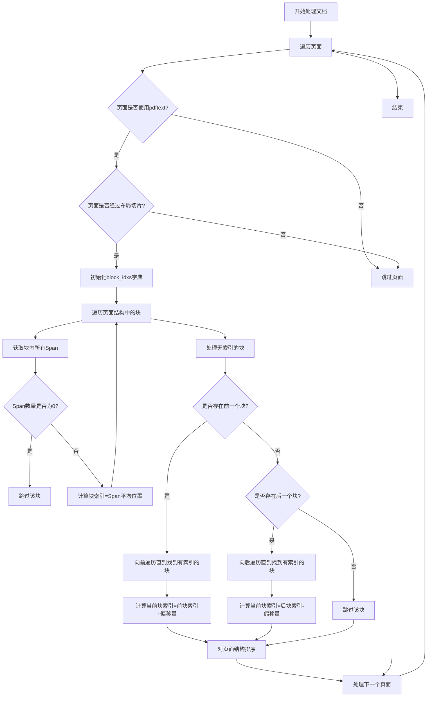

# `marker\marker\processors\order.py` 详细设计文档

一个文档处理器类，用于在布局图像被切片导致块顺序错乱时，根据块内Span的原始位置或相邻块的相对位置对页面结构中的块进行重新排序。

## 整体流程

```mermaid
graph TD
    A[开始: 接收 Document] --> B[遍历页面: for page in document.pages]
    B --> C{页面是否为 PDFText 且已切片?}
    C -- 否 --> D[跳过页面: continue]
    C -- 是 --> E[初始化 block_idxs: defaultdict(int)]
    E --> F[遍历页面结构块: for block_id in page.structure]
    F --> G[获取块和 Spans]
    G --> H{是否有 Spans?}
    H -- 是 --> I[计算平均位置: (min_pos + max_pos)/2]
    I --> J[存入 block_idxs]
    H -- 否 --> K[标记为待处理]
    F --> L{所有块遍历完毕?}]
    L -- 是 --> M[再次遍历块: for block_id in page.structure]
    M --> N{块是否已有索引?]
    N -- 是 --> O[跳过]
    N -- 否 --> P[查找前驱/后继块]
    P --> Q[根据相对位置计算索引]
    Q --> R[存入 block_idxs]
    M --> S{计算完毕?}]
    S -- 是 --> T[根据 block_idxs 排序 page.structure]
    T --> U[结束]
```

## 类结构

```
BaseProcessor (基类)
└── OrderProcessor (块排序处理器)
```

## 全局变量及字段


### `mean`
    
从statistics导入的统计函数，但在此代码中未使用

类型：`function`
    


### `defaultdict`
    
从collections导入的字典子类，用于存储块索引

类型：`class`
    


### `BaseProcessor`
    
从marker.processors导入的处理器基类

类型：`class`
    


### `BlockTypes`
    
从marker.schema导入的块类型枚举，用于识别Span块

类型：`class`
    


### `Document`
    
从marker.schema.document导入的文档对象模型

类型：`class`
    


### `OrderProcessor.block_types`
    
类属性，元组，用于指定处理的块类型

类型：`tuple`
    
    

## 全局函数及方法


### `OrderProcessor.__call__`

该方法是订单处理器的核心调用接口，用于对文档页面中的块进行排序。当PDF布局图像被切片时，原始的阅读顺序可能会被打乱，此方法通过计算每个块在原始PDF中的平均位置来确定正确的排序顺序。

参数：

- `document`：`Document`，需要处理的文档对象，包含所有页面和块的信息

返回值：`None`，该方法直接修改文档对象的页面结构（in-place操作），不返回任何值

#### 流程图

```mermaid
flowchart TD
    A[开始 __call__ 方法] --> B[遍历 document.pages]
    B --> C{页面文本提取方法<br/>是否为 pdftext?}
    C -->|否| D[跳过当前页面]
    C -->|是| E{页面是否有<br/>layout_sliced?}
    E -->|否| D
    E -->|是| F[初始化 block_idxs defaultdict]
    F --> G[遍历页面结构中的每个 block_id]
    G --> H[获取 block 并查找 Span 子块]
    H --> I{span 数量 > 0?}
    I -->|否| G
    I -->|是| J[计算 block_idxs<br/>使用 span 的平均位置]
    J --> G
    G --> K[再次遍历页面结构]
    K --> L{block_idxs[block_id] > 0?}
    L -->|是| K
    L -->|否| M[获取当前块的前一个和后一个块]
    M --> N[计算 block_idx_add<br/>基于前一个块是否存在]
    N --> O[向前遍历直到找到<br/>有 block_idx 的前一个块]
    O --> P{找到前一个块?}
    P -->|是| Q[设置 block_idxs =<br/>prev_block.id 的索引 + block_idx_add]
    P -->|否| R[向后遍历直到找到<br/>有 block_idx 的后一个块]
    R --> S{找到后一个块?}
    S -->|是| T[设置 block_idxs =<br/>next_block.id 的索引 + block_idx_add]
    S -->|否| U[保持 block_idxs 为 0]
    Q --> V[按 block_idxs 排序页面结构]
    T --> V
    U --> V
    V --> W[结束]
    D --> B
    W --> X[处理下一个页面]
    X --> B
```

#### 带注释源码

```python
def __call__(self, document: Document):
    """
    对文档页面中的块进行排序处理
    
    Args:
        document: Document 对象，包含需要排序的页面和块结构
        
    Returns:
        None (直接修改 document.pages 中各页面的 structure 属性)
    """
    # 遍历文档中的所有页面
    for page in document.pages:
        # 条件1：跳过非 PDF 文本提取的页面
        # 只有通过 pdftext 方法提取的页面才需要处理
        if page.text_extraction_method != "pdftext":
            continue

        # 条件2：跳过没有布局切片的页面
        # 只有启用了布局切片的页面才需要重新排序
        if not page.layout_sliced:
            continue

        # 初始化块索引字典，用于存储每个块的排序位置
        # defaultdict(int) 默认为 0，表示尚未计算索引
        block_idxs = defaultdict(int)
        
        # 第一轮遍历：计算所有有 Span 子块的块的索引
        # 通过 Span 在原始 PDF 中的位置来确定块的顺序
        for block_id in page.structure:
            # 获取当前块的完整对象
            block = document.get_block(block_id)
            
            # 查找该块包含的所有 Span 类型子块
            spans = block.contained_blocks(document, (BlockTypes.Span, ))
            
            # 跳过没有 Span 的块（如图片、表格等）
            if len(spans) == 0:
                continue

            # 计算该块在原始 PDF 中的平均位置
            # 使用第一个Span的最小位置和最后一个Span的最大位置取平均
            # 这种方式可以更准确地反映块的实际位置
            block_idxs[block_id] = (spans[0].minimum_position + spans[-1].maximum_position) / 2

        # 第二轮遍历：为没有 Span 的块分配索引
        # 通过相邻块来推断这些块的位置
        for block_id in page.structure:
            # 已通过 Span 位置分配了索引的块，跳过
            if block_idxs[block_id] > 0:
                continue

            # 获取当前块、前一个块和后一个块
            block = document.get_block(block_id)
            prev_block = document.get_prev_block(block)
            next_block = document.get_next_block(block)

            # 初始化索引增量
            # 如果有前一个块，基础增量为1（表示在前面块的后面）
            block_idx_add = 0
            if prev_block:
                block_idx_add = 1

            # 向前遍历：寻找第一个有索引的前驱块
            # 跳过所有没有索引的块，累加跳过的距离
            while prev_block and prev_block.id not in block_idxs:
                prev_block = document.get_prev_block(prev_block)
                block_idx_add += 1

            # 如果没有找到前驱块，尝试向后遍历
            if not prev_block:
                # 从当前块后面开始查找
                block_idx_add = -1
                while next_block and next_block.id not in block_idxs:
                    next_block = document.get_next_block(next_block)
                    block_idx_add -= 1

            # 根据找到的相邻块设置当前块的索引
            if not next_block and not prev_block:
                # 没有任何相邻块，保持索引为0（可能会排在前面）
                pass
            elif prev_block:
                # 找到前驱块，基于前驱块的索引加上增量
                block_idxs[block_id] = block_idxs[prev_block.id] + block_idx_add
            else:
                # 找到后继块，基于后继块的索引减去增量
                # 注意：block_idx_add 在向后查找时是负数
                block_idxs[block_id] = block_idxs[next_block.id] + block_idx_add

        # 最终排序：按照计算出的索引对页面结构进行排序
        # 使用 lambda 函数获取每个 block_id 对应的索引值
        page.structure = sorted(page.structure, key=lambda x: block_idxs[x])
```

## 关键组件


### 核心功能概述

该代码实现了一个文档处理器（OrderProcessor），用于对PDF文档中被切片（layout sliced）的页面内的块（blocks）进行排序恢复，通过计算块内Span元素的平均位置来确定原始阅读顺序，并处理没有Span内容的块的排序问题。

### 文件整体运行流程

该处理器作为marker库的一个后处理器，在文档渲染时调用。其运行流程如下：

1. 遍历文档的所有页面
2. 仅处理使用"pdftext"文本提取方法且经过布局切片的页面
3. 对于符合条件的页面，首先尝试通过块内Span元素的最小和最大位置的平均值计算每个块的索引
4. 对于没有Span内容的块，通过向前或向后遍历相邻块来推断其索引位置
5. 最后根据计算得到的索引对页面结构进行排序

### 类详细信息

#### 类名：OrderProcessor

**类字段：**

- **block_types**：类型 `tuple`，描述为 "该处理器不指定特定处理的块类型，为空元组"

**类方法：**

- **名称**：__call__
- **参数**：
  - **document**：类型 `Document`，描述为 "待处理的文档对象"
- **返回值类型**：无（None）
- **返回值描述**：该方法直接修改文档对象的页面结构，不返回任何值

**mermaid 流程图：**



**带注释源码：**

```python
def __call__(self, document: Document):
    """
    对文档中的页面块进行排序处理
    
    处理流程：
    1. 遍历所有页面，筛选需要处理的页面
    2. 为每个块计算基于Span位置的索引
    3. 处理没有Span的块的索引推断
    4. 根据计算出的索引对页面结构进行排序
    """
    # 遍历文档中的所有页面
    for page in document.pages:
        # 跳过非PDF文本提取的页面
        # 仅处理使用marker库PDF文本提取方法的页面
        if page.text_extraction_method != "pdftext":
            continue

        # 跳过未经过布局切片的页面
        # 仅需要对切片后的布局进行重新排序
        if not page.layout_sliced:
            continue

        # 使用defaultdict存储块的排序索引
        # 默认值为0，用于标识尚未计算索引的块
        block_idxs = defaultdict(int)
        
        # 第一遍遍历：计算有Span内容的块的索引
        for block_id in page.structure:
            # 获取块对象
            block = document.get_block(block_id)
            
            # 获取块内所有Span类型的子块
            spans = block.contained_blocks(document, (BlockTypes.Span, ))
            
            # 跳过没有Span内容的块
            if len(spans) == 0:
                continue

            # 计算平均位置作为块索引
            # 使用第一个Span的最小位置和最后一个Span的最大位置求平均
            # 这样可以更准确地反映块在原始PDF中的位置
            block_idxs[block_id] = (spans[0].minimum_position + spans[-1].maximum_position) / 2

        # 第二遍遍历：处理没有Span内容的块
        for block_id in page.structure:
            # 跳过已经有索引的块
            if block_idxs[block_id] > 0:
                continue

            # 获取当前块及其前后块
            block = document.get_block(block_id)
            prev_block = document.get_prev_block(block)
            next_block = document.get_next_block(block)

            # 初始化偏移量
            block_idx_add = 0
            if prev_block:
                # 如果有前一个块，偏移量从1开始
                block_idx_add = 1

            # 向前遍历直到找到有索引的块
            while prev_block and prev_block.id not in block_idxs:
                prev_block = document.get_prev_block(prev_block)
                block_idx_add += 1

            # 如果没有找到前一个块，则向后遍历
            if not prev_block:
                block_idx_add = -1
                while next_block and next_block.id not in block_idxs:
                    next_block = document.get_next_block(next_block)
                    block_idx_add -= 1

            # 根据找到的相邻块计算当前块的索引
            if not next_block and not prev_block:
                # 前后都没有可用的块，保持默认索引0
                pass
            elif prev_block:
                # 基于前一个块计算索引
                block_idxs[block_id] = block_idxs[prev_block.id] + block_idx_add
            else:
                # 基于后一个块计算索引
                block_idxs[block_id] = block_idxs[next_block.id] + block_idx_add

        # 根据计算出的索引对页面结构进行排序
        page.structure = sorted(page.structure, key=lambda x: block_idxs[x])
```

### 关键组件信息

#### 1. 块索引计算组件
- **名称**：block_idxs（基于Span位置的索引计算）
- **描述**：通过计算块内第一个Span的最小位置和最后一个Span的最大位置的平均值来确定块在原始PDF中的相对位置

#### 2. 链式索引推断组件
- **名称**：无前序Span块的索引推断逻辑
- **描述**：对于没有Span内容的块，通过向前或向后遍历相邻块来推断其排序位置的处理机制

#### 3. 页面结构排序组件
- **名称**：页面结构排序逻辑
- **描述**：使用Python的sorted函数和lambda表达式根据计算出的索引对页面结构进行重排

### 潜在技术债务或优化空间

#### 1. 算法复杂度问题
- 当前使用双重循环遍历页面结构，时间复杂度为O(n²)，其中n为块的数量
- 优化建议：可以使用单次遍历或更高效的数据结构来减少遍历次数

#### 2. 边界条件处理不完整
- 代码中存在`if not next_block and not prev_block: pass`这样的空操作分支
- 这会导致某些块保持默认索引0，可能导致排序不稳定
- 优化建议：应该为这种情况分配一个明确的索引值或抛出警告

#### 3. 缺乏错误处理
- 代码没有对document.get_block()、document.get_prev_block()等方法返回None的情况进行详细处理
- 如果文档结构数据不完整，可能会导致意外行为

#### 4. 硬编码的文本提取方法判断
- 直接比较`page.text_extraction_method != "pdftext"`
- 优化建议：可以使用常量或配置来管理文本提取方法名称

#### 5. 索引计算可能不准确
- 仅使用第一个和最后一个Span的位置计算平均值
- 对于跨越较大区域或包含多个Span的块，这种计算方式可能不够精确
- 优化建议：可以考虑使用所有Span的加权平均或中位数

### 其它项目

#### 设计目标与约束
- **设计目标**：恢复经过布局切片的PDF页面的原始阅读顺序
- **约束条件**：
  - 仅处理使用"pdftext"文本提取方法的页面
  - 仅处理经过布局切片的页面（layout_sliced=True）
  - 依赖于Document对象提供块访问和遍历方法

#### 错误处理与异常设计
- 当前实现几乎没有显式的错误处理
- 依赖Python的默认异常传播机制
- 建议改进：
  - 添加对无效document对象的检查
  - 对关键方法返回值进行验证
  - 添加日志记录以便调试

#### 数据流与状态机
- **数据输入**：Document对象，包含多个Page对象
- **数据处理**：对每个符合条件的Page进行块索引计算和排序
- **数据输出**：修改Page的structure属性（排序后的块ID列表）
- **状态变化**：
  1. 初始状态：页面结构为原始顺序
  2. 处理状态：计算每个块的索引值
  3. 最终状态：页面结构按计算索引排序

#### 外部依赖与接口契约
- **依赖项**：
  - `marker.processors.BaseProcessor`：基类处理器
  - `marker.schema.BlockTypes`：块类型枚举
  - `marker.schema.document.Document`：文档模型类
  - `collections.defaultdict`：Python标准库
- **接口契约**：
  - 输入：Document对象必须有pages属性，每个page必须有text_extraction_method、layout_sliced和structure属性
  - 输出：修改document.pages中符合条件页面的structure属性
  - 依赖的Document方法：get_block()、get_prev_block()、get_next_block()、contained_blocks()

#### 性能考虑
- 对于包含大量块的页面，性能可能受到影响
- defaultdict的使用避免了字典键不存在时的KeyError，但可能隐藏某些逻辑错误
- 排序操作使用Python内置的sorted函数，性能较为高效


## 问题及建议


### 已知问题

- **逻辑缺陷**：`block_idxs[block_id] > 0` 作为"已分配"的判断条件不可靠，当 `minimum_position` 和 `maximum_position` 都为0时会被误判为未分配
- **边界处理缺失**：当 `not next_block and not prev_block` 时执行 `pass`，导致该 block 的索引保持为0，可能造成排序不稳定或顺序错乱
- **潜在的无限循环风险**：在向前遍历查找前驱块时没有循环终止保护（虽然实际场景中不太可能出现环，但缺乏防御性编程）
- **重复计算**：每次循环都调用 `document.get_prev_block()` 和 `document.get_next_block()`，这些方法可能涉及DOM树遍历，开销较大
- **类型注解缺失**：除 `document: Document` 外，类字段、方法参数和返回值均缺少类型注解，影响代码可维护性和IDE支持
- **魔法数字**：`block_idx_add = 1` 和 `block_idx_add = -1` 缺乏注释说明其含义
- **变量命名不清晰**：`block_idx_add` 命名不够直观，应明确其语义（如表示与前驱块的相对距离）

### 优化建议

- **改进索引分配逻辑**：使用单独的集合（如 `assigned_ids`）来跟踪已分配的块，而非依赖数值判断
- **完善边界处理**：为没有任何前驱或后继块的块分配明确的排序索引（如使用最大值+1或最小值-1）
- **添加循环保护**：在向前/向后遍历时添加最大迭代次数限制
- **添加类型注解**：为所有方法参数、返回值和类字段添加类型注解
- **提取常量**：将魔法数字提取为有意义的常量并添加注释
- **重构遍历逻辑**：考虑使用单次遍历替代嵌套逻辑，或使用缓存机制减少重复的DOM查询
- **添加文档字符串**：为类和方法添加详细的docstring说明


## 其它


### 设计目标与约束

**设计目标**：对PDF文档中经过布局切片（layout slicing）的页面内的块（blocks）进行重新排序，确保块按照在原始PDF中的物理位置正确排列，以解决布局图像被切片后导致的顺序错乱问题。

**设计约束**：
- 仅处理使用"pdftext"方法提取文本的页面
- 仅处理标记为"layout_sliced"的页面
- 依赖于marker库的Document、BlockTypes等数据模型
- 排序基于块的跨度（span）在原始PDF中的位置信息

### 错误处理与异常设计

**异常处理机制**：
- 代码中没有显式的异常捕获机制
- 主要依赖Python内置的字典和迭代器操作，若访问不存在的block_id可能导致KeyError
- 遍历链表（prev_block/next_block）时，若文档结构损坏可能导致无限循环风险

**潜在错误场景**：
- `document.get_block(block_id)`：若block_id不存在返回None
- `document.get_prev_block()`/`get_next_block()`：在文档边界处返回None
- `spans[0].minimum_position`和`spans[-1].maximum_position`：若spans为空会引发IndexError，但前已有`len(spans) == 0`的跳过逻辑

### 数据流与状态机

**数据流程**：
1. 输入：Document对象
2. 遍历document.pages，筛选符合条件的页面（pdftext方法 + layout_sliced）
3. 对每个符合条件的页面：
   - 创建block_idxs字典存储计算出的排序索引
   - 第一轮遍历：计算有span的块的平均位置作为索引
   - 第二轮遍历：为没有span的块通过相邻块推算索引
   - 使用sorted()根据block_idxs重新排序page.structure
4. 输出：修改后的Document对象（原地修改）

**状态说明**：
- 初始状态：page.structure为原始块顺序
- 处理中：block_idxs逐步填充
- 最终状态：page.structure按计算出的位置索引排序

### 外部依赖与接口契约

**依赖库**：
- `statistics.mean`：计算平均值（本代码中未直接使用，但导入了）
- `collections.defaultdict`：创建默认值为int的字典
- `marker.processors.BaseProcessor`：处理器基类
- `marker.schema.BlockTypes`：块类型枚举
- `marker.schema.document.Document`：文档数据模型

**接口契约**：
- 输入：`__call__(self, document: Document)`接收Document对象
- 输出：无返回值（原地修改document.pages[i].structure）
- 基类要求：继承自BaseProcessor，需实现`__call__`方法

### 性能考虑

**时间复杂度**：
- 最坏情况O(n²)：每个block都通过遍历相邻块推算索引
- 实际复杂度取决于文档中无span块的数量

**空间复杂度**：
- O(n)：block_idxs字典存储每个块的索引

**优化建议**：
- 可以使用缓存机制避免重复计算
- 对于大型文档可考虑并行处理不同页面

### 线程安全性

**线程安全分析**：
- 本 Processor 设计为单线程使用
- 对document.pages的遍历和修改操作非原子性
- 多线程并发调用同一实例可能导致数据竞争
- 建议：每个文档实例使用独立的Processor实例

### 配置参数

**类属性**：
- `block_types = tuple()`：空元组，表示该Processor不针对特定块类型处理

**运行时参数**：
- 无显式配置参数
- 依赖Document对象的状态（page.text_extraction_method, page.layout_sliced）

### 使用示例

```python
from marker.converters import Converter
from marker.processors import OrderProcessor

# 初始化转换器
converter = Converter(artifact_dir="./models")

# 创建并注册处理器
processor = OrderProcessor()
converter.renderer.post_processors.append(processor)

# 使用转换器处理PDF
rendered = converter("input.pdf")
```

### 限制和假设

**假设**：
1. 文档的page.structure是一个块ID的有序列表
2. BlockTypes.Span块具有minimum_position和maximum_position属性
3. document.get_block()、get_prev_block()、get_next_block()方法可用
4. contained_blocks()方法返回指定类型的子块列表

**限制**：
1. 无法处理完全没有span信息的页面块
2. 对于跨页块的排序可能不准确
3. 依赖于特定的文本提取方法（pdftext）
4. 不处理图像块（只处理包含Span的块）

### 版本与兼容性

**当前版本**：代码中无版本标识

**兼容性**：
- 依赖marker库的具体版本
- 需要Python 3.x环境
- 需要marker库0.10.x或更高版本（需验证）


    