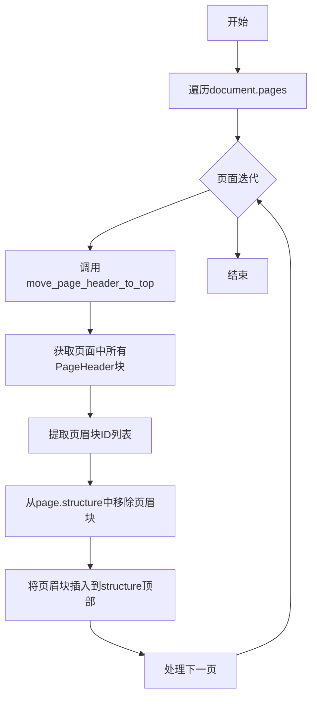
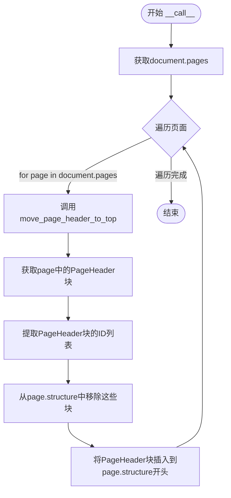
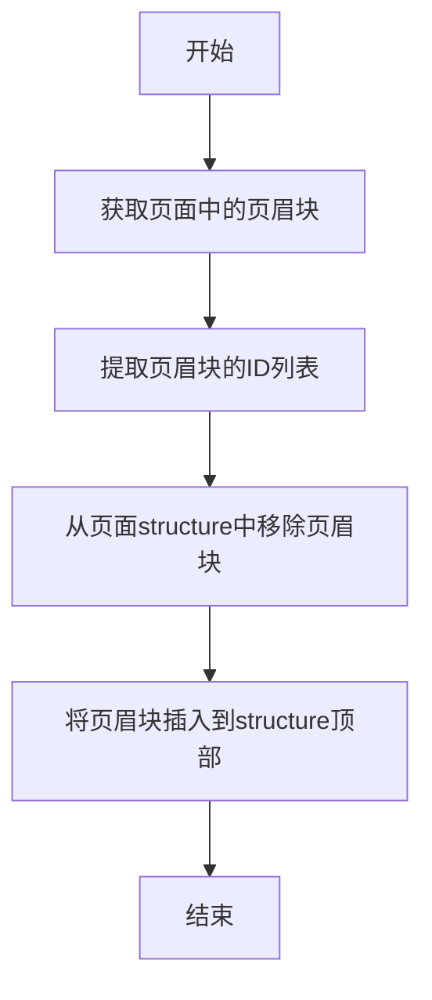

# `marker\marker\processors\page_header.py` 详细设计文档

这是一个页眉处理器，用于将文档页面中的页眉（PageHeader）块移动到页面结构的顶部。该处理器继承自BaseProcessor，遍历文档的所有页面，提取页眉块并将其从原位置移除，然后插入到页面结构的最前面，确保页眉始终显示在页面内容之前。

## 整体流程



## 类结构

```
BaseProcessor (抽象基类)
└── PageHeaderProcessor
```

## 全局变量及字段


### `PageHeaderProcessor.block_types`
    
指定处理的块类型，为(BlockTypes.PageHeader,)

类型：`tuple`
    


### `PageHeaderProcessor.__call__`
    
实现处理器调用接口，遍历文档所有页面并移动页眉

类型：`method`
    


### `PageHeaderProcessor.move_page_header_to_top`
    
将指定页面中的页眉块移动到结构顶部

类型：`method`
    
    

## 全局函数及方法


### `PageHeaderProcessor.__call__`

该方法是PageHeaderProcessor类的核心调用接口，实现了处理器的调用接口，遍历文档中的所有页面，并对每个页面调用`move_page_header_to_top`方法将页眉块移动到页面结构的顶部。

参数：

- `self`：PageHeaderProcessor，当前PageHeaderProcessor实例
- `document`：Document，包含所有页面内容的文档对象，用于访问所有页面并进行页眉块的移动操作

返回值：`None`，该方法没有返回值，通过直接修改document中页面的structure属性来完成页眉的移动

#### 流程图



#### 带注释源码

```python
def __call__(self, document: Document):
    """
    实现处理器的调用接口，遍历文档所有页面并移动页眉
    """
    # 遍历文档中的所有页面
    for page in document.pages:
        # 对每个页面调用move_page_header_to_top方法
        # 将该页面的页眉块移动到页面结构的顶部
        self.move_page_header_to_top(page, document)
```


### `PageHeaderProcessor.move_page_header_to_top`

将指定页面（PageGroup）中的所有页眉块（PageHeader）从原位置移除，并插入到页面结构的最顶部，确保页眉始终显示在页面内容的开始位置。

参数：

- `self`：隐式参数，PageHeaderProcessor 实例，调用该方法的对象本身
- `page`：`PageGroup`，目标页面对象，包含页面内容和结构信息
- `document`：`Document`，整个文档对象，用于访问页面中的块数据

返回值：`None`，该方法直接修改 `page` 和 `document` 的内部状态，无返回值

#### 流程图



#### 带注释源码

```python
def move_page_header_to_top(self, page: PageGroup, document: Document):
    """
    将指定页面中的页眉块移动到页面结构的顶部
    
    Args:
        page: PageGroup, 目标页面对象
        document: Document, 文档对象，用于访问块数据
    """
    # 1. 获取页面中包含的所有页眉块（根据block_types过滤）
    page_header_blocks = page.contained_blocks(document, self.block_types)
    
    # 2. 从页眉块列表中提取所有块的ID
    page_header_block_ids = [block.id for block in page_header_blocks]
    
    # 3. 从页面的structure列表中移除这些页眉块
    # 注意：remove操作会从列表中删除这些元素
    for block_id in page_header_block_ids:
        page.structure.remove(block_id)
    
    # 4. 将页眉块ID列表插入到structure的最前面（索引0位置）
    # 使用切片赋值实现头部插入
    page.structure[:0] = page_header_block_ids
```

## 关键组件


### PageHeaderProcessor

页眉处理器类，继承自BaseProcessor，用于将文档中所有页面的PageHeader块移动到页面结构的顶部。

### BaseProcessor

处理器基类，定义了处理器的接口规范，所有具体处理器需继承该类并实现__call__方法。

### BlockTypes.PageHeader

页眉块类型枚举值，用于标识文档中的页眉元素，处理器通过该类型筛选页眉块。

### Document

文档模型类，包含pages属性存储页面集合，提供contained_blocks等方法用于访问文档内容。

### PageGroup

页面组模型类，代表单个页面，包含structure属性存储页面结构块列表，提供contained_blocks方法获取特定类型的块。

### move_page_header_to_top

页眉移动方法，接收PageGroup和Document对象，将指定页面中的所有页眉块ID从原位置移除，并插入到页面结构的最前端。

### contained_blocks

块过滤方法，根据传入的块类型元组筛选当前容器内所有指定类型的块，返回块对象列表。

### page.structure

页面结构属性，存储页面中所有块的顺序列表，支持通过切片操作修改块顺序。


## 问题及建议


### 已知问题

- 缺少错误处理：未对 `page`、`document`、`page_header_blocks` 等关键对象进行空值或类型检查，可能在数据异常时抛出难以追踪的异常
- `move_page_header_to_top` 方法没有返回值注释，语义不明确
- 缺少日志记录：操作过程没有任何日志输出，难以追踪调试和问题排查
- `block_types` 作为类属性硬编码，扩展性差，若需处理多种 BlockType 需要修改类定义
- 代码可读性：变量名过长（如 `page_header_block_ids`），可读性欠佳
- 没有单元测试友好设计：依赖的具体类（`Document`、`PageGroup`）难以在单元测试中 mock

### 优化建议

- 添加参数校验和异常处理：检查 `document`、`page` 是否为有效对象，对空列表情况进行处理
- 为 `__call__` 和 `move_page_header_to_top` 方法添加明确的返回值类型注解和文档说明
- 引入日志记录：使用 `logging` 模块记录处理了多少页面、移动了多少 header 块
- 将 `block_types` 改为可配置参数，支持通过构造函数传入或配置文件中指定
- 提取中间变量时使用更清晰的命名，如 `header_ids`
- 考虑将 `Document` 和 `PageGroup` 的依赖通过接口抽象，提高可测试性
- 评估列表切片插入 `page.structure[:0] = ...` 的性能，对于大型文档可考虑使用 `collections.deque` 优化

## 其它


### 设计目标与约束

- **设计目标**：将文档中每个页面的PageHeader块移动到页面结构的顶部，确保页面标题在渲染时显示在最先位置
- **设计约束**：
  - 仅处理BlockTypes.PageHeader类型的块
  - 依赖于document对象具有pages属性和contained_blocks方法
  - 依赖于PageGroup对象具有structure属性且支持切片赋值

### 错误处理与异常设计

- **潜在异常场景**：
  - document.pages为None或空列表时不会报错，for循环自然跳过
  - page.contained_blocks返回空列表时，page_header_block_ids为空，后续操作均为空操作，不会报错
  - 如果block_id不在page.structure中，remove操作会抛出ValueError
- **异常处理方式**：代码未显式处理异常，建议添加try-except捕获ValueError，或在remove前验证block_id存在性

### 数据流与状态机

- **数据流**：
  - 输入：Document对象
  - 处理过程：遍历Document.pages → 获取每页的PageHeader块 → 移除原位置块 → 插入到structure头部
  - 输出：修改Document对象中PageGroup的structure属性
- **状态机**：无复杂状态机，仅为简单的线性处理流程

### 外部依赖与接口契约

- **依赖的外部模块**：
  - marker.processors.BaseProcessor：基类，提供处理器框架
  - marker.schema.BlockTypes：枚举类型，定义块类型常量
  - marker.schema.document.Document：文档数据模型
  - marker.schema.groups.page.PageGroup：页面组数据模型
- **接口契约**：
  - BaseProcessor.__call__(document: Document)：处理器入口方法
  - PageGroup.contained_blocks(document, block_types)：获取指定类型的块列表
  - PageGroup.structure：列表结构，支持remove方法和切片赋值

### 性能考虑与优化空间

- **当前性能特征**：O(n)时间复杂度，n为总块数，每次操作涉及列表remove和切片赋值
- **优化建议**：
  - 批量移除操作可以优化：先移除所有块再统一插入，避免多次列表操作
  - 可以考虑使用deque替代list提高插入性能
  - 对于大型文档可考虑缓存page_header_block_ids

### 测试考虑

- **建议测试场景**：
  - 单页文档含PageHeader
  - 多页文档每页含PageHeader
  - 页面无PageHeader的情况
  - 页面含多个PageHeader的情况
  - PageHeader在结构中间和末尾的情况

### 版本兼容性考虑

- **Python版本**：需确认Python版本兼容性
- **依赖库版本**：需明确marker库版本要求，确保API兼容性


    