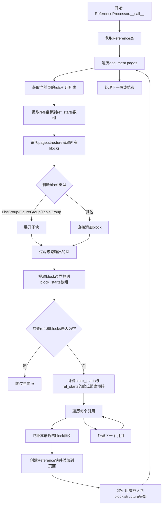
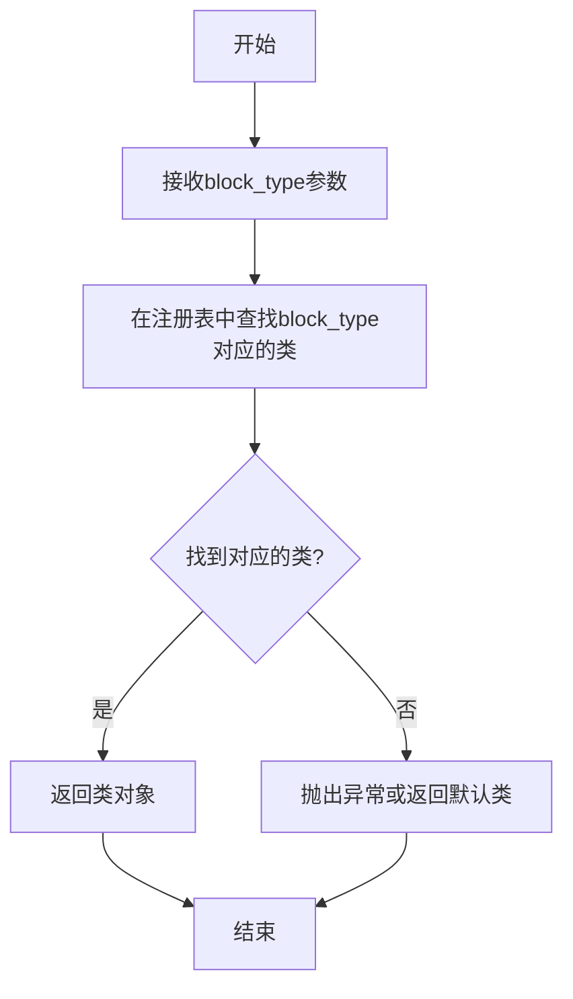
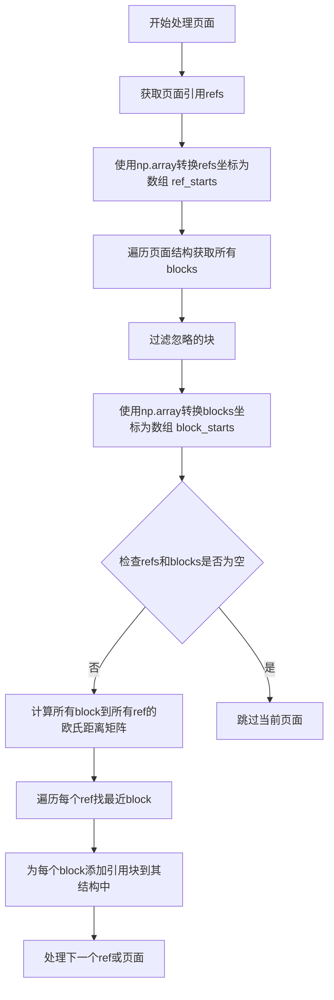
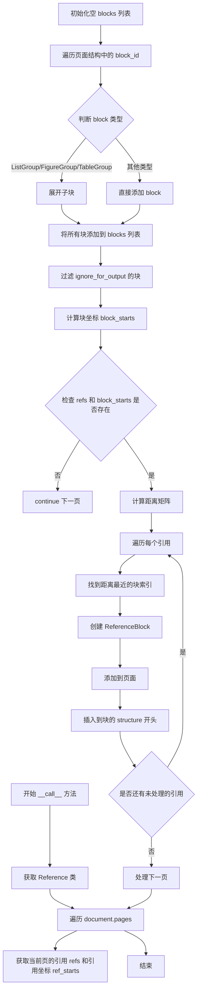
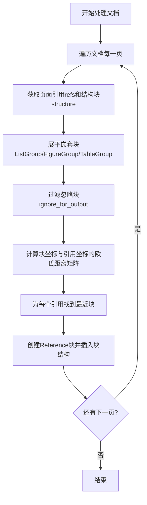

# `marker\marker\processors\reference.py` 详细设计文档

该文件实现了一个ReferenceProcessor类，用于在文档渲染输出时为列表、图表、表格等块添加引用标记。它通过计算引用坐标与文档块坐标之间的欧氏距离，将引用与最近的文档块关联起来，并在目标块的structure头部插入引用块。

## 整体流程



## 类结构

```
BaseProcessor (基类)
└── ReferenceProcessor (文档引用处理器)
```

## 全局变量及字段


### `ReferenceClass`
    
从block类注册表获取的Reference块类型，用于创建引用块实例

类型：`Reference`
    


### `refs`
    
当前页面中的引用对象列表，包含引用的坐标和文本信息

类型：`List[Reference]`
    


### `ref_starts`
    
所有引用的坐标数组，用于计算与文档块的距离

类型：`np.ndarray`
    


### `blocks`
    
当前页面中所有需要处理的文档块列表，包含文本、列表、图表等块

类型：`List[Block]`
    


### `block_starts`
    
所有文档块的边界框起始坐标数组，用于与引用进行位置匹配

类型：`np.ndarray`
    


### `distances`
    
文档块与引用之间的欧几里得距离矩阵，用于确定每个引用所属的文档块

类型：`np.ndarray`
    


### `ref_idx`
    
当前正在处理的引用在引用列表中的索引值

类型：`int`
    


### `block_idx`
    
与当前引用距离最近的文档块在块列表中的索引值

类型：`int`
    


### `block`
    
当前被匹配到的文档块对象，引用将被添加到这个块的结构中

类型：`Block`
    


### `ref_block`
    
新创建的引用块对象，包含引用文本和位置信息，并被添加到页面中

类型：`Reference`
    


### `ReferenceProcessor.config`
    
继承自BaseProcessor的配置对象，用于处理器的初始化配置

类型：`object`
    
    

## 全局函数及方法


### `get_block_class`

该函数是Marker库中的一个注册表查询函数，用于根据BlockTypes枚举值动态获取对应的文档块类。它在ReferenceProcessor中被用于获取Reference类，以便动态创建引用块实例。

参数：

- `block_type`：`BlockTypes`，BlockTypes枚举值，指定要获取的块类型（如BlockTypes.Reference、BlockTypes.Text等）

返回值：`type`，返回对应的块类类型，如Reference类、Text类等，用于后续实例化文档块对象

#### 流程图



#### 带注释源码

```python
# 从marker.schema.registry模块导入get_block_class函数
# 该函数是注册表模式的具体实现，用于将BlockTypes枚举映射到具体的块类

# 使用示例（在ReferenceProcessor中）：
# 获取Reference类型的块类
ReferenceClass: Reference = get_block_class(BlockTypes.Reference)

# 参数说明：
# - BlockTypes.Reference: 枚举值，表示引用类型的块
# 
# 返回值：
# - Reference: 一个类对象（不是实例），可以用于创建Reference类型的块实例
# 
# 函数内部逻辑（推测）：
# 1. 维护一个字典映射：{BlockTypes枚举值: 对应的类}
# 2. 根据传入的block_type参数查找对应的类
# 3. 返回找到的类对象，如果未找到则抛出KeyError异常
```

#### 额外说明

**在ReferenceProcessor中的使用方式**：

```python
# 在ReferenceProcessor.__call__方法中
ReferenceClass: Reference = get_block_class(BlockTypes.Reference)

# 动态获取Reference类后，创建Reference块实例
ref_block = page.add_full_block(ReferenceClass(
    ref=refs[ref_idx].ref,
    polygon=block.polygon,
    page_id=page.page_id
))
```

**设计目的**：
- 实现策略模式，允许动态加载和创建不同类型的文档块
- 解耦代码，避免硬编码块类引用
- 提供灵活的扩展性，便于添加新的块类型

**潜在优化空间**：
- 考虑添加缓存机制，避免重复查找
- 可以添加类型验证，确保返回的类继承自基类
- 错误处理可以更加友好，提供更清晰的错误信息


### `np.array` (在 ReferenceProcessor.__call__ 中的两次调用)

该函数用于将Python列表转换为NumPy数组，以便进行高效的数值计算和矩阵操作。在`ReferenceProcessor`类中主要用于将引用坐标和块坐标转换为数组，以便计算两点之间的欧氏距离并找到最近的匹配块。

参数：

- 第一次调用 `ref_starts = np.array([ref.coord for ref in refs])`：
  - `ref.coord`：`list` 或 `tuple`，引用对象的坐标属性
- 第二次调用 `block_starts = np.array([block.polygon.bbox[:2] for block in blocks])`：
  - `block.polygon.bbox[:2]`：`list` 或 `tuple`，内容块的多边形边界框的前两个坐标点

返回值：`numpy.ndarray`，返回转换后的NumPy数组对象

#### 流程图



#### 带注释源码

```python
import numpy as np  # 导入NumPy库，用于数值计算

from marker.processors import BaseProcessor
from marker.schema import BlockTypes
from marker.schema.blocks import Reference
from marker.schema.document import Document
from marker.schema.groups.list import ListGroup
from marker.schema.groups.table import TableGroup
from marker.schema.registry import get_block_class
from marker.schema.groups.figure import FigureGroup


class ReferenceProcessor(BaseProcessor):
    """
    A processor for adding references to the document.
    用于为文档添加引用的处理器类
    """

    def __init__(self, config):
        super().__init__(config)  # 调用父类构造函数

    def __call__(self, document: Document):
        ReferenceClass: Reference = get_block_class(BlockTypes.Reference)  # 获取引用块类

        for page in document.pages:  # 遍历文档每一页
            refs = page.refs  # 获取页面所有引用
            # 第一次使用np.array：将引用坐标列表转换为NumPy数组
            # ref.coord 是每个引用对象的坐标属性，转换为数组后便于后续矩阵计算
            ref_starts = np.array([ref.coord for ref in refs])

            blocks = []
            for block_id in page.structure:  # 遍历页面结构中的块ID
                block = page.get_block(block_id)
                # 如果是列表组、图表组或表格组，则展开其子块
                if isinstance(block, (ListGroup, FigureGroup, TableGroup)):
                    blocks.extend([page.get_block(b) for b in block.structure])
                else:
                    blocks.append(block)
            # 过滤掉不参与输出的块
            blocks = [b for b in blocks if not b.ignore_for_output]

            # 第二次使用np.array：将块的多边形边界框坐标转换为NumPy数组
            # block.polygon.bbox[:2] 取边界框的前两个坐标点(x, y)作为块的位置
            block_starts = np.array([block.polygon.bbox[:2] for block in blocks])

            # 如果没有引用或块，则跳过处理
            if not (len(refs) and len(block_starts)):
                continue

            # 计算每个块到每个引用的欧氏距离矩阵
            # 使用NumPy广播机制：block_starts[:, np.newaxis, :] - ref_starts[np.newaxis, :, :]
            # 得到形状为 (num_blocks, num_refs, 2) 的三维差值数组
            # axis=2 对最后一个维度(坐标x,y)求范数，得到 (num_blocks, num_refs) 的距离矩阵
            distances = np.linalg.norm(block_starts[:, np.newaxis, :] - ref_starts[np.newaxis, :, :], axis=2)
            
            # 遍历每个引用
            for ref_idx in range(len(ref_starts)):
                # 找到距离当前引用最近的块的索引
                block_idx = np.argmin(distances[:, ref_idx])
                block = blocks[block_idx]

                # 创建引用块并添加到页面
                ref_block = page.add_full_block(ReferenceClass(
                    ref=refs[ref_idx].ref,  # 引用的文本内容
                    polygon=block.polygon,  # 使用最近块的 polygon
                    page_id=page.page_id
                ))
                # 如果块没有结构，则初始化为空列表
                if block.structure is None:
                    block.structure = []
                # 将引用块插入到块结构的第一个位置
                block.structure.insert(0, ref_block.id)
```

#### 关键组件信息

| 名称 | 描述 |
|------|------|
| `ReferenceProcessor` | 文档引用处理器，负责将引用与最近的文档块关联 |
| `ref_starts` | NumPy数组，存储所有引用的坐标位置 |
| `block_starts` | NumPy数组，存储所有内容块的边界框坐标 |
| `distances` | NumPy二维数组，存储每个块到每个引用的欧氏距离 |
| `np.linalg.norm` | NumPy函数，用于计算向量范数（欧氏距离） |
| `np.argmin` | NumPy函数，用于找到最小值的索引 |

#### 潜在的技术债务或优化空间

1. **距离计算效率**：当前使用嵌套循环计算所有块到所有引用的距离，对于大型文档可能存在性能瓶颈，可考虑使用KD-Tree等空间索引结构优化
2. **坐标系统假设**：代码假设`ref.coord`和`block.polygon.bbox[:2]`具有相同的坐标系统，未进行显式验证
3. **错误处理缺失**：未对`refs`或`blocks`为空的情况进行详细日志记录，可能导致调试困难
4. **硬编码逻辑**：距离计算逻辑直接嵌入方法中，可考虑抽象为独立函数以提高可测试性
5. **类型注解不完整**：部分变量如`refs`、`blocks`缺少类型注解

#### 其它项目

**设计目标与约束**：
- 主要目标：为文档中的每个引用找到其对应的视觉最近内容块
- 约束：引用必须关联到非忽略输出块（`not b.ignore_for_output`）

**错误处理与异常设计**：
- 当`refs`或`blocks`为空时，使用`continue`跳过当前页面处理
- 未捕获可能从`page.get_block()`、`page.add_full_block()`抛出的异常

**数据流与状态机**：
- 输入：Document对象 → 遍历pages → 获取refs和blocks
- 处理：将refs和blocks坐标转换为NumPy数组 → 计算距离矩阵 → 贪心匹配最近块
- 输出：修改page.blocks结构，在每个匹配块的结构开头插入引用块

**外部依赖与接口契约**：
- 依赖`marker.schema`模块中的Document、BlockTypes等类
- 依赖NumPy库进行数值计算
- 依赖`get_block_class`工厂函数获取具体的Reference类实现


### `np.linalg.norm`

该函数是 NumPy 线性代数模块中的核心函数，用于计算矩阵或向量的范数（Norm）。在当前代码中，它被用于计算文档中每个 block（文本块）与每个 reference（引用标记）之间的欧几里得距离，以便将引用标记与其最近的内容块关联起来。

参数：

- `x`：`numpy.ndarray`（广播后的坐标差数组），由 `block_starts[:, np.newaxis, :] - ref_starts[np.newaxis, :, :]` 计算得出，表示所有文本块与所有引用标记之间的坐标差值
- `ord`：`int or None`，默认为 None，表示计算 L2 范数（欧几里得距离）
- `axis`：`int`，指定沿哪个轴计算范数，此处为 `2`，表示计算每对坐标差的欧几里得距离

返回值：`numpy.ndarray`，返回一个二维数组，形状为 `(len(block_starts), len(ref_starts))`，其中每个元素表示对应文本块到对应引用标记的欧几里得距离。

#### 流程图

```mermaid
flowchart TD
    A[开始计算 distances] --> B[计算坐标差矩阵<br/>block_starts[:, np.newaxis, :]<br/>- ref_starts[np.newaxis, :, :]]
    B --> C[调用 np.linalg.norm<br/>axis=2 计算欧几里得距离]
    C --> D[返回 2D 距离矩阵<br/>shape: num_blocks x num_refs]
    D --> E[对每个 ref_idx 找最小距离的 block_idx]
    E --> F[结束]
```

#### 带注释源码

```python
# distances 是一个 2D NumPy 数组，形状为 (block数量, ref数量)
# 每一行代表一个 block 到所有 ref 的距离
# 每一列代表一个 ref 到所有 block 的距离
distances = np.linalg.norm(
    # 广播操作：block_starts[:, np.newaxis, :] 的形状为 (num_blocks, 1, 2)
    # ref_starts[np.newaxis, :, :] 的形状为 (1, num_refs, 2)
    # 相减结果形状为 (num_blocks, num_refs, 2)，表示每个 block 与每个 ref 的坐标差
    block_starts[:, np.newaxis, :] - ref_starts[np.newaxis, :, :],
    axis=2  # 沿最后一个轴（坐标维度）计算 L2 范数，即 sqrt(x² + y²)
)
```


### `np.argmin` (在 `ReferenceProcessor.__call__` 中使用)

此函数用于在给定参考点的情况下，通过计算欧几里得距离找到最近的文本块索引，从而将引用（reference）正确关联到对应的文档块。

参数：

- `distances[:, ref_idx]`：`numpy.ndarray`，表示所有文本块到当前参考点的欧几里得距离数组

返回值：`int`，返回距离数组中最小值对应的索引，即距离最近的文本块在列表中的位置索引

#### 流程图

```mermaid
flowchart TD
    A[开始] --> B[获取 distances 数组<br/>形状: (block数量, ref数量)]
    B --> C[根据 ref_idx 提取列<br/>distances[:, ref_idx]
    获取当前参考点所有距离]
    C --> D[调用 np.argmin<br/>找到最小距离的索引]
    D --> E[使用 block_idx 获取对应文本块]
    E --> F[结束]
```

#### 带注释源码

```python
# distances: numpy数组，形状为 (block_starts的数量, ref_starts的数量)
# 存储每个文本块到每个参考点的欧几里得距离
distances = np.linalg.norm(
    block_starts[:, np.newaxis, :] -  # 所有文本块的坐标 [num_blocks, 1, 2]
    ref_starts[np.newaxis, :, :],     # 所有参考点的坐标 [1, num_refs, 2]
    axis=2                            # 计算每对的欧几里得距离
)

# 遍历每个参考点
for ref_idx in range(len(ref_starts)):
    # np.argmin: 找到距离数组中最小值的索引
    # 参数: distances[:, ref_idx] - 当前参考点与所有文本块的距离数组
    # 返回: 最小距离对应的文本块索引
    block_idx = np.argmin(distances[:, ref_idx])
    
    # 获取距离最近的文本块对象
    block = blocks[block_idx]
    
    # 创建引用块并插入到文本块结构的首位
    ref_block = page.add_full_block(ReferenceClass(
        ref=refs[ref_idx].ref,
        polygon=block.polygon,
        page_id=page.page_id
    ))
    if block.structure is None:
        block.structure = []
    block.structure.insert(0, ref_block.id)
```

#### 补充说明

| 项目 | 描述 |
|------|------|
| **使用场景** | 将文档中的引用（reference）与最近的文本块关联 |
| **计算逻辑** | 使用 L2 范数（欧几里得距离）计算两点间距离 |
| **关联依据** | 引用在文档中的坐标位置与文本块的几何位置进行空间匹配 |
| **潜在优化** | 当参考点或文本块数量较大时，可考虑使用空间索引结构（如 R-Tree）优化最近邻搜索性能 |


### `ReferenceProcessor.__init__`

初始化参考处理器，调用父类构造函数完成基础配置。

参数：

-  `config`：配置对象，传递给父类 `BaseProcessor` 的配置参数，用于初始化处理器的配置信息

返回值：`None`，该方法不返回任何值，仅完成对象的初始化操作

#### 流程图

```mermaid
flowchart TD
    A[开始 __init__] --> B[接收 config 参数]
    B --> C[调用 super().__init__config]
    C --> D[结束 __init__]
```

#### 带注释源码

```python
def __init__(self, config):
    """
    初始化 ReferenceProcessor 实例
    
    参数:
        config: 配置对象，用于初始化处理器的基础配置
    """
    # 调用父类 BaseProcessor 的构造函数，传递配置参数
    # 完成处理器的基类初始化逻辑
    super().__init__(config)
```


### `ReferenceProcessor.__call__`

该方法为核心引用处理方法，接收一个 Document 对象，遍历文档的每一页，获取页面中的引用（refs）和文档块（blocks），通过计算欧几里得距离将每个引用匹配到最近的文档块，然后创建引用块并将其插入到对应块的 structure 列表开头，从而实现将引用信息附加到相关文档块上。

参数：

- `document`：`Document`，待处理的文档对象，包含页面结构和引用信息

返回值：`None`，该方法直接修改文档对象，不返回任何值

#### 流程图



#### 带注释源码

```python
def __call__(self, document: Document):
    """
    处理文档中的引用，将引用与文档块进行匹配并关联
    
    参数:
        document: Document对象，包含待处理的页面和引用信息
    
    返回:
        None，直接修改document对象
    """
    # 从注册表获取Reference类的引用，用于后续创建引用块
    ReferenceClass: Reference = get_block_class(BlockTypes.Reference)

    # 遍历文档中的每一页
    for page in document.pages:
        # 获取当前页的所有引用及其坐标
        refs = page.refs
        ref_starts = np.array([ref.coord for ref in refs])

        # 收集当前页的所有文档块
        blocks = []
        for block_id in page.structure:
            # 获取块对象
            block = page.get_block(block_id)
            # 如果是列表组、图形组或表格组，需要展开其子块
            if isinstance(block, (ListGroup, FigureGroup, TableGroup)):
                blocks.extend([page.get_block(b) for b in block.structure])
            else:
                # 普通块直接添加
                blocks.append(block)
        
        # 过滤掉不需要输出的块
        blocks = [b for b in blocks if not b.ignore_for_output]

        # 提取所有块的起始坐标（使用边界框的左上角）
        block_starts = np.array([block.polygon.bbox[:2] for block in blocks])

        # 如果没有引用或块，跳过当前页的处理
        if not (len(refs) and len(block_starts)):
            continue

        # 计算每个块到每个引用的欧几里得距离矩阵
        # shape: (num_blocks, num_refs)
        distances = np.linalg.norm(
            block_starts[:, np.newaxis, :] -  # (num_blocks, 1, 2)
            ref_starts[np.newaxis, :, :],    # (1, num_refs, 2)
            axis=2
        )

        # 遍历每个引用，找到距离最近的块
        for ref_idx in range(len(ref_starts)):
            # 获取距离最近的块索引
            block_idx = np.argmin(distances[:, ref_idx])
            block = blocks[block_idx]

            # 创建引用块，使用匹配块的坐标信息
            ref_block = page.add_full_block(ReferenceClass(
                ref=refs[ref_idx].ref,          # 引用文本内容
                polygon=block.polygon,         # 使用匹配块的多边形区域
                page_id=page.page_id           # 页面ID
            ))

            # 确保块的structure属性存在
            if block.structure is None:
                block.structure = []
            
            # 将引用块插入到块结构的首位
            block.structure.insert(0, ref_block.id)
```

## 关键组件


### 一段话描述

ReferenceProcessor 是一个文档处理器，用于通过计算引用坐标与文档块坐标之间的欧氏距离，将引用（references）自动关联并附加到相应的文档块（如列表、图表、表格）上。

### 文件的整体运行流程

该文件定义了一个继承自 BaseProcessor 的 ReferenceProcessor 类。运行时，处理器接收一个 Document 对象，遍历文档的每一页，获取页面中的引用列表和结构块，计算引用坐标与块坐标之间的欧氏距离矩阵，找到每个引用最近的块，创建 Reference 块并将其插入到对应块的 structure 列表头部。

### 类的详细信息

#### ReferenceProcessor 类

**类字段：**

- `config`: 传入的配置对象，由基类 BaseProcessor 初始化使用

**类方法：**

##### `__init__(self, config)`

- 参数名称: `config`
- 参数类型: 任意配置类型
- 参数描述: 初始化处理器所需的配置对象
- 返回值类型: None
- 返回值描述: 无返回值，仅初始化基类和实例变量

##### `__call__(self, document: Document)`

- 参数名称: `document`
- 参数类型: `Document`
- 参数描述: 待处理的文档对象，包含页面结构和引用信息
- 返回值类型: None
- 返回值描述: 无返回值，直接修改文档对象的内部状态

- **mermaid 流程图:**


- **带注释源码:**
```python
def __call__(self, document: Document):
    # 获取引用块的类类型
    ReferenceClass: Reference = get_block_class(BlockTypes.Reference)

    # 遍历文档中的每一页
    for page in document.pages:
        refs = page.refs  # 当前页的所有引用
        # 将引用坐标转换为numpy数组便于计算
        ref_starts = np.array([ref.coord for ref in refs])

        blocks = []
        # 遍历页面结构中的所有块ID
        for block_id in page.structure:
            block = page.get_block(block_id)
            # 如果是列表组、图表组或表格组，展开其内部块
            if isinstance(block, (ListGroup, FigureGroup, TableGroup)):
                blocks.extend([page.get_block(b) for b in block.structure])
            else:
                blocks.append(block)
        
        # 过滤掉不参与输出的块
        blocks = [b for b in blocks if not b.ignore_for_output]

        # 将块的坐标转换为numpy数组
        block_starts = np.array([block.polygon.bbox[:2] for block in blocks])

        # 如果没有引用或块，跳过该页
        if not (len(refs) and len(block_starts)):
            continue

        # 计算所有块到所有引用的欧氏距离矩阵
        # 形状: [num_blocks, num_refs, 2] -> 欧氏距离
        distances = np.linalg.norm(
            block_starts[:, np.newaxis, :] - 
            ref_starts[np.newaxis, :, :], 
            axis=2
        )
        
        # 为每个引用找到距离最近的块
        for ref_idx in range(len(ref_starts)):
            block_idx = np.argmin(distances[:, ref_idx])
            block = blocks[block_idx]

            # 创建引用块并添加到页面
            ref_block = page.add_full_block(ReferenceClass(
                ref=refs[ref_idx].ref,  # 引用内容
                polygon=block.polygon,  # 使用目标块的坐标
                page_id=page.page_id
            ))
            
            # 确保目标块有structure属性
            if block.structure is None:
                block.structure = []
            # 将引用块插入到块结构的最前面
            block.structure.insert(0, ref_block.id)
```

### 关键组件信息

#### 1. ReferenceProcessor

文档引用处理器核心类，负责将引用与文档块进行空间关联。

#### 2. 坐标匹配引擎

使用 NumPy 实现的高效空间距离计算组件，通过广播机制计算所有块与引用之间的欧氏距离矩阵。

#### 3. 块展平器

负责将嵌套的 ListGroup、FigureGroup、TableGroup 结构展开为扁平化的块列表，以便统一处理。

#### 4. Reference 块创建器

负责根据引用信息和目标块的坐标创建新的 Reference 块，并将其插入到目标块的 structure 列表头部。

### 潜在的技术债务或优化空间

1. **距离计算效率**：当前实现对所有块和引用计算完整的距离矩阵，当块数量较多时空间复杂度为 O(n*m)，可考虑使用 KD-tree 或 BSP 等空间索引结构优化最近邻搜索。

2. **坐标精度**：使用 `block.polygon.bbox[:2]` 仅取边界框左上角坐标，可能导致匹配不准确，建议使用块的质心或完整多边形进行距离计算。

3. **引用与块的一对一假设**：代码假设引用数量与目标块一一对应，多个引用指向同一块或一个引用指向多个块的情况未处理。

4. **错误处理缺失**：未对 `page.get_block()` 返回 None、坐标数组为空等情况进行详细异常处理。

5. **硬编码过滤条件**：过滤 `ignore_for_output` 的逻辑硬编码在方法内部，可考虑提取为可配置选项。

### 其它项目

#### 设计目标与约束

- **目标**：实现文档中引用（references）与视觉块（blocks）的自动空间关联
- **约束**：依赖 marker 框架的 Document、Block、Page 数据模型

#### 错误处理与异常设计

- 当前仅通过 `if not (len(refs) and len(block_starts)): continue` 进行基本空值检查
- 缺少对无效坐标、缺失属性、类型错误等异常情况的处理

#### 数据流与状态机

- 输入：Document 对象（包含 Page 列表，每个 Page 包含 refs 和 structure）
- 处理：遍历页 → 获取引用 → 获取块 → 计算距离 → 匹配最近块 → 插入引用块
- 输出：修改后的 Document 对象（引用块被添加到对应块的 structure 中）

#### 外部依赖与接口契约

- **marker.processors.BaseProcessor**：基类，提供配置初始化和处理器接口
- **marker.schema.Document**：文档数据模型
- **marker.schema.blocks.Reference**：引用块类型
- **marker.schema.registry.get_block_class**：根据块类型获取类对象的注册表函数
- **marker.schema.groups.list.ListGroup**：列表组块类型
- **marker.schema.groups.figure.FigureGroup**：图表组块类型
- **marker.schema.groups.table.TableGroup**：表格组块类型
- **numpy**：用于高效的数组和距离计算操作


## 问题及建议


### 已知问题

-   **性能问题**：使用 `np.linalg.norm` 计算所有块与所有引用之间的欧氏距离，创建大型矩阵，对于包含大量块和引用的文档可能导致内存溢出
-   **算法冗余**：先计算完整的距离矩阵，然后在循环中逐个查找最小距离，效率低下
-   **缺乏错误处理**：没有对 `refs`、`page.structure`、`block.polygon` 等可能为 None 或空的情况进行校验
-   **潜在类型错误**：假设 `ref.coord` 存在且 `block.polygon.bbox` 至少有2个元素，未做类型检查
-   **嵌套列表遍历风险**：`block.structure` 可能为 None，在列表推导式中直接迭代可能导致异常
-   **变量命名不一致**：使用 `ref_starts` 和 `block_starts` 但实际提取的是坐标而非起始索引，命名具有误导性

### 优化建议

-   **算法优化**：使用 `np.argmin` 直接在距离计算过程中寻找最近邻，或考虑使用 KD-Tree 等空间索引算法降低复杂度
-   **分块处理**：对于大型文档，可以分批处理块以减少内存占用
-   **添加防御性校验**：在访问属性前检查是否存在，如 `if hasattr(ref, 'coord') and ref.coord is not None`
-   **缓存机制**：对于重复访问的页面块，可以考虑添加局部缓存
-   **类型提示完善**：为局部变量添加类型注解，提高代码可读性和可维护性
-   **提前过滤无效数据**：在计算距离前过滤掉 `polygon` 为 None 或 `bbox` 缺失的块，减少无效计算

## 其它


### 设计目标与约束

**设计目标**：实现文档引用(Reference)的自动关联功能，通过空间距离计算将引用(ref)匹配到最近的文档块(Block)，并在块结构中插入引用信息。

**设计约束**：
- 依赖marker框架的BaseProcessor基类
- 仅处理包含引用和块的页面
- 引用仅插入到ListGroup、FigureGroup、TableGroup的子块以及普通块的structure中
- 忽略标记为ignore_for_output的块

### 错误处理与异常设计

**异常处理机制**：
- 空引用或空块列表时直接continue跳过处理
- 使用np.linalg.norm进行距离计算时，确保数组维度匹配
- page.get_block可能返回None，但代码中未做空值检查
- block.structure可能为None，代码中已做初始化处理

**潜在风险**：
- 当refs数量与blocks数量不匹配时，可能导致引用匹配错误
- 距离计算使用欧几里得距离，对于跨页引用可能不准确

### 数据流与状态机

**输入数据流**：
- Document对象 → 遍历pages
- page.refs → 引用坐标列表
- page.structure → 块ID列表
- page.get_block() → 块对象

**处理状态机**：
1. 初始化状态：获取Reference类
2. 遍历页面：提取refs和blocks
3. 距离计算状态：计算每个block到每个ref的欧几里得距离
4. 匹配状态：为每个ref找到最近的block
5. 输出状态：创建Reference块并插入到block.structure

**输出数据流**：
- 修改Document对象（添加Reference块到page）
- 每个block的structure被修改（插入ref_block.id）

### 外部依赖与接口契约

**外部依赖**：
- `numpy`：数值计算和距离计算
- `marker.processors.BaseProcessor`：处理器基类
- `marker.schema.BlockTypes`：块类型枚举
- `marker.schema.blocks.Reference`：引用块类
- `marker.schema.document.Document`：文档类
- `marker.schema.groups.*`：列表、表格、图形组类
- `marker.schema.registry.get_block_class`：块类注册表获取函数

**接口契约**：
- `__call__(document: Document)`：输入Document对象，无返回值，直接修改document内部状态
- `__init__(config)`：继承自BaseProcessor的初始化方法

### 关键组件信息

- **ReferenceProcessor**：引用处理器类，负责引用与块的空间匹配
- **BaseProcessor**：处理器基类，定义处理器接口规范
- **Document**：文档容器，包含pages集合
- **Reference**：引用块类型，存储引用信息和位置
- **ListGroup/FigureGroup/TableGroup**：文档分组结构，用于组织块

### 潜在技术债务与优化空间

1. **算法优化**：当前使用O(n*m)的距离计算，可考虑空间索引（如KD树）优化
2. **异常处理不足**：缺少对page.get_block返回None的处理
3. **边界情况**：未处理refs数量大于blocks数量的情况
4. **可测试性**：直接依赖Document对象，建议增加单元测试接口
5. **文档完善**：缺少对特殊字符引用、多语言支持的考虑

### 性能考虑

- 使用numpy向量化操作替代Python循环，提高计算效率
- 块列表推导式中存在重复调用page.get_block，可缓存结果
- 距离矩阵可能占用较多内存，大文档场景需考虑分页处理

    