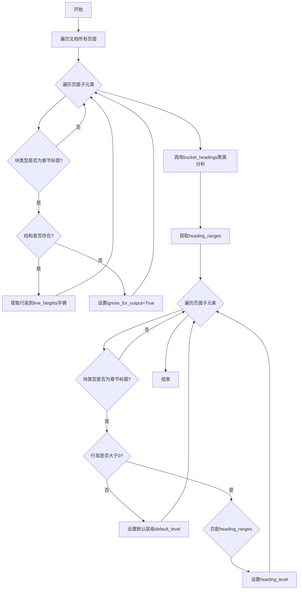

# `marker\marker\processors\sectionheader.py` 详细设计文档

这是一个文档章节标题识别处理器，通过分析文档中各元素的行高(line height)信息，使用KMeans聚类算法将标题分组，并确定每个标题的层级(level)。

## 整体流程



## 类结构

```
BaseProcessor (抽象基类)
└── SectionHeaderProcessor (章节标题处理器)
```

## 全局变量及字段


### `SectionHeaderProcessor.SectionHeaderProcessor.block_types`
    
处理的块类型，值为(BlockTypes.SectionHeader,)，用于指定该处理器负责处理的文档块类型

类型：`tuple`
    


### `SectionHeaderProcessor.SectionHeaderProcessor.level_count`
    
标题层级数量，默认为4，指定文档中最多识别的标题级别数量

类型：`Annotated[int, str]`
    


### `SectionHeaderProcessor.SectionHeaderProcessor.merge_threshold`
    
标题分组最小间距阈值，默认为0.25，用于判断两个标题是否属于同一组的最小高度差比例

类型：`Annotated[float, str]`
    


### `SectionHeaderProcessor.SectionHeaderProcessor.default_level`
    
默认标题层级，默认为2，当无法检测到标题级别时使用的备选层级

类型：`Annotated[int, str]`
    


### `SectionHeaderProcessor.SectionHeaderProcessor.height_tolerance`
    
标题最小高度容忍度，默认为0.99，用于判断文本行是否为标题的高度阈值乘数

类型：`Annotated[float, str]`
    


### `SectionHeaderProcessor.SectionHeaderProcessor.__call__`
    
主处理方法，接收Document对象，识别并设置文档中所有章节标题的层级

类型：`method`
    


### `SectionHeaderProcessor.SectionHeaderProcessor.bucket_headings`
    
使用KMeans聚类算法将标题行高分组，返回标题高度范围列表，用于确定不同层级标题的高度区间

类型：`method`
    
    

## 全局函数及方法


### `SectionHeaderProcessor.__call__`

该方法是 SectionHeaderProcessor 类的主处理方法，用于识别文档中的章节标题（SectionHeader）并根据其行高为每个标题分配适当的层级（heading_level）。方法首先遍历文档收集所有章节标题的行高信息，然后通过聚类算法将标题分组到不同层级，最后为每个标题块设置对应的层级。

参数：

- `self`：SectionHeaderProcessor，处理器实例自身
- `document`：Document，需要处理的文档对象，包含页面和块结构

返回值：`None`，该方法直接修改 document 中各 SectionHeader 块的 heading_level 属性，不返回任何值

#### 流程图

```mermaid
flowchart TD
    A[开始 __call__] --> B[初始化空字典 line_heights]
    B --> C[遍历 document.pages]
    C --> D[遍历 page.children]
    E{block.block_type in block_types?}
    E -->|否| D
    E -->|是| F{block.structure is not None?}
    F -->|是| G[line_heights[block.id] = block.line_height]
    F -->|否| H[line_heights[block.id] = 0 且设置 ignore_for_output = True]
    G --> I
    H --> I
    I[继续下一个块] --> D
    D --> J[将 line_heights 转为列表 flat_line_heights]
    J --> K[调用 bucket_headings 获取 heading_ranges]
    K --> L[再次遍历 document.pages]
    L --> M[遍历 page.children]
    N{block.block_type in block_types?}
    N -->|否| M
    N -->|是| O{block_height > 0?}
    O -->|否| P[设置 heading_level = default_level]
    O -->|是| Q[遍历 heading_ranges]
    Q --> R{block_height >= min_height * height_tolerance?}
    R -->|否| Q
    R -->|是| S[设置 heading_level = idx + 1 并跳出循环]
    P --> T
    S --> T[继续下一个块]
    T --> M
    M --> U[结束]
```

#### 带注释源码

```python
def __call__(self, document: Document):
    # 初始化字典用于存储每个章节标题块的行高
    line_heights: Dict[int, float] = {}
    
    # 第一次遍历：收集所有章节标题的行高信息
    for page in document.pages:
        # 遍历页面下的所有子块
        for block in page.children:
            # 仅处理 SectionHeader 类型的块
            if block.block_type not in self.block_types:
                continue
            
            # 检查块结构是否存在
            if block.structure is not None:
                # 存在则计算该块的行高并存储
                line_heights[block.id] = block.line_height(document)
            else:
                # 结构为空则设置行高为0，并标记不输出
                line_heights[block.id] = 0
                block.ignore_for_output = True  # 不输出空的章节标题

    # 将行高字典的值转换为列表，用于聚类分析
    flat_line_heights = list(line_heights.values())
    # 调用聚类方法将标题按高度分组到不同层级
    heading_ranges = self.bucket_headings(flat_line_heights)

    # 第二次遍历：为每个章节标题设置层级
    for page in document.pages:
        for block in page.children:
            if block.block_type not in self.block_types:
                continue
            
            # 获取当前块的行高
            block_height = line_heights.get(block.id, 0)
            
            # 如果块高度大于0，尝试匹配层级
            if block_height > 0:
                # 遍历计算出的层级范围
                for idx, (min_height, max_height) in enumerate(heading_ranges):
                    # 使用高度容差判断是否属于该层级
                    if block_height >= min_height * self.height_tolerance:
                        block.heading_level = idx + 1  # 层级从1开始
                        break

            # 如果未检测到层级，则使用默认层级
            if block.heading_level is None:
                block.heading_level = self.default_level
```


### `SectionHeaderProcessor.bucket_headings`

该函数使用KMeans聚类算法将文档中的标题行高数据进行聚类分析，通过计算聚类中心均值并结合合并阈值来识别不同级别的标题高度范围，最终返回按高度降序排列的标题范围列表。

参数：

- `line_heights`：`List[float]`，输入的标题行高列表，包含所有识别的标题行高值
- `num_levels`：`int` = 4，要聚类的级别数量，默认为4级标题

返回值：`List[tuple]`，返回标题高度范围列表，每个元素为(min_height, max_height)元组，表示一个标题级别的高度区间

#### 流程图

```mermaid
flowchart TD
    A([开始 bucket_headings]) --> B{len(line_heights) <= self.level_count?}
    B -->|是| C[返回空列表 []]
    B -->|否| D[将line_heights转换为numpy数组 reshape(-1,1)]
    D --> E[使用KMeans进行聚类 n_clusters=num_levels]
    E --> F[fit_predict获取labels]
    F --> G[合并data和labels为数组]
    G --> H[按label列排序数组]
    H --> I[计算每个聚类的平均值 cluster_means]
    I --> J[初始化变量: label_min=None, label_max=None, heading_ranges=[]]
    J --> K[遍历排序后的每一行]
    K --> L{当前label != prev_cluster?}
    L -->|是| M{cluster_mean * merge_threshold < prev_cluster_mean?}
    L -->|否| N[更新label_min和label_max]
    M -->|是| O[添加range到heading_ranges 重置label_min/label_max]
    M -->|否| N
    O --> P{还有更多行?}
    P -->|是| K
    P -->|否| Q[添加最后的label_min/label_max到heading_ranges]
    Q --> R[按降序排序heading_ranges]
    R --> S([返回 heading_ranges])
```

#### 带注释源码

```python
def bucket_headings(self, line_heights: List[float], num_levels=4):
    """
    使用KMeans聚类算法将标题行高分组，返回标题高度范围列表
    
    参数:
        line_heights: 标题行高列表
        num_levels: 聚类数量，默认为4
    
    返回:
        标题高度范围列表，每个元素为(min_height, max_height)元组
    """
    # 如果标题数量不足以进行聚类，直接返回空列表
    if len(line_heights) <= self.level_count:
        return []

    # 将行高列表转换为numpy数组并reshape为二维数组(每行一个特征)
    data = np.asarray(line_heights).reshape(-1, 1)
    
    # 使用KMeans聚类算法将行高分成num_levels个簇
    # random_state=0确保结果可复现，n_init="auto"自动选择初始化方法
    labels = KMeans(n_clusters=num_levels, random_state=0, n_init="auto").fit_predict(data)
    
    # 将数据值和对应的聚类标签合并成二维数组
    data_labels = np.concatenate([data, labels.reshape(-1, 1)], axis=1)
    
    # 按聚类标签排序，便于后续遍历时按组处理
    data_labels = np.sort(data_labels, axis=0)

    # 计算每个聚类的平均值: {label: mean_height}
    # 获取所有唯一标签并计算每个簇的均值
    cluster_means = {
        int(label): float(np.mean(data_labels[data_labels[:, 1] == label, 0])) 
        for label in np.unique(labels)
    }
    
    # 初始化变量用于追踪当前聚类的最小/最大高度
    label_max = None
    label_min = None
    heading_ranges = []  # 存储最终的标题范围
    prev_cluster = None  # 记录前一个聚类标签
    
    # 遍历排序后的数据，按聚类标签分组处理
    for row in data_labels:
        value, label = row  # 提取当前行的值和标签
        value = float(value)
        label = int(label)
        
        # 检测到聚类标签发生变化
        if prev_cluster is not None and label != prev_cluster:
            prev_cluster_mean = cluster_means[prev_cluster]
            cluster_mean = cluster_means[label]
            
            # 如果当前聚类的均值小于前一个聚类均值的合并阈值，
            # 说明是两个不同的标题级别，保存前一个范围
            if cluster_mean * self.merge_threshold < prev_cluster_mean:
                heading_ranges.append((label_min, label_max))
                label_min = None
                label_max = None

        # 更新当前聚类的最小和最大高度
        label_min = value if label_min is None else min(label_min, value)
        label_max = value if label_max is None else max(label_max, value)
        prev_cluster = label

    # 处理最后一个聚类的范围
    if label_min is not None:
        heading_ranges.append((label_min, label_max))

    # 按高度降序排序（较大的标题高度排在前面）
    heading_ranges = sorted(heading_ranges, reverse=True)

    return heading_ranges
```

## 关键组件


### SectionHeaderProcessor 类

主要处理器类，继承自 BaseProcessor，负责识别文档中的章节标题。遍历文档的页面和块，提取标题高度信息，并通过聚类算法确定标题级别。

### bucket_headings 方法

核心聚类方法，使用 KMeans 算法将标题高度聚类为多个级别。通过计算聚类均值，判断相邻聚类是否应该合并，最终返回标题高度范围列表。

### __call__ 方法

处理器入口点，遍历文档所有页面和子块，收集章节标题的高度信息，对非空标题应用级别判定逻辑，设置默认级别并标记空标题为忽略输出。

### 配置参数

- level_count: 标题级别数量（默认4）
- merge_threshold: 标题分组合并阈值（默认0.25）
- default_level: 默认标题级别（默认2）
- height_tolerance: 标题高度容差系数（默认0.99）

### KMeans 聚类逻辑

利用 scikit-learn 的 KMeans 算法对标题高度进行聚类，通过 n_clusters 参数指定聚类数量，random_state=0 确保可复现性，n_init="auto" 自动选择初始化方式。

### 标题级别判定逻辑

通过比较块高度与聚类得到的标题范围，使用 height_tolerance 系数进行容差匹配，按顺序遍历标题范围确定第一个匹配的级别。

### 空标题处理

当块结构为空时，设置 line_heights 为 0 并标记 ignore_for_output=True，避免输出空章节标题。

### 标题分组合并逻辑

比较相邻聚类的均值，当前一聚类均值大于后一聚类均值与 merge_threshold 的乘积时，认为是两个独立的标题组，否则合并处理。


## 问题及建议


### 已知问题

-   **重复遍历页面子元素**：代码中两次遍历 `page.children`（一次获取行高，一次设置标题级别），效率较低，可以合并为一次遍历
-   **KMeans聚类参数硬编码**：`n_init="auto"` 在新版sklearn中已弃用，且 `random_state=0` 硬编码导致结果不可配置
-   **聚类结果处理逻辑复杂且有缺陷**：`bucket_headings` 方法中 `data_labels` 的排序和遍历逻辑过于复杂，容易产生边界错误，且当标题数量少于等于 `level_count` 时直接返回空列表导致功能失效
-   **类型注解不完整**：`bucket_headings` 方法缺少返回类型注解，`num_levels` 参数也未使用类型注解
-   **阈值判断逻辑错误**：在确定标题级别时使用了 `min_height * self.height_tolerance`，但 `min_height` 变量在循环中未定义（应为 `min_height` 对应的实际值），这会导致比较逻辑错误
-   **空值处理不完善**：当 `line_heights` 字典为空或所有block都被标记为忽略时，`flat_line_heights` 为空列表，后续处理可能产生异常

### 优化建议

-   **合并遍历逻辑**：将两次遍历合并为一次，在获取行高的同时完成标题级别的设置
-   **提取配置参数**：将 KMeans 的 `n_init`、`random_state` 等参数提取为类属性或配置项，提高灵活性
-   **简化聚类处理逻辑**：重构 `bucket_headings` 方法，使用更清晰的数据结构和算法逻辑，可以考虑先对聚类中心排序，再构建 heading_ranges
-   **完善类型注解**：为所有方法添加完整的类型注解
-   **修复阈值判断**：修正 `block_height >= min_height * self.height_tolerance` 中的变量引用错误
-   **添加空值保护**：在 `bucket_headings` 开头添加对空列表的检查和处理

## 其它


### 设计目标与约束

本模块的设计目标是在文档解析过程中自动识别并分类不同层级的章节标题（Section Headers），通过分析文本块的行高（line height）特征，利用无监督聚类算法将标题划分为多个级别（默认为4级），从而为文档结构化提供基础支撑。设计约束包括：只处理BlockTypes.SectionHeader类型的块；依赖外部库sklearn的KMeans算法进行聚类；假设输入文档已经过预处理并包含有效的line_height信息；聚类结果受random_state=0固定，以确保可复现性。

### 错误处理与异常设计

代码中通过warnings.filterwarnings("ignore", category=ConvergenceWarning)忽略了sklearn聚类不收敛的警告，这是因为KMeans在某些边界情况下可能无法完全收敛但仍能提供可用结果。对于缺失的block.structure，代码设置block.ignore_for_output = True避免输出空标题块。当line_heights为空或数量不足时，bucket_headings方法返回空列表，调用处会为所有标题分配default_level。代码未显式抛出异常，错误通过默认值（default_level）和忽略机制处理，属于静默降级策略。

### 数据流与状态机

数据流分为三个阶段：第一阶段遍历所有页面收集SectionHeader块的line_height信息，存储在字典line_heights中；第二阶段调用bucket_headings对所有行高进行KMeans聚类，生成heading_ranges（按高度降序排列的聚类区间）；第三阶段再次遍历页面，根据block_height匹配heading_ranges确定heading_level，未匹配者使用default_level。状态机表现为：标题块从"未分类"状态经过"高度收集→聚类→级别匹配"流程后进入"已分类"状态，每个block的heading_level属性即为其最终状态。

### 外部依赖与接口契约

本模块依赖以下外部组件：numpy（数值计算）、sklearn.cluster.KMeans（聚类算法）、sklearn.exceptions.ConvergenceWarning（警告过滤）、marker.processors.BaseProcessor（处理器基类）、marker.schema.BlockTypes（块类型枚举）、marker.schema.document.Document（文档模型）。接口契约要求：输入的document参数必须为Document实例且已包含pages和children结构；每个block必须支持block_type、structure、id、line_height()、ignore_for_output、heading_level等属性；BaseProcessor的__call__方法约定返回None（原地修改document对象）。

### 性能考虑

时间复杂度主要来自两处：遍历所有页面和块的O(n)操作，其中n为总块数；KMeans聚类的O(k * n * i)复杂度，其中k为聚类数（默认4），i为迭代次数。空间复杂度为O(n)用于存储line_heights字典。优化建议包括：可考虑使用MiniBatchKMeans替代KMeans处理大规模文档；heading_ranges的计算结果可缓存以避免重复计算；可添加early return当没有SectionHeader块时直接跳过处理。

### 安全性考虑

代码本身不涉及用户输入直接处理，安全性风险较低。但需注意：random_state=0固定可能使攻击者可通过构造特定行高的文档来预测聚类结果；若document对象来自不可信来源，需验证block.id等属性的类型和取值范围以防止字典操作异常。

### 测试策略

建议测试场景包括：空文档处理（无页面或无SectionHeader块）；单个或少量标题块（应返回空ranges并分配default_level）；标题行高完全相同的情况（聚类可能产生不均匀分配）；标题行高呈连续分布的情况（测试merge_threshold的作用）；heading_level边界值的验证（height_tolerance的影响）；以及性能基准测试（大规模文档的处理时间）。

### 配置文件与参数设计

本模块暴露4个可配置参数（通过Annotated类型标注）：level_count（默认4）为聚类数量，代表标题级别数；merge_threshold（默认0.25）为聚类合并阈值，用于判断相邻聚类是否属于同一级别组；default_level（默认2）为未识别时的默认级别；height_tolerance（默认0.99）为高度匹配容忍度。参数设计符合直觉但缺乏边界值校验，建议添加取值范围约束（如level_count > 0, merge_threshold ∈ (0,1)）。

### 并发与线程安全

本模块为无状态处理器（状态仅来自初始化参数），理论上可安全并发使用。但需注意：Document对象本身可能被多线程共享修改，调用方需确保线程安全；numpy和sklearn的底层实现可能涉及全局状态，但single-threaded场景下可忽略。

### 日志与监控

代码目前无任何日志输出。建议添加的监控点包括：处理的文档数量和页面数；识别到的SectionHeader块数量；各heading_level的分布统计；KMeans聚类的迭代次数（用于检测ConvergenceWarning被忽略的情况）；处理耗时（用于性能基准分析）。


    