# `marker\marker\processors\table.py` 详细设计文档

TableProcessor是一个文档处理器，用于识别PDF文档中的表格。它结合了Surya深度学习模型进行表格检测和识别、pdftext进行PDF文本提取、以及OCR技术来处理各种表格结构，支持表格单元格的合并/分割、文本后处理等复杂操作，最终将处理后的表格结构添加到文档中。

## 整体流程

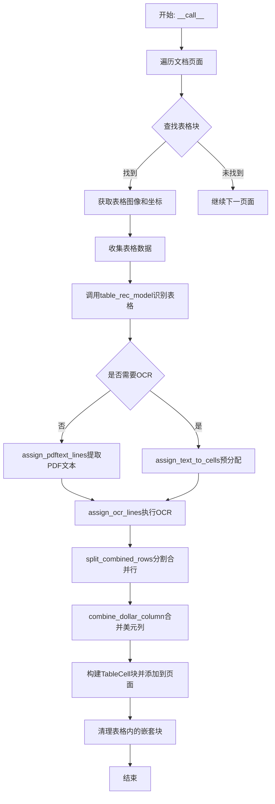

## 类结构

```
BaseProcessor (基类)
└── TableProcessor (表格处理器)
```

## 全局变量及字段


### `logger`
    
日志记录器，用于记录程序运行过程中的信息

类型：`Logger`
    


### `table_data`
    
表格数据列表，存储每个表格的图像、边界框和OCR状态

类型：`list`
    


### `tables`
    
表格识别结果列表，包含每个表格的单元格信息

类型：`List[TableResult]`
    


### `extract_blocks`
    
需要提取文本的表格块列表，用于存储待处理的表格数据

类型：`list`
    


### `cell_text`
    
单元格文本映射，存储文本行与单元格的对应关系

类型：`defaultdict`
    


### `ocr_tables`
    
需要OCR处理的表格列表

类型：`list`
    


### `ocr_polys`
    
需要进行OCR的多边形列表

类型：`list`
    


### `ocr_idxs`
    
需要进行OCR的表格索引列表

类型：`list`
    


### `filtered_polys`
    
过滤后的多边形列表，用于OCR识别

类型：`list`
    


### `TableProcessor.recognition_model`
    
OCR识别模型，用于识别表格中的文本内容

类型：`RecognitionPredictor`
    


### `TableProcessor.table_rec_model`
    
表格识别模型，用于识别表格的结构和单元格

类型：`TableRecPredictor`
    


### `TableProcessor.detection_model`
    
文本检测模型，用于检测表格中的文本位置

类型：`DetectionPredictor`
    


### `TableProcessor.table_rec_batch_size`
    
表格识别批大小

类型：`int`
    


### `TableProcessor.detection_batch_size`
    
文本检测批大小

类型：`int`
    


### `TableProcessor.recognition_batch_size`
    
文本识别批大小

类型：`int`
    


### `TableProcessor.contained_block_types`
    
表格内需移除的块类型列表

类型：`List[BlockTypes]`
    


### `TableProcessor.row_split_threshold`
    
行分割阈值

类型：`float`
    


### `TableProcessor.pdftext_workers`
    
pdftext工作线程数

类型：`int`
    


### `TableProcessor.disable_tqdm`
    
是否禁用tqdm进度条

类型：`bool`
    


### `TableProcessor.drop_repeated_table_text`
    
是否丢弃重复文本

类型：`bool`
    


### `TableProcessor.filter_tag_list`
    
OCR过滤标签列表

类型：`list`
    


### `TableProcessor.disable_ocr_math`
    
是否禁用OCR数学识别

类型：`bool`
    


### `TableProcessor.disable_ocr`
    
是否完全禁用OCR

类型：`bool`
    
    

## 全局函数及方法


### `fix_text`

该函数是 `ftfy` 库提供的文本修复函数，用于检测和修复文本中的编码问题（如 mojibake/乱码），特别是处理 UTF-8 编码错误、HTML 实体、不可见字符等问题。

参数：

-  `text`：`str`，需要修复的文本字符串

返回值：`str`，修复后的文本字符串

#### 流程图

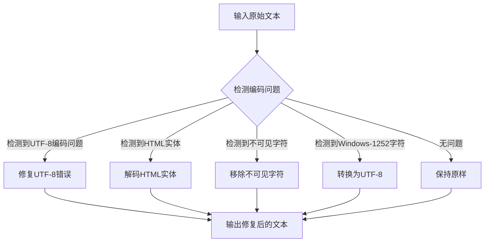

#### 带注释源码

```python
# fix_text 是 ftfy 库的核心函数，在此代码中用于修复表格单元格文本的编码问题
# 使用方式如下（在 TableProcessor.finalize_cell_text 方法中）：

text = self.normalize_spaces(fix_text(text))

# fix_text 函数的主要功能：
# 1. 修复常见的 mojibake（乱码）问题，例如将 "é" 还原为 "é"
# 2. 解码 HTML 实体，如 "&" -> "&"
# 3. 移除不可见字符和零宽字符
# 4. 修复 Windows-1252 编码的字符
# 5. 处理 BOM (Byte Order Mark) 问题
# 6. 修复被错误编码的引号和破折号

# 在此代码的上下文中：
# - 输入: 来自 OCR 或 PDF 的原始文本字符串
# - 输出: 清理和修复后的文本字符串
# - 配合 normalize_spaces 方法使用，将各种空白字符统一转换为普通空格
```

#### 在代码中的调用上下文

```python
def finalize_cell_text(self, cell: SuryaTableCell):
    fixed_text = []
    text_lines = cell.text_lines if cell.text_lines else []
    for line in text_lines:
        text = line["text"].strip()
        if not text or text == ".":
            continue
        # ... 其他文本清理正则表达式 ...
        
        # 核心调用：使用 fix_text 修复编码问题
        text = self.normalize_spaces(fix_text(text))
        fixed_text.append(text)
    return fixed_text
```

---

### 补充信息

#### 关键组件信息

| 组件名称 | 描述 |
|---------|------|
| `ftfy` | Python 文本修复库，专门用于修复编码问题 |
| `fix_text` | ftfy 库的主函数，自动检测和修复文本编码问题 |

#### 技术债务与优化空间

1. **依赖外部库**: `fix_text` 是外部依赖，如果 `ftfy` 库有重大变更或停止维护，可能需要寻找替代方案
2. **性能考虑**: 对于大量文本处理，`fix_text` 可能会带来一定的性能开销，可以考虑批量处理或缓存
3. **错误处理**: 建议添加对 `fix_text` 返回值的验证，确保修复后的文本符合预期格式

#### 设计目标与约束

- **目标**: 清理和标准化从 PDF/OCR 提取的文本，消除编码错误
- **约束**: 依赖于 `ftfy` 库的正确行为，需要确保输入是有效的字符串类型


# 详细设计文档提取结果

## 注意事项

**代码中未找到 `matrix_intersection_area` 函数的实际实现源码**。该函数是通过以下导入语句从 `marker.util` 模块引入的：

```python
from marker.util import matrix_intersection_area, unwrap_math
```

然而，我可以从**代码中对 `matrix_intersection_area` 的调用方式**来推断其功能、参数和返回值，并提供详细的分析文档。

---

### `matrix_intersection_area`

计算两组边界框（bounding box）之间的交集面积，返回交集矩阵或交集面积数组。主要用于检测文档元素之间的空间重叠关系，例如判断文本块是否位于表格单元格内。

参数：

-  `boxes1`：`List[List[float]]`，第一组边界框，每 个边界框为 `[x0, y0, x1, y1]` 格式的列表
-  `boxes2`：`List[List[float]]`，第二组边界框，每 个边界框为 `[x0, y0, x1, y1]` 格式的列表

返回值：`numpy.ndarray`，交集面积数组。如果 `boxes1` 有 n 个元素，`boxes2` 有 m 个元素，则返回一个 n×m 的二维数组，其中每个元素 `result[i][j]` 表示 `boxes1[i]` 与 `boxes2[j]` 的交集面积

#### 流程图

```mermaid
flowchart TD
    A[开始] --> B[接收两组边界框 boxes1 和 boxes2]
    B --> C[初始化结果矩阵 shape为lenboxes1 x lenboxes2]
    C --> D{遍历boxes1中的每个边界框i}
    D -->|是| E{遍历boxes2中的每个边界框j}
    E --> F[计算boxes1[i]与boxes2[j]的交集矩形]
    F --> G{交集矩形是否有效}
    G -->|是| H[计算交集面积]
    G -->|否| I[面积为0]
    H --> J[将面积存入结果矩阵i,j位置]
    I --> J
    J --> K[移动到下一个j]
    K --> E
    K --> L{遍历完所有j}
    L --> M[移动到下一个i]
    M --> D
    D -->|否| N[返回交集面积矩阵]
    N --> O[结束]
```

#### 调用场景分析

**场景1：在 `TableProcessor.__call__` 方法中**

```
intersections = matrix_intersection_area(
    [c.polygon.bbox for c in child_contained_blocks],
    [block.polygon.bbox],
)
```

用于判断子元素（如文本块）是否被表格完全包含。当交集百分比超过95%时，从页面结构中移除该子元素。

**场景2：在 `TableProcessor.assign_text_to_cells` 方法中**

```
intersection_matrix = matrix_intersection_area(
    text_line_bboxes, table_cell_bboxes
)
```

用于将PDF原始文本行分配到对应的表格单元格中。通过计算每行文本与每个单元格的交集面积，找到最佳匹配。

**场景3：在 `TableProcessor.align_table_cells` 方法中**

```
intersection_matrix = matrix_intersection_area(
    text_line_bboxes, table_cell_bboxes
)
```

用于对齐检测到的文本行与表格单元格，根据交集情况调整单元格多边形的大小。

#### 推测的带注释源码

```python
import numpy as np
from typing import List

def matrix_intersection_area(
    boxes1: List[List[float]], 
    boxes2: List[List[float]]
) -> np.ndarray:
    """
    计算两组边界框之间的交集面积。
    
    参数:
        boxes1: 第一组边界框列表，格式为 [[x0, y0, x1, y1], ...]
        boxes2: 第二组边界框列表，格式为 [[x0, y0, x1, y1], ...]
    
    返回:
        numpy数组，形状为 (len(boxes1), len(boxes2))，
        result[i][j] 表示 boxes1[i] 与 boxes2[j] 的交集面积
    """
    # 将边界框转换为numpy数组以便向量化计算
    boxes1 = np.array(boxes1)
    boxes2 = np.array(boxes2)
    
    # 获取边界框数量
    n = len(boxes1)
    m = len(boxes2)
    
    # 初始化结果矩阵
    result = np.zeros((n, m))
    
    # 逐个计算交集面积
    for i in range(n):
        for j in range(m):
            # 计算交集矩形的坐标
            x1 = max(boxes1[i][0], boxes2[j][0])  # 左边界
            y1 = max(boxes1[i][1], boxes2[j][1])  # 上边界
            x2 = min(boxes1[i][2], boxes2[j][2])  # 右边界
            y2 = min(boxes1[i][3], boxes2[j][3])  # 下边界
            
            # 计算交集宽度和高度
            width = max(0, x2 - x1)
            height = max(0, y2 - y1)
            
            # 计算交集面积
            result[i][j] = width * height
    
    return result
```

---

## 技术债务与优化空间

1. **外部依赖问题**：该函数作为核心工具函数，其实现对外部不可见，增加了维护难度
2. **重复调用**：在多个方法中重复调用此函数计算相同的交集，建议缓存结果
3. **算法优化**：当前实现为 O(n*m) 复杂度，对于大型文档可能存在性能瓶颈，可考虑使用空间索引（如 R-Tree）优化

---

如需获取 `matrix_intersection_area` 函数的确切实现源码，请提供 `marker/util.py` 文件的内容。


### `unwrap_math`

解包数学表达式，去除 LaTeX 数学环境的包装，将数学内容转换为普通文本格式。

参数：

- `text`：`str`，包含 LaTeX 数学表达式的文本字符串

返回值：`str`，去除数学环境包装后的纯文本内容

#### 流程图

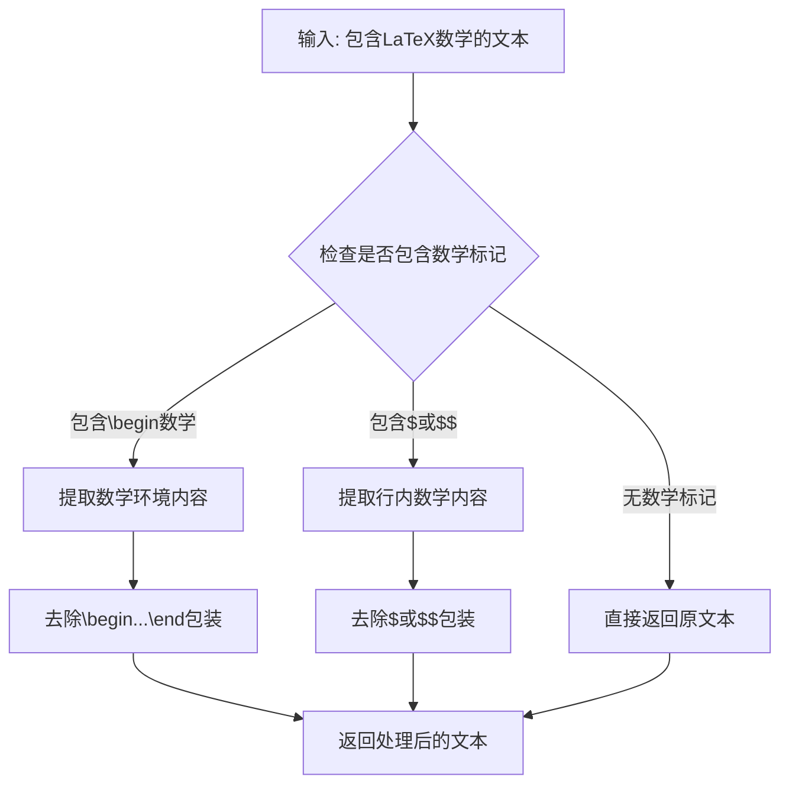

#### 带注释源码

```python
# 该函数定义在 marker.util 模块中
# 以下是基于使用场景的推断实现

import re

def unwrap_math(text: str) -> str:
    """
    解包数学表达式，去除LaTeX数学环境的包装
    
    参数:
        text: 包含LaTeX数学表达式的文本
        
    返回:
        去除数学环境包装后的文本
    """
    if not text:
        return text
    
    # 处理行内数学 $...$
    # 匹配 $...$ 格式（非贪婪）
    text = re.sub(r'\$([^\$]+)\$', r'\1', text)
    
    # 处理行间数学 $$...$$
    text = re.sub(r'\$\$([^\$]+)\$\$', r'\1', text)
    
    # 处理 align 环境 \begin{align}...\end{align}
    text = re.sub(r'\\begin\{align\*?\}(.*?)\\end\{align\*?\}', r'\1', text, flags=re.DOTALL)
    
    # 处理 equation 环境
    text = re.sub(r'\\begin\{equation\*?\}(.*?)\\end\{equation\*?\}', r'\1', text, flags=re.DOTALL)
    
    # 处理 gather 环境
    text = re.sub(r'\\begin\{gather\*?\}(.*?)\\end\{gather\*?\}', r'\1', text, flags=re.DOTALL)
    
    return text
```

> **注意**：上述源码是基于 `TableProcessor.finalize_cell_text` 方法中调用方式的推断实现。实际的 `unwrap_math` 函数定义位于 `marker.util` 模块中，但在提供的代码片段中未包含其完整实现。该函数在 `finalize_cell_text` 中被用于处理 OCR 识别后的表格单元格文本，将残留的 LaTeX 数学标记转换为普通文本。


### `is_blank_image`

检查给定图像区域是否为空白图像（通常用于过滤掉表格中无内容的单元格）

参数：

-  `image`：`PIL.Image.Image`，从文档图像中裁剪出的表格单元格图像
-  `polygon`：多边形坐标列表，用于标识图像中的特定区域

返回值：`bool`，如果图像被认为是空白则返回 `True`，否则返回 `False`

#### 流程图

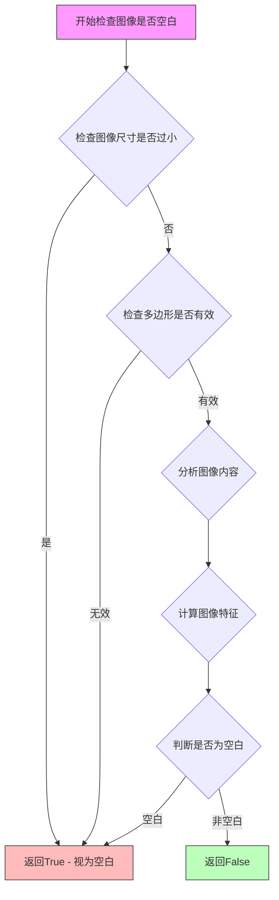

#### 带注释源码

```
# 注：由于该函数定义在 marker.utils.image 模块中，以下为根据其调用方式推断的函数签名和逻辑

def is_blank_image(image: Image.Image, polygon: list) -> bool:
    """
    检查裁剪后的图像区域是否为空白图像
    
    该函数通常用于 OCR 前处理阶段，过滤掉表格中无实际内容的单元格区域，
    以提高识别效率和准确性。
    
    参数:
        image: PIL Image 对象，从原图中裁剪出的区域
        polygon: 多边形坐标列表 [[x1,y1], [x2,y2], [x3,y3], [x4,y4]]
    
    返回:
        bool: True 表示图像为空白的，False 表示图像包含有效内容
    """
    # 1. 首先检查图像尺寸是否过小
    if image.width < 10 or image.height < 10:
        return True
    
    # 2. 将图像转换为数组进行分析
    import numpy as np
    img_array = np.array(image)
    
    # 3. 检查图像是否有明显的像素变化（内容）
    # 如果图像几乎是单色的，则认为是空白
    if len(img_array.shape) == 3:
        # 彩色图像：检查颜色方差
        variance = np.var(img_array, axis=(0, 1)).sum()
    else:
        # 灰度图像：检查像素方差
        variance = np.var(img_array)
    
    # 4. 如果方差小于阈值，认为是空白图像
    if variance < 10:  # 阈值可根据实际情况调整
        return True
    
    # 5. 还可以检查白色像素占比
    # 如果图像大部分是白色（255），也可能表示空白
    white_threshold = 240
    white_ratio = np.sum(img_array > white_threshold) / img_array.size
    
    if white_ratio > 0.95:  # 95%以上是白色
        return True
    
    # 6. 综合判断
    return False
```


### `pdftext.extraction.table_output`

从 PDF 文件中提取指定页面的表格文本数据。该函数利用 `pdftext` 库解析 PDF 的内部文本结构，获取表格单元格的文本内容，避免 OCR 过程，提高处理效率和准确性。

#### 参数

- `filepath`：`str`，PDF 文件的路径，指向需要提取表格内容的源文件
- `table_inputs`：`list[dict]`，表格输入列表，每个元素包含 `tables`（表格边界框列表）和 `img_size`（图像尺寸）
- `page_range`：`list[int]`，需要处理的页码范围列表，指定提取哪些页面的表格
- `workers`：`int`，用于并行处理的工作线程数量，默认为 1

#### 返回值

- `dict` 或 `list[dict]`，返回按页面组织的表格文本数据，结构为 `{page_num: [table_text_lines]}` 或类似的字典形式，每个元素包含该页所有表格的文本行信息

#### 流程图

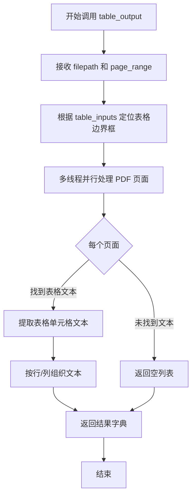

#### 带注释源码

```python
# 在 TableProcessor.assign_pdftext_lines 方法中调用
cell_text = table_output(
    filepath,                  # PDF文件路径
    table_inputs,              # 表格坐标和图像尺寸信息
    page_range=unique_pages,   # 需要处理的页码列表
    workers=self.pdftext_workers,  # 并行工作线程数
)
# 返回值示例结构:
# {
#     page_1: [
#         [{"text": "Header1", "bbox": [x1,y1,x2,y2]}, {"text": "Header2", "bbox": [x1,y1,x2,y2]}],
#         [{"text": "Cell1", "bbox": [x1,y1,x2,y2]}, {"text": "Cell2", "bbox": [x1,y1,x2,y2]}]
#     ],
#     page_2: [...]
# }
```


### `TableProcessor.__init__`

构造函数，用于初始化 TableProcessor 实例，将识别模型、表格识别模型和检测模型存储为实例属性。

参数：

- `self`：`TableProcessor` 实例本身
- `recognition_model`：`RecognitionPredictor`，用于文本识别的模型
- `table_rec_model`：`TableRecPredictor`，用于表格识别的模型
- `detection_model`：`DetectionPredictor`，用于文本检测的模型
- `config`：可选参数，配置对象，默认为 None

返回值：`None`，构造函数无返回值

#### 流程图

```mermaid
flowchart TD
    A[开始 __init__] --> B[调用 super().__init__config]
    B --> C[保存 recognition_model 到实例]
    C --> D[保存 table_rec_model 到实例]
    D --> E[保存 detection_model 到实例]
    E --> F[结束 __init__]
```

#### 带注释源码

```python
def __init__(
    self,
    recognition_model: RecognitionPredictor,  # 文本识别模型
    table_rec_model: TableRecPredictor,         # 表格识别模型
    detection_model: DetectionPredictor,       # 文本检测模型
    config=None,                                 # 可选配置对象
):
    # 调用父类 BaseProcessor 的构造函数，传入配置
    super().__init__(config)

    # 将传入的模型保存为实例属性
    self.recognition_model = recognition_model
    self.table_rec_model = table_rec_model
    self.detection_model = detection_model
```


### `TableProcessor.__call__`

该方法是表格处理器的核心入口，负责识别 PDF 文档中的表格结构、提取表格内容（通过 PDF 原始文本或 OCR 识别）、处理合并的行和列，最后将表格单元格添加到文档页面中。

参数：

- `self`：TableProcessor 实例，表格处理器对象
- `document`：`Document`，待处理的文档对象，包含页面和块结构

返回值：`None`，该方法直接修改文档对象，将表格单元格添加到页面结构中

#### 流程图

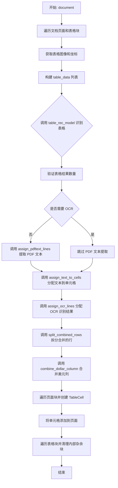

#### 带注释源码

```python
def __call__(self, document: Document):
    """
    处理文档中的表格，识别表格结构并提取文本内容。
    支持两种文本提取方式：
    1. 从 PDF 原始文本提取（优先）
    2. OCR 光学字符识别（备选）
    """
    filepath = document.filepath  # PDF 文件路径

    # 第一步：收集所有表格的图像和元数据
    table_data = []
    for page in document.pages:
        for block in page.contained_blocks(document, self.block_types):
            # 扩展表格边界框 1% 以确保完整覆盖
            if block.block_type == BlockTypes.Table:
                block.polygon = block.polygon.expand(0.01, 0.01)
            
            # 获取表格的高分辨率图像
            image = block.get_image(document, highres=True)
            # 计算图像坐标系下的多边形坐标
            image_poly = block.polygon.rescale(
                (page.polygon.width, page.polygon.height),
                page.get_image(highres=True).size,
            )

            # 收集表格数据用于后续处理
            table_data.append(
                {
                    "block_id": block.id,
                    "page_id": page.page_id,
                    "table_image": image,  # 表格图像用于模型识别
                    "table_bbox": image_poly.bbox,  # 表格边界框
                    "img_size": page.get_image(highres=True).size,
                    # 判断是否需要 OCR：使用 Surya 识别方法或有 OCR 错误
                    "ocr_block": any(
                        [
                            page.text_extraction_method in ["surya"],
                            page.ocr_errors_detected,
                        ]
                    ),
                }
            )

    # 第二步：使用表格识别模型检测表格和单元格结构
    self.table_rec_model.disable_tqdm = self.disable_tqdm
    tables: List[TableResult] = self.table_rec_model(
        [t["table_image"] for t in table_data],
        batch_size=self.get_table_rec_batch_size(),
    )
    # 验证识别结果数量与输入表格数量一致
    assert len(tables) == len(table_data), (
        "Number of table results should match the number of tables"
    )

    # 第三步：处理不需要 OCR 的表格 - 从 PDF 提取文本
    # 提取有良好 PDF 文本的表格块
    extract_blocks = [t for t in table_data if not t["ocr_block"]]
    self.assign_pdftext_lines(
        extract_blocks, filepath
    )  # Handle tables where good text exists in the PDF
    # 将提取的文本分配到对应的表格单元格
    self.assign_text_to_cells(tables, table_data)

    # 第四步：对需要 OCR 的表格进行光学字符识别
    self.assign_ocr_lines(tables, table_data)

    # 第五步：后处理 - 拆分被合并的行
    self.split_combined_rows(tables)  # Split up rows that were combined
    # 后处理 - 合并只有美元符号的列
    self.combine_dollar_column(tables)  # Combine columns that are just dollar signs

    # 第六步：将表格单元格添加到文档结构中
    table_idx = 0
    for page in document.pages:
        for block in page.contained_blocks(document, self.block_types):
            block.structure = []  # 清除现有的行、跨度等结构
            cells: List[SuryaTableCell] = tables[table_idx].cells
            
            for cell in cells:
                # 将单元格多边形重新缩放到页面尺寸
                cell_polygon = PolygonBox(polygon=cell.polygon).rescale(
                    page.get_image(highres=True).size, page.polygon.size
                )

                # 调整单元格多边形坐标，使其相对于页面而非表格
                for corner in cell_polygon.polygon:
                    corner[0] += block.polygon.bbox[0]
                    corner[1] += block.polygon.bbox[1]

                # 创建 TableCell 块
                cell_block = TableCell(
                    polygon=cell_polygon,
                    text_lines=self.finalize_cell_text(cell),
                    rowspan=cell.rowspan,
                    colspan=cell.colspan,
                    row_id=cell.row_id,
                    col_id=cell.col_id,
                    is_header=bool(cell.is_header),
                    page_id=page.page_id,
                )
                # 将单元格添加到页面和表格块结构中
                page.add_full_block(cell_block)
                block.add_structure(cell_block)
            table_idx += 1

    # 第七步：清理表格内部的杂余块
    # 这可能发生在合并后表格内部存在游离文本块的情况
    for page in document.pages:
        child_contained_blocks = page.contained_blocks(
            document, self.contained_block_types
        )
        for block in page.contained_blocks(document, self.block_types):
            # 计算子块与表格块的交集面积
            intersections = matrix_intersection_area(
                [c.polygon.bbox for c in child_contained_blocks],
                [block.polygon.bbox],
            )
            for child, intersection in zip(child_contained_blocks, intersections):
                # 计算子块被表格包围的百分比
                intersection_pct = intersection / max(child.polygon.area, 1)
                # 如果超过 95% 被包围，则从页面结构中移除
                if intersection_pct > 0.95 and child.id in page.structure:
                    page.structure.remove(child.id)
```


### `TableProcessor.finalize_cell_text`

该方法负责对表格单元格中的文本进行深度清理和规范化处理，包括移除特殊字符序列、清理LaTeX格式命令、处理空白字符等，最终返回格式统一的文本行列表。

参数：

- `cell`：`SuryaTableCell`，包含文本行的表格单元格对象

返回值：`List[str]`，清理和规范化后的文本行列表

#### 流程图

```mermaid
flowchart TD
    A[开始] --> B[初始化空列表 fixed_text]
    B --> C{遍历 text_lines 中的每一行}
    C -->|是| D[去除首尾空白]
    D --> E{文本为空或仅为 '.'?}
    E -->|是| C
    E -->|否| F[清理间隔序列 . . . - - - 等]
    F --> G[清理未间隔序列 ... --- 等]
    G --> H[处理mathbf数学格式]
    H --> I[删除空的LaTeX命令如\overline{}]
    I --> J[删除\phantom命令及内容]
    J --> K[删除\quad和\,命令]
    K --> L[展开\smathsf命令]
    L --> M[处理未关闭的标签]
    M --> N[展开\text命令]
    N --> O[unwrap_math处理剩余数学]
    O --> P[fix_text修复文本编码]
    P --> Q[normalize_spaces规范化空格]
    Q --> R[添加处理后的文本到fixed_text]
    R --> C
    C -->|否| S[返回 fixed_text 列表]
    S --> T[结束]
```

#### 带注释源码

```python
def finalize_cell_text(self, cell: SuryaTableCell):
    """
    处理并规范化表格单元格的文本内容。
    清理各种格式问题和特殊字符序列。
    
    参数:
        cell: SuryaTableCell对象，包含text_lines属性存储文本行
    
    返回:
        清理后的文本行列表
    """
    fixed_text = []  # 存储最终清理后的文本行
    # 获取单元格中的文本行，如果为空则使用空列表
    text_lines = cell.text_lines if cell.text_lines else []
    
    # 遍历每一行文本进行逐行处理
    for line in text_lines:
        # 提取文本并去除首尾空白字符
        text = line["text"].strip()
        
        # 跳过空文本行或仅包含句点的行
        if not text or text == ".":
            continue
        
        # 清理有间隔的重复序列: ". . .", "- - -", "_ _ _", "… … …"
        # 使用正则匹配两个或更多由可选空白分隔的指定字符
        text = re.sub(r"(\s?[.\-_…]){2,}", "", text)
        
        # 清理无间隔的重复序列: "...", "---", "___", "……
        text = re.sub(r"[.\-_…]{2,}", "", text)
        
        # 将\mathbf{digits}转换为HTML粗体标签
        # 仅处理内部仅包含数字、小数点、逗号、货币符号的情况
        text = re.sub(r"\\mathbf\{([0-9.,$€£]+)\}", r"<b>\1</b>", text)
        
        # 删除空的LaTeX命令，如\overline{}、\underline{}等
        text = re.sub(r"\\[a-zA-Z]+\{\s*\}", "", text)
        
        # 删除\phantom命令及其内容（用于占位的隐藏内容）
        text = re.sub(r"\\phantom\{.*?\}", "", text)
        
        # 删除\quad命令（用于插入大空格）
        text = re.sub(r"\\quad", "", text)
        
        # 删除\,命令（用于插入小空格）
        text = re.sub(r"\\,", "", text)
        
        # 展开\smathsf命令，去掉数学sans-serif格式包装
        text = re.sub(r"\\mathsf\{([^}]*)\}", r"\1", text)
        
        # 处理未关闭的LaTeX标签：保留内容，去掉命令部分
        # 例如：\command{content -> 保留content
        text = re.sub(r"\\[a-zA-Z]+\{([^}]*)$", r"\1", text)
        
        # 如果整个字符串是\text{...}形式，则完全展开
        text = re.sub(r"^\s*\\text\{([^}]*)\}\s*$", r"\1", text)
        
        # 如果上述处理后不再有LaTeX数学内容，尝试unwrap_math
        text = unwrap_math(text)
        
        # 使用ftfy库修复文本编码问题（如UTF-8编码错误）
        # 然后规范化各种特殊空白字符为普通空格
        text = self.normalize_spaces(fix_text(text))
        
        # 将处理完成的文本行添加到结果列表
        fixed_text.append(text)
    
    # 返回清理后的文本行列表
    return fixed_text


@staticmethod
def normalize_spaces(text):
    """
    将各种Unicode特殊空白字符规范化为普通空格。
    
    参数:
        text: 输入文本字符串
    
    返回:
        规范化后的文本字符串
    """
    # 定义需要替换的特殊空白字符列表
    space_chars = [
        "\u2003",  # em space (全角空格)
        "\u2002",  # en space (半角空格)
        "\u00a0",  # non-breaking space (不换行空格)
        "\u200b",  # zero-width space (零宽空格)
        "\u3000",  # ideographic space (表意文字空格)
    ]
    
    # 遍历并替换所有特殊空白字符为普通空格
    for space in space_chars:
        text = text.replace(space, " ")
    
    return text
```


### `TableProcessor.normalize_spaces`

该方法是一个静态工具函数，用于将文本中的各种特殊Unicode空格字符（如全角空格、不换行空格、零宽空格等）统一替换为普通ASCII空格字符，以确保文本的一致性和可读性。

参数：

- `text`：`str`，需要规范化的文本字符串

返回值：`str`，将所有特殊空格字符替换为普通空格后的文本

#### 流程图

```mermaid
flowchart TD
    A[开始 normalize_spaces] --> B[定义特殊空格字符列表 space_chars]
    B --> C[遍历 space_chars 中的每个特殊空格字符]
    C --> D{是否还有未处理的空格字符?}
    D -->|是| E[将当前特殊空格替换为普通空格]
    E --> C
    D -->|否| F[返回规范化后的文本]
    F --> G[结束]
    
    subgraph 特殊空格字符列表
        H["\\u2003 (em space)", "\\u2002 (en space)", "\\u00a0 (non-breaking space)", "\\u200b (zero-width space)", "\\u3000 (ideographic space)"]
    end
```

#### 带注释源码

```python
@staticmethod
def normalize_spaces(text):
    # 定义需要被替换的特殊Unicode空格字符列表
    space_chars = [
        "\u2003",  # em space (全角空格，宽度等于当前字体的大小)
        "\u2002",  # en space (半角空格，宽度为em space的一半)
        "\u00a0",  # non-breaking space (不换行空格，防止在此处换行)
        "\u200b",  # zero-width space (零宽空格，字符宽度为0)
        "\u3000",  # ideographic space (表意文字空格，全角宽度)
    ]
    # 遍历每个特殊空格字符，将其替换为普通ASCII空格
    for space in space_chars:
        text = text.replace(space, " ")
    # 返回替换后的规范化文本
    return text
```


### `TableProcessor.combine_dollar_column`

该方法用于合并表格中仅包含美元符号（$）的列。它会扫描表格的每一列，识别出完全由空字符串或单个美元符号组成的列，将美元符号与相邻列的文本合并，并删除这些冗余的美元列，从而简化表格结构。

参数：

- `tables`：`List[TableResult]`，待处理的表格结果列表，每个元素包含表格的单元格信息

返回值：`None`（该方法直接修改传入的 `tables` 列表，无返回值）

#### 流程图

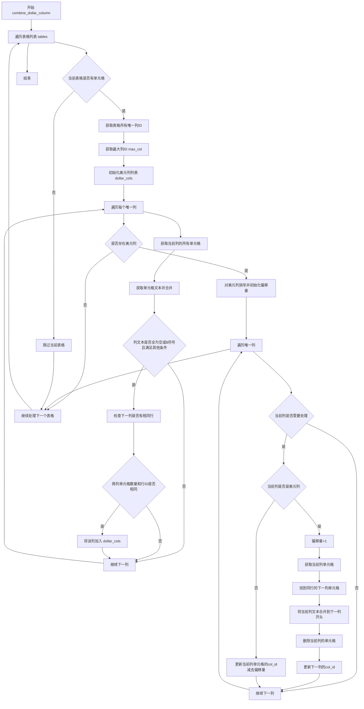

#### 带注释源码

```python
def combine_dollar_column(self, tables: List[TableResult]):
    """
    合并表格中仅包含美元符号的列。
    将美元符号与相邻列的文本合并，并删除冗余的美元列。
    
    参数:
        tables: 表格结果列表，每个TableResult包含表格的单元格信息
    返回:
        无返回值，直接修改传入的tables列表
    """
    # 遍历处理每一个表格
    for table in tables:
        # 空表格直接跳过，避免后续处理空列表导致错误
        if len(table.cells) == 0:
            continue
        
        # 获取当前表格中所有唯一的列ID，并排序
        unique_cols = sorted(list(set([c.col_id for c in table.cells])))
        # 获取最大列ID，用于判断是否为最后一列
        max_col = max(unique_cols)
        
        # 用于存储识别出的美元列
        dollar_cols = []
        
        # 遍历每个唯一列，检测是否为美元列
        for col in unique_cols:
            # 获取当前列的所有单元格
            col_cells = [c for c in table.cells if c.col_id == col]
            # 对每个单元格调用finalize_cell_text获取处理后的文本，并用换行符连接
            col_text = [
                "\n".join(self.finalize_cell_text(c)).strip() for c in col_cells
            ]
            
            # 检查该列文本是否全为空字符串或单个"$"符号
            all_dollars = all([ct in ["", "$"] for ct in col_text])
            
            # 获取该列所有单元格的colspan值
            colspans = [c.colspan for c in col_cells]
            
            # 查找是否有其他列的单元格跨越到了当前列
            # 即单元格的 col_id + colspan > col > col_id 的情况
            span_into_col = [
                c
                for c in table.cells
                if c.col_id != col and c.col_id + c.colspan > col > c.col_id
            ]

            # 判断该列是否为"美元列"的完整条件：
            # 1. 列中所有单元格文本都为空或"$"
            # 2. 列中有超过1个单元格（避免单单元格列）
            # 3. 没有其他列的单元格跨越到该列
            # 4. 所有单元格的colspan都为1（没有合并列）
            # 5. 该列不是最后一列
            if all(
                [
                    all_dollars,
                    len(col_cells) > 1,
                    len(span_into_col) == 0,
                    all([c == 1 for c in colspans]),
                    col < max_col,
                ]
            ):
                # 获取下一列的单元格
                next_col_cells = [c for c in table.cells if c.col_id == col + 1]
                # 获取两列各自的行ID列表
                next_col_rows = [c.row_id for c in next_col_cells]
                col_rows = [c.row_id for c in col_cells]
                
                # 确保两列的单元格数量相同且行ID完全对应
                # 这样才能安全地合并
                if (
                    len(next_col_cells) == len(col_cells)
                    and next_col_rows == col_rows
                ):
                    dollar_cols.append(col)

        # 没有美元列需要处理时，直接跳过
        if len(dollar_cols) == 0:
            continue

        # 对美元列进行排序，并初始化列偏移量
        dollar_cols = sorted(dollar_cols)
        col_offset = 0
        
        # 再次遍历所有列，处理美元的合并和删除
        for col in unique_cols:
            # 获取当前列的所有单元格
            col_cells = [c for c in table.cells if c.col_id == col]
            
            # 如果偏移量为0且当前列不在美元列中，跳过处理
            if col_offset == 0 and col not in dollar_cols:
                continue

            # 如果当前列是美元列
            if col in dollar_cols:
                col_offset += 1  # 增加偏移量
                # 遍历该列的每个单元格
                for cell in col_cells:
                    # 获取当前单元格的文本行
                    text_lines = cell.text_lines if cell.text_lines else []
                    # 找到同一行、下一列的单元格
                    next_row_col = [
                        c
                        for c in table.cells
                        if c.row_id == cell.row_id and c.col_id == col + 1
                    ]

                    # 获取下一列单元格的文本行（如果有的话）
                    next_text_lines = (
                        next_row_col[0].text_lines
                        if next_row_col[0].text_lines
                        else []
                    )
                    
                    # 将当前美元列的文本合并到下一列的文本开头
                    next_row_col[0].text_lines = deepcopy(text_lines) + deepcopy(
                        next_text_lines
                    )
                    
                    # 从表格中删除当前的美元列单元格
                    table.cells = [
                        c for c in table.cells if c.cell_id != cell.cell_id
                    ]
                    
                    # 更新下一列的col_id，减去累积的偏移量
                    next_row_col[0].col_id -= col_offset
            else:
                # 对于非美元列（非美元列的单元格也需要偏移）
                for cell in col_cells:
                    cell.col_id -= col_offset
```


### `TableProcessor.split_combined_rows`

该方法用于将表格中合并的多行单元格分割成独立的行。当表格识别模型将多行文本识别为单个单元格时，会触发此方法的分割逻辑，通过分析单元格的文本行数、行跨度等特征，判断是否需要将单元格垂直拆分为多行。

参数：

- `tables`：`List[TableResult]` - 表格结果列表，来自 Surya 表格识别模型的输出，每个 `TableResult` 包含表格的单元格数组

返回值：`None` - 该方法直接修改传入的 `tables` 列表中的 `TableResult` 对象，不返回任何值

#### 流程图

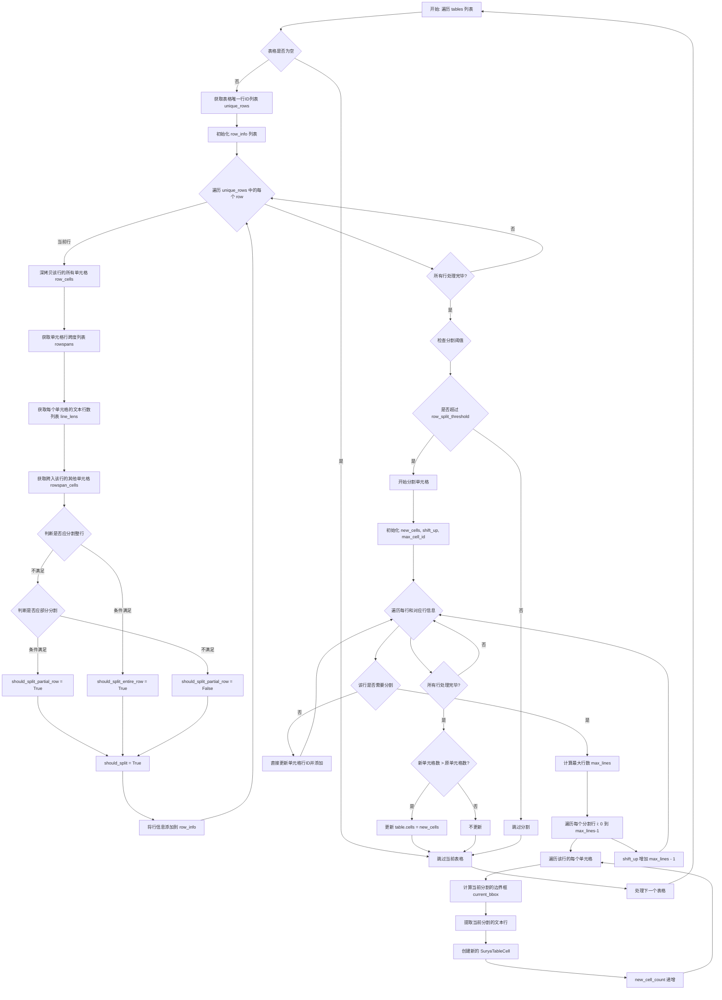

#### 带注释源码

```python
def split_combined_rows(self, tables: List[TableResult]):
    """
    将表格中合并的多行单元格分割成独立的行。
    
    该方法处理以下场景：
    1. 整行分割：当所有单元格都有多行文本且行数相同时
    2. 部分分割：当大部分单元格有多行文本，但存在单个单行单元格时
    
    分割逻辑：
    - 分析每行的单元格数量、文本行数、行跨度
    - 判断是否满足分割阈值（row_split_threshold）
    - 创建新的单元格对象，垂直拆分原始单元格
    """
    # 遍历所有表格结果
    for table in tables:
        # 跳过空表格
        if len(table.cells) == 0:
            continue
        
        # 获取表格中所有唯一的行ID，并排序
        unique_rows = sorted(list(set([c.row_id for c in table.cells])))
        
        # 存储每行的分析信息
        row_info = []
        
        # 遍历每一行进行分析
        for row in unique_rows:
            # 深拷贝该行的所有单元格，避免后续原地修改影响分析
            row_cells = deepcopy([c for c in table.cells if c.row_id == row])
            
            # 获取每个单元格的行跨度（rowspan）
            rowspans = [c.rowspan for c in row_cells]
            
            # 获取每个单元格的文本行数
            # 如果 text_lines 不是列表，则视为 1 行
            line_lens = [
                len(c.text_lines) if isinstance(c.text_lines, list) else 1
                for c in row_cells
            ]

            # 查找跨入当前行的其他单元格（rowspan > 1 的单元格）
            rowspan_cells = [
                c
                for c in table.cells
                if c.row_id != row and c.row_id + c.rowspan > row > c.row_id
            ]
            
            # 判断是否应该分割整行
            # 条件：多于1个单元格、无跨入单元格、所有单元格rowspan=1、
            # 所有单元格有多行文本、且所有单元格的行数相同
            should_split_entire_row = all(
                [
                    len(row_cells) > 1,  # 至少2个单元格
                    len(rowspan_cells) == 0,  # 无跨行单元格
                    all([rowspan == 1 for rowspan in rowspans]),  # 所有rowspan=1
                    all([line_len > 1 for line_len in line_lens]),  # 所有单元格有多行
                    all([line_len == line_lens[0] for line_len in line_lens]),  # 行数相同
                ]
            )
            
            # 统计文本行数的分布
            line_lens_counter = Counter(line_lens)
            counter_keys = sorted(list(line_lens_counter.keys()))
            
            # 判断是否应该部分分割
            # 条件：超过3个单元格、无跨入单元格、所有rowspan=1、
            # 恰好2种行数、其中一种只有1个单元格且行数<=1、另一种行数>1
            should_split_partial_row = all(
                [
                    len(row_cells) > 3,  # 超过3个单元格
                    len(rowspan_cells) == 0,  # 无跨入单元格
                    all([r == 1 for r in rowspans]),  # 所有rowspan=1
                    # 恰好2种行数，允许一个单行单元格
                    len(line_lens_counter) == 2
                    and counter_keys[0] <= 1
                    and counter_keys[1] > 1
                    and line_lens_counter[counter_keys[0]] == 1,
                ]
            )
            
            # 最终分割决定
            should_split = should_split_entire_row or should_split_partial_row
            
            # 存储该行的分析结果
            row_info.append(
                {
                    "should_split": should_split,
                    "row_cells": row_cells,
                    "line_lens": line_lens,
                }
            )

        # 检查是否满足分割阈值
        # 如果需要分割的行比例小于阈值，则不进行分割
        # 这样可以避免分割孤立的异常多行单元格
        if (
            sum([r["should_split"] for r in row_info]) / len(row_info)
            < self.row_split_threshold
        ):
            continue

        # 开始分割单元格
        new_cells = []
        shift_up = 0  # 累计行号偏移量
        max_cell_id = max([c.cell_id for c in table.cells])  # 最大单元格ID
        new_cell_count = 0  # 新增单元格计数
        
        # 遍历每行及其分析信息
        for row, item_info in zip(unique_rows, row_info):
            max_lines = max(item_info["line_lens"])  # 该行最大文本行数
            
            if item_info["should_split"]:
                # 需要分割该行
                # 遍历每个文本行（从上到下）
                for i in range(0, max_lines):
                    # 遍历该行的每个单元格
                    for cell in item_info["row_cells"]:
                        # 计算分割后的高度
                        # 将原始高度按行数等分
                        split_height = cell.bbox[3] - cell.bbox[1]
                        current_bbox = [
                            cell.bbox[0],  # x1 保持不变
                            cell.bbox[1] + i * split_height,  # y1 根据分割位置调整
                            cell.bbox[2],  # x2 保持不变
                            cell.bbox[1] + (i + 1) * split_height,  # y2 根据分割位置调整
                        ]

                        # 提取当前分割对应的文本行
                        line = (
                            [cell.text_lines[i]]
                            if cell.text_lines and i < len(cell.text_lines)
                            else None
                        )
                        
                        # 分配新的单元格ID
                        cell_id = max_cell_id + new_cell_count
                        
                        # 创建新的单元格对象
                        new_cells.append(
                            SuryaTableCell(
                                polygon=current_bbox,  # 更新边界框
                                text_lines=line,  # 单行文本
                                rowspan=1,  # 新的行跨度为1
                                colspan=cell.colspan,  # 保持列跨度
                                row_id=cell.row_id + shift_up + i,  # 更新行号
                                col_id=cell.col_id,  # 保持列号
                                is_header=cell.is_header
                                and i == 0,  # 只有第一行保留header属性
                                within_row_id=cell.within_row_id,
                                cell_id=cell_id,
                            )
                        )
                        new_cell_count += 1

                # 每添加一个新行，后续行的行号就需要偏移
                # shift_up 累加分割造成的行号增量
                shift_up += max_lines - 1
            else:
                # 不需要分割的行，只需更新行号（加上累计偏移量）
                for cell in item_info["row_cells"]:
                    cell.row_id += shift_up
                    new_cells.append(cell)

        # 只有当新单元格数量大于原单元格数量时才更新
        # （即确实进行了分割操作）
        if len(new_cells) > len(table.cells):
            table.cells = new_cells
```


### `TableProcessor.assign_text_to_cells`

该方法负责将PDF文本（来自pdftext提取的文本行）分配给表格单元格，通过计算文本行与单元格边界框的交叉面积矩阵，找出每个文本行最可能属于的单元格，并将文本行赋值给对应单元格的`text_lines`属性。

参数：

- `tables`：`List[TableResult]`，表格识别模型返回的结果列表，包含每个表格的单元格信息
- `table_data`：`list`，包含表格页面数据的列表，每个元素包含表格图像、边界框、是否需要OCR等信息

返回值：`None`，该方法直接修改传入的`tables`中的单元格对象，将文本行分配给对应的单元格

#### 流程图

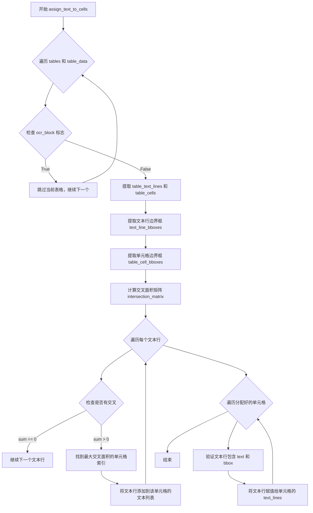

#### 带注释源码

```python
def assign_text_to_cells(self, tables: List[TableResult], table_data: list):
    """
    将PDF文本行分配给表格单元格
    
    该方法通过计算文本行与表格单元格的交叉面积，
    将文本行分配给最可能属于的单元格
    
    Args:
        tables: 表格识别模型返回的结果列表
        table_data: 包含表格页面数据的列表
    """
    # 遍历每个表格结果和对应的页面数据
    for table_result, table_page_data in zip(tables, table_data):
        # 如果该表格需要OCR处理，则跳过文本分配
        # 因为OCR的文本会在assign_ocr_lines方法中单独处理
        if table_page_data["ocr_block"]:
            continue

        # 从table_page_data中提取表格文本行
        # 这些文本行来自pdftext的提取结果
        table_text_lines = table_page_data["table_text_lines"]
        
        # 从表格结果中获取单元格列表
        table_cells: List[SuryaTableCell] = table_result.cells
        
        # 提取所有文本行的边界框 [x0, y0, x1, y1]
        text_line_bboxes = [t["bbox"] for t in table_text_lines]
        
        # 提取所有单元格的边界框
        table_cell_bboxes = [c.bbox for c in table_cells]

        # 计算文本行与单元格之间的交叉面积矩阵
        # 矩阵维度: [len(text_line_bboxes), len(table_cell_bboxes)]
        intersection_matrix = matrix_intersection_area(
            text_line_bboxes, table_cell_bboxes
        )

        # 使用defaultdict存储每个单元格对应的文本行
        # key: 单元格索引, value: 该单元格对应的文本行列表
        cell_text = defaultdict(list)
        
        # 遍历每个文本行，找到其所属的单元格
        for text_line_idx, table_text_line in enumerate(table_text_lines):
            # 获取该文本行与所有单元格的交叉面积
            intersections = intersection_matrix[text_line_idx]
            
            # 如果没有交叉面积，跳过该文本行
            if intersections.sum() == 0:
                continue

            # 找到交叉面积最大的单元格索引
            # argmax返回交叉面积最大值的索引
            max_intersection = intersections.argmax()
            
            # 将文本行添加到对应单元格的文本列表中
            cell_text[max_intersection].append(table_text_line)

        # 遍历所有分配了文本的单元格
        for k in cell_text:
            # 获取该单元格对应的所有文本行
            text = cell_text[k]
            
            # 断言验证：所有文本行都必须包含'text'字段
            assert all("text" in t for t in text), "All text lines must have text"
            
            # 断言验证：所有文本行都必须包含'bbox'字段
            assert all("bbox" in t for t in text), "All text lines must have a bbox"
            
            # 将文本行列表赋值给单元格的text_lines属性
            # 这样就完成了文本到单元格的分配
            table_cells[k].text_lines = text
```


### `TableProcessor.assign_pdftext_lines`

该方法用于从PDF文件中提取表格的文本内容。它通过调用 `table_output` 函数获取PDF原生文本，并将其分配给相应的表格块。如果某个表格块没有提取到文本，则将其标记为需要OCR处理。

参数：

- `self`：TableProcessor 实例本身
- `extract_blocks`：`list`，需要提取文本的表格块列表，每个元素包含 page_id、table_bbox、img_size 等信息
- `filepath`：`str`，PDF文件的路径

返回值：`None`（无返回值）

#### 流程图

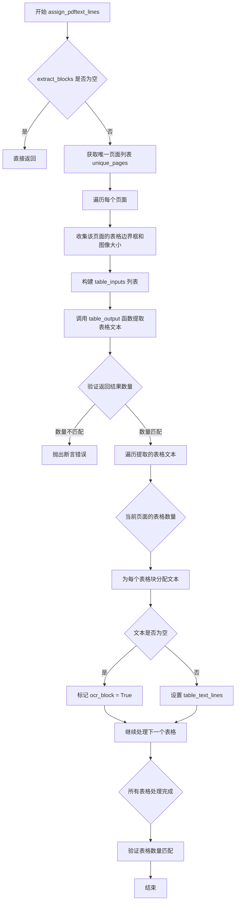

#### 带注释源码

```python
def assign_pdftext_lines(self, extract_blocks: list, filepath: str):
    """
    从PDF文件中提取表格的文本内容。
    
    参数:
        extract_blocks: 需要提取文本的表格块列表
        filepath: PDF文件的路径
    """
    table_inputs = []  # 用于存储每个页面的表格输入数据
    # 获取所有唯一的页面ID
    unique_pages = list(set([t["page_id"] for t in extract_blocks]))
    
    # 如果没有需要处理的页面，直接返回
    if len(unique_pages) == 0:
        return

    # 遍历每个唯一页面，收集该页面的所有表格信息
    for page in unique_pages:
        tables = []
        img_size = None
        for block in extract_blocks:
            if block["page_id"] == page:
                # 添加表格的边界框
                tables.append(block["table_bbox"])
                # 获取图像大小
                img_size = block["img_size"]

        # 将该页面的表格数据和图像大小添加到输入列表
        table_inputs.append({"tables": tables, "img_size": img_size})
    
    # 调用 pdftext 库的 table_output 函数提取表格文本
    # 该函数返回每个页面的表格文本列表
    cell_text = table_output(
        filepath,
        table_inputs,
        page_range=unique_pages,
        workers=self.pdftext_workers,
    )
    
    # 验证返回的页面数量与请求的页面数量是否一致
    assert len(cell_text) == len(unique_pages), (
        "Number of pages and table inputs must match"
    )

    # 遍历每个页面的表格文本结果
    for pidx, (page_tables, pnum) in enumerate(zip(cell_text, unique_pages)):
        table_idx = 0
        # 遍历该页面中的所有表格块
        for block in extract_blocks:
            if block["page_id"] == pnum:
                # 获取当前表格的文本
                table_text = page_tables[table_idx]
                
                # 如果没有提取到文本，标记该块需要OCR处理
                if len(table_text) == 0:
                    block["ocr_block"] = (
                        True  # Re-OCR the block if pdftext didn't find any text
                    )
                else:
                    # 将提取的文本赋值给表格块
                    block["table_text_lines"] = page_tables[table_idx]
                
                table_idx += 1
        
        # 验证处理的表格数量与返回的表格数量是否一致
        assert table_idx == len(page_tables), (
            "Number of tables and table inputs must match"
        )
```


### `TableProcessor.align_table_cells`

该方法用于将OCR检测到的文本行与表格单元格对齐，根据文本行的位置调整单元格的多边形边界，确保单元格边界准确包含其对应的文本内容。

参数：

- `table`：`TableResult`，包含表格识别结果的表格对象，其中包含表格单元格列表
- `table_detection_result`：`TextDetectionResult`，OCR文本检测结果，包含检测到的文本行边界框列表

返回值：无（`None`），该方法直接修改传入的`table`对象中的单元格多边形边界

#### 流程图

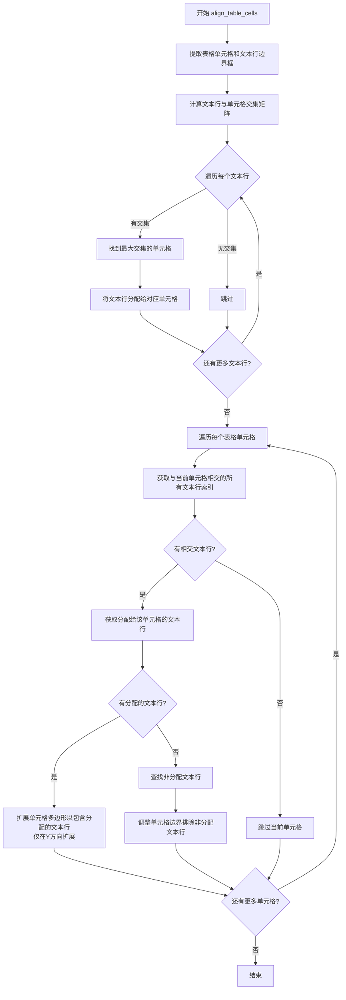

#### 带注释源码

```python
def align_table_cells(
    self, table: TableResult, table_detection_result: TextDetectionResult
):
    # 获取表格中的单元格列表
    table_cells = table.cells
    # 获取OCR检测到的文本行边界框列表
    table_text_lines = table_detection_result.bboxes

    # 提取文本行的边界框列表
    text_line_bboxes = [t.bbox for t in table_text_lines]
    # 提取表格单元格的边界框列表
    table_cell_bboxes = [c.bbox for c in table_cells]

    # 计算文本行与表格单元格之间的交集面积矩阵
    # 矩阵维度: [文本行数量 x 单元格数量]
    intersection_matrix = matrix_intersection_area(
        text_line_bboxes, table_cell_bboxes
    )

    # 建立单元格到文本行列表的映射
    # key: 单元格索引, value: 分配给该单元格的文本行列表
    cell_text = defaultdict(list)
    # 遍历每个文本行
    for text_line_idx, table_text_line in enumerate(table_text_lines):
        # 获取该文本行与所有单元格的交集面积
        intersections = intersection_matrix[text_line_idx]
        # 如果没有交集，跳过
        if intersections.sum() == 0:
            continue
        # 找到交集面积最大的单元格索引
        max_intersection = intersections.argmax()
        # 将该文本行分配给对应的单元格
        cell_text[max_intersection].append(table_text_line)

    # 调整单元格多边形边界（原地修改）
    for cell_idx, cell in enumerate(table_cells):
        # 找到与当前单元格相交的所有文本行索引
        intersecting_line_indices = [
            i for i, area in enumerate(intersection_matrix[:, cell_idx]) if area > 0
        ]
        # 如果没有相交的文本行，跳过
        if not intersecting_line_indices:
            continue

        # 获取分配给该单元格的文本行
        assigned_lines = cell_text.get(cell_idx, [])
        
        # 扩展单元格边界以包含分配的文本行 - 仅在Y方向扩展
        for assigned_line in assigned_lines:
            x1 = cell.bbox[0]
            x2 = cell.bbox[2]
            # Y方向：取单元格和文本行边界框的最小Y1和最大Y2
            y1 = min(cell.bbox[1], assigned_line.bbox[1])
            y2 = max(cell.bbox[3], assigned_line.bbox[3])
            # 更新单元格多边形为扩展后的矩形
            cell.polygon = [[x1, y1], [x2, y1], [x2, y2], [x1, y2]]

        # 清除未分配给该单元格的文本行
        non_assigned_lines = [
            table_text_lines[i]
            for i in intersecting_line_indices
            if table_text_lines[i] not in cell_text.get(cell_idx, [])
        ]
        
        # 如果存在未分配的文本行，进一步调整单元格边界
        if non_assigned_lines:
            # 找到最上方的非分配文本框（最小的y0）
            top_box = min(
                non_assigned_lines, key=lambda line: line.bbox[1]
            )
            # 找到最下方的非分配文本框（最大的y1）
            bottom_box = max(
                non_assigned_lines, key=lambda line: line.bbox[3]
            )

            # 获取当前单元格的边界框
            x0, y0, x1, y1 = cell.bbox

            # 根据非分配文本框调整Y轴边界
            new_y0 = max(y0, top_box.bbox[3])  # 上边界向下移动
            new_y1 = min(y1, bottom_box.bbox[1])  # 下边界向上移动

            # 如果调整后边界有效，则更新多边形
            if new_y0 < new_y1:
                # 用收缩后的矩形替换多边形
                cell.polygon = [
                    [x0, new_y0],
                    [x1, new_y0],
                    [x1, new_y1],
                    [x0, new_y1],
                ]
```


### `TableProcessor.needs_ocr`

该方法用于判断哪些表格需要执行OCR光学字符识别操作，通过检查表格块标记和单元格文本是否存在来决定OCR处理的范围，并返回需要OCR的表格、多边形和索引。

参数：

- `tables`：`List[TableResult]`，待处理的表格结果列表，每个元素包含表格的单元格信息
- `table_blocks`：`List[dict]`，表格块的字典列表，包含表格图像、边界框和OCR标记等信息

返回值：`Tuple[List[TableResult], List[List[SuryaTableCell]], List[int]]`，返回一个包含三个元素的元组，分别是需要OCR的表格结果列表、对应需要OCR的单元格多边形列表、以及表格索引列表

#### 流程图

```mermaid
flowchart TD
    A[开始 needs_ocr] --> B[初始化空列表 ocr_tables, ocr_idxs]
    B --> C[遍历 tables 和 table_blocks]
    C --> D{检查条件}
    D -->|table_block['ocr_block'] 为真| E{text_lines_need_ocr}
    D -->|否| C
    E -->|单元格text_lines为None| F[添加到 ocr_tables 和 ocr_idxs]
    E -->|否| C
    F --> C
    C --> G{还有更多表格?}
    G -->|是| C
    G -->|否| H[调用 detection_model 进行文本检测]
    H --> I[验证检测结果数量]
    I --> J[对齐表格单元格]
    J --> K[提取需要OCR的多边形]
    K --> L[返回 ocr_tables, ocr_polys, ocr_idxs]
```

#### 带注释源码

```python
def needs_ocr(self, tables: List[TableResult], table_blocks: List[dict]):
    """
    判断哪些表格需要执行OCR处理
    
    参数:
        tables: 表格识别结果列表
        table_blocks: 表格块信息列表，包含图像和OCR标记
    
    返回:
        需要OCR的表格列表、单元格多边形列表、表格索引
    """
    ocr_tables = []  # 存储需要OCR的表格结果
    ocr_idxs = []    # 存储需要OCR的表格索引
    
    # 遍历每个表格及其对应的块信息
    for j, (table_result, table_block) in enumerate(zip(tables, table_blocks)):
        table_cells: List[SuryaTableCell] = table_result.cells
        # 检查是否存在需要OCR的单元格（text_lines为None表示没有文本）
        text_lines_need_ocr = any([tc.text_lines is None for tc in table_cells])
        
        # 判断条件：块需要OCR 且 单元格需要OCR 且 OCR未禁用
        if (
            table_block["ocr_block"]
            and text_lines_need_ocr
            and not self.disable_ocr
        ):
            logger.debug(
                f"Table {j} needs OCR, info table block needs ocr: {table_block['ocr_block']}, text_lines {text_lines_need_ocr}"
            )
            ocr_tables.append(table_result)
            ocr_idxs.append(j)

    # 使用检测模型对需要OCR的表格进行文本检测
    detection_results: List[TextDetectionResult] = self.detection_model(
        images=[table_blocks[i]["table_image"] for i in ocr_idxs],
        batch_size=self.get_detection_batch_size(),
    )
    # 验证检测结果数量匹配
    assert len(detection_results) == len(ocr_idxs), (
        "Every OCRed table requires a text detection result"
    )

    # 将检测结果与表格单元格对齐
    for idx, table_detection_result in zip(ocr_idxs, detection_results):
        self.align_table_cells(tables[idx], table_detection_result)

    # 提取需要OCR的单元格多边形
    ocr_polys = []
    for ocr_idx in ocr_idxs:
        table_cells = tables[ocr_idx].cells
        # 筛选出text_lines为None的单元格（即需要OCR的单元格）
        polys = [tc for tc in table_cells if tc.text_lines is None]
        ocr_polys.append(polys)
    
    return ocr_tables, ocr_polys, ocr_idxs
```


### `TableProcessor.get_ocr_results`

该方法负责对表格图像中需要 OCR 识别的单元格区域执行文字识别任务。首先，它会遍历每个表格的多边形，筛选出高度小于 6 像素或为空白图像的不良多边形。然后，对筛选后的有效多边形进行坐标取整处理，调用识别模型执行 OCR。最后，将识别结果与原始多边形列表对齐，确保即使跳过了某些不良多边形，返回的结果数量仍与输入一致。

参数：

- `table_images`：`List[Image.Image]`，待 OCR 识别的表格图像列表
- `ocr_polys`：`List[List[SuryaTableCell]]`，每个表格中需要识别文字的单元格多边形列表

返回值：`List[TextRecognitionResult]`，OCR 识别结果列表，每个结果包含识别出的文字行信息

#### 流程图

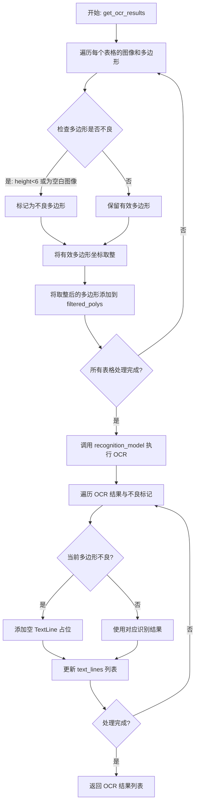

#### 带注释源码

```python
def get_ocr_results(
    self, table_images: List[Image.Image], ocr_polys: List[List[SuryaTableCell]]
):
    # 用于存储每个表格中哪些多边形是"不良"的（需要跳过OCR）
    ocr_polys_bad = []

    # 步骤1: 遍历每个表格的图像和多边形，检测不良多边形
    for table_image, polys in zip(table_images, ocr_polys):
        # 检查每个多边形：高度小于6像素或裁剪区域为空白图像
        table_polys_bad = [
            any(
                [
                    poly.height < 6,  # 高度太小，跳过
                    is_blank_image(table_image.crop(poly.bbox), poly.polygon),  # 空白图像跳过
                ]
            )
            for poly in polys
        ]
        ocr_polys_bad.append(table_polys_bad)

    # 步骤2: 过滤掉不良多边形，并对坐标进行取整
    filtered_polys = []
    for table_polys, table_polys_bad in zip(ocr_polys, ocr_polys_bad):
        filtered_table_polys = []
        for p, is_bad in zip(table_polys, table_polys_bad):
            if is_bad:
                continue  # 跳过不良多边形
            polygon = p.polygon
            # 对多边形坐标进行取整（向下取整）
            for corner in polygon:
                for i in range(2):
                    corner[i] = int(corner[i])

            filtered_table_polys.append(polygon)
        filtered_polys.append(filtered_table_polys)

    # 步骤3: 调用识别模型执行 OCR
    ocr_results = self.recognition_model(
        images=table_images,
        task_names=["ocr_with_boxes"] * len(table_images),
        recognition_batch_size=self.get_recognition_batch_size(),
        drop_repeated_text=self.drop_repeated_table_text,
        polygons=filtered_polys,
        filter_tag_list=self.filter_tag_list,
        max_tokens=2048,
        max_sliding_window=2148,
        math_mode=not self.disable_ocr_math,
    )

    # 步骤4: 将识别结果与原始多边形对齐
    # 由于跳过了一些不良多边形，需要用空结果填充对应位置
    for table_ocr_result, table_polys_bad in zip(ocr_results, ocr_polys_bad):
        updated_lines = []
        idx = 0
        for is_bad in table_polys_bad:
            if is_bad:
                # 不良多边形对应空结果
                updated_lines.append(
                    TextLine(
                        text="",
                        polygon=[[0, 0], [0, 0], [0, 0], [0, 0]],
                        confidence=1,
                        chars=[],
                        original_text_good=False,
                        words=None,
                    )
                )
            else:
                # 有效多边形使用识别结果
                updated_lines.append(table_ocr_result.text_lines[idx])
                idx += 1
        table_ocr_result.text_lines = updated_lines

    return ocr_results
```


### `TableProcessor.assign_ocr_lines`

该方法用于在表格识别过程中，当PDF文本提取无法满足需求时，通过OCR技术为表格单元格分配识别出的文本行。它首先判断哪些表格需要OCR处理，然后调用识别模型获取OCR结果，最后将识别出的文本分配给相应的表格单元格。

参数：

- `tables`：`List[TableResult]`，包含从表格识别模型获取的表格结果列表
- `table_blocks`：`list`，包含表格的块数据列表，每个元素包含表格图像、边界框等信息

返回值：`None`，该方法直接修改传入的 `tables` 和 `table_blocks` 对象，不返回任何值

#### 流程图

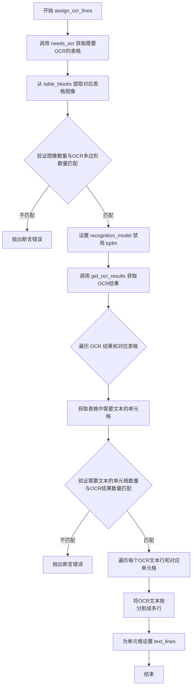

#### 带注释源码

```python
def assign_ocr_lines(self, tables: List[TableResult], table_blocks: list):
    """
    为表格单元格分配OCR识别出的文本行。
    
    该方法处理需要OCR的表格：
    1. 确定哪些表格需要OCR处理
    2. 获取对应的表格图像
    3. 调用OCR识别模型
    4. 将识别结果分配给相应的单元格
    """
    # 第一步：调用 needs_ocr 方法确定哪些表格需要OCR处理
    # 返回需要OCR的表格列表、对应多边形列表和索引
    ocr_tables, ocr_polys, ocr_idxs = self.needs_ocr(tables, table_blocks)
    
    # 第二步：从 table_blocks 中提取需要OCR的表格图像
    # 使用列表推导式过滤出对应索引的表格图像
    det_images = [
        t["table_image"] for i, t in enumerate(table_blocks) if i in ocr_idxs
    ]
    
    # 验证图像数量与OCR多边形数量是否匹配，确保数据一致性
    assert len(det_images) == len(ocr_polys), (
        f"Number of detection images and OCR polygons must match: {len(det_images)} != {len(ocr_polys)}"
    )
    
    # 设置识别模型禁用tqdm进度条
    self.recognition_model.disable_tqdm = self.disable_tqdm
    
    # 第三步：调用OCR识别模型获取识别结果
    ocr_results = self.get_ocr_results(table_images=det_images, ocr_polys=ocr_polys)

    # 第四步：遍历OCR结果，将识别出的文本分配给表格单元格
    for result, ocr_res in zip(ocr_tables, ocr_results):
        # 获取当前表格的所有单元格
        table_cells: List[SuryaTableCell] = result.cells
        
        # 筛选出需要文本的单元格（text_lines 为 None 的单元格）
        cells_need_text = [tc for tc in table_cells if tc.text_lines is None]

        # 验证需要文本的单元格数量与OCR结果中的文本行数量是否匹配
        assert len(cells_need_text) == len(ocr_res.text_lines), (
            "Number of cells needing text and OCR results must match"
        )

        # 遍历OCR文本行和对应需要文本的单元格
        for cell_text, cell_needs_text in zip(ocr_res.text_lines, cells_need_text):
            # 表格识别框是相对于表格的，不需要校正回图像大小
            # 将OCR文本按 <br> 分割成多行文本
            cell_text_lines = [{"text": t} for t in cell_text.text.split("<br>")]
            
            # 为需要文本的单元格设置识别出的文本行
            cell_needs_text.text_lines = cell_text_lines
```


### `TableProcessor.get_table_rec_batch_size`

获取用于表格识别模型的批次大小（batch size），根据硬件设备类型返回合适的默认值。

参数：
- 无

返回值：`int`，返回用于表格识别模型的批次大小。

#### 流程图

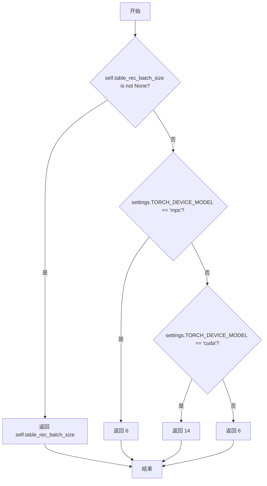

#### 带注释源码

```python
def get_table_rec_batch_size(self):
    """
    获取表格识别模型的批次大小。
    
    如果实例属性 table_rec_batch_size 已设置，则返回该值；
    否则根据硬件设备类型返回默认的批次大小。
    
    Returns:
        int: 表格识别模型的批次大小
    """
    # 检查实例是否已显式设置批次大小
    if self.table_rec_batch_size is not None:
        return self.table_rec_batch_size
    # Apple Silicon (MPS) 设备默认批次大小为 6
    elif settings.TORCH_DEVICE_MODEL == "mps":
        return 6
    # NVIDIA GPU (CUDA) 设备默认批次大小为 14
    elif settings.TORCH_DEVICE_MODEL == "cuda":
        return 14
    # 其他设备（如 CPU）默认批次大小为 6
    return 6
```

#### 相关类字段

| 字段名称 | 类型 | 描述 |
|---------|------|------|
| `table_rec_batch_size` | `Annotated[int, ...]` | 表格识别模型的批次大小，默认为 None（使用模型默认值） |


### `TableProcessor.get_recognition_batch_size`

该方法用于获取表格识别模型（Recognition Model）的批处理大小（batch size）。它首先检查实例是否配置了自定义的 `recognition_batch_size`，如果没有配置，则根据当前的计算设备类型（MPS、CUDA 或 CPU）返回相应的默认批处理大小。

参数： 无（仅包含隐式参数 `self`）

返回值：`int`，表格识别模型的批处理大小

#### 流程图

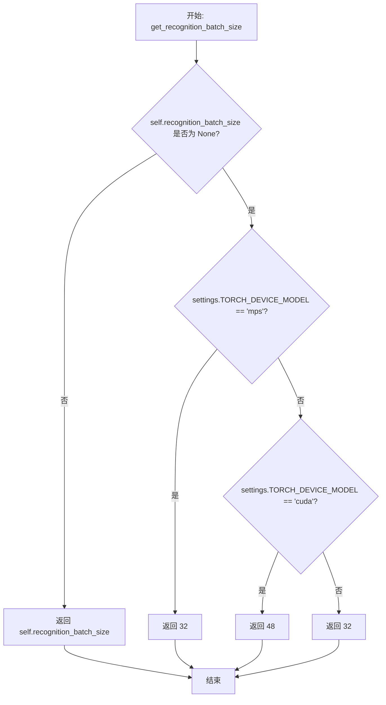

#### 带注释源码

```python
def get_recognition_batch_size(self):
    # 如果实例已配置了自定义的 recognition_batch_size，直接返回该值
    if self.recognition_batch_size is not None:
        return self.recognition_batch_size
    # 如果运行在 Apple Silicon GPU (MPS) 上，返回 32 作为默认批处理大小
    elif settings.TORCH_DEVICE_MODEL == "mps":
        return 32
    # 如果运行在 NVIDIA GPU (CUDA) 上，返回更大的 48 作为默认批处理大小
    # CUDA 设备通常有更多显存，可以支持更大的批处理
    elif settings.TORCH_DEVICE_MODEL == "cuda":
        return 48
    # 默认情况下（CPU 或其他设备），返回 32 作为默认批处理大小
    return 32
```


### `TableProcessor.get_detection_batch_size`

该方法用于获取表格检测模型的批处理大小。如果用户已通过 `detection_batch_size` 参数显式设置批处理大小，则返回该值；否则根据当前计算设备类型返回默认的批处理大小（CUDA 设备返回 10，其他设备返回 4）。

参数： 无

返回值：`int`，表格检测模型的批处理大小

#### 流程图

```mermaid
flowchart TD
    A[Start] --> B{self.detection_batch_size is not None}
    B -->|Yes| C[Return self.detection_batch_size]
    B -->|No| D{settings.TORCH_DEVICE_MODEL == "cuda"}
    D -->|Yes| E[Return 10]
    D -->|No| F[Return 4]
```

#### 带注释源码

```python
def get_detection_batch_size(self):
    """
    Get the batch size for the table detection model.
    
    Returns:
        int: The batch size to use for the detection model.
    """
    # If user explicitly set detection_batch_size, use that value
    if self.detection_batch_size is not None:
        return self.detection_batch_size
    # For CUDA devices, use a larger batch size of 10
    elif settings.TORCH_DEVICE_MODEL == "cuda":
        return 10
    # For other devices (CPU, MPS, etc.), use default batch size of 4
    return 4
```

## 关键组件


### TableProcessor 核心处理器

负责整个表格识别流程的主类，集成检测、识别、OCR等功能，处理PDF文档中的表格提取、结构解析和文本识别。

### 表格识别模型 (table_rec_model)

Surya库的TableRecPredictor模型，用于检测表格结构和单元格位置，返回TableResult结果列表。

### 文本检测模型 (detection_model)

Surya库的DetectionPredictor模型，用于在表格图像中检测文本行位置，为OCR提供文本框信息。

### 文本识别模型 (recognition_model)

Surya库的RecognitionPredictor模型，用于识别表格单元格中的具体文本内容，支持带box的OCR识别模式。

### 表格文本分配 (assign_text_to_cells)

通过矩阵交集计算将PDF文本行映射到对应的表格单元格，使用matrix_intersection_area计算文本行与单元格的交集面积。

### 行分割处理 (split_combined_rows)

检测并分割被合并的多行表格单元格，基于行内单元格数量、行跨度、文本行数等条件判断是否需要分割，支持部分行和整行分割两种模式。

### 美元列合并 (combine_dollar_column)

识别并合并仅包含美元符号的表格列，将美元符号前置到相邻列的文本中，清理表格结构。

### OCR处理流程 (needs_ocr + get_ocr_results + assign_ocr_lines)

完整的OCR处理管道，判断哪些表格需要OCR，调用识别模型，获取结果并分配回表格单元格，包含空白图像过滤机制。

### 表格单元格对齐 (align_table_cells)

根据检测到的文本行调整表格单元格的多边形边界，仅在Y轴方向扩展或收缩以匹配分配的文本行。

### PDF文本提取 (assign_pdftext_lines)

使用pdftext库从PDF原文中提取表格文本内容，通过table_output函数获取表格级别的文本行，避免不必要的OCR。

### 文本规范化 (finalize_cell_text + normalize_spaces)

清理单元格文本内容，包括移除重复分隔符、清理LaTeX格式、转换特殊空格字符为普通空格，使用ftfy库修复文本编码问题。

### 批处理大小管理 (get_*_batch_size)

根据设备类型（CUDA/MPS/CPU）动态返回最佳的模型批处理大小，优化推理性能和内存使用。

## 问题及建议


### 已知问题

- **硬编码的设备特定批次大小**：在 `get_table_rec_batch_size()`、`get_recognition_batch_size()` 和 `get_detection_batch_size()` 方法中，针对不同设备（mps、cuda）硬编码了批次大小值，这些值缺乏灵活配置机制。
- **魔法数字和硬编码阈值**：代码中存在大量硬编码数值（如 `0.01`、`0.95`、`6`、`32`、`48`、`10`、`4`、`2048`、`2148`、`> 3` 等），缺乏统一的配置管理，可读性和可维护性差。
- **方法职责过重**：`__call__` 方法过长（约150行），承担了表格识别流程中的多个步骤，包括数据收集、模型调用、文本分配、单元格处理等，应该拆分为更小的方法。
- **TODO 注释未完成**：`assign_text_to_cells` 方法中有一个 TODO 注释 `# TODO: see if the text needs to be sorted (based on rotation)` 表明排序逻辑未完成。
- **缺少类型提示**：部分变量和方法参数的类型提示不够具体，如 `table_data: list` 应该是更具体的类型。
- **过度使用断言进行错误处理**：代码中多处使用 `assert` 进行运行时验证（如 `assert len(tables) == len(table_data)`），这些断言在 Python 优化模式（`python -O`）下会被跳过，应该使用显式的异常处理。
- **重复的正则表达式逻辑**：`finalize_cell_text` 方法中包含大量正则表达式替换操作，可以提取为私有方法来提高代码复用性和可读性。
- **全局配置依赖**：`filter_tag_list` 作为类属性但缺乏类型注解，且使用 `settings.TORCH_DEVICE_MODEL` 进行设备判断，缺乏对未知设备的默认处理逻辑。

### 优化建议

- 将设备相关的批次大小配置提取为独立的配置类或使用配置文件管理，增加对未知设备的默认处理分支。
- 将 `__call__` 方法拆分为多个私有方法，如 `_collect_table_data`、`_process_table_detection`、`_assign_text_content`、`_finalize_table_structure` 等，每个方法负责单一职责。
- 将 `finalize_cell_text` 中的正则表达式替换逻辑提取为独立的私有方法，如 `_clean_latex_commands`、`_normalize_special_characters` 等。
- 将所有硬编码的阈值（如行分割阈值、空白检测阈值、空白图像高度阈值等）提取为类属性或配置项，提供默认值并允许通过初始化参数覆盖。
- 将 `assert` 语句替换为 `if ... raise ValueError/AssertionError` 的形式，确保在生产环境中也能进行错误检查。
- 完成 TODO 注释中提到的排序逻辑，或移除 TODO 注释并添加相应的技术债务跟踪。
- 添加更具体的类型注解，特别是对于复杂的数据结构（如 `table_data` 应使用 `List[Dict[str, Any]]` 或定义 dataclass）。
- 为 `filter_tag_list` 添加类型注解 `List[str]`，并考虑将其移至配置类中统一管理。
</think>

## 其它


### 设计目标与约束

本处理器的主要设计目标是实现高效的PDF表格识别与结构化处理。具体目标包括：1）支持多种表格类型（普通表格、目录表格、表单）；2）优先使用PDF内嵌文本以提高准确性和性能，仅在必要时调用OCR；3）通过批量处理和设备自适应（CPU/MPS/CUDA）优化推理效率；4）处理复杂的表格结构（如合并单元格、跨列美元符号等）。约束条件包括：依赖Surya系列模型进行表格检测和识别，PDF文本提取依赖pdftext库，以及对图像质量和表格清晰度有一定要求。

### 错误处理与异常设计

代码中的错误处理主要通过断言（assert）实现，包括：1）表格识别结果数量与输入表格数量必须匹配；2）PDF页面数与表格输入数必须一致；3）每个文本行必须包含text和bbox字段；4）需要OCR的表格数量与检测结果数量必须匹配；5）单元格数量与OCR结果数量必须匹配。此外，对于pdftext无法提取文本的表格块，会自动标记为需要OCR。异常情况包括空表格处理（跳过）、空白图像过滤、以及对不完整LaTeX命令的容错处理。Logger用于记录调试信息。

### 数据流与状态机

处理器的数据流如下：1）首先遍历文档提取所有表格块及其图像；2）调用table_rec_model进行表格和单元格检测；3）对于非OCR表格块，调用pdftext提取PDF内嵌文本并分配到对应单元格；4）对于OCR表格块，调用detection_model检测文本位置，然后调用recognition_model进行OCR识别；5）执行后处理：分割合并行、合并美元符号列；6）构建最终的TableCell结构并添加到页面。状态转换主要体现在ocr_block标志：从false（使用PDF文本）到true（需要OCR）的动态切换。

### 外部依赖与接口契约

主要外部依赖包括：1）surya.detection.TextDetectionResult - 文本检测结果，包含bboxes列表；2）surya.recognition.TextLine - OCR识别结果，包含text、polygon、confidence等；3）surya.table_rec.TableResult - 表格识别结果，包含cells列表；4）pdftext.table_output - 返回页面级别的表格文本字典；5）marker.schema.document.Document - 文档对象；6）marker.schema.blocks.tablecell.TableCell - 表格单元格块。接口契约要求：table_rec_model返回List[TableResult]，detection_model返回List[TextDetectionResult]，recognition_model返回OCR结果列表且text_lines数量与输入polygons一致。

### 性能优化策略

代码包含多项性能优化：1）批量处理自适应 - 根据设备类型（MPS/CUDA/CPU）自动设置不同的batch size；2）条件OCR - 仅对需要的表格块进行OCR，避免不必要的计算；3）并行处理支持 - pdftext_workers参数支持多进程PDF文本提取；4）图像尺寸优化 - 使用highres图像提高OCR精度；5）内存效率 - 使用deepcopy避免数据污染，通过filter_tag_list减少OCR识别范围。

### 配置参数说明

处理器提供丰富的配置参数：table_rec_batch_size、detection_batch_size、recognition_batch_size控制各模型批量大小；row_split_threshold（默认0.5）控制行分割阈值；pdftext_workers（默认1）控制PDF解析工作进程数；drop_repeated_table_text控制是否去重OCR结果；disable_ocr、disable_ocr_math分别禁用OCR和数学识别；filter_tag_list定义OCR过滤标签；contained_block_types定义表格内需移除的嵌套块类型。

### 边界条件处理

代码对多种边界条件进行了处理：1）空表格跳过处理；2）单元格rowspan和colspan为1的正常处理；3）跨列美元的合并逻辑；4）部分行分割（允许单列单行存在）；5）非拉丁字符空格替换（normalize_spaces方法处理6种Unicode空格）；6）空白图像过滤（is_blank_image检测）；7）LaTeX命令容错（处理不完整的\命令）。此外，通过intersection_pct > 0.95阈值判断子块是否应被移除。

### 日志与监控

使用marker.logger.get_logger获取日志器，主要用于debug级别记录表格是否需要OCR的决策信息。处理器未包含性能指标收集或进度报告机制，但支持disable_tqdm参数控制tqdm进度条显示。配置参数通过Annotated类型注解进行了自描述，便于配置管理和文档化。


    