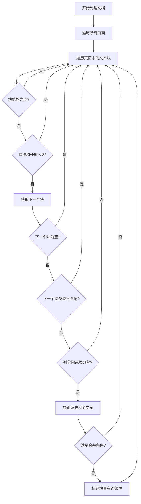
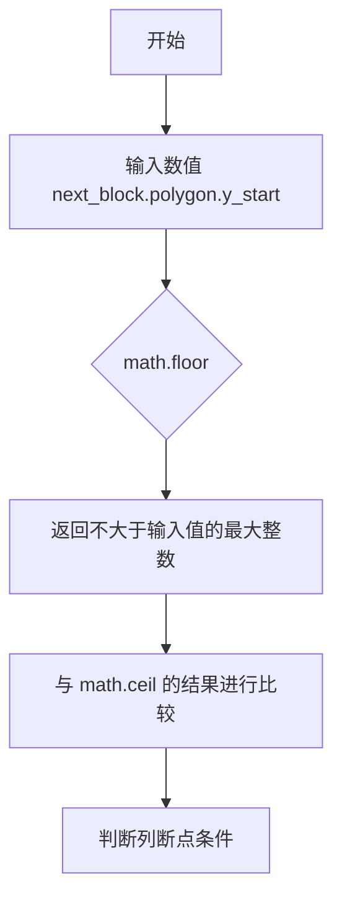
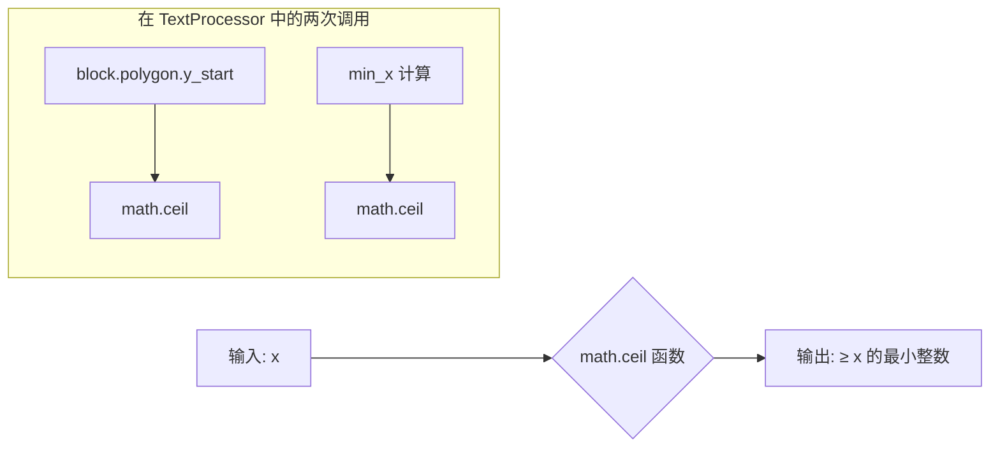
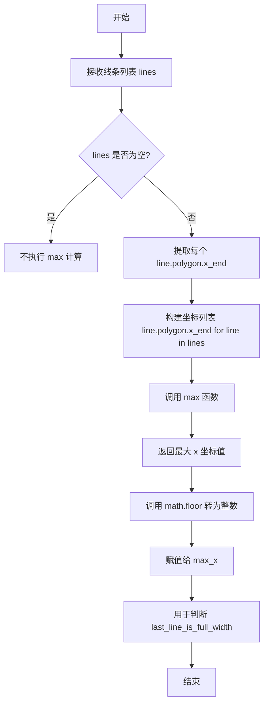
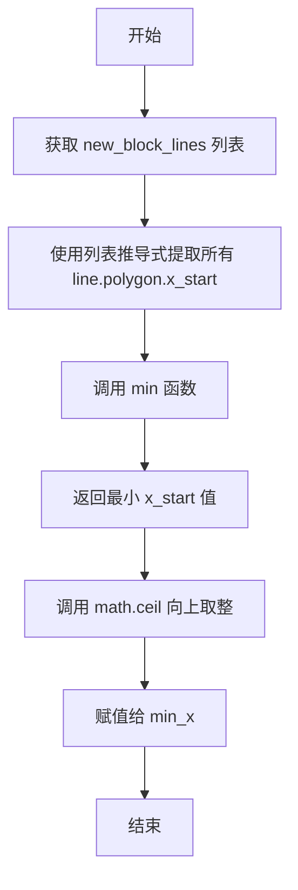
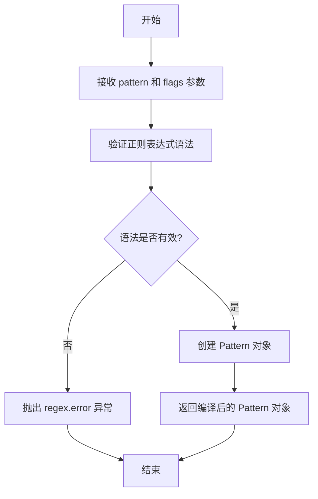

# `marker\marker\processors\text.py` 详细设计文档

一个文档后处理器，用于合并跨越页面和列边界的文本块，通过分析文本的几何位置、缩进和连字符等特征来判断文本是否应该被视为连续内容。

## 整体流程



## 类结构

```
BaseProcessor (抽象基类)
└── TextProcessor (文本处理器)
```

## 全局变量及字段


### `TextProcessor.block_types`
    
要处理的块类型，包含Text和TextInlineMath

类型：`tuple`
    


### `TextProcessor.ignored_block_types`
    
忽略的块类型，包含页眉和页脚

类型：`tuple`
    


### `TextProcessor.column_gap_ratio`
    
页面宽度与列间隙的最小比率，用于判断列分隔

类型：`Annotated[float, 描述]`
    
    

## 全局函数及方法


### `math.floor`

`math.floor` 是 Python 标准库中的数学函数，用于返回给定数字的下取整结果（即不大于该数字的最大整数）。在该代码中用于对多边形的 y 坐标进行下取整处理，以判断列或页之间的位置关系。

参数：

- `x`：`float` 或 `int`，需要向下取整的数字

返回值：`int`，返回不大于 x 的最大整数

#### 流程图



#### 带注释源码

```python
# 在 TextProcessor 类中用于检测列断点
# 对 next_block 的起始 y 坐标进行下取整
# 对 block 的起始 y 坐标进行上取整
# 如果 next_block 的 y_start 下取整值 <= block 的 y_start 上取整值
# 并且 next_block 的 x_start 超过 block 的 x_end 加上列间距，则判定为列断点
column_break = math.floor(next_block.polygon.y_start) <= math.ceil(
    block.polygon.y_start
) and next_block.polygon.x_start > (
    block.polygon.x_end + column_gap
)
```

#### 在代码中的上下文

在 `TextProcessor` 类的 `__call__` 方法中，`math.floor` 被用于处理文档中块（block）的位置判断：

```python
# 计算列断点判断
column_break = math.floor(next_block.polygon.y_start) <= math.ceil(
    block.polygon.y_start
) and next_block.polygon.x_start > (
    block.polygon.x_end + column_gap
)
```

同时代码中还使用了 `math.ceil`（上取整）来配合 `math.floor` 进行坐标的比较判断，以确定文本块之间是否存在列分隔或页分隔，从而决定是否将相邻的块标记为具有连续性（`has_continuation = True`）。

#### 潜在的技术债务或优化空间

1. **魔法数字**：列间距比率 `column_gap_ratio` 设置为 0.02，这个值可能需要根据不同的文档类型进行调整
2. **多次计算**：在循环中多次调用 `document.get_page()` 等方法，可能导致性能问题
3. **正则表达式编译**：正则表达式在每次循环中都可能被编译，应该在类初始化时预编译


### `math.ceil`

这是 Python 标准库中的数学函数，用于对数值进行向上取整。在该代码中用于计算列断点的边界和处理文本块的缩进。

参数：

-  `x`：`float` 或 `int`，需要向上取整的数值

返回值：`int`，返回大于或等于 `x` 的最小整数（向上取整的结果）

#### 流程图



#### 带注释源码

```python
# math.ceil 在该代码中有两处使用：

# 第一次使用（第 58 行）：
# 用于判断列断点，计算当前块的 y_start 向上取整值
column_break = math.floor(next_block.polygon.y_start) <= math.ceil(
    block.polygon.y_start
) and next_block.polygon.x_start > (
    block.polygon.x_end + column_gap
)

# 第二次使用（第 77 行）：
# 用于计算新块中所有行的 x_start 最小值的向上取整
# 目的是判断下一块是否从比最小 x 坐标更右边的位置开始（即是否有缩进）
if len(new_block_lines):
    min_x = math.ceil(
        min([line.polygon.x_start for line in new_block_lines])
    )
    next_block_starts_indented = (
        new_block_lines[0].polygon.x_start > min_x
    )
```


### `max` (Python 内置函数)

在给定的代码中，实际上并未使用 `math.max`，而是使用了 Python 的内置 `max` 函数。该函数用于计算线条列表中最大 x 坐标值，配合 `math.floor` 用于判断最后一行是否是全宽文本。

参数：

-  `iterable`：`Iterable[Number]`，一个可迭代的数字序列（如列表推导式生成的坐标值列表）
-  `*default`：（可选）`Any`，当可迭代对象为空时返回的默认值

返回值：`Number`，返回可迭代对象中的最大值

#### 流程图



#### 带注释源码

```python
# 在 TextProcessor 类中，__call__ 方法的部分代码

# 从 block 的结构中获取所有线条，筛选宽度大于 1 的线条
lines: List[Line] = [
    line
    for line in block.structure_blocks(document)
    if line.polygon.width > 1
]

# 如果存在有效线条
if len(lines):
    # 使用 Python 内置 max 函数计算所有线条中 x_end 的最大值
    # 然后使用 math.floor 向下取整得到整数坐标
    max_x = math.floor(max([line.polygon.x_end for line in lines]))
    
    # 判断最后一行是否是全宽（最后一行 x_end >= 最大 x 坐标）
    last_line_is_full_width = lines[-1].polygon.x_end >= max_x
```

---

**注意**：代码中实际使用的是 Python 内置的 `max()` 函数，而非 `math.max()`。`math.max` 在 Python 数学模块中并不存在，正确的数学模块函数是 `math.fmax()` 用于处理 NaN 值的情况。这里使用的是标准的 Python 内置函数 `max`，常配合 `math.floor` 或 `math.ceil` 使用来获取整数值坐标。


### `min`

`min` 是 Python 内置函数，用于返回可迭代对象中的最小值。在本代码中用于获取新块结构中所有行的最小 x 起始坐标。

参数：

- `iterable`：`List[Line]`，通过列表推导式 `[line.polygon.x_start for line in new_block_lines]` 获取的所有行的 x_start 值的列表

返回值：`float`，返回可迭代对象中的最小值（float 类型）

#### 流程图



#### 带注释源码

```python
# 从 new_block_lines (Block 结构块) 中提取所有行的 x_start 坐标
# 并找出最小值，然后向上取整
min_x = math.ceil(
    min([line.polygon.x_start for line in new_block_lines])  # min 是 Python 内置函数，用于返回可迭代对象中的最小值
)
# 用途：计算新块中所有行的最小 x 起始坐标，用于判断下一块是否相对于当前块缩进
```


### `regex.compile`

编译正则表达式模式返回一个正则表达式对象，用于后续的模式匹配操作。

参数：

- `pattern`：`str`，要编译的正则表达式模式字符串
- `flags`：`int`（可选），正则表达式标志，如 `regex.DOTALL` 表示 `.` 匹配包括换行符在内的任意字符

返回值：`regex.Pattern`，编译后的正则表达式对象，可用于 `match()`、`search()`、`findall()` 等方法

#### 流程图



#### 带注释源码

```python
# 编译正则表达式用于检测连字符
# 模式说明：
#   .*         - 匹配任意字符（除换行符）零次或多次
#   [\p{Ll}|\d] - 匹配小写字母或数字
#   [-—¬]      - 匹配连字符、长破折号或软连字符
#   \s?        - 可选的空白字符
#   $          - 行尾
# regex.DOTALL 标志使 . 可以匹配换行符
last_line_is_hyphentated = regex.compile(
    r".*[\p{Ll}|\d][-—¬]\s?$",  # pattern: str，要匹配的正则表达式模式
    regex.DOTALL                # flags: int，正则表达式标志
).match(  # 返回 regex.Pattern 对象后立即调用 match 方法
    lines[-1].raw_text(document).strip()  # 对最后一行文本进行匹配
)
```


### `TextProcessor.__init__`

初始化 TextProcessor 实例，调用父类 BaseProcessor 的构造函数进行基础配置。

参数：

- `config`：`Any`，配置对象，用于初始化处理器的配置参数

返回值：`None`，初始化处理器，调用父类构造函数

#### 流程图

```mermaid
graph TD
    A[开始 __init__] --> B[接收 config 参数]
    B --> C[调用 super().__init__config]
    C --> D[结束]
    
    style A fill:#e1f5fe
    style D fill:#e1f5fe
```

#### 带注释源码

```python
def __init__(self, config):
    """
    初始化 TextProcessor 实例
    
    参数:
        config: 配置对象，用于传递给父类 BaseProcessor 的初始化方法
        
    返回值:
        None
    """
    super().__init__(config)  # 调用父类 BaseProcessor 的构造函数进行初始化
```

---

## TextProcessor 类详细信息

### 一段话描述

TextProcessor 是一个文档处理器，用于跨页面和列合并文本内容，通过检测文本块的排版特征（如列间距、页边距、缩进等）来判断相邻文本块是否应该被连接成一个连续的内容块。

### 文件整体运行流程

```
1. 初始化 TextProcessor (调用 __init__)
2. 调用 __call__ 方法处理文档
3. 遍历文档的每一页
4. 对每个符合条件的文本块进行检测：
   - 获取下一个相邻块
   - 检测是否存在列分隔或页分隔
   - 检查文本块的缩进和排版特征
   - 判断是否应该合并文本块（设置 has_continuation 标志）
```

### 类的详细信息

#### 类字段

- `block_types`：`Tuple[BlockTypes, ...]`，指定处理的块类型（Text 和 TextInlineMath）
- `ignored_block_types`：`Tuple[BlockTypes, ...]`，忽略的块类型（页眉和页脚）
- `column_gap_ratio`：`Annotated[float, "..."]`，列间距比率阈值，默认为 0.02

#### 类方法

##### `__init__(self, config: Any) -> None`

- 参数：
  - `config`：`Any`，配置对象
- 返回值：`None`
- 描述：初始化处理器，调用父类构造函数

##### `__call__(self, document: Document) -> None`

- 参数：
  - `document`：`Document`，待处理的文档对象
- 返回值：`None`
- 描述：处理文档，检测并标记需要跨页或跨列合并的文本块

### 关键组件信息

| 组件名称 | 描述 |
|---------|------|
| BaseProcessor | 处理器基类，提供基础处理框架 |
| Document | 文档对象，包含页面和块结构 |
| BlockTypes | 枚举类型，定义文档块的类型 |
| Line | 文本行对象，包含位置和文本信息 |

### 潜在的技术债务或优化空间

1. **魔法数字**：代码中存在多个硬编码的数值（如 `>= 2`、`width > 1`），建议提取为可配置参数
2. **正则表达式编译**：正则表达式在循环中每次都编译，应提取到类级别或模块级别进行预编译
3. **复杂条件判断**：合并判断的条件嵌套较深，可考虑拆分为独立的辅助方法提高可读性
4. **类型注解不完整**：部分变量缺少类型注解（如 `column_break`、`page_break`）

### 其它项目

#### 设计目标与约束

- **目标**：正确识别跨页、跨列的连续文本块
- **约束**：仅处理 Text 和 TextInlineMath 类型的块，跳过单行块和被忽略的块

#### 错误处理与异常设计

- 代码中大量使用 `continue` 跳过不符合条件的块，属于静默处理模式
- 对于 `structure is None` 的情况直接跳过，未记录日志

#### 数据流与状态机

- 文本块状态通过 `has_continuation` 标志位标记
- 检测流程：获取下一个块 → 判断分隔类型 → 检查缩进和排版特征 → 决定是否合并

#### 外部依赖与接口契约

- 依赖 `BaseProcessor`：提供处理器基础框架
- 依赖 `Document`：提供文档结构访问接口
- 依赖 `regex` 库：用于连字符检测


### `TextProcessor.__call__`

该方法是文本处理器的核心入口，通过遍历文档中的所有页面和文本块，检测跨页或跨列的文本连续性，并根据缩进、列断/页断、满宽行和连字符等条件设置 `has_continuation` 标志，以实现文本块的合并。

参数：

-  `document`：`Document`，待处理的文档对象

返回值：`None`，该方法直接修改文档对象的块属性，不返回任何值

#### 流程图

```mermaid
flowchart TD
    A([开始]) --> B[遍历文档每一页]
    B --> C[遍历页面中的文本块]
    C --> D{块结构是否存在且包含至少2行?}
    D -->|否| C
    D -->|是| E[获取下一个块]
    E --> F{下一个块是否存在?}
    F -->|否| C
    F --> G{下一个块是文本类型?}
    G -->|否| C
    G --> H{下一个块结构存在且未被忽略?}
    H -->|否| C
    H --> I{计算列间隙]
    I --> J{判断列断或页断}
    J --> K{列断或页断?}
    K -->|否| C
    K -->|是| L[获取新块的所有行]
    L --> M[检查下一块是否缩进]
    M --> N[获取当前块的有效行]
    N --> O{是否有有效行?}
    O -->|否| C
    O -->|是| P[检查最后一行是否满宽]
    P --> Q[检查最后一行是否连字符结尾]
    Q --> R{满足连续性条件?}
    R -->|否| C
    R -->|是| S[设置 has_continuation = True]
    S --> C
```

#### 带注释源码

```python
def __call__(self, document: Document):
    """
    主处理方法，遍历文档块并检测文本连续性
    
    该方法实现了跨页和跨列文本块的连续性检测逻辑：
    1. 遍历所有页面和文本块
    2. 检测列断和页断情况
    3. 根据缩进、满宽行、连字符等条件判断文本是否应标记为连续
    """
    # 遍历文档中的每一页
    for page in document.pages:
        # 遍历当前页中所有符合类型的文本块
        for block in page.contained_blocks(document, self.block_types):
            # 跳过没有结构的块
            if block.structure is None:
                continue

            # 跳过单行块（没有连续性检测的意义）
            if not len(block.structure) >= 2:  # Skip single lines
                continue

            # 获取当前块的下一个块（根据忽略类型过滤）
            next_block = document.get_next_block(block, self.ignored_block_types)
            if next_block is None:  # we've reached the end of the document
                continue
            # 跳过非文本类型的块
            if next_block.block_type not in self.block_types:
                continue  # we found a non-text block
            # 跳过结构为空的块（异常情况）
            if next_block.structure is None:
                continue  # This is odd though, why do we have text blocks with no structure?
            # 跳过被忽略输出的块
            if next_block.ignore_for_output:
                continue  # skip ignored blocks

            # 计算列间隙阈值：基于当前块宽度和列间隙比例
            column_gap = block.polygon.width * self.column_gap_ratio

            # 初始化判断标志
            column_break, page_break = False, False
            next_block_starts_indented = True  # 下一块是否缩进
            next_block_in_first_quadrant = False  # 下一块是否在第一象限
            last_line_is_full_width = False  # 最后一行是否满宽
            last_line_is_hyphentated = False  # 最后一行是否连字符结尾

            # 判断是同页块还是跨页块
            if next_block.page_id == block.page_id:  # block on the same page
                # 检查列断：判断y坐标重叠且x坐标有足够间隙
                # 条件：下一块的y_start <= 当前块的y_start，且 x_start > x_end + column_gap
                column_break = math.floor(next_block.polygon.y_start) <= math.ceil(
                    block.polygon.y_start
                ) and next_block.polygon.x_start > (
                    block.polygon.x_end + column_gap
                )
            else:
                # 跨页情况，标记为页断
                page_break = True
                # 获取下一页信息
                next_page = document.get_page(next_block.page_id)
                # 检查下一块是否在页面的第一象限（左上区域）
                next_block_in_first_quadrant = (
                    next_block.polygon.x_start < next_page.polygon.width // 2
                ) and (next_block.polygon.y_start < next_page.polygon.height // 2)

            # 如果既不是列断也不是页断，则跳过当前块
            if not (column_break or page_break):
                continue

            # 获取下一块的所有行结构
            new_block_lines = next_block.structure_blocks(document)

            # 检查下一块的缩进情况
            # 计算所有行的最小x坐标
            if len(new_block_lines):
                min_x = math.ceil(
                    min([line.polygon.x_start for line in new_block_lines])
                )
                # 如果第一行的x_start大于最小x，则认为有缩进
                next_block_starts_indented = (
                    new_block_lines[0].polygon.x_start > min_x
                )

            # 获取当前块的有效行（宽度大于1，排除噪声）
            lines: List[Line] = [
                line
                for line in block.structure_blocks(document)
                if line.polygon.width > 1
            ]
            if len(lines):
                # 计算当前块的最大x坐标
                max_x = math.floor(max([line.polygon.x_end for line in lines]))
                # 判断最后一行是否接近最大x（满宽）
                last_line_is_full_width = lines[-1].polygon.x_end >= max_x

                # 检查最后一行是否以连字符结尾（使用正则匹配）
                # 匹配模式：任意字符 + 小写字母或数字 + 连字符/破折号/软连字符 + 可选空白
                last_line_is_hyphentated = regex.compile(
                    r".*[\p{Ll}|\d][-—¬]\s?$", regex.DOTALL
                ).match(lines[-1].raw_text(document).strip())

            # 综合判断是否设置连续性标志
            # 条件：
            # 1. 最后一行满宽 或 最后一行连字符结尾
            # 2. 下一块没有缩进
            # 3. (在第一象限且是页断) 或 是列断
            if (
                (last_line_is_full_width or last_line_is_hyphentated)
                and not next_block_starts_indented
                and ((next_block_in_first_quadrant and page_break) or column_break)
            ):
                # 标记当前块有后续内容，用于文本合并
                block.has_continuation = True
```


### `BaseProcessor.__init__`

基类初始化方法，用于初始化处理器实例。

参数：

-  `config`：`Any`，配置对象

返回值：`None`，无返回值描述

#### 流程图

```mermaid
flowchart TD
    A[开始 __init__] --> B[接收 config 参数]
    B --> C[调用 super().__init__config]
    C --> D[结束]
```

#### 带注释源码

```python
def __init__(self, config):
    """
    基类初始化方法
    
    参数:
        config: 配置对象
        
    返回值:
        None
    """
    super().__init__(config)
```


## 关键组件


### 列断点检测逻辑

通过计算相邻块之间的水平距离与列间隙阈值的比较，判断是否存在列分隔。当下一块的y坐标不大于当前块的y坐标结束位置，且x起始位置超过当前块右侧加上列间隙的距离时，判定为列断点。

### 页面断点检测逻辑

当相邻块位于不同页面时，触发页面断点检测。同时计算下一块是否位于新页面的第一象限（x位置小于页面宽度的一半，y位置小于页面高度的一半），用于判断文本是否可能为新段落的起始。

### 缩进检测机制

通过获取下一文本块所有行的最小x坐标，判断下一块的首行是否相对于最小x坐标有向右的偏移。若有偏移则判定为缩进，用于区分段落首行与后续行的格式差异。

### 完整宽度行判断

计算当前块所有行（宽度大于1）的最大x结束位置，判断最后一行是否达到该最大位置。若达到则判定为完整宽度行，表示该行可能是段落的自然结束而非被截断。

### 连字符检测

使用正则表达式匹配行尾是否包含连字符、破折号或软连字符后跟可选空白字符，用于判断当前行是否被连字符截断从而需要与下一块合并。

### 文本合并决策逻辑

综合判断四个条件：当前行是完整宽度或被连字符截断、下一块不是缩进起始、且（下一块位于第一象限且有页面断点或有列断点）。当全部满足时，将当前块标记为有续篇(`has_continuation = True`)，触发后续的跨块文本合并流程。

### 忽略块类型过滤

在遍历时跳过页面页眉和页脚类型的块，同时检查块是否被标记为忽略输出(?ignore_for_output)，避免将不应显示的内容参与文本合并决策。


## 问题及建议


### 已知问题

-   **正则表达式重复编译**: 在循环内部使用 `regex.compile()` 每次迭代都会重新编译正则表达式 `r".*[\p{Ll}|\d][-—¬]\s?$"`，严重影响性能
-   **魔法数字缺乏解释**: `column_gap_ratio = 0.02` 是硬编码的阈值常量，没有任何注释说明该值的选取依据
-   **计算结果未缓存**: `min_x` 和 `max_x` 在每次迭代中重新计算，且没有对空列表情况进行防护，可能导致运行时错误
-   **条件判断嵌套过深**: 多层嵌套的 if 语句（尤其在 `__call__` 方法中）导致代码可读性和可维护性较差
-   **变量初始化冗余**: `column_break`、`page_break` 等变量在 if-else 分支前初始化，但实际使用范围有限，造成理解困惑
-   **缺少早期返回模式**: 大量 `continue` 语句用于跳过不满足条件的块，逻辑流程不够清晰
-   **类型注解不完整**: 方法参数和局部变量缺少类型注解，影响代码的可读性和静态分析
-   **模块级别依赖**: 直接从 `marker.schema` 导入多个模块，可能导致循环依赖风险

### 优化建议

-   将正则表达式提升为类级别的常量，使用类属性或模块级变量预先编译
-   将 `column_gap_ratio` 配置化，可通过 `config` 参数传入，增加灵活性
-   添加列表空值检查防护，避免在空列表上调用 `min()`/`max()` 导致 ValueError
-   将复杂的条件判断提取为独立的私有方法，如 `_check_column_break()`、`_check_page_break()` 等，提高代码可读性
-   使用早返回策略重构循环逻辑，将主要的跳过条件提前处理，减少嵌套层级
-   为所有方法和关键变量添加类型注解，提升代码可维护性
-   考虑将 `ignored_block_types` 和 `block_types` 也配置化，支持更灵活的文本块过滤策略

## 其它


### 设计目标与约束

**设计目标**：
- 实现跨页面和跨列的文本块智能合并
- 准确识别文本块的延续性（段落拆分情况）
- 处理多种文档布局（单栏、双栏、多栏）
- 最小化误判（错误地将不相关的文本块合并）

**设计约束**：
- 依赖marker.schema中的BlockTypes定义
- 依赖document对象的get_next_block和get_page方法
- 处理对象必须包含polygon几何信息
- 仅处理Text和TextInlineMath类型的块
- 不修改原始文档结构，仅设置has_continuation标志

### 错误处理与异常设计

**异常处理机制**：
- 显式检查None值：block.structure为None时跳过
- 结构长度验证：len(block.structure) < 2时跳过
- 边界条件处理：使用math.floor和math.ceil处理坐标比较
- 缺失属性保护：next_block.ignore_for_output的显式检查

**错误传播**：
- 本处理器为纯检查逻辑，不抛出业务异常
- 所有条件判断通过continue跳过不符合条件的块
- 依赖上游BaseProcessor的异常处理机制

### 数据流与状态机

**输入数据流**：
- Document对象 → 页面集合 → 块集合 → 几何信息
- 块属性：polygon（几何）、structure（结构）、block_type（类型）、ignore_for_output（标志）

**状态转换**：
- 初始状态：遍历页面中的所有目标块
- 块过滤状态：检查块结构存在性和长度
- 相邻块查找状态：获取下一个有效块
- 布局判断状态：计算列断/页断标志
- 续写判断状态：评估缩进、全角行、连字符特征
- 终态：设置block.has_continuation标志或继续下一块

### 外部依赖与接口契约

**依赖的模块**：
- marker.processors.BaseProcessor：处理器基类
- marker.schema.BlockTypes：块类型枚举
- marker.schema.document.Document：文档模型
- marker.schema.text.line.Line：行对象模型
- regex：正则表达式处理（连字符检测）
- math：数学运算（floor、ceil）

**关键接口契约**：
- `document.pages`：页面迭代器
- `document.get_next_block(block, ignored_types)`：获取下一块
- `document.get_page(page_id)`：获取页面对象
- `block.contained_blocks(document, block_types)`：迭代contained块
- `block.structure_blocks(document)`：获取结构块
- `block.polygon`：几何信息（x_start, y_start, x_end, y_end, width, height）

### 性能考量与优化空间

**当前性能特征**：
- O(n×m)时间复杂度：遍历所有块，对每个块查找下一块
- 空间复杂度：O(1)额外空间
- 多次遍历结构块：structure_blocks被调用多次

**优化建议**：
- 缓存structure_blocks结果避免重复计算
- 使用早期continue减少不必要的属性访问
- 预编译regex模式（当前在循环内编译）
- 考虑并行处理不同页面的块

### 关键算法逻辑

**列断检测算法**：
```
column_break = floor(next_block.y_start) <= ceil(block.y_start) 
               AND next_block.x_start > (block.x_end + column_gap)
```
条件解读：下一个块的起始y坐标不超过当前块的结束y坐标（同一水平位置），且x坐标超过当前块右边缘加间隙（右侧新列）

**页断检测**：
- 简单设置为block和next_block的page_id不同

**续写条件判断**：
```
(last_line_is_full_width OR last_line_is_hyphentated)
AND NOT next_block_starts_indented
AND ((next_block_in_first_quadrant AND page_break) OR column_break)
```
逻辑：当前块末尾为完整行或连字符结尾，且下一块未缩进，且满足列断或（首页象限且页断）

### 配置参数说明

| 参数名 | 类型 | 默认值 | 说明 |
|--------|------|--------|------|
| column_gap_ratio | float | 0.02 | 列间隙与页面宽度的最小比例，用于判断列断 |
| block_types | tuple | (Text, TextInlineMath) | 目标处理的块类型 |
| ignored_block_types | tuple | (PageHeader, PageFooter) | 忽略的块类型 |

### 与其他处理器的协作

**上游处理器**：
- 依赖BaseProcessor的前置处理完成块结构解析
- 依赖layout分析器完成几何信息标注

**下游影响**：
- 设置has_continuation标志供输出渲染器使用
- 不直接修改文档内容，仅设置元数据

### 测试场景覆盖

**边界条件**：
- 单行块跳过
- 结构为None的块处理
- 文档末尾块的处理
- 非文本块（图片、表格等）的跳过

**典型场景**：
- 跨页段落的正确识别
- 双栏文档的列内续写识别
- 带连字符的跨页单词处理
- 首行缩进的中文段落处理
- 页眉页脚内容的忽略

    