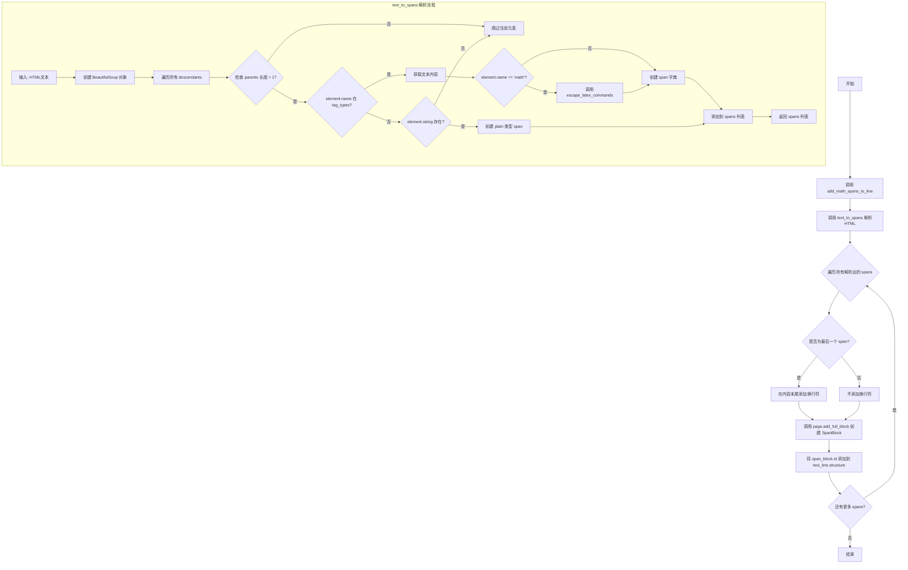
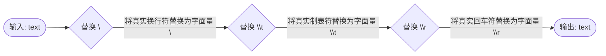
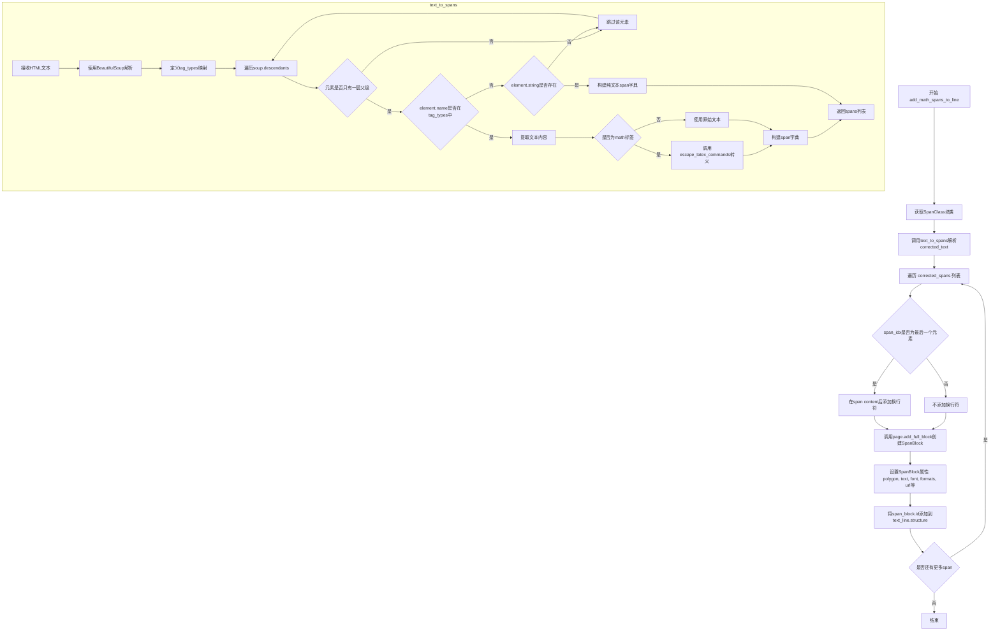
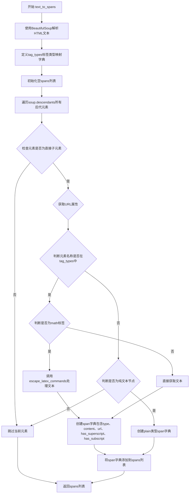

# `marker\marker\processors\util.py` 详细设计文档

该代码是一个文本到结构化文档块（spans）的转换工具，主要用于PDF/文档解析场景。它接收HTML格式的文本输入，通过BeautifulSoup解析识别文本格式（粗体、斜体、上下标、链接等），特别处理LaTeX数学公式，并将这些格式化文本转换为marker框架的Span块对象，最终添加到页面组中形成结构化的文档表示。

## 整体流程



## 类结构

```
代码为模块文件，无类定义
主要包含3个全局函数:
├── escape_latex_commands (文本处理工具函数)
├── add_math_spans_to_line (主转换函数)
└── text_to_spans (HTML解析函数)
```

## 全局变量及字段


### `tag_types`
    
HTML标签到格式类型的映射字典，用于识别b/i/math/sub/sup/span等标签对应的格式

类型：`dict`
    


### `spans`
    
存储解析后的span元素列表，每个span包含type/content/url/has_superscript/has_subscript等属性

类型：`list`
    


### `text_line`
    
输入的文本行对象，包含polygon/page_id/structure等属性

类型：`Line`
    


### `page`
    
页面组对象，用于添加创建的块

类型：`PageGroup`
    


### `SpanClass`
    
通过get_block_class获取的Span块类

类型：`class`
    


### `corrected_text`
    
经过校正的HTML文本输入

类型：`str`
    


### `corrected_spans`
    
从corrected_text解析出的span列表

类型：`list`
    


### `soup`
    
BeautifulSoup解析器对象

类型：`BeautifulSoup`
    


### `function.escape_latex_commands`
    
转义LaTeX特殊字符的函数，将换行符、制表符和回车符替换为对应的LaTeX命令

类型：`function`
    


### `function.add_math_spans_to_line`
    
将校正后的文本解析为spans并添加到页面行中的核心函数，处理数学公式和格式

类型：`function`
    


### `function.text_to_spans`
    
将HTML文本解析为span对象列表的函数，识别各种HTML标签并转换为对应的格式类型

类型：`function`
    
    

## 全局函数及方法


### `escape_latex_commands`

该函数负责将文本中的特殊控制字符（换行符 `\n`、制表符 `\t`、回车符 `\r`）转换为LaTeX文档中可识别的字面量转义序列（`\\n`、`\\t`、`\\r`），以防止这些字符在LaTeX编译时破坏文档结构或引发格式错误。

参数：
- `text`：`str`，需要进行转义处理的原始字符串。

返回值：`str`，返回已将特殊字符转义为LaTeX安全格式的字符串。

#### 流程图



#### 带注释源码

```python
def escape_latex_commands(text: str):
    """
    转义LaTeX命令中的特殊字符。
    
    将文本中的真实换行符(\\n)、制表符(\\t)和回车符(\\r)替换为
    LaTeX可解析的字面量字符串(\\\\n, \\\\t, \\\\r)。
    
    参数:
        text (str): 输入的原始文本。
        
    返回:
        str: 转义后的文本。
    """
    # 使用链式调用依次替换三种特殊字符
    # 真实字符 -> LaTeX字面量
    text = (text
            .replace('\n', '\\n')
            .replace('\t', '\\t')
            .replace('\r', '\\r'))
    return text
```


### `add_math_spans_to_line`

该函数是主转换函数，负责将包含HTML标签的修正文本转换为Span块，并将其添加到页面组中。它解析HTML结构，提取不同类型的文本元素（粗体、斜体、数学公式、上标、下标等），为每个元素创建对应的SpanBlock对象，最后将这些块添加到页面并关联到文本行。

参数：

- `corrected_text`：`str`，包含HTML标签的修正文本，用于解析并转换为Span块
- `text_line`：`Line`，目标文本行对象，用于获取多边形信息和页面ID，并接收生成的Span块ID
- `page`：`PageGroup`，页面组对象，用于添加完整的块到页面中

返回值：`None`，该函数直接修改传入的`text_line`和`page`对象，不返回任何值

#### 流程图



#### 带注释源码

```python
def add_math_spans_to_line(corrected_text: str, text_line: Line, page: PageGroup):
    """
    主转换函数：将HTML文本转换为Span块并添加到页面组
    
    参数:
        corrected_text: 包含HTML标签的修正文本字符串
        text_line: Line对象，代表页面中的一行文本
        page: PageGroup对象，用于添加完整的块到页面中
    
    返回:
        None (直接修改传入的对象)
    """
    # 从块类型注册表获取Span类的构造函数
    SpanClass = get_block_class(BlockTypes.Span)
    
    # 调用辅助函数将HTML文本解析为span字典列表
    corrected_spans = text_to_spans(corrected_text)

    # 遍历所有解析出的span元素
    for span_idx, span in enumerate(corrected_spans):
        # 如果是最后一个span，在内容末尾添加换行符
        if span_idx == len(corrected_spans) - 1:
            span['content'] += "\n"

        # 创建SpanBlock并添加到页面，获取块引用
        span_block = page.add_full_block(
            SpanClass(
                polygon=text_line.polygon,           # 继承文本行的多边形区域
                text=span['content'],                # span的实际文本内容
                font='Unknown',                      # 字体名称（默认未知）
                font_weight=0,                       # 字体权重
                font_size=0,                         # 字体大小
                minimum_position=0,                  # 最小位置
                maximum_position=0,                  # 最大位置
                formats=[span['type']],              # 格式化类型：bold/italic/math/plain
                url=span.get('url'),                 # 可选的URL链接
                page_id=text_line.page_id,           # 关联的页面ID
                text_extraction_method="gemini",    # 文本提取方法
                has_superscript=span["has_superscript"],   # 是否有上标
                has_subscript=span["has_subscript"]        # 是否有下标
            )
        )
        # 将创建的span块ID追加到文本行的结构列表中
        text_line.structure.append(span_block.id)


def text_to_spans(text):
    """
    辅助函数：解析HTML文本并转换为span字典列表
    
    参数:
        text: HTML格式的文本字符串
    
    返回:
        spans: 包含多个字典的列表，每个字典代表一个span元素
    """
    # 使用BeautifulSoup解析HTML文本
    soup = BeautifulSoup(text, 'html.parser')

    # 定义HTML标签到格式化类型的映射关系
    tag_types = {
        'b': 'bold',       # 粗体
        'i': 'italic',     # 斜体
        'math': 'math',    # 数学公式
        'sub': 'plain',    # 下标（视为普通文本）
        'sup': 'plain',    # 上标（视为普通文本）
        'span': 'plain'   # 普通文本
    }
    spans = []

    # 遍历所有后代元素
    for element in soup.descendants:
        # 只处理直接子元素（父级列表长度为1表示为根元素）
        if not len(list(element.parents)) == 1:
            continue

        # 获取元素的href属性（如果存在）
        url = element.attrs.get('href') if hasattr(element, 'attrs') else None

        # 如果元素名称在tag_types映射中
        if element.name in tag_types:
            # 获取元素的文本内容
            text = element.get_text()
            # 如果是math标签，需要转义LaTeX命令
            if element.name == "math":
                text = escape_latex_commands(text)
            # 构建span字典并添加到列表
            spans.append({
                'type': tag_types[element.name],
                'content': text,
                'url': url,
                "has_superscript": element.name == "sup",
                "has_subscript": element.name == "sub"
            })
        # 如果元素没有名称但有字符串内容（纯文本节点）
        elif element.string:
            spans.append({
                'type': 'plain',
                'content': element.string,
                'url': url,
                "has_superscript": False,
                "has_subscript": False
            })

    return spans


def escape_latex_commands(text: str):
    """
    辅助函数：转义LaTeX特殊命令字符
    
    参数:
        text: 原始文本字符串
    
    返回:
        转义后的文本字符串
    """
    # 替换换行符、制表符和回车符为LaTeX转义序列
    text = (text
            .replace('\n', '\\n')
            .replace('\t', '\\t')
            .replace('\r', '\\r'))
    return text
```


### `text_to_spans`

该函数是一个HTML解析函数，使用BeautifulSoup库将HTML文本解析为包含类型、内容、URL以及上下标标记的span字典列表，用于文档结构化处理。

参数：

- `text`：`str`，待解析的HTML文本字符串

返回值：`list[dict]`，`{'type': str, 'content': str, 'url': str|None, 'has_superscript': bool, 'has_subscript': bool}` 格式的字典列表，每个字典代表一个文本片段（span）

#### 流程图



#### 带注释源码

```python
def text_to_spans(text):
    """
    将HTML文本解析为span字典列表
    
    参数:
        text: str - 待解析的HTML文本字符串
    
    返回:
        list[dict] - span字典列表，每个字典包含type、content、url、has_superscript、has_subscript字段
    """
    # 使用html.parser解析器将HTML文本解析为BeautifulSoup对象
    soup = BeautifulSoup(text, 'html.parser')

    # 定义HTML标签到span类型的映射关系
    # b -> bold, i -> italic, math -> math, sub/sup/span -> plain
    tag_types = {
        'b': 'bold',
        'i': 'italic',
        'math': 'math',
        'sub': 'plain',
        'sup': 'plain',
        'span': 'plain'
    }
    # 初始化用于存储所有span的列表
    spans = []

    # 遍历BeautifulSoup树中的所有后代元素
    for element in soup.descendants:
        # 只处理直接子元素（文档根元素的直接子节点）
        # 通过检查元素的父母列表长度是否为1来确定
        if not len(list(element.parents)) == 1:
            continue

        # 从元素属性中获取href链接URL，如果没有属性则返回None
        url = element.attrs.get('href') if hasattr(element, 'attrs') else None

        # 判断当前元素是否为已知标签类型
        if element.name in tag_types:
            # 获取元素的文本内容
            text = element.get_text()
            # 如果是math标签，需要转义LaTeX命令字符
            if element.name == "math":
                text = escape_latex_commands(text)
            # 构建span字典对象
            spans.append({
                'type': tag_types[element.name],  # 根据标签名映射类型
                'content': text,                    # 文本内容
                'url': url,                         # 链接URL
                "has_superscript": element.name == "sup",   # 是否为上标
                "has_subscript": element.name == "sub"       # 是否为下标
            })
        # 处理纯文本节点（不在标签内的文本）
        elif element.string:
            spans.append({
                'type': 'plain',                    # 纯文本类型
                'content': element.string,         # 文本内容
                'url': url,                         # 链接URL（可能为None）
                "has_superscript": False,           # 纯文本无上下标
                "has_subscript": False
            })

    # 返回解析后的span字典列表
    return spans
```

## 关键组件


### escape_latex_commands

用于转义LaTeX命令的辅助函数，将换行符、制表符和回车符转换为LaTeX格式的转义序列，确保数学内容正确渲染。

### add_math_spans_to_line

核心转换函数，将包含HTML标记的校正文本解析为结构化的Span块，并将其添加到页面的行结构中。该函数负责将数学公式、格式化文本等元素正确映射到文档结构中。

### text_to_spans

HTML解析函数，使用BeautifulSoup将输入文本解析为span对象数组，支持识别粗体、斜体、数学公式、上标、下标等格式，并提取对应的元数据信息。

### tag_types 字典

标签类型映射表，定义了HTML标签到内部格式类型的转换规则，将b、i、math、sub、sup、span等标签映射为对应的格式名称。

### SpanClass 与 BlockTypes

基于marker.schema的块类型系统，SpanClass通过get_block_class获取，负责创建包含多维度属性的span块对象，包括多边形、文本内容、字体信息、位置范围、格式类型、URL引用等完整信息。


## 问题及建议


### 已知问题

-   **HTML解析逻辑不够健壮**：使用`len(list(element.parents)) == 1`判断是否为根元素不够准确，对于嵌套结构可能会漏掉或误判某些元素
-   **BeautifulSoup解析器选择不当**：使用默认的`html.parser`，性能和功能不如`lxml`等解析器
-   **重复计算性能损耗**：每次调用`text_to_spans`都创建新的BeautifulSoup对象，`list(element.parents)`在循环中重复调用
-   **Magic Numbers和硬编码值**：大量硬编码的值如`'Unknown'`、0、 `"gemini"`等散布在代码中，缺乏配置管理
-   **类型提示不完整**：`text_to_spans`函数缺少返回类型注解
-   **错误处理缺失**：没有对空值、异常输入进行防御性处理，`element.attrs.get('href')`可能报错
-   **重复创建list开销**：`tag_types`字典在每次调用时重新定义

### 优化建议

-   **优化HTML解析逻辑**：使用更可靠的方式判断元素层级，或重构解析逻辑避免依赖parents数量
-   **添加缓存机制**：对于相同输入的文本，可以考虑缓存解析结果
-   **提取配置常量**：将Magic Numbers和硬编码值提取为常量或配置类
-   **完善类型提示**：为`text_to_spans`函数添加返回类型注解
-   **添加错误处理**：对`element.attrs`等可能不存在的情况添加try-except或防御性检查
-   **移动静态配置**：将`tag_types`字典移到模块级别，避免重复创建
-   **考虑使用更快的解析器**：如`lxml`解析器替代`html.parser`

## 其它


### 设计目标与约束

本模块旨在将包含HTML标记的文本转换为marker文档结构中的Span块，支持数学公式、上标、下标等特殊格式的识别与处理。设计约束包括：仅处理DOM树中第一层子元素（`if not len(list(element.parents)) == 1: continue`），依赖marker框架的BlockTypes和PageGroup组件，不处理嵌套的复杂HTML结构。

### 错误处理与异常设计

代码中错误处理较为薄弱。主要风险点包括：BeautifulSoup解析失败时直接返回空spans列表；`get_block_class`或`page.add_full_block`调用失败时会导致整个转换流程中断；`element.get_text()`在元素无文本时返回空字符串。当前未实现异常捕获机制，建议在生产环境中添加try-except块处理可能的KeyError、AttributeError和框架相关异常。

### 外部依赖与接口契约

本模块依赖以下外部组件：`bs4.BeautifulSoup`（HTML解析）、`marker.schema.BlockTypes`（块类型枚举）、`marker.schema.groups.PageGroup`（页面组）、`marker.schema.registry.get_block_class`（块类注册表）、`marker.schema.text.Line`（文本行对象）。调用方需保证传入的`text_line`对象具有polygon、page_id和structure属性，`page`对象具有`add_full_block`方法。

### 关键数据转换逻辑

`text_to_spans`函数将HTML文本解析后，仅提取直接子元素（depth=1的节点），通过`tag_types`映射表将HTML标签转换为marker的span类型。`escape_latex_commands`函数对数学内容进行LaTeX命令转义，将换行符、制表符和回车符替换为对应的LaTeX转义序列。`add_math_spans_to_line`函数负责将转换后的span列表逐个添加到页面块结构中，并为每个span关联原始文本行的几何信息。

### 性能考虑与优化空间

当前实现每次调用`text_to_spans`都创建新的BeautifulSoup解析器，对于大批量文本处理场景性能较低。`list(element.parents)`在每次迭代时重新计算，可考虑预先处理。`add_math_spans_to_line`中每个span单独调用`page.add_full_block`，存在批量添加的优化空间。

### 边界条件处理

代码对以下边界条件有特殊处理：最后一个span添加换行符（`if span_idx == len(corrected_spans) - 1: span['content'] += "\n"`）；无href属性的a标签url为None；空文本元素不产生span；math标签内的文本经过LaTeX转义。缺少对非法HTML标签、极长文本、Unicode特殊字符的显式处理。

    