# `marker\marker\providers\__init__.py` 详细设计文档

该文件定义了一个PDF文档处理的提供者框架，包含用于输出文档内容的ProviderOutput类和一个抽象的BaseProvider基类，用于从PDF文件中提取行、跨度、字符和图像等数据。

## 整体流程

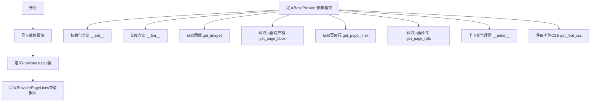

## 类结构

```
ProviderOutput (Pydantic BaseModel)
├── line: Line
├── spans: List[Span]
├── chars: Optional[List[List[Char]]]
├── raw_text (property)
├── __hash__
└── merge

BaseProvider (抽象基类)
├── filepath: str
├── config: Optional[BaseModel | dict]
├── __init__
├── __len__
├── get_images
├── get_page_bbox
├── get_page_lines
├── get_page_refs
├── __enter__
└── get_font_css (静态方法)
```

## 全局变量及字段


### `ProviderPageLines`
    
A type alias representing a mapping from page index to a list of ProviderOutput objects containing extracted text and layout information.

类型：`Dict[int, List[ProviderOutput]]`
    


### `ProviderOutput.line`
    
The Line object representing a line of text with its geometric polygon information.

类型：`Line`
    


### `ProviderOutput.spans`
    
A list of Span objects containing the text content and styling information for the line.

类型：`List[Span]`
    


### `ProviderOutput.chars`
    
Optional nested list of Char objects representing individual character data, used for detailed character-level analysis.

类型：`Optional[List[List[Char]]]`
    


### `BaseProvider.filepath`
    
The file path string pointing to the source document (PDF) being processed by the provider.

类型：`str`
    


### `BaseProvider.config`
    
Optional configuration object or dictionary containing provider-specific settings and parameters.

类型：`Optional[BaseModel | dict]`
    
    

## 全局函数及方法


### `configure_logging`

配置日志系统，设置日志格式、级别和输出处理器等。

参数：

- （无参数）

返回值：`None`，无返回值描述

#### 流程图

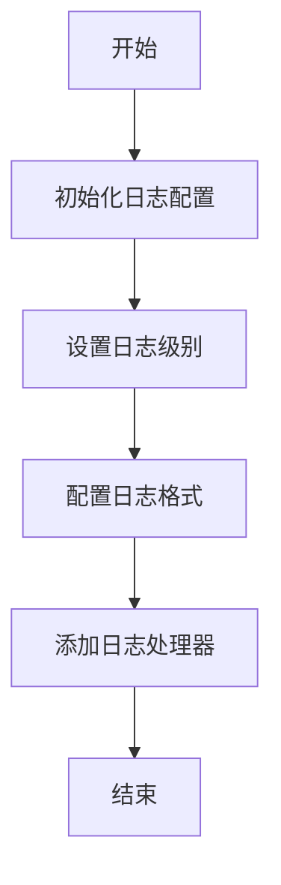

#### 带注释源码

```
# 从 marker.logger 模块导入 configure_logging 函数
from marker.logger import configure_logging

# 调用 configure_logging 函数进行日志配置
# 该函数内部实现未在当前代码文件中展示
configure_logging()
```

**注意**：当前提供的代码片段仅包含对 `configure_logging` 函数的导入和调用语句，未包含该函数的具体实现源码。该函数定义在 `marker.logger` 模块中，在当前上下文中不可见。

根据函数调用方式推断：
- 函数无参数
- 函数无返回值（返回 `None`）
- 函数功能为配置日志系统


根据提供的代码，我注意到 `assign_config` 函数是从 `marker.util` 导入的，但在当前代码段中只有其使用示例，并没有包含该函数的具体实现。

让我基于代码中的使用方式来提取可用的信息：

### `assign_config`

将配置对象（BaseModel 或字典）的属性赋值给目标对象的属性。

参数：

- `self`：`BaseProvider`，需要接收配置的目标对象实例
- `config`：`Optional[BaseModel | dict]`，配置对象，可以是 Pydantic BaseModel 实例或字典，默认为 None

返回值：无返回值（`None`），该函数直接修改传入的目标对象属性

#### 流程图

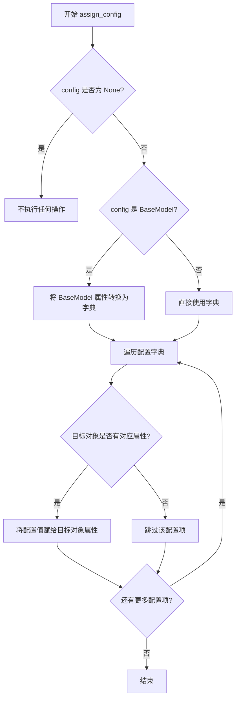

#### 带注释源码

```python
# 该函数源码未在提供的代码中显示
# 以下为基于使用方式的推断

def assign_config(self, config):
    """
    将配置对象的属性赋值给目标对象
    
    参数:
        self: 目标对象实例
        config: 配置对象，可以是 BaseModel 或字典
    """
    # 从 marker.util 导入，但实现未在代码中显示
    pass
```

---

**注意**：提供的代码段中只包含了 `assign_config` 函数的导入语句和使用示例（在 `BaseProvider.__init__` 方法中），并未包含该函数的具体实现。要获取完整的函数定义，需要查看 `marker/util.py` 文件。


# 文档设计

## 概述

该代码定义了一个PDF文本提取框架的提供者输出类(`ProviderOutput`)和基础提供者类(`BaseProvider`)，用于处理PDF文档中的文本行、跨度、字符等元素，并提供字体CSS配置功能。

## 文件整体运行流程

```
1. 导入依赖模块（copy, typing, PIL, pydantic等）
2. 配置日志系统
3. 定义ProviderOutput类 - PDF文本输出模型
   ├── 初始化line、spans、chars字段
   ├── 实现raw_text属性获取拼接文本
   ├── 实现__hash__方法支持哈希
   └── 实现merge方法合并多个输出
4. 定义ProviderPageLines类型别名
5. 定义BaseProvider抽象基类
   ├── 初始化文件路径和配置
   ├── 抽象方法：get_images, get_page_bbox, get_page_lines, get_page_refs
   └── 实现get_font_css静态方法获取字体样式
```

## 类详细信息

### ProviderOutput类

| 字段/属性 | 类型 | 描述 |
|-----------|------|------|
| line | Line | PDF中的一行文本 |
| spans | List[Span] | 文本跨度列表 |
| chars | Optional[List[List[Char]]] | 字符二维列表（可选） |

| 方法 | 描述 |
|------|------|
| raw_text | 属性，返回所有span文本拼接后的字符串 |
| __hash__ | 基于行的边界框计算哈希值 |
| merge | 合并另一个ProviderOutput对象到当前对象 |

### BaseProvider类

| 字段/属性 | 类型 | 描述 |
|-----------|------|------|
| filepath | str | PDF文件路径 |
| config | Optional[BaseModel \| dict] | 配置对象 |

| 方法 | 描述 |
|------|------|
| __init__ | 初始化提供者 |
| __len__ | 获取页面长度（未实现） |
| get_images | 获取指定索引的图像（未实现） |
| get_page_bbox | 获取页面边界框（未实现） |
| get_page_lines | 获取页面文本行（未实现） |
| get_page_refs | 获取页面引用（未实现） |
| __enter__ | 上下文管理器入口 |
| get_font_css | 静态方法，获取字体CSS配置 |

## 关键组件信息

| 组件名称 | 一句话描述 |
|----------|------------|
| ProviderOutput | Pydantic模型类，用于封装PDF文本提取的输出结果 |
| BaseProvider | 抽象基类，定义PDF提供者需要实现的接口 |
| PolygonBox | 多边形边界框类 |
| Span | 文本跨度类 |
| Char | 字符类 |
| Line | 文本行类 |

## 潜在技术债务或优化空间

1. **抽象方法未完整实现**：`BaseProvider`类中多个方法(`__len__`, `get_images`, `get_page_bbox`, `get_page_lines`, `get_page_refs`)只有`pass`，需要子类实现
2. **merge方法可能存在问题**：合并chars时逻辑不清晰，当`self.chars`为`None`而`other.chars`不为`None`时未处理
3. **缺少错误处理**：raw_text属性和merge方法缺乏对空spans列表的检查
4. **类型注解不完整**：部分类型使用了Python 3.10+的联合类型语法(`|`)，可能影响兼容性

## 其它项目

### 设计目标与约束
- 使用Pydantic进行数据验证和序列化
- 支持PDF文本的多层级表示（Line → Span → Char）
- 提供可扩展的Provider架构

### 错误处理与异常设计
- 目前缺乏显式的异常处理机制
- merge方法中需要考虑空值情况

### 数据流与状态机
- ProviderOutput作为数据传递对象，在PDF解析流程中承载文本提取结果
- merge操作支持文本块的合并与扩展

### 外部依赖与接口契约
- 依赖PIL进行图像处理
- 依赖pydantic进行数据建模
- 依赖weasyprint生成CSS样式
- 依赖marker.schema中的自定义类型

---

### `ProviderOutput.raw_text`

该属性是`ProviderOutput`类的文本拼接属性，用于将所有文本跨度(`spans`)的文本内容合并成一个完整的字符串。

参数：无（属性不接受任何参数）

返回值：`str`，返回所有span文本拼接后的字符串

#### 流程图

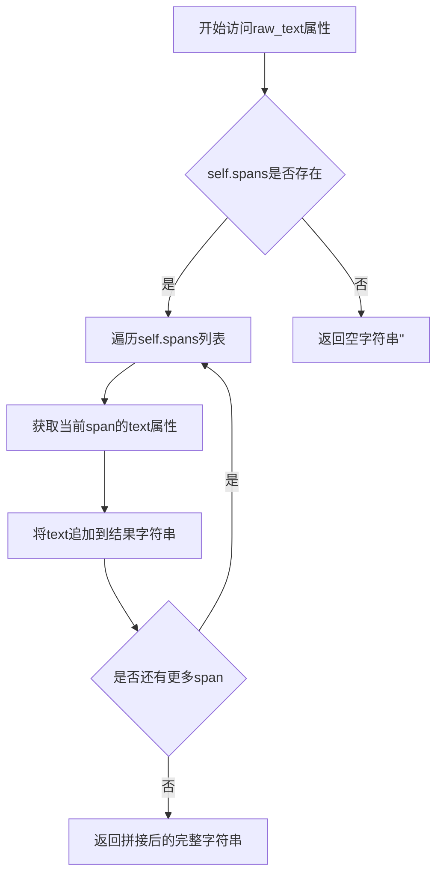

#### 带注释源码

```python
@property
def raw_text(self):
    """
    属性：获取ProviderOutput的原始文本
    功能：将所有Span对象的text属性拼接成一个完整的字符串
    
    实现原理：
    - 遍历self.spans列表中的每一个Span对象
    - 访问每个Span的text属性获取其文本内容
    - 使用字符串join方法将所有文本拼接在一起
    
    返回值：str类型，返回所有span.text拼接后的字符串
    如果spans列表为空，将返回空字符串''
    """
    return "".join(span.text for span in self.spans)
```


### `ProviderOutput.__hash__`

该方法定义 `ProviderOutput` 对象的哈希行为，使其可以用于集合（如 set）或作为字典键，通过将行的多边形边界框转换为元组后计算哈希值来实现。

参数：
- （无额外参数，隐式参数 `self` 表示实例本身）

返回值：`int`，返回基于 `ProviderOutput` 实例的 `line.polygon.bbox` 计算得到的哈希整数值，用于支持将该对象放入集合或作为字典键。

#### 流程图

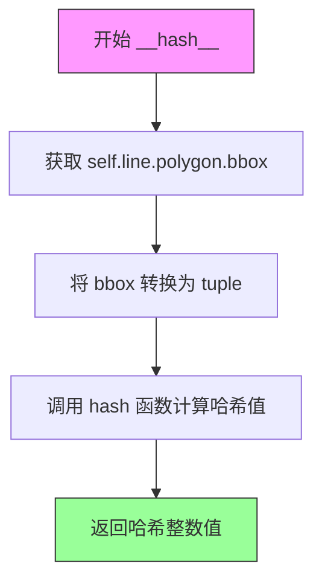

#### 带注释源码

```python
def __hash__(self):
    """
    计算 ProviderOutput 实例的哈希值。
    
    该方法使 ProviderOutput 对象可哈希（即可用于 set 集合或作为字典的键）。
    哈希值基于行的多边形边界框 (polygon.bbox) 计算，这意味着具有相同
    边界框的不同 ProviderOutput 实例将具有相同的哈希值。
    
    Returns:
        int: 基于 line.polygon.bbox 计算的哈希值
        
    Note:
        - 这是一个覆盖 pydantic BaseModel 默认 __hash__ 实现的方法
        - 默认情况下，pydantic 模型的哈希基于所有字段
        - 这里只使用 line.polygon.bbox 作为哈希依据，可能导致不同的
          spans 或 chars 内容但相同 bbox 的对象被视为相等
    """
    return hash(tuple(self.line.polygon.bbox))
```


### `ProviderOutput.merge`

该方法实现ProviderOutput对象的合并功能，将另一个ProviderOutput对象的内容（文本片段、字符数据和几何多边形）合并到当前对象中，生成一个新的ProviderOutput对象。

参数：

- `other`：`ProviderOutput`，要合并的另一个ProviderOutput对象

返回值：`ProviderOutput`，合并后的新ProviderOutput对象

#### 流程图

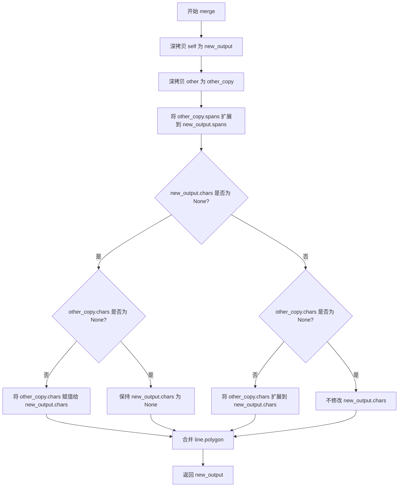

#### 带注释源码

```
def merge(self, other: "ProviderOutput"):
    # 第一步：深拷贝当前对象(self)，创建新对象 new_output
    # 使用 deepcopy 确保所有嵌套对象都是独立的副本，避免共享引用
    new_output = deepcopy(self)
    
    # 第二步：深拷贝传入的 other 对象
    # 同样使用 deepcopy 避免修改原始的 other 对象
    other_copy = deepcopy(other)

    # 第三步：合并 spans（文本片段列表）
    # 使用 extend 方法将 other_copy.spans 中的所有元素添加到 new_output.spans
    new_output.spans.extend(other_copy.spans)

    # 第四步：处理 chars（字符数据）的合并
    # 这种情况比较复杂，需要处理多种边界情况：
    if new_output.chars is not None and other_copy.chars is not None:
        # 两个对象的 chars 都不为 None 时，扩展合并
        new_output.chars.extend(other_copy.chars)
    elif other_copy.chars is not None:
        # 如果 new_output.chars 为 None，但 other_copy.chars 不为 None
        # 则直接将 other_copy.chars 赋值给 new_output.chars
        new_output.chars = other_copy.chars
    # 如果 new_output.chars 不为 None 但 other_copy.chars 为 None，则不做处理

    # 第五步：合并几何信息（多边形）
    # 调用 PolygonBox 的 merge 方法，将 other_copy.line.polygon 合并到 new_output 中
    # 合并后的多边形会包含两个原始多边形的边界
    new_output.line.polygon = new_output.line.polygon.merge(
        [other_copy.line.polygon]
    )
    
    # 第六步：返回合并后的新对象
    # 注意：返回的是新对象 new_output，原有的 self 和 other 对象保持不变
    return new_output
```


### `BaseProvider.__init__`

这是 `BaseProvider` 类的构造函数，用于初始化文档提供者实例。它接收文件路径和可选配置，通过 `assign_config` 函数将配置应用到实例，并存储文件路径供后续方法使用。

参数：

- `filepath`：`str`，要处理的文档文件路径
- `config`：`Optional[BaseModel | dict]`，可选的配置对象，可以是 Pydantic 的 BaseModel 实例或普通字典，用于定制提供者的行为

返回值：`None`，构造函数不返回值，仅进行实例属性的初始化

#### 流程图

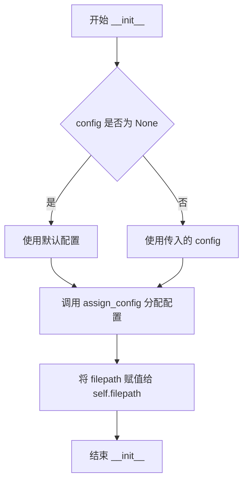

#### 带注释源码

```python
def __init__(self, filepath: str, config: Optional[BaseModel | dict] = None):
    """
    初始化 BaseProvider 实例。
    
    参数:
        filepath: str - 要处理的文档文件路径
        config: Optional[BaseModel | dict] - 可选配置，可为 BaseModel 或字典
    """
    # 调用 assign_config 函数，将配置应用到当前实例
    # 该函数会根据 config 的类型和内容设置相应的实例属性
    assign_config(self, config)
    
    # 将文件路径保存为实例属性，供后续方法如 get_page_lines 等使用
    self.filepath = filepath
```


### `BaseProvider.__len__`

该方法是 `BaseProvider` 类的抽象方法，用于返回文档的页数（长度），但当前实现为 `pass`，是待子类重写的占位符实现。

参数：该方法无显式参数（`self` 为隐式参数）

返回值：`None`（当前实现为 `pass`，无返回值）

#### 流程图

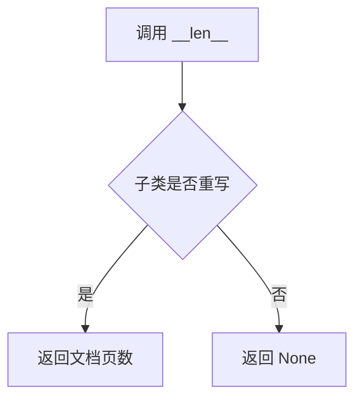

#### 带注释源码

```python
def __len__(self):
    """
    返回文档的页数。
    
    这是一个抽象方法，子类需要重写此方法以返回实际文档的页数。
    当前实现为 pass，表示该方法尚未实现。
    
    注意：
    - 在 Python 中，__len__ 方法通常返回对象的 "长度"
    - 对于文档提供者类，__len__ 应返回文档的总页数
    - 当前实现为占位符，需要在子类中重写
    """
    pass
```

#### 补充说明

| 项目 | 说明 |
|------|------|
| **所属类** | `BaseProvider` |
| **方法类型** | 魔术方法（Magic Method），Python 特殊方法 |
| **设计意图** | 使 `BaseProvider` 实例可以通过 `len()` 函数获取文档页数 |
| **当前状态** | 未实现（仅为占位符） |
| **子类的期望行为** | 子类应重写此方法，返回文档的总页数（整数类型） |
| **技术债务** | 该方法未实现，导致无法通过 `len()` 获取文档页数，需要在具体子类（如 PDFProvider）中实现 |


### `BaseProvider.get_images`

该方法用于从 PDF 文件中提取指定页面索引对应的图像对象，支持自定义 DPI 设置，以便调整图像的分辨率和清晰度。

参数：

- `idxs`：`List[int]`，需要提取图像的页面索引列表
- `dpi`：`int`，图像的分辨率（每英寸点数），用于控制输出图像的质量

返回值：`List[Image.Image]`，返回与指定页面索引对应的 PIL Image 对象列表

#### 流程图

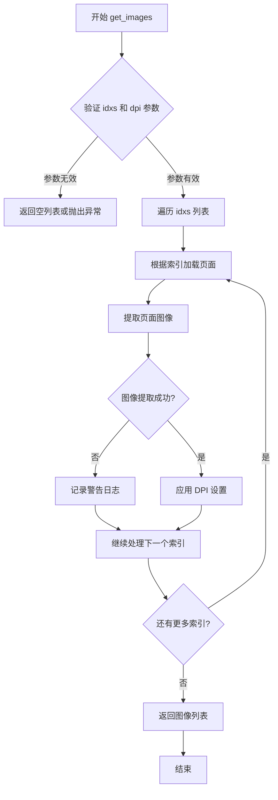

#### 带注释源码

```python
def get_images(self, idxs: List[int], dpi: int) -> List[Image.Image]:
    """
    从 PDF 文件中提取指定页面索引对应的图像对象。
    
    该方法是 BaseProvider 类的抽象方法，由子类实现具体的图像提取逻辑。
    支持自定义 DPI 设置以调整图像分辨率。
    
    参数:
        idxs: List[int]，需要提取图像的页面索引列表，索引从 0 开始
        dpi: int，图像的分辨率（每英寸点数），数值越高图像越清晰但文件越大
    
    返回值:
        List[Image.Image]，返回与指定页面索引对应的 PIL Image 对象列表，
        返回顺序与 idxs 列表顺序一致
    
    异常:
        可能抛出与文件读取或图像处理相关的异常，由子类实现决定
    """
    pass  # TODO: 由子类实现具体逻辑
```


### `BaseProvider.get_page_bbox`

获取指定页面的边界框信息。该方法是 `BaseProvider` 类的抽象方法，用于返回给定页码索引对应的页面几何边界，失败时返回 `None`。

参数：

- `self`：`BaseProvider`，隐式参数，BaseProvider 实例本身
- `idx`：`int`，页码索引，表示要获取边界框的页面序号（从 0 或 1 开始）

返回值：`PolygonBox | None`，返回指定页面的多边形边界框对象，如果页面不存在或无法获取则返回 `None`

#### 流程图

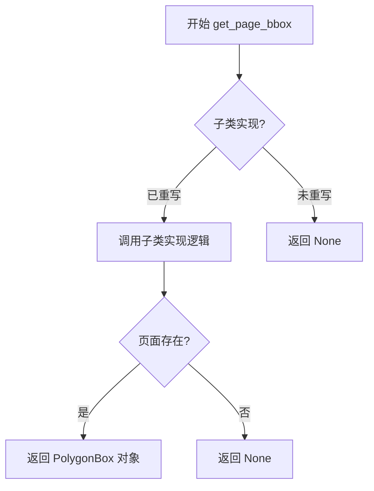

#### 带注释源码

```
def get_page_bbox(self, idx: int) -> PolygonBox | None:
    """
    获取指定页面的边界框。
    
    参数:
        idx: 页码索引，指定要获取边界框的页面
        
    返回值:
        PolygonBox 对象表示页面的几何边界，失败返回 None
    """
    pass  # 抽象方法，由子类实现
```

---

### 备注

- 该方法是 `BaseProvider` 基类的抽象接口定义，当前实现仅为 `pass`，具体逻辑由子类重写实现
- `PolygonBox` 来自 `marker.schema.polygon` 模块，表示一个多边形区域
- 在实际子类实现中，通常会读取 PDF 文件元数据或页面尺寸信息来计算边界框


### `BaseProvider.get_page_lines`

获取指定页面的所有文本行对象列表。该方法是 `BaseProvider` 类的抽象方法，用于从 PDF 文档中提取特定页面的文本行数据，子类需要实现具体逻辑来解析 PDF 并返回 `Line` 对象列表。

参数：

- `idx`：`int`，要获取的页面索引（从 0 开始）

返回值：`List[Line]`，包含页面中所有文本行的列表，每个 `Line` 对象代表一行文本及其位置信息

#### 流程图

```mermaid
flowchart TD
    A[开始 get_page_lines] --> B{检查索引有效性}
    B -->|无效索引| C[返回空列表或抛出异常]
    B -->|有效索引| D[调用子类实现的方法]
    D --> E[解析 PDF 页面内容]
    E --> F[提取文本行数据]
    F --> G[构建 Line 对象列表]
    G --> H[返回 List[Line]]
```

#### 带注释源码

```python
def get_page_lines(self, idx: int) -> List[Line]:
    """
    获取指定页面的所有文本行。
    
    这是一个抽象方法，由子类实现具体逻辑。
    子类需要根据 idx 参数定位到对应的 PDF 页面，
    解析页面内容并提取文本行数据，最后构建 Line 对象列表返回。
    
    参数:
        idx: int - 页面的索引值，用于定位要获取的页面
        
    返回:
        List[Line] - 该页面包含的所有文本行对象列表
    """
    pass  # 子类需实现此方法
```


### `BaseProvider.get_page_refs`

获取指定页码的引用列表，用于提取PDF文档中的引用信息（如参考文献、引用来源等）。

参数：

- `idx`：`int`，页码索引，指定要获取引用的页面编号（从0开始）

返回值：`List[Reference]`，返回指定页码中包含的所有引用对象列表

#### 流程图

```mermaid
flowchart TD
    A[开始 get_page_refs] --> B[接收页码索引 idx]
    B --> C{子类是否实现该方法}
    C -->|已实现| D[调用子类实现逻辑]
    C -->|未实现| E[返回空列表或pass]
    D --> F[返回 List[Reference]]
    E --> F
```

#### 带注释源码

```python
def get_page_refs(self, idx: int) -> List[Reference]:
    """
    获取指定页码的引用列表。
    
    这是一个抽象方法，由子类实现具体逻辑。
    用于从PDF文档的特定页面中提取引用信息（如参考文献、引用来源等）。
    
    参数:
        idx: 页码索引，指定要获取引用的页面
        
    返回:
        包含该页所有引用对象的列表，每个Reference对象代表一个引用项
    """
    pass
```


### `BaseProvider.__enter__`

该方法是 Python 上下文管理器协议的核心实现，使得 `BaseProvider` 实例可以用于 `with` 语句，支持资源的安全获取和释放模式。

参数：

- `self`：`BaseProvider`，隐式参数，表示当前实例本身

返回值：`BaseProvider`，返回当前实例本身，允许在 `with` 语句中使用该对象

#### 流程图

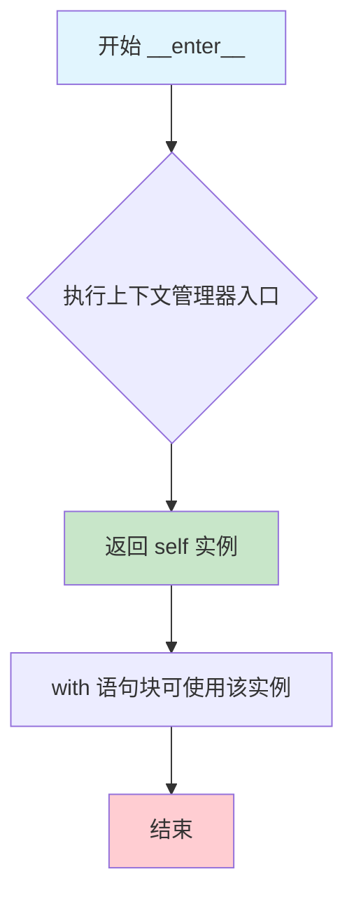

#### 带注释源码

```python
def __enter__(self):
    """
    上下文管理器入口方法，支持 with 语句。
    
    当执行 'with BaseProvider(...) as provider:' 时，
    此方法会被自动调用，返回值将绑定到 'as' 后的变量。
    
    Returns:
        BaseProvider: 返回当前实例本身，使得 with 语句块
                      可以直接使用该 provider 实例进行操作
    
    Example:
        with BaseProvider('document.pdf') as provider:
            page_lines = provider.get_page_lines(0)
    """
    return self
```


### `BaseProvider.get_font_css`

这是一个静态方法，用于生成配置了自定义字体（GoNotoCurrent-Regular）和正文样式（禁用连字、优化文字渲染）的 WeasyPrint CSS 对象，以便在 PDF 渲染时使用自定义字体。

参数：

- 该方法无参数（静态方法）

返回值：`CSS`，返回 WeasyPrint 的 CSS 对象，包含自定义字体的字体面定义和正文样式配置

#### 流程图

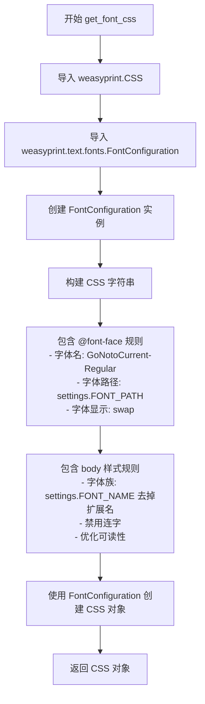

#### 带注释源码

```python
@staticmethod
def get_font_css():
    """
    生成用于 PDF 渲染的 WeasyPrint CSS 对象。
    
    该方法配置自定义字体（GoNotoCurrent-Regular）并设置正文样式，
    旨在优化 PDF 中文字体的显示效果。
    
    Returns:
        CSS: 包含字体面定义和正文样式规则的 WeasyPrint CSS 对象
    """
    # 从 weasyprint 导入 CSS 类，用于构建 CSS 样式表
    from weasyprint import CSS
    # 导入字体配置类，用于管理自定义字体
    from weasyprint.text.fonts import FontConfiguration

    # 创建字体配置实例，用于关联自定义字体
    font_config = FontConfiguration()
    
    # 构建 CSS 样式字符串，包含两部分：
    # 1. @font-face: 定义自定义字体的来源和显示方式
    # 2. body 样式: 设置正文字体、禁用连字、优化渲染
    css = CSS(
        string=f"""
        @font-face {{
            font-family: GoNotoCurrent-Regular;
            src: url({settings.FONT_PATH});  # 从设置中获取字体文件路径
            font-display: swap;  # 使用 swap 策略确保文本可见性
        }}
        body {{
            font-family: {settings.FONT_NAME.split(".")[0]}, sans-serif;  # 使用自定义字体，备用 sans-serif
            font-variant-ligatures: none;  # 禁用连字（如 fi, fl 等）
            font-feature-settings: "liga" 0;  # 关闭liga字形特性
            text-rendering: optimizeLegibility;  # 优化文字可读性
        }}
        """,
        font_config=font_config,  # 关联字体配置
    )
    
    # 返回配置好的 CSS 对象，供 PDF 渲染使用
    return css
```

## 关键组件


### ProviderOutput

Pydantic数据模型类，封装PDF页面解析后的行、跨度（span）和字符信息，提供原始文本访问、哈希计算和输出合并功能。

### BaseProvider

抽象基类，定义PDF文档Provider的标准接口规范，包括页面图像获取、边界框查询、行提取和引用获取等核心方法。

### merge方法

实现ProviderOutput实例之间的合并操作，深度复制当前对象并扩展spans和chars列表，同时合并多边形区域。

### get_font_css

静态方法，配置GoNotoCurrent-Regular自定义字体，生成用于PDF渲染的WeasyPrint CSS样式表。

### ProviderPageLines

类型别名，定义页面行输出的字典结构，键为页码索引，值为该页的ProviderOutput列表。

### raw_text属性

计算属性，通过连接所有span的文本内容生成页面的原始文本字符串。

### __hash__方法

基于行多边形边界框实现哈希功能，用于去重和集合操作。

### assign_config

全局函数（从marker.util导入），用于将配置对象动态分配给Provider实例。


## 问题及建议


### 已知问题

-   **BaseProvider 类缺乏抽象方法定义**：BaseProvider 看起来是一个基类/抽象类，但其方法（`__len__`、`get_images`、`get_page_bbox`、`get_page_lines`、`get_page_refs`）没有使用 `@abstractmethod` 装饰器声明，仅用 `pass` 占位，导致子类实现时缺乏强制约束，容易引发运行时错误。
-   **`__len__` 方法实现不完整**：`__len__` 方法体只有 `pass`，当对 Provider 实例调用 `len()` 时会抛出 `TypeError: object of type 'BaseProvider' has no len()`，导致程序崩溃。
-   **hash 方法基于可变对象**：`__hash__` 方法基于 `self.line.polygon.bbox`（tuple 类型，但 polygon 对象本身可能是可变的）生成哈希值，违反了"可哈希对象在其生命周期内哈希值应保持不变"的原则，如果 polygon 对象被修改，将导致哈希表行为异常。
- **deepcopy 性能开销**：在 `merge` 方法中两次使用 `deepcopy` 对 self 和 other 进行深拷贝，当处理大量 ProviderOutput 对象时，会造成显著的内存和性能开销。
- **类型注解不完整**：部分方法（如 `get_images`、`get_page_bbox`）返回类型注解与实际实现不符（如 `get_page_bbox` 返回 `PolygonBox | None`，但参数 idx 缺少类型注解）。
- **ProviderPageLines 类型定义位置不当**：类型别名 `ProviderPageLines` 定义在类外部但靠近类定义，这种布局不利于代码阅读和维护。
- **config 参数类型设计冗余**：构造函数接受 `BaseModel | dict` 类型的 config，但没有提供类型检查和默认值处理的统一逻辑，导致后续使用时的类型不确定性。
- **日志配置后未充分使用**：虽然开头调用了 `configure_logging()`，但整个代码中没有任何 logging 调用，配置了日志却未使用，增加了无谓的开销。

### 优化建议

-   **引入 ABC 模块将 BaseProvider 改为抽象基类**：使用 `from abc import ABC, abstractmethod` 装饰器，将所有需要子类实现的方法标记为 `@abstractmethod`，并在方法签名中声明返回类型，确保子类必须实现这些方法。
-   **正确实现 `__len__` 方法**：根据 BaseProvider 的语义，明确 `__len__` 应返回的内容（如页面数量），并实现具体逻辑，而不是仅用 `pass` 占位。
-   **修复 hash 方法设计**：考虑基于不可变且唯一的标识符（如添加一个 uuid 字段）来生成哈希值，或者在文档中明确说明此对象的哈希基于几何位置且不应在修改后使用。
-   **优化 merge 方法的拷贝逻辑**：如果业务场景允许，考虑使用浅拷贝或只拷贝必要字段；或者在调用 merge 前确保输入对象不被修改，从而避免深拷贝。
-   **完善类型注解**：为所有方法参数添加类型注解，确保类型安全性和代码可读性。
-   **重构类型别名位置**：将 `ProviderPageLines` 移动到文件顶部与其他类型导入放在一起，或放在类内部作为嵌套类型。
-   **移除或使用日志配置**：如果不需要日志记录，删除 `configure_logging()` 调用；如果需要，确保在关键路径（如异常处理、重要的业务逻辑）添加适当的日志记录。
-   **统一 config 参数处理**：在构造函数中添加 config 的默认值处理逻辑，确保 config 被统一转换为合适的内部格式（如 BaseModel），避免在类内部频繁检查类型。


## 其它


### 设计目标与约束

本代码作为PDF文档处理的Provider抽象层，旨在解耦PDF解析实现与上层业务逻辑。通过定义统一的接口规范（BaseProvider），支持多种PDF后端实现（如PDF.js、PyMuPDF等）的灵活切换。核心约束包括：必须实现所有抽象方法以保证接口一致性；ProviderOutput必须保持不可变性（通过deepcopy实现合并操作）；依赖外部字体配置且必须与marker.settings中的字体路径保持同步。

### 错误处理与异常设计

当前代码中get_images、get_page_bbox等方法采用pass实现，属于抽象方法占位符，未定义具体异常类型。建议设计分级异常体系：FileNotFoundError用于文件路径无效；ImageDecodeError用于DPI参数导致的图像解析失败；PolygonParseError用于边界框计算异常；ReferenceResolutionError用于引用解析失败。ProviderOutput.merge方法应在spans类型不匹配时抛出TypeError，在polygon.merge返回None时返回默认值或抛出ValueError。

### 数据流与状态机

数据流遵循以下路径：PDF文件 → BaseProvider.get_page_lines() → Line对象 → Span字符序列 → Char最小单元。ProviderOutput作为中间聚合态，包含line（行元数据）、spans（文本片段列表）、chars（可选的字符级详细信息）。合并操作（merge）采用深度复制策略，确保原始对象不变性。状态转换：初始化 → （多次）get_page_lines调用 → ProviderOutput列表 → （可选）merge聚合 → 最终输出。

### 外部依赖与接口契约

核心依赖包括：PIL (Pillow)用于图像渲染；pydantic BaseModel用于数据验证与配置序列化；weasyprint用于CSS字体配置；pdftext.schema.Reference用于引用解析；marker内部模块（schema.polygon、schema.text、settings、util）提供基础类型支撑。接口契约规定：get_page_lines必须返回Line列表且每个Line包含有效polygon；get_images返回的Image数量必须与idxs长度一致；ProviderOutput.raw_text通过字符串拼接生成不得返回None。

### 配置管理与初始化流程

BaseProvider通过assign_config实现配置注入，支持BaseModel实例或dict两种配置形式。配置内容包括文件路径(filepath)、渲染参数(dpi)、页面范围等。初始化流程：实例化Provider → assign_config注入配置 → 调用__enter__进入上下文 → 执行提取操作 → 调用__exit__释放资源。建议配置项包括：max_pages（最大处理页数）、extract_images（是否提取图像）、fallback_font（字体回退策略）。

### 多线程与并发安全性

当前代码未显式处理并发场景。潜在并发问题包括：ProviderOutput.merge操作对spans列表的extend非原子性；get_images多线程调用PIL可能导致GIL竞争；共享settings配置对象的线程安全问题。建议采用以下策略：merge操作加锁或使用不可变数据结构；get_images支持线程池并行；配置对象采用深拷贝隔离。

### 版本兼容性与迁移策略

代码使用Python 3.10+的类型联合语法（BaseModel | dict），需确保运行环境符合要求。PolygonBox类型来自marker.schema.polygon，属于内部模块。迁移时需注意：ProviderOutput.merge的deepcopy策略在大型文档可能导致内存压力，考虑引入__slots__优化或流式处理；BaseProvider的抽象方法签名应保持向后兼容，建议使用@abstractmethod装饰器明确声明。


    