# `marker\marker\providers\document.py` 详细设计文档

DocumentProvider类是一个文档转换提供者，继承自PdfProvider，负责将DOCX文件转换为PDF格式。它通过mammoth库将DOCX转换为HTML，处理HTML中的base64编码图像，最后使用weasyprint将HTML渲染为PDF，并提供临时文件管理功能。

## 整体流程

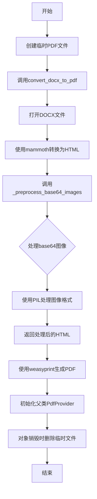

## 类结构

```
PdfProvider (基类)
└── DocumentProvider (继承类)
```

## 全局变量及字段


### `css`
    
定义PDF渲染的CSS样式字符串

类型：`str`
    


### `logger`
    
日志记录器实例

类型：`Logger`
    


### `DocumentProvider.temp_pdf_path`
    
临时PDF文件的路径

类型：`str`
    
    

## 全局函数及方法


### `get_logger`

获取日志记录器，用于在整个模块中记录日志信息。

参数：

- 无

返回值：`Logger`，返回日志记录器实例，用于记录应用程序的运行日志。

#### 流程图

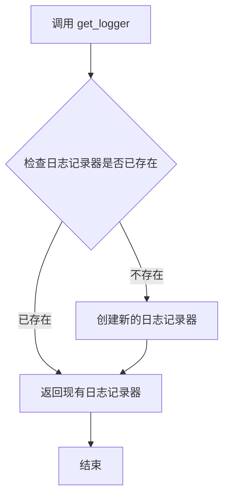

#### 带注释源码

```python
from marker.logger import get_logger  # 从 marker.logger 模块导入 get_logger 函数

logger = get_logger()  # 获取全局日志记录器实例，用于记录模块中的日志信息
```

---

**补充说明：**

- `get_logger` 是从外部模块 `marker.logger` 导入的函数
- 该函数通常为单例模式或工厂函数，确保整个应用使用统一的日志配置
- 在当前代码中用于捕获图像处理失败时的错误信息，如 `_preprocess_base64_images` 方法中的异常记录
- 返回的 `logger` 对象应具备标准的日志方法：`debug()`, `info()`, `warning()`, `error()`, `critical()` 等


### `css`

这是一个全局CSS样式字符串，定义了PDF文档的页面布局、字体、图片、表格等元素的样式规则，供WeasyPrint在将HTML转换为PDF时使用。

参数： 无

返回值：`str`，返回包含CSS样式规则的字符串

#### 流程图

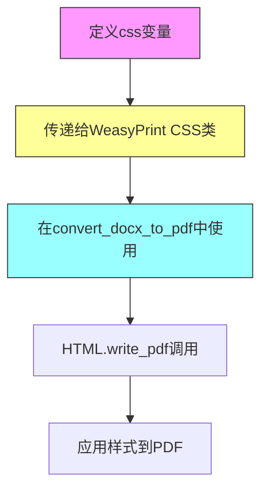

#### 带注释源码

```python
css = """
@page {
    size: A4;  # 设置页面大小为A4
    margin: 2cm;  # 设置页边距为2厘米
}

img {
    max-width: 100%;  # 图片最大宽度为100%
    max-height: 25cm;  # 图片最大高度为25厘米
    object-fit: contain;  # 保持图片比例
    margin: 12pt auto;  # 图片外边距
}

div, p {
    max-width: 100%;  # 最大宽度100%
    word-break: break-word;  # 允许单词换行
    font-size: 10pt;  # 字体大小10磅
}

table {
    width: 100%;  # 表格宽度100%
    border-collapse: collapse;  # 边框合并
    break-inside: auto;  # 允许表格内部分页
    font-size: 10pt;  # 字体大小10磅
}

tr {
    break-inside: avoid;  # 避免在行内分页
    page-break-inside: avoid;  # 避免在行内分页
}

td {
    border: 0.75pt solid #000;  # 单元格边框
    padding: 6pt;  # 单元格内边距
}
"""
```

### `DocumentProvider.convert_docx_to_pdf`

此方法负责将DOCX文件转换为PDF格式，使用mammoth库将DOCX转为HTML，然后使用WeasyPrint将HTML连同CSS样式一起转换为PDF。

参数：

-  `filepath`：`str`，要转换的DOCX文件路径

返回值：`None`，该方法无返回值，直接将PDF写入到`self.temp_pdf_path`指定的文件

#### 流程图

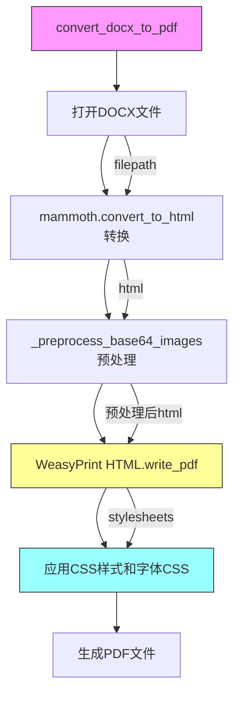

#### 带注释源码

```python
def convert_docx_to_pdf(self, filepath: str):
    # 导入WeasyPrint的CSS和HTML类
    from weasyprint import CSS, HTML
    import mammoth

    # 以二进制模式打开DOCX文件
    with open(filepath, "rb") as docx_file:
        # 使用mammoth将DOCX转换为HTML
        result = mammoth.convert_to_html(docx_file)
        html = result.value  # 获取转换后的HTML字符串

        # 使用WeasyPrint将HTML转换为PDF
        # self._preprocess_base64_images处理HTML中的base64编码图片
        # stylesheets参数传入CSS样式和自定义字体CSS
        HTML(string=self._preprocess_base64_images(html)).write_pdf(
            self.temp_pdf_path, 
            stylesheets=[
                CSS(string=css),  # 使用本文件定义的CSS样式
                self.get_font_css()  # 获取自定义字体CSS
            ]
        )
```


### `DocumentProvider`

`DocumentProvider` 是一个 PDF 提供者类，继承自 `PdfProvider`。它的核心功能是将 DOCX 文档转换为 PDF 格式，通过使用 `mammoth` 库将 DOCX 转换为 HTML，然后利用 `WeasyPrint` 库将 HTML 渲染为 PDF。

参数：

- `filepath`：`str`，需要转换的 DOCX 文件路径
- `config`：可选的配置参数，默认为 None

返回值：无（构造函数）

#### 流程图

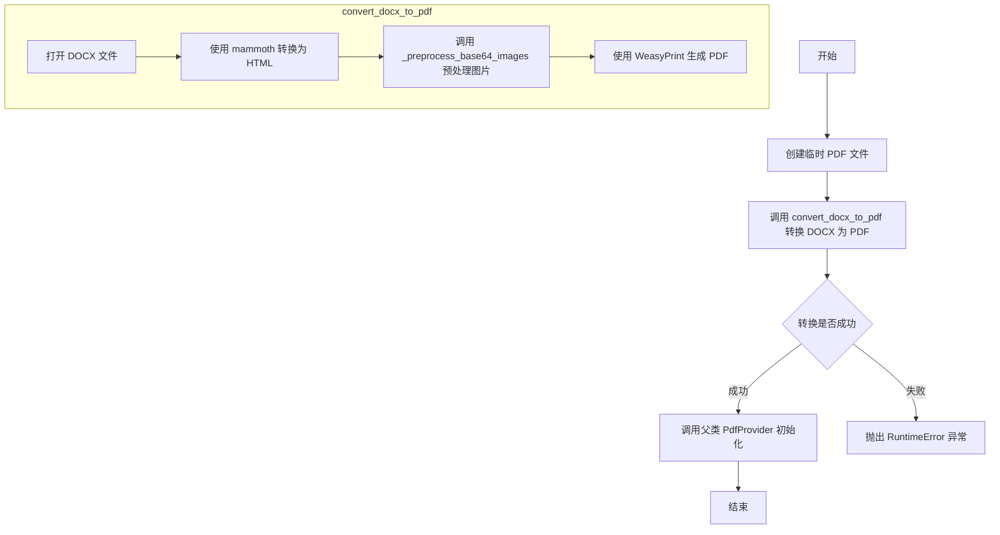

#### 带注释源码

```python
class DocumentProvider(PdfProvider):
    def __init__(self, filepath: str, config=None):
        # 创建一个临时 PDF 文件，用于存放转换后的结果
        temp_pdf = tempfile.NamedTemporaryFile(delete=False, suffix=".pdf")
        self.temp_pdf_path = temp_pdf.name
        temp_pdf.close()

        # 尝试将 DOCX 转换为 PDF
        try:
            self.convert_docx_to_pdf(filepath)
        except Exception as e:
            # 转换失败时抛出运行时错误
            raise RuntimeError(f"Failed to convert {filepath} to PDF: {e}")

        # 使用临时 PDF 路径初始化父类 PdfProvider
        super().__init__(self.temp_pdf_path, config)

    def __del__(self):
        # 析构函数：清理临时 PDF 文件
        if os.path.exists(self.temp_pdf_path):
            os.remove(self.temp_pdf_path)

    def convert_docx_to_pdf(self, filepath: str):
        # 导入 WeasyPrint 和 mammoth 库
        from weasyprint import CSS, HTML
        import mammoth

        # 以二进制模式打开 DOCX 文件
        with open(filepath, "rb") as docx_file:
            # 将 DOCX 转换为 HTML
            result = mammoth.convert_to_html(docx_file)
            html = result.value

            # 预处理 base64 编码的图片，然后写入 PDF
            # 应用 CSS 样式和自定义字体
            HTML(string=self._preprocess_base64_images(html)).write_pdf(
                self.temp_pdf_path, 
                stylesheets=[CSS(string=css), self.get_font_css()]
            )

    @staticmethod
    def _preprocess_base64_images(html_content):
        # 正则表达式匹配 base64 图片格式
        pattern = r'data:([^;]+);base64,([^"\'>\s]+)'

        def convert_image(match):
            try:
                # 解码 base64 图片数据
                img_data = base64.b64decode(match.group(2))

                # 使用 PIL 处理图片
                with BytesIO(img_data) as bio:
                    with Image.open(bio) as img:
                        # 将图片保存为字节流
                        output = BytesIO()
                        img.save(output, format=img.format)
                        # 重新编码为 base64
                        new_base64 = base64.b64encode(output.getvalue()).decode()
                        # 返回处理后的图片数据 URI
                        return f"data:{match.group(1)};base64,{new_base64}"

            except Exception as e:
                # 图片处理失败时记录错误并返回空字符串
                logger.error(f"Failed to process image: {e}")
                return ""

        # 在 HTML 内容中替换所有匹配的 base64 图片
        return re.sub(pattern, convert_image, html_content)
```


### `mammoth.convert_to_html`

将DOCX文件转换为HTML格式的函数。该函数是mammoth库的核心方法，接收一个DOCX文件对象作为输入，并返回一个包含HTML内容的转换结果对象。

参数：

- `docx_file`：`file object` / `str`，要转换的DOCX文件对象（通过`open(file, "rb")`打开的二进制文件）或文件路径字符串。代码中使用`with open(filepath, "rb") as docx_file:`打开文件后传入。

返回值：`ConversionResult`（mammoth库自定义的结果对象），返回一个包含转换后HTML内容的结果对象。该对象具有`value`属性，存储转换后的HTML字符串；以及可选的`messages`属性，记录转换过程中的警告信息。

#### 流程图

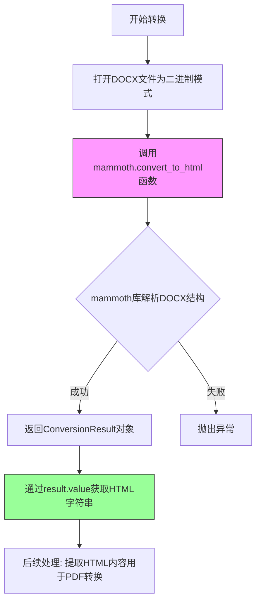

#### 带注释源码

```python
# 在 DocumentProvider 类的 convert_docx_to_pdf 方法中使用
def convert_docx_to_pdf(self, filepath: str):
    from weasyprint import CSS, HTML
    import mammoth  # 导入mammoth库用于DOCX转HTML

    # 以二进制读取模式打开DOCX文件
    with open(filepath, "rb") as docx_file:
        # 调用mammoth.convert_to_html将DOCX转换为HTML
        # 参数: docx_file - 已打开的DOCX文件对象
        # 返回值: result - ConversionResult对象，包含转换结果
        result = mammoth.convert_to_html(docx_file)
        
        # 从结果对象中提取HTML字符串
        # result.value 属性包含转换后的HTML内容
        html = result.value

        # 将HTML转换为PDF，使用WeasyPrint
        # 传入预处理后的HTML内容和CSS样式表
        HTML(string=self._preprocess_base64_images(html)).write_pdf(
            self.temp_pdf_path, 
            stylesheets=[CSS(string=css), self.get_font_css()]
        )
```

#### 额外说明

| 项目 | 说明 |
|------|------|
| **库来源** | mammoth是一个独立的Python第三方库，非项目内部实现 |
| **版本要求** | 需要安装mammoth库（通常通过`pip install mammoth`） |
| **错误处理** | mammoth库内部会处理大部分解析错误，转换过程中的警告信息存储在`result.messages`中 |
| **使用场景** | 该函数在此项目中作为DOCX到PDF转换流程的中间步骤：DOCX → HTML → PDF |
| **限制** | mammoth主要支持基本的Word文档元素转换，复杂样式和某些高级特性可能无法完全保留 |


### `base64.b64decode`

`base64.b64decode` 是 Python 标准库 `base64` 模块中的函数，用于将 Base64 编码的字符串解码为原始的二进制数据。在本代码中，该函数被用于解码嵌入在 HTML 中的 Base64 编码图像数据。

参数：

- `s`：`str` 或 `bytes`，需要解码的 Base64 编码字符串
- `validate`：`bool`，可选，默认为 `False`，如果设为 `True`，则会验证输入是否包含有效的 Base64 字符
- `altchars`：`bytes`，可选，用于替换标准的 `+` 和 `/` 字符
- `error`：`str`，可选，指定错误处理方式（'strict', 'ignore', 'replace'）

返回值：`bytes`，解码后的原始二进制数据

#### 流程图

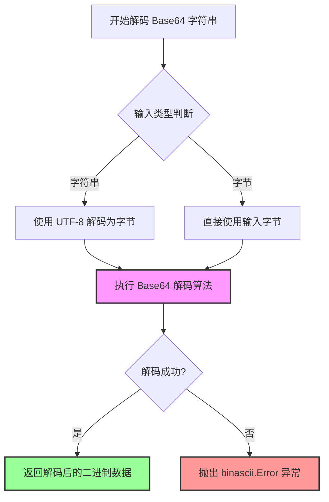

#### 带注释源码

```python
# base64.b64decode 函数使用示例（在 DocumentProvider._preprocess_base64_images 方法中）

# 1. 从正则匹配结果中获取 Base64 编码的图像数据字符串
#    match.group(2) 提取的是 data:image/png;base64,XXXXX 中的 XXXXX 部分
base64_string = match.group(2)

# 2. 调用 base64.b64decode 将 Base64 字符串解码为原始二进制数据
#    输入: base64_string (str) - Base64 编码的图像数据
#    输出: img_data (bytes) - 解码后的原始图像字节
img_data = base64.b64decode(base64_string)

# 3. 使用解码后的二进制数据创建 BytesIO 缓冲区和 PIL Image 对象
with BytesIO(img_data) as bio:
    with Image.open(bio) as img:
        # 4. 将图像重新编码为指定格式（保持原格式）
        output = BytesIO()
        img.save(output, format=img.format)
        
        # 5. 再次 Base64 编码，用于重新嵌入到 HTML 中
        new_base64 = base64.b64encode(output.getvalue()).decode()

# base64.b64decode 核心算法简述：
# - Base64 使用 64 个字符（A-Z, a-z, 0-9, +, /）表示二进制数据
# - 每 4 个 Base64 字符代表 3 个字节的原始数据
# - 解码过程是将 Base64 字符映射回 6 位二进制，然后组合成 8 位字节
# - 字符串末尾的 '=' 或 '==' 是填充字符，用于补齐到 4 的倍数
```


### `base64.b64encode`

Base64编码函数，用于将二进制数据转换为Base64编码的ASCII字符串。该函数是Python标准库base64模块的核心函数，在此代码中用于将处理后的图片数据重新编码为Base64格式，以便嵌入到HTML中转换为PDF。

参数：

- `s`：`bytes`，要编码的二进制数据（在此代码中为处理后的图片字节数据）
- `altchars`：`bytes`，可选参数，用于指定替代字符集来替换标准的"+/"字符

返回值：`bytes`，返回Base64编码后的字节数据

#### 流程图

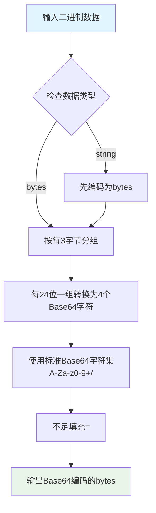

#### 带注释源码

```python
# base64.b64encode 函数使用示例（来自marker/providers/pdf.py）

# 从marker/providers/pdf.py的_preprocess_base64_images方法中提取

# 1. 匹配HTML中的Base64图片数据
# 正则表达式匹配 data:image/png;base64,iVBORw0KGgoAAAANSUhEUg...
pattern = r'data:([^;]+);base64,([^"\'>\s]+)'

def convert_image(match):
    try:
        # 2. 解码Base64图片数据（第二组为编码后的字符串）
        # base64.b64decode: 将Base64字符串解码为二进制数据
        img_data = base64.b64decode(match.group(2))

        # 3. 使用BytesIO处理图片数据（PIL需要文件-like对象）
        with BytesIO(img_data) as bio:
            # 4. 用PIL打开图片
            with Image.open(bio) as img:
                # 5. 创建输出缓冲区保存处理后的图片
                output = BytesIO()
                # 6. 保存图片（保持原格式）
                img.save(output, format=img.format)
                
                # ==============================================
                # 核心函数：base64.b64encode
                # ==============================================
                # 输入：output.getvalue() - 处理后的图片二进制数据（bytes类型）
                # 功能：将二进制数据转换为Base64编码的ASCII字符串
                # 输出：编码后的bytes对象，需要.decode()转换为字符串
                new_base64 = base64.b64encode(output.getvalue()).decode()
                
                # 7. 重新构建Base64图片的data URI
                return f"data:{match.group(1)};base64,{new_base64}"

    except Exception as e:
        # 8. 错误处理：记录日志并返回空字符串（丢弃损坏的图片）
        logger.error(f"Failed to process image: {e}")
        return ""

# 9. 使用正则替换所有Base64图片
return re.sub(pattern, convert_image, html_content)
```


### `Image.open`

PIL（Pillow）库中的图像打开函数，用于从文件路径或类文件对象（如 BytesIO）中读取图像数据并返回 PIL Image 对象。

参数：

- `fp`：`str | Path | BytesIO | FileObject`，文件路径（字符串或 Path 对象）或类文件对象（支持 read 方法）
- `mode`：`str`，模式，默认为 `'r'`，通常不需要指定
- `formats`：`list[str] | None`，允许的图片格式列表，如 `['png', 'jpeg']`，默认为 None 表示自动检测

返回值：`PIL.Image.Image`，返回一个 PIL Image 对象，可用于后续的图像处理操作

#### 流程图

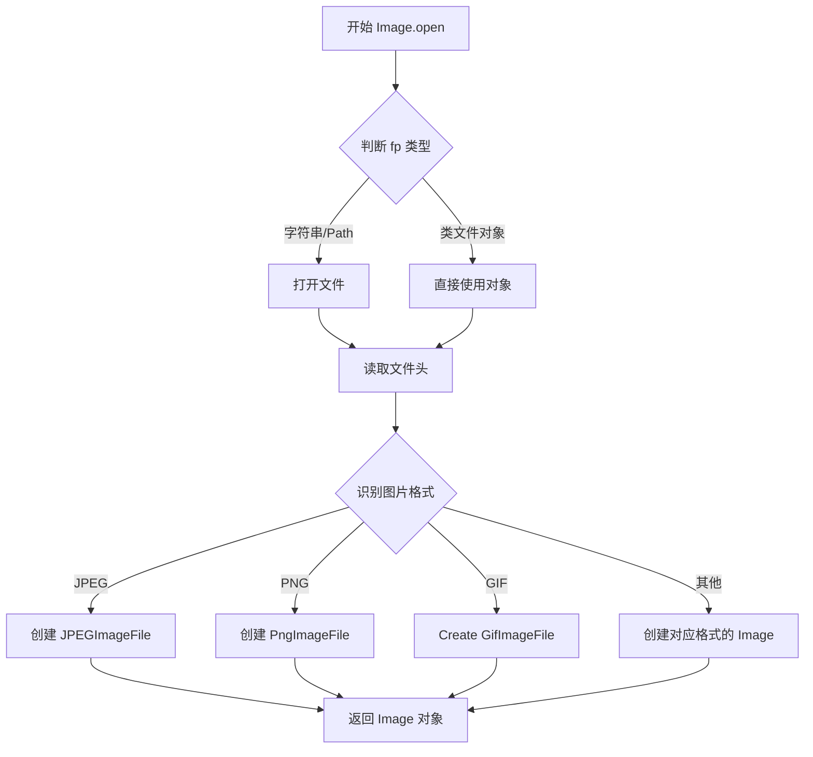

#### 带注释源码

```python
def open(fp, mode="r", formats=None):
    """
    打开并返回给定路径的图像文件。
    
    参数:
        fp: 文件路径字符串、pathlib.Path 对象或类文件对象
        mode: 模式，'r' 表示读取
        formats: 允许的图片格式列表，None 表示自动检测
    
    返回:
        PIL.Image.Image: 图像对象
    """
    
    # 如果 fp 是字符串或 Path 对象，则打开文件
    if isinstance(fp, (str, os.PathLike)):
        filename = fp
        # 打开文件并创建 fp_obj
        fp = builtins.open(filename, "rb")
        close_fp = True
    else:
        # 假设 fp 是类文件对象
        filename = ""
        close_fp = False
    
    try:
        # 从文件头读取并识别格式
        prefix = fp.read(16)
        preinit()
        
        # 识别图片格式
        format = None
        for decoder in SAVE:
            # 检查是否为对应格式
            if formats is not None and decoder not in formats:
                continue
            # 尝试用对应解码器读取
            try:
                fp.seek(0)
                im = decoder(fp, filename)
                _decompression_bomb_check(im.size)
                return im
            except Exception:
                pass
        
        # 如果无法识别，抛出异常
        raise ValueError(f"cannot determine image format")
    finally:
        if close_fp:
            fp.close()
```


### `PIL.Image.Image.save`

PIL库的Image.save方法用于将PIL图像对象保存到文件或文件-like对象中，支持多种图像格式（如PNG、JPEG、BMP等）。在当前代码中，该方法用于将处理后的图像重新编码为Base64格式，以便在HTML到PDF的转换过程中正确渲染图像。

参数：

- `output`：`BytesIO`，用于接收保存的图像数据的字节流对象
- `format`：`str`，目标图像格式（如"PNG"、"JPEG"等），从原图像的format属性获取

返回值：`None`，该方法无返回值，但会将图像数据写入到提供的output BytesIO对象中

#### 流程图

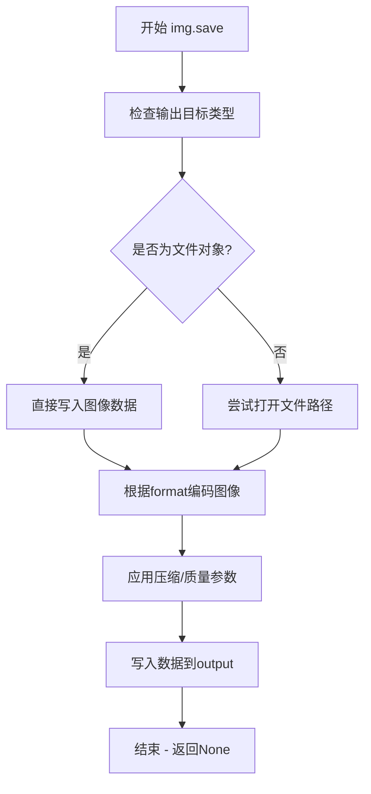

#### 带注释源码

```python
# 在 _preprocess_base64_images 方法的上下文中使用

# 1. 创建输出字节流用于保存转换后的图像
output = BytesIO()

# 2. 调用 PIL Image.save 方法保存图像
# 参数说明：
# - output: 目标文件对象（BytesIO），图像数据将写入此对象
# - format: 图像格式字符串，从原图像的format属性获取
img.save(output, format=img.format)

# 3. 获取写入的图像数据并重新编码为Base64
# getvalue() 返回 BytesIO 中的所有字节数据
# base64.b64encode() 将二进制数据编码为Base64字符串
# .decode() 将字节串转换为UTF-8字符串
new_base64 = base64.b64encode(output.getvalue()).decode()

# 4. 返回新的data URI格式的Base64图像字符串
return f"data:{match.group(1)};base64,{new_base64}"
```

#### 详细说明

在当前代码上下文中的完整使用逻辑：

```python
@staticmethod
def _preprocess_base64_images(html_content):
    """处理HTML内容中的Base64编码图像，重新编码以确保兼容性"""
    pattern = r'data:([^;]+);base64,([^"\'>\s]+)'

    def convert_image(match):
        """正则匹配回调函数，转换单个Base64图像"""
        try:
            # 1. 解码Base64图像数据为二进制
            img_data = base64.b64decode(match.group(2))

            # 2. 在内存中打开图像
            with BytesIO(img_data) as bio:
                with Image.open(bio) as img:
                    # 3. 创建新的字节流用于输出
                    output = BytesIO()
                    
                    # 4. 保存图像到字节流（这里是 img.save 的核心调用）
                    # PIL会使用指定的format重新编码图像
                    # 这确保了图像格式的一致性和兼容性
                    img.save(output, format=img.format)
                    
                    # 5. 将图像数据重新编码为Base64
                    new_base64 = base64.b64encode(output.getvalue()).decode()
                    
                    # 6. 返回新的data URI
                    return f"data:{match.group(1)};base64,{new_base64}"

        except Exception as e:
            # 错误处理：记录日志并返回空字符串
            logger.error(f"Failed to process image: {e}")
            return ""  # 损坏的图像会被丢弃

    # 使用正则替换所有Base64图像
    return re.sub(pattern, convert_image, html_content)
```

#### 潜在技术债务与优化空间

1. **异常处理过于宽泛**：捕获所有异常并返回空字符串可能导致静默失败，难以追踪具体问题
2. **图像格式假设**：假设`img.format`总是存在且有效，未处理格式为None的情况
3. **内存使用**：处理大型图像时，内存中的字节流可能导致内存占用较高
4. **编码质量**：使用默认编码质量，对于JPEG等格式可能产生较大的文件体积


### `re.sub`

正则表达式替换函数，用于在 HTML 内容中查找并替换 base64 编码的图片数据，通过调用转换函数处理图片格式。

参数：

- `pattern`：`str`，正则表达式模式 `r'data:([^;]+);base64,([^"\'>\s]+)'`，用于匹配 HTML 中的 base64 图片数据
- `repl`：`callable`（`convert_image` 函数），替换回调函数，接收匹配对象并返回处理后的图片数据
- `string`：`str`（`html_content`），需要处理的原始 HTML 字符串内容

返回值：`str`，返回替换后的 HTML 字符串，其中 base64 图片已被重新编码处理

#### 流程图

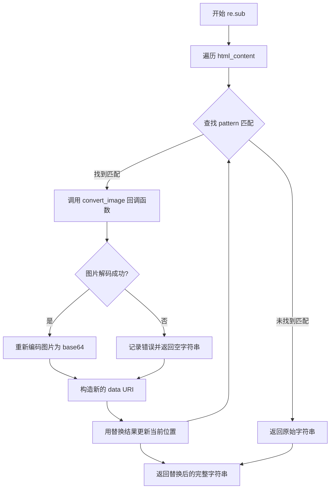

#### 带注释源码

```python
@staticmethod
def _preprocess_base64_images(html_content):
    # 定义正则表达式模式，匹配 data URI 格式的图片
    # 匹配组1: MIME类型 (如 image/png, image/jpeg)
    # 匹配组2: base64编码的图片数据
    pattern = r'data:([^;]+);base64,([^"\'>\s]+)'

    # 定义内部转换函数，处理每个匹配的 base64 图片
    def convert_image(match):
        try:
            # 从匹配组2获取 base64 字符串并解码为二进制数据
            img_data = base64.b64decode(match.group(2))

            # 使用 BytesIO 进行内存中的图片处理
            with BytesIO(img_data) as bio:
                # 使用 PIL 打开图片
                with Image.open(bio) as img:
                    # 创建输出缓冲区
                    output = BytesIO()
                    # 保持原格式重新保存图片
                    img.save(output, format=img.format)
                    # 重新编码为 base64 字符串
                    new_base64 = base64.b64encode(output.getvalue()).decode()
                    # 返回重构后的 data URI
                    return f"data:{match.group(1)};base64,{new_base64}"

        except Exception as e:
            # 记录日志，图片处理失败时返回空字符串
            logger.error(f"Failed to process image: {e}")
            return ""  # we ditch broken images as that breaks the PDF creation down the line

    # 调用 re.sub 进行正则替换
    # 遍历整个 HTML 字符串，对每个匹配的 base64 图片调用 convert_image
    return re.sub(pattern, convert_image, html_content)
```


### `DocumentProvider.__init__`

初始化方法，接收文件路径和配置，创建临时PDF文件，将DOCX文件转换为PDF，并调用父类PdfProvider的初始化方法。

参数：

- `filepath`：`str`，要转换的DOCX文件的路径
- `config`：任意类型，默认为`None`，用于传递给父类PdfProvider的配置参数

返回值：`None`，`__init__`方法不直接返回值，但通过修改实例属性完成初始化

#### 流程图

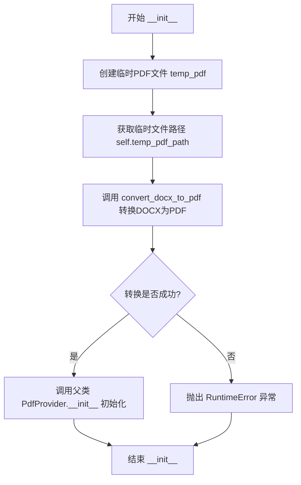

#### 带注释源码

```python
def __init__(self, filepath: str, config=None):
    # 创建一个临时的PDF文件，delete=False确保文件在程序结束后不会被自动删除
    # 这样我们可以在后续手动管理临时文件的生命周期
    temp_pdf = tempfile.NamedTemporaryFile(delete=False, suffix=".pdf")
    
    # 保存临时PDF文件的路径到实例属性，供后续方法使用
    self.temp_pdf_path = temp_pdf.name
    
    # 关闭文件句柄，因为后续需要重新打开或通过其他方式写入
    temp_pdf.close()

    # 将DOCX文件转换为PDF格式
    try:
        self.convert_docx_to_pdf(filepath)
    except Exception as e:
        # 如果转换过程中出现任何异常，抛出RuntimeError并携带原始错误信息
        raise RuntimeError(f"Failed to convert {filepath} to PDF: {e}")

    # 使用临时PDF文件的路径和配置参数调用父类PdfProvider的初始化方法
    # 完成整个Provider的初始化过程
    super().__init__(self.temp_pdf_path, config)
```


### `DocumentProvider.__del__`

析构方法，在对象销毁时自动调用，清理由 `DocumentProvider` 创建的临时 PDF 文件，释放磁盘空间。

参数：此方法无显式参数（`self` 为隐式参数）。

返回值：`None`，析构方法不返回任何值。

#### 流程图

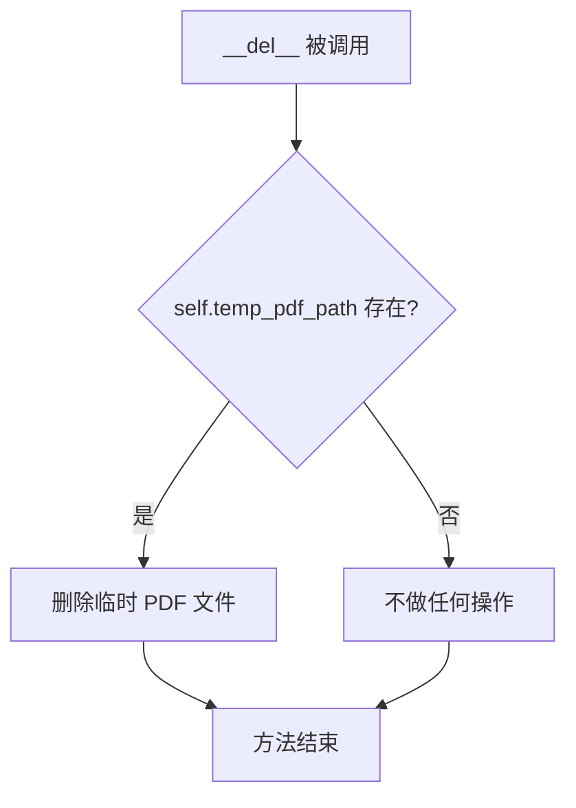

#### 带注释源码

```python
def __del__(self):
    """
    析构方法，在对象生命周期结束时自动调用。
    负责清理临时创建的 PDF 文件，防止磁盘空间泄漏。
    """
    # 检查临时 PDF 文件路径是否存在
    if os.path.exists(self.temp_pdf_path):
        # 如果文件存在，则删除该临时文件
        os.remove(self.temp_pdf_path)
```


### `DocumentProvider.convert_docx_to_pdf`

该方法负责将 DOCX 文档转换为 PDF 格式。它首先使用 `mammoth` 库将 DOCX 文件解析为 HTML，然后使用 `weasyprint` 库将 HTML 转换为 PDF，并在转换过程中应用自定义 CSS 样式和字体样式，同时处理 HTML 中嵌入的 Base64 编码图像。

参数：

- `self`：实例方法隐式参数，指向 `DocumentProvider` 类实例本身
- `filepath`：`str`，要转换的 DOCX 文件的完整路径

返回值：`None`，该方法直接写入 PDF 文件到 `self.temp_pdf_path`，不返回任何值

#### 流程图

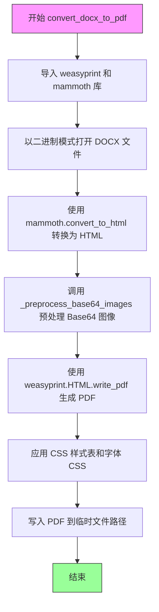

#### 带注释源码

```python
def convert_docx_to_pdf(self, filepath: str):
    """
    将 DOCX 文档转换为 PDF 格式
    
    参数:
        filepath: DOCX 文件的路径
    
    返回:
        无返回值，PDF 直接写入 self.temp_pdf_path
    """
    # 延迟导入依赖库，避免在模块加载时引入未安装的包
    from weasyprint import CSS, HTML
    import mammoth

    # 以二进制读取模式打开 DOCX 文件
    with open(filepath, "rb") as docx_file:
        # Step 1: 使用 mammoth 库将 DOCX 转换为 HTML
        # mammoth 是一个用于将 DOCX 文档转换为 HTML 的库
        result = mammoth.convert_to_html(docx_file)
        html = result.value  # 获取转换后的 HTML 字符串

        # Step 2: 预处理 HTML 中的 Base64 编码图像
        # 处理可能存在的图像格式问题，确保兼容性
        preprocessed_html = self._preprocess_base64_images(html)

        # Step 3: 使用 weasyprint 将 HTML 转换为 PDF
        # weasyprint 是一个支持 CSS 的 HTML 到 PDF 转换器
        HTML(string=preprocessed_html).write_pdf(
            self.temp_pdf_path,  # 输出 PDF 的目标路径（临时文件）
            # 应用样式表：自定义 CSS 和获取的字体 CSS
            stylesheets=[CSS(string=css), self.get_font_css()]
        )
```


### `DocumentProvider._preprocess_base64_images`

该静态方法用于处理HTML内容中的base64编码图像，通过正则表达式匹配所有内嵌的base64图像数据，使用PIL库重新编码图像以确保格式一致性，并将处理后的新base64数据替换回HTML中，返回处理完成的HTML字符串。

参数：

- `html_content`：`str`，包含base64编码图像的HTML内容字符串

返回值：`str`，处理后的HTML内容字符串，其中base64图像已被重新编码

#### 流程图

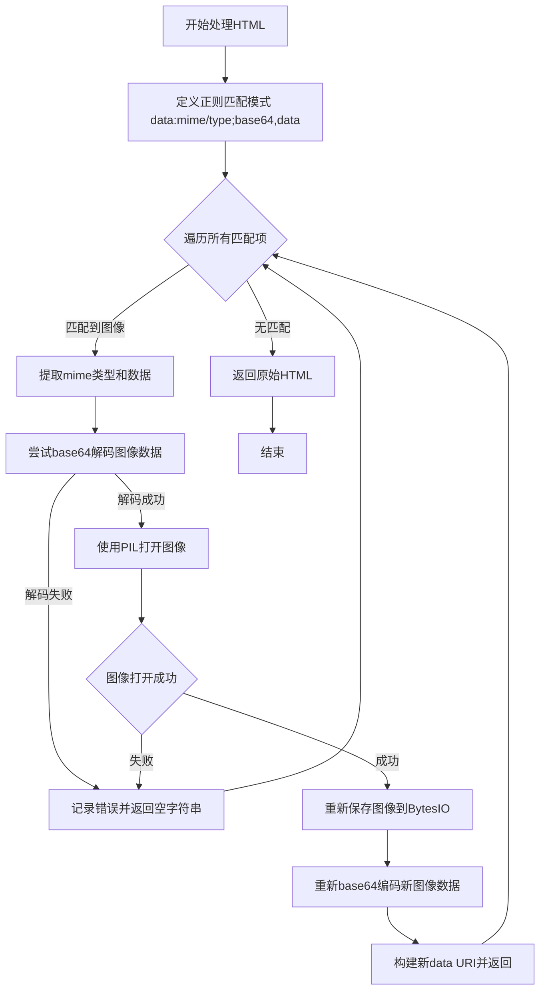

#### 带注释源码

```python
@staticmethod
def _preprocess_base64_images(html_content):
    """
    静态方法：预处理HTML中的base64编码图像
    
    该方法使用正则表达式匹配HTML中的base64内嵌图像，
    通过PIL重新编码图像以确保格式一致性，
    返回处理后的HTML内容
    """
    # 定义正则表达式模式，匹配 data: MIME类型 ; base64 , 数据 的格式
    # 捕获组1: MIME类型 (如 image/png, image/jpeg)
    # 捕获组2: base64编码的图像数据
    pattern = r'data:([^;]+);base64,([^"\'>\s]+)'

    def convert_image(match):
        """
        内部函数：处理单个base64图像匹配项
        
        参数:
            match: 正则表达式匹配对象
            
        返回:
            处理后的base64 data URI字符串，或空字符串（处理失败时）
        """
        try:
            # 从匹配中获取第二组（base64数据）并解码为二进制
            img_data = base64.b64decode(match.group(2))

            # 使用BytesIO将解码后的数据作为内存文件处理
            with BytesIO(img_data) as bio:
                # 使用PIL打开图像对象
                with Image.open(bio) as img:
                    # 创建新的内存缓冲区用于输出
                    output = BytesIO()
                    # 重新保存图像（使用原图格式），这会重新编码图像
                    img.save(output, format=img.format)
                    # 将重新编码的图像数据转换为base64字符串
                    new_base64 = base64.b64encode(output.getvalue()).decode()
                    # 返回新的完整data URI
                    return f"data:{match.group(1)};base64,{new_base64}"

        except Exception as e:
            # 记录处理失败的原因
            logger.error(f"Failed to process image: {e}")
            # 返回空字符串跳过损坏的图像，避免PDF生成失败
            return ""

    # 使用re.sub遍历替换所有匹配的base64图像
    return re.sub(pattern, convert_image, html_content)
```

## 关键组件


### DocumentProvider 类

文档转换核心类，继承自 PdfProvider，负责将 DOCX 文件转换为 PDF 格式。内部通过 mammoth 库将 DOCX 转换为 HTML，再利用 WeasyPrint 将 HTML 转换为 PDF，并自动管理临时文件的生命周期。

### convert_docx_to_pdf 方法

核心转换逻辑，将 DOCX 文件路径作为输入，通过 mammoth 库读取 DOCX 文件并转换为 HTML 格式，然后使用 WeasyPrint 的 HTML 类将预处理后的 HTML 内容写入为 PDF 文件，同时应用自定义 CSS 样式和字体 CSS。

### _preprocess_base64_images 静态方法

用于预处理 HTML 内容中的 base64 编码图像，使用正则表达式匹配 data URI 格式的图片，通过 PIL 库重新编码图像确保格式兼容性，并将无法处理的损坏图像替换为空字符串以避免 PDF 生成失败。

### 临时文件管理机制

在初始化时创建临时 PDF 文件存储转换结果，在对象销毁时自动清理临时文件，防止磁盘空间泄漏。

### CSS 样式定义

内置完整的 CSS 样式表，定义了页面尺寸为 A4、边距为 2cm，限制图片最大高度为 25cm，设置表格边框折叠和单元格样式，确保 PDF 输出格式规范。


## 问题及建议


### 已知问题

- **资源管理不可靠**：使用 `__del__` 方法清理临时文件不够可靠，Python 不保证一定会调用 `__del__`，且该方法中若抛出异常会导致隐藏的错误
- **缺少上下文管理器**：类未实现 `__enter__` 和 `__exit__` 方法，无法使用 `with` 语句确保资源正确释放，在异常情况下临时文件可能残留
- **异常处理过于宽泛**：`convert_docx_to_pdf` 中使用 `except Exception` 捕获所有异常并直接抛出，隐藏了具体错误类型，不利于调试和恢复
- **日志记录不充分**：图像处理失败时仅记录错误日志返回空字符串，可能导致 PDF 内容不完整但用户无感知
- **缺少输入验证**：构造函数未验证 `filepath` 是否存在、是否为有效的 DOCX 文件
- **图像处理可能失败**：`img.format` 可能为 `None`，导致 `img.save(output, format=img.format)` 时出错
- **依赖方法缺少空值检查**：`self.get_font_css()` 的返回值未做空值检查，可能导致后续 PDF 生成失败
- **并发安全问题**：使用 `tempfile.NamedTemporaryFile` 生成临时文件时未添加唯一标识，在高并发场景下可能产生冲突
- **硬编码依赖**：外部库 `weasyprint` 和 `mammoth` 未指定版本约束，可能因版本不兼容导致运行时错误
- **类型提示不完整**：`config` 参数类型为 `config=None`，应为具体类型如 `Dict[str, Any]` 或定义配置类

### 优化建议

- **实现上下文管理器**：添加 `__enter__` 和 `__exit__` 方法，确保临时文件在使用后被正确清理
- **改进临时文件生成**：使用 `uuid` 或 `os.urandom` 为临时文件生成唯一名称，避免并发冲突
- **增强异常处理**：区分不同异常类型，针对性处理；添加重试机制应对临时性失败
- **添加输入验证**：在构造函数中检查文件存在性和格式，提供清晰的错误信息
- **完善日志记录**：记录更多上下文信息（如文件名、图像标识），对关键失败进行告警
- **添加图像格式校验**：在处理图像前检查 `img.format` 是否有效，为无效格式提供备用方案
- **依赖版本管理**：在项目依赖配置中明确 `weasyprint` 和 `mammoth` 的版本范围
- **提取配置**：将 CSS 字符串移至单独配置文件或配置类，提高可维护性
- **完善类型提示**：为 `config` 参数及内部变量添加完整类型注解，提高代码可读性和 IDE 支持

## 其它


### 设计目标与约束

该模块的核心目标是将DOCX文档转换为PDF格式，支持图片（特别是Base64内嵌图片）的处理。约束条件包括：仅支持DOCX格式输入，输出为A4尺寸的PDF，依赖WeasyPrint进行HTML到PDF的转换，临时文件在对象销毁时清理。

### 错误处理与异常设计

代码中的异常处理主要体现在三个位置：
1. **__init__方法**：捕获DOCX到PDF转换过程中的异常，抛出RuntimeError并附带原始错误信息
2. **convert_docx_to_pdf方法**：依赖mammoth和WeasyPrint库抛出异常，上层已统一捕获
3. **_preprocess_base64_images方法**：捕获图片解码/编码过程中的异常，记录日志后返回空字符串（丢弃损坏图片）

当前设计存在改进空间：异常信息可增加更多上下文（如具体行号、文件路径），可考虑定义自定义异常类以区分不同类型的错误。

### 数据流与状态机

数据流如下：
1. 初始化阶段：创建临时PDF文件
2. 转换阶段：读取DOCX文件 → mammoth转换为HTML → 预处理Base64图片 → WeasyPrint生成PDF
3. 清理阶段：对象销毁时删除临时PDF文件

状态机包含三个主要状态：初始化、转换中、转换完成/失败。状态转换由方法调用驱动，无复杂的状态管理逻辑。

### 外部依赖与接口契约

主要外部依赖包括：
- **mammoth**：DOCX转HTML，提供convert_to_html方法，返回result.value获取HTML字符串
- **WeasyPrint**：HTML转PDF，提供HTML.write_pdf方法，支持stylesheets参数
- **PIL (Pillow)**：图片处理，用于验证和重新编码Base64图片
- **marker.providers.pdf.PdfProvider**：基类，提供PDF处理能力和字体CSS获取

接口契约：
- 构造函数：接收filepath (str) 和可选config，返回DocumentProvider实例
- convert_docx_to_pdf：接收filepath，返回None，副作用是生成PDF文件
- _preprocess_base64_images：静态方法，接收html_content (str)，返回处理后的HTML字符串

### 性能考虑

当前实现中潜在的的性能瓶颈：
1. **图片处理**：所有Base64图片都被解码后再编码，无论是否需要处理，可添加格式检测逻辑
2. **临时文件**：使用NamedTemporaryFile创建临时文件，未使用文件池或缓存机制
3. **内存使用**：整个HTML内容驻留内存，大文档可能造成内存压力

建议：对于大文档可考虑流式处理，添加图片格式预检测以跳过无需处理的图片，考虑使用生成器模式处理长HTML内容。

### 安全性考虑

1. **文件操作安全**：临时文件创建在系统默认临时目录，可能存在竞态条件风险
2. **文件删除**：__del__方法中的删除操作在对象销毁时执行，若程序异常退出可能导致临时文件残留
3. **HTML处理**：mammoth转换HTML时未进行XSS过滤，直接传入WeasyPrint可能存在安全风险（取决于后续使用场景）
4. **路径安全**：未验证输入filepath的合法性，可能存在路径遍历攻击风险

### 资源管理

1. **临时文件管理**：使用NamedTemporaryFile创建临时PDF，__del__中删除，但异常情况下可能无法清理
2. **文件句柄管理**：使用with语句管理docx_file和BytesIO资源，确保正确关闭
3. **图片资源管理**：使用with语句管理Image对象，自动释放

改进建议：可使用contextlib.contextmanager或实现__enter__/__exit__方法以支持with语句，实现更可靠的资源管理。

### 兼容性考虑

1. **Python版本**：依赖的第三方库（mammoth、WeasyPrint、PIL）有各自的Python版本支持要求
2. **DOCX格式支持**：mammoth库对DOCX特性的支持有限，部分复杂格式可能无法完美转换
3. **图片格式支持**：PIL支持的图片格式决定可处理的Base64图片类型
4. **PDF生成**：WeasyPrint对CSS的支持有限，可能影响PDF渲染效果

### 配置管理

当前代码中config参数传递给基类PdfProvider，但未在DocumentProvider中直接使用。CSS样式以字符串形式硬编码，可考虑：
1. 从config中读取样式配置
2. 支持自定义CSS注入
3. 考虑将样式配置外部化到配置文件

### 日志与监控

当前使用marker.logger.get_logger()获取日志记录器，仅在图片处理失败时记录错误日志。建议：
1. 添加转换各阶段的日志（开始、进度、完成）
2. 记录性能指标（转换耗时）
3. 添加异常日志的上下文信息（如文件名、文件大小）

### 潜在技术债务与优化建议

1. **临时文件清理**：__del__方法不可靠，建议使用atexit或上下文管理器
2. **错误处理粒度**：可定义自定义异常类，区分不同错误类型
3. **图片处理优化**：添加图片格式预检测，避免不必要的编解码
4. **配置灵活性**：CSS样式和配置应可外部化
5. **测试覆盖**：缺少单元测试，特别是异常场景的测试
6. **文档完善**：缺少API文档和使用示例

    