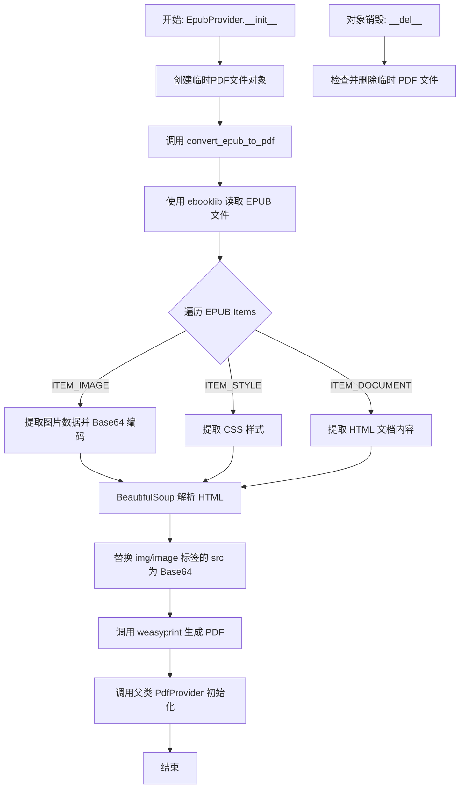
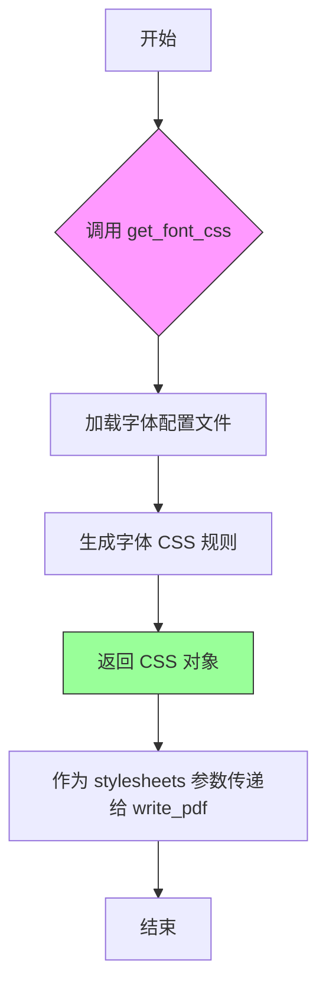
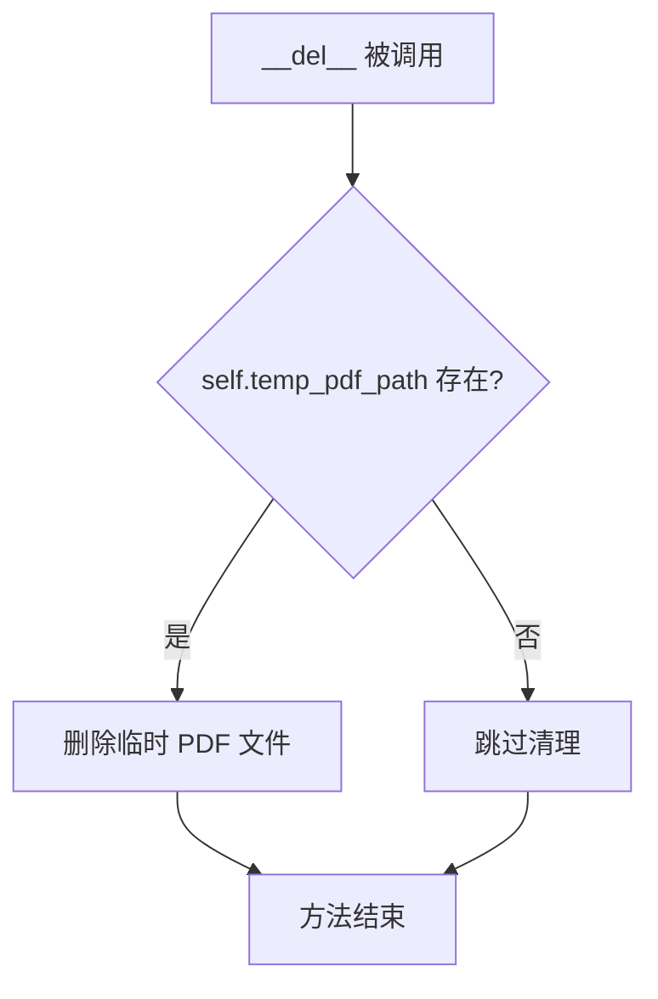
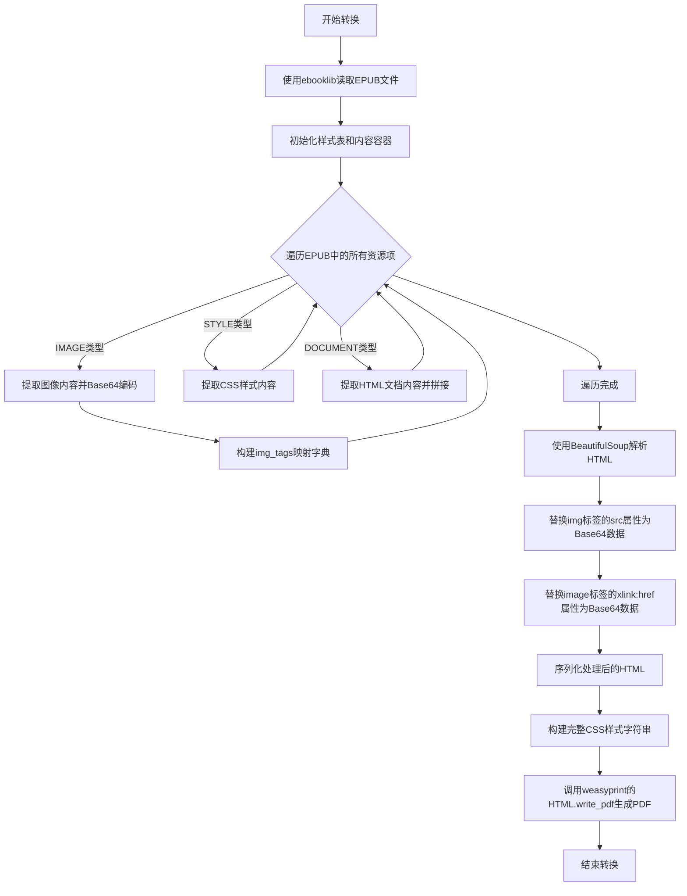
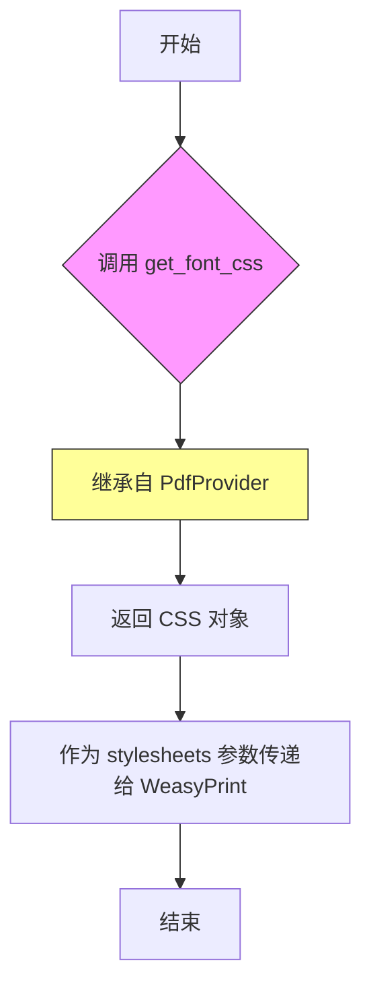

# `marker\marker\providers\epub.py` 详细设计文档

该代码定义了一个 EpubProvider 类，继承自 PdfProvider，用于将 EPUB 电子书格式转换为 PDF。核心流程包括读取 EPUB 文件、提取 HTML 文本与图片资源（Base64 编码）、处理 DOM 节点中的图片引用，最后调用 weasyprint 库将处理后的 HTML 渲染为 PDF 文件，并利用临时文件机制管理转换过程。

## 整体流程



## 类结构

```
PdfProvider (基类)
└── EpubProvider (继承自 PdfProvider)
```

## 全局变量及字段


### `css`
    
全局定义的字符串常量，包含 PDF 渲染用的 CSS 样式规则（如页面大小、字体、图片限制）

类型：`str`
    


### `EpubProvider.temp_pdf_path`
    
实例属性，指向临时生成的 PDF 文件路径

类型：`str`
    


### `EpubProvider.filepath`
    
方法参数，要转换的 EPUB 文件路径

类型：`str`
    


### `EpubProvider.config`
    
方法参数，包含转换配置

类型：`dict`
    
    

## 全局函数及方法


### `EpubProvider.convert_epub_to_pdf`

将 EPUB 电子书格式转换为 PDF 文档。该方法读取 EPUB 文件，提取其中的 HTML 内容、图像（转换为 Base64 编码）和 CSS 样式，然后使用 BeautifulSoup 处理 HTML 中的图像引用，最后通过 WeasyPrint 将处理后的 HTML 内容渲染为 PDF 文件并保存到临时路径。

参数：

- `filepath`：`str`，要转换的 EPUB 文件的路径

返回值：`None`，该方法直接操作 `self.temp_pdf_path` 属性写入 PDF 数据

#### 流程图


#### 带注释源码

```python
def convert_epub_to_pdf(self, filepath):
    # 导入依赖库：WeasyPrint 用于 HTML 到 PDF 转换，ebooklib 用于读取 EPUB 格式
    from weasyprint import CSS, HTML
    from ebooklib import epub
    import ebooklib

    # 使用 ebooklib 读取 EPUB 文件，返回电子书对象
    ebook = epub.read_epub(filepath)

    # 初始化样式列表和 HTML 内容容器
    styles = []
    html_content = ""
    # 存储图像文件名到 Base64 data URI 的映射
    img_tags = {}

    # 第一轮遍历：提取 EPUB 中的图像和样式资源
    for item in ebook.get_items():
        # 处理图像类型资源
        if item.get_type() == ebooklib.ITEM_IMAGE:
            # 将图像内容转换为 Base64 编码的 data URI
            img_data = base64.b64encode(item.get_content()).decode("utf-8")
            # 存储格式：'data:image/png;base64,...'
            img_tags[item.file_name] = f'data:{item.media_type};base64,{img_data}'
        # 处理 CSS 样式资源
        elif item.get_type() == ebooklib.ITEM_STYLE:
            # 解码样式内容并添加到样式列表
            styles.append(item.get_content().decode('utf-8'))

    # 第二轮遍历：提取文档内容（HTML/XHTML）
    for item in ebook.get_items():
        if item.get_type() == ebooklib.ITEM_DOCUMENT:
            # 解码并拼接所有文档内容
            html_content += item.get_content().decode("utf-8")

    # 使用 BeautifulSoup 解析合并后的 HTML 内容
    soup = BeautifulSoup(html_content, 'html.parser')
    
    # 处理 img 标签：将相对路径替换为 Base64 编码的图像数据
    for img in soup.find_all('img'):
        src = img.get('src')
        if src:
            # 移除可能存在的前缀 '../'
            normalized_src = src.replace('../', '')
            # 如果图像在映射表中，替换为 Base64 data URI
            if normalized_src in img_tags:
                img['src'] = img_tags[normalized_src]

    # 处理 SVG/image 标签：同样替换 xlink:href 属性
    for image in soup.find_all('image'):
        src = image.get('xlink:href')
        if src:
            normalized_src = src.replace('../', '')
            if normalized_src in img_tags:
                image['xlink:href'] = img_tags[normalized_src]

    # 将处理后的 HTML 转换为字符串
    html_content = str(soup)
    
    # 合并 CSS 样式：使用模块级定义的默认样式（可额外合并 EPUB 内置样式）
    full_style = ''.join([css])  # + styles)  # 注：EPUB 内置样式被注释未启用

    # 使用 WeasyPrint 将处理后的 HTML 转换为 PDF
    # 参数说明：
    #   - string: HTML 内容字符串
    #   - base_url: 用于解析相对路径（特别是图像）
    #   - stylesheets: CSS 样式表列表
    #   - 输出目标：self.temp_pdf_path（临时 PDF 文件路径）
    HTML(string=html_content, base_url=filepath).write_pdf(
        self.temp_pdf_path,
        stylesheets=[CSS(string=full_style), self.get_font_css()]
    )
```


### `PdfProvider.get_font_css`

获取字体相关的 CSS 样式，用于 PDF 渲染时的字体配置。该方法继承自 `PdfProvider` 类，在 `EpubProvider` 中被调用，以生成适用于 PDF 的字体样式表。

参数：
- 无参数（实例方法，通过 `self` 访问）

返回值：`CSS`（来自 weasyprint 库的 CSS 对象），返回字体相关的 CSS 样式定义，用于 PDF 渲染时的字体配置

#### 流程图



#### 带注释源码

```
# 注：由于 get_font_css 方法定义在 PdfProvider 父类中，
# 以下为基于调用方式和 PDF 生成上下文的推断实现

def get_font_css(self):
    """
    获取字体相关的 CSS 样式配置
    
    返回值：
        CSS: weasyprint 的 CSS 对象，包含字体样式定义
    """
    from weasyprint import CSS
    
    # 字体 CSS 配置（推断）
    font_css = CSS(string='''
        @font-face {
            font-family: "CustomFont";
            src: local("Arial"), local("Helvetica");
        }
        
        body {
            font-family: "Arial", "Helvetica", sans-serif;
            line-height: 1.6;
        }
    ''')
    
    return font_css


# 在 EpubProvider 中的调用方式：
# HTML(string=html_content, base_url=filepath).write_pdf(
#     self.temp_pdf_path,
#     stylesheets=[CSS(string=full_style), self.get_font_css()]
# )
```

> **注意**：由于 `get_font_css` 方法定义在 `PdfProvider` 父类中，提供的代码片段未包含其完整实现。上述源码为基于方法调用方式和 PDF 生成上下文的合理推断。


### EpubProvider.__init__

构造函数，接收文件路径和配置，创建临时PDF文件用于存储EPUB转换后的结果，并调用EPUB转PDF的转换逻辑，最后初始化父类PdfProvider。

参数：

- `filepath`：`str`，EPUB文件的路径
- `config`：`any`，可选配置参数，传递给父类PdfProvider

返回值：`None`，无返回值（构造函数）

#### 流程图

```mermaid
flowchart TD
    A[开始 __init__] --> B[创建临时PDF文件<br/>tempfile.NamedTemporaryFile]
    --> C[关闭临时文件<br/>temp_pdf.close()]
    --> D{convert_epub_to_pdf<br/>转换是否成功?}
    -->|是| E[调用父类初始化<br/>super().__init__]
    --> F[结束]
    -->|否| G[抛出RuntimeError异常]
    --> F
    
    style D fill:#f9f,stroke:#333
    style G fill:#f96,stroke:#333
```

#### 带注释源码

```python
def __init__(self, filepath: str, config=None):
    # 创建一个临时的PDF文件，delete=False表示程序退出时不自动删除
    # suffix=".pdf"指定文件扩展名为.pdf
    temp_pdf = tempfile.NamedTemporaryFile(delete=False, suffix=f".pdf")
    
    # 将临时文件路径保存为实例变量，供后续方法使用
    self.temp_pdf_path = temp_pdf.name
    
    # 关闭文件句柄，因为NamedTemporaryFile打开后需要关闭才能被其他进程使用
    temp_pdf.close()

    # 将EPUB转换为PDF
    try:
        # 调用私有方法执行EPUB到PDF的转换
        self.convert_epub_to_pdf(filepath)
    except Exception as e:
        # 如果转换过程中发生任何异常，抛出RuntimeError并包含原始错误信息
        raise RuntimeError(f"Failed to convert {filepath} to PDF: {e}")

    # 使用转换后的临时PDF文件路径初始化父类PdfProvider
    # 传递config参数以便父类进行后续处理
    super().__init__(self.temp_pdf_path, config)
```

#### 相关类字段

| 字段名称 | 类型 | 描述 |
|---------|------|------|
| `temp_pdf_path` | `str` | 临时PDF文件的绝对路径，用于存储EPUB转换后的PDF内容 |

#### 相关类方法

| 方法名称 | 功能描述 |
|---------|---------|
| `__del__` | 析构函数，删除临时PDF文件，释放磁盘空间 |
| `convert_epub_to_pdf` | 核心转换方法，读取EPUB文件并使用WeasyPrint转换为PDF |


### `EpubProvider.__del__`

析构函数，在对象生命周期结束时被调用，确保临时生成的 PDF 文件被清理，防止磁盘空间泄漏。

参数：

- `self`：`EpubProvider`，实例本身，用于访问实例属性 `temp_pdf_path`

返回值：`None`，无返回值，仅执行清理操作

#### 流程图



#### 带注释源码

```python
def __del__(self):
    # 检查临时文件路径是否存在
    if os.path.exists(self.temp_pdf_path):
        # 如果存在则删除临时 PDF 文件，释放磁盘空间
        os.remove(self.temp_pdf_path)
```


### `EpubProvider.convert_epub_to_pdf`

该方法是 `EpubProvider` 类的核心转换方法，负责将 EPUB 电子书格式转换为 PDF 文档。其核心业务逻辑包括：使用 `ebooklib` 库解析 EPUB 文件，提取其中的图像资源并转换为 Base64 编码的内嵌数据，合并所有 HTML 文档内容，使用 BeautifulSoup 修正图像引用路径，最后通过 `weasyprint` 库将处理后的 HTML 内容连同 CSS 样式一起渲染输出为 PDF 文件。

参数：

- `filepath`：`str`，待转换的 EPUB 文件路径

返回值：`None`，该方法直接输出 PDF 文件到初始化时创建的临时文件路径（`self.temp_pdf_path`）

#### 流程图



#### 带注释源码

```python
def convert_epub_to_pdf(self, filepath):
    """
    将EPUB电子书转换为PDF格式
    
    参数:
        filepath: EPUB文件的路径
    
    处理流程:
        1. 使用ebooklib解析EPUB文件结构
        2. 提取所有图像资源并转换为Base64编码
        3. 提取CSS样式内容
        4. 合并所有HTML文档内容
        5. 使用BeautifulSoup修正图像引用路径
        6. 使用weasyprint将HTML渲染为PDF
    """
    # 导入所需的第三方库
    from weasyprint import CSS, HTML
    from ebooklib import epub
    import ebooklib

    # 使用ebooklib读取EPUB文件，返回书籍对象
    ebook = epub.read_epub(filepath)

    # 初始化样式表列表（用于存储CSS样式）
    styles = []
    # 初始化HTML内容字符串（用于拼接所有HTML文档）
    html_content = ""
    # 初始化图像标签映射字典（filename -> base64 data URI）
    img_tags = {}

    # 第一次遍历：提取图像和样式资源
    for item in ebook.get_items():
        if item.get_type() == ebooklib.ITEM_IMAGE:
            # 获取图像内容并转换为Base64编码
            img_data = base64.b64encode(item.get_content()).decode("utf-8")
            # 构建data URI格式的图像源
            img_tags[item.file_name] = f'data:{item.media_type};base64,{img_data}'
        elif item.get_type() == ebooklib.ITEM_STYLE:
            # 提取CSS样式内容（EPUB中的内联样式）
            styles.append(item.get_content().decode('utf-8'))

    # 第二次遍历：提取HTML文档内容
    for item in ebook.get_items():
        if item.get_type() == ebooklib.ITEM_DOCUMENT:
            # 将所有HTML文档拼接为一个完整的HTML内容
            html_content += item.get_content().decode("utf-8")

    # 使用BeautifulSoup解析合并后的HTML内容
    soup = BeautifulSoup(html_content, 'html.parser')
    
    # 遍历所有img标签，替换相对路径为Base64内嵌数据
    for img in soup.find_all('img'):
        src = img.get('src')
        if src:
            # 标准化路径（移除 ../ 前缀）
            normalized_src = src.replace('../', '')
            if normalized_src in img_tags:
                # 替换为Base64编码的图像数据
                img['src'] = img_tags[normalized_src]

    # 遍历所有image标签（SVG等使用的标签），处理xlink:href属性
    for image in soup.find_all('image'):
        src = image.get('xlink:href')
        if src:
            # 标准化路径（移除 ../ 前缀）
            normalized_src = src.replace('../', '')
            if normalized_src in img_tags:
                # 替换为Base64编码的图像数据
                image['xlink:href'] = img_tags[normalized_src]

    # 将处理后的HTML转换为字符串
    html_content = str(soup)
    
    # 构建完整的CSS样式（基础样式 + 字体样式）
    # 注意：原代码中styles变量未被使用，此处预留了扩展接口
    full_style = ''.join([css])  # + styles)

    # 使用weasyprint将HTML转换为PDF
    # 参数说明：
    #   string: HTML内容
    #   base_url: 用于解析相对路径的基准URL（传入EPUB文件路径）
    #   write_pdf: 输出PDF的目标路径
    #   stylesheets: CSS样式表列表
    HTML(string=html_content, base_url=filepath).write_pdf(
        self.temp_pdf_path,
        stylesheets=[CSS(string=full_style), self.get_font_css()]
    )
```


### `EpubProvider.get_font_css`

获取字体样式配置，供 WeasyPrint 将 EPUB 转换为 PDF 时使用。

参数： 无

返回值： `CSS`，WeasyPrint 使用的 CSS 样式对象，包含字体相关的样式定义

#### 流程图



#### 带注释源码

```python
def get_font_css(self):
    """
    获取字体样式配置，供 WeasyPrint 使用
    
    这是一个继承方法，具体实现位于父类 PdfProvider 中。
    该方法返回一个 CSS 对象，包含字体相关的样式定义，
    用于在 EPUB 转 PDF 时应用自定义字体配置。
    
    返回值:
        CSS: WeasyPrint 的 CSS 对象，包含字体样式配置
    """
    # 继承自 PdfProvider 的方法
    # 具体实现需要查看 PdfProvider 类的定义
    # 根据调用上下文，该方法应返回 CSS 对象或 None
    
    # 在 EpubProvider.convert_epub_to_pdf 中的调用方式：
    # HTML(string=html_content, base_url=filepath).write_pdf(
    #     self.temp_pdf_path,
    #     stylesheets=[CSS(string=full_style), self.get_font_css()]
    # )
    pass
```

## 关键组件


### EPUB解析器

使用ebooklib库读取并解析EPUB文件，提取文档内容、样式和图片资源。

### 图片处理与Base64编码

将EPUB中的图片资源转换为Base64编码的Data URL，以便在HTML中直接嵌入显示，解决图片路径引用问题。

### HTML内容规范化

使用BeautifulSoup解析HTML内容，规范化图片路径（处理'../'相对路径），将所有图片引用替换为Base64嵌入的Data URL。

### PDF转换引擎

集成weasyprint库将处理后的HTML内容转换为PDF文件，支持自定义CSS样式表和字体CSS的应用。

### 临时文件管理

创建和管理临时PDF文件，在对象销毁时自动清理临时文件，防止磁盘空间泄漏。

### CSS样式定义

预定义的CSS模板用于控制PDF输出格式，包括页面尺寸、字体大小、表格样式和图片自适应布局。


## 问题及建议


### 已知问题

-   **临时文件泄漏风险**：在`__init__`方法中，如果`convert_epub_to_pdf`或`super().__init__`抛出异常，已创建的临时PDF文件不会被清理，导致临时文件泄漏
-   **`__del__`方法不可靠**：Python文档不建议依赖`__del__`进行资源清理，对象可能不会被及时销毁，且异常会被忽略
-   **未使用的代码**：`styles`变量被收集但从未使用，注释掉的`# + styles)`表明原本计划合并样式但未完成，存在未完成的功能
-   **内部导入模块**：`weasyprint`和`ebooklib`在方法内部导入，不利于代码可读性和性能，且导入失败时错误信息不够清晰
-   **图片路径处理不完整**：仅处理了`../`前缀替换，未处理其他可能的相对路径形式（如`./`、绝对路径转换等）
-   **样式编码处理**：从EPUB中提取的样式直接使用`decode('utf-8')`，未指定错误处理策略，可能导致编码相关问题被隐藏

### 优化建议

-   使用上下文管理器（`with`语句）或`try/finally`块确保临时文件始终被清理
-   将模块导入移到文件顶部或类外部的方法，提高可维护性
-   完成或移除未使用的样式合并功能，避免代码混淆
-   添加更多路径规范化逻辑，处理各种相对路径格式
-   考虑使用`errors='strict'`或适当的编码错误处理策略
-   验证输入文件路径的有效性，提供更友好的错误信息

## 其它


### 设计目标与约束

将EPUB格式的电子书转换为PDF文件，支持A4页面尺寸，保持原有的样式和图片内容。转换过程中需要处理EPUB中的内嵌图片（转换为base64编码）、样式表合并、以及页面布局控制。

### 错误处理与异常设计

- **转换失败**: 当EPUB转PDF过程中出现异常时，抛出RuntimeError并附带原始异常信息
- **文件清理**: 在对象销毁时自动删除临时PDF文件，即使转换失败也会尝试清理
- **依赖检查**: 依赖weasyprint、ebooklib、BeautifulSoup等库，缺失时会在运行时抛出ImportError

### 数据流与状态机

1. 初始化阶段：创建临时PDF文件
2. 转换阶段：读取EPUB、提取图片和样式、解析HTML内容、替换图片引用、生成PDF
3. 清理阶段：删除临时文件

### 外部依赖与接口契约

- **PdfProvider**: 父类，提供PDF处理基础功能
- **weasyprint**: 用于HTML到PDF的转换
- **ebooklib**: 用于读取EPUB文件
- **BeautifulSoup**: 用于HTML内容解析和图片引用替换
- **tempfile**: 用于创建临时文件

### 性能考虑

- 临时文件在对象销毁时删除，可能导致磁盘空间临时占用
- 图片内容全部加载到内存并进行base64编码，大型EPUB文件可能占用较多内存

### 安全性考虑

- 文件路径直接传递给外部库，存在路径注入风险
- HTML内容未经充分清理直接传递给weasyprint，可能存在HTML注入风险

### 配置管理

- 通过config参数传递给父类PdfProvider
- CSS样式当前为硬编码，未来可考虑外部配置化

### 版本兼容性

- 依赖Python标准库和第三方库，需要确保weasyprint、ebooklib、BeautifulSoup版本兼容性

### 测试策略

- 应测试不同EPUB文件的转换兼容性
- 应测试大型EPUB文件的内存使用
- 应测试临时文件正确清理的场景

    