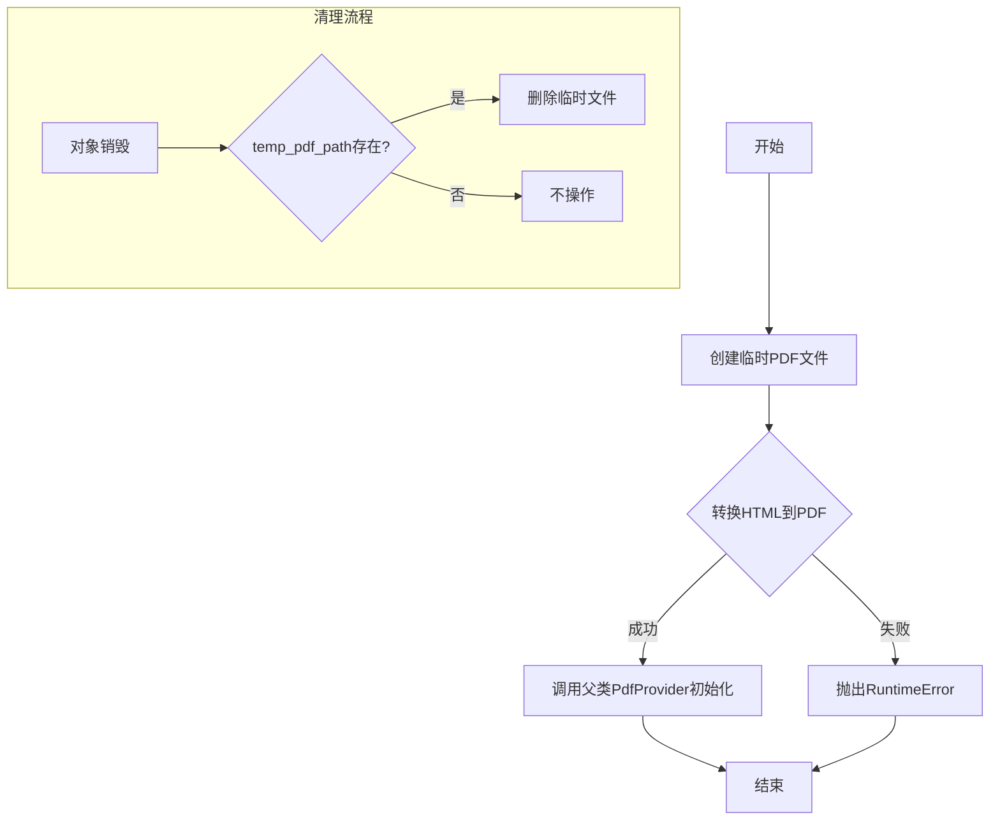
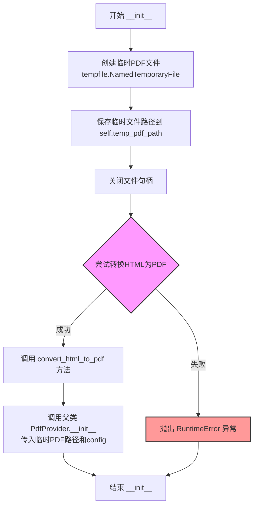
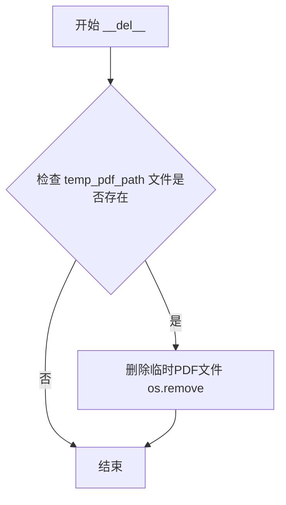
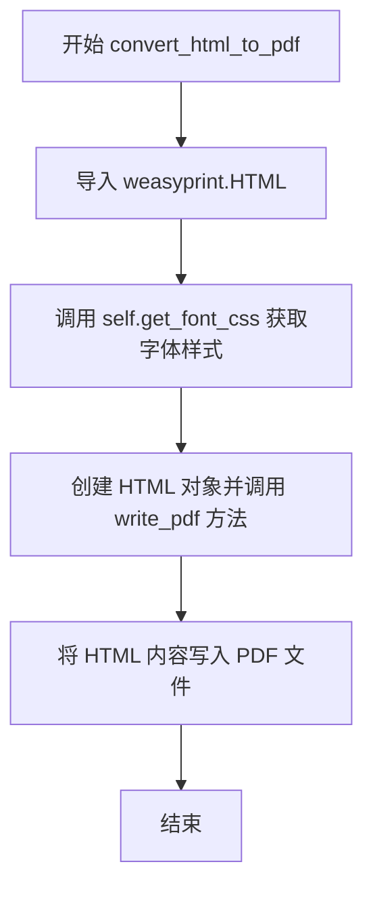

# `marker\marker\providers\html.py` 详细设计文档

这是一个HTML转PDF的提供者类，继承自PdfProvider，通过WeasyPrint库将HTML文件转换为PDF，并在转换完成后自动清理临时文件。

## 整体流程



## 类结构

```
PdfProvider (基类)
└── HTMLProvider (子类)
```

## 全局变量及字段


### `HTMLProvider.temp_pdf_path`
    
临时PDF文件的路径

类型：`str`
    
    

## 全局函数及方法


### `HTMLProvider.__init__`

初始化HTMLProvider类，创建临时PDF文件并将HTML文件转换为PDF格式，然后使用转换后的PDF路径调用父类PdfProvider进行初始化。

参数：

- `filepath`：`str`，要转换的HTML文件路径
- `config`：`any`，配置参数，可选

返回值：`None`，无返回值

#### 流程图



#### 带注释源码

```python
def __init__(self, filepath: str, config=None):
    # 创建一个临时PDF文件，delete=False表示程序退出时不自动删除
    temp_pdf = tempfile.NamedTemporaryFile(delete=False, suffix=".pdf")
    # 将临时PDF文件的路径保存为实例属性，供后续使用
    self.temp_pdf_path = temp_pdf.name
    # 关闭文件句柄，因为weasyprint需要自己打开文件进行写入
    temp_pdf.close()

    # 将HTML文件转换为PDF格式
    try:
        # 调用convert_html_to_pdf方法执行转换
        self.convert_html_to_pdf(filepath)
    except Exception as e:
        # 如果转换过程中发生任何异常，抛出RuntimeError并附带原始错误信息
        raise RuntimeError(f"Failed to convert {filepath} to PDF: {e}")

    # 使用转换后的临时PDF文件路径初始化父类PdfProvider
    # 这样就可以复用PdfProvider处理PDF的能力
    super().__init__(self.temp_pdf_path, config)
```


### `HTMLProvider.__del__`

析构方法，清理临时PDF文件。当HTMLProvider对象被销毁时自动调用，删除在初始化过程中创建的临时PDF文件，释放磁盘空间。

参数：

- （无参数）

返回值：`None`，无返回值

#### 流程图



#### 带注释源码

```python
def __del__(self):
    """
    析构方法，在对象被销毁时自动调用
    用于清理HTML转PDF过程中生成的临时文件
    """
    # 检查临时PDF文件是否存在
    if os.path.exists(self.temp_pdf_path):
        # 存在则删除临时文件，释放磁盘空间
        os.remove(self.temp_pdf_path)
```


### `HTMLProvider.convert_html_to_pdf`

使用 WeasyPrint 库将 HTML 文件转换为 PDF 文件，方法内部首先获取字体 CSS 样式表，然后读取指定路径的 HTML 文件并将其转换为 PDF 格式输出到临时 PDF 文件中。

参数：

- `filepath`：`str`，HTML 文件路径，要转换的 HTML 文件的完整路径

返回值：`None`，无返回值

#### 流程图



#### 带注释源码

```python
def convert_html_to_pdf(self, filepath: str):
    """
    将 HTML 文件转换为 PDF 文件
    
    参数:
        filepath: str, HTML 文件路径
    返回:
        None
    """
    # 从 weasyprint 导入 HTML 类，用于解析和转换 HTML
    from weasyprint import HTML

    # 获取字体 CSS 样式表，用于保持 PDF 中的字体一致性
    font_css = self.get_font_css()
    
    # 创建 HTML 对象，指定文件名和编码为 UTF-8
    # 调用 write_pdf 方法将 HTML 写入 PDF 文件
    # 使用 stylesheets 参数应用自定义的字体样式
    HTML(filename=filepath, encoding="utf-8").write_pdf(
        self.temp_pdf_path,      # 输出 PDF 文件路径（临时文件）
        stylesheets=[font_css]   # 应用字体样式表
    )
```

## 关键组件


### HTML转PDF转换器

使用WeasyPrint库将HTML文件转换为PDF格式，支持UTF-8编码和自定义CSS样式表。

### 临时文件管理

通过tempfile.NamedTemporaryFile创建临时PDF文件，并在对象销毁时自动清理，确保无磁盘泄漏。

### 字体CSS加载

调用get_font_css()方法获取字体样式表，并将其应用于PDF生成过程。

### 异常处理机制

在HTML转PDF失败时抛出RuntimeError，携带原始异常信息，便于调试和错误追踪。

### 类初始化流程

1. 创建临时PDF文件
2. 执行HTML到PDF转换
3. 调用父类PdfProvider初始化
4. 注册析构函数清理临时文件


## 问题及建议


### 已知问题

- **资源泄露风险**：如果 `convert_html_to_pdf` 抛出异常，临时 PDF 文件不会被清理，导致磁盘空间浪费
- **异常处理掩盖真实错误**：`__init__` 中使用宽泛的 `except Exception` 捕获并重新抛出，丢失原始异常类型信息，不利于调试
- **`__del__` 方法风险**：在 Python 解释器关闭期间，`__del__` 中的文件操作可能失败；且如果 `super().__init__` 失败，临时文件同样无法被清理
- **模块级导入位置不当**：`weasyprint` 的导入放在方法内部，虽然延迟加载但每次调用都会执行导入语句，影响性能
- **缺少文件存在性验证**：`convert_html_to_pdf` 未检查输入 `filepath` 是否存在，直接传递给 WeasyPrint 会产生难以追踪的错误

### 优化建议

- 使用上下文管理器或 `try/finally` 块确保临时文件在异常情况下也能被清理
- 考虑添加 `weasyprint` 为可选依赖，在导入失败时提供更友好的错误提示
- 在转换前验证输入文件路径的有效性
- 将 `weasyprint` 导入移至模块顶部或使用缓存机制避免重复导入开销
- 考虑使用更细粒度的异常处理，保留原始异常信息以便调试

## 其它


### 设计目标与约束

本模块的设计目标是将HTML文件转换为PDF格式，并复用现有的PdfProvider处理逻辑。约束包括：1) 仅支持本地文件系统上的HTML文件路径；2) 依赖WeasyPrint作为HTML到PDF的转换引擎；3) 转换过程中需要生成临时PDF文件。

### 错误处理与异常设计

代码中存在两处异常处理：1) convert_html_to_pdf方法内部WeasyPrint可能抛出异常，外层用RuntimeError包装并包含原始错误信息；2) __del__方法中删除临时文件时需先检查文件是否存在以避免异常。异常设计采用向上抛出策略，调用方需处理转换失败的情况。

### 数据流与状态机

数据流如下：1) 初始化时创建临时PDF文件；2) 调用convert_html_to_pdf将HTML文件转换为PDF写入临时文件；3) 将临时文件路径传递给父类PdfProvider初始化；4) 对象销毁时自动删除临时文件。状态转换：创建临时文件 -> 转换HTML到PDF -> 初始化父类 -> 对象销毁清理。

### 外部依赖与接口契约

外部依赖包括：1) marker.providers.pdf.PdfProvider - 父类，提供PDF处理能力；2) weasyprint - HTML到PDF转换库；3) tempfile - Python标准库，用于创建临时文件；4) os - Python标准库，用于文件操作。接口契约：构造函数接受filepath(字符串)和config(可选)参数，返回HTMLProvider实例；filepath必须为有效的本地HTML文件路径。

### 资源管理与生命周期

资源管理采用RAII模式：1) 临时文件在__init__中创建，__del__中销毁；2) 临时文件使用delete=False参数，需手动删除；3) 建议使用with语句或显式调用del确保资源及时释放。注意：__del__在Python中不保证执行，特别是在程序异常退出时。

### 线程安全分析

该类非线程安全：1) 临时文件路径存储在实例属性self.temp_pdf_path；2) 多线程并发使用同一实例可能导致临时文件冲突；3) 建议每个线程或每个转换任务创建独立的HTMLProvider实例。

### 性能特性

性能考虑：1) 每次实例化都会创建新的临时文件；2) WeasyPrint转换HTML到PDF是CPU密集型操作；3) 临时文件IO性能受系统临时目录影响；4) 大文件转换可能消耗较多内存。

### 配置选项

config参数直接传递给父类PdfProvider，具体配置项取决于PdfProvider的实现。convert_html_to_pdf方法调用self.get_font_css()获取字体样式表，该方法继承自父类或需要额外配置。

### 安全考虑

1) 文件路径直接使用未做严格验证，需确保filepath可信；2) 临时文件创建在系统临时目录，存在符号链接攻击风险；3) HTML文件可能包含恶意脚本，WeasyPrint渲染时需注意沙箱隔离。

### 测试建议

测试用例应覆盖：1) 正常HTML文件转换；2) 转换失败时异常抛出；3) 临时文件正确创建和删除；4) 父类接口兼容性；5) 资源泄漏场景。

### 平台兼容性

依赖WeasyPrint，该库在Windows、Linux、macOS上均可运行，但WeasyPrint需要安装GTK+库（在某些Linux发行版上可能需要额外安装）。Python版本需支持类型提示语法，建议Python 3.8+。


    