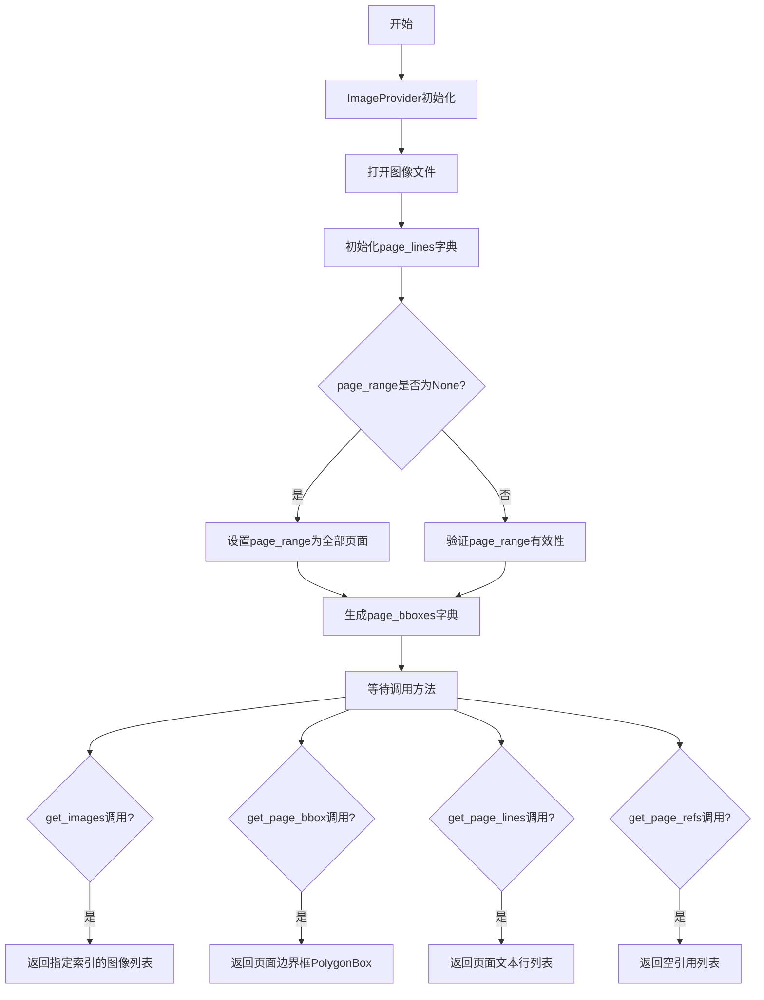
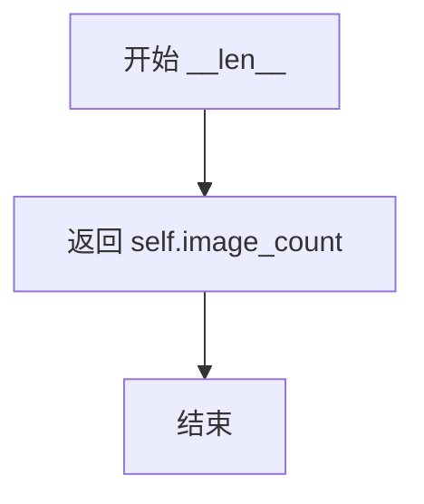
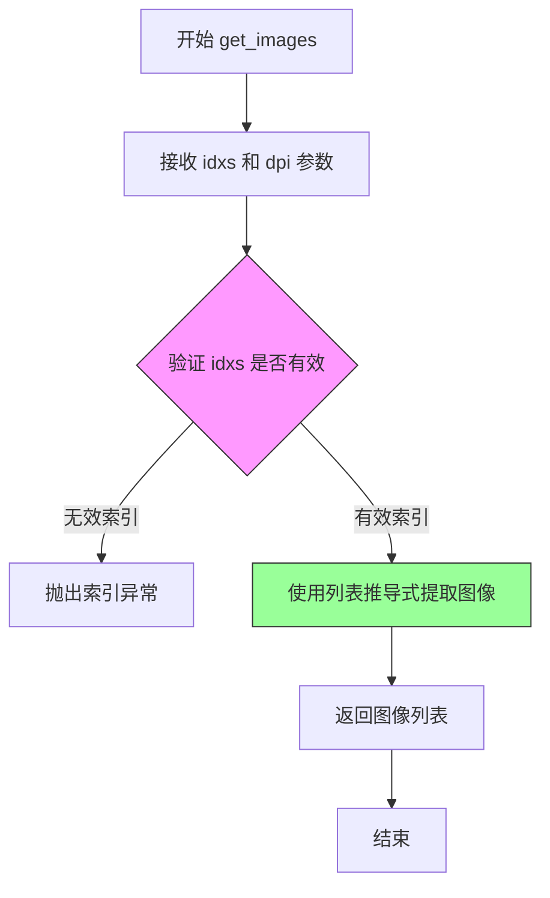

# `marker\marker\providers\image.py` 详细设计文档

这是一个图像文档处理Provider类，用于从图像文件（如扫描版PDF转换的图像）中提取页面信息，包括页面边界框、文本行和引用，支持指定页面范围的处理。

## 整体流程



## 类结构

```
BaseProvider (抽象基类)
└── ImageProvider (图像文档Provider)
```

## 全局变量及字段


### `ImageProvider.page_range`
    
The range of pages to process. Default is None, which will process all pages.

类型：`Annotated[List[int], '页面范围', '默认为None处理所有页面']`
    


### `ImageProvider.image_count`
    
The number of images to process. Default is 1.

类型：`int`
    


### `ImageProvider.images`
    
List of PIL Image objects, initialized in __init__.

类型：`List[Image.Image]`
    


### `ImageProvider.page_lines`
    
Dictionary mapping page indices to lists of Line objects, initialized in __init__.

类型：`ProviderPageLines`
    


### `ImageProvider.page_bboxes`
    
Dictionary mapping page indices to bounding boxes [x0, y0, x1, y1], initialized in __init__.

类型：`Dict[int, List[int]]`
    
    

## 全局函数及方法


### `ImageProvider.__init__`

这是 ImageProvider 类的初始化方法，负责打开图像文件、初始化页面范围、验证页面范围有效性，并计算每个页面的边界框信息。

参数：

- `self`：隐式参数，ImageProvider 实例本身
- `filepath`：`str`，要打开的图像文件路径
- `config`：任意类型，可选配置参数，默认为 None，将传递给父类 BaseProvider

返回值：`None`，该方法为初始化方法，不返回任何值

#### 流程图

```mermaid
flowchart TD
    A[开始 __init__] --> B[调用父类初始化 super().__init__]
    B --> C[使用 PIL.Image.open 打开图像文件]
    C --> D[初始化 self.images 列表]
    D --> E[初始化 self.page_lines 字典]
    E --> F{self.page_range 是否为 None?}
    F -->|是| G[设置 page_range = range(self.image_count)]
    F -->|否| H[跳过此步骤]
    G --> I[断言验证 page_range 有效性]
    H --> I
    I --> J{断言检查通过?}
    J -->|否| K[抛出 AssertionError 异常]
    J -->|是| L[计算并设置 self.page_bboxes 字典]
    L --> M[结束 __init__]
```

#### 带注释源码

```python
def __init__(self, filepath: str, config=None):
    # 调用父类 BaseProvider 的初始化方法
    # 传递文件路径和配置参数
    super().__init__(filepath, config)

    # 使用 PIL 库打开图像文件
    # 将打开的 Image 对象存储在列表中（支持多页图像）
    self.images = [Image.open(filepath)]

    # 初始化页面行数据字典
    # 键为页码索引，值为空列表（用于存储提取的文本行）
    # ProviderPageLines 是类型别名，表示 Dict[int, List[Line]]
    self.page_lines: ProviderPageLines = {i: [] for i in range(self.image_count)}

    # 如果未指定页面处理范围，则默认处理所有页面
    # image_count 初始化为 1，因此默认处理第一页
    if self.page_range is None:
        self.page_range = range(self.image_count)

    # 验证页面范围的有效性
    # 确保最大页码小于总页数，最小页码大于等于 0
    # 注意：此处代码存在逻辑错误，使用了 len(self.doc) 但 ImageProvider 处理的是图像而非 PDF
    assert max(self.page_range) < self.image_count and min(self.page_range) >= 0, (
        f"Invalid page range, values must be between 0 and {len(self.doc) - 1}.  "
        f"Min of provided page range is {min(self.page_range)} and max is {max(self.page_range)}."
    )

    # 计算每个页面的边界框信息
    # 边界框格式为 [x0, y0, x1, y1]，其中 (x0, y0) 为左上角，(x1, y1) 为右下角
    # 从图像尺寸获取宽度和高度
    self.page_bboxes = {
        i: [0, 0, self.images[i].size[0], self.images[i].size[1]]
        for i in self.page_range
    }
```


### `ImageProvider.__len__`

返回图像提供者所管理的图像数量，使得可以使用 Python 内置的 `len()` 函数获取实例中的图像总数。

参数：

- `self`：`ImageProvider`，调用该方法的实例对象本身，用于访问类的实例属性

返回值：`int`，返回 `image_count` 属性的值，表示图像提供者中包含的图像总数

#### 流程图



#### 带注释源码

```
def __len__(self):
    """
    返回图像提供者管理的图像数量。
    
    该方法实现了 Python 的魔术方法，使得可以直接使用 len() 函数
    获取 ImageProvider 实例中的图像数量，与 image_count 属性保持一致。
    
    Returns:
        int: 图像的数量
    """
    return self.image_count
```


### `ImageProvider.get_images`

该方法根据提供的索引列表从预加载的图像列表中检索对应的PIL Image对象。

参数：

- `self`：`ImageProvider`，ImageProvider类的实例本身
- `idxs`：`List[int]`，需要获取的图像索引列表
- `dpi`：`int`，目标图像的DPI（每英寸点数）设置，当前实现中未被使用，保留以供将来扩展

返回值：`List[Image.Image]`，返回与给定索引对应的PIL Image对象列表

#### 流程图



#### 带注释源码

```python
def get_images(self, idxs: List[int], dpi: int) -> List[Image.Image]:
    """
    根据索引列表获取对应的图像对象
    
    参数:
        idxs: 要获取的图像索引列表
        dpi: 图像DPI设置（当前版本未使用）
    
    返回:
        与索引对应的PIL Image对象列表
    """
    # 使用列表推导式从self.images中提取指定索引的图像
    # self.images是在__init__中通过Image.open加载的图像列表
    return [self.images[i] for i in idxs]
```


### `ImageProvider.get_page_bbox`

获取指定索引页面的边界框信息。如果页面存在对应的边界框数据，则将其转换为 `PolygonBox` 对象返回；否则返回 `None`。

参数：

- `self`：`ImageProvider`，ImageProvider 实例本身
- `idx`：`int`，要获取边界框的页面索引

返回值：`PolygonBox | None`，返回页面边界框的 PolygonBox 对象，如果不存在则返回 None

#### 流程图

```mermaid
flowchart TD
    A[开始 get_page_bbox] --> B[获取 self.page_bboxes[idx]]
    B --> C{检查 bbox 是否存在}
    C -->|是| D[调用 PolygonBox.from_bbox 创建 PolygonBox 对象]
    C -->|否| E[返回 None]
    D --> F[返回 PolygonBox 对象]
    E --> G[结束]
    F --> G
```

#### 带注释源码

```python
def get_page_bbox(self, idx: int) -> PolygonBox | None:
    """
    获取指定页面的边界框
    
    参数:
        idx: 页面索引
        
    返回:
        PolygonBox对象，如果页面不存在边界框则返回None
    """
    # 从 page_bboxes 字典中获取索引为 idx 的边界框数据
    # page_bboxes 初始化时存储了每个页面的图像尺寸信息
    # 格式为 [x0, y0, x1, y1]，即 [左, 上, 右, 下]
    bbox = self.page_bboxes[idx]
    
    # 检查 bbox 是否存在（非空）
    # 注意：这里的条件判断有问题，None 会进入 else 分支
    # 但如果 bbox 是空列表 []，也会被判定为 False
    if bbox:
        # 使用 PolygonBox 类的 from_bbox 工厂方法
        # 将普通的边界框列表转换为 PolygonBox 对象
        return PolygonBox.from_bbox(bbox)
    
    # 如果 bbox 不存在或为空，隐式返回 None
```


### `ImageProvider.get_page_lines`

该方法根据传入的页码索引，从 `page_lines` 字典中检索对应的文本行列表并返回。这是一个简单的字典查询操作，用于获取指定页面的 OCR 或文本识别结果。

参数：

- `self`：`ImageProvider`，类的实例本身（隐式参数）
- `idx`：`int`，页码索引，用于定位要获取的页面

返回值：`List[Line]`，返回指定页码对应的行对象列表，如果没有内容则返回空列表

#### 流程图

```mermaid
flowchart TD
    A[开始 get_page_lines] --> B[接收 idx 参数]
    B --> C{验证 idx 是否在有效范围内}
    C -->|是| D[从 page_lines 字典中获取索引为 idx 的值]
    D --> E[返回 List[Line] 行列表]
    C -->|否| F[抛出 KeyError 异常]
    E --> G[结束]
    F --> G
```

#### 带注释源码

```python
def get_page_lines(self, idx: int) -> List[Line]:
    """
    根据页码索引获取对应的行列表。
    
    Args:
        idx: int, 页码索引，0-based 索引
        
    Returns:
        List[Line]: 指定页码对应的行对象列表，如果该页没有内容则返回空列表
    """
    # 直接从 page_lines 字典中通过索引获取行列表
    # page_lines 是一个字典，键为页码索引，值为该页的 Line 对象列表
    # 初始化时默认为空列表: {i: [] for i in range(self.image_count)}
    return self.page_lines[idx]
```


### ImageProvider.get_page_refs

该方法用于获取指定页码的引用列表。在当前实现中，ImageProvider类主要处理图像文件而非PDF文档，因此该方法返回一个空列表，表示图像页面不存在引用信息。

参数：

- `self`：ImageProvider，隐式参数，指向当前类的实例
- `idx`：`int`，要获取引用的页码索引

返回值：`List[Reference]`，引用对象列表，当前实现始终返回空列表

#### 流程图


#### 带注释源码

```python
def get_page_refs(self, idx: int) -> List[Reference]:
    """
    获取指定页码的引用列表。
    
    参数:
        idx: int - 页码索引，用于指定要获取引用的页面
        
    返回值:
        List[Reference] - 引用对象列表
    """
    # 由于ImageProvider处理的是图像文件而非PDF文档
    # 图像页面不包含文本引用信息，因此返回空列表
    return []
```

## 关键组件


### 图像文件加载与初始化组件

负责在初始化时打开图像文件，将图像加载到内存中。通过 PIL Image.open() 读取文件，并构建页面范围和边界框索引。

### 页面范围管理组件

管理要处理的页面范围，支持指定页面范围进行部分处理。包含范围验证逻辑，确保页面索引在有效范围内。

### 页面边界框索引组件

为每个页面建立边界框索引，存储页面的坐标信息。支持通过页面索引快速获取对应页面的空间范围。

### 页面行数据存储组件

存储从页面提取的文本行数据，以页面索引为键建立映射关系。提供页面行数据的存取接口。

### Provider 接口实现组件

实现 BaseProvider 抽象基类定义的接口契约，包括获取图像、边界框、页面行和引用等方法。保证与 Marker 框架其他组件的兼容性。

### 图像索引访问组件

提供基于索引列表的图像批量获取能力，支持按 DPI 参数获取图像。返回图像对象列表供下游处理使用。


## 问题及建议


### 已知问题

- **断言错误消息引用了不存在的属性**: 断言中使用了`len(self.doc)`，但`ImageProvider`处理的是图像而非PDF文档，没有`self.doc`属性，应使用`self.image_count`。
- **page_lines初始化后从未被填充**: `self.page_lines`被初始化为空列表，但没有任何方法或逻辑向其中填充数据，导致`get_page_lines`始终返回空列表，功能未实现。
- **get_page_refs方法返回空列表**: 该方法直接返回空列表，未实现任何逻辑，失去了提取图像中文本引用的能力。
- **image_count硬编码为1**: 只能处理单页图像，限制了多页图像文件的支持，缺乏灵活性。
- **get_page_bbox的冗余检查**: 使用`if bbox:`判断非空，但对于有效的边界框`[0, 0, width, height]`始终为真，此检查无实际意义且可能产生误判。
- **config参数未使用**: `__init__`方法接收`config`参数但从未使用，违反了参数设计意图。
- **异常处理缺失**: 没有处理图像文件不存在、格式错误或损坏等异常情况，可能导致程序崩溃。
- **类型注解与实际赋值不一致**: `page_range`类型注解为`List[int]`，但默认值为`None`，运行时可能被赋值为`range`对象，存在类型不匹配。

### 优化建议

- 修复断言错误消息，将`len(self.doc)`改为`self.image_count`。
- 实现`page_lines`的填充逻辑，或将其从类中移除以避免误导。
- 实现`get_page_refs`方法以支持引用提取功能。
- 允许通过参数或配置文件动态设置`image_count`，或从图像文件中自动检测页数。
- 移除`get_page_bbox`中冗余的if判断，或改为检查索引是否在有效范围内。
- 使用传入的`config`参数配置provider行为，如DPI设置、输出格式等。
- 添加try-except捕获`Image.open`可能的异常，并提供清晰的错误信息。
- 统一`page_range`的类型处理，确保类型注解与实际使用一致。

## 其它


### 设计目标与约束

ImageProvider类的主要设计目标是将图像文件（如PNG、JPG等）作为页面来源进行处理，使其能够与PDF处理流程兼容。该类实现了BaseProvider接口，提供了统一的页面、图像和引用获取方法。设计约束包括：只支持单页图像文件（image_count固定为1），不支持多页图像，不提供页面文本提取功能（get_page_refs返回空列表）。

### 错误处理与异常设计

代码中使用了assert语句验证page_range的有效性，当范围超出时会抛出AssertionError并附带详细的错误信息。Image.open可能抛出FileNotFoundError（文件不存在）、IOError（图像格式错误）等异常，这些异常由调用者处理。get_page_bbox方法在索引超出范围时可能抛出KeyError。建议将assert改为显式的参数验证并抛出ValueError，以提供更友好的错误信息。

### 数据流与状态机

ImageProvider的数据流如下：初始化时加载图像文件 → 构建page_bboxes字典存储每页边界框 → 提供只读访问接口。状态机相对简单，主要状态包括：初始化完成（图像已加载）、就绪（可查询页面信息）、查询中（get_page_bbox/get_page_lines被调用）。由于图像数量固定为1，状态转换较简单。

### 外部依赖与接口契约

主要外部依赖包括：PIL.Image用于图像加载和尺寸获取；marker.providers.ProviderPageLines和BaseProvider定义接口契约；marker.schema.polygon.PolygonBox用于边界框表示；marker.schema.text.Line表示文本行；pdftext.schema.Reference表示引用。BaseProvider要求子类实现__len__、get_page_bbox、get_page_lines、get_page_refs等方法，ImageProvider满足了这些接口要求。

### 性能考虑

图像在__init__中被一次性加载到内存中，如果处理大尺寸图像可能占用较多内存。建议：如果图像文件较大，考虑延迟加载或使用流式处理。page_bboxes字典在初始化时预计算，对于只查询部分页面的场景有一定优化空间。get_images方法使用列表推导式，效率较高。

### 安全性考虑

代码直接使用Image.open打开文件，存在路径遍历风险——如果filepath由用户输入，可能导致任意文件读取。建议在生产环境中对filepath进行安全验证，检查文件类型和大小限制。另外，该类未实现close方法，可能导致文件句柄未正确释放。

### 配置管理

通过config参数接收配置，该参数直接传递给父类BaseProvider。page_range可以通过类字段annotation指定默认值。config的具体结构取决于BaseProvider的实现，当前代码对config的使用有限。

### 资源管理

图像资源在__init__中通过Image.open打开并存储在self.images列表中，但未实现__del__或close方法来显式释放资源。在长时间运行的进程中可能导致文件句柄泄漏。建议添加上下文管理器支持（实现__enter__和__exit__方法）或提供显式的close方法。

### 版本兼容性

代码使用了Python 3.10+的联合类型语法（PolygonBox | None），需要Python 3.10及以上版本。依赖的PIL版本需要支持Image.open，marker和pdftext库版本需要兼容。使用from __future__ import annotations可提高类型注解的向前兼容性。

### 测试策略

建议的测试用例包括：测试正常初始化（有效图像文件）、测试page_range边界验证、测试get_page_bbox返回正确的PolygonBox、测试get_page_lines返回空列表、测试get_page_refs返回空列表、测试无效索引的异常处理、测试大图像文件的内存使用。Mock PIL.Image对象可用于单元测试。

    