# `marker\marker\providers\pdf.py` 详细设计文档

这是一个PDF文件处理提供程序，负责读取PDF文档、提取文本内容、检测页面质量、渲染页面图像，并支持OCR质量评估。

## 整体流程

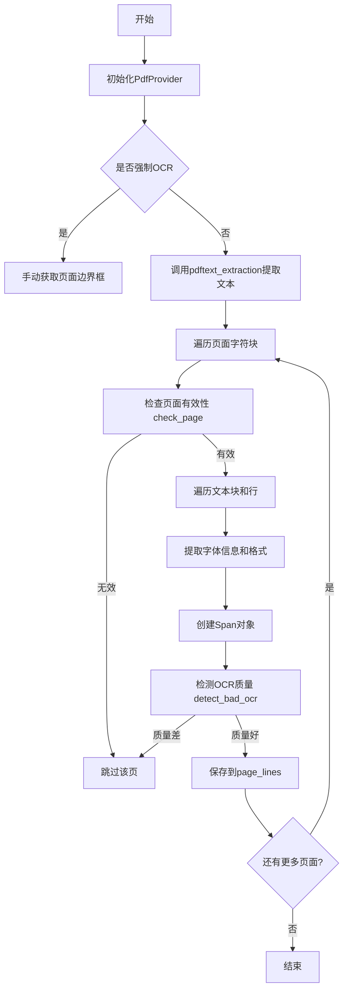

## 类结构

```
BaseProvider (抽象基类)
└── PdfProvider (PDF提供程序)
```

## 全局变量及字段


### `logging.getLogger('pypdfium2')`
    
pypdfium2日志记录器，用于抑制该库的警告信息

类型：`logging.Logger`
    


### `SpanClass`
    
从schema注册表获取的Span块类，用于表示PDF中的文本片段

类型：`type[Span]`
    


### `LineClass`
    
从schema注册表获取的Line块类，用于表示PDF中的文本行

类型：`type[Line]`
    


### `CharClass`
    
从schema注册表获取的Char块类，用于表示PDF中的单个字符

类型：`type[Char]`
    


### `PdfProvider.page_range`
    
要处理的页面范围，默认为None表示处理所有页面

类型：`Annotated[List[int], "要处理的页面范围"]`
    


### `PdfProvider.pdftext_workers`
    
pdftext文本提取的工作线程数，默认为4

类型：`Annotated[int, "pdftext工作线程数"]`
    


### `PdfProvider.flatten_pdf`
    
是否展平PDF表单结构，默认为True

类型：`Annotated[bool, "是否展平PDF结构"]`
    


### `PdfProvider.force_ocr`
    
是否强制对整个文档进行OCR识别，默认为False

类型：`Annotated[bool, "是否强制OCR"]`
    


### `PdfProvider.ocr_invalid_chars`
    
OCR识别中视为无效的字符元组

类型：`Annotated[tuple, "OCR无效字符"]`
    


### `PdfProvider.ocr_space_threshold`
    
检测坏OCR的空格与非空格字符比率阈值，默认为0.7

类型：`Annotated[float, "空格比率阈值"]`
    


### `PdfProvider.ocr_newline_threshold`
    
检测坏OCR的换行与非换行字符比率阈值，默认为0.6

类型：`Annotated[float, "换行比率阈值"]`
    


### `PdfProvider.ocr_alphanum_threshold`
    
判断文本是否为字母数字的最小比率阈值，默认为0.3

类型：`Annotated[float, "字母数字比率阈值"]`
    


### `PdfProvider.image_threshold`
    
图像覆盖页面面积的最小比率，超过则跳过该页面，默认为0.65

类型：`Annotated[float, "图像覆盖阈值"]`
    


### `PdfProvider.strip_existing_ocr`
    
是否剥离PDF中现有的OCR文本，默认为False

类型：`Annotated[bool, "是否剥离现有OCR"]`
    


### `PdfProvider.disable_links`
    
是否禁用在文本提取中包含链接，默认为False

类型：`Annotated[bool, "是否禁用链接"]`
    


### `PdfProvider.keep_chars`
    
是否在输出中保留字符级详细信息，默认为False

类型：`Annotated[bool, "是否保留字符级信息"]`
    


### `PdfProvider.filepath`
    
PDF文件的路径

类型：`str`
    


### `PdfProvider.page_count`
    
PDF文档的总页数

类型：`int`
    


### `PdfProvider.page_lines`
    
存储每页提取的文本行数据

类型：`ProviderPageLines`
    


### `PdfProvider.page_refs`
    
存储每页的引用关系

类型：`Dict[int, List[Reference]]`
    


### `PdfProvider.page_bboxes`
    
存储每页的边界框信息

类型：`dict`
    
    

## 全局函数及方法


### `PdfProvider.get_doc`

该方法是一个上下文管理器（context manager），用于安全地打开和关闭 PDF 文档，确保在使用完毕后正确释放资源。它创建一个 `PdfDocument` 对象，如果启用了 `flatten_pdf` 选项则初始化表单，并在上下文退出时自动关闭文档。

参数：

- 无额外参数（`self` 为隐式参数）

返回值：`PdfDocument`，从 pypdfium2 库返回的 PDF 文档对象，可在 with 块内使用

#### 流程图

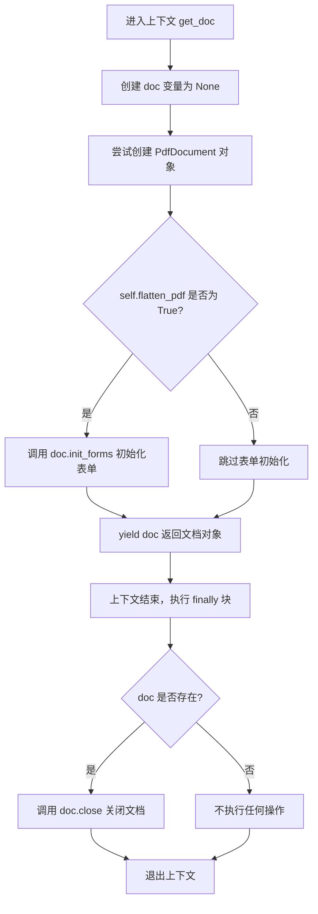

#### 带注释源码

```python
@contextlib.contextmanager
def get_doc(self):
    """
    上下文管理器：获取 PDF 文档对象并在结束时自动关闭
    
    使用方式：
        with self.get_doc() as doc:
            # 使用 doc 进行操作
        # 自动关闭文档
    """
    doc = None  # 初始化文档对象为 None
    try:
        # 使用 pypdfium2 打开 PDF 文件
        doc = pdfium.PdfDocument(self.filepath)

        # 必须先于获取页面之前在父 PDF 上调用，以确保正确渲染
        if self.flatten_pdf:
            # 扁平化 PDF 表单（将表单字段转换为普通内容）
            doc.init_forms()

        # yield 会将 doc 对象返回给调用者
        yield doc
    finally:
        # finally 块确保无论是否发生异常都会执行清理操作
        if doc:
            # 关闭文档以释放系统资源
            doc.close()
```


### `fix_text`

该函数是从 `ftfy` 库导入的外部函数，用于修复损坏的 Unicode 文本，将编码错误的字符序列恢复为正确的 Unicode 文本。在本项目中，它被用于处理从 PDF 提取的文本，清除其中的乱码和编码问题。

参数：

-  `text`：`str`，需要修复的文本字符串

返回值：`str`，修复后的文本字符串

#### 流程图

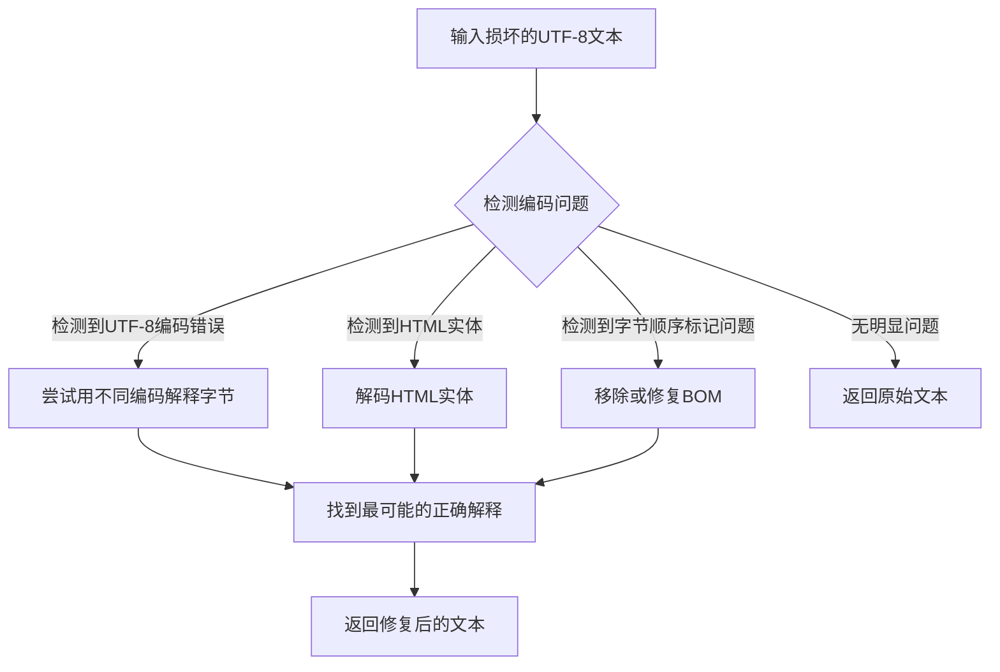

#### 带注释源码

```python
# 在 PdfProvider.pdftext_extraction 方法中使用
# from ftfy import fix_text  # 从 ftfy 库导入

# 处理每个 span 的文本
for span in line["spans"]:
    if not span["text"]:
        continue
    
    # ... 获取字体格式等元信息 ...
    
    # 核心用法：修复文本中的 Unicode 编码问题
    # fix_text 会自动检测并修复常见的编码错误，如：
    # - UTF-8 被误解释为 Latin-1
    # - HTML 实体未解码
    # - 字节顺序标记（BOM）问题
    # - 异常的转义序列
    text = self.normalize_spaces(fix_text(span["text"]))
    
    # 如果是上标或下标，去除首尾空格
    if superscript or subscript:
        text = text.strip()
    
    # 创建 Span 对象
    spans.append(
        SpanClass(
            polygon=polygon,
            text=text,
            # ... 其他参数 ...
        )
    )
```

---

### 补充信息

#### 关键组件信息

| 组件名称 | 一句话描述 |
|---------|-----------|
| `ftfy.fix_text` | 修复损坏的 Unicode 文本的外部库函数 |

#### 潜在技术债务

1. **外部依赖风险**：`fix_text` 是外部库函数，其行为可能随版本更新而变化，建议锁定具体版本号
2. **错误隐藏**：该函数可能隐藏某些文本问题，建议在调试模式下记录原始文本和修复后的差异

#### 其它项目

- **设计目标**：确保从 PDF 提取的文本是正确的 Unicode 格式
- **错误处理**：如果 `fix_text` 无法修复文本，会返回原始文本（具体行为取决于 ftfy 版本）
- **外部依赖**：`ftfy` 库，需要通过 `pip install ftfy` 安装


### dictionary_output

从PDF文件中提取文本内容的核心函数，接收文件路径和处理参数，返回包含页面、文本块、字符和几何信息的结构化数据。

参数：

- `filepath`：`str`，要处理的PDF文件的路径
- `page_range`：`List[int]`，指定要处理的页面范围
- `keep_chars`：`bool`，是否保留字符级别的详细信息
- `workers`：`int`，用于处理的worker线程数量
- `flatten_pdf`：`bool`，是否扁平化PDF结构
- `quote_loosebox`：`bool`，是否引用松散文本框
- `disable_links`：`bool`，是否禁用链接提取

返回值：`List[Dict]`，返回包含每个页面文本信息的字典列表，每个字典包含页面ID、宽度、高度、文本块、行、span、字符等详细信息

#### 流程图

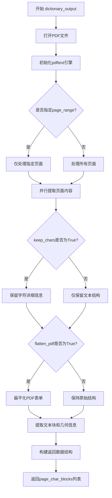

#### 带注释源码

```python
# 注意：此函数定义不在当前代码文件中
# 它是从 pdftext.extraction 库导入的外部函数
# 以下是其在 PdfProvider 类中的调用方式：

page_char_blocks = dictionary_output(
    self.filepath,                    # PDF文件路径
    page_range=self.page_range,        # 要处理的页面范围列表
    keep_chars=self.keep_chars,        # 是否保留字符级详细信息
    workers=self.pdftext_workers,     # 并行处理的worker数量
    flatten_pdf=self.flatten_pdf,     # 是否扁平化PDF表单
    quote_loosebox=False,              # 是否引用松散文本框
    disable_links=self.disable_links, # 是否禁用链接提取
)

# 返回值结构示例：
# [
#     {
#         "page": 0,
#         "width": 612.0,
#         "height": 792.0,
#         "blocks": [
#             {
#                 "type": "text",
#                 "bbox": [x0, y0, x1, y1],
#                 "lines": [
#                     {
#                         "bbox": [x0, y0, x1, y1],
#                         "spans": [
#                             {
#                                 "text": "Hello World",
#                                 "bbox": [x0, y0, x1, y1],
#                                 "font": {
#                                     "name": "Arial",
#                                     "flags": 0,
#                                     "weight": 400,
#                                     "size": 12.0
#                                 },
#                                 "chars": [
#                                     {"char": "H", "bbox": [...], "char_idx": 0},
#                                     ...
#                                 ]
#                             }
#                         ]
#                     }
#                 ]
#             }
#         ],
#         "refs": [...]  # 页面中的引用列表
#     },
#     ...
# ]
```


### `flatten_pdf_page`

将 PDF 页面中的表单字段（form fields）扁平化为普通内容，以便正确渲染。

参数：

- `page`：`pdfium.PdfDocument` 的页面对象（`pdfium.PdfPage`），需要被扁平化的 PDF 页面对象

返回值：`None`，该函数直接修改页面对象，无返回值

#### 流程图

```mermaid
flowchart TD
    A[开始] --> B{flatten_page 参数为 True?}
    B -->|是| C[调用 flatten_pdf_page 将页面表单字段扁平化]
    C --> D[重新获取页面对象 page = pdf[idx]]
    B -->|否| E[跳过扁平化]
    D --> F[调用 page.render 渲染页面]
    E --> F
    F --> G[转换为 RGB 图像]
    G --> H[返回图像对象]
```

#### 带注释源码

```python
# 从 pdftext.pdf.utils 模块导入 flatten 函数，并重命名为 flatten_pdf_page
from pdftext.pdf.utils import flatten as flatten_pdf_page

# 在 PdfProvider 类中的 _render_image 静态方法中使用
@staticmethod
def _render_image(
    pdf: pdfium.PdfDocument, idx: int, dpi: int, flatten_page: bool
) -> Image.Image:
    page = pdf[idx]  # 获取指定索引的 PDF 页面
    if flatten_page:
        # 调用 flatten_pdf_page 扁平化页面中的表单字段
        # 这样可以移除表单的交互性，使其成为普通渲染内容
        flatten_pdf_page(page)
        # 扁平化后需要重新获取页面对象以获取更新后的内容
        page = pdf[idx]
    # 渲染页面为图像，scale 将 DPI 转换为缩放因子
    image = page.render(scale=dpi / 72, draw_annots=False).to_pil()
    # 将图像转换为 RGB 模式
    image = image.convert("RGB")
    return image
```


### `get_block_class`

根据代码分析，`get_block_class` 是一个从 `marker.schema.registry` 模块导入的注册表函数，用于根据 `BlockTypes` 枚举值动态返回对应的类类型（Span、Line 或 Char）。它在 `PdfProvider.pdftext_extraction` 方法中被调用，用于实例化文本结构化对象。

#### 参数

- `block_type`：`BlockTypes`，一个枚举类型，指定要获取的块类类型（如 `BlockTypes.Span`、`BlockTypes.Line`、`BlockTypes.Char`）

#### 返回值

- `type`，返回与给定 `BlockTypes` 对应的类类型，例如 `Span`、`Line` 或 `Char` 类

#### 流程图

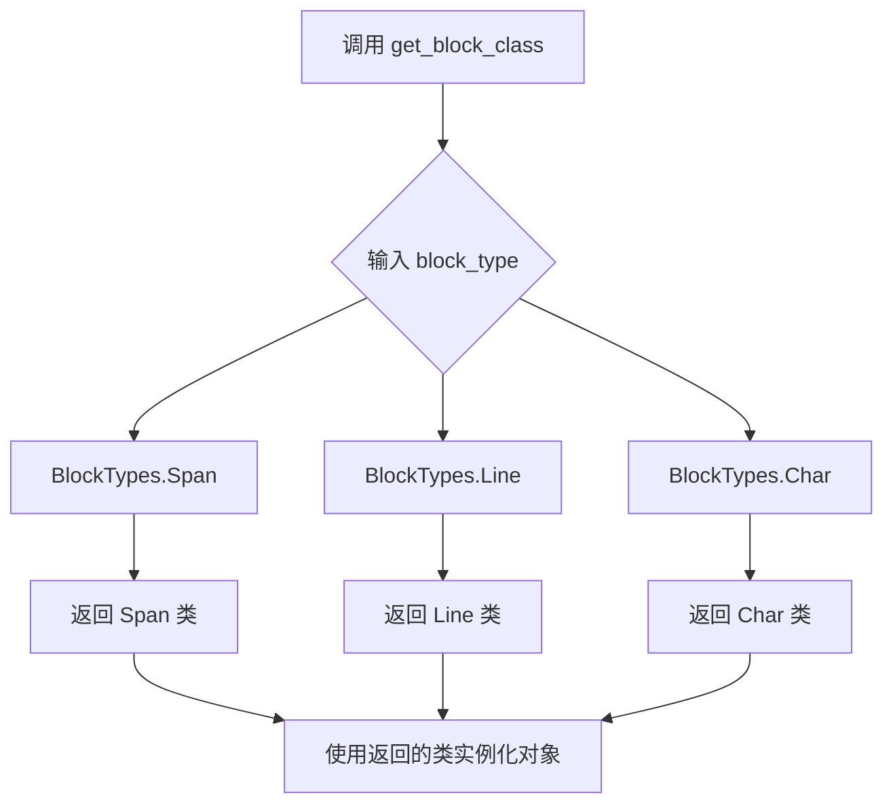

#### 带注释源码

```python
# 该函数定义在 marker.schema.registry 模块中
# 从代码中的使用方式来推断其实现逻辑：

# 在 PdfProvider.pdftext_extraction 方法中的调用示例：
SpanClass: Span = get_block_class(BlockTypes.Span)  # 获取 Span 类
LineClass: Line = get_block_class(BlockTypes.Line)   # 获取 Line 类
CharClass: Char = get_block_class(BlockTypes.Char)   # 获取 Char 类

# 后续使用返回的类来实例化对象：
spans.append(
    SpanClass(
        polygon=polygon,
        text=text,
        font=font_name,
        font_weight=font_weight,
        font_size=font_size,
        minimum_position=span["char_start_idx"],
        maximum_position=span["char_end_idx"],
        formats=list(font_formats),
        page_id=page_id,
        text_extraction_method="pdftext",
        url=span.get("url"),
        has_superscript=superscript,
        has_subscript=subscript,
    )
)
```


### `alphanum_ratio`

该函数用于计算文本中字母数字字符（alphanumeric characters）的比例，通常用于检测OCR识别质量或文本是否混乱（garbled）。

参数：
- `text`：`str`，需要进行字母数字字符比例计算的文本

返回值：`float`，返回字母数字字符在非空格字符中的比例（0.0 到 1.0 之间的浮点数）

#### 流程图

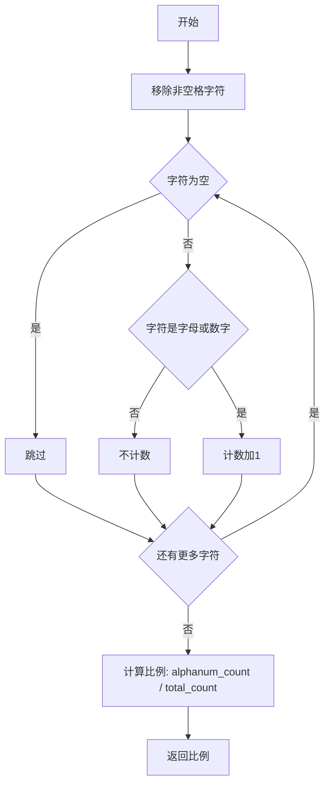

#### 带注释源码

```
# 注意：该函数定义在 marker/providers/utils.py 中，以下为推断的实现
def alphanum_ratio(text: str) -> float:
    """
    计算文本中字母数字字符与非字母数字字符的比例。
    
    参数:
        text: 输入字符串
        
    返回值:
        字母数字字符在非空格字符中的比例 (0.0 - 1.0)
    """
    # 移除非空格字符
    non_space_chars = [c for c in text if not c.isspace()]
    
    if len(non_space_chars) == 0:
        return 0.0
    
    # 计算字母数字字符数量
    alphanum_count = sum(1 for c in non_space_chars if c.isalnum())
    
    # 返回比例
    return alphanum_count / len(non_space_chars)
```

---

**注意**：根据代码中的导入语句 `from marker.providers.utils import alphanum_ratio`，该函数的实际实现位于 `marker/providers/utils.py` 文件中。从代码中的调用上下文 `if alphanum_ratio(text) < self.ocr_alphanum_threshold:` 可以看出，该函数接收一个字符串参数并返回一个用于与阈值比较的浮点数值。


### `PdfProvider.__init__`

这是 `PdfProvider` 类的构造函数，用于初始化 PDF 文件提供者。它接收文件路径和可选配置，调用父类构造函数，打开 PDF 文档，获取页面数量，初始化页面行和引用字典，设置页面处理范围，并根据是否强制 OCR 来决定是使用 pdftext 提取文本还是手动获取页面边界框。

参数：

- `filepath`：`str`，PDF 文件的路径
- `config`：可选，配置对象，传递给父类 `BaseProvider` 的配置参数，默认为 `None`

返回值：`None`（构造函数无显式返回值）

#### 流程图

```mermaid
flowchart TD
    A[开始 __init__] --> B[调用父类构造函数 super().__init__]
    B --> C[保存 filepath 到实例属性]
    D[打开 PDF 文档 get_doc] --> E[获取文档总页数]
    E --> F[初始化 page_lines 字典]
    F --> G[初始化 page_refs 字典]
    G --> H{page_range 是否为 None?}
    H -->|是| I[设置 page_range 为完整页面范围]
    H -->|否| J[使用已设置的 page_range]
    I --> K{force_ocr 是否为 True?}
    J --> K
    K -->|是| L[手动获取每个页面的边界框]
    K -->|否| M[调用 pdftext_extraction 提取文本]
    L --> N[初始化完成]
    M --> N
    
    K -.->|断言| O[验证 page_range 有效性]
    O -->|失败| P[抛出 AssertionError]
    O -->|成功| K
```

#### 带注释源码

```python
def __init__(self, filepath: str, config=None):
    # 调用父类 BaseProvider 的构造函数，传递文件路径和配置
    # 父类会进行一些基础初始化工作
    super().__init__(filepath, config)

    # 将传入的文件路径保存为实例属性，供后续方法使用
    self.filepath = filepath

    # 使用上下文管理器打开 PDF 文档
    # get_doc 是一个生成器方法，返回 pdfium.PdfDocument 对象
    with self.get_doc() as doc:
        # 获取 PDF 文档的总页数
        self.page_count = len(doc)
        
        # 初始化页面行字典，键为页码索引，值为空列表
        # ProviderPageLines 类型为 Dict[int, List[ProviderOutput]]
        self.page_lines: ProviderPageLines = {i: [] for i in range(len(doc))}
        
        # 初始化页面引用字典，键为页码索引，值为空引用列表
        # 用于存储 PDF 中的内部链接和交叉引用
        self.page_refs: Dict[int, List[Reference]] = {
            i: [] for i in range(len(doc))
        }

        # 如果未指定页面范围，则处理所有页面
        if self.page_range is None:
            self.page_range = range(len(doc))

        # 断言验证页面范围的合法性
        # 页面范围必须在 0 到 总页数-1 之间
        assert max(self.page_range) < len(doc) and min(self.page_range) >= 0, (
            f"Invalid page range, values must be between 0 and {len(doc) - 1}.  "
            f"Min of provided page range is {min(self.page_range)} and max is {max(self.page_range)}."
        )

        # 根据 force_ocr 标志决定文本提取策略
        if self.force_ocr:
            # 强制 OCR 模式：手动从 PDF 获取每个页面的边界框
            # 因为 pdftext 无法在 OCR 模式下获取准确的边界框信息
            self.page_bboxes = {i: doc[i].get_bbox() for i in self.page_range}
        else:
            # 正常模式：使用 pdftext 库进行文本提取
            # 这是更高效且准确的文本提取方式
            self.page_lines = self.pdftext_extraction(doc)
```


### `PdfProvider.get_doc`

这是一个上下文管理器方法，用于打开 PDF 文档并初始化表单（如果启用），确保文档在使用后正确关闭。

参数：

- 该方法无显式参数（隐式接收 `self`）

返回值：`pdfium.PdfDocument`，PDF 文档对象，供调用者使用

#### 流程图

```mermaid
flowchart TD
    A[开始 get_doc] --> B[doc = None]
    B --> C[创建 PdfDocument 对象: doc = pdfium.PdfDocument(self.filepath)]
    C --> D{self.flatten_pdf == True?}
    D -->|是| E[调用 doc.init_forms 初始化表单]
    D -->|否| F[跳过表单初始化]
    E --> G[yield doc 返回文档对象给调用者]
    F --> G
    G --> H[退出上下文管理器 - 到达 with 块末尾]
    H --> I{with 块执行期间是否产生异常?}
    I -->|是| J[进入 finally 块]
    I -->|否| J
    J --> K{doc is not None?}
    K -->|是| L[调用 doc.close 关闭文档释放资源]
    K -->|否| M[结束]
    L --> M
```

#### 带注释源码

```python
@contextlib.contextmanager
def get_doc(self):
    """
    上下文管理器：获取 PDF 文档对象
    - 在入口点创建 PdfDocument
    - 如果启用 flatten_pdf 则初始化表单
    - yield 返回文档对象供调用者使用
    - 退出时确保关闭文档释放资源
    """
    doc = None
    try:
        # 使用 pypdfium2 打开 PDF 文件创建文档对象
        doc = pdfium.PdfDocument(self.filepath)

        # 必须在获取页面之前调用，以确保正确渲染
        # 扁平化 PDF 表单，将表单字段转换为普通内容
        if self.flatten_pdf:
            doc.init_forms()

        # 将文档对象 yield 给 with 语句的调用者
        yield doc
    finally:
        # 确保即使发生异常也会关闭文档，释放文件句柄等资源
        if doc:
            doc.close()
```


### `PdfProvider.__len__`

这是一个特殊方法（dunder method），用于使 `PdfProvider` 对象支持 Python 的 `len()` 内置函数调用，返回 PDF 文档的总页数。

参数：此方法无显式参数（`self` 为隐式参数）

返回值：`int`，返回 PDF 文档的页数

#### 流程图

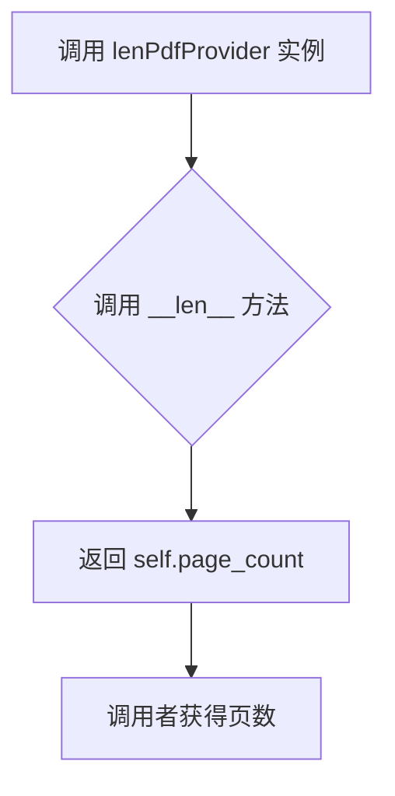

#### 带注释源码

```python
def __len__(self) -> int:
    """
    返回 PDF 文档的页数。
    
    这是一个 Python 特殊方法（dunder method），使得可以直接对 PdfProvider
    实例使用 len() 函数获取文档的页数。该值在 __init__ 方法中通过
    pdfium.PdfDocument 的 len(doc) 获取并存储在 self.page_count 中。
    
    Returns:
        int: PDF 文档的总页数
    """
    return self.page_count
```


### `PdfProvider.font_flags_to_format`

该函数将 PDF 字体标志位（font flags）转换为文本格式集合，用于确定文本的样式属性（如斜体、粗体、普通文本等）。它通过位运算解析 flags 参数，并与预定义的标志位映射进行比较，最终返回表示文本格式的字符串集合。

参数：

-  `flags`：`Optional[int]`，PDF 字体标志位，用于描述字体的属性特征

返回值：`Set[str]`，包含文本格式的集合，可能的值包括 `"plain"`、`"italic"`、`"bold"` 等

#### 流程图

```mermaid
flowchart TD
    A[开始] --> B{flags is None?}
    B -->|是| C[返回 {'plain'}]
    B -->|否| D[初始化 flag_map]
    D --> E[遍历 flag_map]
    E --> F{flags & (1 << (bit_position - 1))?}
    F -->|是| G[将 flag_name 添加到 set_flags]
    F -->|否| H[继续下一个]
    G --> H
    H --> I{set_flags 为空?}
    I -->|是| J[添加 'Plain' 到 set_flags]
    I -->|否| K[判断 set_flags 的具体组合]
    
    K --> L1{set_flags == {'Symbolic', 'Italic'}?}
    L1 -->|是| M1[添加 'plain']
    
    K --> L2{set_flags == {'Symbolic', 'Italic', 'UseExternAttr'}?}
    L2 -->|是| M2[添加 'plain']
    
    K --> L3{set_flags == {'UseExternAttr'}?}
    L3 -->|是| M3[添加 'plain']
    
    K --> L4{set_flags == {'Plain'}?}
    L4 -->|是| M4[添加 'plain']
    
    K --> L5{其他情况}
    L5 --> M5_1{set_flags 包含 'Italic'?}
    M5_1 -->|是| M5_2[添加 'italic']
    M5_1 -->|否| M5_3
    
    M5_3 --> M5_4{set_flags 包含 'ForceBold'?}
    M5_4 -->|是| M5_5[添加 'bold']
    M5_4 -->|否| M5_6
    
    M5_6 --> M5_7{set_flags 包含其他格式标志?}
    M5_7 -->|是| M5_8[添加 'plain']
    M5_7 -->|否| N[返回 formats]
    
    M1 --> N
    M2 --> N
    M3 --> N
    M4 --> N
    M5_2 --> N
    M5_5 --> N
    M5_8 --> N
    N --> O[结束]
```

#### 带注释源码

```python
def font_flags_to_format(self, flags: Optional[int]) -> Set[str]:
    """
    将 PDF 字体标志位转换为文本格式集合。
    
    参数:
        flags: PDF 字体标志位，是一个可选的整数值，用于描述字体的属性特征
        
    返回值:
        包含文本格式的集合，可能的值包括 'plain'、'italic'、'bold' 等
    """
    # 如果 flags 为 None，直接返回包含 'plain' 的集合
    if flags is None:
        return {"plain"}

    # 定义字体标志位映射表
    # 键为位位置，值为对应的标志位名称
    flag_map = {
        1: "FixedPitch",      # 等宽字体
        2: "Serif",          # 衬线字体
        3: "Symbolic",       # 符号字体
        4: "Script",         # 手写体
        6: "Nonsymbolic",    # 非符号字体
        7: "Italic",         # 斜体
        17: "AllCap",        # 全大写
        18: "SmallCap",      # 小型大写
        19: "ForceBold",     # 强制粗体
        20: "UseExternAttr", # 使用外部属性
    }
    
    # 初始化空集合，用于存储提取出的标志位名称
    set_flags = set()
    
    # 遍历标志位映射表，通过位运算检查每个标志位是否被设置
    for bit_position, flag_name in flag_map.items():
        # 使用位运算检查 flags 中是否设置了当前位
        # (1 << (bit_position - 1)) 将位位置转换为对应的位掩码
        if flags & (1 << (bit_position - 1)):
            set_flags.add(flag_name)
    
    # 如果没有提取到任何标志位，添加 'Plain' 作为默认值
    if not set_flags:
        set_flags.add("Plain")

    # 初始化格式集合，用于存储最终的文本格式
    formats = set()
    
    # 根据标志位组合判断文本格式
    # 情况1: 符号字体且斜体，或者符号字体且斜体且使用外部属性
    if set_flags == {"Symbolic", "Italic"} or set_flags == {
        "Symbolic",
        "Italic",
        "UseExternAttr",
    }:
        formats.add("plain")
    # 情况2: 仅使用外部属性
    elif set_flags == {"UseExternAttr"}:
        formats.add("plain")
    # 情况3: 仅为普通文本
    elif set_flags == {"Plain"}:
        formats.add("plain")
    else:
        # 情况4: 其他组合，根据具体标志位添加格式
        # 如果包含斜体标志，添加 'italic' 格式
        if set_flags & {"Italic"}:
            formats.add("italic")
        # 如果包含强制粗体标志，添加 'bold' 格式
        if set_flags & {"ForceBold"}:
            formats.add("bold")
        # 如果包含其他格式标志（等宽、衬线、手写体等），添加 'plain' 格式
        if set_flags & {
            "FixedPitch",
            "Serif",
            "Script",
            "Nonsymbolic",
            "AllCap",
            "SmallCap",
            "UseExternAttr",
        }:
            formats.add("plain")
    
    # 返回最终的格式集合
    return formats
```


### `PdfProvider.font_names_to_format`

该方法用于将字体名称转换为格式字符串集合。通过检查字体名称中是否包含"bold"或"italic"等关键词来判断文本应呈现的格式（粗体、斜体）。

参数：

- `font_name`：`str | None`，需要转换格式的字体名称

返回值：`Set[str]`，包含格式标识符的集合（如 "bold"、"italic"）

#### 流程图

```mermaid
flowchart TD
    A[开始] --> B{font_name is None?}
    B -->|是| C[返回空集合]
    B -->|否| D{font_name.lower 包含 'bold'?}
    D -->|是| E[formats.add('bold')]
    D -->|否| F{font_name.lower 包含 'ital'?}
    E --> F
    F -->|是| G[formats.add('italic')]
    F -->|否| H[返回 formats 集合]
    G --> H
```

#### 带注释源码

```python
def font_names_to_format(self, font_name: str | None) -> Set[str]:
    """
    将字体名称转换为格式标识符集合。
    
    通过检查字体名称字符串中是否包含特定关键词（bold/italic）来判断
    文本应该使用的格式渲染方式。
    
    Args:
        font_name: PDF 字体名称，可以为 None
        
    Returns:
        包含格式标识符的集合，可能的值包括 'bold'、'italic'
    """
    # 初始化空的结果集合
    formats = set()
    
    # 如果字体名称为空，直接返回空集合
    if font_name is None:
        return formats

    # 检查字体名称中是否包含 'bold'（不区分大小写）
    if "bold" in font_name.lower():
        formats.add("bold")
        
    # 检查字体名称中是否包含 'ital'（不区分大小写，可匹配 italic）
    if "ital" in font_name.lower():
        formats.add("italic")
        
    # 返回包含所有匹配格式的集合
    return formats
```


### `PdfProvider.normalize_spaces`

该方法是一个静态方法，用于将文本中的各种特殊空格字符（如em space、en space、non-breaking space、zero-width space、ideographic space）统一替换为普通空格字符，以实现文本空格的规范化处理。

参数：

- `text`：`str`，需要规范化的原始文本

返回值：`str`，将特殊空格字符替换为普通空格后的规范化文本

#### 流程图

```mermaid
flowchart TD
    A[开始 normalize_spaces] --> B[定义特殊空格字符列表 space_chars]
    B --> C{遍历 space_chars}
    C -->|对每个 space| D[text = text.replace(space, ' ')]
    D --> C
    C -->|遍历完成| E[返回规范化后的 text]
    E --> F[结束]
```

#### 带注释源码

```python
@staticmethod
def normalize_spaces(text):
    # 定义需要被替换的特殊空格字符列表
    space_chars = [
        "\u2003",  # em space (全角空格)
        "\u2002",  # en space (半角空格)
        "\u00a0",  # non-breaking space (不换行空格)
        "\u200b",  # zero-width space (零宽空格)
        "\u3000",  # ideographic space (表意文字空格)
    ]
    # 遍历每个特殊空格字符，替换为普通空格
    for space in space_chars:
        text = text.replace(space, " ")
    # 返回规范化后的文本
    return text
```


### `PdfProvider.pdftext_extraction`

该方法负责从 PDF 文档中提取文本内容，使用 pdftext 库进行文本提取，并将提取的结构化数据转换为 provider 内部使用的 `ProviderPageLines` 格式，同时处理字体信息、位置信息和格式标记。

参数：

- `doc`：`PdfDocument`，pypdfium2 的 PDF 文档对象，用于页面验证等操作

返回值：`ProviderPageLines`，字典类型，键为页码，值为该页的 `ProviderOutput` 列表，包含行、跨度（span）和字符信息

#### 流程图

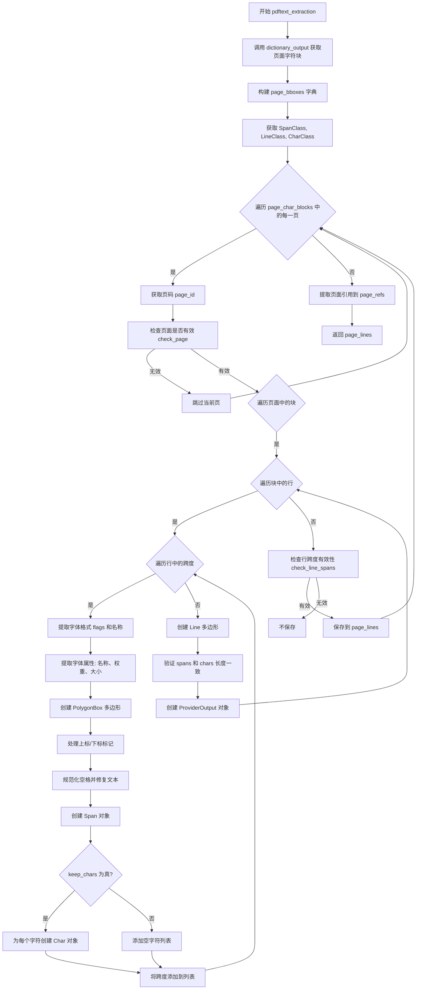

#### 带注释源码

```python
def pdftext_extraction(self, doc: PdfDocument) -> ProviderPageLines:
    # 初始化返回的页面行字典
    page_lines: ProviderPageLines = {}
    
    # 使用 pdftext 库的 dictionary_output 函数提取 PDF 文本
    # 参数包括：文件路径、页码范围、是否保留字符、工作线程数、是否展平PDF、是否禁用链接等
    page_char_blocks = dictionary_output(
        self.filepath,
        page_range=self.page_range,
        keep_chars=self.keep_chars,
        workers=self.pdftext_workers,
        flatten_pdf=self.flatten_pdf,
        quote_loosebox=False,
        disable_links=self.disable_links,
    )
    
    # 为每一页构建边界框字典，格式为 [x0, y0, width, height]
    self.page_bboxes = {
        i: [0, 0, page["width"], page["height"]]
        for i, page in zip(self.page_range, page_char_blocks)
    }

    # 从注册表获取 BlockTypes 对应的类
    SpanClass: Span = get_block_class(BlockTypes.Span)
    LineClass: Line = get_block_class(BlockTypes.Line)
    CharClass: Char = get_block_class(BlockTypes.Char)

    # 遍历提取的每个页面
    for page in page_char_blocks:
        page_id = page["page"]  # 获取页码
        lines: List[ProviderOutput] = []
        
        # 使用 check_page 验证页面是否有效（如包含文本对象等）
        if not self.check_page(page_id, doc):
            continue

        # 遍历页面中的所有块
        for block in page["blocks"]:
            # 遍历块中的所有行
            for line in block["lines"]:
                spans: List[Span] = []  # 存储该行的所有跨度
                chars: List[List[Char]] = []  # 存储该行的所有字符
                
                # 遍历行中的所有跨度
                for span in line["spans"]:
                    # 跳过空文本跨度
                    if not span["text"]:
                        continue
                    
                    # 从字体标志和字体名称获取格式（粗体、斜体等）
                    font_formats = self.font_flags_to_format(
                        span["font"]["flags"]
                    ).union(self.font_names_to_format(span["font"]["name"]))
                    
                    # 获取字体属性
                    font_name = span["font"]["name"] or "Unknown"
                    font_weight = span["font"]["weight"] or 0
                    font_size = span["font"]["size"] or 0
                    
                    # 从边界框创建多边形
                    polygon = PolygonBox.from_bbox(
                        span["bbox"], ensure_nonzero_area=True
                    )
                    
                    # 检查上标/下标标记
                    superscript = span.get("superscript", False)
                    subscript = span.get("subscript", False)
                    
                    # 规范化空格并修复文本编码问题
                    text = self.normalize_spaces(fix_text(span["text"]))
                    
                    # 如果是上标或下标，去除首尾空格
                    if superscript or subscript:
                        text = text.strip()

                    # 创建 Span 对象并添加到列表
                    spans.append(
                        SpanClass(
                            polygon=polygon,
                            text=text,
                            font=font_name,
                            font_weight=font_weight,
                            font_size=font_size,
                            minimum_position=span["char_start_idx"],
                            maximum_position=span["char_end_idx"],
                            formats=list(font_formats),
                            page_id=page_id,
                            text_extraction_method="pdftext",
                            url=span.get("url"),
                            has_superscript=superscript,
                            has_subscript=subscript,
                        )
                    )

                    # 如果保留字符级别信息，为每个字符创建 Char 对象
                    if self.keep_chars:
                        span_chars = [
                            CharClass(
                                text=c["char"],
                                polygon=PolygonBox.from_bbox(
                                    c["bbox"], ensure_nonzero_area=True
                                ),
                                idx=c["char_idx"],
                            )
                            for c in span["chars"]
                        ]
                        chars.append(span_chars)
                    else:
                        chars.append([])

                # 从行的边界框创建多边形
                polygon = PolygonBox.from_bbox(
                    line["bbox"], ensure_nonzero_area=True
                )

                # 断言：spans 和 chars 长度必须一致
                assert len(spans) == len(chars), (
                    f"Spans and chars length mismatch on page {page_id}: {len(spans)} spans, {len(chars)} chars"
                )
                
                # 创建 ProviderOutput 对象并添加到行列表
                lines.append(
                    ProviderOutput(
                        line=LineClass(polygon=polygon, page_id=page_id),
                        spans=spans,
                        chars=chars,
                    )
                )
        
        # 检查该页的行跨度是否有效（文本不为空且不是坏 OCR）
        if self.check_line_spans(lines):
            page_lines[page_id] = lines

        # 提取页面引用
        self.page_refs[page_id] = []
        if page_refs := page.get("refs", None):
            self.page_refs[page_id] = page_refs

    return page_lines
```


### `PdfProvider.check_line_spans`

该方法用于验证页面行中的文本跨度（spans）是否有效。它首先提取所有行的跨度，检查是否存在跨度，然后合并所有跨度文本并使用OCR检测方法验证文本质量，确保提取的文本不是损坏的OCR结果。

参数：

-  `page_lines`：`List[ProviderOutput]`，包含页面行的列表，每行包含多个文本跨度（spans）

返回值：`bool`，如果页面行包含有效文本则返回 True，否则返回 False

#### 流程图

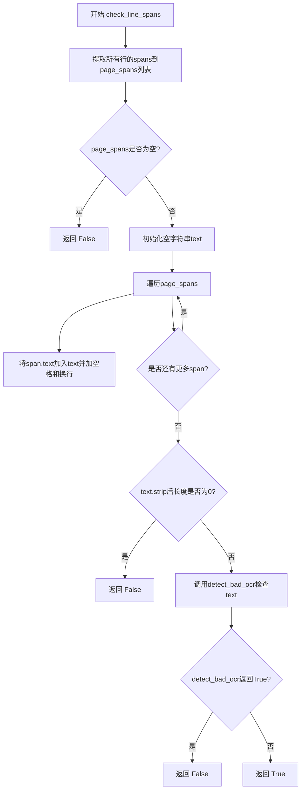

#### 带注释源码

```python
def check_line_spans(self, page_lines: List[ProviderOutput]) -> bool:
    """
    检查页面行中的文本跨度是否有效。
    
    该方法执行以下验证：
    1. 确保页面至少包含一个span
    2. 确保合并后的文本不为空
    3. 使用detect_bad_ocr验证文本不是损坏的OCR结果
    
    参数:
        page_lines: 包含页面行的列表，每行包含多个文本跨度
        
    返回:
        bool: 如果页面行包含有效文本返回True，否则返回False
    """
    # 步骤1: 使用列表推导式提取所有行的所有spans
    # page_lines是ProviderOutput列表，每个ProviderOutput包含spans属性
    page_spans = [span for line in page_lines for span in line.spans]
    
    # 步骤2: 检查是否存在任何span
    if len(page_spans) == 0:
        return False
    
    # 步骤3: 初始化空字符串用于合并所有span的文本
    text = ""
    
    # 步骤4: 遍历所有spans，将文本合并
    # 每个span之间用空格分隔，每行结束时用换行符分隔
    for span in page_spans:
        text = text + " " + span.text  # 添加空格和span文本
        text = text + "\n"              # 添加换行符
    
    # 步骤5: 检查合并后的文本是否为空（去除首尾空白后）
    if len(text.strip()) == 0:
        return False
    
    # 步骤6: 调用detect_bad_ocr检测文本是否为损坏的OCR结果
    # detect_bad_ocr会检查空格比例、换行比例、字母数字比例等
    if self.detect_bad_ocr(text):
        return False
    
    # 步骤7: 所有检查通过，返回True
    return True
```


### `PdfProvider.check_page`

该方法用于检查 PDF 页面是否应该被处理。它通过获取页面对象，过滤文本和图像对象，并根据多种条件判断页面是否有效，包括检查文本对象是否存在、是否需要剥离现有 OCR、字体是否嵌入、是否有大型图像覆盖页面等。如果页面符合跳过条件则返回 False，否则返回 True。

**参数：**

- `page_id`：`int`，要检查的页面的页码索引
- `doc`：`PdfDocument`，pypdfium2 的 PDF 文档对象

**返回值：**`bool`，如果页面应该被处理则返回 True，否则返回 False

#### 流程图

```mermaid
flowchart TD
    A[开始 check_page] --> B[获取页面对象 page = doc.get_page(page_id)]
    B --> C[获取页面边界框 page_bbox]
    C --> D[尝试获取页面文本和图像对象]
    D --> E{PdfiumError?}
    E -->|是| F[返回 False - 无法获取页面对象]
    E -->|否| G{是否有文本对象?}
    G -->|否| H[返回 False - 无文本对象]
    G -->|是| I{strip_existing_ocr?}
    I -->|否| Z[返回 True - 页面有效]
    I -->|是| J{文本渲染模式检查}
    J --> K{有不可见/未知渲染模式?}
    K -->|是| L[返回 False - 存在不可见文本]
    K -->|否| M[遍历所有文本对象检查字体]
    M --> N[检查字体是否嵌入]
    M --> O[检查字体名称是否为空]
    N --> P{所有字体都未嵌入?}
    O --> Q{所有字体都为空?}
    P -->|是| R[返回 False - 无有效字体]
    Q -->|是| S[返回 False - 无有效字体]
    P -->|否| T{所有字体都为空?}
    T -->|是| U[返回 False - 无有效字体]
    T -->|否| V{检查图像覆盖面积}
    V --> W{图像覆盖面积 >= image_threshold?}
    W -->|是| X[返回 False - 图像覆盖过多]
    W -->|否| Z
```

#### 带注释源码

```python
def check_page(self, page_id: int, doc: PdfDocument) -> bool:
    """
    检查 PDF 页面是否应该被处理。
    
    该方法执行多项检查来决定是否跳过或处理给定页面：
    1. 检查是否能成功获取页面对象
    2. 检查页面是否包含文本对象
    3. 如果启用 OCR 剥离，检查文本渲染模式、字体嵌入状态和图像覆盖率
    
    参数:
        page_id: PDF 文档中页面的索引（从 0 开始）
        doc: pypdfium2 的 PdfDocument 对象，用于访问页面内容
        
    返回:
        bool: 如果页面应该被处理返回 True，否则返回 False
    """
    # 获取指定页面的 PDF 页对象
    page = doc.get_page(page_id)
    # 从页面边界框创建 PolygonBox 对象，用于后续的相交计算
    page_bbox = PolygonBox.from_bbox(page.get_bbox())
    
    try:
        # 获取页面上的文本和图像对象列表
        # filter 参数指定只获取文本和图像对象，过滤掉其他类型
        page_objs = list(
            page.get_objects(
                filter=[pdfium_c.FPDF_PAGEOBJ_TEXT, pdfium_c.FPDF_PAGEOBJ_IMAGE]
            )
        )
    except PdfiumError:
        # 当 pdfium 无法获取页面对象数量时发生此错误
        # 返回 False 表示跳过此页面
        return False

    # 如果页面上没有任何文本对象，则跳过此页面
    if not any([obj.type == pdfium_c.FPDF_PAGEOBJ_TEXT for obj in page_objs]):
        return False

    # 如果配置了剥离现有 OCR 文本，则进行更详细的检查
    if self.strip_existing_ocr:
        # 检查页面上是否有文本对象处于不可见渲染模式
        # 如果有，说明页面可能已包含 OCR 文本，应跳过
        for text_obj in filter(
            lambda obj: obj.type == pdfium_c.FPDF_PAGEOBJ_TEXT, page_objs
        ):
            # 获取文本对象的渲染模式
            text_render_mode = pdfium_c.FPDFTextObj_GetTextRenderMode(text_obj)
            # 如果是不可见或未知渲染模式，跳过此页面
            if text_render_mode in [
                pdfium_c.FPDF_TEXTRENDERMODE_INVISIBLE,
                pdfium_c.FPDF_TEXTRENDERMODE_UNKNOWN,
            ]:
                return False

        # 初始化列表用于收集字体信息
        non_embedded_fonts = []
        empty_fonts = []
        font_map = {}
        
        # 遍历所有文本对象检查字体嵌入状态
        for text_obj in filter(
            lambda obj: obj.type == pdfium_c.FPDF_PAGEOBJ_TEXT, page_objs
        ):
            # 获取文本对象使用的字体
            font = pdfium_c.FPDFTextObj_GetFont(text_obj)
            # 获取字体名称
            font_name = self._get_fontname(font)

            # 检查字体是否嵌入到 PDF 中
            non_embedded_fonts.append(pdfium_c.FPDFFont_GetIsEmbedded(font) == 0)
            # 检查字体名称是否包含 'glyphless'（无字形）
            empty_fonts.append(
                "glyphless" in font_name.lower()
            )
            # 构建字体映射表
            if font_name not in font_map:
                font_map[font_name or "Unknown"] = font

        # 如果所有字体都未嵌入或所有字体都为空，则跳过此页面
        if all(non_embedded_fonts) or all(empty_fonts):
            return False

        # 检查是否有大型图像覆盖页面大部分区域
        # 如果是，可能表示这是扫描页面或应使用 OCR 处理
        for img_obj in filter(
            lambda obj: obj.type == pdfium_c.FPDF_PAGEOBJ_IMAGE, page_objs
        ):
            # 获取图像对象的边界框
            img_bbox = PolygonBox.from_bbox(img_obj.get_pos())
            # 计算图像与页面的相交百分比
            if page_bbox.intersection_pct(img_bbox) >= self.image_threshold:
                # 图像覆盖超过阈值，跳过此页面
                return False

    # 所有检查通过，页面应该被处理
    return True
```


### `PdfProvider.detect_bad_ocr`

该方法用于检测OCR识别结果是否为"坏"OCR（即识别质量较差或失败的文本），通过计算空格比例、换行比例、字母数字字符比例以及无效字符数量来判断。

参数：

- `text`：`str`，待检测的文本内容，来自PDF页面提取的文本

返回值：`bool`，如果返回 `True` 表示检测到糟糕的OCR结果（识别失败或质量差）；返回 `False` 表示文本质量正常

#### 流程图

```mermaid
flowchart TD
    A[开始 detect_bad_ocr] --> B{文本长度是否为0?}
    B -->|是| C[返回 True - OCR识别失败]
    B -->|否| D[计算空格数量和字母字符数量]
    D --> E{空格比例 > ocr_space_threshold?}
    E -->|是| C
    E -->|否| F[计算换行数量和非换行数量]
    F --> G{换行比例 > ocr_newline_threshold?}
    G -->|是| C
    G -->|否| H[计算字母数字字符比例]
    H --> I{字母数字比例 < ocr_alphanum_threshold?}
    I -->|是| C
    I -->|否| J[统计无效字符数量]
    J --> K{无效字符数量 > max(6.0, 文本长度*0.03)?}
    K -->|是| C
    K -->|否| L[返回 False - 文本质量正常]
```

#### 带注释源码

```python
def detect_bad_ocr(self, text):
    """
    检测OCR识别结果是否为糟糕的OCR（识别失败或质量差）
    
    检测逻辑：
    1. 空文本直接判定为OCR失败
    2. 空格比例过高 -> 坏OCR
    3. 换行比例过高 -> 坏OCR
    4. 字母数字字符比例过低（乱码） -> 坏OCR
    5. 无效字符过多 -> 坏OCR
    
    Args:
        text: 待检测的文本内容，来自PDF页面提取的文本
        
    Returns:
        bool: True表示检测到糟糕的OCR结果，False表示文本质量正常
    """
    # 如果文本为空，假设OCR识别失败
    if len(text) == 0:
        return True

    # 计算空格数量和非空格字符数量
    spaces = len(re.findall(r"\s+", text))
    alpha_chars = len(re.sub(r"\s+", "", text))
    # 如果空格比例超过阈值，认为是坏OCR
    if spaces / (alpha_chars + spaces) > self.ocr_space_threshold:
        return True

    # 计算换行数量和非换行字符数量
    newlines = len(re.findall(r"\n+", text))
    non_newlines = len(re.sub(r"\n+", "", text))
    # 如果换行比例超过阈值，认为是坏OCR
    if newlines / (newlines + non_newlines) > self.ocr_newline_threshold:
        return True

    # 使用工具函数计算字母数字字符比例，如果低于阈值认为是乱码
    if alphanum_ratio(text) < self.ocr_alphanum_threshold:  # Garbled text
        return True

    # 统计无效字符（如替换字符 \uFFFD）的数量
    invalid_chars = len([c for c in text if c in self.ocr_invalid_chars])
    # 如果无效字符数量超过阈值（至少6个或文本长度的3%），认为是坏OCR
    if invalid_chars > max(6.0, len(text) * 0.03):
        return True

    # 所有检查都通过，文本质量正常
    return False
```


### `PdfProvider._render_image`

该方法是一个静态方法，用于将 PDF 文档中的指定页面渲染为 PIL 图像对象。它支持页面扁平化处理，并能将渲染结果转换为 RGB 格式的图像。

参数：

- `pdf`：`pdfium.PdfDocument`，PDF 文档对象，包含要渲染的页面
- `idx`：`int`，要渲染的页面索引（从 0 开始）
- `dpi`：`int`，渲染分辨率（每英寸点数），决定输出图像的清晰度
- `flatten_page`：`bool`，是否在渲染前对页面进行扁平化处理（用于处理 PDF 表单字段等）

返回值：`Image.Image`，返回渲染后的 PIL 图像对象（RGB 格式）

#### 流程图

```mermaid
flowchart TD
    A[开始渲染页面] --> B[根据索引获取页面: page = pdf[idx]]
    B --> C{flatten_page 是否为真?}
    C -->|是| D[调用 flatten_pdf_page 扁平化页面]
    D --> E[重新获取页面: page = pdf[idx]]
    C -->|否| F[直接渲染页面]
    E --> F
    F --> G[page.render渲染为PIL图像]
    G --> H[image.convert转换为RGB模式]
    H --> I[返回图像对象]
```

#### 带注释源码

```python
@staticmethod
def _render_image(
    pdf: pdfium.PdfDocument, idx: int, dpi: int, flatten_page: bool
) -> Image.Image:
    """
    将 PDF 文档中的指定页面渲染为 PIL 图像
    
    参数:
        pdf: PDF 文档对象
        idx: 页面索引
        dpi: 渲染 DPI 值
        flatten_page: 是否扁平化页面
    
    返回:
        渲染后的 RGB 格式 PIL 图像
    """
    # 根据索引从 PDF 文档中获取指定页面
    page = pdf[idx]
    
    # 如果需要扁平化页面（处理表单字段等）
    if flatten_page:
        # 调用扁平化函数处理页面
        flatten_pdf_page(page)
        # 扁平化后需要重新获取页面引用
        page = pdf[idx]
    
    # 渲染页面为 PIL 图像
    # scale=dpi/72: 将 DPI 转换为渲染缩放比例（72是PDF标准分辨率）
    # draw_annots=False: 不渲染注释和标注
    image = page.render(scale=dpi / 72, draw_annots=False).to_pil()
    
    # 将图像转换为 RGB 模式（确保颜色空间一致性）
    image = image.convert("RGB")
    
    # 返回渲染后的图像对象
    return image
```


### `PdfProvider.get_images`

该方法负责根据给定的页面索引列表和目标 DPI（每英寸点数），从 PDF 文档中渲染并返回对应的图像列表，是 PDF 提供者将页面转换为可视化图像的核心接口。

参数：

- `idxs`：`List[int]`，需要渲染的页面索引列表
- `dpi`：`int`，渲染图像的目标分辨率（每英寸点数），影响输出图像的清晰度和尺寸

返回值：`List[Image.Image]`渲染后的 PIL 图像对象列表，每个元素对应 `idxs` 中相应索引的页面图像

#### 流程图

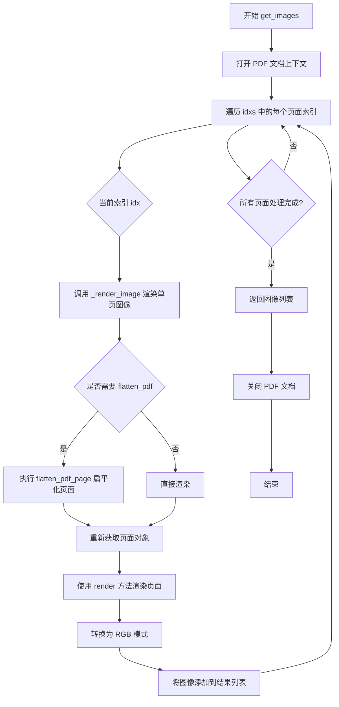

#### 带注释源码

```python
def get_images(self, idxs: List[int], dpi: int) -> List[Image.Image]:
    """
    从 PDF 文档中渲染指定页面为图像
    
    Args:
        idxs: 需要渲染的页面索引列表，索引从 0 开始
        dpi: 目标渲染分辨率（每英寸点数），数值越高图像越清晰
    
    Returns:
        渲染后的 PIL Image 对象列表，按 idxs 顺序排列
    """
    # 使用上下文管理器打开 PDF 文档，确保资源正确释放
    with self.get_doc() as doc:
        # 列表推导式遍历所有需要渲染的页面索引
        # 每次迭代调用 _render_image 静态方法渲染单个页面
        images = [
            self._render_image(
                doc,           # PDF 文档对象
                idx,           # 当前要渲染的页面索引
                dpi,           # 目标 DPI 分辨率
                self.flatten_pdf  # 是否扁平化 PDF 结构（类属性）
            ) 
            for idx in idxs
        ]
    # 返回渲染完成的图像列表
    return images
```


### `PdfProvider.get_page_bbox`

获取指定页面的边界框信息，将原始边界框数据转换为PolygonBox对象。

参数：

- `idx`：`int`，要获取边界框的页面索引

返回值：`PolygonBox | None`，如果页面存在边界框则返回PolygonBox对象，否则返回None

#### 流程图

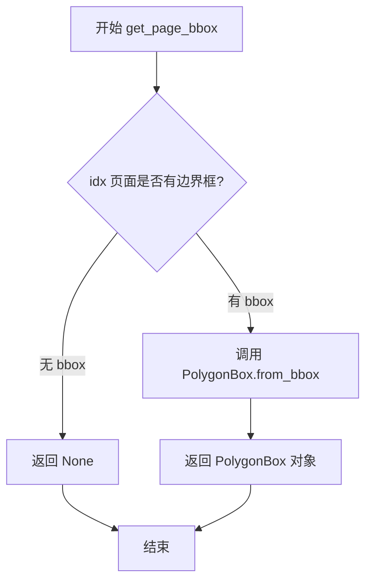

#### 带注释源码

```python
def get_page_bbox(self, idx: int) -> PolygonBox | None:
    """
    获取指定页面的边界框。
    
    Args:
        idx: 页面的索引
        
    Returns:
        PolygonBox对象，如果页面存在边界框；否则返回None
    """
    # 从 page_bboxes 字典中获取页面索引对应的边界框数据
    # page_bboxes 在初始化时根据是否强制OCR而设置：
    #   - force_ocr=True: 通过 doc[i].get_bbox() 手动获取
    #   - force_ocr=False: 通过 pdftext_extraction 从页面宽高计算 [0, 0, width, height]
    bbox = self.page_bboxes.get(idx)
    
    # 检查是否获取到了有效的边界框数据
    if bbox:
        # 使用 PolygonBox.from_bbox 将原始边界框数据 [x0, y0, x1, y1] 
        # 转换为 PolygonBox 对象
        return PolygonBox.from_bbox(bbox)
    
    # 如果没有找到该页面的边界框，返回 None
    # 调用方需要处理这种边界框不存在的情况
```


### `PdfProvider.get_page_lines`

获取指定页面的行数据列表

参数：

- `idx`：`int`，页面索引，用于从页面行字典中检索对应页面的行数据

返回值：`List[ProviderOutput]`，返回指定页面索引对应的行数据列表，每个元素代表页面中的一行内容

#### 流程图

```mermaid
flowchart TD
    A[开始 get_page_lines] --> B[接收页面索引 idx]
    B --> C[从 self.page_lines 字典中获取索引为 idx 的值]
    C --> D[返回页面行列表]
    D --> E[结束]
```

#### 带注释源码

```python
def get_page_lines(self, idx: int) -> List[ProviderOutput]:
    """
    获取指定页面的行数据列表。
    
    这是一个简单的字典访问方法，从预处理的页面行字典中检索对应页面的数据。
    页面行数据在初始化阶段通过 pdftext_extraction 方法提取并存储在 self.page_lines 中。
    
    参数:
        idx: 页面索引，范围从 0 到 page_count-1
        
    返回:
        指定页面索引对应的行数据列表，每个元素为 ProviderOutput 对象，
        包含该行的几何信息、跨内容、字符信息等
    """
    return self.page_lines[idx]
```


### `PdfProvider.get_page_refs`

获取指定页面的引用（references）列表，用于跟踪PDF文档中的内部链接和交叉引用。

参数：

- `idx`：`int`，页面索引，用于定位需要获取引用的页面

返回值：`List[Reference]`，返回指定页面包含的引用列表，这些引用类型为 `pdftext.schema.Reference`

#### 流程图

```mermaid
flowchart TD
    A[开始 get_page_refs] --> B[输入: idx 页面索引]
    B --> C{验证 idx 是否有效}
    C -->|有效| D[从 self.page_refs 字典中获取对应页面的引用列表]
    D --> E[返回 List[Reference]]
    C -->|无效| F[返回空列表或触发 KeyError]
    E --> G[结束]
    F --> G
```

#### 带注释源码

```python
def get_page_refs(self, idx: int) -> List[Reference]:
    """
    获取指定页面的引用列表。
    
    此方法直接从预填充的 page_refs 字典中检索页面引用。
    page_refs 在 pdftext_extraction 方法执行时被填充，
    包含了从 PDF 文本提取的内部链接和交叉引用信息。
    
    参数:
        idx: int - 页面的索引值，范围从 0 到 page_count-1
        
    返回:
        List[Reference] - 该页面包含的所有引用对象列表
    """
    return self.page_refs[idx]
```

#### 关键信息补充

- **调用场景**: 通常在需要处理 PDF 内部链接、目录跳转、交叉引用时调用
- **数据来源**: 数据在 `pdftext_extraction` 方法中通过 `dictionary_output` 函数提取，并存储在 `self.page_refs` 字典中
- **依赖字段**: 依赖类字段 `self.page_refs: Dict[int, List[Reference]]`，该字段在 `__init__` 方法中初始化为空字典
- **潜在优化**: 当前实现直接返回字典值，如果 idx 不存在会抛出 `KeyError`，可以考虑添加越界检查或默认值返回以增强健壮性


### `PdfProvider._get_fontname`

获取 PDF 字体的基础字体名称。

参数：

- `font`：`Any`，pypdfium2 的字体对象

返回值：`str`，字体的基础名称，如果获取失败则返回空字符串

#### 流程图

```mermaid
flowchart TD
    A[开始] --> B[初始化 font_name = '' 和 buffer_size = 256]
    B --> C[创建256字节的字体名称缓冲区]
    C --> D[调用 FPDFFont_GetBaseFontName 获取字体名称]
    D --> E{是否成功获取}
    E -->|否| F[捕获异常]
    F --> I[返回空字符串 '']
    E -->|是| G{长度是否小于缓冲区大小}
    G -->|是| H[从缓冲区解码UTF-8字符串并返回]
    G -->|否| J[创建更大缓冲区]
    J --> K[再次调用 FPDFFont_GetBaseFontName]
    K --> H
```

#### 带注释源码

```python
@staticmethod
def _get_fontname(font) -> str:
    """
    获取 PDF 字体的基础字体名称。
    
    Args:
        font: pypdfium2 的字体对象
        
    Returns:
        str: 字体的基础名称，如果获取失败则返回空字符串
    """
    # 初始化返回值和缓冲区大小
    font_name = ""
    buffer_size = 256

    try:
        # 创建一个256字节的缓冲区用于存储字体名称
        font_name_buffer = ctypes.create_string_buffer(buffer_size)
        
        # 调用 pdfium C 库函数获取字体名称
        # 返回值为实际名称长度
        length = pdfium_c.FPDFFont_GetBaseFontName(
            font, font_name_buffer, buffer_size
        )
        
        # 如果实际长度小于缓冲区大小，直接解码
        if length < buffer_size:
            font_name = font_name_buffer.value.decode("utf-8")
        else:
            # 如果缓冲区不够大，重新分配足够大的缓冲区
            font_name_buffer = ctypes.create_string_buffer(length)
            pdfium_c.FPDFFont_GetBaseFontName(font, font_name_buffer, length)
            font_name = font_name_buffer.value.decode("utf-8")
            
    except Exception:
        # 静默处理所有异常，返回空字符串
        pass

    return font_name
```

## 关键组件


### PdfProvider 类

PDF文件处理的主provider类，负责PDF文档的加载、文本提取、OCR检测和图像渲染。

### get_doc() 上下文管理器

使用pypdfium2加载PDF文档，支持表单扁平化，提供安全的文档访问和资源清理。

### pdftext_extraction() 方法

调用pdftext库进行PDF文本提取，将提取的文本、字体信息和几何位置转换为结构化的Span、Line和Char对象。

### font_flags_to_format() 方法

将PDF字体标志位转换为格式化集合（bold、italic、plain），支持FixedPitch、Serif、Symbolic等多种字体属性识别。

### font_names_to_format() 方法

通过字体名称匹配识别粗体和斜体格式，基于字体名字符串进行简单关键词查找。

### check_page() 方法

验证页面是否有效，检查页面是否包含文本对象、是否需要OCR处理、是否包含嵌入式字体以及图像覆盖率。

### detect_bad_ocr() 方法

检测OCR质量是否较差，通过空格比例、换行比例、字母数字比例和无效字符数判断OCR结果是否可用。

### _render_image() 静态方法

将PDF页面渲染为PIL图像，支持指定DPI和页面扁平化选项，输出RGB格式图像。

### get_images() 方法

批量获取指定页面索引的图像列表，调用_render_image逐页渲染。

### normalize_spaces() 静态方法

规范化文本中的各类空格字符，将Unicode空格统一转换为标准空格。

### check_line_spans() 方法

验证提取的文本行是否有效，检查文本是否为空且是否包含糟糕的OCR结果。

## 问题及建议


### 已知问题

-   **异常处理过于宽泛**：在 `_get_fontname` 方法中使用了 `except Exception: pass`，会静默吞噬所有异常（包括 `pdfium_c` 相关的底层错误），导致字体名称获取失败时无法追踪问题根源。
-   **正则表达式未预编译**：`detect_bad_ocr` 方法中多次使用 `re.findall` 和 `re.sub` 进行文本检测，每次调用都会重新编译正则表达式，在处理大量文本时性能较低。
-   **魔法数字缺乏文档**：`detect_bad_ocr` 中的阈值（如 `6.0`, `0.03`）和 `check_line_spans` 中的判断逻辑缺乏注释说明，后续维护者难以理解这些数值的业务含义。
-   **类型注解不完整**：`__init__` 方法的 `config` 参数缺少类型注解，且类的继承关系 `BaseProvider` 未在当前代码中定义，无法验证类型兼容性。
-   **代码重复逻辑**：`check_page` 方法中多次使用 `filter` 过滤文本对象（`FPDF_PAGEOBJ_TEXT`），可提取为共享逻辑以提高可读性。
-   **内存占用风险**：`page_lines` 和 `page_refs` 字典存储所有页面的完整数据，对于包含数百页的大型 PDF 文件，可能导致显著的内存消耗。
-   **文档重复打开**：`get_images` 方法每次调用都会重新打开 PDF 文档并执行初始化操作（如 `init_forms`），缺乏缓存机制导致重复开销。

### 优化建议

-   **细化异常处理**：为 `_get_fontname` 方法添加日志记录，记录异常类型和上下文信息，便于问题排查；同时考虑对特定异常类型进行捕获。
-   **预编译正则表达式**：将 `detect_bad_ocr` 中的正则表达式定义为模块级常量（如 `SPACE_RE = re.compile(r"\s+")`），避免重复编译开销。
-   **提取配置常量**：将 OCR 检测阈值（`ocr_space_threshold`, `ocr_newline_threshold`, `ocr_alphanum_threshold`）和魔法数字提取为类常量或配置文件，并添加文档注释说明其业务意义。
-   **完善类型注解**：为 `config` 参数添加 `Optional[Dict[str, Any]]` 类型注解，或根据 `BaseProvider` 的定义补充完整类型信息。
-   **提取公共过滤逻辑**：将 `check_page` 中重复的文本对象过滤逻辑抽取为私有方法，如 `_get_text_objects(page)`。
-   **考虑惰性加载或流式处理**：对于超大型 PDF，可考虑实现生成器模式或按需加载页面数据，减少初始内存占用。
-   **实现文档缓存或连接池**：在 `get_doc` 上下文管理器中增加缓存机制，或在类生命周期内保持文档句柄复用（需权衡线程安全性）。

## 其它


### 设计目标与约束

本模块的设计目标是为marker系统提供一个统一的PDF文档处理接口，实现PDF文本、图像和元数据的提取。核心约束包括：1) 支持处理大规模PDF文档（通过page_range参数实现分页处理）；2) 兼容多种PDF格式（包括带有表单、OCR文本、图像的PDF）；3) 在提取文本时优先使用pdftext库以获得更好的准确性，仅在pdftext失败时降级到OCR；4) 性能约束：pdftext_workers默认4个worker，图像渲染DPI默认300；5) 内存约束：通过分页处理避免一次性加载整个PDF到内存。

### 错误处理与异常设计

代码中的错误处理采用以下策略：1) 使用assertion验证page_range的合法性，抛出包含详细错误信息的AssertionError；2) 在get_doc()方法中使用contextlib.contextmanager确保文档资源正确释放，即使发生异常也会关闭文档；3) check_page()方法捕获PdfiumError异常，当pdfium无法获取页面对象时返回False跳过该页；4) _get_fontname()方法捕获所有Exception并返回空字符串，保证提取流程不会因字体名称获取失败而中断；5) detect_bad_ocr()方法对空文本直接返回True（认为OCR失败）。建议增强：对于关键操作（如PDF打开、页面渲染）应添加重试机制；对于不可恢复的错误应记录详细日志后抛出自定义异常。

### 数据流与状态机

数据流分为三条主线：1) 文本提取流程：PDF文件 → pdfium.PdfDocument → dictionary_output() → Span/Line/Char对象构建 → ProviderPageLines字典；2) 图像渲染流程：PDF文件 → get_doc() → _render_image() → PIL.Image对象；3) 页面验证流程：PDF页面 → get_objects() → 文本/图像对象过滤 → 格式检测 → 是否跳过决策。状态机方面：PdfProvider在初始化时完成文档加载和文本提取，之后处于"就绪"状态，可通过get_page_lines()、get_images()、get_page_refs()等方法获取数据，最后通过context manager退出时释放资源。

### 外部依赖与接口契约

主要外部依赖：1) pypdfium2 (pdfium_raw) - 用于PDF渲染和底层PDF操作；2) pdftext - 用于高级PDF文本提取；3) ftfy.fix_text - 用于修复编码问题文本；4) PIL.Image - 图像处理；5) marker内部模块：BaseProvider、ProviderOutput、Char、ProviderPageLines、PolygonBox、Span、Line、Reference等。接口契约：1) 继承BaseProvider类，必须实现__len__()、get_page_bbox()、get_page_lines()、get_page_refs()、get_images()方法；2) 输入参数：filepath为必选，config为可选配置对象；3) 输出格式：get_page_lines()返回List[ProviderOutput]，每项包含line、spans、chars；4) 依赖版本约束：pypdfium2需支持FPDF_PAGEOBJ_TEXT等常量，pdftext需支持dictionary_output接口。

### 性能考虑与优化建议

性能瓶颈分析：1) pdftext_extraction()中逐页逐块处理，大文档可能有性能问题；2) check_page()对每页调用get_objects()进行过滤，I/O开销较大；3) 图像渲染为同步操作，多页图像获取会串行执行。优化建议：1) 对于大规模PDF，考虑实现缓存机制（page_lines、page_bboxes已缓存，可扩展）；2) get_images()方法可改为异步并行渲染；3) check_page()中的过滤操作可优化为一次性获取所有页面对象后批量处理；4) 字体名称获取使用ctypes，可考虑缓存已解析的字体名称；5) 正则表达式匹配（detect_bad_ocr中）可预编译模式以提升性能。

### 安全考虑

当前代码安全考量有限，主要涉及：1) 文件路径处理：filepath直接传入PdfDocument，应确保调用方已进行路径验证；2) 字体名称解码：使用UTF-8解码，应处理可能的编码错误（当前通过try-except捕获）；3) 内存管理：通过context manager确保文档正确关闭，防止资源泄漏。建议增强：1) 对用户提供的PDF文件进行文件类型和大小校验；2) 对异常的字体名称或编码进行白名单过滤，防止潜在的攻击向量；3) 添加操作超时限制，防止恶意构造的大型PDF导致无限等待。

### 配置管理

可配置参数（通过Annotated字段定义）：1) page_range: List[int] - 处理页面范围，None表示处理所有页；2) pdftext_workers: int (默认4) - pdftext工作线程数；3) flatten_pdf: bool (默认True) - 是否扁平化PDF表单；4) force_ocr: bool (默认False) - 是否强制OCR；5) ocr_invalid_chars: tuple - OCR无效字符集；6) ocr_space_threshold: float (默认0.7) - 空格占比阈值；7) ocr_newline_threshold: float (默认0.6) - 换行占比阈值；8) ocr_alphanum_threshold: float (默认0.3) - 字母数字占比阈值；9) image_threshold: float (默认0.65) - 图像覆盖率阈值；10) strip_existing_ocr: bool (默认False) - 是否移除现有OCR文本；11) disable_links: bool (默认False) - 是否禁用链接；12) keep_chars: bool (默认False) - 是否保留字符级信息。

### 并发与线程安全性

当前设计为单线程使用模式，主要注意点：1) PdfProvider实例本身不维护可变状态（除了__init__时初始化的只读属性），理论上可安全复用；2) get_doc()返回的PdfDocument对象非线程安全，必须在每个线程中创建独立实例；3) get_images()方法内部创建新的document上下文，保证多线程调用时的安全性。建议：如需支持多线程并发调用get_images()，可考虑添加线程本地存储或连接池机制。

### 日志与监控

日志策略：1) pypdfium2日志级别设置为ERROR以减少噪声；2) 代码中未使用logging模块记录业务日志；3) 断言失败时会输出详细的页面范围信息。建议增强：1) 在关键操作点添加INFO级别日志（文档打开、页面处理开始/结束）；2) 在检测到异常情况时添加WARNING日志（如OCR质量差、页面跳过）；3) 添加性能指标日志（处理页数、耗时）；4) 考虑集成metrics框架暴露可观测性指标。

    