# `marker\marker\providers\powerpoint.py` 详细设计文档

该模块实现了一个 PowerPointProvider 类，用于将 PPTX 文件转换为 PDF 文档。核心流程是解析 PPTX 文件中的幻灯片、形状（文本、表格、图片、组合），将其渲染为中间 HTML 结构，最后利用 WeasyPrint 库将 HTML 渲染为 PDF 文件。

## 整体流程

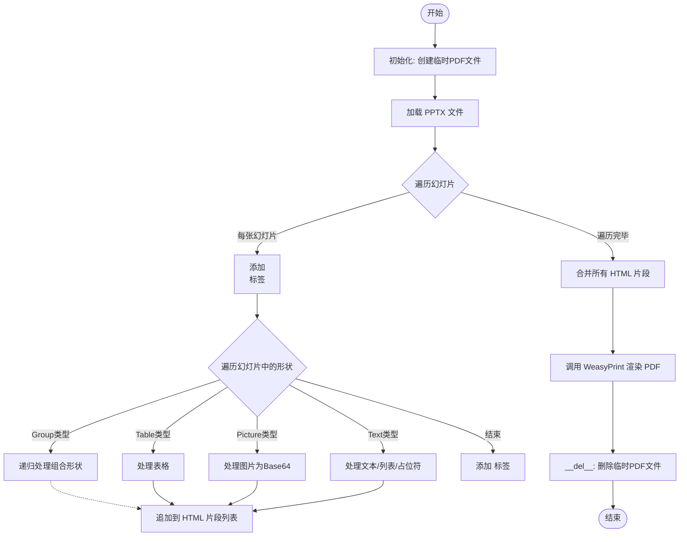

## 类结构

```
PdfProvider (基类, 来自 marker.providers.pdf)
└── PowerPointProvider (继承自 PdfProvider)
```

## 全局变量及字段


### `logger`
    
Global logger object for logging warnings and errors during PPTX to PDF conversion.

类型：`Logger`
    


### `css`
    
Global constant string defining CSS styles for PDF rendering (page size, table borders, image sizing, etc.).

类型：`str`
    


### `PowerPointProvider.include_slide_number`
    
Class attribute that controls whether the slide number is included in the generated PDF.

类型：`bool`
    


### `PowerPointProvider.temp_pdf_path`
    
Instance attribute that holds the path to the temporary PDF file created during the PPTX to PDF conversion.

类型：`str`
    
    

## 全局函数及方法


### `get_logger`

获取用于记录项目运行日志的 Logger 实例。该函数通常基于当前模块名称或默认配置初始化日志记录器。

参数：
- 该函数在当前代码中被无参调用：`logger = get_logger()`。根据 `marker.logger` 的导入路径推测，其内部可能自动处理模块名获取或使用默认配置。

返回值：`logging.Logger`（或自定义 Logger 类型），返回一个可用于输出日志的对象（如代码中 `logger.warning` 所示）。

#### 流程图

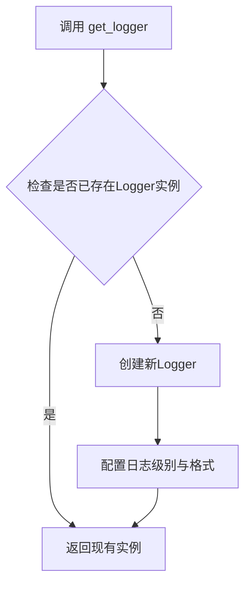

#### 带注释源码

```python
# 从外部模块 marker.logger 导入 get_logger 函数
# 注意：具体的函数定义（实现源码）位于 marker/logger.py 中，未在当前代码片段中展示
from marker.logger import get_logger

# 在模块加载时调用，获取一个名为 'marker' (或根据实现定义的) 的日志记录器
logger = get_logger()

# 后续在代码中被使用，用于输出警告信息
# logger.warning(f"Warning: image cannot be loaded by Pillow: {e}")
```


### `tempfile.NamedTemporaryFile`

用于创建临时文件的函数，在 `PowerPointProvider` 类中用于生成一个临时 PDF 文件路径，以便将 PPTX 转换为 PDF 后进行后续处理。

参数：

- `delete`：`bool`，关闭后是否删除文件。代码中传入 `False`，表示关闭后不删除临时文件，以便保留转换后的 PDF 供后续处理。
- `suffix`：`str`，文件后缀名。代码中传入 `".pdf"`，指定临时文件以 `.pdf` 结尾。

返回值：`tempfile._TemporaryFileWrapper`（或类似的文件对象），返回一个临时文件对象，该对象具有 `name` 属性，可通过 `temp_pdf.name` 获取临时文件的路径。

#### 流程图

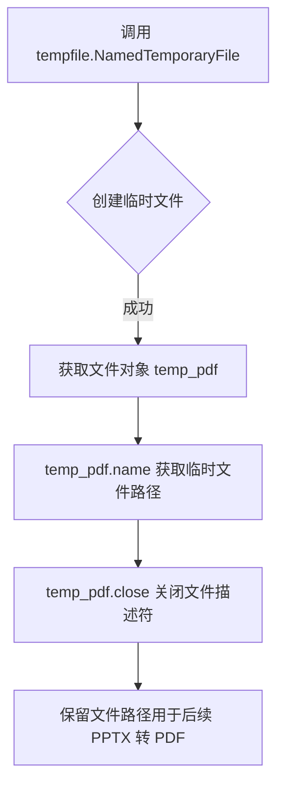

#### 带注释源码

```python
# 在 PowerPointProvider.__init__ 方法中使用
temp_pdf = tempfile.NamedTemporaryFile(delete=False, suffix=".pdf")
# 说明：
# - delete=False: 关闭文件后不自动删除，保留文件供后续 PDF 处理使用
#   （因为我们需要在后续步骤中将 PPTX 转换为 PDF 并保存到此路径）
# - suffix=".pdf": 指定临时文件的扩展名为 .pdf，便于后续处理时识别文件类型
self.temp_pdf_path = temp_pdf.name  # 获取临时文件的完整路径字符串
temp_pdf.close()  # 关闭文件描述符，但保留文件本身（因 delete=False）
```


### `base64.b64encode`

该函数是 Python 标准库 `base64` 模块中的核心函数，用于将二进制数据编码为 Base64 字符串。在代码中，它被用于将 PowerPoint 幻灯片中的图片二进制数据转换为 Base64 格式，以便以 Data URI 的形式直接嵌入到生成的 HTML 中，实现图片的内联显示。

参数：

- `bytes`：`bytes`，要编码的二进制数据，即图片的原始字节数据（在这里接收 `image.blob` 的值）

返回值：`str`，返回 Base64 编码后的字符串（字节类型解码为 UTF-8 字符串）

#### 流程图

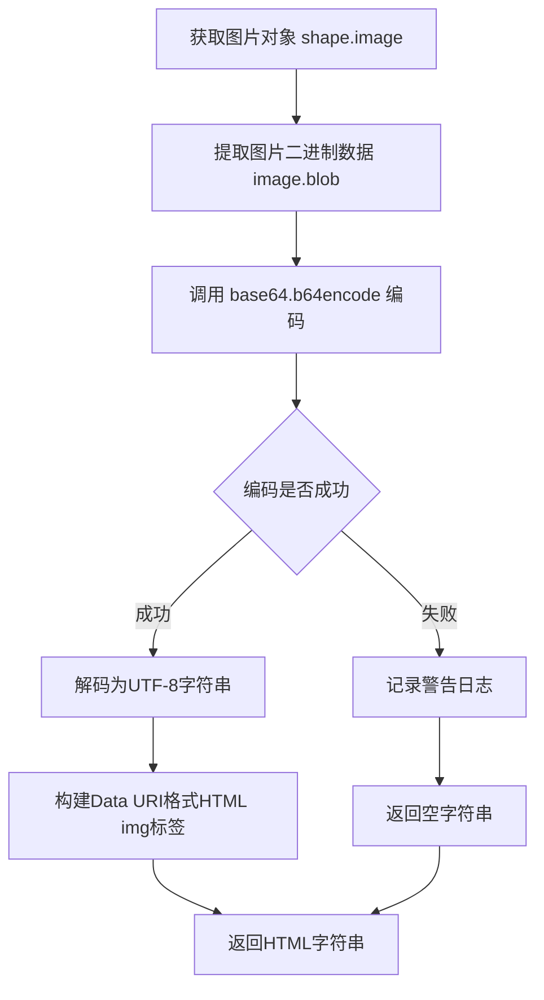

#### 带注释源码

```python
def _handle_image(self, shape) -> str:
    """
    Embeds the image as a base64  in HTML.
    将图片嵌入为Base64编码的HTML img标签
    """
    # 获取shape中的图片对象
    image = shape.image
    # 提取图片的原始二进制数据（blob）
    image_bytes = image.blob

    try:
        # 使用 base64.b64encode 将图片二进制数据编码为Base64格式
        # 参数：image_bytes - bytes类型，输入的二进制图片数据
        # 返回值：编码后的Base64字节串，需要decode转为字符串
        img_str = base64.b64encode(image_bytes).decode("utf-8")
        
        # 构建Data URI格式的src属性，格式：data:{content_type};base64,{data}
        # content_type 例如：image/png, image/jpeg 等
        return f""
    except Exception as e:
        # 捕获编码过程中的异常，记录警告日志
        logger.warning(f"Warning: image cannot be loaded by Pillow: {e}")
        return ""
```


### `weasyprint.CSS`

WeasyPrint 库中的 CSS 类，用于将 CSS 样式字符串转换为可应用的样式表对象，以便在 PDF 渲染时提供样式支持。

参数：

- `string`：`str`，CSS 样式字符串，包含要应用的 CSS 规则

返回值：`CSS` 对象，WeasyPrint 的样式表对象，可传递给 `write_pdf` 的 `stylesheets` 参数

#### 流程图

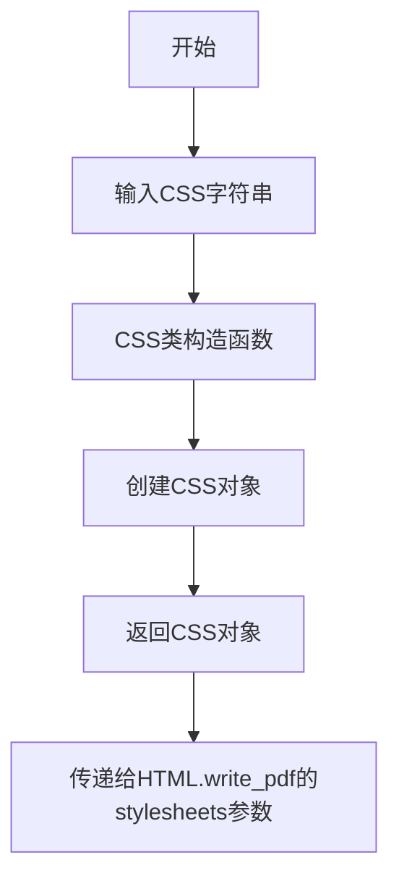

#### 带注释源码

```python
# 从weasyprint库导入CSS类
# 作用：将CSS样式字符串转换为WeasyPrint可用的样式表对象
from weasyprint import CSS, HTML

# 在代码中的实际使用：
# 创建CSS对象，string参数接收CSS样式字符串
# 该CSS对象将应用于PDF渲染过程中的样式设置
CSS(string=css), self.get_font_css()
```

---

### `weasyprint.HTML`

WeasyPrint 库中的 HTML 类，用于将 HTML 字符串解析为可渲染的文档对象，并提供将内容写入 PDF 文件的方法。

参数：

- `string`：`str`，要渲染的 HTML 内容字符串

返回值：`HTML` 文档对象，该对象具有 `write_pdf()` 方法用于输出 PDF

#### 流程图

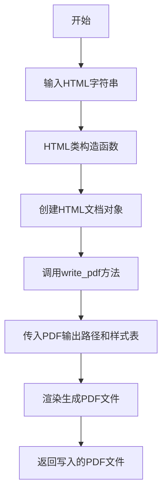

#### 带注释源码

```python
# 从weasyprint库导入HTML类
# 作用：解析HTML字符串并提供PDF输出功能
from weasyprint import CSS, HTML

# 在代码中的实际使用：
# 1. 创建HTML对象，string参数接收HTML内容字符串
# 2. 调用write_pdf方法将HTML渲染为PDF
HTML(string=html).write_pdf(
    self.temp_pdf_path,  # PDF输出路径
    stylesheets=[        # 样式表列表
        CSS(string=css),  # 自定义CSS样式
        self.get_font_css()  # 字体样式
    ]
)

# write_pdf方法参数说明：
# - 第一个参数：输出PDF文件的路径
# - stylesheets：可选参数，接收CSS样式表列表，用于控制PDF的渲染样式
```


### `pptx.Presentation`

这是从 `python-pptx` 库导入的 Presentation 类，用于解析 PowerPoint (.pptx) 文件。在代码中通过 `from pptx import Presentation` 导入，并使用 `Presentation(filepath)` 实例化来加载 PPTX 文件并遍历其幻灯片。

参数：无（此类通过导入语句引入，非直接调用）

返回值：`Presentation` 对象，表示打开的 PowerPoint 演示文稿，包含幻灯片集合

#### 流程图

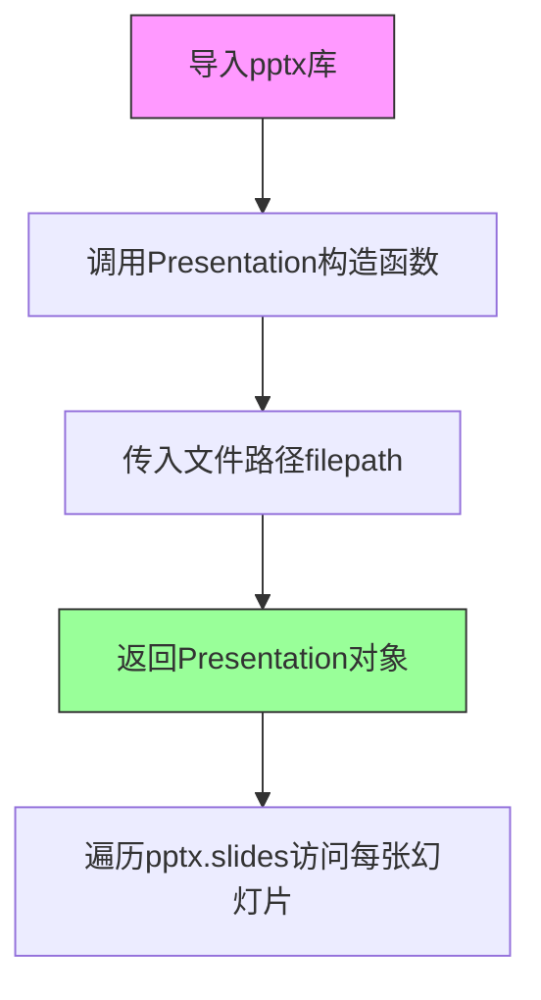

#### 带注释源码

```python
# 导入python-pptx库的Presentation类
from pptx import Presentation

# 在convert_pptx_to_pdf方法中使用
def convert_pptx_to_pdf(self, filepath):
    from weasyprint import CSS, HTML
    from pptx import Presentation  # 导入PPT解析库
    from pptx.enum.shapes import MSO_SHAPE_TYPE

    # 创建Presentation对象，传入PPT文件路径
    # 参数: filepath - str类型，PPT文件的绝对或相对路径
    # 返回值: Presentation对象，包含整个PPT的所有幻灯片
    pptx = Presentation(filepath)

    # 遍历PPT中的所有幻灯片
    # pptx.slides是一个幻灯片集合，可通过索引或迭代访问
    for slide_index, slide in enumerate(pptx.slides):
        # 处理每一张幻灯片的内容（形状、文本、表格、图片等）
        html_parts.append("<section>")
        if self.include_slide_number:
            html_parts.append(f"<h2>Slide {slide_index + 1}</h2>")

        # Process shapes in the slide
        for shape in slide.shapes:
            # ... 处理各种形状的逻辑
            pass
        
        html_parts.append("</section>")
    
    # 将HTML转换为PDF
    html = "\n".join(html_parts)
    HTML(string=html).write_pdf(
        self.temp_pdf_path, 
        stylesheets=[CSS(string=css), self.get_font_css()]
    )
```


### `MSO_SHAPE_TYPE`

`MSO_SHAPE_TYPE` 是从 `pptx.enum.shapes` 模块导入的形状类型枚举，用于标识 PowerPoint 中各种形状的类型（如组、图片、表格等）。在代码中主要用于判断当前处理的形状类型，以便采用不同的处理策略。

#### 参数

该函数/方法为枚举类，无传统意义上的参数，但其属性常用于比较：

- `shape_type`：`int` 或 `MSO_SHAPE_TYPE` 枚举值，PowerPoint 形状对象的类型属性

#### 返回值

返回 `MSO_SHAPE_TYPE` 枚举值，表示形状的具体类型。

#### 流程图

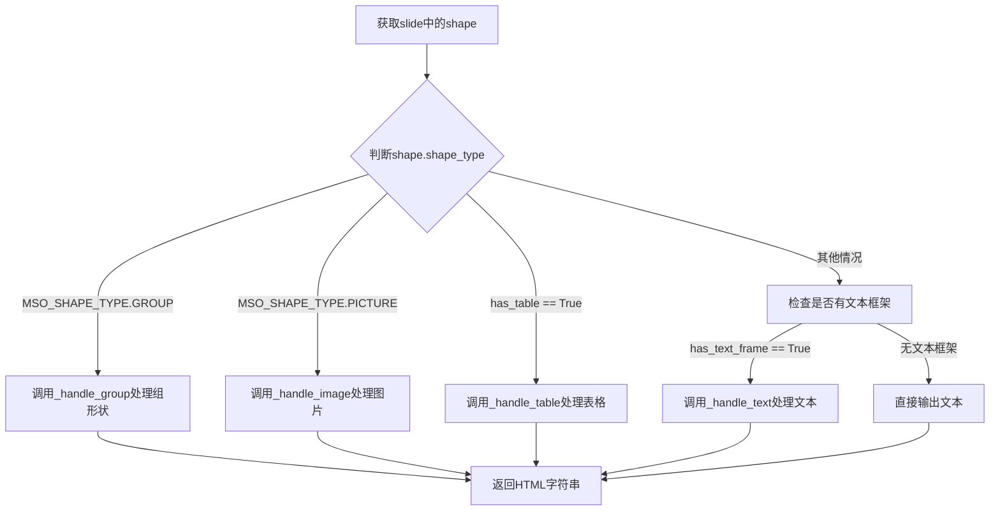

#### 带注释源码

```python
# 在 convert_pptx_to_pdf 方法中导入
from pptx.enum.shapes import MSO_SHAPE_TYPE

# 使用示例 1：判断是否为组形状
if shape.shape_type == MSO_SHAPE_TYPE.GROUP:
    html_parts.append(self._handle_group(shape))
    continue

# 使用示例 2：判断是否为图片
if shape.shape_type == MSO_SHAPE_TYPE.PICTURE:
    html_parts.append(self._handle_image(shape))
    continue

# 在 _handle_group 方法中同样使用
if shape.shape_type == MSO_SHAPE_TYPE.GROUP:
    group_parts.append(self._handle_group(shape))
    continue

if shape.shape_type == MSO_SHAPE_TYPE.PICTURE:
    group_parts.append(self._handle_image(shape))
    continue
```

#### 关键枚举成员说明

| 枚举成员 | 值 | 描述 |
|---------|-----|------|
| `MSO_SHAPE_TYPE.GROUP` | 8 | 组形状，可包含多个子形状 |
| `MSO_SHAPE_TYPE.PICTURE` | 14 | 图片形状 |
| `MSO_SHAPE_TYPE.AUTO_SHAPE` | 1 | 自动形状（基本形状） |
| `MSO_SHAPE_TYPE.TEXT_BOX` | 17 | 文本框 |
| `MSO_SHAPE_TYPE.TABLE` | 18 | 表格（通常通过 `has_table` 属性判断） |


### `PowerPointProvider.__init__`

该函数是类的构造函数，负责接收 PPTX 文件路径，创建一个临时的 PDF 文件用于存储转换结果，调用核心转换逻辑将 PPTX 渲染为 PDF，并最终通过父类初始化加载生成的 PDF 文档。

参数：

- `filepath`：`str`，输入的 PowerPoint 文件（.pptx）的完整路径。
- `config`：任意类型（`Any`），可选的配置对象，用于传递给底层的 PDF 提供者，默认为 `None`。

返回值：`None`，构造函数不返回值，主要通过修改实例状态完成初始化。

#### 流程图

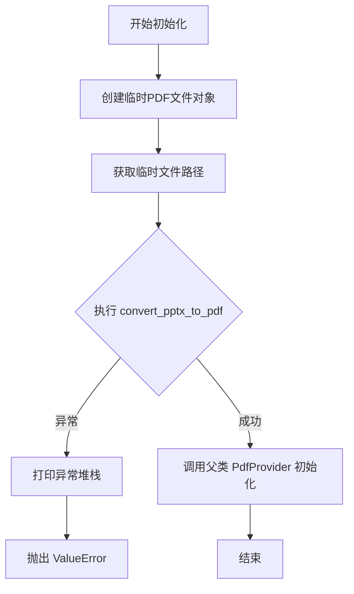

#### 带注释源码

```python
def __init__(self, filepath: str, config=None):
    # 创建一个临时的 PDF 文件，delete=False 确保在对象销毁前文件不会被系统自动删除
    # suffix=".pdf" 明确指定了临时文件的扩展名
    temp_pdf = tempfile.NamedTemporaryFile(delete=False, suffix=".pdf")
    # 将临时文件的路径保存为实例变量，供后续转换和渲染流程使用
    self.temp_pdf_path = temp_pdf.name
    # 关闭文件描述符，因为后续的 WeasyPrint 等库需要通过文件路径打开文件
    temp_pdf.close()

    # 将 PPTX 文件转换为 PDF 格式
    try:
        # 调用封装好的转换逻辑
        self.convert_pptx_to_pdf(filepath)
    except Exception as e:
        # 捕获转换过程中可能发生的任何异常（如文件损坏、库依赖问题等）
        # 打印完整的堆栈跟踪以便快速定位问题
        print(traceback.format_exc())
        # 抛出自定义 ValueError，告知上层调用者转换失败的具体原因
        raise ValueError(f"Error converting PPTX to PDF: {e}")

    # 初始化继承自 PdfProvider 的核心功能
    # 将转换生成的临时 PDF 文件路径传递给父类，完成 PDF 解析和渲染的准备工作
    super().__init__(self.temp_pdf_path, config)
```


### `PowerPointProvider.__del__`

析构函数，在对象生命周期结束时自动调用，负责清理在对象初始化过程中创建的临时PDF文件，防止磁盘空间泄漏。

参数：

- `self`：`PowerPointProvider`，PowerPointProvider 实例本身，包含临时文件路径等资源

返回值：`None`，无返回值，仅执行清理操作

#### 流程图

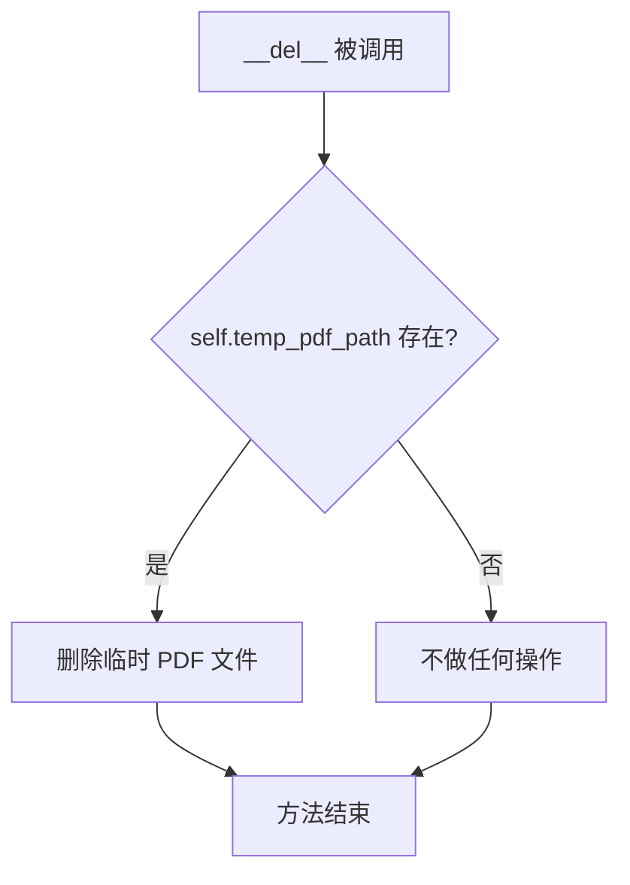

#### 带注释源码

```python
def __del__(self):
    """
    析构函数，在对象被垃圾回收时自动调用。
    负责清理 __init__ 方法中创建的临时 PDF 文件。
    
    注意：
    - 使用 os.path.exists() 检查文件是否存在，避免文件不存在时抛出异常
    - 临时文件在 __init__ 方法中使用 tempfile.NamedTemporaryFile 创建，
      delete=False 以确保可以手动控制文件生命周期
    """
    # 检查临时 PDF 文件路径是否存在
    if os.path.exists(self.temp_pdf_path):
        # 删除临时文件以释放磁盘空间
        os.remove(self.temp_pdf_path)
```


### `PowerPointProvider.convert_pptx_to_pdf`

该函数是 `PowerPointProvider` 类的核心转换方法，负责将 PowerPoint 文件（PPTX）转换为 PDF 格式。它通过遍历 PPTX 中的每张幻灯片和形状，将各种元素（文本、表格、图片、组合形状）转换为 HTML，然后使用 WeasyPrint 库将 HTML 渲染为 PDF 并保存到临时文件中。

参数：

- `self`：`PowerPointProvider` 实例，包含配置和临时文件路径
- `filepath`：`str`，输入的 PPTX 文件路径

返回值：无返回值（`None`），但会通过 WeasyPrint 将转换后的 PDF 写入 `self.temp_pdf_path` 指定的文件

#### 流程图

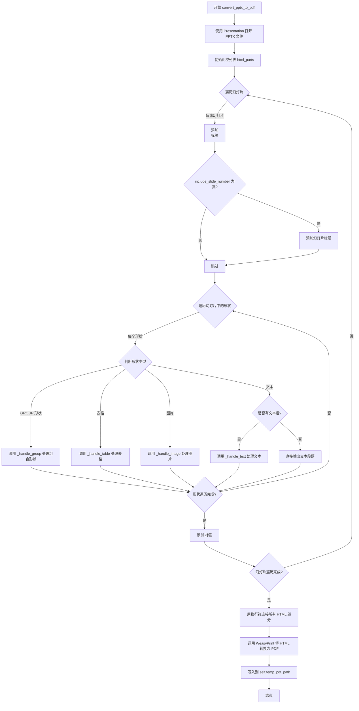

#### 带注释源码

```python
def convert_pptx_to_pdf(self, filepath):
    """
    将 PPTX 文件转换为 PDF 的核心方法。
    遍历所有幻灯片和形状，将其转换为 HTML，最后使用 WeasyPrint 渲染为 PDF。
    """
    # 导入所需的库：WeasyPrint 用于 HTML 到 PDF 的转换，python-pptx 用于读取 PPTX 文件
    from weasyprint import CSS, HTML
    from pptx import Presentation
    from pptx.enum.shapes import MSO_SHAPE_TYPE

    # 使用 python-pptx 打开 PPTX 文件
    pptx = Presentation(filepath)

    # 用于存储所有生成的 HTML 片段
    html_parts = []

    # 遍历 PPTX 中的所有幻灯片，enumerate 同时提供幻灯片索引
    for slide_index, slide in enumerate(pptx.slides):
        # 每张幻灯片用 <section> 标签包裹，形成独立的页面
        html_parts.append("<section>")
        
        # 如果配置了包含幻灯片编号，则在每张幻灯片前添加标题
        if self.include_slide_number:
            html_parts.append(f"<h2>Slide {slide_index + 1}</h2>")

        # 遍历当前幻灯片中的所有形状（元素）
        for shape in slide.shapes:
            # 处理组合形状：递归处理组内的所有子形状
            if shape.shape_type == MSO_SHAPE_TYPE.GROUP:
                html_parts.append(self._handle_group(shape))
                continue

            # 处理表格形状
            if shape.has_table:
                html_parts.append(self._handle_table(shape))
                continue

            # 处理图片形状
            if shape.shape_type == MSO_SHAPE_TYPE.PICTURE:
                html_parts.append(self._handle_image(shape))
                continue

            # 处理文本形状：区分有文本框和无文本框的情况
            if hasattr(shape, "text") and shape.text is not None:
                if shape.has_text_frame:
                    # 有文本框的形状（如标题、正文、列表等），调用专门的文本处理方法
                    html_parts.append(self._handle_text(shape))
                else:
                    # 无文本框的形状，直接输出文本段落
                    html_parts.append(f"<p>{self._escape_html(shape.text)}</p>")

        # 结束当前幻灯片的 HTML 标签
        html_parts.append("</section>")

    # 将所有 HTML 片段用换行符连接成完整的 HTML 文档
    html = "\n".join(html_parts)

    # 使用 WeasyPrint 将 HTML 转换为 PDF
    # 参数1: stylesheets 使用内置 CSS 定义页面格式（ A4 横向、边距、表格样式等）
    # 参数2: self.get_font_css() 获取自定义字体样式
    HTML(string=html).write_pdf(
        self.temp_pdf_path, stylesheets=[CSS(string=css), self.get_font_css()]
    )
```


### `PowerPointProvider._handle_group`

该方法负责递归遍历并处理 PowerPoint 中的组合形状（Group Shapes），将组内的每一个子形状（如文本、表格、图片或嵌套组）转换为其对应的 HTML 片段，最终拼接并返回包含整个组内容的 HTML 字符串。

参数：

- `self`：实例本身，由 `PowerPointProvider` 类管理。
- `group_shape`：`Shape` (python-pptx object)，表示 PPTX 中的一个组合形状（Group），包含 `shapes` 属性用于遍历其子形状。

返回值：`str`，返回由组内所有子形状HTML表示组成的字符串。

#### 流程图

```mermaid
flowchart TD
    A([开始处理组 _handle_group]) --> B[初始化 group_parts 列表]
    B --> C{遍历 group_shape.shapes 中的每个 shape}
    
    D{shape.shape_type == MSO_SHAPE_TYPE.GROUP?}
    C --> D
    
    D -->|是| E[递归调用 self._handle_group(shape)]
    E --> F[将返回的HTML片段追加到 group_parts]
    
    D -->|否| G{shape.has_table?}
    G -->|是| H[调用 self._handle_table(shape)]
    H --> F
    
    G -->|否| I{shape.shape_type == MSO_SHAPE_TYPE.PICTURE?}
    I -->|是| J[调用 self._handle_image(shape)]
    J --> F
    
    I -->|否| K{hasattr(shape, 'text')?}
    K -->|是| L{shape.has_text_frame?}
    
    L -->|是| M[调用 self._handle_text(shape)]
    M --> F
    
    L -->|否| N[生成 <p> 标签并转义文本]
    N --> F
    
    K -->|否| O[不做处理，继续下一个 shape]
    O --> C
    
    F --> C
    C -->|遍历结束| P[使用 "".join(group_parts) 拼接字符串]
    P --> Q([返回 HTML 字符串])
```

#### 带注释源码

```python
def _handle_group(self, group_shape) -> str:
    """
    Recursively handle shapes in a group. Returns HTML string for the entire group.
    递归处理组内的形状。返回整个组的HTML字符串。
    """
    # 局部导入 MSO_SHAPE_TYPE 以避免在模块顶部或性能敏感路径中的潜在冲突
    from pptx.enum.shapes import MSO_SHAPE_TYPE

    # 用于存储组内各个子形状转换后的HTML片段
    group_parts = []
    
    # 遍历该组中的所有子形状
    for shape in group_shape.shapes:
        # 1. 处理嵌套的组合形状（Group）
        # 如果当前 shape 仍然是一个组，则递归调用自身进行深度优先处理
        if shape.shape_type == MSO_SHAPE_TYPE.GROUP:
            group_parts.append(self._handle_group(shape))
            continue

        # 2. 处理表格
        if shape.has_table:
            group_parts.append(self._handle_table(shape))
            continue

        # 3. 处理图片
        if shape.shape_type == MSO_SHAPE_TYPE.PICTURE:
            group_parts.append(self._handle_image(shape))
            continue

        # 4. 处理文本
        # 检查该形状是否具有 text 属性（很多形状如矩形、线条都可能有）
        if hasattr(shape, "text"):
            # 如果它有复杂的文本框结构（paragraphs, runs），使用专用方法处理
            if shape.has_text_frame:
                group_parts.append(self._handle_text(shape))
            else:
                # 否则它可能只是一个简单的文本字符串，直接包装为段落
                group_parts.append(f"<p>{self._escape_html(shape.text)}</p>")

    # 将所有处理好的HTML片段拼接成一个完整的HTML字符串并返回
    return "".join(group_parts)
```


### `PowerPointProvider._handle_text`

该方法负责处理 PowerPoint 中的文本框形状（Shape），包括区分标题/副标题占位符、检测并转换项目符号列表和编号列表为 HTML 的 `<ul>`/`<ol>` 标签，以及将段落文本转换为相应的 HTML 标签。

参数：

- `self`：`PowerPointProvider`，调用此方法的 Provider 实例本身
- `shape`：`Shape`（python-pptx 中的 `pptx.shapes.Shape` 对象），需要处理的幻灯片形状对象，其 `text_frame` 属性包含要转换的文本内容

返回值：`str`，返回生成的 HTML 片段字符串，包含 `<h3>`、`<h4>`、`<p>`、`<ul>`、`<ol>`、`<li>` 等标签

#### 流程图

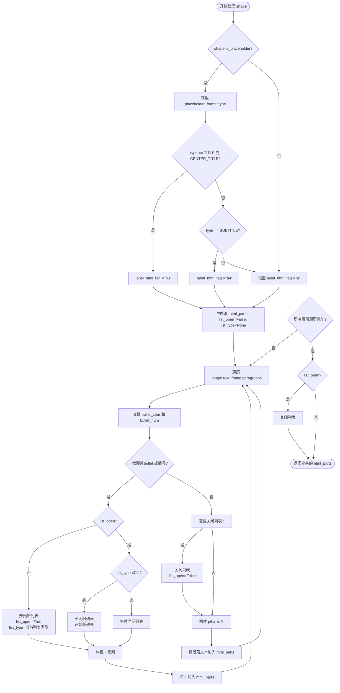

#### 带注释源码

```python
def _handle_text(self, shape) -> str:
    """
    Processes shape text, including bullet/numbered list detection and placeholders
    (title, subtitle, etc.). Returns HTML for the text block(s).
    """
    from pptx.enum.shapes import PP_PLACEHOLDER

    # 步骤1: 区分占位符类型，确定输出HTML标签
    # 默认使用 <p> 标签，如果检测到是占位符则根据类型升级为标题标签
    label_html_tag = "p"
    if shape.is_placeholder:
        # 获取占位符类型（TITLE, CENTER_TITLE, SUBTITLE 等）
        placeholder_type = shape.placeholder_format.type
        if placeholder_type in [PP_PLACEHOLDER.TITLE, PP_PLACEHOLDER.CENTER_TITLE]:
            label_html_tag = "h3"  # 标题使用 h3
        elif placeholder_type == PP_PLACEHOLDER.SUBTITLE:
            label_html_tag = "h4"  # 副标题使用 h4

    # 步骤2: 初始化列表状态跟踪变量
    # html_parts: 存储生成的 HTML 片段列表
    # list_open: 标记当前是否处于列表标签内部
    # list_type: 记录当前列表类型 ('ul' 或 'ol')
    html_parts = []
    list_open = False
    list_type = None  # "ul" or "ol"

    # 步骤3: 遍历文本框中的所有段落
    for paragraph in shape.text_frame.paragraphs:
        p_el = paragraph._element
        # 尝试查找项目符号字符或自动编号元素
        # bullet_char: 无序列表标记（如 •, ◦, ■ 等）
        # bullet_num: 有序列表编号（如 1., 2., a. 等）
        bullet_char = p_el.find(".//a:buChar", namespaces=p_el.nsmap)
        bullet_num = p_el.find(".//a:buAutoNum", namespaces=p_el.nsmap)

        # 判断当前段落是否为列表项
        # level > 0 表示多级列表的子级，也视为列表项
        is_bullet = (bullet_char is not None) or (paragraph.level > 0)
        is_numbered = bullet_num is not None

        # 步骤4a: 处理列表项（bullet 或 numbered）
        if is_bullet or is_numbered:
            # 确定当前列表类型
            current_list_type = "ol" if is_numbered else "ul"

            # 如果尚未打开列表，则开始新列表
            if not list_open:
                list_open = True
                list_type = current_list_type
                html_parts.append(f"<{list_type}>")

            # 如果已在列表中但类型改变（如从 ul 转为 ol），先关闭旧列表再开新列表
            elif list_open and list_type != current_list_type:
                html_parts.append(f"</{list_type}>")
                list_type = current_list_type
                html_parts.append(f"<{list_type}>")

            # 步骤5: 收集段落中所有 run 的文本构建列表项内容
            # run 是段落内的格式化文本片段
            p_text = "".join(run.text for run in paragraph.runs)
            if p_text:
                # 使用 _escape_html 转义特殊字符防止 XSS
                html_parts.append(f"<li>{self._escape_html(p_text)}</li>")

        # 步骤4b: 处理非列表段落
        else:
            # 如果之前处于列表中，需要先关闭列表标签
            if list_open:
                html_parts.append(f"</{list_type}>")
                list_open = False
                list_type = None

            # 收集段落文本
            p_text = "".join(run.text for run in paragraph.runs)
            if p_text:
                # 根据之前判断的占位符类型选择合适的 HTML 标签
                html_parts.append(
                    f"<{label_html_tag}>{self._escape_html(p_text)}</{label_html_tag}>"
                )

    # 步骤6: 处理循环结束后仍未关闭的列表（如最后一段是列表项）
    if list_open:
        html_parts.append(f"</{list_type}>")

    # 返回合并后的 HTML 字符串
    return "".join(html_parts)
```


### `PowerPointProvider._handle_image`

该方法负责将 PowerPoint 演示文稿中的图片形状对象转换为 HTML 格式的图片标签。它通过提取图片的二进制数据，进行 Base64 编码，并嵌入到 HTML 的 `` 标签的 `src` 属性中（Data URI 方案），从而实现无需外部文件即可在生成的 PDF 或 HTML 中渲染图片。

参数：

- `self`：`PowerPointProvider`，当前类的实例，包含转换逻辑和配置。
- `shape`：`object` (来自 `python-pptx` 库的 `Picture` 形状对象)，表示幻灯片中的图片对象。

返回值：`str`，返回包含 Base64 数据的 HTML `` 标签字符串；如果处理过程中发生异常（例如图片数据无法读取），则返回空字符串。

#### 流程图

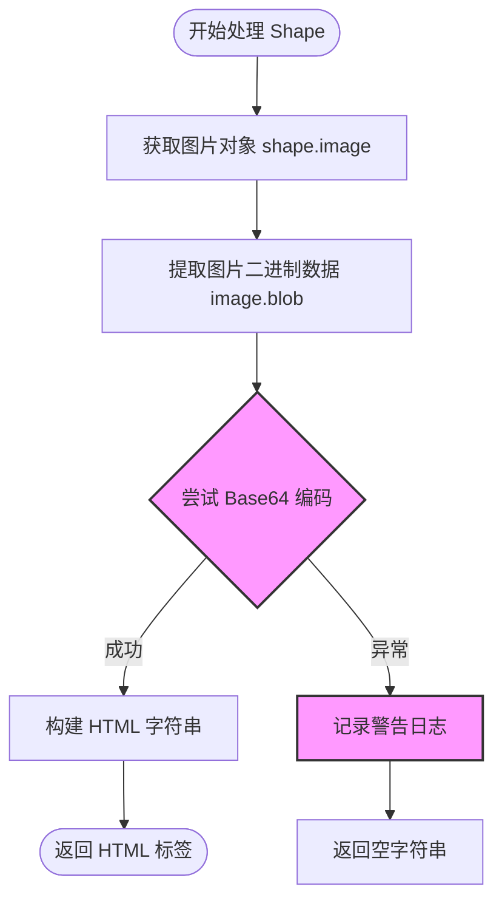

#### 带注释源码

```python
def _handle_image(self, shape) -> str:
    """
    Embeds the image as a base64  in HTML.
    """
    # 1. 从 pptx 的 shape 对象中获取图片对象
    # python-pptx 会自动解析 shape 并提供 image 属性
    image = shape.image
    
    # 2. 获取图片的原始二进制数据 (blob)
    image_bytes = image.blob

    try:
        # 3. 将二进制数据编码为 Base64 字符串
        # b64encode 返回 bytes，需要 decode 为 utf-8 字符串以便拼接
        img_str = base64.b64encode(image_bytes).decode("utf-8")
        
        # 4. 构建 Data URI 格式的 HTML img 标签
        # 格式: data:[MIME类型];base64,[数据]
        # image.content_type 通常是 'image/png', 'image/jpeg' 等
        return f""
    except Exception as e:
        # 5. 异常处理：如果图片数据损坏或格式不支持，记录警告并返回空字符串
        # 避免因为单张图片问题导致整个 PPT 转换失败
        logger.warning(f"Warning: image cannot be loaded by Pillow: {e}")
        return ""
```


### `PowerPointProvider._handle_table`

将 PowerPoint 幻灯片中的表格 shape 转换为 HTML `<table>` 标签，并返回对应的 HTML 字符串。

参数：

- `self`：`PowerPointProvider`，当前类的实例
- `shape`：`shape`（PowerPoint 表格对象），需要转换为 HTML 的 PowerPoint 表格 shape 对象

返回值：`str`，HTML 表格字符串

#### 流程图

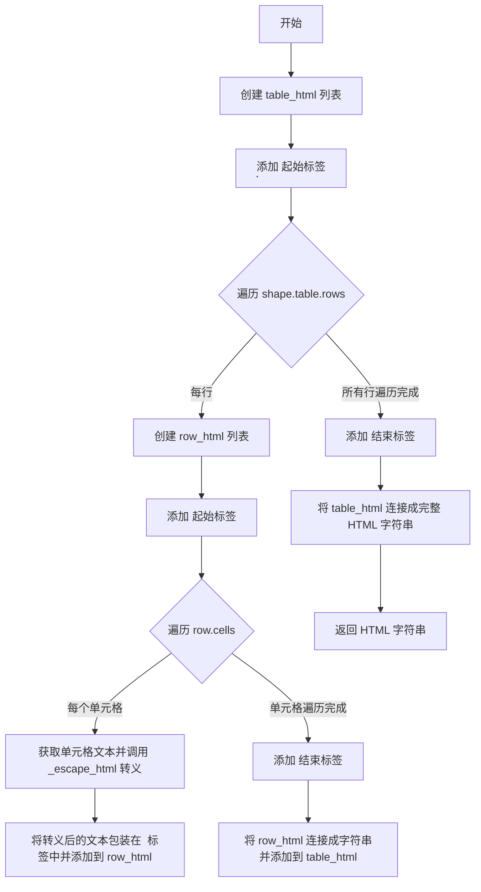

#### 带注释源码

```python
def _handle_table(self, shape) -> str:
    """
    Renders a shape's table as an HTML <table>.
    """
    # 创建一个列表用于存储表格的 HTML 片段
    table_html = []
    # 添加表格的起始标签，border='1' 用于显示边框
    table_html.append("<table border='1'>")

    # 遍历表格中的每一行
    for row in shape.table.rows:
        # 为每一行创建一个列表用于存储行的 HTML 片段
        row_html = ["<tr>"]
        # 遍历当前行的每一个单元格
        for cell in row.cells:
            # 获取单元格文本内容并进行 HTML 转义处理
            # 然后包装在 <td> 标签中添加到行 HTML 列表
            row_html.append(f"<td>{self._escape_html(cell.text)}</td>")
        # 添加行的结束标签
        row_html.append("</tr>")
        # 将该行的 HTML 片段连接成字符串并添加到表格 HTML 列表中
        table_html.append("".join(row_html))

    # 添加表格的结束标签
    table_html.append("</table>")
    # 将所有表格 HTML 片段连接成完整的 HTML 字符串并返回
    return "".join(table_html)
```


### `PowerPointProvider._escape_html`

对文本进行基础的 HTML 特殊字符转义，防止在生成的 HTML 中出现 XSS 攻击或标签错误。

参数：

- `text`：`str`，需要进行 HTML 转义的原始文本

返回值：`str`，转义后的 HTML 安全文本

#### 流程图

```mermaid
flowchart TD
    A[开始] --> B[接收 text 参数]
    B --> C{检查 text 是否为空}
    C -->|是| D[返回空字符串]
    C -->|否| E[替换 & 为 &amp;]
    E --> F[替换 < 为 &lt;]
    F --> G[替换 > 为 &gt;]
    G --> H[替换 " 为 &quot;]
    H --> I[替换 ' 为 &#39;]
    I --> J[返回转义后的字符串]
```

#### 带注释源码

```python
def _escape_html(self, text: str) -> str:
    """
    Minimal escaping for HTML special characters.
    将特殊 HTML 字符转义为对应的 HTML 实体，防止 XSS 攻击
    """
    return (
        text.replace("&", "&amp;")      # 转义 & 符号为 &amp;
        .replace("<", "&lt;")           # 转义 < 符号为 &lt;
        .replace(">", "&gt;")           # 转义 > 符号为 &gt;
        .replace('"', "&quot;")         # 转义双引号为 &quot;
        .replace("'", "&#39;")          # 转义单引号为 &#39;
    )
```

## 关键组件


### PowerPointProvider 类

核心类，继承自 PdfProvider，负责将 PowerPoint (.pptx) 文件转换为 PDF 格式。内部先通过 python-pptx 解析 PPTX 幻灯片为 HTML，再使用 WeasyPrint 将 HTML 渲染为 PDF。

### 转换流程引擎 (convert_pptx_to_pdf 方法)

主导转换流程，遍历 PPTX 中的所有幻灯片，将每张幻灯片的各种元素（形状、表格、图片、文本）递归处理为 HTML 片段，最后使用 WeasyPrint 将拼接后的 HTML 转换为 PDF 文件。

### 组形状递归处理器 (_handle_group 方法)

递归处理 PowerPoint 中的组形状（Group Shapes），遍历组内的每个子形状，根据子形状的类型（表格、图片、文本或其他）调用相应的处理方法，最终返回组合后的 HTML 字符串。

### 文本与列表处理器 (_handle_text 方法)

解析形状中的文本框内容，区分占位符类型（标题、副标题等）为 HTML 标签，自动检测段落是否为项目符号列表或编号列表，并正确生成对应的 `<ul>`、`<ol>`、`<li>` 标签，同时处理 HTML 特殊字符转义。

### 图片嵌入器 (_handle_image 方法)

提取形状中的图片二进制数据，使用 base64 编码将图片转换为 Data URL 格式，生成可直接嵌入 HTML 的 `` 标签，支持多种图片格式。

### 表格渲染器 (_handle_table 方法)

将 PowerPoint 表格转换为 HTML `<table>` 元素，遍历表格的行和单元格，提取文本内容并使用 `_escape_html` 进行转义处理。

### HTML 转义工具 (_escape_html 方法)

提供基本的 HTML 特殊字符转义功能，将 `&`、`<`、`>`、`"`、`'` 转换为对应的 HTML 实体，防止 XSS 攻击和渲染异常。

### CSS 样式定义模块

预定义的 CSS 样式字符串，包含页面设置（A4 横向、边距）、表格样式（边框、折叠）、图片样式（最大宽度自适应）等，用于 PDF 渲染时的样式应用。

### 临时文件管理模块

在初始化时创建临时 PDF 文件，在析构方法 `__del__` 中自动清理临时文件，确保转换过程中产生的中间文件被正确删除。


## 问题及建议


### 已知问题

-   **临时文件清理风险**：在`__init__`中如果`convert_pptx_to_pdf`抛出异常，临时PDF文件不会被清理。异常处理中没有删除已创建的`self.temp_pdf_path`。
-   **资源释放不可靠**：依赖`__del__`方法删除临时文件，但`__del__`不保证在所有情况下都会被调用（如程序异常终止）。
-   **重复导入**：在多个方法内部重复导入`weasyprint`、`pptx`等第三方库，每次调用都会执行导入操作，影响性能。
-   **HTML转义不完整**：`_escape_html`方法未处理换行符`\n`和`\r`，可能导致文本在PDF中显示为连续字符串，缺乏换行。
-   **表格功能受限**：仅支持基本表格，不支持合并/拆分单元格，代码直接访问`cell.text`会丢失单元格格式。
-   **文本格式丢失**：`_handle_text`方法仅提取纯文本，未处理字体样式（粗体、斜体、下划线）、颜色、字号等属性。
-   **形状支持有限**：未处理图表、SmartArt、形状（自选图形）、音频/视频等非文本/图片/表格元素。
-   **错误处理不一致**：`_handle_image`捕获异常后返回空字符串并仅记录警告，可能导致静默失败难以调试；而其他方法可能直接抛出异常。

### 优化建议

-   **使用上下文管理器**：实现`__enter__`和`__exit__`方法，或使用`tempfile`的高级API（如`tempfile.TemporaryDirectory`）确保资源确定性清理。
-   **移动导入到模块顶部**：将`weasyprint`、`pptx`等库的导入移到文件头部或类外部，避免重复导入开销。
-   **完善HTML转义**：在`_escape_html`中添加`.replace("\n", "<br>").replace("\r", "")`处理换行符。
-   **增强表格支持**：检查`cell.merge_cells`属性以处理合并单元格，或至少记录警告提示不支持的格式。
-   **添加文本样式提取**：扩展`_handle_text`方法，使用`paragraph.runs`中的格式信息生成`<strong>`、`<em>`、`<span style="...">`等HTML标签。
-   **统一错误处理策略**：对不支持的形状记录详细警告而非静默跳过，将关键转换错误汇总后统一报告。
-   **外部化配置**：将CSS样式提取为独立文件或配置项，便于维护和定制。
-   **添加配置验证**：在`__init__`中检查`filepath`是否存在且为有效的PPTX文件。

## 其它


### 设计目标与约束

设计目标：将 PowerPoint（.pptx）文件转换为 PDF 格式，支持文本、表格、图片、组形状等元素的完整转换，并提供可配置的页面样式。

约束条件：
- 输入文件必须为有效的 .pptx 格式
- 依赖 weasyprint、python-pptx 等外部库
- 转换过程需要创建临时 PDF 文件
- 不支持 PPT 旧版本格式（仅支持 .pptx）

### 错误处理与异常设计

异常类型：
- ValueError：PPTX 文件转换失败或输入文件无效
- FileNotFoundError：输入文件不存在
- IOError：临时文件创建或写入失败
- weasyprint 异常：HTML 到 PDF 转换失败

处理策略：
- 转换前验证文件存在性
- 转换过程中捕获异常并打印堆栈信息
- 临时文件在对象销毁时自动清理
- 图像加载失败时记录警告日志并返回空字符串

### 数据流与状态机

数据流：
1. 接收 PPTX 文件路径
2. 创建临时 PDF 文件
3. 使用 python-pptx 解析 PPTX
4. 遍历幻灯片和形状，转换为 HTML 片段
5. 拼接完整 HTML 文档
6. 使用 weasyprint 将 HTML 转换为 PDF
7. 返回 PDF provider 供后续使用

状态机：
- 初始化状态：创建临时文件
- 解析状态：遍历 PPTX 内容
- 转换状态：HTML 到 PDF 转换
- 完成状态：PDF provider 初始化完成

### 外部依赖与接口契约

外部依赖：
- weasyprint：HTML 到 PDF 转换
- python-pptx：PPTX 文件解析
- marker.providers.pdf：PdfProvider 基类
- marker.logger：日志记录

接口契约：
- 构造函数：接收 filepath (str) 和可选 config
- 公共方法：convert_pptx_to_pdf(filepath) - 执行转换
- 私有方法：_handle_group、_handle_text、_handle_image、_handle_table、_escape_html
- 输出：通过继承的 PdfProvider 提供 PDF 内容

### 安全性考虑

- HTML 转义：_escape_html 方法处理特殊字符，防止 XSS
- 文件路径：使用 tempfile.NamedTemporaryFile 创建临时文件
- 资源清理：__del__ 方法确保临时文件被删除
- 图像处理：异常捕获防止损坏图像导致转换失败

### 性能考虑

- 临时文件：使用 delete=False 避免跨平台问题
- 字符串拼接：使用列表追加最后 join，减少内存碎片
- 图像处理：直接读取二进制 blob，避免重复 IO

### 兼容性考虑

- 平台依赖：weasyprint 依赖 GTK，在 Windows/Linux 下需单独安装
- Python 版本：需 Python 3.8+
- PPTX 版本：支持 Office Open XML 格式的 PPTX
- 字体支持：依赖系统字体，通过 get_font_css() 获取

### 配置说明

配置项：
- include_slide_number：布尔值，是否在每个幻灯片前显示标题
- CSS 样式：内置 A4 横向页面样式、表格样式、图片样式
- temp_pdf_path：临时 PDF 文件路径

### 依赖库说明

主要依赖：
- weasyprint>=60.0：HTML/CSS 到 PDF 转换
- python-pptx>=0.6.21：PPTX 文件解析
- Pillow：图像处理
- lxml：XML 解析

### 使用示例

```python
# 基本使用
provider = PowerPointProvider("presentation.pptx")

# 包含幻灯片编号
provider = PowerPointProvider("presentation.pptx", config={"include_slide_number": True})

# 获取 PDF 内容
pdf_content = provider.get_pdf_content()
```

    