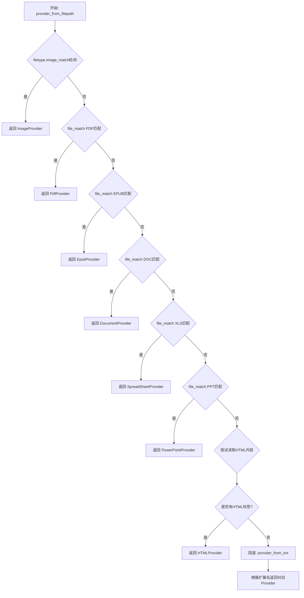

# `marker\marker\providers\registry.py` 详细设计文档

该模块是一个文档类型检测与Provider选择器，通过文件扩展名或文件内容（魔数）自动识别文档类型（PDF、图片、Word、Excel、PowerPoint、EPUB、HTML等），并返回对应的文档处理Provider类，支持基于扩展名的回退检测机制。

## 整体流程



## 类结构

```
无类定义
├── 全局变量
│   └── DOCTYPE_MATCHERS
└── 全局函数
    ├── load_matchers
    ├── load_extensions
    ├── provider_from_ext
    └── provider_from_filepath
```

## 全局变量及字段


### `DOCTYPE_MATCHERS`
    
文档类型与匹配器类的映射字典

类型：`dict`
    


    

## 全局函数及方法


### `load_matchers`

根据给定的文档类型（doctype）从预定义的 `DOCTYPE_MATCHERS` 字典中获取对应的匹配器类列表，并将每个类实例化后返回实例列表。该函数是文件类型检测系统的核心组件，用于动态加载不同文档类型对应的匹配器。

参数：

- `doctype`：`str`，文档类型标识符，用于在 `DOCTYPE_MATCHERS` 字典中查找对应的匹配器类。可选值包括 "image"、"pdf"、"epub"、"doc"、"xls"、"ppt" 等。

返回值：`list`，返回匹配器类的实例列表。每个元素都是对应文档类型匹配器类的实例对象。

#### 流程图

```mermaid
flowchart TD
    A[开始] --> B[输入 doctype 参数]
    B --> C[在 DOCTYPE_MATCHERS 字典中查找]
    C --> D{doctype 是否存在?}
    D -->|是| E[获取对应的类列表]
    D -->|否| F[抛出 KeyError]
    E --> G[遍历类列表]
    G --> H[实例化当前类: cls()]
    H --> I{是否还有更多类?}
    I -->|是| G
    I -->|否| J[返回实例列表]
    J --> K[结束]
    
    style F fill:#ffcccc
```

#### 带注释源码

```python
def load_matchers(doctype: str):
    """
    根据文档类型加载匹配器实例列表
    
    参数:
        doctype: 文档类型字符串，如 "pdf", "epub", "doc", "xls", "ppt", "image"
    
    返回:
        匹配器类的实例列表
    """
    # 从预定义的 DOCTYPE_MATCHERS 字典中获取对应文档类型的类列表
    # 然后使用列表推导式将每个类实例化
    # 例如: doctype="pdf" -> [archive.Pdf()]
    return [cls() for cls in DOCTYPE_MATCHERS[doctype]]
```


### `load_extensions`

根据指定的文档类型（doctype），从预定义的`DOCTYPE_MATCHERS`字典中获取对应的文件类型类，并提取这些类的文件扩展名（EXTENSION）属性，最终返回该文档类型支持的所有文件扩展名列表。

参数：

- `doctype`：`str`，文档类型标识符，用于指定要获取扩展名的类型（如"image"、"pdf"、"epub"、"doc"、"xls"、"ppt"）

返回值：`List[str]`，返回指定文档类型对应的所有文件扩展名列表

#### 流程图


#### 带注释源码

```python
def load_extensions(doctype: str):
    """
    根据文档类型加载对应的文件扩展名列表
    
    参数:
        doctype: str - 文档类型标识符，如"image"、"pdf"、"epub"、"doc"、"xls"、"ppt"
    
    返回:
        List[str] - 指定文档类型支持的文件扩展名列表
    """
    # 从DOCTYPE_MATCHERS字典中获取doctype对应的类列表
    # 然后遍历这些类，提取每个类的EXTENSION属性
    # 例如: doctype="pdf" -> [archive.Pdf] -> [".pdf"]
    #      doctype="doc" -> [document.Docx] -> [".docx"]
    return [cls.EXTENSION for cls in DOCTYPE_MATCHERS[doctype]]
```


### `provider_from_ext`

根据文件扩展名推断并返回对应的文档处理 Provider 类型。该函数通过提取文件路径的扩展名，与预定义的扩展名映射表进行匹配，识别常见的文档格式（如图片、PDF、Word、Excel、PowerPoint、EPUB、HTML），并返回相应的 Provider 类。如果扩展名未知或为空，则默认返回 PDF Provider。

参数：

- `filepath`：`str`，待处理的文档文件路径

返回值：`type`，返回对应的 Provider 类（如 `ImageProvider`、`PdfProvider`、`DocumentProvider`、`SpreadSheetProvider`、`PowerPointProvider`、`EpubProvider`、`HTMLProvider`），若无法识别则返回 `PdfProvider` 作为默认选项

#### 流程图


#### 带注释源码

```python
def provider_from_ext(filepath: str):
    """
    根据文件扩展名推断并返回对应的 Provider 类型
    
    参数:
        filepath: str - 文档文件的路径
        
    返回:
        type - 对应的 Provider 类
    """
    # 使用 rsplit 分割路径，提取最后一个 "." 后的部分作为扩展名
    ext = filepath.rsplit(".", 1)[-1].strip()
    
    # 如果文件没有扩展名（空字符串），默认返回 PDF Provider
    if not ext:
        return PdfProvider

    # 根据扩展名逐一匹配并返回对应的 Provider 类
    # 匹配图片扩展名 -> 返回 ImageProvider
    if ext in load_extensions("image"):
        return ImageProvider
    
    # 匹配 PDF 扩展名 -> 返回 PdfProvider
    if ext in load_extensions("pdf"):
        return PdfProvider
    
    # 匹配 Word 文档扩展名 -> 返回 DocumentProvider
    if ext in load_extensions("doc"):
        return DocumentProvider
    
    # 匹配 Excel 扩展名 -> 返回 SpreadSheetProvider
    if ext in load_extensions("xls"):
        return SpreadSheetProvider
    
    # 匹配 PowerPoint 扩展名 -> 返回 PowerPointProvider
    if ext in load_extensions("ppt"):
        return PowerPointProvider
    
    # 匹配 EPUB 扩展名 -> 返回 EpubProvider
    if ext in load_extensions("epub"):
        return EpubProvider
    
    # 显式匹配 HTML 扩展名 -> 返回 HTMLProvider
    if ext in ["html"]:
        return HTMLProvider

    # 如果所有扩展名都不匹配，返回 PDF Provider 作为兜底方案
    return PdfProvider
```


### `provider_from_filepath`

根据文件内容检测文件类型，并返回对应的 Provider 类的核心函数。它通过文件魔数（magic bytes）识别图片、PDF、EPUB、DOC、XLS、PPT 等常见文档格式，若均无法识别则尝试解析为 HTML，最终降级为基于扩展名的判断。

参数：

- `filepath`：`str`，待检测的文件的完整路径

返回值：`type`（Provider 类），返回与文件类型匹配的 Provider 类（如 `ImageProvider`、`PdfProvider`、`EpubProvider`、`DocumentProvider`、`SpreadSheetProvider`、`PowerPointProvider`、`HTMLProvider`），若均不匹配则返回基于扩展名推断的 Provider

#### 流程图


#### 带注释源码

```python
def provider_from_filepath(filepath: str):
    """
    根据文件内容检测文件类型并返回对应的 Provider 类。
    
    检测优先级：
    1. 图片（通过文件魔数）
    2. PDF（通过文件魔数）
    3. EPUB（通过文件魔数）
    4. DOCX（通过文件魔数）
    5. XLSX（通过文件魔数）
    6. PPTX（通过文件魔数）
    7. HTML（尝试解析为 HTML）
    8. 基于文件扩展名推断（降级方案）
    
    Args:
        filepath: 待检测的文件的完整路径
        
    Returns:
        与文件类型匹配的 Provider 类
    """
    # 1. 通过文件魔数检测图片类型
    if filetype.image_match(filepath) is not None:
        return ImageProvider
    
    # 2. 通过文件魔数检测 PDF 文档
    if file_match(filepath, load_matchers("pdf")) is not None:
        return PdfProvider
    
    # 3. 通过文件魔数检测 EPUB 电子书
    if file_match(filepath, load_matchers("epub")) is not None:
        return EpubProvider
    
    # 4. 通过文件魔数检测 DOCX 文档
    if file_match(filepath, load_matchers("doc")) is not None:
        return DocumentProvider
    
    # 5. 通过文件魔数检测 XLSX 表格
    if file_match(filepath, load_matchers("xls")) is not None:
        return SpreadSheetProvider
    
    # 6. 通过文件魔数检测 PPTX 演示文稿
    if file_match(filepath, load_matchers("ppt")) is not None:
        return PowerPointProvider

    # 7. 尝试将文件作为 HTML 解析
    try:
        with open(filepath, "r", encoding="utf-8") as f:
            soup = BeautifulSoup(f.read(), "html.parser")
            # 检查是否存在 HTML 标签
            if bool(soup.find()):
                return HTMLProvider
    except Exception:
        # 文件读取失败或编码问题，静默跳过
        pass

    # 8. 降级方案：根据文件扩展名推断类型
    # Fallback if we incorrectly detect the file type
    return provider_from_ext(filepath)
```

## 关键组件


### DOCTYPE_MATCHERS

定义了文档类型与filetype库中对应类型类的映射字典，用于识别不同格式的文档（如image、pdf、epub、doc、xls、ppt等）。

### load_matchers

根据传入的文档类型字符串，加载并返回对应的filetype匹配器实例列表的函数。

### load_extensions

根据传入的文档类型字符串，从对应的filetype类中提取文件扩展名并返回列表的函数。

### provider_from_ext

根据文件扩展名推断文档类型并返回相应Provider类的函数，是文件类型检测的快速路径。

### provider_from_filepath

根据文件内容（通过filetype库进行二进制匹配）或HTML标签检测来识别文档类型并返回对应Provider类的主函数，是核心的类型检测逻辑。

### DocumentProvider

处理Word文档（.docx）的Provider类。

### EpubProvider

处理EPUB电子书的Provider类。

### HTMLProvider

处理HTML文档的Provider类。

### ImageProvider

处理图片文件的Provider类。

### PdfProvider

处理PDF文档的Provider类。

### PowerPointProvider

处理PowerPoint演示文稿（.pptx）的Provider类。

### SpreadSheetProvider

处理电子表格（.xlsx）的Provider类。


## 问题及建议


### 已知问题

-   **重复计算性能开销**：`load_matchers` 和 `load_extensions` 函数每次调用都会重新生成匹配器实例和扩展名列表，在 `provider_from_ext` 中多次调用 `load_extensions` 导致重复计算
-   **缺乏缓存机制**：DOCTYPE_MATCHERS 字典中的类每次都需要通过 `cls()` 实例化，没有预先创建或缓存
-   **异常处理过于宽泛且无日志**：在 `provider_from_filepath` 中使用 `except Exception: pass` 静默吞掉所有异常，无法追踪错误原因
-   **文件内容读取可能导致大文件问题**：使用 `f.read()` 一次性读取整个文件到内存，对于大型 HTML 文件可能造成内存溢出
-   **类型检测顺序可能影响准确性**：按照固定顺序检测文件类型，当文件符合多种类型时可能返回非最优 Provider
-   **缺少日志记录**：整个模块没有任何日志输出，调试和问题排查困难
-   **Provider 导入未使用类型注解**：虽然导入了多个 Provider 类，但函数返回类型只标注为类对象，未使用具体的 Provider 类型
-   **HTML 检测方式不够健壮**：仅通过 `soup.find()` 判断是否包含 HTML 标签，无法区分有效 HTML 和包含 HTML 片段的文本文件

### 优化建议

-   **引入缓存机制**：使用 `@lru_cache` 装饰器或预先生成并缓存 `load_matchers` 和 `load_extensions` 的结果
-   **优化文件读取**：对于 HTML 检测，可以使用 `f.read(8192)` 读取文件开头部分进行检测，避免加载整个文件
-   **改进异常处理**：记录具体异常信息到日志，使用更具体的异常类型捕获（如 `UnicodeDecodeError`、`FileNotFoundError`）
-   **添加日志记录**：引入 logging 模块，在关键节点添加日志，便于问题排查
-   **优化类型检测顺序**：根据文件大小、常见程度等因素调整检测顺序，或允许配置优先级
-   **完善类型注解**：为函数返回类型添加具体的 Provider 类型注解，提高代码可读性和 IDE 支持
-   **提取魔法字符串**：将 `"html"` 等硬编码字符串提取为常量，避免拼写错误

## 其它


### 设计目标与约束

**设计目标**：实现一个灵活的文件类型自动检测与Provider映射系统，能够根据文件扩展名或文件内容（Magic Bytes）自动识别文档类型（PDF、EPUB、DOCX、XLSX、PPTX、HTML、Image等），并返回对应的文档处理Provider。

**设计约束**：
- 依赖外部库 `filetype` 进行MIME类型匹配
- 依赖 `BeautifulSoup` 进行HTML文件内容检测
- 必须与marker框架中的各个Provider类（PdfProvider、EpubProvider、DocumentProvider等）配合使用
- 文件读取失败时不应中断程序，需有容错机制

### 错误处理与异常设计

**异常处理策略**：
- 文件读取异常：在 `provider_from_filepath` 函数中，使用 try-except 捕获文件读取异常，异常发生时静默忽略并继续尝试其他检测方式
- 文件不存在或无法打开时：通过异常捕获避免程序崩溃
- 类型匹配失败：使用fallback机制，当所有检测方式都无法识别时，默认返回 `PdfProvider`

**容错机制**：
- 当文件扩展名为空时，默认返回 `PdfProvider`
- 当Magic Bytes检测失败时，fallback到基于扩展名的检测
- HTML检测异常时不影响其他类型检测

### 数据流与状态机

**数据流程**：
```
输入: filepath (文件路径)
  ↓
[步骤1] 尝试Magic Bytes检测 (filetype.image_match/file_match)
  ↓ 成功 → 返回对应Provider
  ↓ 失败 →
[步骤2] 尝试HTML内容检测 (BeautifulSoup解析)
  ↓ 成功 → 返回HTMLProvider
  ↓ 失败 →
[步骤3] Fallback到扩展名检测 (provider_from_ext)
  ↓
输出: 对应的Provider类
```

**状态说明**：
- 检测优先级：Magic Bytes检测 > HTML内容检测 > 扩展名检测
- 无复杂状态机设计，属于线性流程

### 外部依赖与接口契约

**外部依赖库**：
- `filetype`：用于基于文件内容的MIME类型检测
- `filetype.types`：包含archive、document、IMAGE等类型定义
- `BeautifulSoup` (bs4)：用于HTML文件内容解析和标签检测

**Provider接口契约**：
- 所有Provider类必须实现文档处理接口（具体接口定义需参考marker框架）
- 各Provider类：ImageProvider、PdfProvider、EpubProvider、DocumentProvider、SpreadSheetProvider、PowerPointProvider、HTMLProvider

**导入依赖**：
- 本模块作为marker.providers的内部模块被导入使用

### 性能考虑

**潜在性能问题**：
- 每次调用 `load_matchers(doctype)` 都会创建新的实例列表，无缓存机制
- `provider_from_filepath` 中每次都重新加载matchers，可能导致重复计算
- HTML检测时需要读取整个文件内容并解析，对于大文件可能有性能影响

**优化建议**：
- 考虑对 `DOCTYPE_MATCHERS` 的实例化结果进行缓存
- HTML检测可以优化为只读取文件开头部分进行标签检测

### 安全性考虑

**文件操作安全**：
- 文件读取使用UTF-8编码，避免编码问题
- 异常捕获防止文件不存在或无权限时的程序崩溃
- 未对文件路径进行安全校验（如路径遍历攻击防护）

**建议改进**：
- 添加文件路径安全校验，防止路径遍历
- 对大文件进行大小限制，避免内存耗尽

### 扩展性设计

**扩展方式**：
- 在 `DOCTYPE_MATCHERS` 字典中添加新的文档类型映射
- 在检测流程中添加新的检测逻辑分支

**开放封闭原则**：
- 当前设计对扩展开放（可添加新类型），对修改封闭（新增类型不影响现有逻辑）
- 可通过注册机制进一步解耦Provider映射关系

### 兼容性设计

**Python版本兼容性**：
- 使用类型注解（Python 3.5+）
- 使用f-string（Python 3.6+）

**依赖库版本要求**：
- `filetype` 库需支持 `image_match` 和 `file_match` 函数
- `BeautifulSoup` 需支持 `html.parser`

### 测试策略建议

**测试覆盖点**：
- 各文件类型的Magic Bytes检测
- 扩展名检测的各种边界情况（无扩展名、特殊字符扩展名等）
- HTML内容检测的有效性和准确性
- Fallback机制的正确性
- 异常情况下的容错行为

**建议测试用例**：
- 有效文件类型的正确识别
- 损坏文件或非标准文件的处理
- 空文件、只读文件的处理
- Provider返回类型的正确性验证

    