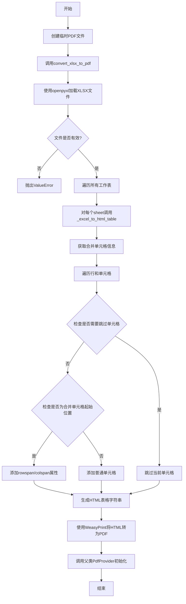
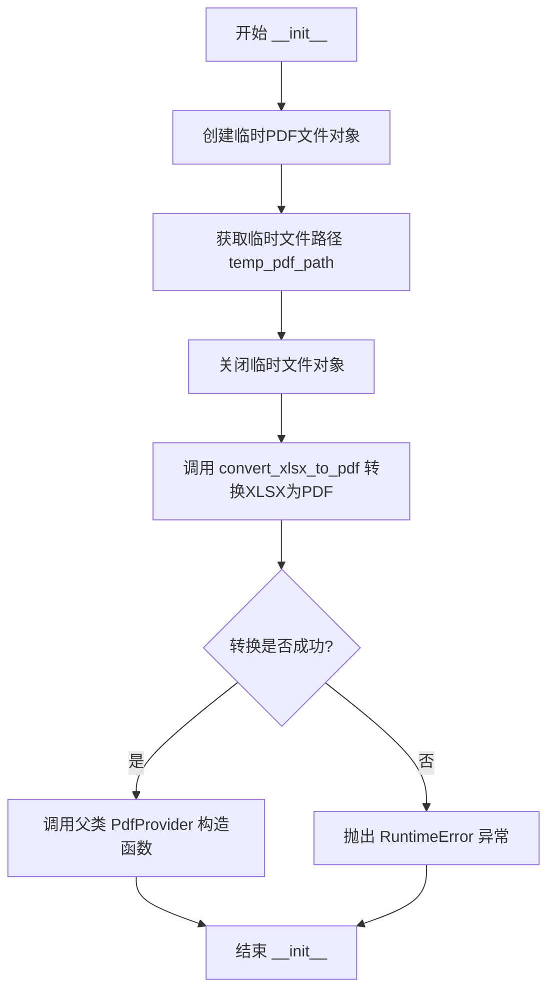
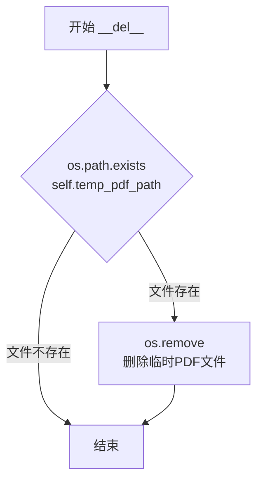
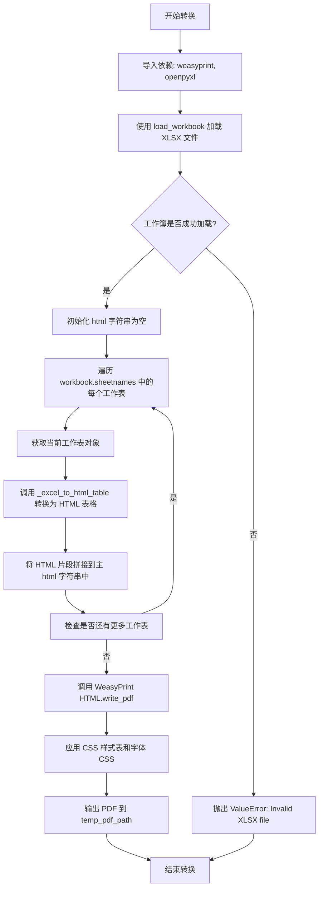
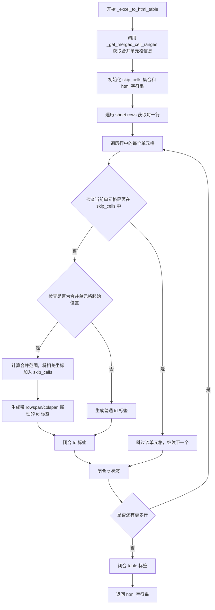

# `marker\marker\providers\spreadsheet.py` 详细设计文档

该代码实现了一个SpreadSheetProvider类，继承自PdfProvider，用于将Excel文件(.xlsx)转换为PDF格式。核心功能包括读取XLSX文件、解析每个工作表、转换为HTML表格、处理合并单元格，并使用WeasyPrint库将HTML渲染为PDF。

## 整体流程



## 类结构

```
PdfProvider (基类)
└── SpreadSheetProvider (子类)
```

## 全局变量及字段


### `css`
    
全局CSS样式定义,用于PDF页面布局和表格样式

类型：`str`
    


### `SpreadSheetProvider.temp_pdf_path`
    
临时PDF文件的完整路径

类型：`str`
    


### `SpreadSheetProvider.config`
    
PDF处理配置参数(继承自父类)

类型：`Any`
    
    

## 全局函数及方法


### `SpreadSheetProvider.__init__`

该方法是 `SpreadSheetProvider` 类的构造函数，主要功能是接收 XLSX 文件路径和可选配置，创建一个临时 PDF 文件，将 XLSX 文档转换为 PDF 格式，然后使用转换后的 PDF 路径初始化父类 `PdfProvider`。

参数：

- `filepath`：`str`，输入的 XLSX 文件路径，需要被转换为 PDF
- `config`：任意类型，可选配置参数，传递给父类 `PdfProvider` 的配置

返回值：无返回值（构造函数）

#### 流程图



#### 带注释源码

```python
def __init__(self, filepath: str, config=None):
    # 创建一个临时的 PDF 文件对象，delete=False 保持文件在程序结束后不被自动删除
    temp_pdf = tempfile.NamedTemporaryFile(delete=False, suffix=f".pdf")
    # 获取临时文件的完整路径，供后续转换和父类初始化使用
    self.temp_pdf_path = temp_pdf.name
    # 关闭临时文件对象，确保文件句柄释放
    temp_pdf.close()

    # 将 XLSX 文件转换为 PDF 格式
    try:
        # 调用 convert_xlsx_to_pdf 方法执行转换
        self.convert_xlsx_to_pdf(filepath)
    except Exception as e:
        # 转换失败时抛出运行时错误，包含原始异常信息
        raise RuntimeError(f"Failed to convert {filepath} to PDF: {e}")

    # 使用转换后的临时 PDF 文件路径初始化父类 PdfProvider
    # 将 self 绑定到父类，使当前对象具有 PDF 处理能力
    super().__init__(self.temp_pdf_path, config)
```


### SpreadSheetProvider.__del__

析构方法，在 SpreadSheetProvider 对象被垃圾回收时自动调用，清理在初始化过程中创建的临时 PDF 文件，释放磁盘空间。

参数：

- `self`： SpreadSheetProvider 实例，隐式参数，表示当前对象

返回值：`None`，无返回值

#### 流程图



#### 带注释源码

```
def __del__(self):
    """
    析构方法，在对象被销毁时自动调用
    负责清理临时PDF文件，避免磁盘空间泄漏
    """
    # 检查临时PDF文件是否存在
    if os.path.exists(self.temp_pdf_path):
        # 如果存在，则删除该临时文件
        os.remove(self.temp_pdf_path)
```

---

#### 关联信息补充

**关键组件**：

- `self.temp_pdf_path`：临时 PDF 文件的路径，在 `__init__` 中创建

**潜在技术债务/优化点**：

1. **异常安全性**：当前 `__del__` 方法未处理 `os.remove` 可能抛出的异常（如权限问题），建议添加 `try-except` 保护
2. **文件泄漏风险**：如果程序在 `convert_xlsx_to_pdf` 失败时异常退出，`temp_pdf_path` 可能已被创建但未被清理（因为 `super().__init__` 不会调用），建议在异常处理块中提前清理
3. **依赖 GC**：析构方法的调用时机依赖 Python 垃圾回收器，在某些情况下可能不会立即执行，建议使用上下文管理器或显式清理方法作为补充


### `SpreadSheetProvider.convert_xlsx_to_pdf`

将 XLSX（Excel）文件转换为 PDF 格式，通过读取 Excel 工作簿，遍历所有工作表，将每个工作表的内容转换为 HTML 表格，最后使用 WeasyPrint 库将 HTML 内容渲染为 PDF 文件并保存到临时路径。

参数：

- `filepath`：`str`，需要转换的 XLSX 文件的完整路径

返回值：`None`，无返回值（PDF 文件通过 side effect 写入 `self.temp_pdf_path`）

#### 流程图



#### 带注释源码

```python
def convert_xlsx_to_pdf(self, filepath: str):
    """
    将 XLSX（Excel）文件转换为 PDF 格式
    
    参数:
        filepath: XLSX 文件的路径
    
    返回:
        无返回值，PDF 内容通过 side effect 写入 self.temp_pdf_path
    """
    # 导入依赖库
    # weasyprint: 用于将 HTML 转换为 PDF
    # openpyxl: 用于读取 Excel 文件
    from weasyprint import CSS, HTML
    from openpyxl import load_workbook

    # 初始化 HTML 字符串，用于累积所有工作表的 HTML 内容
    html = ""
    
    # 使用 openpyxl 加载 Excel 工作簿
    # load_workbook 会读取整个 XLSX 文件到内存中
    workbook = load_workbook(filepath)
    
    # 检查工作簿是否成功加载
    if workbook is not None:
        # 遍历所有工作表名称
        for sheet_name in workbook.sheetnames:
            # 根据名称获取工作表对象
            sheet = workbook[sheet_name]
            
            # 构建工作表的 HTML 片段
            # 包含工作表名称作为标题（h1）
            # 加上转换后的表格内容
            html += f'<div><h1>{sheet_name}</h1>' + self._excel_to_html_table(sheet) + '</div>'
    else:
        # 工作簿加载失败，抛出异常
        raise ValueError("Invalid XLSX file")

    # 使用 WeasyPrint 将 HTML 转换为 PDF
    # string=html: 输入的 HTML 字符串
    # write_pdf: 输出 PDF 文件的方法
    # stylesheets: 应用 CSS 样式，包括：
    #   - CSS(string=css): 全局 CSS 样式定义（页面尺寸、表格样式等）
    #   - self.get_font_css(): 获取字体相关的 CSS（继承自 PdfProvider）
    HTML(string=html).write_pdf(
        self.temp_pdf_path,  # 输出 PDF 的目标路径（临时文件）
        stylesheets=[CSS(string=css), self.get_font_css()]
    )
```


### `SpreadSheetProvider._get_merged_cell_ranges`

该方法是一个静态方法，用于从给定的Excel工作表对象中提取所有合并单元格的范围信息，包括起始坐标、行跨度和列跨度，并返回一个字典结构供后续HTML表格转换使用。

参数：

-  `sheet`：`worksheet`（openpyxl工作表对象），需要提取合并单元格范围的Excel工作表

返回值：`dict`，返回一个字典，键为元组`(row, col)`表示合并区域的起始单元格坐标，值为包含`rowspan`（行跨度）、`colspan`（列跨度）和`range`（合并范围对象）信息的字典

#### 流程图

```mermaid
flowchart TD
    A[开始] --> B[接收 sheet 参数]
    B --> C[初始化空字典 merged_info]
    C --> D{遍历 sheet.merged_cells.ranges}
    D --> E[获取合并范围的边界 bounds]
    E --> F[解包: min_col, min_row, max_col, max_row]
    F --> G[计算 rowspan = max_row - min_row + 1]
    G --> H[计算 colspan = max_col - min_col + 1]
    H --> I[构建合并信息字典]
    I --> J[以 (min_row, min_col) 为键存入 merged_info]
    J --> K{是否还有更多合并范围?}
    K -->|是| D
    K -->|否| L[返回 merged_info 字典]
    L --> M[结束]
```

#### 带注释源码

```python
@staticmethod
def _get_merged_cell_ranges(sheet):
    """
    从Excel工作表中提取合并单元格的范围信息
    
    参数:
        sheet: openpyxl的工作表对象
        
    返回:
        dict: 键为(start_row, start_col)元组，值为包含rowspan、colspan和range的字典
    """
    # 初始化存储合并单元格信息的字典
    merged_info = {}
    
    # 遍历工作表中所有的合并单元格范围
    for merged_range in sheet.merged_cells.ranges:
        # 获取合并范围的边界坐标 (最小列, 最小行, 最大列, 最大行)
        min_col, min_row, max_col, max_row = merged_range.bounds
        
        # 计算行跨度（合并的行数）
        rowspan = max_row - min_row + 1
        
        # 计算列跨度（合并的列数）
        colspan = max_col - min_col + 1
        
        # 以合并区域的起始单元格坐标(min_row, min_col)为键
        # 存储包含rowspan、colspan和原始range对象的字典
        merged_info[(min_row, min_col)] = {
            'rowspan': rowspan,
            'colspan': colspan,
            'range': merged_range  # 保留原始的合并范围对象供后续使用
        }
    
    # 返回合并单元格信息字典
    return merged_info
```


### `SpreadSheetProvider._excel_to_html_table`

该方法负责将 openpyxl 的工作表对象转换为 HTML 表格字符串，支持合并单元格的正确渲染，通过追踪需要跳过的单元格来处理跨行跨列的合并区域。

参数：

- `sheet`：`openpyxl.worksheet.worksheet.Worksheet`，openpyxl 工作表对象，包含需要转换的行列数据

返回值：`str`，生成的 HTML 表格字符串，包含完整的 `<table>` 标签及所有行、单元格及其属性

#### 流程图



#### 带注释源码

```python
def _excel_to_html_table(self, sheet):
    """
    将 openpyxl 工作表对象转换为 HTML 表格字符串
    
    参数:
        sheet: openpyxl 工作表对象
    
    返回:
        HTML 表格字符串
    """
    # 获取工作表中的所有合并单元格信息
    # 返回格式: {(row, col): {'rowspan': int, 'colspan': int, 'range': MergedCellRange}}
    merged_cells = self._get_merged_cell_ranges(sheet)

    # 初始化 HTML 表格标签
    html = f'<table>'

    # 创建集合追踪因合并而需要跳过的单元格坐标
    # 当一个单元格是合并区域的一部分时，其坐标会被加入此集合
    skip_cells = set()

    # 遍历工作表的所有行，enumerate 从 1 开始计数以便与 Excel 坐标对应
    for row_idx, row in enumerate(sheet.rows, 1):
        # 开始新的表格行
        html += '<tr>'
        # 遍历当前行的所有单元格
        for col_idx, cell in enumerate(row, 1):
            # 如果当前单元格坐标在 skip_cells 中，说明它是某个合并单元格的一部分
            # 因此需要跳过渲染
            if (row_idx, col_idx) in skip_cells:
                continue

            # 检查当前单元格是否是合并区域的起始位置
            merge_info = merged_cells.get((row_idx, col_idx))
            if merge_info:
                # 计算合并范围内的所有坐标，将非起始位置的坐标加入 skip_cells
                for r in range(row_idx, row_idx + merge_info['rowspan']):
                    for c in range(col_idx, col_idx + merge_info['colspan']):
                        # 排除起始坐标本身，它需要被渲染
                        if (r, c) != (row_idx, col_idx):
                            skip_cells.add((r, c))

                # 获取单元格值，若为 None 则使用空字符串
                value = cell.value if cell.value is not None else ''
                # 生成带有 rowspan 和 colspan 属性的 td 标签
                html += f'<td rowspan="{merge_info["rowspan"]}" colspan="{merge_info["colspan"]}">{value}'
            else:
                # 普通单元格，直接生成 td 标签
                value = cell.value if cell.value is not None else ''
                html += f'<td>{value}'

            # 闭合 td 标签
            html += '</td>'
        # 闭合 tr 标签
        html += '</tr>'
    # 闭合 table 标签
    html += '</table>'
    return html
```

## 关键组件


### SpreadSheetProvider 类

主转换类，继承自 PdfProvider，负责将 XLSX（Excel）文件转换为 PDF 格式，内部管理临时 PDF 文件的生命周期。

### convert_xlsx_to_pdf 方法

核心转换方法，使用 openpyxl 读取 Excel 文件，遍历所有工作表，将每个工作表转换为 HTML 表格，然后使用 WeasyPrint 将 HTML 渲染为 PDF。

### _excel_to_html_table 方法

将 Excel 工作表转换为 HTML 表格字符串的方法，处理合并单元格的 rowspan 和 colspan 属性，生成符合 CSS 样式要求的表格结构。

### _get_merged_cell_ranges 静态方法

静态辅助方法，用于解析 Excel 工作表中的合并单元格区域，计算每个合并范围的起始位置、行跨度和列跨度信息。

### CSS 样式定义

用于 PDF 渲染的 CSS 样式表，定义了页面尺寸为 A4 横向、表格边框折叠、单元格内边距和边框样式，以及防止表格在页面中间断裂的规则。

### 临时文件管理组件

使用 tempfile.NamedTemporaryFile 创建临时 PDF 文件，在对象销毁时自动清理临时文件，确保资源不泄漏。

### XLSX 到 PDF 转换管道

完整的数据流管道：XLSX 文件 → openpyxl 解析 → HTML 表格生成 → WeasyPrint PDF 渲染 → 临时 PDF 文件 → PdfProvider 进一步处理。


## 问题及建议


### 已知问题

- **资源未正确释放**：`workbook` 对象在使用后没有关闭，可能导致文件句柄泄漏
- **临时文件清理风险**：`__del__` 方法中如果 `os.remove()` 失败会静默失败，且在程序异常退出时可能无法保证清理
- **缺少日志记录**：没有任何日志输出，调试困难，难以追踪转换失败的原因
- **HTML 转义缺失**：单元格值直接插入 HTML，未对特殊字符（如 `<`, `>`, `&` 等）进行转义，可能导致 HTML 渲染错误或 XSS 漏洞
- **字符串拼接效率低**：使用 `+=` 进行大量 HTML 字符串拼接，O(n²) 复杂度，应使用列表 join 方式
- **依赖方法未定义**：`self.get_font_css()` 调用未在本类中定义，依赖父类实现但无保证
- **异常信息不够具体**：仅捕获 Exception 并抛出 RuntimeError，丢失了原始异常类型信息
- **空表格处理**：当 sheet 为空时仍会生成空的 `<table>` 标签

### 优化建议

- 使用上下文管理器或显式调用 `workbook.close()` 确保资源释放
- 改用 `try-finally` 或 `atexit` 模块确保临时文件清理
- 添加 `logging` 模块记录转换进度和错误信息
- 引入 `html.escape()` 对单元格值进行转义
- 使用列表存储 HTML 片段，最后用 `''.join()` 合并
- 添加对 `get_font_css()` 方法的显式调用或文档说明
- 针对不同异常类型进行分层捕获和处理
- 在生成表格前检查 sheet 是否为空

## 其它


### 设计目标与约束

设计目标：实现一个将XLSX文件转换为PDF的Provider类，继承自PdfProvider，提供Excel到PDF的完整转换能力，支持多Sheet处理、合并单元格识别和自定义样式输出。约束：仅支持.xlsx格式，不支持.xls旧格式；PDF输出固定为A4横向布局；依赖WeasyPrint和openpyxl库。

### 错误处理与异常设计

RuntimeError：XLSX转PDF过程中发生的任何异常都会包装为RuntimeError并携带原始错误信息；ValueError：当检测到无效的XLSX文件（workbook为None）时抛出；FileNotFoundError：当输入文件不存在时由openpyxl抛出并传播；IOError：临时文件创建或删除失败时抛出。所有异常均向上层调用者传播，不在本类内部吞掉异常。

### 数据流与状态机

状态机包含三个状态：初始化状态（创建临时PDF文件）→ 转换状态（XLSX转HTML再转PDF）→ 就绪状态（PDFProvider初始化完成）。数据流：输入文件路径 → openpyxl加载workbook → 遍历每个sheet → _excel_to_html_table转换为HTML表格 → WeasyPrint写入PDF → 临时PDF路径传递给父类PdfProvider。

### 外部依赖与接口契约

openpyxl：用于读取.xlsx文件，接口为load_workbook(filepath)；WeasyPrint：用于HTML转PDF，接口为HTML(string).write_pdf()；marker.providers.pdf.PdfProvider：父类，接收PDF路径和config初始化；CSS(string)：WeasyPrint的CSS解析接口；tempfile.NamedTemporaryFile：用于创建临时PDF文件。

### 安全性考虑

临时文件使用NamedTemporaryFile创建，__del__方法在对象销毁时清理临时文件；文件路径直接传递给openpyxl，需确保调用方传入合法路径；无用户输入直接处理，不存在注入风险；临时文件路径泄露风险较低，因使用系统临时目录且关闭后立即删除。

### 性能考虑

对于大型Excel文件，load_workbook会一次性加载所有数据到内存，大文件可能导致内存占用过高；每个sheet的HTML字符串拼接使用+=操作，大量行时效率较低，建议使用list.join()优化；临时文件在转换完成后立即被父类使用，不会长时间占用磁盘空间；合并单元格处理使用set存储skip_cells，空间复杂度为O(合并单元格数)。

### 兼容性考虑

openpyxl支持读取.xlsx格式，不支持.xls格式；WeasyPrint依赖GTK+库，在Windows和Linux上需单独安装对应依赖；CSS样式中的break-inside、page-break-inside属性对PDF分页有影响，部分PDF阅读器兼容性可能不同；Python版本需支持3.7+。

### 测试策略

单元测试：测试_get_merged_cell_ranges对各种合并情况的处理；测试_excel_to_html_table输出HTML格式正确性；测试convert_xlsx_to_pdf对空文件、无效文件的异常抛出。集成测试：测试完整XLSX到PDF转换流程，验证输出PDF可读且内容正确；测试多Sheet文件转换；测试包含合并单元格的表格转换。

### 部署要求

部署环境需安装Python 3.7+；需安装openpyxl、weasyprint依赖；需安装WeasyPrint的系统依赖（GTK+、Pango等）；建议在虚拟环境中部署以隔离依赖版本冲突。

### 监控与日志

当前代码无日志记录，建议添加logging模块记录转换开始、结束、异常信息；可监控convert_xlsx_to_pdf的执行时间用于性能分析；__del__中删除临时文件失败时应记录警告日志而非抛出异常。

### 版本兼容性

WeasyPrint版本需>=52.0以支持最新的CSS特性；openpyxl版本需>=2.6以支持merged_cells.ranges的bounds属性；marker库版本需与PdfProvider接口兼容。


    