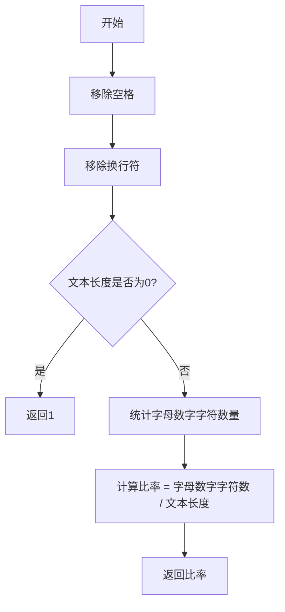

# `marker\marker\providers\utils.py` 详细设计文档

该代码实现了一个计算文本中字母数字字符占比的函数，通过移除空格和换行符后统计字母数字字符的数量，计算其占总字符数的比例，若文本为空则返回1。

## 整体流程



## 类结构

```
该代码无类层次结构，仅包含一个全局函数
```

## 全局变量及字段


    

## 全局函数及方法


### `alphanum_ratio`

该函数用于计算给定文本中字母数字字符（a-z, A-Z, 0-9）占总字符数的比率，通过去除空格和换行符后统计字母数字字符数量并除以有效字符总数得到比率值。

参数：

- `text`：`str`，需要计算字母数字比率的文本字符串

返回值：`float`，返回字母数字字符占总字符数的比例，范围为0到1之间；如果文本为空则返回1

#### 流程图

```mermaid
flowchart TD
    A([开始]) --> B[接收text参数]
    B --> C[去除空格 ' ' 和换行符 '\n']
    C --> D[遍历字符统计字母数字字符数量]
    D --> E{文本长度是否为0}
    E -->|是| F[返回1]
    E -->|否| G[计算比率 = alphanumeric_count / len(text)]
    F --> H([返回结果])
    G --> H
```

#### 带注释源码

```python
def alphanum_ratio(text):
    """
    计算文本中字母数字字符占总字符数的比率
    
    参数:
        text: str，输入的文本字符串
    
    返回:
        float，字母数字字符占比，范围0-1；空文本返回1
    """
    
    # 第一步：去除所有空格字符
    text = text.replace(" ", "")
    
    # 第二步：去除所有换行符
    text = text.replace("\n", "")
    
    # 第三步：统计字母数字字符的数量
    # isalnum() 方法用于判断字符是否为字母或数字
    alphanumeric_count = sum([1 for c in text if c.isalnum()])
    
    # 第四步：检查处理后的文本是否为空
    if len(text) == 0:
        # 空文本返回1，表示100%为字母数字（约定俗成）
        return 1
    
    # 第五步：计算字母数字字符占比
    ratio = alphanumeric_count / len(text)
    
    # 返回计算得到的比率
    return ratio
```


## 关键组件


### alphanum_ratio 函数

计算文本中字母数字字符所占的比例，通过去除空格和换行后统计字母数字字符数量并除以总字符数得到比例值。

### 文本预处理组件

去除字符串中的所有空格和换行符，为后续字符统计做准备。

### 字母数字计数组件

遍历处理后的文本，统计其中字母数字字符（isalnum()返回True）的数量。

### 比例计算组件

计算字母数字字符数与总字符数的比值，当文本为空时返回1。

### 边界处理组件

处理空字符串情况，避免除零错误。


## 问题及建议


### 已知问题

-   输入验证缺失：未对参数 `text` 进行 None 或非字符串类型的检查，可能导致运行时错误
-   字符串替换效率低：连续调用两次 `str.replace()` 会创建两个中间字符串，内存开销较大
-   计算方式不够简洁：使用列表推导式 `[1 for c in text if c.isalnum()]` 再求和，可优化为生成器表达式
-   空字符串处理逻辑不一致：先移除空格和换行符后再判断长度，但空文本返回 1 的设计缺乏业务逻辑支撑（空文本返回 1 可能造成语义混淆）
-   浮点数精度未考虑：除法运算未处理边界情况，虽极少出现但缺乏健壮性

### 优化建议

-   添加输入类型检查：在函数开头添加 `if not isinstance(text, str): raise TypeError("text must be a string")`
-   使用 `str.translate()` 一次性移除多个字符：创建转换表 `table = str.maketrans('', '', ' \n')` 后调用 `text.translate(table)`
-   改用生成器表达式：`sum(1 for c in text if c.isalnum())` 避免创建中间列表
-   重新审视空文本返回值：考虑返回 0.0 或抛出异常，使函数行为更符合直觉
-   考虑使用 `Decimal` 模块处理高精度计算需求（如金融场景）


## 其它


### 设计目标与约束

该函数用于计算文本中字母数字字符所占的比例，核心目标是提供一个简单的度量指标，用于判断文本的"字母数字密度"。主要约束包括：输入必须为字符串类型，返回值范围为0到1之间的浮点数，空字符串返回1。

### 错误处理与异常设计

当前实现未进行显式的输入类型检查。如果输入不是字符串类型，可能会引发AttributeError。设计建议：添加类型检查，当输入不是字符串时抛出TypeError或自动转换为字符串处理。空字符串处理已实现，返回1是合理的默认值。

### 数据流与状态机

该函数为纯函数，无状态机设计。数据流简单明确：输入字符串 → 移除空格和换行 → 计算字母数字字符数 → 计算比例 → 返回结果。无副作用，符合函数式编程原则。

### 外部依赖与接口契约

该函数为独立函数，无外部依赖。接口契约：输入参数text为字符串，返回值为浮点数（0到1之间）。调用方需确保输入为字符串类型。

### 性能考量

当前实现的时间复杂度为O(n)，其中n为文本长度。空间复杂度为O(n)，因为replace操作会创建新字符串。性能优化方向：可以使用列表推导式和sum的生成器表达式减少中间对象创建，或使用正则表达式一次性处理。

### 安全性考虑

该函数不涉及用户输入验证、权限控制或敏感数据处理，安全性风险较低。但需注意：如果用于处理外部输入，应先进行输入 sanitization，防止潜在的特殊字符问题。

### 边界条件处理

已处理边界情况：空字符串返回1。潜在边界情况：纯空格或换行符的字符串会返回1（全字母数字比例）；仅包含字母数字字符的字符串返回1；包含emoji或其他Unicode字符时，isalnum()的行为可能因Python版本而异。

### 使用示例

基本用法：alphanum_ratio("Hello123") 返回 1.0；混合字符：alphanum_ratio("Hello World!") 返回约 0.6；空字符串：alphanum_ratio("") 返回 1.0。

### 测试策略

建议测试用例包括：正常混合字符串、空字符串、仅空格字符串、仅字母数字字符串、仅特殊字符字符串、包含换行符的字符串、包含Unicode字符（如中文、emoji）的字符串、大型字符串的性能测试。

### 版本历史

当前版本为1.0.0，为初始实现版本。

    