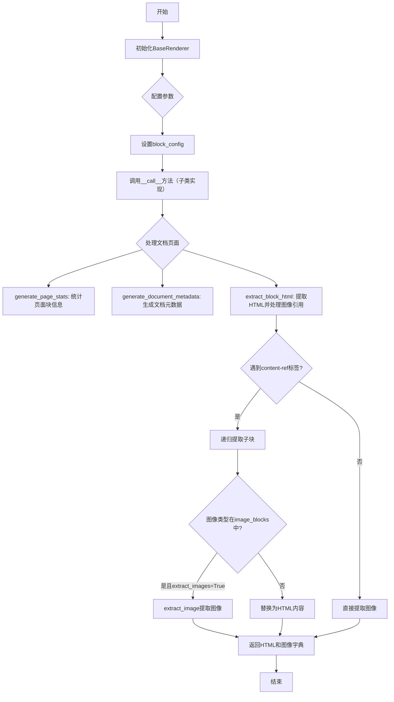
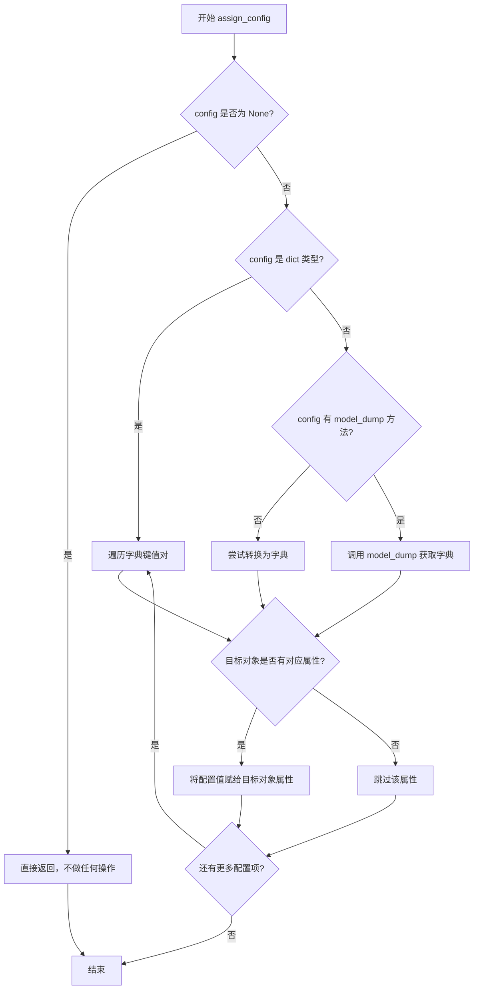
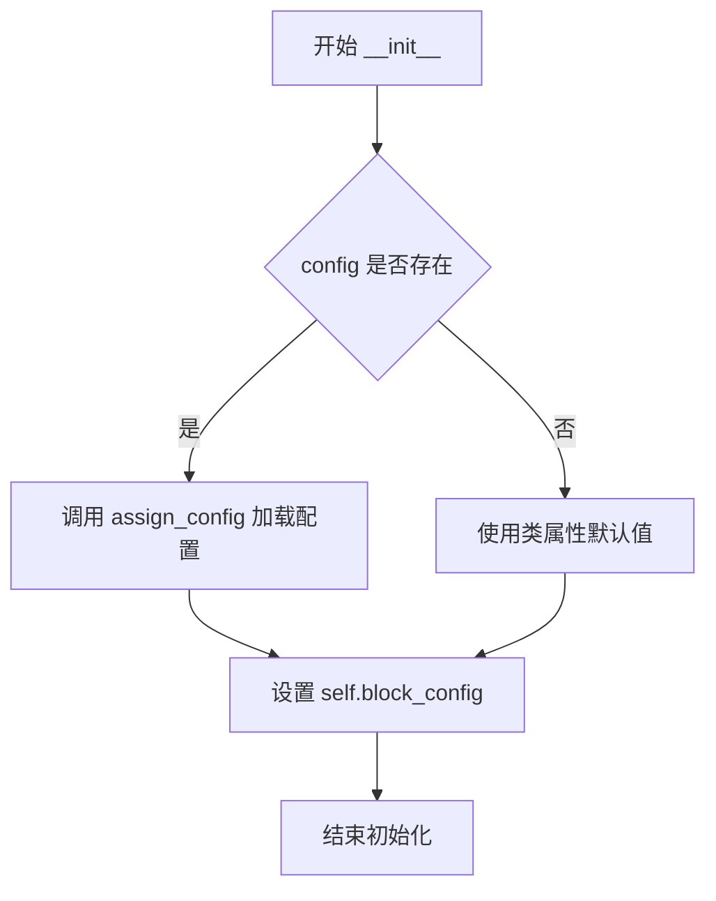
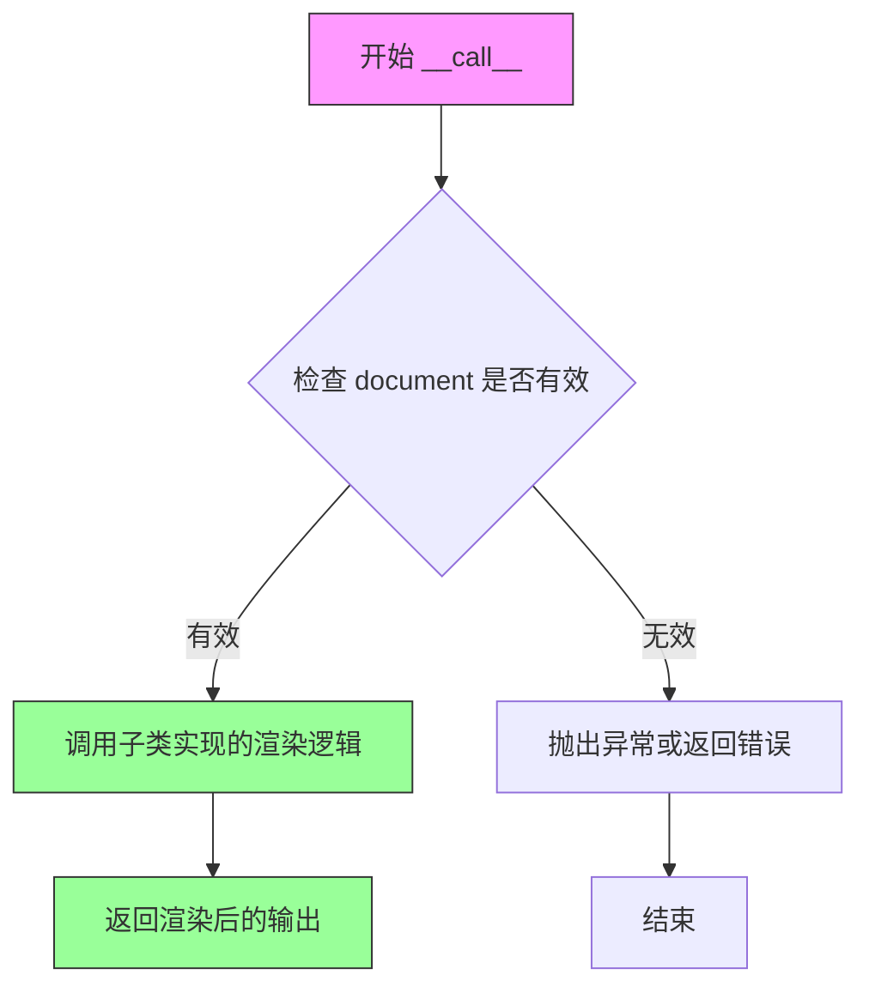
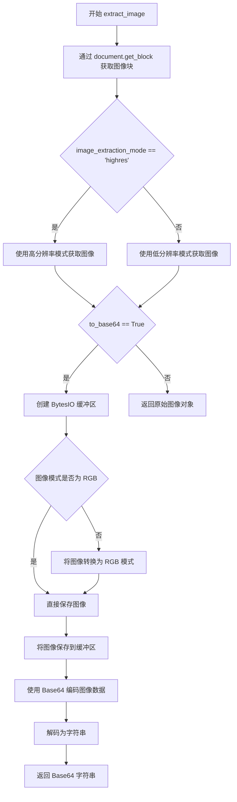
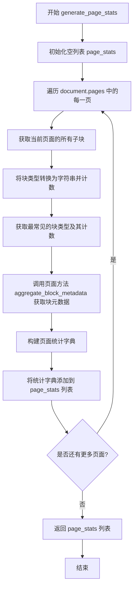
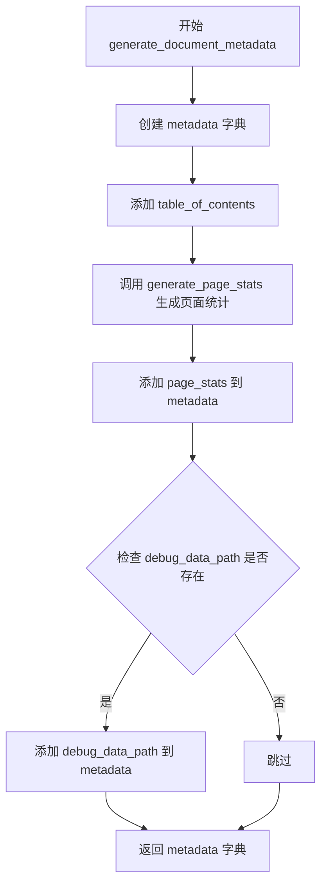

# `marker\marker\renderers\__init__.py` 详细设计文档

这是一个文档渲染器的基类，提供了文档页面渲染、图像提取、HTML块处理和元数据生成的通用功能，支持配置化处理不同类型的文档块（如图形、图片）以及页面头部/尾部的保留策略。

## 整体流程



## 类结构

```
BaseRenderer (渲染器基类)
└── (子类实现，如PDFRenderer等)
```

## 全局变量及字段


### `BaseRenderer.image_blocks`
    
视为图像的块类型元组

类型：`Annotated[Tuple[BlockTypes, ...], str]`
    


### `BaseRenderer.extract_images`
    
是否从文档提取图像

类型：`Annotated[bool, str]`
    


### `BaseRenderer.image_extraction_mode`
    
图像提取模式

类型：`Annotated[Literal['lowres', 'highres'], str]`
    


### `BaseRenderer.keep_pageheader_in_output`
    
是否保留页面头部

类型：`Annotated[bool, str]`
    


### `BaseRenderer.keep_pagefooter_in_output`
    
是否保留页面尾部

类型：`Annotated[bool, str]`
    


### `BaseRenderer.add_block_ids`
    
是否在输出HTML中添加块ID

类型：`Annotated[bool, str]`
    


### `BaseRenderer.block_config`
    
块配置字典

类型：`dict`
    
    

## 全局函数及方法


### `assign_config`

`assign_config` 是一个全局函数，用于将配置对象（BaseModel 或字典）的属性分配给目标对象的属性，实现配置与类实例属性的自动绑定。

参数：

- `target`：`object`，目标对象，通常是类的实例（如 `self`），用于接收配置属性
- `config`：`Optional[BaseModel | dict]`，配置对象，可以是 Pydantic BaseModel 实例或字典，如果为 None 则不执行任何操作

返回值：`None`，该函数直接修改目标对象的属性，不返回任何值

#### 流程图



#### 带注释源码

```python
# 从 marker.util 模块导入 assign_config 函数
# 该函数定义在 marker/util.py 中
from marker.util import assign_config

# 在 BaseRenderer 类中的使用示例：
def __init__(self, config: Optional[BaseModel | dict] = None):
    """
    初始化渲染器
    
    参数:
        config: 可选的配置对象，可以是 BaseModel 实例或字典
                用于设置类的各种配置属性
    """
    # 调用 assign_config 将配置分配给类实例
    # 该函数会自动将 config 中的属性映射到 self 的对应属性
    # 例如：如果 config.image_extraction_mode = "lowres"
    # 则 self.image_extraction_mode 也会被设置为 "lowres"
    assign_config(self, config)
    
    # ... 其他初始化代码
```

#### 完整函数签名推断

```python
def assign_config(target: object, config: Optional[BaseModel | dict]) -> None:
    """
    将配置对象的属性分配给目标对象
    
    参数:
        target: 目标对象，通常是类实例
        config: 配置对象，可以是 Pydantic BaseModel 或字典
    
    返回:
        None: 直接修改目标对象属性，无返回值
    """
    pass  # 具体实现需要查看 marker/util.py 源文件
```

#### 使用示例

```python
# 示例 1: 使用字典配置
config_dict = {
    "image_extraction_mode": "lowres",
    "extract_images": False,
    "keep_pageheader_in_output": True
}
renderer = BaseRenderer(config=config_dict)

# 示例 2: 使用 Pydantic BaseModel 配置
from pydantic import BaseModel

class RendererConfig(BaseModel):
    image_extraction_mode: str = "highres"
    extract_images: bool = True

config_model = RendererConfig(image_extraction_mode="lowres")
renderer = BaseRenderer(config=config_model)

# 示例 3: 不使用配置（使用默认值）
renderer = BaseRenderer()
```


### `BaseRenderer.__init__`

这是 BaseRenderer 类的构造函数，用于初始化渲染器实例，加载配置并设置块配置属性。

参数：

-  `config`：`Optional[BaseModel | dict]`，可选的配置对象，可以是 Pydantic BaseModel 实例或字典，用于覆盖类的默认配置属性

返回值：无返回值（构造函数）

#### 流程图



#### 带注释源码

```python
def __init__(self, config: Optional[BaseModel | dict] = None):
    """
    初始化 BaseRenderer 实例
    
    参数:
        config: 可选的配置对象，可以是 BaseModel 实例或字典
    """
    # 使用 assign_config 函数将配置应用到当前实例
    # 该函数会根据 config 更新类的属性（类属性定义在下方）
    assign_config(self, config)

    # 创建块配置字典，用于存储与输出相关的配置项
    self.block_config = {
        "keep_pageheader_in_output": self.keep_pageheader_in_output,  # 是否在输出中保留页眉
        "keep_pagefooter_in_output": self.keep_pagefooter_in_output,  # 是否在输出中保留页脚
        "add_block_ids": self.add_block_ids,  # 是否在输出 HTML 中添加块 ID
    }
```


### `BaseRenderer.__call__`

该方法是 `BaseRenderer` 类的抽象方法，用于将文档对象渲染为 HTML 输出。子类需要实现此方法以提供具体的渲染逻辑。当前实现仅抛出 `NotImplementedError`，表明这是一个需要在子类中重写的抽象方法。

参数：

- `document`：`Document`，需要渲染的文档对象，包含要处理的页面和块信息

返回值：`None`，当前实现不返回任何值，子类实现应返回渲染后的文档输出

#### 流程图



#### 带注释源码

```python
def __call__(self, document):
    # Children are in reading order
    # 注意：此为抽象方法，子类需实现具体的渲染逻辑
    # document 参数为 Document 对象，包含待渲染的页面和块
    # 子类实现应遍历 document 的页面和块，按阅读顺序生成 HTML 输出
    raise NotImplementedError
```


### `BaseRenderer.extract_image`

该方法负责从文档中提取图像数据，支持高分辨率和低分辨率两种模式，并可根据需求将图像转换为 Base64 编码格式。

参数：

- `self`：隐式参数，BaseRenderer 实例本身
- `document`：`Document`，文档对象，包含待提取的图像块
- `image_id`：`BlockId`，图像块的唯一标识符，用于从文档中定位图像块
- `to_base64`：`bool`，可选参数，默认为 `False`。当设置为 `True` 时，将图像转换为 Base64 编码的字符串；否则返回 PIL Image 对象

返回值：返回提取的图像数据，类型为 `PIL.Image.Image` 或 `str`（Base64 编码的字符串）

#### 流程图



#### 带注释源码

```python
def extract_image(self, document: Document, image_id, to_base64=False):
    """
    从文档中提取图像，可选择转换为 Base64 编码
    
    参数:
        document: Document - 文档对象，包含待提取的图像块
        image_id: BlockId - 图像块的唯一标识符
        to_base64: bool - 是否将图像转换为 Base64 编码
    
    返回:
        PIL.Image.Image 或 str - 提取的图像或 Base64 编码的字符串
    """
    # Step 1: 根据 image_id 从文档中获取对应的图像块
    image_block = document.get_block(image_id)
    
    # Step 2: 调用图像块的 get_image 方法获取图像
    # 根据 image_extraction_mode 决定使用高分辨率还是低分辨率
    cropped = image_block.get_image(
        document, highres=self.image_extraction_mode == "highres"
    )

    # Step 3: 如果需要转换为 Base64 编码
    if to_base64:
        # 创建内存缓冲区用于存储图像数据
        image_buffer = io.BytesIO()
        
        # RGBA to RGB: 确保图像为 RGB 模式（PIL 默认支持）
        # 有些图像可能包含透明度通道，需要转换
        if not cropped.mode == "RGB":
            cropped = cropped.convert("RGB")

        # 将图像保存到缓冲区，格式由设置决定（如 PNG、JPEG 等）
        cropped.save(image_buffer, format=settings.OUTPUT_IMAGE_FORMAT)
        
        # 将图像数据编码为 Base64 并解码为字符串，便于传输和存储
        cropped = base64.b64encode(image_buffer.getvalue()).decode(
            settings.OUTPUT_ENCODING
        )
    
    # Step 4: 返回处理后的图像（可能是 PIL Image 对象或 Base64 字符串）
    return cropped
```


### `BaseRenderer.merge_consecutive_math`

该方法是一个静态工具方法，用于合并HTML中连续的math标签。它通过正则表达式将相邻的 `</math>` 和 `<math>` 标签之间的空白字符替换为单个空格，从而实现连续数学表达式的合并处理。

参数：

- `html`：`str`，需要处理的HTML字符串，可能包含连续的math标签
- `tag`：`str`，默认为"math"，指定要合并的标签名称

返回值：`str`，返回处理后的HTML字符串，连续的math标签已被合并

#### 流程图

```mermaid
flowchart TD
    A([开始 merge_consecutive_math]) --> B{html 是否为空?}
    B -->|是| C[直接返回原 html]
    B -->|否| D[构建正则表达式: </{tag}>(\s*)<{tag}>]
    D --> E[re.sub 替换为单个空格]
    E --> F[构建第二个正则: </{tag}>(\s*)<{tag} display="inline">]
    F --> G[re.sub 替换为单个空格]
    G --> H([返回处理后的 html])
```

#### 带注释源码

```python
@staticmethod
def merge_consecutive_math(html, tag="math"):
    """
    合并HTML中连续的math标签
    
    参数:
        html: 输入的HTML字符串
        tag: 要处理的标签名，默认为"math"
    
    返回:
        处理后的HTML字符串
    """
    # 如果html为空，直接返回，避免不必要的处理
    if not html:
        return html
    
    # 第一个正则：匹配 </math> 后跟空白字符，然后是 <math>
    # 例如: </math> <math> 或 </math>\n<math>
    # 替换为单个空格
    pattern = rf"-</{tag}>(\s*)<{tag}>"
    html = re.sub(pattern, " ", html)

    # 第二个正则：匹配 </math> 后跟空白字符，然后是 <math display="inline">
    # 例如: </math> <math display="inline">
    # 替换为单个空格
    pattern = rf'-</{tag}>(\s*)<{tag} display="inline">'
    html = re.sub(pattern, " ", html)
    
    # 返回处理后的HTML
    return html
```


### `BaseRenderer.merge_consecutive_tags`

该方法是一个静态工具方法，用于合并HTML字符串中连续出现的相同标签（如 `<span></span><span></span>` 合并为 `<span></span>`），常用于清理由标记语言生成的可能包含冗余换行或空白的HTML输出。

参数：

- `html`：`str`，输入的HTML字符串，可能包含需要合并的连续相同标签
- `tag`：`str`，要合并的标签名称（如 "span"、"math" 等），不包含尖括号

返回值：`str`，返回合并连续相同标签后的HTML字符串

#### 流程图

```mermaid
flowchart TD
    A[开始 merge_consecutive_tags] --> B{html 是否为空}
    B -->|是| C[直接返回 html]
    B -->|否| D[定义 replace_whitespace 函数]
    D --> E[构建正则模式: </{tag}>(\s*)<{tag}>]
    E --> F[使用 re.sub 替换匹配项]
    F --> G{替换后是否与原字符串相同}
    G -->|是| H[退出循环，返回 html]
    G -->|否| I[更新 html 为 new_merged]
    I --> F
    C --> H
```

#### 带注释源码

```python
@staticmethod
def merge_consecutive_tags(html, tag):
    """
    合并HTML中连续出现的相同标签
    
    参数:
        html: 输入的HTML字符串
        tag: 要合并的标签名称（不含尖括号）
    
    返回:
        合并连续相同标签后的HTML字符串
    """
    # 如果HTML为空或None，直接返回原值
    if not html:
        return html

    def replace_whitespace(match):
        """
        内部函数：处理匹配到的空白字符
        """
        # 提取捕获的空白字符组
        whitespace = match.group(1)
        # 如果没有空白字符，返回空字符串（完全合并）
        if len(whitespace) == 0:
            return ""
        else:
            # 如果有空白字符，替换为单个空格（保留间隔）
            return " "

    # 构建正则表达式：匹配 </tag>(空白字符)<tag> 的模式
    pattern = rf"</{tag}>(\s*)<{tag}>"

    # 循环处理，因为一次替换可能产生新的连续标签
    while True:
        # 使用正则替换所有匹配的连续标签
        new_merged = re.sub(pattern, replace_whitespace, html)
        # 如果替换后没有变化，说明已处理完成
        if new_merged == html:
            break
        # 更新html，继续处理新产生的连续标签
        html = new_merged

    return html
```


### `BaseRenderer.generate_page_stats`

该方法用于生成文档的页面统计信息，遍历文档中的所有页面，统计每个页面中块的类型分布，并收集页面的元数据信息，最终返回包含各页面详细统计数据的列表。

参数：

- `self`：BaseRenderer，渲染器实例本身，包含配置信息
- `document`：`Document`，输入的文档对象，包含所有页面和块的结构信息
- `document_output`：`Any`（未在代码中直接使用），文档的输出结果，可能用于后续处理或上下文传递

返回值：`List[Dict]`，返回页面统计信息的列表，每个元素包含页面ID、文本提取方法、块类型计数和块元数据

#### 流程图



#### 带注释源码

```python
def generate_page_stats(self, document: Document, document_output):
    """
    生成文档中所有页面的统计信息
    
    Args:
        document: Document对象，包含文档的完整结构和内容
        document_output: 文档输出结果（当前方法中未直接使用）
    
    Returns:
        List[Dict]: 包含每个页面统计信息的列表
    """
    # 初始化用于存储所有页面统计信息的列表
    page_stats = []
    
    # 遍历文档中的所有页面
    for page in document.pages:
        # 统计当前页面中所有块的类型
        # 1. 获取页面所有子块
        # 2. 将每个块的类型转换为字符串
        # 3. 使用Counter进行计数
        # 4. 获取most_common结果（按计数降序排列的元组列表）
        block_counts = Counter(
            [str(block.block_type) for block in page.children]
        ).most_common()
        
        # 获取当前页面的聚合块元数据
        # 这包含页面中所有块的综合信息
        block_metadata = page.aggregate_block_metadata()
        
        # 构建当前页面的统计信息字典
        page_stats.append(
            {
                "page_id": page.page_id,                    # 页面的唯一标识符
                "text_extraction_method": page.text_extraction_method,  # 用于提取该页面文本的方法
                "block_counts": block_counts,               # 块类型及其计数的列表
                "block_metadata": block_metadata.model_dump(),  # 块的元数据（转换为字典）
            }
        )
    
    # 返回包含所有页面统计信息的列表
    return page_stats
```


### `BaseRenderer.generate_document_metadata`

该方法负责生成文档的元数据信息，包括文档的目录、页面统计信息以及调试数据路径（如果存在），并返回一个包含这些信息的字典对象。

参数：

- `document`：`Document`，待处理的文档对象，包含了文档的完整内容、目录和调试数据路径等信息
- `document_output`：未标注类型，文档的输出结果，用于生成页面统计数据

返回值：`dict`，返回包含文档元数据的字典，其中键包括 `table_of_contents`（目录）、`page_stats`（页面统计）以及可选的 `debug_data_path`（调试数据路径）

#### 流程图



#### 带注释源码

```python
def generate_document_metadata(self, document: Document, document_output):
    """
    生成文档的元数据信息。
    
    该方法构建一个包含文档目录、页面统计和可选调试数据路径的字典。
    用于提供文档的结构化摘要信息。
    
    参数:
        document: Document 对象，包含文档的完整内容和元信息
        document_output: 文档输出对象，用于提取页面相关的统计信息
    
    返回:
        包含文档元数据的字典，包含 table_of_contents、page_stats 等键
    """
    # 初始化 metadata 字典，首先添加目录信息
    metadata = {
        "table_of_contents": document.table_of_contents,
        # 调用内部方法生成页面统计数据，包括每页的块类型统计和聚合元数据
        "page_stats": self.generate_page_stats(document, document_output),
    }
    
    # 检查文档是否存在调试数据路径，若存在则添加到元数据中
    if document.debug_data_path is not None:
        metadata["debug_data_path"] = document.debug_data_path

    # 返回构建完成的元数据字典
    return metadata
```


### `BaseRenderer.extract_block_html`

该方法负责将文档块输出转换为 HTML 字符串，并递归处理内容引用和图像提取。它遍历 HTML 中的 `<content-ref>` 标签，递归处理子块，根据配置提取图像或替换内容引用为实际 HTML，最终返回处理后的 HTML 和提取的图像字典。

参数：

- `document`：`Document`，原始文档对象，用于获取块图像
- `block_output`：`BlockOutput`，包含块的 HTML 输出和子块信息

返回值：`(str, dict)`，返回元组包含处理后的 HTML 字符串和图像 ID 到 Base64 编码图像数据的字典

#### 流程图

```mermaid
flowchart TD
    A[开始 extract_block_html] --> B[使用 BeautifulSoup 解析 block_output.html]
    B --> C[查找所有 content-ref 标签]
    C --> D{content_refs 是否为空}
    D -->|否| E[遍历每个 content-ref]
    E --> F[获取 src 属性]
    F --> G[在 block_output.children 中查找对应块]
    G --> H{找到对应块}
    H -->|否| I[继续下一个 ref]
    H -->|是| J[递归调用 extract_block_html]
    J --> K{子块是图像类型且 extract_images 为真}
    K -->|是| L[提取图像到 images 字典]
    K -->|否| M[更新 sub_images 并替换 content-ref]
    L --> I
    M --> I
    I --> D
    D -->|是| N{当前块是图像类型且 extract_images 为真}
    N -->|是| O[提取当前块图像到 images]
    N -->|否| P[返回 str(soup) 和 images]
    O --> P
```

#### 带注释源码

```python
def extract_block_html(self, document: Document, block_output: BlockOutput):
    """
    从 BlockOutput 提取 HTML，并递归处理内容引用和图像提取
    
    参数:
        document: Document 对象，包含文档的完整数据
        block_output: BlockOutput 对象，包含块的 HTML 内容和子块信息
    
    返回:
        tuple: (处理后的 HTML 字符串, 图像字典 {block_id: base64_image_data})
    """
    # 使用 BeautifulSoup 解析块输出的 HTML
    soup = BeautifulSoup(block_output.html, "html.parser")

    # 查找所有 content-ref 标签，这些标签引用文档中的其他块
    content_refs = soup.find_all("content-ref")
    ref_block_id = None  # 当前处理的引用块 ID
    images = {}  # 存储提取的图像，键为 BlockId，值为 base64 编码的图像数据
    
    # 遍历所有内容引用
    for ref in content_refs:
        # 获取引用来源
        src = ref.get("src")
        sub_images = {}  # 存储子块提取的图像
        
        # 在子块中查找匹配的块
        for item in block_output.children:
            if item.id == src:
                # 递归处理子块，获取其 HTML 和图像
                content, sub_images_ = self.extract_block_html(document, item)
                sub_images.update(sub_images_)  # 合并子图像
                ref_block_id: BlockId = item.id  # 记录当前引用的块 ID
                break

        # 判断引用块是否为图像类型且需要提取图像
        if ref_block_id.block_type in self.image_blocks and self.extract_images:
            # 提取图像并转换为 Base64 编码
            images[ref_block_id] = self.extract_image(
                document, ref_block_id, to_base64=True
            )
        else:
            # 非图像块：合并子图像，并将 content-ref 替换为实际 HTML 内容
            images.update(sub_images)
            ref.replace_with(BeautifulSoup(content, "html.parser"))

    # 处理当前块本身的图像（如果当前块是图像类型）
    if block_output.id.block_type in self.image_blocks and self.extract_images:
        images[block_output.id] = self.extract_image(
            document, block_output.id, to_base64=True
        )

    # 返回处理后的 HTML 字符串和图像字典
    return str(soup), images
```

## 关键组件


### BaseRenderer 核心渲染器类

文档渲染的基类，负责将文档对象转换为HTML输出，包含图像提取、标签合并、元数据生成等核心功能。

### 张量索引与图像块类型定义

通过 `image_blocks` 类属性定义哪些块类型被视为图像（Picture、Figure），用于在渲染时识别和处理图像内容。

### 图像提取与 Base64 编码

`extract_image` 方法从文档中提取指定ID的图像，支持高分辨率和低分辨率两种模式，并可选择将图像转换为Base64编码格式。

### 连续数学标签合并

`merge_consecutive_math` 静态方法使用正则表达式将连续的数学标签（math）合并，去除多余的空白字符。

### 连续标签通用合并

`merge_consecutive_tags` 静态方法是一个通用标签合并函数，通过迭代方式合并连续的同名HTML标签，支持自定义标签处理。

### 页面统计信息生成

`generate_page_stats` 方法遍历文档的每一页，统计每页中不同类型块的数量，并聚合块元数据，生成页面级别的统计信息。

### 文档元数据生成

`generate_document_metadata` 方法生成完整的文档元数据，包括目录、页面统计信息以及可选的调试数据路径。

### 块 HTML 提取与图像处理

`extract_block_html` 方法递归提取文档块的HTML内容，处理内容引用（content-ref），提取其中的子图像，支持图像块的识别和Base64转换。

### 配置初始化与管理

`__init__` 方法通过 `assign_config` 函数初始化配置，支持通过 BaseModel 或字典传入配置，并维护块级别的渲染配置。


## 问题及建议


### 已知问题

-   **类型注解兼容性**：第16行使用了`BaseModel | dict`联合类型语法，这是Python 3.10+的特性，但代码中没有`from __future__ import annotations`导入，可能导致与旧版本Python不兼容
-   **变量未初始化风险**：第99行在`for`循环中给`ref_block_id`赋值，如果循环不执行，后续第103行使用`ref_block_id.block_type`时将抛出`UnboundLocalError`
-   **资源未正确释放**：`extract_image`方法中创建的`io.BytesIO()`对象在使用后没有调用`close()`或使用`with`语句，可能导致资源泄漏
-   **代码重复**：`extract_block_html`方法中第103-106行和第113-116行存在几乎相同的图像提取逻辑，未进行复用
-   **异常处理缺失**：多个关键方法如`extract_image`、`generate_page_stats`等没有异常处理机制，当`document.get_block()`或`image_block.get_image()`返回`None`或抛出异常时会导致程序崩溃
-   **正则表达式效率问题**：`merge_consecutive_tags`方法使用`while True`循环和多次正则替换，在处理大型HTML文档时性能较差

### 优化建议

-   在文件开头添加`from __future__ import annotations`以确保类型注解的向前兼容性
-   在第99行之前初始化`ref_block_id = None`，并在第103行使用前添加空值检查
-   使用上下文管理器重写图像提取逻辑：`with io.BytesIO() as image_buffer:`
-   将重复的图像提取逻辑提取为私有方法，如`_extract_block_images()`
-   为关键方法添加`try-except`异常处理，特别是涉及文档块和图像获取的部分
-   考虑使用`re.compile()`预编译正则表达式以提升性能，特别是`merge_consecutive_tags`方法中的循环正则替换

## 其它


### 设计目标与约束

本类作为渲染器基类，目标是提供文档到HTML转换的通用框架，支持可配置的图像提取、块级元数据管理、页面统计生成等功能。约束包括：必须继承实现`__call__`方法；图像提取仅支持`BlockTypes.Picture`和`BlockTypes.Figure`类型；输出图像格式由`settings.OUTPUT_IMAGE_FORMAT`决定；HTML解析依赖`BeautifulSoup`库。

### 错误处理与异常设计

`__call__`方法抛出`NotImplementedError`强制子类实现；`extract_image`方法假设`image_id`对应的块存在且可获取图像，若块不存在或图像获取失败会抛出异常；`extract_block_html`方法中若`block_output.children`中找不到匹配的`id`会导致`ref_block_id`为`None`，后续访问`ref_block_id.block_type`可能引发`AttributeError`。建议添加空值检查和更具体的异常类型。

### 数据流与状态机

数据流：Document对象输入 → 遍历页面块 → 调用`extract_block_html`处理每个块 → 提取内容 refs 和图像 → 返回HTML字符串和图像字典 → 汇总为完整文档输出。状态机体现在块类型判断（图像块 vs 内容块）、图像提取模式切换（highres/lowres）、连续标签合并的迭代过程。

### 外部依赖与接口契约

依赖：`base64`(标准库)、`io`(标准库)、`re`(标准库)、`collections.Counter`(标准库)、`typing`(标准库)、`BeautifulSoup`（`bs4`库）、`pydantic`（配置模型）、`marker.schema`（块类型定义）、`marker.settings`（全局设置）、`marker.util.assign_config`（配置分配函数）。接口契约：子类必须实现`__call__(self, document)`方法；`extract_image`方法接受`document: Document`、`image_id`、`to_base64: bool`参数并返回图像（PIL.Image或base64字符串）；`extract_block_html`返回元组`(str, dict)`。

### 配置管理机制

通过`__init__`接收`config: Optional[BaseModel | dict]`参数，使用`assign_config`函数将配置赋值给类属性。配置项包括：`image_blocks`（图像块类型元组）、`extract_images`（是否提取图像）、`image_extraction_mode`（图像提取模式）、`keep_pageheader_in_output`（保留页眉）、`keep_pagefooter_in_output`（保留页脚）、`add_block_ids`（添加块ID）。`block_config`字典用于存储块级配置。

### 性能考虑与优化空间

`merge_consecutive_tags`使用`while True`循环合并连续标签，最坏情况时间复杂度较高，建议设置最大迭代次数或使用更高效算法；`extract_block_html`中对每个`content-ref`都遍历`block_output.children`查找匹配项，时间复杂度O(n*m)，可预先构建id到item的映射字典优化；图像提取默认转RGB可能影响性能，如不需要可配置跳过。

### 安全考虑

`BeautifulSoup`解析HTML时使用`html.parser`，需注意恶意HTML注入风险；`extract_block_html`直接渲染从文档提取的HTML内容，未进行XSS过滤；图像base64编码未限制大小，可能导致内存问题。

### 版本兼容性与平台依赖

依赖Python 3.9+（使用`|`联合类型注解）；依赖Pydantic v2+（`BaseModel`用法）；依赖`marker`包各模块；图像处理依赖PIL/Pillow。

### 测试策略建议

应覆盖：子类实现`__call__`方法的正确性；`extract_image`方法在highres/lowres模式下的行为；`merge_consecutive_math`和`merge_consecutive_tags`对各种输入的合并效果；`generate_page_stats`和`generate_document_metadata`输出的完整性；`extract_block_html`对图像块和内容ref的处理；配置赋值的正确性。

### 日志与调试支持

代码中仅在`generate_document_metadata`中使用了`document.debug_data_path`，建议添加结构化日志记录关键流程节点和异常信息，便于调试和监控。


    