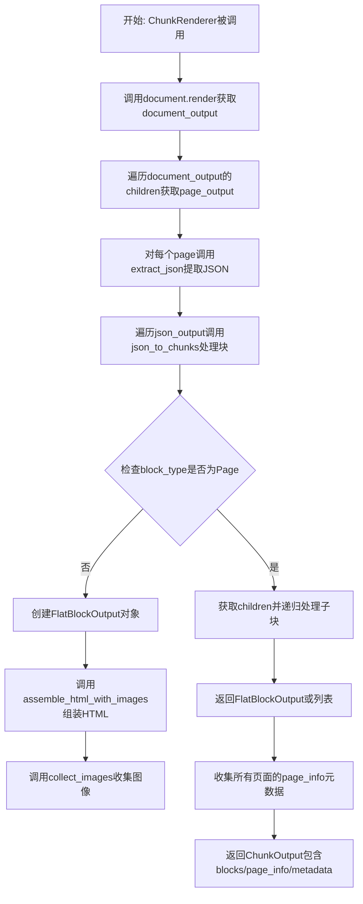
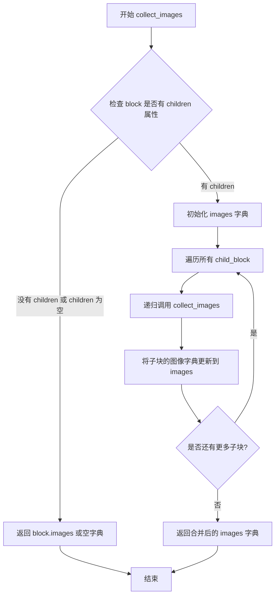
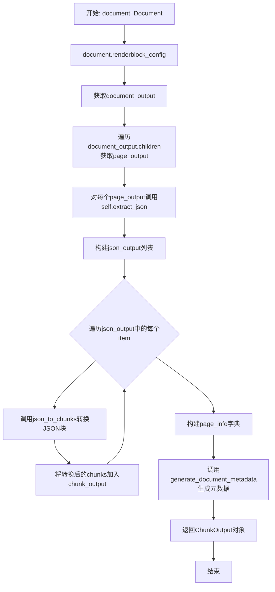

# `marker\marker\renderers\chunk.py` 详细设计文档

这是一个文档渲染后处理模块，负责将JSON格式的文档结构转换为扁平的HTML块（Chunk）输出，同时处理图像嵌入和HTML内容组装，支持多页文档的块提取和页面元数据收集。

## 整体流程



## 类结构

```
ChunkRenderer (主渲染器类)
├── JSONRenderer (父类)
├── FlatBlockOutput (数据模型)
│   ├── id: str
│   ├── block_type: str
│   ├── html: str
│   ├── page: int
│   ├── polygon: List[List[float]]
│   ├── bbox: List[float]
│   ├── section_hierarchy: Dict[int, str] | None
│   └── images: dict | None
└── ChunkOutput (输出模型)
    ├── blocks: List[FlatBlockOutput]
    ├── page_info: Dict[int, dict]
    └── metadata: dict
```

## 全局变量及字段


### `collect_images`
    
递归收集块及其子块中的所有图像数据

类型：`function(block: JSONBlockOutput) -> dict[str, str]`
    


### `assemble_html_with_images`
    
将图像块组装到HTML内容中并处理content-ref引用

类型：`function(block: JSONBlockOutput, image_blocks: set[str]) -> str`
    


### `json_to_chunks`
    
将JSON块递归转换为展平的ChunkOutput块结构

类型：`function(block: JSONBlockOutput, image_blocks: set[str], page_id: int=0) -> FlatBlockOutput | List[FlatBlockOutput]`
    


### `FlatBlockOutput.id`
    
块的唯一标识符

类型：`str`
    


### `FlatBlockOutput.block_type`
    
块的类型(如Page, Text等)

类型：`str`
    


### `FlatBlockOutput.html`
    
HTML内容

类型：`str`
    


### `FlatBlockOutput.page`
    
所属页码

类型：`int`
    


### `FlatBlockOutput.polygon`
    
多边形坐标点

类型：`List[List[float]]`
    


### `FlatBlockOutput.bbox`
    
边界框坐标

类型：`List[float]`
    


### `FlatBlockOutput.section_hierarchy`
    
章节层级结构

类型：`Dict[int, str] | None`
    


### `FlatBlockOutput.images`
    
关联的图像数据

类型：`dict | None`
    


### `ChunkOutput.blocks`
    
展平后的块列表

类型：`List[FlatBlockOutput]`
    


### `ChunkOutput.page_info`
    
每页的元信息(bbox和polygon)

类型：`Dict[int, dict]`
    


### `ChunkOutput.metadata`
    
文档级别的元数据

类型：`dict`
    


### `ChunkRenderer.block_config`
    
块配置(继承自JSONRenderer)

类型：`BlockConfig`
    


### `ChunkRenderer.image_blocks`
    
图像块集合(继承自JSONRenderer)

类型：`set`
    


### `ChunkRenderer.__call__`
    
主入口方法,接收Document返回ChunkOutput

类型：`function(document: Document) -> ChunkOutput`
    
    

## 全局函数及方法


### `collect_images`

该函数是一个递归辅助函数，用于遍历 JSON 块结构并收集当前块及其所有子块中包含的图像数据。它通过深度优先遍历将嵌套块中的图像字典合并为一个统一的字典返回。

参数：

- `block`：`JSONBlockOutput`，要收集图像的 JSON 块对象，该对象可能包含 `children` 属性用于递归遍历子块，以及 `images` 属性存储当前块的图像数据

返回值：`dict[str, str]`，返回合并后的图像字典，键为图像标识符，值为图像相关内容

#### 流程图



#### 带注释源码

```python
def collect_images(block: JSONBlockOutput) -> dict[str, str]:
    """
    递归收集块及其所有子块中的图像。
    
    Args:
        block: JSONBlockOutput 实例，代表文档中的一个块元素，
               可能包含 children（子块列表）和 images（图像字典）属性
    
    Returns:
        dict[str, str]: 合并后的图像字典，键为图像 ID，值为图像数据
    """
    # 检查当前块是否有 children 属性且不为空
    # 如果没有子块，说明是叶子节点，直接返回该块的图像字典
    if not getattr(block, "children", None):
        return block.images or {}
    else:
        # 初始化当前块的图像字典，如果为 None 则使用空字典
        images = block.images or {}
        
        # 遍历所有子块，递归收集它们的图像
        for child_block in block.children:
            # 递归调用 collect_images 获取子块的图像
            # 使用 update 方法将子块图像合并到当前图像字典中
            images.update(collect_images(child_block))
        
        # 返回合并了所有子块图像的字典
        return images
```


### `assemble_html_with_images`

该函数递归地将图像块转换为HTML img标签，并处理content-ref引用关系，将子块的HTML内容替换到父块的相应位置，最终返回处理后的HTML字符串。

参数：
- `block`：`JSONBlockOutput`，需要处理的JSON块输出对象，包含HTML内容和子块信息
- `image_blocks`：`set[str]`，图像块的block_type集合，用于判断当前块是否为图像块

返回值：`str`，处理并组装后的HTML字符串

#### 流程图

```mermaid
flowchart TD
    A[开始 assemble_html_with_images] --> B{block 是否有 children?}
    B -->|否| C{block.block_type 是否在 image_blocks 中?}
    C -->|是| D[返回 <p>{block.html}</p>]
    C -->|否| E[返回 block.html]
    B -->|是| F[递归处理所有 children]
    F --> G[获取所有 children 的 id 列表]
    H[使用 BeautifulSoup 解析 block.html] --> I[查找所有 content-ref 标签]
    I --> J{还有 content-ref 未处理?}
    J -->|是| K[获取 content-ref 的 src 属性]
    K --> L{src_id 是否在 child_ids 中?}
    L -->|是| M[用对应 child_html 替换 content-ref]
    L -->|否| N[保留 content-ref 标签]
    M --> J
    J -->|否| O[返回 html.unescape 后的字符串]
```

#### 带注释源码

```python
def assemble_html_with_images(block: JSONBlockOutput, image_blocks: set[str]) -> str:
    """
    将图像嵌入到HTML内容中，处理content-ref引用
    
    Args:
        block: JSONBlockOutput对象，包含HTML内容和可能的子块
        image_blocks: 图像块的block_type集合，用于标识哪些块是图像
    
    Returns:
        处理后的HTML字符串
    """
    # 检查当前块是否为叶子节点（无子块）
    if not getattr(block, "children", None):
        # 如果当前块是图像块，在HTML中添加img标签
        if block.block_type in image_blocks:
            # 返回包含嵌入式图像的段落
            return f"<p>{block.html}</p>"
        else:
            # 非图像块直接返回原始HTML
            return block.html

    # 递归处理所有子块，生成子块的HTML列表
    child_html = [assemble_html_with_images(child, image_blocks) for child in block.children]
    # 提取所有子块的ID列表，用于后续引用查找
    child_ids = [child.id for child in block.children]

    # 使用BeautifulSoup解析当前块的HTML
    soup = BeautifulSoup(block.html, "html.parser")
    # 查找所有content-ref标签（内容引用）
    content_refs = soup.find_all("content-ref")
    
    # 遍历所有内容引用，处理引用替换
    for ref in content_refs:
        # 获取引用指向的源ID
        src_id = ref.attrs["src"]
        # 如果引用的ID在子块ID列表中，用子块HTML替换引用
        if src_id in child_ids:
            ref.replace_with(child_html[child_ids.index(src_id)])

    # 返回解码后的HTML字符串（处理HTML实体）
    return html.unescape(str(soup))
```


### `json_to_chunks`

该函数是文档渲染流程中的核心转换器，负责将层级嵌套的 `JSONBlockOutput` 结构递归地扁平化为线性的 `FlatBlockOutput` 列表。它通过区分“页面”节点（用于遍历和提取页码）与“内容”节点（用于提取文本、HTML和图像），实现了从树状结构到块列表的数据重组。

参数：

- `block`：`JSONBlockOutput`，输入的JSON块对象，代表文档树中的当前节点（可以是页面、段落或图像等）。
- `image_blocks`：`set[str]`，包含被视为图像的块类型的字符串集合，用于决定HTML组装逻辑。
- `page_id`：`int`，当前处理的页码，默认为 0。当处理“Page”节点时，此参数会根据块ID动态更新。

返回值：`FlatBlockOutput | List[FlatBlockOutput]`，如果当前节点是页面类型，则返回由所有子节点扁平化结果组成的列表；否则返回转换后的单个扁平块对象。

#### 流程图

```mermaid
flowchart TD
    A([开始 json_to_chunks]) --> B{块类型 == 'Page'?}
    
    B -- 是 --> C[提取 page_id<br>获取子节点 children]
    C --> D[遍历 children 列表]
    D --> E[递归调用 json_to_chunks]
    E --> F[收集结果为 List[FlatBlockOutput]]
    F --> G([返回列表])
    
    B -- 否 --> H[调用 assemble_html_with_images<br>处理HTML]
    H --> I[调用 collect_images<br>收集图片]
    I --> J[构建 FlatBlockOutput 对象]
    J --> K([返回单个对象])
```

#### 带注释源码

```python
def json_to_chunks(
    block: JSONBlockOutput, image_blocks: set[str], page_id: int=0
) -> FlatBlockOutput | List[FlatBlockOutput]:
    # 判断当前块是否为页面根节点
    if block.block_type == "Page":
        # 获取当前页面的所有子块
        children = block.children
        # 从块ID中解析出实际的页码（例如 "page/0" -> 0）
        page_id = int(block.id.split("/")[-1])
        # 递归遍历所有子节点，将结果展平为列表
        return [json_to_chunks(child, image_blocks, page_id=page_id) for child in children]
    else:
        # 如果是内容节点（段落、标题等），则将其转换为扁平结构
        return FlatBlockOutput(
            id=block.id,
            block_type=block.block_type,
            # 组装带有图像引用的HTML内容
            html=assemble_html_with_images(block, image_blocks),
            # 继承当前页面的页码
            page=page_id,
            # 传递几何坐标信息
            polygon=block.polygon,
            bbox=block.bbox,
            # 传递章节层级结构
            section_hierarchy=block.section_hierarchy,
            # 收集当前块及其子块中的所有图像
            images=collect_images(block),
        )
```


### `ChunkRenderer.__call__`

该方法是`ChunkRenderer`类的主入口方法，接收`Document`对象作为输入，调用文档的渲染方法将文档内容转换为平面化的块结构（`ChunkOutput`），其中包括HTML块、页面信息和元数据。

参数：

- `self`：ChunkRenderer实例本身
- `document`：`Document`，待渲染的文档对象，包含页面和块配置信息

返回值：`ChunkOutput`，包含以下字段的输出对象：

- `blocks`：平面化的块列表（`List[FlatBlockOutput]`）
- `page_info`：页面信息字典（`Dict[int, dict]`），键为页面ID，值为边界框和多边形信息
- `metadata`：文档元数据（`dict`）

#### 流程图



#### 带注释源码

```python
def __call__(self, document: Document) -> ChunkOutput:
    """
    主入口方法：将Document对象转换为ChunkOutput
    """
    # 第一步：调用文档的render方法，传入块配置，获取文档渲染输出
    # document_output 包含整个文档的结构化渲染结果
    document_output = document.render(self.block_config)
    
    # 第二步：遍历文档输出的每个页面，提取JSON表示
    json_output = []
    for page_output in document_output.children:
        # 对每个页面调用extract_json方法，将页面内容提取为JSONBlockOutput
        json_output.append(self.extract_json(document, page_output))

    # 第三步：将JSON块转换为平面化的块结构
    # 遍历每个页面的JSON输出
    chunk_output = []
    for item in json_output:
        # 将嵌套的JSON块结构展平为FlatBlockOutput列表
        # image_blocks参数用于标识哪些块是图像块
        chunks = json_to_chunks(item, set([str(block) for block in self.image_blocks]))
        # 将展平后的块添加到输出列表中
        chunk_output.extend(chunks)

    # 第四步：构建页面信息字典
    # 提取每个页面的边界框和多边形信息
    page_info = {
        page.page_id: {"bbox": page.polygon.bbox, "polygon": page.polygon.polygon}
        for page in document.pages
    }

    # 第五步：生成文档元数据并返回最终输出
    return ChunkOutput(
        blocks=chunk_output,                    # 平面化的HTML块列表
        page_info=page_info,                    # 页面几何信息
        metadata=self.generate_document_metadata(document, document_output),  # 文档级别元数据
    )
```

## 关键组件


### FlatBlockOutput

表示扁平化文档块的输出模型，包含块ID、类型、HTML内容、页码、几何信息、分层结构和图像数据。

### ChunkOutput

表示完整的文档块输出，包含块列表、页面信息和元数据。

### collect_images

递归收集块及其子块中的所有图像，返回图像ID到图像数据的字典。

### assemble_html_with_images

将JSON块组装为HTML字符串，并在图像块中嵌入img标签，同时处理content-ref引用替换。

### json_to_chunks

将JSON块递归转换为FlatBlockOutput，处理页面级别的块并为每个块分配页码。

### ChunkRenderer

主渲染器类，继承JSONRenderer，负责将Document对象转换为ChunkOutput，包含图像块识别、页面信息提取和文档元数据生成。

### Document

文档数据模型，作为渲染器的输入，包含页面的结构化表示。

### JSONRenderer

基类渲染器，提供将文档渲染为JSON块输出的基础功能。

### JSONBlockOutput

JSON格式的块输出模型，包含块类型、HTML、内容引用、子块和几何信息。


## 问题及建议


### 已知问题

-   **类型不一致**：`collect_images` 函数签名声明返回 `dict[str, str]`，但实际返回 `block.images or {}`，而 `block.images` 类型为 `dict | None`，存在类型不匹配问题
-   **潜在的 KeyError 风险**：`assemble_html_with_images` 中使用 `child_ids.index(src_id)` 查找索引，当 `src_id` 不在 `child_ids` 中时会抛出 `ValueError`，缺乏错误处理
-   **算法效率低下**：在循环中使用 `list.index()` 进行查找，时间复杂度为 O(n²)，对于大量子块会影响性能
-   **冗余的类型转换**：`set([str(block) for block in self.image_blocks])` 先创建列表再转为集合，可直接使用生成器表达式 `set(str(block) for block in self.image_blocks)`
-   **类型提示过时**：使用 `List` 而非 `list`，未遵循 Python 3.9+ 的类型提示规范
-   **HTML 解析开销**：使用 `BeautifulSoup` 解析后立即转回字符串的操作较为重量级，且在每次递归调用中都会创建新的 Soup 对象
-   **魔法字符串**：`"content-ref"` 作为标签名硬编码，缺乏常量定义
-   **递归深度风险**：`collect_images` 和 `assemble_html_with_images` 使用递归，对于层级较深的文档结构可能导致栈溢出
-   **page_id 参数冗余**：`json_to_chunks` 的 `page_id` 参数默认值被忽略，首次调用时总是使用函数内部的赋值

### 优化建议

-   修复类型声明，确保 `collect_images` 的返回类型与实际返回值一致，或添加适当的类型转换
-   使用字典替代列表进行 ID 到索引的映射，将 `child_ids.index(src_id)` 改为 `child_id_to_index[src_id]`，将复杂度从 O(n²) 降至 O(n)
-   将魔法字符串提取为模块级常量，提高可读性和可维护性
-   考虑使用迭代而非递归的方式处理嵌套结构，或增加递归深度检查
-   统一使用 Python 3.9+ 的类型提示语法（`list` 替代 `List`）
-   对于简单的 HTML 字符串操作，可考虑使用正则表达式或更轻量的解析方式替代 BeautifulSoup
-   为 `assemble_html_with_images` 添加异常处理，处理 `src_id` 不匹配的情况

## 其它


### 设计目标与约束

本模块的核心设计目标是将层级化的JSON块结构（JSONBlockOutput）转换为扁平的块输出（FlatBlockOutput），并集成图像内容，生成最终的分块输出（ChunkOutput）。主要约束包括：1）依赖marker框架的Document和JSONRenderer；2）使用BeautifulSoup进行HTML处理；3）输出需符合FlatBlockOutput和ChunkOutput的Pydantic模型定义；4）需要处理Page、Content等不同类型的块。

### 错误处理与异常设计

代码中使用了`getattr(block, "children", None)`来处理可能不存在的children属性，避免AttributeError。当block.children为None或不存在时，collect_images函数返回block.images或空字典；assemble_html_with_images函数在无children时直接返回block.html或带图像的段落。json_to_chunks函数中通过split和int转换处理page_id，可能抛出ValueError。Soup的find_all和replace_with操作需要确保src_id在child_ids中存在，否则不会执行替换。

### 数据流与状态机

整体数据流为：Document对象 -> JSONRenderer.__call__ -> document.render() -> 遍历page_output提取JSON -> json_to_chunks递归转换 -> 组装HTML和图像 -> 构建ChunkOutput返回。其中json_to_chunks采用深度优先遍历，遇到Page块时递归处理其children，非Page块时构建FlatBlockOutput。状态转换路径：JSONBlockOutput (层级树) -> FlatBlockOutput (扁平列表) -> ChunkOutput (包含blocks、page_info、metadata)。

### 外部依赖与接口契约

主要依赖包括：1）html标准库用于HTML实体解码；2）typing模块的List、Dict类型提示；3）bs4.BeautifulSoup用于解析和操作HTML；4）pydantic.BaseModel用于数据验证和序列化；5）marker.renderers.json中的JSONRenderer和JSONBlockOutput；6）marker.schema.document中的Document。接口契约方面：JSONRenderer需实现__call__(self, document: Document) -> ChunkOutput方法；collect_images和assemble_html_with_images为纯函数，无副作用；json_to_chunks接收JSONBlockOutput、图像块集合和页码，返回FlatBlockOutput或列表。

### 性能考虑与优化空间

当前实现存在以下性能问题：1）json_to_chunks对每个Page块都创建新的列表推导式，可考虑使用生成器；2）collect_images递归遍历所有子块，深度较大时可能栈溢出；3）assemble_html_with_images中每次递归都创建新的BeautifulSoup对象，开销较大；4）image_blocks转换为set后每次调用json_to_chunks都传递，可提取为类属性；5）child_ids.index(src_id)为O(n)操作，可用字典优化为O(1)查找。优化方向包括：使用迭代替代递归、缓存BeautifulSoup对象、预构建id到html的映射字典。

### 安全性考虑

代码主要处理文档渲染，安全性风险相对较低，但需注意：1）block.id直接用于img src属性，需确保其值可信（来自marker框架内部，可认为安全）；2）html.unescape可能引入特殊字符，需确保输出端正确编码；3）BeautifulSoup解析的HTML来自文档本身，需防范内部嵌入的恶意脚本（但当前为服务端处理，无XSS风险到客户端）。

### 配置项说明

ChunkRenderer继承自JSONRenderer，配置主要通过父类传递：1）block_config用于控制块提取行为；2）image_blocks集合用于标识哪些块类型应包含图像。当前代码中image_blocks通过`set([str(block) for block in self.image_blocks])`构建，将所有块转换为字符串集合。

### 扩展性设计

当前架构支持扩展的方式包括：1）新增block_type时只需在json_to_chunks中添加对应处理逻辑；2）可通过继承FlatBlockOutput添加新字段；3）ChunkRenderer的__call__方法可重写以自定义整个渲染流程；4）collect_images和assemble_html_with_images可被覆盖以实现自定义图像收集和HTML组装逻辑。后续可考虑添加插件机制支持自定义块处理器。

### 使用示例

```python
from marker.renderers.json import JSONRenderer
from marker.schema.document import Document

renderer = ChunkRenderer(block_config={...})
document = Document(...)
result = renderer(document)
# result.blocks 为 List[FlatBlockOutput]
# result.page_info 为 Dict[int, dict]
# result.metadata 为 dict
```


    