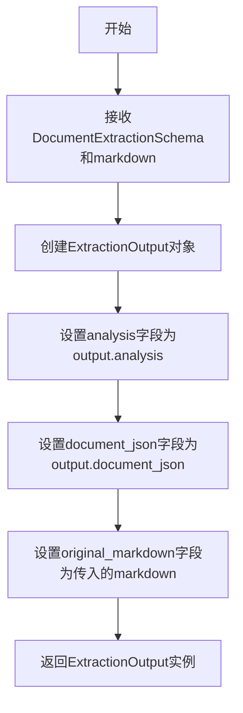
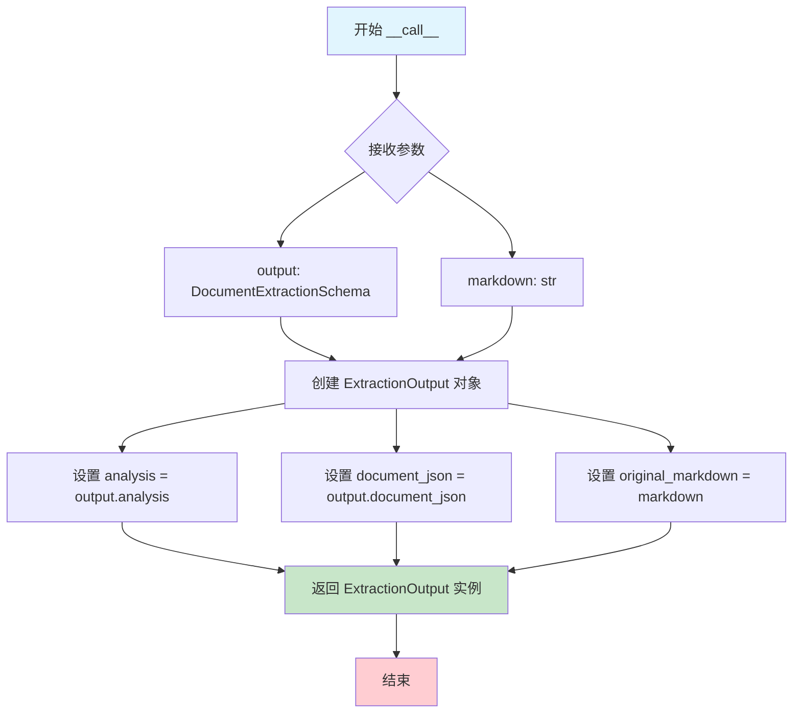

# `marker\marker\renderers\extraction.py` 详细设计文档

这是一个文档提取渲染器模块，负责将文档提取模式(DocumentExtractionSchema)和原始Markdown内容转换为结构化的提取输出(ExtractionOutput)，包含分析结果、JSON格式文档和原始Markdown三个部分。

## 整体流程



## 类结构

```
BaseModel (pydantic.BaseModel)
└── ExtractionOutput
BaseRenderer (marker.renderers.BaseRenderer)
└── ExtractionRenderer
```

## 全局变量及字段


### `ExtractionOutput`
    
文档提取输出模型，包含分析结果、JSON数据和原始Markdown

类型：`class (BaseModel)`
    


### `ExtractionRenderer`
    
文档提取渲染器类，用于处理文档提取结果并生成输出

类型：`class (BaseRenderer)`
    


### `ExtractionOutput.analysis`
    
文档分析结果，包含对文档内容的解读和分析

类型：`str`
    


### `ExtractionOutput.document_json`
    
以JSON字符串形式存储的文档结构化数据

类型：`str`
    


### `ExtractionOutput.original_markdown`
    
原始的Markdown格式文档内容

类型：`str`
    
    

## 全局函数及方法


### `ExtractionRenderer.__call__`

该方法是 `ExtractionRenderer` 类的可调用接口（`__call__` 魔术方法），接收文档提取模式对象和原始 Markdown 内容，将两者封装成统一的提取输出对象并返回。

参数：

- `output`：`DocumentExtractionSchema`，文档提取模式对象，包含分析结果和 JSON 文档
- `markdown`：`str`，原始 Markdown 文档内容

返回值：`ExtractionOutput`，包含分析结果、JSON 文档和原始 Markdown 的提取输出对象

#### 流程图



#### 带注释源码

```python
def __call__(
    self, output: DocumentExtractionSchema, markdown: str
) -> ExtractionOutput:
    # 这是一个临时的简单实现，后续需要进行更复杂的处理
    # 创建并返回 ExtractionOutput 对象，将传入的参数封装为统一格式
    return ExtractionOutput(
        analysis=output.analysis,           # 从 DocumentExtractionSchema 提取分析结果
        document_json=output.document_json, # 从 DocumentExtractionSchema 提取 JSON 文档
        original_markdown=markdown,          # 保留原始 Markdown 内容供后续使用
    )
```

## 关键组件


### ExtractionOutput

Pydantic BaseModel 类，用于封装文档提取的输出结果，包含分析结果、文档JSON和原始Markdown三个字段。

### ExtractionRenderer

文档渲染器类，继承自 BaseRenderer，负责将文档提取模式转换为结构化的提取输出。

### __call__ 方法

 ExtractionRenderer 类的可调用接口，接收文档提取模式和Markdown字符串，返回 ExtractionOutput 对象。

### BaseRenderer

外部依赖的基类，定义了渲染器的抽象接口，ExtractionRenderer 需要实现其约定的方法。

### DocumentExtractionSchema

外部依赖的数据模式类，来自 marker.extractors.document，定义了文档提取的结构化模式。


## 问题及建议


### 已知问题

-   代码中存在TODO注释，表明当前实现为简化版本，核心处理逻辑尚未完成
-   `document_json`字段使用字符串类型存储JSON数据，无法利用Pydantic的JSON验证功能
-   `original_markdown`字段命名冗余，可简化为`markdown`
-   缺少类和方法级别的文档字符串（docstring），影响代码可维护性
-   未实现任何错误处理和异常捕获机制
-   未添加日志记录，无法追踪执行过程和调试问题
-   `BaseRenderer`父类具体接口未知，可能存在抽象方法未实现的隐藏风险

### 优化建议

-   将`document_json`字段类型改为`Json`类型以获得自动JSON验证
-   添加完整的文档字符串，说明类用途和参数含义
-   实现try-except错误处理，捕获可能的异常情况
-   添加结构化日志记录，便于问题追踪
-   考虑实现父类要求的抽象方法，确保接口完整性
-   补充单元测试，覆盖正常和异常场景
-   将注释中提到的"more complex stuff"具体化，明确后续开发需求

## 其它


### 设计目标与约束

本模块旨在将文档提取结果（DocumentExtractionSchema）渲染为结构化的输出（ExtractionOutput），包含分析文本、JSON数据和原始Markdown内容。设计约束包括：必须继承自BaseRenderer基类、返回类型必须为ExtractionOutput、保持与DocumentExtractionSchema的兼容性。

### 错误处理与异常设计

当前实现未包含显式的错误处理机制。潜在的异常场景包括：DocumentExtractionSchema对象结构不匹配、markdown参数为None或空字符串、字段验证失败（Pydantic自动验证）。建议添加try-except块捕获ValidationError，并提供默认值或日志记录。

### 数据流与状态机

数据流为：输入（DocumentExtractionSchema + markdown）→ ExtractionRenderer.__call__() → ExtractionOutput。状态机较为简单，仅包含"初始化→处理→返回"三个状态，无复杂状态转换。

### 外部依赖与接口契约

外部依赖包括：pydantic（数据验证）、marker.extractors.document.DocumentExtractionSchema（输入类型）、marker.renderers.BaseRenderer（基类）。接口契约：__call__方法接受output: DocumentExtractionSchema和markdown: str两个参数，返回ExtractionOutput实例。

### 性能考虑

当前实现为轻量级封装，性能开销主要来自Pydantic模型实例化。建议：如果吞吐量较高，可考虑使用model_validate而非直接构造，或缓存ExtractionOutput实例。

### 安全性考虑

当前代码无安全性问题。潜在风险：如果document_json字段包含用户输入，需防范JSON注入攻击；analysis字段可能包含敏感信息，需考虑脱敏处理。

### 测试策略

建议测试用例包括：正常场景测试（给定有效的DocumentExtractionSchema和markdown返回正确ExtractionOutput）、边界情况测试（空字符串、None值）、类型错误测试（传入错误类型参数）、基类兼容性测试（确保继承自BaseRenderer）。

### 配置管理

当前无配置参数。可能的配置项包括：输出格式版本控制、字段别名映射、默认值策略配置等。

### 版本兼容性

依赖版本要求：pydantic >= 2.0（使用BaseModel）、marker相关模块需与当前版本兼容。建议在requirements.txt或pyproject.toml中明确版本约束。

### 部署相关

本模块为库代码，无独立部署需求。需确保目标环境已安装marker及其所有依赖项。建议使用虚拟环境或容器化部署以隔离依赖。

### 扩展性分析

代码注释已指出"we definitely want to do more complex stuff here soon"，表明未来扩展方向可能包括：多格式输出支持、样式渲染、批处理能力、元数据提取增强等。建议采用策略模式或装饰器模式设计以支持扩展。


    