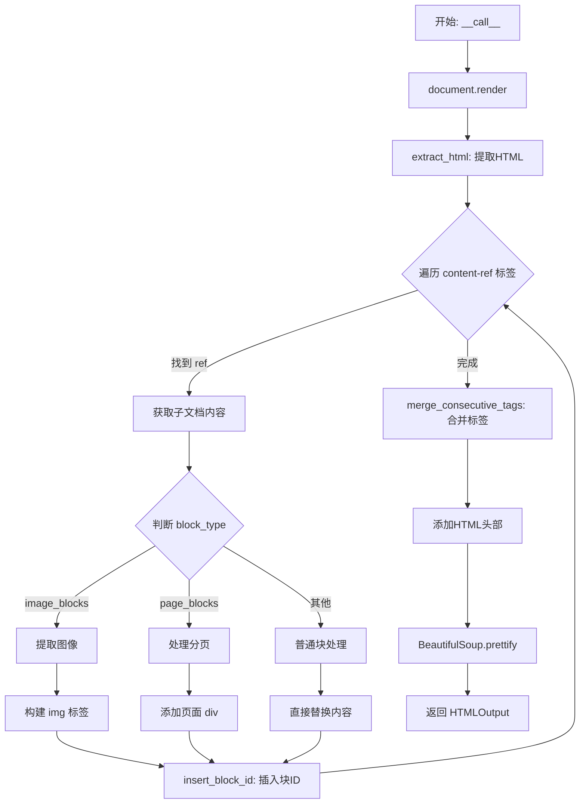
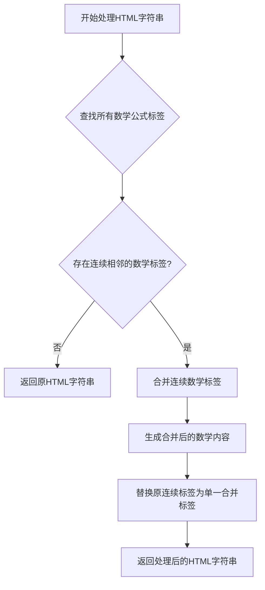
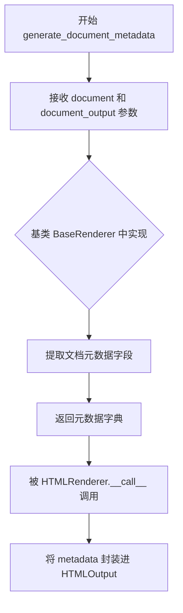
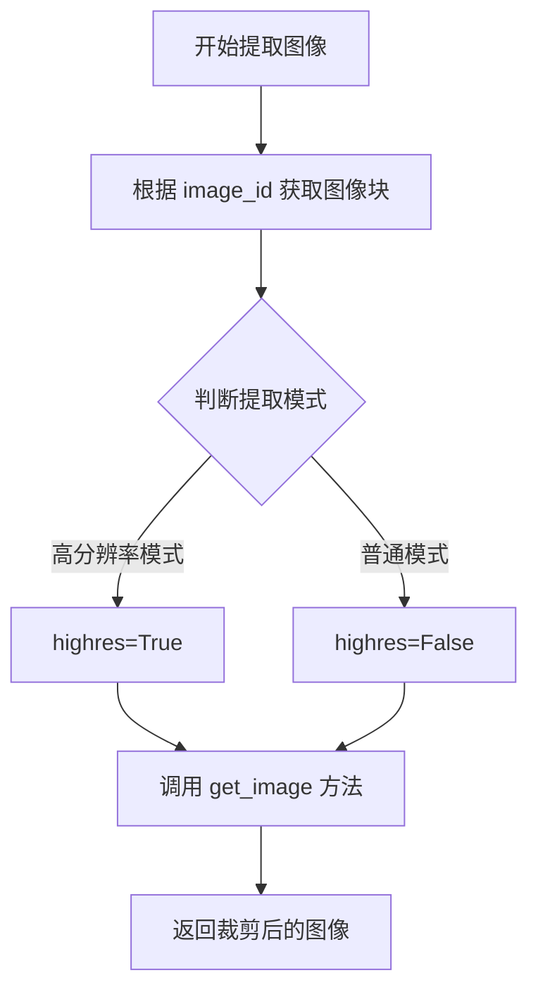
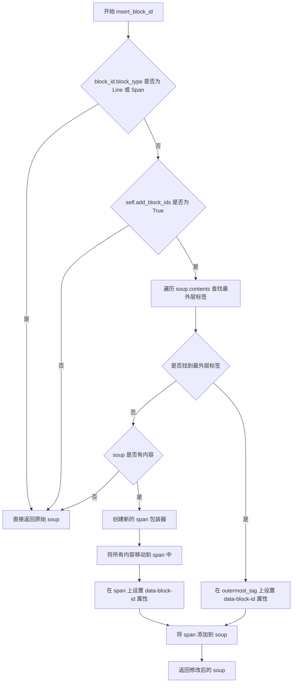
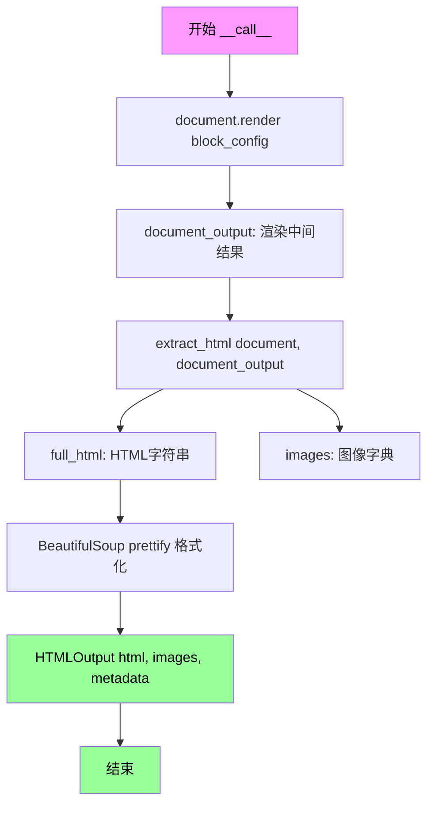

```mermaid
flowchart TD
    A[开始] --> B[解析HTML字符串]
    B --> C{查找连续相同标签}
    C -->|找到| D[提取两个标签之间的内容]
    D --> E[将内容合并到前一个标签中]
    E --> F[移除后一个标签]
    F --> C
    C -->|未找到| G[返回处理后的HTML]
    G --> H[结束]
```

# `marker\marker\renderers\html.py` 详细设计文档

该文件实现了一个HTML渲染器，用于将文档对象转换为HTML输出。它处理文档中的内容引用、图像提取、块ID插入，并支持分页功能。核心类HTMLRenderer继承自BaseRenderer，通过extract_html方法递归处理文档结构，最终生成格式化的HTML字符串和相关的图像资源。

## 整体流程



## 类结构

```
BaseRenderer (抽象基类)
└── HTMLRenderer
    └── HTMLOutput (Pydantic BaseModel - 数据模型)
```

## 全局变量及字段


### `Image.MAX_IMAGE_PIXELS`
    
全局设置，无限制图像像素

类型：`None (全局设置)`
    


### `HTMLOutput.html`
    
生成的HTML字符串

类型：`str`
    


### `HTMLOutput.images`
    
图像名称到图像对象的映射字典

类型：`dict`
    


### `HTMLOutput.metadata`
    
文档元数据信息

类型：`dict`
    


### `HTMLRenderer.page_blocks`
    
视为页面的块类型元组

类型：`Annotated[Tuple[BlockTypes], str]`
    


### `HTMLRenderer.paginate_output`
    
是否分页输出标志

类型：`Annotated[bool, str]`
    
    

## 全局函数及方法


### `HTMLRenderer.merge_consecutive_tags`

该方法用于合并HTML输出中连续出现的相同类型标签（例如连续的两个 `<b>` 标签），以生成更干净、更符合HTML语法的输出。

参数：

-  `output`：`str`，需要处理的HTML字符串
-  `tag`：`str`，要合并的标签类型（如 "b" 表示加粗，"i" 表示斜体）

返回值：`str`，合并连续标签后的HTML字符串

#### 流程图



#### 带注释源码

```
# 注意: 此方法的实现未在提供的代码中显示
# 根据代码调用位置推断，该方法应执行以下操作：
# 1. 接收HTML字符串和标签类型（如"b"或"i"）
# 2. 查找该类型标签的连续出现
# 3. 合并连续标签的内容，移除冗余标签
# 4. 返回优化后的HTML

# 调用示例（在 extract_html 方法中）:
# output = self.merge_consecutive_tags(output, "b")  # 合并连续的加粗标签
# output = self.merge_consecutive_tags(output, "i")  # 合并连续的斜体标签
```

---

**注意**：该方法的完整实现未在提供的代码片段中显示。它可能在基类 `BaseRenderer` 中定义，或在项目的其他模块中实现。根据方法名称和调用上下文，其核心功能是合并HTML中连续出现的同类型标签，以生成更精简的HTML输出。


### `HTMLRenderer.merge_consecutive_math`

该方法用于合并HTML输出中连续的内联数学公式标签（MathML或类似的数学标签），以避免在渲染时出现多个相邻的独立数学公式块，从而优化最终的HTML输出结构和可读性。

参数：

- `output`：`str`，需要处理的HTML字符串，包含可能存在的连续数学公式标签

返回值：`str`，处理后的HTML字符串，其中连续的内联数学公式标签已被合并

#### 流程图



#### 带注释源码

```python
def merge_consecutive_math(self, output: str) -> str:
    """
    合并HTML中连续的内联数学公式标签。
    
    该方法通过BeautifulSoup解析HTML,查找相邻的数学公式标签(如MathML标签),
    将它们合并为单个数学公式块,以优化渲染效果。
    
    参数:
        output: str, 原始HTML字符串,可能包含连续的math标签
        
    返回:
        str, 合并连续math标签后的HTML字符串
    """
    # 使用BeautifulSoup解析HTML字符串
    soup = BeautifulSoup(output, "html.parser")
    
    # 查找所有的math标签(数学公式容器)
    math_tags = soup.find_all("math")
    
    # 如果没有math标签或只有一个,直接返回原HTML
    if len(math_tags) <= 1:
        return output
    
    # 合并逻辑:遍历math标签,合并相邻的标签
    # 具体实现依赖于具体的数学标签结构和合并规则
    # ...
    
    # 返回处理后的HTML字符串
    return str(soup)
```

> **注意**: 由于提供的代码片段中没有 `merge_consecutive_math` 方法的具体实现，上述源码是基于该方法的调用上下文和注释推断的理想化实现。该方法很可能定义在父类 `BaseRenderer` 中，或通过混入(mixin)方式提供。从代码第128行的调用 `output = self.merge_consecutive_math(output)` 可以确认该方法接受一个HTML字符串参数并返回处理后的HTML字符串。


### `HTMLRenderer.generate_document_metadata`

生成文档元数据的方法，继承自 `BaseRenderer` 基类。该方法在 `HTMLRenderer.__call__` 中被调用，用于从渲染后的文档中提取元数据信息（如标题、作者、关键词等），并将其包含在最终的 `HTMLOutput` 中返回。

参数：

- `document`：`Any`，原始文档对象，包含待渲染的文档内容
- `document_output`：`Any`，文档的渲染输出结果，包含渲染后的块结构信息

返回值：`dict`，包含提取的文档元数据信息

#### 流程图



#### 带注释源码

```
# 由于 generate_document_metadata 方法继承自 BaseRenderer，
# 其完整实现不在当前代码文件中。以下为该方法在 HTMLRenderer 中的调用方式：

def __call__(self, document) -> HTMLOutput:
    """
    渲染文档为 HTML 输出。
    """
    # 1. 调用 document.render 方法进行渲染，得到 document_output
    document_output = document.render(self.block_config)
    
    # 2. 提取 HTML 和图像
    full_html, images = self.extract_html(document, document_output)
    
    # 3. 美化 HTML 格式
    soup = BeautifulSoup(full_html, "html.parser")
    full_html = soup.prettify()
    
    # 4. 调用继承的 generate_document_metadata 方法生成元数据
    # 参数: document - 原始文档对象
    # 参数: document_output - 渲染输出结果
    # 返回: dict 类型的元数据字典
    metadata = self.generate_document_metadata(document, document_output)
    
    # 5. 返回包含 HTML、图像和元数据的 HTMLOutput 对象
    return HTMLOutput(
        html=full_html,
        images=images,
        metadata=metadata,
    )
```

> **注意**：`generate_document_metadata` 方法的具体实现位于 `BaseRenderer` 基类中，未在当前代码文件中展示。从调用方式可推断该方法接收文档和渲染输出作为输入，返回包含文档元数据的字典对象。


### `HTMLRenderer.extract_image`

该方法根据提供的图像 ID 从文档中提取并返回裁剪后的图像，支持高分辨率和普通分辨率两种模式。

参数：

- `document`：`Document`，包含完整文档数据的文档对象，用于访问块内容
- `image_id`：`BlockId`，要提取的图像块的唯一标识符

返回值：`Image`（PIL.Image 对象），裁剪后的图像对象

#### 流程图



#### 带注释源码

```python
def extract_image(self, document, image_id):
    """
    根据 image_id 从文档中提取对应的图像块
    
    参数:
        document: 文档对象,包含完整的文档数据和块信息
        image_id: 图像块的唯一标识符
    
    返回:
        裁剪后的 PIL Image 对象
    """
    # 根据 image_id 获取对应的图像块对象
    image_block = document.get_block(image_id)
    
    # 调用图像块的 get_image 方法提取图像
    # 根据 self.image_extraction_mode 判断是否使用高分辨率模式
    cropped = image_block.get_image(
        document, highres=self.image_extraction_mode == "highres"
    )
    
    # 返回裁剪后的图像对象
    return cropped
```


### `HTMLRenderer.insert_block_id`

该方法用于将块ID作为HTML数据属性（data-block-id）插入到BeautifulSoup对象中，针对非行级和非跨域的块类型进行处理。如果启用了添加块ID的选项，它会尝试找到最外层标签并添加属性，或者在只有文本内容时创建一个span包装器。

参数：

- `soup`：BeautifulSoup，需要插入block ID的HTML soup对象
- `block_id: BlockId`：块ID对象，包含要插入的块标识信息

返回值：`modified soup`，返回添加了块ID属性后的BeautifulSoup对象

#### 流程图



#### 带注释源码

```python
def insert_block_id(self, soup, block_id: BlockId):
    """
    Insert a block ID into the soup as a data attribute.
    """
    # 如果块类型是 Line 或 Span，则不需要添加块ID，直接返回原始 soup
    # 因为这些是行内元素，不适合作为块级标识
    if block_id.block_type in [BlockTypes.Line, BlockTypes.Span]:
        return soup

    # 只有在启用添加块ID配置时才进行处理
    if self.add_block_ids:
        # Find the outermost tag (first tag that isn't a NavigableString)
        # 查找最外层标签（第一个不是 NavigableString 的标签）
        outermost_tag = None
        for element in soup.contents:
            if hasattr(element, "name") and element.name:
                outermost_tag = element
                break

        # If we found an outermost tag, add the data-block-id attribute
        # 如果找到最外层标签，直接在其上添加 data-block-id 属性
        if outermost_tag:
            outermost_tag["data-block-id"] = str(block_id)

        # If soup only contains text or no tags, wrap in a span
        # 如果 soup 只包含文本或没有标签，需要用 span 包装
        elif soup.contents:
            # 创建新的 span 标签作为包装器
            wrapper = soup.new_tag("span")
            # 设置 data-block-id 属性
            wrapper["data-block-id"] = str(block_id)

            # 将 soup 中的所有内容移动到 span 包装器中
            contents = list(soup.contents)
            for content in contents:
                content.extract()
                wrapper.append(content)
            # 将包装器添加到 soup 中
            soup.append(wrapper)
    # 返回修改后的 soup 对象
    return soup
```


### `HTMLRenderer.extract_html`

该方法递归解析文档输出中的 HTML 内容，处理 `content-ref` 标签，提取图片，处理分页，并生成最终的 HTML 文档。它是 HTML 渲染器的核心方法，负责将内部文档结构转换为可显示的 HTML。

参数：

- `self`：HTMLRenderer，渲染器实例本身
- `document`：`Document`，原始文档对象，用于获取块信息和图片数据
- `document_output`：渲染后的文档输出对象，包含 HTML 字符串和子元素
- `level`：`int`，递归深度，默认为 0，用于判断是否为顶层调用

返回值：`Tuple[str, dict]`，返回包含最终 HTML 字符串和提取的图片字典的元组

#### 流程图

```mermaid
flowchart TD
    A[开始 extract_html] --> B[使用 BeautifulSoup 解析 document_output.html]
    B --> C[查找所有 content-ref 标签]
    C --> D{还有未处理的 ref?}
    D -->|是| E[获取 ref 的 src 属性]
    E --> F[遍历 document_output.children 查找匹配的 item]
    F --> G{找到匹配的 item?}
    G -->|是| H[递归调用 extract_html]
    G -->|否| I[跳过该 ref]
    H --> J{判断 ref_block_id.block_type]
    J -->|image_blocks| K[提取图片或添加描述]
    J -->|page_blocks| L[处理分页逻辑]
    J -->|其他| M[正常处理块]
    K --> N[替换 ref 为处理后的元素]
    L --> N
    M --> N
    N --> D
    D -->|否| O{level == 0?]
    O -->|是| P[合并相邻 b 标签]
    P --> Q[合并相邻 i 标签]
    Q --> R[合并相邻 math 标签]
    R --> S[添加 HTML 文档结构]
    O -->|否| T[直接返回结果]
    S --> U[返回 output 和 images]
    T --> U
```

#### 带注释源码

```python
def extract_html(self, document, document_output, level=0):
    """
    从文档输出中提取并处理 HTML 内容。
    
    参数:
        document: 原始文档对象，用于获取块信息和图片数据
        document_output: 渲染后的文档输出，包含 HTML 字符串
        level: 递归深度，0 表示顶层调用
    
    返回:
        包含 HTML 字符串和提取图片的元组
    """
    # 1. 使用 BeautifulSoup 解析 HTML
    soup = BeautifulSoup(document_output.html, "html.parser")

    # 2. 查找所有 content-ref 标签（文档中的引用标记）
    content_refs = soup.find_all("content-ref")
    ref_block_id = None
    images = {}
    
    # 3. 遍历每个 content-ref 进行处理
    for ref in content_refs:
        # 获取引用来源
        src = ref.get("src")
        sub_images = {}
        content = ""
        
        # 4. 在子元素中查找匹配的项
        for item in document_output.children:
            if item.id == src:
                # 递归处理子元素
                content, sub_images_ = self.extract_html(document, item, level + 1)
                sub_images.update(sub_images_)
                ref_block_id: BlockId = item.id
                break

        # 5. 根据块类型处理图片块
        if ref_block_id.block_type in self.image_blocks:
            if self.extract_images:
                # 提取高分辨率图片
                image = self.extract_image(document, ref_block_id)
                # 生成图片文件名
                image_name = f"{ref_block_id.to_path()}.{settings.OUTPUT_IMAGE_FORMAT.lower()}"
                images[image_name] = image
                # 创建包含图片的段落元素
                element = BeautifulSoup(
                    f"<p>{content}</p>", "html.parser"
                )
                ref.replace_with(self.insert_block_id(element, ref_block_id))
            else:
                # 使用图片描述（LLM 模式）或空内容
                element = BeautifulSoup(f"{content}", "html.parser")
                ref.replace_with(self.insert_block_id(element, ref_block_id))
        
        # 6. 根据块类型处理页面块
        elif ref_block_id.block_type in self.page_blocks:
            images.update(sub_images)
            if self.paginate_output:
                # 添加分页容器和页面 ID
                content = f"<div class='page' data-page-id='{ref_block_id.page_id}'>{content}</div>"
            element = BeautifulSoup(f"{content}", "html.parser")
            ref.replace_with(self.insert_block_id(element, ref_block_id))
        
        # 7. 处理其他类型的块
        else:
            images.update(sub_images)
            element = BeautifulSoup(f"{content}", "html.parser")
            ref.replace_with(self.insert_block_id(element, ref_block_id))

    # 8. 将处理后的 soup 转换为字符串
    output = str(soup)
    
    # 9. 如果是顶层调用，进行最终处理
    if level == 0:
        # 合并相邻的加粗标签
        output = self.merge_consecutive_tags(output, "b")
        # 合并相邻的斜体标签
        output = self.merge_consecutive_tags(output, "i")
        # 合并相邻的内联数学标签
        output = self.merge_consecutive_math(output)
        # 添加完整的 HTML 文档结构
        output = textwrap.dedent(f"""
        <!DOCTYPE html>
        <html>
            <head>
                <meta charset="utf-8" />
            </head>
            <body>
                {output}
            </body>
        </html>
""")

    # 10. 返回 HTML 内容和提取的图片
    return output, images
```


### `HTMLRenderer.__call__`

该方法是 `HTMLRenderer` 类的主入口，使其实例可作为函数调用。它接收一个文档对象，依次执行渲染、HTML提取、格式化，最终返回包含完整HTML、图像和元数据的 `HTMLOutput` 对象。

参数：

- `document`：`Any`，待渲染的文档对象，必须实现 `render` 方法以生成中间格式的 `document_output`

返回值：`HTMLOutput`，包含渲染后的完整HTML字符串、提取的图像字典以及文档元数据的模型对象

#### 流程图



#### 带注释源码

```python
def __call__(self, document) -> HTMLOutput:
    """
    将 HTMLRenderer 作为可调用对象使用时的入口方法。
    负责协调整个文档到 HTML 的转换流程。
    
    Args:
        document: 文档对象，需提供 render 方法返回中间渲染结果
        
    Returns:
        HTMLOutput: 包含 HTML 字符串、图像字典和元数据的输出对象
    """
    # 第一步：调用文档对象的 render 方法，传入块配置
    # 这会返回一个中间表示对象 document_output
    # 包含各个块的渲染结果（可能是 JSON 或其他中间格式）
    document_output = document.render(self.block_config)
    
    # 第二步：从中间表示中提取完整的 HTML 和图像
    # extract_html 方法会遍历 document_output 中的内容引用（content-ref）
    # 递归处理嵌套块，并处理图像替换和分页逻辑
    # 返回 tuple: (HTML字符串, 图像名称到图像对象的字典)
    full_html, images = self.extract_html(document, document_output)
    
    # 第三步：使用 BeautifulSoup 对 HTML 进行格式化（缩进美化）
    # 这会使输出的 HTML 更易于阅读和调试
    soup = BeautifulSoup(full_html, "html.parser")
    full_html = soup.prettify()  # Add indentation to the HTML
    
    # 第四步：生成文档元数据并组装最终的 HTMLOutput 对象
    # generate_document_metadata 可能提取标题、作者、页数等信息
    return HTMLOutput(
        html=full_html,           # 格式化后的完整 HTML 文档字符串
        images=images,            # 提取的图像 {文件名: PIL Image对象}
        metadata=self.generate_document_metadata(document, document_output),
    )
```

## 关键组件


### HTMLOutput

Pydantic数据模型，定义HTML渲染的输出结构，包含html字符串、images字典和metadata字典三个字段，用于封装最终的渲染结果。

### HTMLRenderer

核心渲染器类，继承自BaseRenderer，负责将文档对象渲染为HTML格式。支持图像提取、块ID注入、分页输出等功能的协调与执行。

### 图像提取组件

由extract_image方法实现，负责根据image_id从文档中获取对应的图像块，支持高分辨率和普通分辨率两种提取模式，用于生成独立的图像文件。

### 块ID注入组件

由insert_block_id方法实现，负责将BlockId以data-block-id属性的形式注入到HTML元素中，仅对Line和Span以外的块类型进行处理，支持文本内容的包装和最外层标签的属性添加。

### 内容引用处理组件

由extract_html方法中的content_refs处理逻辑实现，负责解析文档中的content-ref标签，递归提取子内容，处理图像块、页面块和其他块类型的不同渲染策略。

### 图像块处理组件

处理BlockTypes.Image类型的块，根据extract_images标志决定是提取实际图像还是使用LLM生成的描述文本，生成图像文件名并创建img标签。

### 页面分页组件

由paginate_output标志和page_blocks配置定义，支持将输出内容按页面分割，每个页面包装在带有data-page-id属性的div中。

### 连续标签合并组件

通过merge_consecutive_tags和merge_consecutive_math方法实现，用于清理HTML输出中的连续相同标签（如连续的b标签、i标签和行内数学标签），提升输出质量。

### 元数据生成组件

由generate_document_metadata方法调用（在__call__中），负责从文档和文档输出中提取元数据信息。


## 问题及建议


### 已知问题

-   **类型注解误用**：`ref_block_id: BlockId = item.id` 这行代码将类型注解用于赋值操作，语义错误且具有误导性，应改为 `ref_block_id = item.id`
-   **空值引用风险**：`ref_block_id` 在循环外使用，但可能在循环中未被赋值（当 `item.id == src` 不匹配时），导致后续 `ref_block_id.block_type` 访问时出现 `AttributeError`
-   **重复解析 HTML**：在 `extract_html` 方法中多次创建 `BeautifulSoup` 对象和调用 `str()`，对大型文档性能影响显著
-   **过度美化开销**：`soup.prettify()` 虽然提供格式化输出，但对于大型文档会显著增加处理时间和内存占用
-   **魔法字符串**：在 `merge_consecutive_tags` 调用中使用硬编码字符串 `"b"` 和 `"i"`，缺乏可读性和可维护性
-   **方法职责过重**：`extract_html` 方法同时处理内容引用解析、图像提取、页面分页和块 ID 插入，违反单一职责原则
-   **缺少异常处理**：对 `document.get_block(image_id)` 和 `image_block.get_image()` 等可能失败的操作缺乏异常捕获机制

### 优化建议

-   **修复类型标注**：将 `ref_block_id: BlockId = item.id` 改为先定义 `ref_block_id: Optional[BlockId] = None`，循环内赋值后添加 None 检查
-   **减少 HTML 解析次数**：考虑使用正则表达式或流式处理替代多次 BeautifulSoup 解析，或在最终输出时仅调用一次 prettify
-   **提取配置常量**：将 `"b"`, `"i"` 等标签名提取为类常量或配置项
-   **拆分大型方法**：将 `extract_html` 拆分为 `process_content_refs`、`extract_images`、`handle_pages` 等独立方法
-   **添加错误处理**：为图像提取和块访问添加 try-except 块，处理可能的无效 ID 或损坏数据
-   **考虑性能优化**：对于大型文档，可添加 `lru_cache` 或流式处理机制，避免重复渲染
-   **添加日志记录**：在关键路径添加日志，便于生产环境调试

## 其它


### 设计目标与约束

**设计目标**：提供一个将文档对象渲染为格式化HTML输出的渲染器，支持图像提取、页面分页、内容引用解析和HTML美化等功能。

**约束条件**：
- 依赖 BeautifulSoup 进行HTML解析和操作
- 依赖PIL进行图像处理
- 依赖Pydantic进行数据验证
- 使用Pillow时需抑制DecompressionBombError
- BeautifulSoup警告需被忽略

### 错误处理与异常设计

代码中通过以下方式进行错误处理：
- 使用`warnings.filterwarnings`忽略BeautifulSoup的MarkupResemblesLocatorWarning
- 设置`Image.MAX_IMAGE_PIXELS = None`抑制大图像的DecompressionBombError
- 异常处理主要依赖Python内置异常机制，未见自定义异常类
- 在`extract_html`方法中，通过遍历`document_output.children`查找匹配的block_id，若未找到则静默跳过

### 数据流与状态机

**数据流**：
1. 输入：Document对象（包含待渲染的块结构）
2. 渲染：调用`document.render(self.block_config)`生成document_output
3. HTML提取：调用`extract_html`方法解析document_output.html为BeautifulSoup对象
4. 内容引用处理：遍历所有`<content-ref>`标签，递归处理子内容
5. 图像处理：根据block_type判断是否为图像块，提取并插入img标签
6. 页面处理：根据paginate_output设置决定是否添加分页div
7. 标签合并：对b、i和math标签进行合并优化
8. 输出包装：用DOCTYPE、html、head、body标签包装最终HTML
9. 美化：调用`soup.prettify()`格式化输出
10. 返回：HTMLOutput对象（包含html、images、metadata）

### 外部依赖与接口契约

**外部依赖**：
- `textwrap`：Python标准库，用于文本缩进处理
- `PIL.Image`：图像处理库，用于图像提取和裁剪
- `bs4.BeautifulSoup`：HTML/XML解析库
- `pydantic.BaseModel`：数据验证和设置管理
- `marker.renderers.BaseRenderer`：基类，提供渲染框架
- `marker.schema.BlockTypes`：块类型枚举
- `marker.schema.blocks.BlockId`：块标识符类
- `marker.settings.settings`：配置设置对象

**接口契约**：
- `HTMLRenderer`继承`BaseRenderer`，需实现`__call__`方法
- `__call__(self, document) -> HTMLOutput`：接收Document对象，返回HTMLOutput对象
- `extract_image(document, image_id)`：提取指定ID的图像块
- `insert_block_id(soup, block_id)`：在Soup中插入块ID属性
- `extract_html(document, document_output, level)`：递归提取和转换HTML

### 性能考虑

- 使用BeautifulSoup的html.parser解析器（纯Python实现，兼容性较好但速度不是最优）
- 图像提取可能涉及大量I/O操作
- 递归处理content-ref可能导致深度嵌套调用
- 多次字符串操作（str(soup)、prettify()）可能影响性能

### 安全性考虑

- HTML输出未显示进行XSS防护
- 未对输入的document对象进行详细验证
- block_id直接转换为字符串并插入DOM属性
- 图像文件名生成依赖block_id.to_path()，需确保路径安全

### 配置管理

通过Pydantic的Annotated进行类型标注和配置：
- `page_blocks`：配置视为页面的块类型，默认仅包含BlockTypes.Page
- `paginate_output`：布尔配置，控制是否分页输出
- 继承自BaseRenderer的配置：image_extraction_mode、add_block_ids、extract_images、image_blocks、block_config

### 版本兼容性

- 代码使用了Python类型注解（Annotated、Tuple）
- 依赖库版本需与marker库版本兼容
- PIL的MAX_IMAGE_PIXELS处理方式在不同版本间可能有变化

    