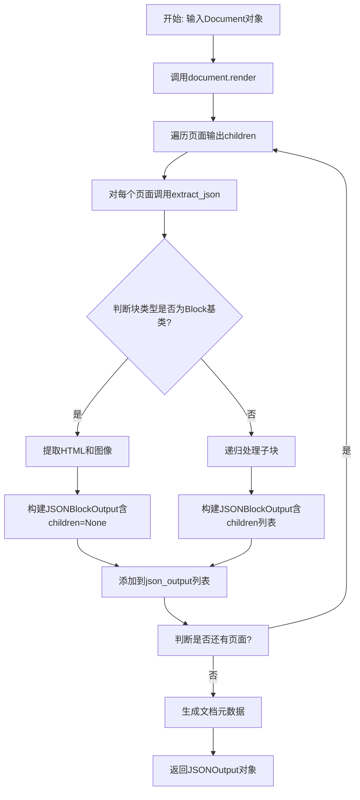
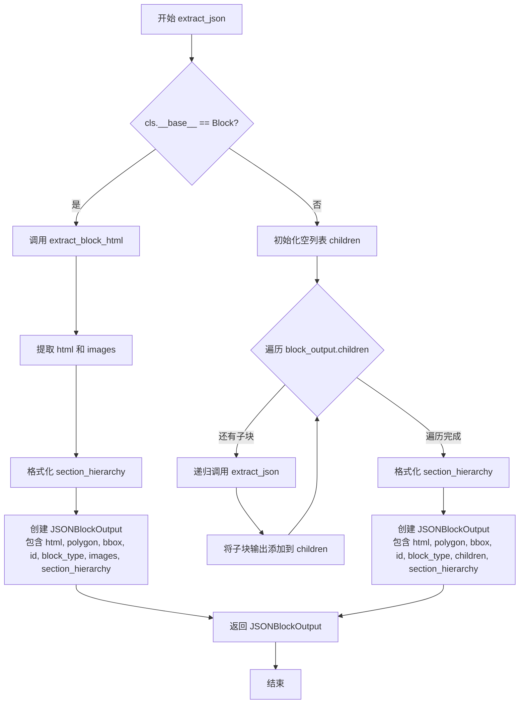
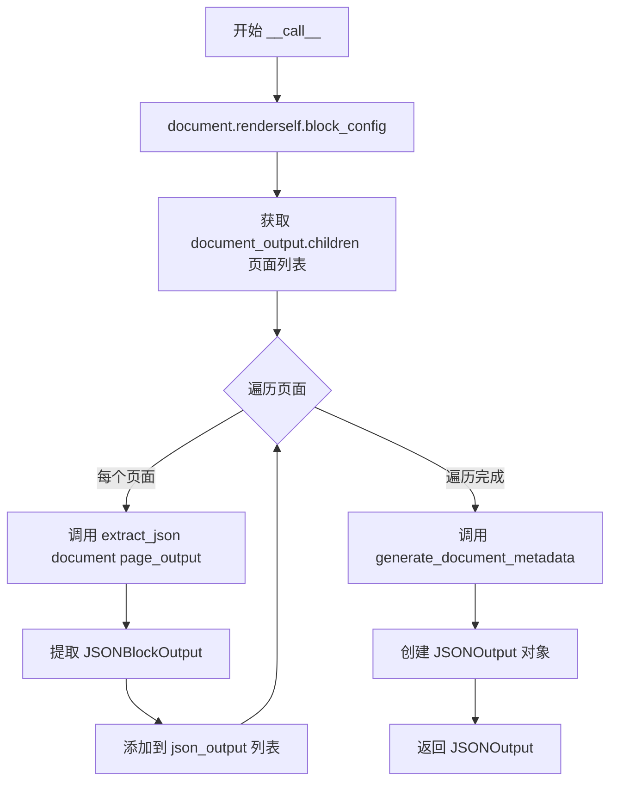

# `marker\marker\renderers\json.py` 详细设计文档

这是一个文档渲染器模块，将PDF或图像文档转换为结构化的JSON输出格式，支持提取文本、图像、层级结构等多样化信息。

## 整体流程



## 类结构

```
BaseRenderer (基类)
└── JSONRenderer (JSON渲染器)
    ├── JSONBlockOutput (Pydantic模型: 块输出)
    └── JSONOutput (Pydantic模型: 文档输出)
```

## 全局变量及字段


### `reformat_section_hierarchy`
    
将章节层级字典中的值转换为字符串的全局函数

类型：`Callable[[Dict[int, Any]], Dict[int, str]]`
    


### `JSONBlockOutput.JSONBlockOutput.id`
    
块的唯一标识符

类型：`str`
    


### `JSONBlockOutput.JSONBlockOutput.block_type`
    
块类型名称

类型：`str`
    


### `JSONBlockOutput.JSONBlockOutput.html`
    
HTML内容

类型：`str`
    


### `JSONBlockOutput.JSONBlockOutput.polygon`
    
多边形坐标

类型：`List[List[float]]`
    


### `JSONBlockOutput.JSONBlockOutput.bbox`
    
边界框坐标

类型：`List[float]`
    


### `JSONBlockOutput.JSONBlockOutput.children`
    
子块列表

类型：`List[JSONBlockOutput] | None`
    


### `JSONBlockOutput.JSONBlockOutput.section_hierarchy`
    
章节层级

类型：`Dict[int, str] | None`
    


### `JSONBlockOutput.JSONBlockOutput.images`
    
提取的图像数据

类型：`dict | None`
    


### `JSONOutput.JSONOutput.children`
    
页面块列表

类型：`List[JSONBlockOutput]`
    


### `JSONOutput.JSONOutput.block_type`
    
文档类型

类型：`str`
    


### `JSONOutput.JSONOutput.metadata`
    
文档元数据

类型：`dict`
    


### `JSONRenderer.JSONRenderer.image_blocks`
    
图像块类型配置

类型：`Annotated[Tuple[BlockTypes], str]`
    


### `JSONRenderer.JSONRenderer.page_blocks`
    
页面块类型配置

类型：`Annotated[Tuple[BlockTypes], str]`
    
    

## 全局函数及方法


### `reformat_section_hierarchy`

该函数用于将章节层级字典中的值转换为字符串格式，确保所有键对应的值都能被序列化为字符串，通常用于准备 JSON 输出的数据。

参数：

- `section_hierarchy`：`Dict[int, Any]`，输入的章节层级字典，键为整数类型（表示层级深度），值为任意类型

返回值：`Dict[int, str]`，返回一个新的字典，其中所有键保持不变，所有值都被转换为字符串格式

#### 流程图

```mermaid
flowchart TD
    A[开始] --> B[接收 section_hierarchy 字典]
    B --> C[创建空字典 new_section_hierarchy]
    C --> D{遍历 section_hierarchy 项}
    D -->|遍历每个 key-value| E[将 value 转换为字符串 str(value)]
    E --> F[key: str(value) 加入新字典]
    F --> D
    D -->|遍历完成| G[返回 new_section_hierarchy]
    G --> H[结束]
```

#### 带注释源码

```python
def reformat_section_hierarchy(section_hierarchy):
    """
    重新格式化章节层级字典，将所有值转换为字符串格式
    
    参数:
        section_hierarchy: 输入的章节层级字典，键为整数层级，值为任意类型
        
    返回:
        新的字典，所有值都被转换为字符串
    """
    # 初始化一个新的空字典用于存储转换后的结果
    new_section_hierarchy = {}
    
    # 遍历原始字典的每个键值对
    for key, value in section_hierarchy.items():
        # 将值转换为字符串并存储到新字典中，保持键不变
        new_section_hierarchy[key] = str(value)
    
    # 返回转换后的新字典
    return new_section_hierarchy
```


### `JSONRenderer.extract_json`

该方法递归地将文档块转换为JSON格式。对于基本块（如文本块），直接提取HTML内容和图片信息；对于容器块（如页面、章节），则递归处理其所有子块并构建嵌套的JSON结构。

参数：

- `document`：`Document`，文档对象，包含待渲染的完整文档数据
- `block_output`：`BlockOutput`，块输出对象，包含单个块或容器块的渲染结果

返回值：`JSONBlockOutput`，包含块的HTML内容、几何信息、类型标识、层级结构及子块列表（若有）的JSON块对象

#### 流程图



#### 带注释源码

```python
def extract_json(self, document: Document, block_output: BlockOutput):
    """
    递归提取块或容器块为JSON格式
    
    参数:
        document: Document - 文档对象
        block_output: BlockOutput - 块输出对象
    
    返回:
        JSONBlockOutput - JSON格式的块输出
    """
    # 根据块类型从注册表获取对应的块类
    cls = get_block_class(block_output.id.block_type)
    
    # 判断是否为基本块类型（非容器块）
    if cls.__base__ == Block:
        # 基本块：提取HTML内容和图片信息
        html, images = self.extract_block_html(document, block_output)
        
        # 返回基本块的JSON输出
        return JSONBlockOutput(
            html=html,  # HTML内容
            polygon=block_output.polygon.polygon,  # 多边形坐标
            bbox=block_output.polygon.bbox,  # 边界框
            id=str(block_output.id),  # 块唯一标识
            block_type=str(block_output.id.block_type),  # 块类型
            images=images,  # 关联图片
            section_hierarchy=reformat_section_hierarchy(
                block_output.section_hierarchy  # 章节层级结构
            ),
        )
    else:
        # 容器块：递归处理所有子块
        children = []
        for child in block_output.children:
            # 递归调用自身处理子块
            child_output = self.extract_json(document, child)
            children.append(child_output)
        
        # 返回容器块的JSON输出（包含子块列表）
        return JSONBlockOutput(
            html=block_output.html,  # 容器HTML
            polygon=block_output.polygon.polygon,
            bbox=block_output.polygon.bbox,
            id=str(block_output.id),
            block_type=str(block_output.id.block_type),
            children=children,  # 子块列表
            section_hierarchy=reformat_section_hierarchy(
                block_output.section_hierarchy
            ),
        )
```


### `JSONRenderer.__call__`

该方法是 JSON 渲染器的主入口方法，负责接收文档对象，执行完整的渲染流程，遍历文档的所有页面，提取每个页面的 JSON 表示，最终返回包含完整渲染结果和元数据的 JSONOutput 对象。

参数：

- `document`：`Document`，待渲染的文档对象，包含了需要渲染的所有内容和配置信息

返回值：`JSONOutput`，包含所有页面 JSON 块输出和文档元数据的输出对象

#### 流程图



#### 带注释源码

```
def __call__(self, document: Document) -> JSONOutput:
    """
    主入口方法，执行完整的 JSON 渲染流程。
    
    参数:
        document: Document 对象，包含待渲染的文档内容
        
    返回:
        JSONOutput 对象，包含所有页面的 JSON 表示和元数据
    """
    # 第一步：调用文档的 render 方法，使用当前渲染器的 block_config 配置
    # 返回 document_output，其中包含文档的层次化渲染结果
    document_output = document.render(self.block_config)
    
    # 第二步：初始化输出列表，用于存储每个页面的 JSON 表示
    json_output = []
    
    # 第三步：遍历文档输出的所有子节点（即页面节点）
    for page_output in document_output.children:
        # 对每个页面调用 extract_json 方法进行递归提取
        # 将提取的 JSONBlockOutput 添加到输出列表中
        json_output.append(self.extract_json(document, page_output))
    
    # 第四步：生成文档级别的元数据
    # 包括文档信息、统计信息等
    # 第五步：构建最终的 JSONOutput 对象并返回
    return JSONOutput(
        children=json_output,
        metadata=self.generate_document_metadata(document, document_output),
    )
```

## 关键组件


### JSONBlockOutput

Pydantic 数据模型，定义单个文档块的 JSON 输出结构，包含 id、block_type、html、polygon、bbox、children、section_hierarchy 和 images 字段，用于序列化渲染后的文档块信息。

### JSONOutput

Pydantic 数据模型，定义整个文档的 JSON 输出结构，包含 children（JSONBlockOutput 列表）、block_type 和 metadata 字段，作为 JSON 渲染器的顶层返回值。

### reformat_section_hierarchy

工具函数，将 section_hierarchy 字典中的值转换为字符串类型，确保层级结构中的所有值都能被序列化为 JSON 格式。

### JSONRenderer

核心渲染器类，继承自 BaseRenderer，负责将文档渲染输出转换为 JSON 格式。包含 image_blocks 和 page_blocks 两个类属性用于指定图像和页面块类型，通过 extract_json 方法递归提取块信息，支持块和容器两种处理模式，并实现 __call__ 方法作为渲染入口。

### 块类型识别与分类

通过 get_block_class 获取块类并判断其基类类型，区分 Block（叶子块）和容器块（包含 children），实现差异化的 JSON 提取逻辑。

### 递归块处理

extract_json 方法采用递归方式处理嵌套的块结构，对容器块遍历其子块并逐个调用自身转换，形成树形遍历逻辑。

### 文档渲染流程

__call__ 方法首先调用 document.render(self.block_config) 获取渲染输出，然后遍历页面子节点提取 JSON，最后生成文档元数据并组装为 JSONOutput 返回。


## 问题及建议


### 已知问题

-   **类型注解不一致**：`JSONBlockOutput` 中 `children` 定义为 `List["JSONBlockOutput"] | None`，但在 `extract_json` 方法的非 Block 分支中，`children` 总是作为 `List` 传入，从未传入 `None`，类型定义过于宽松。
-   **重复代码**：在 `extract_json` 方法中，Block 和非 Block 分支存在大量重复的字段赋值（`html`, `polygon`, `bbox`, `id`, `block_type`, `section_hierarchy`），可抽取为独立方法减少重复。
-   **错误处理缺失**：未对 `get_block_class` 返回值进行 `None` 检查，也未对 `extract_block_html` 的异常进行处理，若文档结构异常可能导致运行时错误。
-   **未使用的类属性**：`JSONRenderer` 中定义的 `image_blocks` 和 `page_blocks` 类属性在代码中未被使用，可能为遗留代码或未完成功能。
-   **性能优化空间**：`reformat_section_hierarchy` 方法每次调用都创建新字典，可考虑原地修改或使用缓存机制，尤其在处理大型文档时。

### 优化建议

-   **精简类型定义**：将 `children` 类型改为 `List[JSONBlockOutput]`，非空列表；`section_hierarchy` 可考虑使用 `Dict[int, str]` 而非 `Dict[int, str] | None`。
-   **提取公共方法**：将重复的字段赋值逻辑抽取为私有方法，例如 `_build_block_output(block_output, html, images)`，接收可选的 `html` 和 `images` 参数。
-   **添加错误处理**：在 `extract_json` 方法中添加 `try-except` 块处理可能的异常，或在关键方法返回前进行空值检查。
-   **移除未使用属性**：若 `image_blocks` 和 `page_blocks` 确实无需使用，可删除以减少代码理解成本；否则应实现其功能。
-   **优化字典操作**：`reformat_section_hierarchy` 可直接使用字典推导式简化：`return {k: str(v) for k, v in section_hierarchy.items()}`。

## 其它


### 设计目标与约束

设计目标是将文档对象模型(Document)转换为结构化的JSON格式，便于前端渲染、存储或API传输。约束包括：必须继承自BaseRenderer基类，输出格式必须符合JSONBlockOutput和JSONOutput的Pydantic模型定义，支持的图像块类型为Picture和Figure，支持的页面块类型为Page。

### 错误处理与异常设计

代码中未显式处理异常，主要依赖Pydantic的验证机制。当get_block_class返回不存在的块类型时可能抛出KeyError；当document.render()失败时异常会向上传播；extract_block_html的异常也会向上传递。建议在extract_json方法中添加try-except块处理块类型不匹配、HTML提取失败等场景。

### 数据流与状态机

数据流从Document对象开始，经过document.render()生成BlockOutput树，然后遍历页面块调用extract_json递归提取每个块的信息。状态机表现为：对于Block类型的块直接提取HTML和图像，对于非Block类型（如容器块）则递归处理其子节点。

### 外部依赖与接口契约

主要依赖包括：pydantic用于数据模型验证，marker.renderers.BaseRenderer基类，marker.schema.BlockTypes枚举，marker.schema.blocks.Block和BlockOutput，marker.schema.document.Document，marker.schema.registry.get_block_class函数。接口契约要求输入必须是Document对象，输出必须是JSONOutput对象。

### 性能考虑与优化空间

性能瓶颈在于递归遍历大量块时可能产生的开销。优化建议：1)对section_hierarchy的字符串转换可缓存结果；2)对于大型文档可考虑流式处理；3)可添加并行处理多个页面的选项；4)images字段可能较大，可考虑延迟加载或压缩。

### 安全性考虑

输出HTML内容未进行净化处理，可能存在XSS风险。images字典内容来自外部渲染，未验证其安全性。建议添加HTML sanitization步骤，对用户可见的输出进行脱敏处理。

### 兼容性考虑

代码使用Python 3.9+的类型注解语法(List[]、Dict[])，需要确保运行环境的Python版本兼容。Pydantic版本升级可能影响模型验证行为。BlockTypes枚举值和get_block_class的返回类型需要与marker库版本匹配。

### 配置说明

JSONRenderer继承自BaseRenderer，可通过block_config配置要处理的块类型。image_blocks和page_blocks为类属性，定义了图像块和页面块的类型过滤。

### 使用示例

```python
renderer = JSONRenderer()
document = Document(...)
json_output = renderer(document)
# json_output为JSONOutput对象，包含children和metadata
```

### 扩展性设计

可通过继承JSONRenderer并重写extract_json方法实现自定义JSON格式。image_blocks和page_blocks类属性可被子类覆盖以支持不同的块类型过滤逻辑。


    