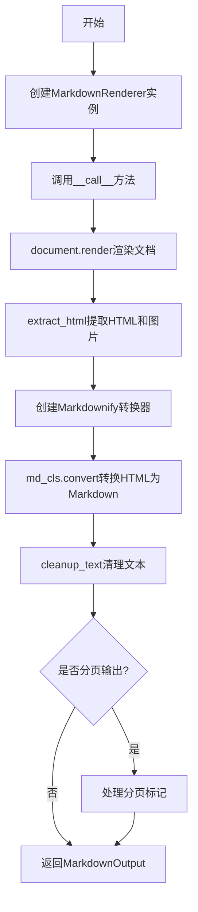
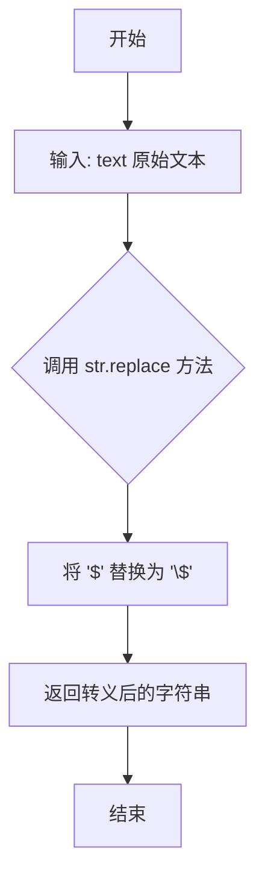
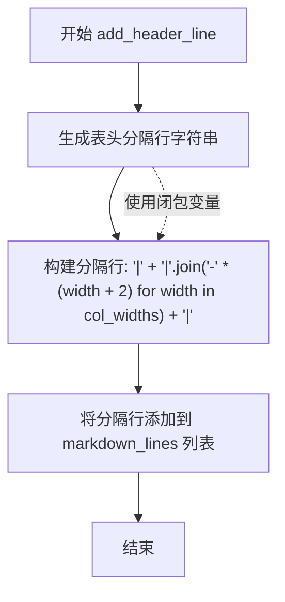
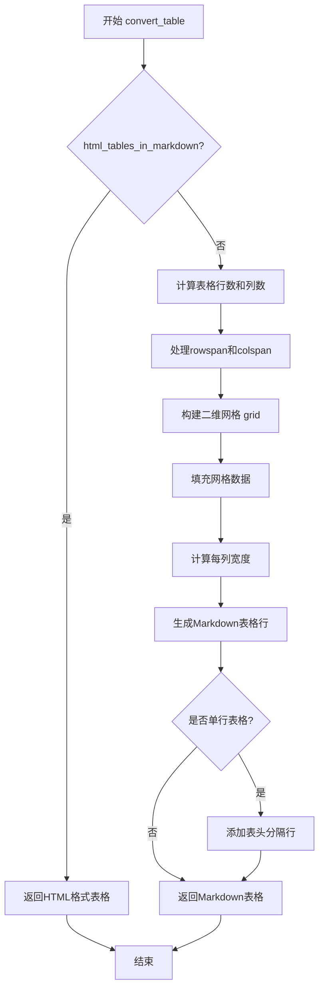
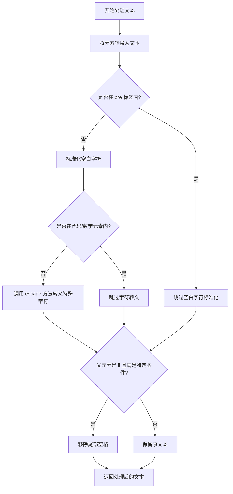
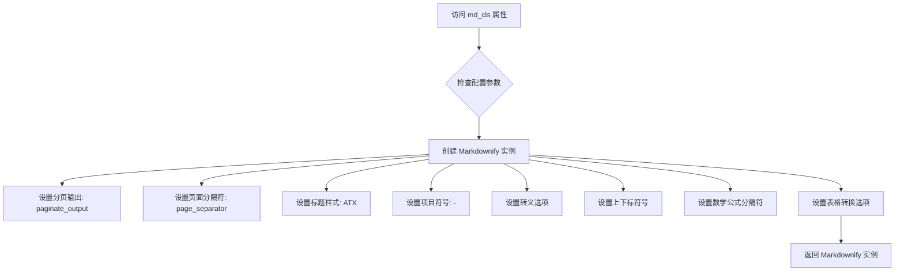

```mermaid
flowchart TD
    A[开始 __call__] --> B[document.render&#40;block_config&#41;]
    B --> C[extract_html&#40;document, document_output&#41;]
    C --> D[full_html, images = 提取结果]
    D --> E[md_cls.convert&#40;full_html&#41;]
    E --> F[cleanup_text&#40;markdown&#41;]
    F --> G{paginate_output?}
    G -->|Yes| H{markdown是否以\n\n开头?}
    H -->|No| I[markdown = \n\n + markdown]
    H -->|Yes| J{markdown是否以page_separator结尾?}
    I --> J
    J -->|Yes| K[markdown += \n\n]
    J -->|No| L[返回MarkdownOutput]
    G -->|No| L
    K --> L
```

# `marker\marker\renderers\markdown.py` 详细设计文档

这是一个HTML到Markdown的渲染器模块，主要用于将PDF转换后的HTML文档内容转换为Markdown格式，支持数学公式渲染、表格转换、分页处理等功能。

## 整体流程



## 类结构

```
HTMLRenderer (基类)
└── MarkdownRenderer

BaseModel (Pydantic基类)
└── MarkdownOutput

MarkdownConverter (第三方库基类)
└── Markdownify (自定义转换器)
```

## 全局变量及字段


### `logger`
    
用于记录日志信息的日志记录器对象

类型：`logging.Logger`
    


### `hyphens`
    
用于处理连字符和特殊横线字符的正则表达式字符集

类型：`str`
    


### `Markdownify.paginate_output`
    
控制是否启用分页输出功能

类型：`bool`
    


### `Markdownify.page_separator`
    
用于分隔多页文档的页面分隔符

类型：`str`
    


### `Markdownify.inline_math_delimiters`
    
内联数学公式的定界符元组

类型：`Tuple[str]`
    


### `Markdownify.block_math_delimiters`
    
块级数学公式的定界符元组

类型：`Tuple[str]`
    


### `Markdownify.html_tables_in_markdown`
    
控制在markdown中是否返回HTML格式的表格

类型：`bool`
    


### `MarkdownOutput.markdown`
    
转换后的markdown格式文本内容

类型：`str`
    


### `MarkdownOutput.images`
    
包含文档中所有图像的字典映射

类型：`dict`
    


### `MarkdownOutput.metadata`
    
文档的元数据信息字典

类型：`dict`
    


### `MarkdownRenderer.page_separator`
    
用于分隔多页文档的页面分隔符，默认值为48个连字符

类型：`str`
    


### `MarkdownRenderer.inline_math_delimiters`
    
内联数学公式的定界符元组，默认值为("$", "$")

类型：`Tuple[str]`
    


### `MarkdownRenderer.block_math_delimiters`
    
块级数学公式的定界符元组，默认值为("$$", "$$")

类型：`Tuple[str]`
    


### `MarkdownRenderer.html_tables_in_markdown`
    
控制在markdown中是否返回HTML格式的表格，默认为False

类型：`bool`
    
    

## 全局函数及方法


### `escape_dollars`

该函数是一个全局工具函数，用于将文本中的美元符号（$）替换为转义的 `\$`，防止在 Markdown 中被解析为数学公式的起始或结束标记。

参数：

- `text`：`str`，需要转义美元符号的文本

返回值：`str`，转义美元符号后的文本

#### 流程图



#### 带注释源码

```python
def escape_dollars(text):
    """
    转义文本中的美元符号，防止在markdown渲染时被解析为数学公式定界符
    
    参数:
        text (str): 输入的原始文本，可能包含美元符号
        
    返回值:
        str: 美元符号被转义后的文本，其中 '$' 变为 '\$'
    
    示例:
        >>> escape_dollars("Price is $100")
        'Price is \\$100'
        >>> escape_dollars("$$math$$")
        '\\$\\$math\\$\\$'
    """
    # 使用字符串的 replace 方法将所有美元符号替换为转义的版本
    # r"\$" 使用原始字符串，避免转义字符本身被再次转义
    return text.replace("$", r"\$")
```


### `cleanup_text`

该函数用于清理文本中的多余换行符，将连续超过2个的换行符压缩为2个，并去除文本首尾的空白字符，常用于 Markdown 文本的规范化处理。

参数：

- `full_text`：`str`，需要清理的原始文本字符串

返回值：`str`，清理后的文本字符串

#### 流程图

```mermaid
flowchart TD
    A[开始] --> B[接收 full_text 参数]
    B --> C{检查连续换行符<br/>r&quot;\n{3,}&quot;}
    C -->|替换| D[将3个以上连续换行符<br/>替换为 &quot;\n\n&quot;]
    D --> E{检查连续换行+空白<br/>r&quot;(\n\s){3,}&quot;}
    E -->|替换| F[将3个以上换行加空白<br/>替换为 &quot;\n\n&quot;]
    F --> G[调用 strip 方法<br/>去除首尾空白]
    G --> H[返回处理后的文本]
```

#### 带注释源码

```python
def cleanup_text(full_text):
    """
    清理文本中的多余换行符并去除首尾空白
    
    处理逻辑：
    1. 将3个或以上连续换行符压缩为2个（保留段落间隔）
    2. 将3个或以上"换行符+空白"组合压缩为2个换行符
    3. 去除文本首尾的空白字符
    """
    # 第一次替换：将3个或更多连续换行符替换为2个换行符
    # 正则解释：\n{3,} 匹配3个或更多连续换行字符
    # 示例："\n\n\n" -> "\n\n", "\n\n\n\n" -> "\n\n"
    full_text = re.sub(r"\n{3,}", "\n\n", full_text)
    
    # 第二次替换：将3个或更多"换行符+空白"组合替换为2个换行符
    # 正则解释：(\n\s){3,} 匹配3个或更多"换行符后跟空白字符"的序列
    # 这处理了跨行空白的情况，如 "\n \n \n" -> "\n\n"
    full_text = re.sub(r"(\n\s){3,}", "\n\n", full_text)
    
    # 最后使用 strip() 去除字符串首尾的空白字符（包括空格、制表符、换行符等）
    return full_text.strip()
```


### `get_formatted_table_text`

该函数用于将 HTML 表格元素的内容格式化为文本字符串，遍历元素的子节点，处理纯文本、换行符（`<br>`）、数学元素（`<math>`）和其他元素，并按照一定的规则（换行符直接保留，其他元素之间添加空格）拼接成最终文本。

参数：

- `element`：`Any`，待处理的 HTML 元素对象，通常为表格单元格元素（如 `<td>` 或 `<th>`）

返回值：`str`，格式化后的文本内容

#### 流程图

```mermaid
flowchart TD
    A[开始] --> B[初始化空列表 text]
    B --> C[遍历 element.contents]
    C --> D{content is None?}
    D -->|Yes| C
    D -->|No| E{isinstance content, NavigableString?}
    E -->|Yes| F[strip 并检查是否非空]
    F --> G{非空?}
    G -->|Yes| H[调用 escape_dollars 并添加到 text]
    G -->|No| C
    E -->|No| I{content.name == 'br'}
    I -->|Yes| J[添加 '<br>' 到 text]
    I -->|No| K{content.name == 'math'}
    K -->|Yes| L[添加 '$' + content.text + '$' 到 text]
    K -->|No| M[调用 escape_dollars 转换 str(content) 并添加]
    M --> C
    J --> C
    L --> C
    H --> C
    C --> N[遍历处理后的文本列表 text]
    N --> O[初始化空字符串 full_text]
    O --> P[遍历索引 i 和文本 t]
    P --> Q{t == '<br>'?}
    Q -->|Yes| R[直接拼接 t 到 full_text]
    Q -->|No| S{i > 0 且 text[i-1] != '<br>'?}
    S -->|Yes| T[拼接 ' ' + t 到 full_text]
    S -->|No| U[拼接 t 到 full_text]
    R --> V[继续下一轮]
    T --> V
    U --> V
    V --> W{i < len(text)-1?}
    W -->|Yes| P
    W -->|No| X[返回 full_text]
    X --> Z[结束]
```

#### 带注释源码

```python
def get_formatted_table_text(element):
    """
    将 HTML 表格元素的内容格式化为文本字符串
    
    处理逻辑：
    1. 遍历元素的子节点
    2. 对不同类型的子节点进行相应处理：
       - NavigableString: 转义美元符号后添加
       - <br>: 添加 '<br>' 标记
       - <math>: 包裹在 $ 符号中
       - 其他: 转义后直接添加
    3. 按规则拼接：换行符直接保留，其他元素间添加空格
    
    参数:
        element: Beautiful Soup 元素对象，代表表格单元格
        
    返回:
        str: 格式化后的文本内容
    """
    text = []
    # 第一遍循环：收集所有内容到 text 列表
    for content in element.contents:
        # 跳过空内容
        if content is None:
            continue

        # 处理 NavigableString（纯文本节点）
        if isinstance(content, NavigableString):
            stripped = content.strip()
            if stripped:
                # 对美元符号进行转义，防止 Markdown 渲染问题
                text.append(escape_dollars(stripped))
        # 处理换行符 <br>
        elif content.name == "br":
            text.append("<br>")
        # 处理数学元素 <math>
        elif content.name == "math":
            # 将数学内容包裹在 $ 符号中（行内数学）
            text.append("$" + content.text + "$")
        # 处理其他所有元素
        else:
            content_str = escape_dollars(str(content))
            text.append(content_str)

    # 第二遍循环：按规则拼接成最终字符串
    full_text = ""
    for i, t in enumerate(text):
        # 换行符直接保留，不添加额外空格
        if t == "<br>":
            full_text += t
        # 如果前一个元素不是换行符，则添加空格分隔
        elif i > 0 and text[i - 1] != "<br>":
            full_text += " " + t
        # 其他情况直接拼接
        else:
            full_text += t
    return full_text
```


### `add_header_line`（Markdownify 类 convert_table 方法的内部函数）

这是一个在 `Markdownify.convert_table` 方法内部定义的内部函数，用于生成 Markdown 表格的表头分隔行（即形如 `|---|---|` 的分隔线）。

参数：

- （无参数）

返回值：`None`，该函数不返回任何值，仅通过修改闭包中的 `markdown_lines` 列表来生成 Markdown 表格的表头分隔行。

#### 流程图



#### 带注释源码

```python
def add_header_line():
    """
    生成 Markdown 表格的表头分隔行（如 |---|---|）并添加到 markdown_lines 列表中。
    该函数是一个内部函数（闭包），依赖外部作用域中的 markdown_lines 和 col_widths 变量。
    """
    markdown_lines.append(
        # 构建分隔行格式：|---|---|---|
        # 每个列宽 width 加上 2 个字符的 padding（左右各一个空格）
        "|" + "|".join("-" * (width + 2) for width in col_widths) + "|"
    )
```


### `Markdownify.convert_div`

该方法用于处理HTML中的`<div>`元素，在启用分页输出的情况下，为每个页面添加分页标记，以便在Markdown输出中标识页面边界。

参数：

- `el`：BeautifulSoup的Tag对象，表示当前被处理的`<div>`元素
- `text`：str，从该元素的子元素转换而来的Markdown文本内容
- `parent_tags`：list，当前元素的父标签列表，用于上下文判断

返回值：`str`，处理后的文本内容，若为分页页面则包含分页标记，否则直接返回原始文本

#### 流程图

```mermaid
flowchart TD
    A[开始 convert_div] --> B{el 是否有 class 属性}
    B -->|否| F[返回 text]
    B -->|是| C{class 第一个元素是否为 'page'}
    C -->|否| F
    C -->|是| D{self.paginate_output 是否为 True}
    D -->|否| F
    D -->|是| E[获取 data-page-id 属性]
    E --> G[构建分页标记: \n\n{page_id} + page_separator + \n\n]
    G --> H[返回 分页标记 + text]
    
    style A fill:#f9f,color:#000
    style H fill:#9f9,color:#000
    style F fill:#f99,color:#000
```

#### 带注释源码

```python
def convert_div(self, el, text, parent_tags):
    """
    处理HTML中的<div>元素，用于分页标记的添加
    
    参数:
        el: BeautifulSoup元素对象，表示当前的div元素
        text: str，已经过子元素转换的文本内容
        parent_tags: list，父标签列表（从父类继承）
    
    返回:
        str: 处理后的文本内容
    """
    
    # 检查当前div元素是否具有class属性，并且第一个class是否为"page"
    # 用于判断该div是否代表一个页面容器
    is_page = el.has_attr("class") and el["class"][0] == "page"
    
    # 如果开启了分页输出功能，且当前div是页面元素
    if self.paginate_output and is_page:
        # 获取页面ID属性，用于构建分页标记
        page_id = el["data-page-id"]
        
        # 构建分页标记字符串，格式为：换行 + 页面ID + 分隔符 + 换行
        # 示例："\n\n{page_1}----------------\n\n"
        pagination_item = (
            "\n\n" + "{" + str(page_id) + "}" + self.page_separator + "\n\n"
        )
        
        # 返回分页标记与页面内容文本的组合
        return pagination_item + text
    else:
        # 非页面div或未启用分页时，直接返回原始文本
        return text
```


### `Markdownify.convert_p`

该方法处理 HTML 中的 `<p>` 标签，根据块类型和是否存在延续标记来格式化文本内容，处理跨页连字符和不同块类型（文本、内联数学、列表组）的特定输出格式。

参数：

- `self`：`Markdownify`，Markdownify 类的实例，调用此方法的对象本身
- `el`：`Tag`，BeautifulSoup 的 Tag 对象，表示需要转换的 `<p>` 元素
- `text`：`str`，已经过预处理的孩子节点的文本内容
- `parent_tags`：`list`，包含父级标签名称的列表，用于上下文判断

返回值：`str`，返回处理后的 Markdown 格式文本内容

#### 流程图

```mermaid
flowchart TD
    A[开始 convert_p] --> B{检查 el 是否有 class 属性且包含 'has-continuation'}
    B -->|否| K[返回 f'{text}\n\n' 或 '']
    B -->|是| C[获取 block_type]
    C --> D{block_type 是 TextInlineMath 或 Text?}
    D -->|否| E{block_type 是 ListGroup?}
    D -->|是| F{检查 text 末尾是否匹配连字符模式}
    F -->|是| G[分割并返回连字符前的文本]
    F -->|否| H[返回 f'{text} ']
    E -->|是| I[返回 f'{text}']
    E -->|否| K
```

#### 带注释源码

```python
def convert_p(self, el, text, parent_tags):
    # 定义用于处理连字符的字符集：连字符、破折号、否定符号
    hyphens = r"-—¬"
    
    # 检查当前 p 元素是否具有 'has-continuation' 类
    # 这表示该段落是从上一页延续过来的
    has_continuation = el.has_attr("class") and "has-continuation" in el["class"]
    
    # 如果存在延续标记
    if has_continuation:
        # 从 block-type 属性获取块类型枚举值
        block_type = BlockTypes[el["block-type"]]
        
        # 处理文本和内联数学块类型
        if block_type in [BlockTypes.TextInlineMath, BlockTypes.Text]:
            # 使用正则表达式检查文本是否以连字符结尾
            # 模式说明: 任意字符 + 小写字母或数字 + 连字符 + 可选空格
            if regex.compile(
                rf".*[\p{{Ll}}|\d][{hyphens}]\s?$", regex.DOTALL
            ).match(text):  # 处理跨页连字符
                # 移除末尾的连字符和空格，返回连字符前的文本
                return regex.split(rf"[{hyphens}]\s?$", text)[0]
            # 如果不是连字符结尾，添加空格并返回（表示未完成的段落）
            return f"{text} "
        
        # 处理列表组块类型
        if block_type == BlockTypes.ListGroup:
            return f"{text}"
    
    # 默认行为：段落后添加两个换行符（Markdown 段落分隔）
    return f"{text}\n\n" if text else ""
```


### `Markdownify.convert_math`

该方法负责将 HTML 中的 math 元素转换为 Markdown 格式的数学公式文本，支持行内数学公式和块级数学公式两种模式的处理和转换。

参数：

- `el`：BeautifulSoup Element，HTML math 元素对象，用于检查其属性（如 `display`）以确定是行内还是块级公式
- `text`：str，从 math 元素中提取的数学公式文本内容
- `parent_tags`：list[str]，父级标签列表，用于上下文判断（继承自父类 MarkdownConverter）

返回值：`str`，转换后的 Markdown 格式数学公式字符串，行内公式使用 `$...$` 格式，块级公式使用 `$$...$$` 格式

#### 流程图

```mermaid
flowchart TD
    A[开始 convert_math] --> B{检查 el 是否有 display 属性且值为 'block'}
    B -->|是| C[block = True]
    B -->|否| D[block = False]
    C --> E[使用块级定界符]
    D --> F[使用行内定界符]
    E --> G[返回格式: \n + 块级左定界符 + text.strip() + 块级右定界符 + \n]
    F --> H[返回格式: 空格 + 行内左定界符 + text.strip() + 行内右定界符 + 空格]
    G --> I[结束]
    H --> I
```

#### 带注释源码

```python
def convert_math(self, el, text, parent_tags):
    # 检查 math 元素是否具有 display 属性且值为 "block"
    # 用于判断是行内公式还是块级（显示）公式
    block = el.has_attr("display") and el["display"] == "block"
    
    if block:
        # 块级数学公式处理
        # 使用 block_math_delimiters（默认 $$...$$）包裹内容
        # 前后添加换行符以在 Markdown 中形成独立的块
        return (
            "\n"
            + self.block_math_delimiters[0]
            + text.strip()
            + self.block_math_delimiters[1]
            + "\n"
        )
    else:
        # 行内数学公式处理
        # 使用 inline_math_delimiters（默认 $...$）包裹内容
        # 前后添加空格以与周围文本分隔
        return (
            " "
            + self.inline_math_delimiters[0]
            + text.strip()
            + self.inline_math_delimiters[1]
            + " "
        )
```


### `Markdownify.convert_table`

该方法负责将HTML表格元素转换为Markdown格式的表格字符串。它首先处理rowspan和colspan的复杂情况，构建一个二维网格，然后生成对齐的Markdown表格文本。如果配置了`html_tables_in_markdown`，则直接返回HTML格式的表格。

参数：

- `el`：BeautifulSoup的Tag对象，表示要转换的HTML表格元素（`<table>`）
- `text`：字符串，表格内容的预处理文本（在当前实现中未被直接使用）
- `parent_tags`：列表，父级标签列表，用于上下文处理

返回值：`str`，返回转换后的Markdown表格字符串，包含前后各两个换行符

#### 流程图



#### 带注释源码

```python
def convert_table(self, el, text, parent_tags):
    # 如果配置要求直接输出HTML表格，则返回HTML字符串格式
    if self.html_tables_in_markdown:
        return "\n\n" + str(el) + "\n\n"

    # 获取表格的总行数
    total_rows = len(el.find_all("tr"))
    
    # 用于存储每行的列数（处理colspan）
    colspans = []
    # 存储每列的rowspan影响值（处理rowspan）
    rowspan_cols = defaultdict(int)
    
    # 第一遍遍历：计算每行应该有的列数，同时处理rowspan对后续行的列数影响
    for i, row in enumerate(el.find_all("tr")):
        row_cols = rowspan_cols[i]
        for cell in row.find_all(["td", "th"]):
            # 获取colspan值，默认为1
            colspan = int(cell.get("colspan", 1))
            row_cols += colspan
            
            # 处理rowspan：将colspan的影响加到后续行
            for r in range(int(cell.get("rowspan", 1)) - 1):
                rowspan_cols[i + r] += colspan  # Add the colspan to the next rows, so they get the correct number of columns
        
        colspans.append(row_cols)
    
    # 计算总列数
    total_cols = max(colspans) if colspans else 0

    # 初始化二维网格，用于存储单元格值
    grid = [[None for _ in range(total_cols)] for _ in range(total_rows)]

    # 第二遍遍历：填充网格数据
    for row_idx, tr in enumerate(el.find_all("tr")):
        col_idx = 0
        for cell in tr.find_all(["td", "th"]):
            # 跳过已被填充的位置（处理rowspan/colspan导致的空位）
            while col_idx < total_cols and grid[row_idx][col_idx] is not None:
                col_idx += 1

            # 获取单元格文本并进行格式化处理
            value = (
                get_formatted_table_text(cell)
                .replace("\n", " ")  # 替换换行符为空格
                .replace("|", " ")   # 替换管道符避免破坏Markdown表格
                .strip()
            )
            
            # 获取rowspan和colspan值
            rowspan = int(cell.get("rowspan", 1))
            colspan = int(cell.get("colspan", 1))

            # 如果超出边界则跳过
            if col_idx >= total_cols:
                # Skip this cell if we're out of bounds
                continue

            # 将单元格值填充到网格中，处理rowspan和colspan
            for r in range(rowspan):
                for c in range(colspan):
                    try:
                        if r == 0 and c == 0:
                            # 第一个位置存储实际值
                            grid[row_idx][col_idx] = value
                        else:
                            # 其他位置标记为空（由于rowspan/colspan）
                            grid[row_idx + r][col_idx + c] = (
                                ""  # Empty cell due to rowspan/colspan
                            )
                    except IndexError:
                        # 有时colspan/rowspan预测可能溢出
                        logger.info(
                            f"Overflow in columns: {col_idx + c} >= {total_cols} or rows: {row_idx + r} >= {total_rows}"
                        )
                        continue

            # 列索引前移
            col_idx += colspan

    # 计算每列的最大宽度，用于对齐
    markdown_lines = []
    col_widths = [0] * total_cols
    for row in grid:
        for col_idx, cell in enumerate(row):
            if cell is not None:
                col_widths[col_idx] = max(col_widths[col_idx], len(str(cell)))

    # 添加表头分隔行的辅助函数
    def add_header_line():
        markdown_lines.append(
            "|" + "|".join("-" * (width + 2) for width in col_widths) + "|"
        )

    # 生成Markdown表格行
    added_header = False
    for i, row in enumerate(grid):
        is_empty_line = all(not cell for cell in row)
        if is_empty_line and not added_header:
            # 跳过开头的空行
            continue

        line = []
        for col_idx, cell in enumerate(row):
            if cell is None:
                cell = ""
            # 计算填充空格数，实现右对齐效果
            padding = col_widths[col_idx] - len(str(cell))
            line.append(f" {cell}{' ' * padding} ")
        markdown_lines.append("|" + "|".join(line) + "|")

        if not added_header:
            # 添加表头分隔行
            add_header_line()
            added_header = True

    # 处理单行表格的情况（需要手动添加表头分隔行）
    if total_rows == 1:
        add_header_line()

    # 组合最终Markdown表格字符串
    table_md = "\n".join(markdown_lines)
    return "\n\n" + table_md + "\n\n"
```


### `Markdownify.convert_a`

该方法用于将HTML中的 `<a>` 链接标签转换为Markdown链接格式，同时对文本中的方括号和圆括号进行转义处理，防止与Markdown语法冲突。

参数：

- `self`：`Markdownify` 类实例，当前转换器对象
- `el`：BeautifulSoup元素，表示待转换的 `<a>` 链接标签元素
- `text`：字符串，链接的显示文本内容
- `parent_tags`：列表或None，父级标签列表，用于上下文判断

返回值：`str`，返回转换后的Markdown格式链接文本

#### 流程图

```mermaid
flowchart TD
    A[开始 convert_a] --> B[调用 self.escape 对文本进行转义]
    B --> C{检查 escape_dollars 选项}
    C -->|启用| D[将 $ 替换为 \$ 转义]
    C -->|禁用| E[保持原样]
    D --> F
    E --> F[使用正则替换特殊字符]
    F --> G[使用 re.sub 将 [ ] ( ) 进行转义]
    G --> H[调用父类 convert_a 方法完成转换]
    H --> I[返回Markdown格式链接]
```

#### 带注释源码

```python
def convert_a(self, el, text, parent_tags):
    """
    将HTML <a> 链接标签转换为Markdown链接格式
    
    参数:
        el: BeautifulSoup元素，HTML中的 <a> 标签
        text: 字符串，链接的显示文本
        parent_tags: 父级标签列表
    
    返回:
        转换后的Markdown格式字符串
    """
    # 第一步：调用父类的escape方法对文本进行基础转义处理
    # 包括处理美元符号等特殊字符
    text = self.escape(text)
    
    # 第二步：正则替换方括号和圆括号
    # 将 [ 替换为 \[，将 ] 替换为 \]
    # 将 ( 替换为 \(，将 ) 替换为 \)
    # 原因：这些字符在Markdown中有特殊含义，需要转义避免冲突
    text = re.sub(r"([\[\]()])", r"\\\1", text)
    
    # 第三步：调用父类的convert_a方法完成最终的Markdown链接转换
    # 父类方法会处理href属性并生成 [text](url) 格式
    return super().convert_a(el, text, parent_tags)
```


### `Markdownify.convert_span`

该方法用于处理HTML中的`<span>`标签，当span元素包含`id`属性时保留其id属性，否则直接返回文本内容。

参数：

- `el`：BeautifulSoup元素，表示当前的`<span>`标签元素
- `text`：字符串，表示span标签内的文本内容
- `parent_tags`：字典或列表，表示父标签的上下文信息（此方法未使用该参数）

返回值：`str`，返回处理后的HTML字符串或原始文本

#### 流程图

```mermaid
flowchart TD
    A[开始: convert_span] --> B{el.get('id')是否有值?}
    B -->|是| C[返回包含id属性的span标签<br/>f'<span id=\"{el[&quot;id&quot;]}\">{text}</span>']
    B -->|否| D[返回原始text文本]
    C --> E[结束]
    D --> E
```

#### 带注释源码

```python
def convert_span(self, el, text, parent_tags):
    # 检查span元素是否具有id属性
    if el.get("id"):
        # 如果有id属性，返回带有id属性的完整span标签
        # 保留原始文本内容，用于锚点链接等场景
        return f'<span id="{el["id"]}">{text}</span>'
    else:
        # 如果没有id属性，直接返回文本内容，不包裹任何标签
        # 避免引入不必要的HTML标签
        return text
```


### `Markdownify.escape`

该方法是 `Markdownify` 类的转义处理方法，继承自 `MarkdownConverter` 基类，用于在 HTML 转 Markdown 时对特殊字符进行转义处理，特别是在启用 `escape_dollars` 选项时对美元符号（$）进行转义，以避免与数学公式标记冲突。

参数：

- `text`：`str`，需要进行转义处理的文本内容
- `parent_tags`：可选参数，类型为 `Any` 或 `None`，表示父级标签的上下文信息，用于确定当前文本是否处于预格式化或代码元素内

返回值：`str`，返回转义处理后的文本内容

#### 流程图

```mermaid
flowchart TD
    A[开始: escape 方法] --> B[调用父类 super().escape]
    B --> C{self.options['escape_dollars'] == True?}
    C -->|是| D[将 $ 替换为 \$]
    C -->|否| E[跳过转义]
    D --> F[返回转义后的文本]
    E --> F
```

#### 带注释源码

```python
def escape(self, text, parent_tags=None):
    """
    转义文本中的特殊字符，特别处理美元符号以避免与数学公式冲突
    
    参数:
        text: 需要转义的文本字符串
        parent_tags: 父级标签上下文，用于确定文本所在环境
        
    返回:
        转义处理后的文本字符串
    """
    # 首先调用父类的 escape 方法处理基本的 Markdown 特殊字符
    # 父类方法会处理如反斜杠、井号等 Markdown 转义字符
    text = super().escape(text, parent_tags)
    
    # 检查配置选项 escape_dollars 是否启用
    # 如果启用，则将美元符号 $ 转义为 \$，避免与数学公式标记冲突
    if self.options["escape_dollars"]:
        text = text.replace("$", r"\$")
    
    # 返回转义处理后的最终文本
    return text
```


### `Markdownify.process_text`

该方法是 Markdownify 类的核心文本处理方法，负责对 HTML 元素中的文本进行规范化处理，包括空白字符标准化、特殊字符转义以及移除不必要的尾部空格。

参数：

- `el`：对象，HTML 元素节点（通常是 BeautifulSoup 的元素对象），需要进行文本处理的原始元素
- `parent_tags`：列表或 None，可选参数，父级标签列表，用于嵌套上下文判断，默认为 None

返回值：字符串，处理并规范化后的文本内容

#### 流程图



#### 带注释源码

```python
def process_text(self, el, parent_tags=None):
    # 将 HTML 元素转换为文本字符串，如果转换结果为 None 则使用空字符串
    text = six.text_type(el) or ""

    # 检查当前元素是否在 <pre> 预格式化标签内部
    # 如果不在 pre 标签内，则对空白字符进行标准化处理
    # re_whitespace.sub(" ", text) 将所有连续空白字符替换为单个空格
    if not el.find_parent("pre"):
        text = re_whitespace.sub(" ", text)

    # 检查当前元素是否位于预格式化或代码相关标签内
    # 如果不在这些特殊标签内，则调用 escape 方法转义特殊字符
    # 特殊标签包括: pre, code, kbd, samp, math
    if not el.find_parent(["pre", "code", "kbd", "samp", "math"]):
        text = self.escape(text)

    # 移除尾部空格的条件判断：
    # 1. 当前文本节点的父元素是 <li> 列表项
    # 2. 并且满足以下任一条件：
    #    - 当前文本节点是列表中的最后一个节点（没有下一个兄弟节点）
    #    - 下一个兄弟节点是列表（<ul> 或 <ol>）
    if el.parent.name == "li" and (
        not el.next_sibling or el.next_sibling.name in ["ul", "ol"]
    ):
        text = text.rstrip()

    # 返回处理完成的文本
    return text
```


### `MarkdownRenderer.md_cls`

这是一个属性方法，用于创建并返回一个配置好的 `Markdownify` 转换器实例，该实例用于将 HTML 文档转换为 Markdown 格式。

参数：

- 无（除 `self` 隐式参数外）

返回值：`Markdownify`，返回一个配置好的 Markdownify 转换器实例，用于将 HTML 内容转换为 Markdown 格式。

#### 流程图



#### 带注释源码

```python
@property
def md_cls(self):
    """
    创建并返回一个配置好的 Markdownify 转换器实例。
    
    该属性用于获取用于将 HTML 转换为 Markdown 的转换器对象。
    转换器配置了各种选项以确保 Markdown 输出符合预期格式，
    包括数学公式处理、表格转换、链接转义等。
    
    返回值:
        Markdownify: 配置好的 Markdown 转换器实例
    """
    return Markdownify(
        self.paginate_output,           # 是否分页输出
        self.page_separator,            # 页面分隔符
        heading_style="ATX",            # 标题样式使用 ATX 风格 (# 标题)
        bullets="-",                    # 无序列表使用短横线
        escape_misc=False,              # 不转义杂项字符
        escape_underscores=True,        # 转义下划线
        escape_asterisks=True,          # 转义星号
        escape_dollars=True,           # 转义美元符号（防止数学公式冲突）
        sub_symbol="<sub>",             # 下标符号
        sup_symbol="<sup>",             # 上标符号
        inline_math_delimiters=self.inline_math_delimiters,   # 行内数学公式分隔符
        block_math_delimiters=self.block_math_delimiters,    # 块级数学公式分隔符
        html_tables_in_markdown=self.html_tables_in_markdown # HTML 表格处理方式
    )
```


### `MarkdownRenderer.__call__`

该方法是MarkdownRenderer类的核心调用方法，负责将Document对象转换为MarkdownOutput对象，包含将文档渲染为HTML、提取图像、转换为Markdown格式、清理文本并返回最终输出的完整流程。

参数：

-  `document`：`Document`，待渲染的文档对象，包含需要转换为Markdown的原始数据

返回值：`MarkdownOutput`，包含转换后的Markdown文本、提取的图像字典和文档元数据的输出对象

#### 流程图



#### 带注释源码

```python
def __call__(self, document: Document) -> MarkdownOutput:
    # 第一步：使用block_config配置渲染文档，得到document_output
    # document_output包含渲染后的块结构信息
    document_output = document.render(self.block_config)
    
    # 第二步：从渲染结果中提取HTML内容和图像
    # full_html: 完整的HTML字符串
    # images: 提取的图像字典，键为图像ID，值为图像数据
    full_html, images = self.extract_html(document, document_output)
    
    # 第三步：使用Markdownify转换器将HTML转换为Markdown格式
    # md_cls属性返回配置好的Markdownify实例
    markdown = self.md_cls.convert(full_html)
    
    # 第四步：清理Markdown文本
    # 移除多余的三连换行符为双换行符
    # 移除多余的连续空白行
    markdown = cleanup_text(markdown)

    # 第五步：处理分页输出格式
    # 确保pagination标记前有双换行符
    if self.paginate_output:
        # 如果Markdown不是以双换行符开头，则添加
        if not markdown.startswith("\n\n"):
            markdown = "\n\n" + markdown
        # 如果以page_separator结尾，则在后面添加双换行符
        if markdown.endswith(self.page_separator):
            markdown += "\n\n"

    # 第六步：构建并返回MarkdownOutput对象
    # 包含：转换后的markdown文本、提取的图像、生成的文档元数据
    return MarkdownOutput(
        markdown=markdown,          # 转换后的Markdown字符串
        images=images,              # 图像字典
        metadata=self.generate_document_metadata(document, document_output),  # 文档元数据
    )
```

## 关键组件


### escape_dollars

将文本中的美元符号转义为反斜杠加美元符号，用于支持LaTeX数学公式的渲染。

### cleanup_text

清理文本中的多余空行，将连续3个以上换行符替换为两个换行符，并去除首尾空白字符。

### get_formatted_table_text

从HTML表格元素中提取格式化文本，处理NavigableString、br换行和math数学元素，并正确处理行内文本连接。

### Markdownify

核心转换类，继承MarkdownConverter，用于将HTML文档转换为Markdown格式，支持分页、数学公式（内联和块级）、表格（Markdown和HTML格式）、链接和span标签的处理与转换。

### convert_div

处理div元素，如果是分页输出则添加页码分隔符，否则返回原始文本内容。

### convert_p

处理段落元素，检测连字符续行情况，处理列表组和带有has-continuation类的跨页断行文本。

### convert_math

处理math元素，根据display属性区分内联数学公式和块级数学公式，使用配置的分隔符包装数学文本。

### convert_table

处理表格元素，计算rowspan和colspan，构建网格布局，支持Markdown表格格式输出或HTML表格原始输出。

### convert_a

处理链接元素，转义文本中的特殊字符（括号和方括号），调用父类方法完成转换。

### convert_span

处理span元素，如果包含id属性则保留id标记，否则返回纯文本内容。

### escape

重写父类转义方法，额外处理美元符号的转义以支持LaTeX渲染。

### process_text

处理文本节点，规范空白字符，处理预格式化元素和代码元素的转义规则，移除li元素尾随空白。

### MarkdownOutput

Pydantic数据模型，定义Markdown渲染输出的结构，包含markdown字符串、images字典和metadata字典三个字段。

### MarkdownRenderer

主要渲染器类，继承HTMLRenderer，负责将Document对象转换为MarkdownOutput，支持配置页分隔符、数学公式分隔符和HTML表格输出选项。

### md_cls

属性方法，构建Markdownify转换器实例，配置标题样式、 bullet符号、转义选项和数学公式分隔符。

### __call__

主执行方法，调用document的render方法获取输出，提取HTML和图片，将HTML转换为Markdown，清理文本格式，处理分页标记，返回MarkdownOutput对象。


## 问题及建议


### 已知问题

- **正则表达式重复编译**：代码中多处使用 `regex.compile()` 和 `re.sub()` 但每次调用方法时都会重新编译正则表达式，如 `convert_p` 方法中的连字符检测正则，这会导致性能开销。
- **md_cls 属性重复创建实例**：每次访问 `md_cls` 属性都会创建一个新的 `Markdownify` 实例，而不是缓存复用，这会造成不必要的对象创建开销。
- **表格渲染逻辑复杂度高**：`convert_table` 方法包含大量手动管理的嵌套循环和状态跟踪（rowspan/colspan 处理），代码行数超过 150 行，可读性和可维护性较差。
- **缺少输入验证**：全局函数如 `get_formatted_table_text`、`cleanup_text` 缺少对输入类型的验证，如果传入非预期类型可能导致运行时错误。
- **魔法数字和硬编码字符串**：如 `-—¬` 连字符集合、`width + 2` 等硬编码值散落在代码中，缺乏常量定义。
- **异常处理过于宽泛**：表格渲染中的 `except IndexError` 使用 `continue` 跳过错误而非报告或恢复，可能隐藏数据丢失问题。
- **类型注解不完整**：部分函数如 `get_formatted_table_text` 缺少返回类型注解，`process_text` 方法的 `parent_tags` 参数也未指定类型。

### 优化建议

- **缓存正则表达式**：将所有正则表达式模式在模块级别或类级别预编译为常量，例如 `HYPHEN_PATTERN = regex.compile(rf".*[\p{{Ll}}|\d][{hyphens}]\s?$", regex.DOTALL)`。
- **缓存 Markdownify 实例**：将 `md_cls` 改为实例属性在 `__init__` 中创建一次，或使用 `@functools.cached_property` 装饰器。
- **拆分表格渲染逻辑**：将 `convert_table` 方法中的网格构建逻辑抽取为独立的私有方法（如 `_build_table_grid`、`_calculate_col_widths`），提升可读性。
- **添加输入验证**：使用 Pydantic 或类型检查工具（如 mypy）验证函数参数类型，或在关键函数入口添加 `isinstance` 检查。
- **提取魔法值为常量**：在类或模块顶部定义常量，如 `DEFAULT_PAGE_SEPARATOR = "-" * 48`、`HYPHEN_CHARS = "-—¬"`。
- **改进异常处理**：将表格渲染中的 `except IndexError` 改为记录详细错误日志或抛出自定义异常，确保数据丢失可追踪。
- **完善类型注解**：为所有函数添加完整的类型注解，包括返回类型，提高代码的可维护性和 IDE 支持。

## 其它


### 设计目标与约束

**设计目标**：
1. 将HTML文档高效转换为Markdown格式
2. 支持数学公式（行内和块级）的正确渲染
3. 支持表格的Markdown格式转换，包含rowspan/colspan处理
4. 支持分页文档的输出分隔
5. 支持多种HTML元素的转换（div, p, a, span, math等）

**约束**：
- 依赖`markdownify`库作为基础转换器
- 必须兼容Python 3.x环境
- 需要处理HTML中的特殊字符转义
- 表格转换需要处理复杂的rowspan和colspan

### 错误处理与异常设计

**异常处理策略**：
1. **IndexError处理**：在表格渲染的rowspan/colspan处理中捕获IndexError并记录日志
2. **日志记录**：使用`marker.logger.get_logger()`记录关键信息
3. **默认值处理**：对于缺失属性使用`.get()`方法提供默认值
4. **None检查**：在遍历元素内容时检查`content is None`

**边界情况处理**：
- 空表格行和列的处理
- 跨页连字符处理
- 数学公式边界检测
- 分页标记的正确插入

### 数据流与状态机

**主要数据流**：
```
Document对象 
→ HTMLRenderer.render() 
→ extract_html()提取HTML和图片 
→ Markdownify.convert()转换 
→ cleanup_text()清理 
→ MarkdownOutput输出
```

**状态转换**：
1. **文档渲染状态**：document.render() → document_output
2. **HTML提取状态**：extract_html() → full_html, images
3. **Markdown转换状态**：convert() → markdown
4. **文本清理状态**：cleanup_text() → 最终markdown

### 外部依赖与接口契约

**核心依赖**：
- `markdownify`: 基础Markdown转换库
- `marker.schema`: 文档模式和块类型定义
- `marker.renderers.html`: HTML渲染器基类
- `marker.logger`: 日志模块
- `pydantic`: 数据验证和设置管理
- `bs4`: BeautifulSoup用于HTML解析
- `regex`: 正则表达式处理
- `six`: Python 2/3兼容性

**接口契约**：
- `MarkdownRenderer.__call__(document: Document) -> MarkdownOutput`: 主入口方法
- `Markdownify.convert_*()`: 系列转换方法处理不同HTML元素
- `Document.render()`: 文档渲染方法
- `extract_html()`: HTML提取方法

### 性能考虑

**性能优化点**：
1. 表格转换使用网格填充算法，避免重复计算
2. 使用`defaultdict`优化rowspan_cols的初始化
3. 文本清理使用预编译正则表达式
4. 分页输出时可配置开关，避免不必要的处理

**潜在性能瓶颈**：
- 大表格的网格填充可能消耗较多内存
- 复杂HTML结构的递归遍历
- 正则表达式在大型文本上的匹配

### 安全性考虑

**安全措施**：
1. 特殊字符转义：处理`$`、`[`、`]`、`(`、`)`等Markdown特殊字符
2. 文本清理：移除可能导致Markdown解析错误的字符
3. 数学公式转义：使用反斜杠转义美元符号

### 配置管理

**配置项**：
- `page_separator`: 分页分隔符（默认48个短横线）
- `inline_math_delimiters`: 行内数学公式定界符（默认`$`）
- `block_math_delimiters`: 块级数学公式定界符（默认`$$`）
- `html_tables_in_markdown`: 是否返回HTML表格格式
- `paginate_output`: 是否启用分页输出

### 版本兼容性

**兼容性考虑**：
- 使用`six`库处理Python 2/3兼容性
- 使用类型注解（Annotated）支持类型检查
- 正则表达式使用`regex`库而非内置`re`以支持更多特性

### 测试策略

**测试覆盖点**：
1. 各种HTML元素到Markdown的转换
2. 表格的rowspan/colspan处理
3. 数学公式的正确渲染
4. 分页标记的正确插入
5. 特殊字符的转义处理
6. 边界情况和异常处理

### 部署相关

**部署要求**：
- 需要安装所有依赖包：marker, markdownify, pydantic, bs4, regex, six
- 配合marker主框架使用
- 配置文件中设置相关参数


    