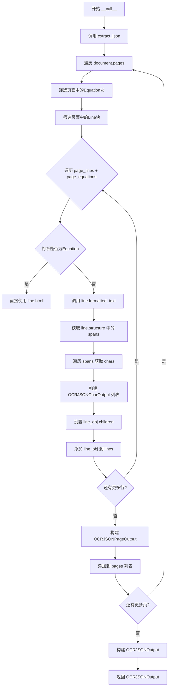
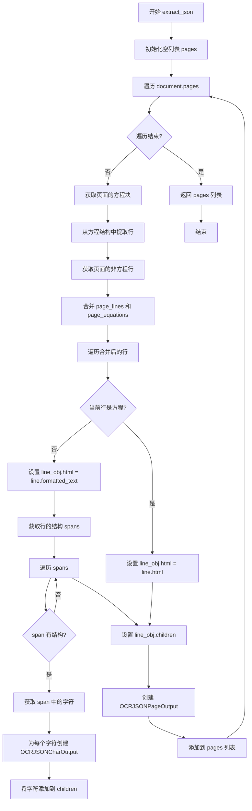
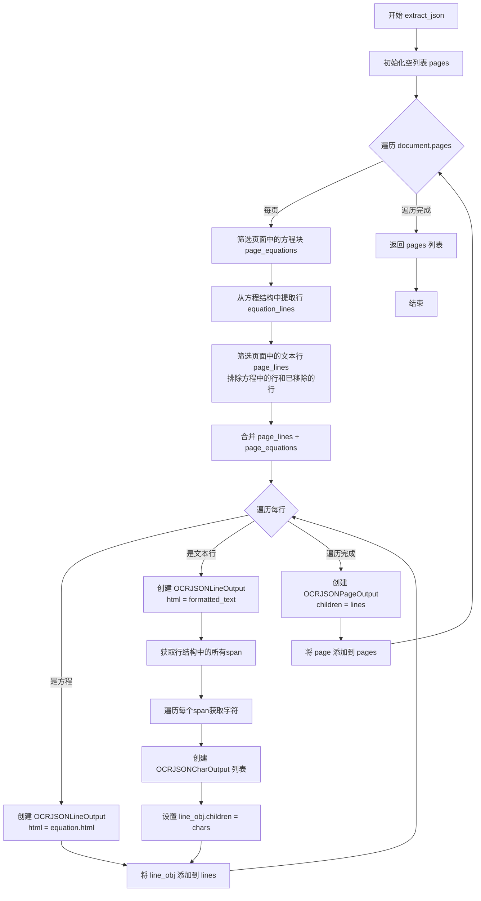
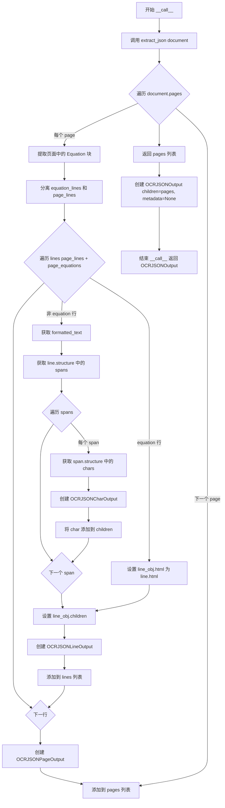

# `marker\marker\renderers\ocr_json.py` 详细设计文档

这是一个OCR JSON渲染器模块，用于将Document对象转换为层次化的JSON格式输出，支持页面、行、字符三级结构，并处理方程和文本行的不同渲染方式。

## 整体流程



## 类结构

```
BaseModel (Pydantic)
├── OCRJSONCharOutput
├── OCRJSONLineOutput
├── OCRJSONPageOutput
└── OCRJSONOutput
BaseRenderer (marker.renderers)
└── OCRJSONRenderer
```

## 全局变量及字段


### `BaseRenderer`
    
从marker.renderers导入的渲染器基类

类型：`class`
    


### `BlockTypes`
    
从marker.schema导入的块类型枚举

类型：`enum`
    


### `Document`
    
从marker.schema.document导入的文档类

类型：`class`
    


### `OCRJSONCharOutput.id`
    
字符的唯一标识

类型：`str`
    


### `OCRJSONCharOutput.block_type`
    
块类型

类型：`str`
    


### `OCRJSONCharOutput.text`
    
字符文本内容

类型：`str`
    


### `OCRJSONCharOutput.polygon`
    
多边形坐标

类型：`List[List[float]]`
    


### `OCRJSONCharOutput.bbox`
    
边界框坐标

类型：`List[float]`
    


### `OCRJSONLineOutput.id`
    
行的唯一标识

类型：`str`
    


### `OCRJSONLineOutput.block_type`
    
块类型

类型：`str`
    


### `OCRJSONLineOutput.html`
    
HTML格式内容

类型：`str`
    


### `OCRJSONLineOutput.polygon`
    
多边形坐标

类型：`List[List[float]]`
    


### `OCRJSONLineOutput.bbox`
    
边界框坐标

类型：`List[float]`
    


### `OCRJSONLineOutput.children`
    
子字符列表

类型：`List[OCRJSONCharOutput] | None`
    


### `OCRJSONPageOutput.id`
    
页面的唯一标识

类型：`str`
    


### `OCRJSONPageOutput.block_type`
    
块类型

类型：`str`
    


### `OCRJSONPageOutput.polygon`
    
多边形坐标

类型：`List[List[float]]`
    


### `OCRJSONPageOutput.bbox`
    
边界框坐标

类型：`List[float]`
    


### `OCRJSONPageOutput.children`
    
子行列表

类型：`List[OCRJSONLineOutput] | None`
    


### `OCRJSONOutput.children`
    
页面列表

类型：`List[OCRJSONPageOutput]`
    


### `OCRJSONOutput.block_type`
    
块类型，默认为BlockTypes.Document

类型：`str`
    


### `OCRJSONOutput.metadata`
    
元数据

类型：`dict | None`
    


### `OCRJSONRenderer.image_blocks`
    
视为图片的块类型(Picture, Figure)

类型：`Tuple[BlockTypes]`
    


### `OCRJSONRenderer.page_blocks`
    
视为页面的块类型(Page)

类型：`Tuple[BlockTypes]`
    
    

## 全局函数及方法


### `OCRJSONRenderer.extract_json`

该方法接收一个 Document 对象作为输入，遍历文档中的所有页面，提取页面中的文本行、方程以及字符信息，构建包含页面、行、字符层级结构的 JSON 输出列表。

参数：

- `document`：`Document`，输入的文档对象，包含需要提取的所有页面和块信息

返回值：`List[OCRJSONPageOutput]`，返回页面输出对象的列表，每个页面包含其行和字符的完整结构信息

#### 流程图



#### 带注释源码

```python
def extract_json(self, document: Document) -> List[OCRJSONPageOutput]:
    """
    从文档中提取 JSON 格式的页面输出。
    
    参数:
        document: Document 对象，包含需要提取的页面和块信息
        
    返回:
        包含所有页面、行和字符信息的列表
    """
    # 初始化用于存储页面输出的列表
    pages = []
    
    # 遍历文档中的每一页
    for page in document.pages:
        # 筛选出未被移除的方程块（Equation blocks）
        page_equations = [
            b for b in page.children 
            if b.block_type == BlockTypes.Equation
            and not b.removed
        ]
        
        # 用于存储从方程结构中提取的行
        equation_lines = []
        
        # 遍历每个方程块，提取其中的行
        for equation in page_equations:
            # 检查方程是否有结构信息
            if not equation.structure:
                continue
            
            # 从方程结构中筛选出行类型的块
            equation_lines += [
                line for line in equation.structure
                if line.block_type == BlockTypes.Line
            ]
        
        # 筛选出页面中未被移除的行，排除方程中的行
        page_lines = [
            block for block in page.children
            if block.block_type == BlockTypes.Line
            and block.id not in equation_lines
            and not block.removed
        ]
        
        # 合并普通行和方程行，统一处理
        lines = []
        for line in page_lines + page_equations:
            # 创建行输出对象，设置基本属性
            line_obj = OCRJSONLineOutput(
                id=str(line.id),
                block_type=str(line.block_type),
                html="",  # 初始为空，后续根据类型填充
                polygon=line.polygon.polygon,
                bbox=line.polygon.bbox,
            )
            
            # 根据行的类型（方程或普通行）处理 HTML 内容
            if line in page_equations:
                # 方程行直接使用其 HTML 表示
                line_obj.html = line.html
            else:
                # 普通行获取格式化文本
                line_obj.html = line.formatted_text(document)
                
                # 获取行的结构（spans/片段）
                spans = (
                    [document.get_block(span_id) for span_id in line.structure]
                    if line.structure
                    else []
                )
                
                # 用于存储该行下的所有字符
                children = []
                
                # 遍历每个 span，提取其中的字符
                for span in spans:
                    if not span.structure:
                        continue
                    
                    # 获取 span 中的所有字符块
                    span_chars = [
                        document.get_block(char_id) 
                        for char_id in span.structure
                    ]
                    
                    # 为每个字符创建输出对象
                    children.extend(
                        [
                            OCRJSONCharOutput(
                                id=str(char.id),
                                block_type=str(char.block_type),
                                text=char.text,
                                polygon=char.polygon.polygon,
                                bbox=char.polygon.bbox,
                            )
                            for char in span_chars
                        ]
                    )
                
                # 设置行的子元素（字符列表）
                line_obj.children = children
            
            # 将处理后的行添加到行列表
            lines.append(line_obj)
        
        # 创建页面输出对象
        page = OCRJSONPageOutput(
            id=str(page.id),
            block_type=str(page.block_type),
            polygon=page.polygon.polygon,
            bbox=page.polygon.bbox,
            children=lines,
        )
        
        # 将页面添加到输出列表
        pages.append(page)
    
    # 返回所有页面输出
    return pages
```


### `OCRJSONRenderer.__call__`

这是 OCRJSONRenderer 类的调用入口方法，接收一个 Document 对象作为输入，提取文档中的页面、行、字符信息，并返回结构化的 OCRJSONOutput 对象。

参数：

- `document`：`Document`，待渲染的文档对象，包含页面的完整结构和内容信息

返回值：`OCRJSONOutput`，包含文档层次化结构的 JSON 输出对象

#### 流程图

```mermaid
flowchart TD
    A[开始 __call__] --> B[调用 extract_json(document)]
    B --> C{extract_json 返回}
    C -->|List[OCRJSONPageOutput]| D[创建 OCRJSONOutput]
    D --> E[设置 metadata=None]
    E --> F[返回 OCRJSONOutput]
    
    subgraph extract_json
        G[遍历 document.pages] --> H[筛选页面中的公式块]
        H --> I[提取公式中的行]
        I --> J[筛选页面中的文本行排除公式行]
        J --> K[合并文本行和公式行]
        K --> L[遍历每行构建 OCRJSONLineOutput]
        L --> M{判断是否为公式行}
        M -->|是公式| N[设置 html 为公式 HTML]
        M -->|否| O[获取行的结构化内容]
        O --> P[获取 span 列表]
        P --> Q[遍历 span 获取字符]
        Q --> R[构建 OCRJSONCharOutput 列表]
        R --> S[设置 line_obj.children]
        S --> T[添加 line_obj 到 lines]
        T --> U[构建 OCRJSONPageOutput]
        U --> V[添加到 pages 列表]
        V --> W[返回 pages 列表]
    end
    
    B -.-> G
```

#### 带注释源码

```python
def __call__(self, document: Document) -> OCRJSONOutput:
    """
    渲染器的调用入口方法。
    
    将输入的 Document 对象转换为结构化的 OCR JSON 输出格式。
    该方法是 BaseRenderer 抽象基类的实现，使得 OCRJSONRenderer
    可以作为可调用对象使用。

    参数:
        document: Document 对象，包含待渲染的文档内容，
                  通常包含多个页面，每个页面有行、字符等结构

    返回:
        OCRJSONOutput: 包含文档完整层次结构的 JSON 输出对象，
                      包括页面、行、字符的坐标和文本信息
    """
    # 调用 extract_json 方法提取文档中的页面、行、字符信息
    # extract_json 会遍历文档的每一页，提取文本行和公式行，
    # 并构建嵌套的 OCRJSONPageOutput -> OCRJSONLineOutput -> OCRJSONCharOutput 结构
    return OCRJSONOutput(
        children=self.extract_json(document),  # 提取页面列表
        metadata=None  # 当前未使用，保留为未来扩展
    )
```


### `OCRJSONRenderer.extract_json`

该方法接收一个 `Document` 对象作为输入，遍历文档的每一页，提取页面中的文本行和数学方程，将其转换为层次化的 OCR JSON 输出结构（页面 -> 行 -> 字符），最终返回包含所有页面输出对象的列表。

参数：

- `document`：`Document`，待处理的文档对象，包含所有页面和块结构信息

返回值：`List[OCRJSONPageOutput]`，页面输出对象列表，每个对象包含页面ID、类型、多边形边界框以及行/字符的层次结构

#### 流程图



#### 带注释源码

```python
def extract_json(self, document: Document) -> List[OCRJSONPageOutput]:
    """
    从文档中提取 OCR JSON 格式的层次化输出
    """
    pages = []  # 存储所有页面输出对象
    
    # 遍历文档中的每一页
    for page in document.pages:
        # 筛选当前页面中的方程块（非移除的）
        page_equations = [
            b for b in page.children 
            if b.block_type == BlockTypes.Equation and not b.removed
        ]
        
        # 从方程的结构中提取所有行类型的块
        equation_lines = []
        for equation in page_equations:
            if not equation.structure:
                continue
            # 筛选出类型为 Line 的结构块
            equation_lines += [
                line for line in equation.structure
                if line.block_type == BlockTypes.Line
            ]
        
        # 筛选页面中的文本行块
        # 条件：类型为Line、不在方程行中、未被移除
        page_lines = [
            block for block in page.children
            if block.block_type == BlockTypes.Line
            and block.id not in equation_lines
            and not block.removed
        ]
        
        lines = []  # 存储当前页面的所有行输出
        
        # 遍历文本行和方程行
        for line in page_lines + page_equations:
            # 创建行输出对象，设置基本属性
            line_obj = OCRJSONLineOutput(
                id=str(line.id),
                block_type=str(line.block_type),
                html="",  # 初始为空，后续根据类型填充
                polygon=line.polygon.polygon,
                bbox=line.polygon.bbox,
            )
            
            # 根据行类型填充 HTML 内容
            if line in page_equations:
                # 方程类型：直接使用方程的 HTML
                line_obj.html = line.html
            else:
                # 文本类型：使用格式化文本方法
                line_obj.html = line.formatted_text(document)
                
                # 获取行结构中的所有 span 块
                spans = (
                    [document.get_block(span_id) for span_id in line.structure]
                    if line.structure
                    else []
                )
                
                children = []  # 存储字符输出对象
                
                # 遍历每个 span 块
                for span in spans:
                    if not span.structure:
                        continue
                    
                    # 获取 span 结构中的所有字符块
                    span_chars = [
                        document.get_block(char_id) 
                        for char_id in span.structure
                    ]
                    
                    # 为每个字符创建输出对象
                    children.extend([
                        OCRJSONCharOutput(
                            id=str(char.id),
                            block_type=str(char.block_type),
                            text=char.text,
                            polygon=char.polygon.polygon,
                            bbox=char.polygon.bbox,
                        )
                        for char in span_chars
                    ])
                
                # 设置行的字符子元素
                line_obj.children = children
            
            # 将行对象添加到当前页的行列表
            lines.append(line_obj)
        
        # 创建页面输出对象
        page = OCRJSONPageOutput(
            id=str(page.id),
            block_type=str(page.block_type),
            polygon=page.polygon.polygon,
            bbox=page.polygon.bbox,
            children=lines,
        )
        pages.append(page)
    
    return pages
```

#### 潜在技术债务与优化空间

| 问题 | 描述 | 优化建议 |
|------|------|----------|
| 变量覆盖 | 在循环内部重新赋值 `page = OCRJSONPageOutput(...)`，覆盖了迭代变量 `page`，虽然不影响结果但影响可读性 | 改用 `page_output` 等明确命名的变量 |
| 列表推导式效率 | `equation_lines` 使用 `+=` 重复追加列表，可改为 `extend()` 或使用生成器表达式 | 使用 `extend()` 或在最后统一转换 |
| 重复属性访问 | `line.polygon.polygon` 和 `line.polygon.bbox` 在循环中重复访问 | 可提取到局部变量减少属性查找开销 |
| 嵌套循环复杂度 | 三重嵌套循环（页->行->字符）在大文档可能导致性能瓶颈 | 考虑使用生成器或流式处理 |
| 错误处理缺失 | 假设 `document.pages` 和 `block.structure` 始终存在，未做空值保护 | 添加防御性检查处理异常情况 |


### `OCRJSONRenderer.__call__`

该方法是 `OCRJSONRenderer` 类的核心调用接口，接收一个 `Document` 对象作为输入，调用内部方法 `extract_json` 将文档转换为结构化的 OCR JSON 输出格式，最终返回包含页面、行和字符层级信息的 `OCRJSONOutput` 对象。

参数：

-  `document`：`Document`，待渲染的文档对象，包含页面、行、字符等结构化信息

返回值：`OCRJSONOutput`，包含文档层级结构的 OCR 输出对象，包含页面列表和元数据

#### 流程图



#### 带注释源码

```python
def __call__(self, document: Document) -> OCRJSONOutput:
    """
    将 Document 对象渲染为 OCRJSONOutput 对象。
    
    这是类的核心调用接口，使得实例可以被作为函数调用。
    内部委托 extract_json 方法完成实际的文档到 JSON 输出的转换。
    
    参数:
        document: Document 对象，包含待渲染的文档结构，
                  包含页面、行、方程、字符等 block 信息
    
    返回:
        OCRJSONOutput 对象，包含文档的层级结构信息
       （页面 -> 行 -> 字符），以及元数据
    """
    # 调用内部方法 extract_json 处理文档，
    # 将 Document 转换为 List[OCRJSONPageOutput]
    # 然后用结果构造 OCRJSONOutput 对象返回
    return OCRJSONOutput(children=self.extract_json(document), metadata=None)
```

## 关键组件


### 文档渲染转换器 (OCRJSONRenderer)

负责将 Document 对象转换为结构化的 OCR JSON 格式输出的核心渲染器类，支持页面、行、公式和字符的层级化提取。

### 字符输出模型 (OCRJSONCharOutput)

Pydantic 数据模型，定义单个字符的 OCR 输出结构，包含字符 ID、块类型、文本内容、多边形坐标和边界框信息。

### 行输出模型 (OCRJSONLineOutput)

Pydantic 数据模型，定义行级别的 OCR 输出结构，支持包含字符子节点的层级结构，用于表示文本行或公式行。

### 页面输出模型 (OCRJSONPageOutput)

Pydantic 数据模型，定义页面级别的 OCR 输出结构，包含页面的多边形坐标、边界框以及子行元素的列表。

### 文档输出模型 (OCRJSONOutput)

Pydantic 数据模型，定义最顶层的文档输出结构，包含所有页面节点的列表、文档块类型和元数据字段。

### 惰性块加载机制

通过 `document.get_block()` 方法按需加载字符和跨度块，避免一次性加载整个文档到内存，提升大规模文档处理效率。

### 公式与文本行分离逻辑

在 `extract_json` 方法中区分处理页面中的公式块和普通文本行，通过块类型过滤和 ID 比对确保公式内容不被重复包含在文本行中。

### 格式化文本生成

对于非公式行，调用 `line.formatted_text(document)` 方法生成带格式的 HTML 文本，用于保留原始文档的排版样式信息。


## 问题及建议


### 已知问题

-   **列表比较逻辑错误**：第47行 `block.id not in equation_lines` 存在逻辑错误。`equation_lines` 存储的是 `Line` 对象，但代码直接用 `block.id` 与 `Line` 对象列表进行比较，永远不会匹配，应该比较 `block.id` 与 `equation_line.id`。
-   **变量遮蔽问题**：循环内部将迭代变量 `page` 重新赋值为 `OCRJSONPageOutput` 对象，导致外层的 `page` 变量被遮蔽，可能引起代码阅读混淆和潜在的引用错误。
-   **硬编码的空元数据**：`__call__` 方法中 `metadata` 被硬编码为 `None`，看起来是未完成的功能实现。
-   **缺少错误处理**：代码未对 `document.get_block()` 可能返回 `None`、属性访问可能失败等情况进行异常捕获，大型文档处理时容易崩溃。
-   **重复的结构访问**：代码多次访问 `line.structure`、`span.structure` 等嵌套属性，缺乏缓存机制。

### 优化建议

-   **修复列表包含检查**：将 `block.id not in equation_lines` 改为 `block.id not in [eq_line.id for eq_line in equation_lines]` 或使用集合存储 ID 以提高查找效率。
-   **消除变量遮蔽**：将循环内的 `page` 变量重命名为 `page_output` 或 `page_result`，避免与迭代变量冲突。
-   **完善元数据功能**：实现实际的元数据提取逻辑，或移除该字段而非留空。
-   **添加防御性检查**：对 `document.get_block()` 返回值进行 `None` 检查，对可能的属性缺失提供降级处理。
-   **优化块获取性能**：考虑批量获取块或添加缓存机制，减少重复的 `get_block` 调用。
-   **提取可复用的转换逻辑**：将字符和行的转换逻辑抽取为私有方法，提高代码可读性和可维护性。

## 其它


### 设计目标与约束

该代码的设计目标是将Marker库中的Document对象转换为结构化的OCR JSON格式输出，支持页面、行、字符三层嵌套结构，同时区分普通文本行和数学公式。约束包括：依赖pydantic进行数据验证，依赖marker库的Document和BlockTypes枚举，输出格式需要兼容常见的OCR JSON规范。

### 错误处理与异常设计

代码主要依赖pydantic的BaseModel进行数据验证，当字段类型不匹配时会抛出ValidationError。在extract_json方法中，使用了多个if判断处理可能的None值（如equation.structure、line.structure、span.structure），当这些结构为空时直接跳过。潜在的异常包括：document.pages为空的边界情况、document.get_block返回None、BlockTypes枚举值不存在等。当前实现采用静默跳过策略，可能导致部分数据丢失而不抛出明确错误。

### 数据流与状态机

数据流从Document对象输入开始，经过三个主要阶段：第一阶段遍历所有页面，筛选出未移除的Equation块；第二阶段从页面中提取未移除的Line块，排除属于公式的行；第三阶段对每行进行处理，如果是公式则使用line.html，否则调用formatted_text并解析结构获取字符信息。状态机体现为：页面处理状态 -> 行处理状态 -> 字符处理状态的三层嵌套遍历模型。

### 外部依赖与接口契约

主要外部依赖包括：pydantic.BaseModel用于数据模型定义和验证；marker.renderers.BaseRenderer作为基类定义了__call__接口；marker.schema.BlockTypes提供块类型枚举；marker.schema.document.Document提供文档对象模型。接口契约要求输入Document对象必须包含pages属性，每个page包含children、block_type、id、polygon、bbox属性，line块需要包含structure属性用于构建字符关系。

### 性能考虑

代码存在以下性能瓶颈：多次遍历document.get_block可能导致N+1查询问题；列表推导式和循环中频繁创建OCRJSONCharOutput对象会增加GC压力；每个字符都创建新的Pydantic模型实例。优化方向包括：缓存document.get_block的结果、使用生成器替代列表推导、考虑批量构建输出对象。

### 安全性考虑

当前代码主要关注数据转换，安全性风险较低。需要注意的点包括：输出的text和html字段可能包含用户输入的恶意内容，建议在调用formatted_text时进行HTML转义；metadata字段目前硬编码为None，如后续添加元数据需注意敏感信息泄露。

### 配置说明

OCRJSONRenderer类提供两个可配置字段：image_blocks定义被视为图片的块类型（默认为Picture和Figure），page_blocks定义被视为页面的块类型（默认为Page）。这些配置通过类属性直接设置，当前不支持运行时动态修改。

### 使用示例

基本用法示例：
```python
from marker.converters import convert
from marker.renderers import OCRJSONRenderer

# 转换PDF为Document
document = convert("input.pdf")

# 使用渲染器输出OCR JSON
renderer = OCRJSONRenderer()
output = renderer(document)
# output类型为OCRJSONOutput，包含children列表
```

### 已知限制

1. 不支持表格结构：代码未处理Table相关BlockTypes，表格内容可能被忽略
2. 公式结构不完整：只提取了Equation块的Line子块，未处理更复杂的公式内部结构
3. 图像块未处理：image_blocks配置已定义但extract_json方法中未使用
4. 层级固定：只支持Page->Line->Char三层结构，不支持更深的嵌套
5. 精度问题：多边形坐标直接使用float，可能存在精度损失

### 测试策略建议

建议补充以下测试用例：空文档输入、只有图片的页面、包含表格的文档、多页文档、特殊字符（Unicode emoji、数学符号）、大型文档性能测试、公式与文本混合的复杂页面。

    