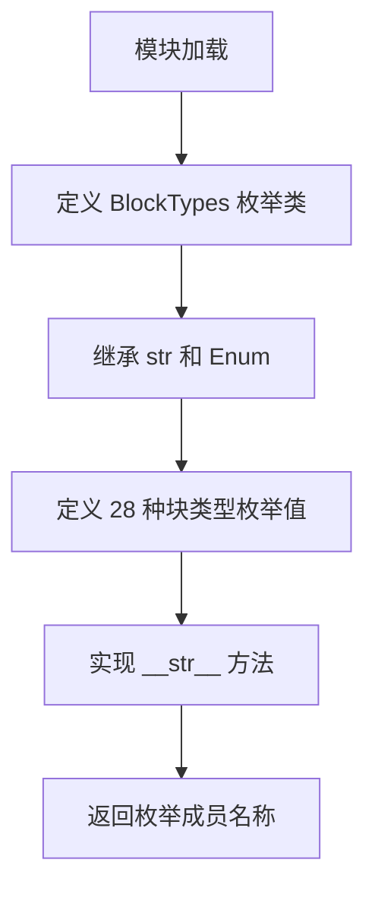
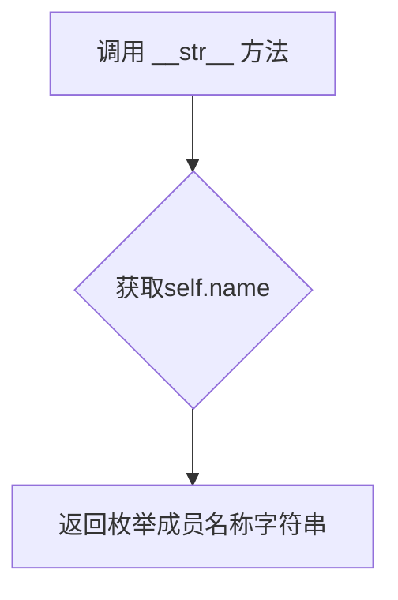

# `marker\marker\schema\__init__.py` 详细设计文档

该文件定义了一个名为 BlockTypes 的字符串枚举类，用于表示文档处理中各种类型的块元素（如文本、表格、图片、代码等），并提供了从枚举值到名称字符串的转换方法，是文档解析框架的基础类型定义模块。

## 整体流程



## 类结构

```
BlockTypes (字符串枚举类)
├── Line
├── Span
├── Char
├── FigureGroup
├── TableGroup
├── ListGroup
├── PictureGroup
├── Page
├── Caption
├── Code
├── Figure
├── Footnote
├── Form
├── Equation
├── Handwriting
├── TextInlineMath
├── ListItem
├── PageFooter
├── PageHeader
├── Picture
├── SectionHeader
├── Table
├── Text
├── TableOfContents
├── Document
├── ComplexRegion
├── TableCell
└── Reference
```

## 全局变量及字段


### `BlockTypes`
    
枚举类，表示文档中各种块类型

类型：`class`
    


### `BlockTypes.Line`
    
块类型-行

类型：`BlockTypes`
    


### `BlockTypes.Span`
    
块类型-跨度

类型：`BlockTypes`
    


### `BlockTypes.Char`
    
块类型-字符

类型：`BlockTypes`
    


### `BlockTypes.FigureGroup`
    
块类型-图形组

类型：`BlockTypes`
    


### `BlockTypes.TableGroup`
    
块类型-表格组

类型：`BlockTypes`
    


### `BlockTypes.ListGroup`
    
块类型-列表组

类型：`BlockTypes`
    


### `BlockTypes.PictureGroup`
    
块类型-图片组

类型：`BlockTypes`
    


### `BlockTypes.Page`
    
块类型-页面

类型：`BlockTypes`
    


### `BlockTypes.Caption`
    
块类型-标题

类型：`BlockTypes`
    


### `BlockTypes.Code`
    
块类型-代码

类型：`BlockTypes`
    


### `BlockTypes.Figure`
    
块类型-图形

类型：`BlockTypes`
    


### `BlockTypes.Footnote`
    
块类型-脚注

类型：`BlockTypes`
    


### `BlockTypes.Form`
    
块类型-表单

类型：`BlockTypes`
    


### `BlockTypes.Equation`
    
块类型-公式

类型：`BlockTypes`
    


### `BlockTypes.Handwriting`
    
块类型-手写

类型：`BlockTypes`
    


### `BlockTypes.TextInlineMath`
    
块类型-行内数学

类型：`BlockTypes`
    


### `BlockTypes.ListItem`
    
块类型-列表项

类型：`BlockTypes`
    


### `BlockTypes.PageFooter`
    
块类型-页脚

类型：`BlockTypes`
    


### `BlockTypes.PageHeader`
    
块类型-页眉

类型：`BlockTypes`
    


### `BlockTypes.Picture`
    
块类型-图片

类型：`BlockTypes`
    


### `BlockTypes.SectionHeader`
    
块类型-章节标题

类型：`BlockTypes`
    


### `BlockTypes.Table`
    
块类型-表格

类型：`BlockTypes`
    


### `BlockTypes.Text`
    
块类型-文本

类型：`BlockTypes`
    


### `BlockTypes.TableOfContents`
    
块类型-目录

类型：`BlockTypes`
    


### `BlockTypes.Document`
    
块类型-文档

类型：`BlockTypes`
    


### `BlockTypes.ComplexRegion`
    
块类型-复杂区域

类型：`BlockTypes`
    


### `BlockTypes.TableCell`
    
块类型-表格单元格

类型：`BlockTypes`
    


### `BlockTypes.Reference`
    
块类型-引用

类型：`BlockTypes`
    
    

## 全局函数及方法


### `BlockTypes.__str__`

返回枚举成员的名称字符串，用于将枚举值转换为可读的用户友好字符串。

参数：

- `self`：`BlockTypes`，隐式参数，表示当前的枚举实例

返回值：`str`，返回枚举成员的名称（即枚举成员的定义名称）

#### 流程图



#### 带注释源码

```python
def __str__(self):
    """
    返回枚举成员的名称字符串
    
    该方法重写了基类的 __str__ 方法，使枚举值在转换为字符串时
    返回枚举成员的名称而不是默认的 'BlockTypes.MemberName' 格式。
    
    Returns:
        str: 枚举成员的名称，例如 'Text', 'Table', 'Picture' 等
    """
    return self.name
```

## 关键组件


### BlockTypes 枚举类

用于定义文档中各种块元素类型的枚举类，继承自 str 和 Enum，提供了文档结构中不同内容区域的类型标识。

### Line

表示文档中的行元素，用于文本内容的行级表示。

### Span

表示文档中的跨度元素，用于标记文本的连续区域。

### Char

表示文档中的字符元素，用于单个字符的表示。

### FigureGroup

表示图形组，用于组织和包含多个相关图形元素。

### TableGroup

表示表格组，用于组织和包含多个相关表格元素。

### ListGroup

表示列表组，用于组织和包含多个相关列表元素。

### PictureGroup

表示图片组，用于组织和包含多个相关图片元素。

### Page

表示页面元素，用于文档的页面级结构。

### Caption

表示标题或说明元素，用于图表等内容的描述。

### Code

表示代码块元素，用于源代码的表示。

### Figure

表示图形元素，用于图表的表示。

### Footnote

表示脚注元素，用于页面的脚注内容。

### Form

表示表单元素，用于交互式表单内容。

### Equation

表示公式元素，用于数学公式的表示。

### Handwriting

表示手写元素，用于手写内容的表示。

### TextInlineMath

表示行内数学元素，用于嵌入在文本中的数学公式。

### ListItem

表示列表项元素，用于列表中的单个项目。

### PageFooter

表示页脚元素，用于页面底部的内容。

### PageHeader

表示页眉元素，用于页面顶部的内容。

### Picture

表示图片元素，用于图像内容的表示。

### SectionHeader

表示章节标题元素，用于文档章节的标题。

### Table

表示表格元素，用于表格数据的表示。

### Text

表示文本元素，用于普通文本内容的表示。

### TableOfContents

表示目录元素，用于文档目录的表示。

### Document

表示文档元素，作为整个文档的根容器。

### ComplexRegion

表示复杂区域元素，用于文档中复杂结构区域的表示。

### TableCell

表示表格单元格元素，用于表格中的单个单元格。

### Reference

表示引用元素，用于引用其他内容或资源的表示。

### __str__ 方法

重写字符串表示方法，返回枚举成员的名称而不是默认值。


## 问题及建议


### 已知问题

- **枚举值类型不明确**：使用 `auto()` 自动生成的值为整数（1, 2, 3...），虽然类继承了 `str`，但实际值并非字符串类型，可能导致类型期望不一致的问题
- **冗余的 `__str__` 方法**：在继承自 `str` 的枚举中，`self.name` 本身就是字符串，`__str__` 方法返回 `self.name` 与默认行为相同，属于冗余代码
- **缺乏文档说明**：枚举类没有任何文档字符串（docstring），未说明其用途、适用场景及设计意图
- **枚举成员无分类**：30余个枚举成员线性排列，缺乏逻辑分组，随着项目发展可能导致维护困难
- **Python 版本兼容性问题**：若需要字符串值的枚举，更推荐使用 Python 3.11+ 的 `StrEnum`，当前实现兼容性受限

### 优化建议

- **显式定义字符串值**：将 `auto()` 替换为显式的字符串值（如 `Line = "Line"`），或使用 `StrEnum`（Python 3.11+）以获得清晰的字符串枚举
- **移除冗余方法**：删除自定义的 `__str__` 方法，使用继承自 `Enum` 的默认实现即可
- **添加文档字符串**：为 `BlockTypes` 类添加类级别的 docstring，说明其用于文档解析中标识不同类型的文档块元素
- **考虑枚举分组**：通过注释或内部类对枚举成员进行逻辑分组，如"页面元素"、"文本元素"、"容器元素"等，提升可读性和可维护性
- **添加类型注解**：考虑为枚举类添加适当的类型注解，增强代码的可读性和 IDE 支持

## 其它


### 设计目标与约束

本枚举类的设计目标是定义文档处理系统中所有可能的块级元素类型，为文档解析、渲染和转换提供统一类型标识系统。设计约束包括：保持与常见文档格式（如HTML、PDF、Word）的语义兼容性；枚举值需具有自描述性；支持字符串比较和序列化；类型数量应覆盖90%以上的文档元素场景。

### 错误处理与异常设计

虽然本枚举类本身不涉及复杂业务逻辑，但在实际使用中应处理以下异常场景：1）当传入无效值创建枚举时应抛出ValueError；2）在文档解析时遇到未知块类型时应抛出UnknownBlockTypeException并记录日志；3）当需要将枚举转换为字符串时应处理None值情况；4）建议在模块级别提供validate_block_type函数用于运行时类型验证。

### 数据流与状态机

在文档处理流水线中，BlockTypes枚举作为数据类型标识符在各组件间流转：解析器输出带BlockTypes标签的AST节点→布局分析器根据块类型计算尺寸→渲染器根据类型选择对应渲染策略→导出器将类型映射为目标格式标签。整个数据流中BlockTypes作为只读的配置型枚举存在，不涉及状态机设计。

### 外部依赖与接口契约

本模块无外部依赖，仅使用Python标准库enum模块。接口契约包括：所有枚举成员必须实现__str__方法返回成员名称；枚举值可与字符串进行直接比较（因继承str）；外部模块应通过from BlockTypes import BlockTypes方式导入；建议使用BlockTypes.Text而非"Text"字符串进行类型判断以获得IDE类型提示支持。

### 使用示例与典型用例

典型用例包括：1）文档解析时根据元素类型创建对应BlockTypes实例；2）使用isinstance或成员检查验证类型合法性；3）在匹配语句中根据BlockTypes执行差异化处理；4）序列化时通过str(block_type)获取可读类型名称。建议用法示例：if block_type == BlockTypes.Figure: handle_figure(block)。

### 性能考量与优化空间

当前实现性能良好，枚举成员在类加载时创建且具有单例特性。潜在优化空间：1）如需支持更多块类型可考虑使用__slots__减少内存；2）如在高频循环中频繁访问可缓存str()转换结果；3）如需支持国际化显示名称可引入name属性到显示名的映射字典。当前设计对于几千个文档实例的场景完全足够。

### 测试策略建议

建议测试包括：1）所有枚举成员可正常实例化；2）str()转换返回正确成员名称；3）枚举值与字符串比较正常工作；4）枚举继承的str特性行为正确；5）成员迭代可获取完整类型列表；6）边界情况如None值处理。建议使用pytest框架编写参数化测试覆盖所有成员。

### 扩展性与未来考虑

未来可能的扩展方向：1）可考虑为BlockTypes添加层级关系（如BlockTypes.PictureGroup和BlockTypes.Picture的父子关系）以支持更复杂的文档结构分析；2）可引入插件机制允许自定义块类型；3）可添加元数据属性（如是否为行内元素、是否可嵌套）以支持更智能的布局计算；4）建议在文档中维护版本变更日志记录新增的类型。

### 与其他模块的关系

本模块处于文档处理框架的基础层，被以下模块引用：文档解析器模块（用于标记解析结果）、布局分析模块（用于获取块类型属性）、渲染模块（用于选择渲染策略）、导出模块（用于类型映射）。所有下游模块应将此枚举作为只读的类型定义使用，不应直接修改枚举成员。

    