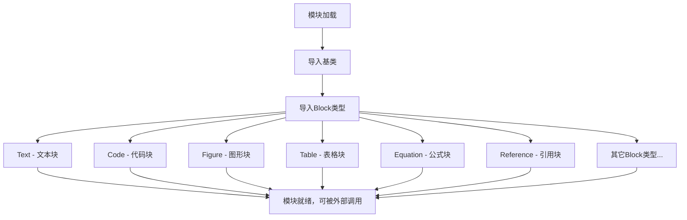

# `marker\marker\schema\blocks\__init__.py` 详细设计文档

这是marker文档处理框架的模块入口文件，定义了文档中各种内容块的类型结构，包括文本、代码、图像、表格、公式、引用等二十余种Block类型，用于PDF/文档的结构化解析和内容提取。

## 整体流程



## 类结构

```
Block (基类/抽象基类)
├── Text (文本块)
├── Code (代码块)
├── Figure (图形块)
├── Picture (图片块)
├── Table (表格块)
├── TableCell (表格单元格)
├── Caption (标题/说明)
├── SectionHeader (章节标题)
├── ListItem (列表项)
├── Equation (公式块)
├── InlineMath (行内公式)
├── Footnote (脚注)
├── Reference (引用)
├── Form (表单)
├── Handwriting (手写内容)
├── PageHeader (页眉)
├── PageFooter (页脚)
├── TableOfContents (目录)
└── ComplexRegion (复杂区域)
```

## 全局变量及字段


### `BlockId`
    
Block的唯一标识符，用于标识和跟踪文档中的每个Block对象

类型：`typing.Any`
    


### `BlockOutput`
    
Block的输出结果，包含渲染或处理后的Block数据

类型：`typing.Any`
    


### `Block.BlockId`
    
Block的唯一标识符，用于标识和跟踪文档中的每个Block对象

类型：`typing.Any`
    


### `Block.BlockOutput`
    
Block的输出结果，包含渲染或处理后的Block数据

类型：`typing.Any`
    
    

## 全局函数及方法


## 关键组件


这段代码是marker文档解析框架的模块导入集合，定义了文档结构中的各类内容块类型，包括文本、图像、表格、代码、公式等20余种块元素，为下游的文档解析、渲染和转换提供了统一的数据模型基础。

### 关键组件

### Block (基类)
所有内容块的抽象基类，定义了块的基本接口和数据结构

### Text
纯文本内容块，用于表示文档中的普通段落文本

### Table
表格结构块，支持复杂的多行多列表格数据

### Figure
图形/图表块，用于存储图像和相关信息

### Code
代码块，存储编程语言代码及语法信息

### Equation
独立公式块，用于存储数学方程式

### InlineMath
行内公式块，用于嵌入文本中的数学表达式

### Caption
标题/说明块，为图表等元素提供描述文本

### TableCell
表格单元格块，表格的最小组成单元

### TableOfContents
目录块，存储文档结构层级信息

### SectionHeader
章节标题块，定义文档的层次结构

### ListItem
列表项块，存储有序或无序列表的元素

### Reference
引用块，用于文档内部的交叉引用

### Footnote
脚注块，存储页面或章节的补充说明

### Form
表单块，包含用户输入控件的复合结构

### Picture
图片块，存储图像数据及其元信息

### Handwriting
手写内容块，识别和存储手写笔迹数据

### ComplexRegion
复杂区域块，用于组合多个内容元素的复合区域

### PageHeader
页眉块，存储每页顶部重复显示的内容

### PageFooter
页脚块，存储每页底部重复显示的内容


## 问题及建议


### 已知问题

-   **缺少 `__all__` 声明**：该模块未定义 `__all__` 列表，无法控制公开导出的符号，若使用 `from marker.schema.blocks import *` 会导入所有内容，缺乏显式API边界
-   **无文档字符串**：模块级别缺少模块文档说明，无法了解该模块的整体职责和用途
-   **导入冗余性**：从子模块逐个导入22个类，若后续增加新块类型需手动添加导入语句，缺乏批量导入或动态发现机制
-   **无类型注解文件**：虽然导入了 `BlockId`、`BlockOutput` 等类型，但该文件未展示其具体定义，依赖方需追溯上游模块
-   **包结构不透明**：作为 `__init__.py` 时未体现层级结构，所有块类型平铺导出，使用者难以区分核心类与辅助类

### 优化建议

-   添加 `__all__ = ["Block", "BlockId", "BlockOutput", "Caption", ...]` 显式声明公开API，增强导入控制和IDE支持
-   为模块添加文档字符串，说明其作为块类型统一导出入口的职责
-   考虑使用 `import marker.schema.blocks as blocks` 或动态导入机制，减少手动维护导入列表的工作量
-   补充模块级别的类型注解或重新导出类型别名，提升类型检查体验
-   若块类型数量持续增长，可引入 `__init__.py` 分组导入（如 `from .text import *`），按类别组织导入路径


## 其它


### 设计目标与约束

该模块作为marker文档解析库的schema定义层，目标是为各种文档元素（如文本、图像、表格、代码块等）提供统一的对象模型和类型抽象。主要设计约束包括：1）所有块类型必须继承自基类Block以保证多态性；2）支持从Python 2.7到3.x的兼容性（通过`from __future__ import annotations`）；3）块类型设计遵循单一职责原则，每个类仅代表一种特定的文档元素；4）所有类型需支持序列化能力以便于后续处理流程使用。

### 错误处理与异常设计

该模块作为纯数据模型定义，不直接涉及业务逻辑，因此本身不包含复杂的异常处理机制。预期的错误场景主要包括：1）类型不匹配错误，当尝试将不符合Block接口的对象赋值给Block类型变量时应抛出TypeError；2）属性访问错误，当访问不存在的Block属性时应抛出AttributeError。在实际使用这些类型的上层代码中，应进行必要的类型检查和异常捕获。块类型的属性应设计为具有合理的默认值以减少None检查的需求。

### 数据流与状态机

该模块定义了文档的静态结构模型，不涉及运行时状态管理。数据流主要遵循以下路径：PDF/文档源 → 解析器 → 生成对应类型的Block对象 → 块序列化 → 输出。每个Block对象在其生命周期中经历：初始化（接收原始数据）→ 属性填充 → 验证 → 序列化/输出三个主要状态。块对象应该是不可变的或至少是功能性的（functional），即属性设置后不应再变化，以简化状态追踪和并发处理。

### 外部依赖与接口契约

该模块的外部依赖包括：1）Python标准库中的typing模块（通过annotations隐式使用）；2）marker.schema.blocks.base模块中定义的Block、BlockId、BlockOutput基类。所有导出类型应遵循统一的接口契约：每个类都应实现转换为字典或JSON的能力（用于序列化）；每个类都应包含id属性（继承自Block）用于唯一标识；类属性应使用类型注解以支持静态类型检查工具。使用方通过导入这些类型来构造文档对象树，理论上不应直接依赖具体的实现细节。

### 性能考虑

作为数据模型层，该模块本身不涉及复杂的计算，但设计时仍需考虑：1）内存效率，避免不必要的大对象创建，优先使用__slots__减少每个实例的内存开销；2）序列化效率，块类型应支持增量式序列化而非每次全量序列化；3）导入效率，该模块导入时一次性加载所有块类型，可能影响启动时间，可考虑延迟导入（lazy import）优化；4）由于Python的GIL限制，在多线程场景下应避免在Block对象的__init__中进行耗时操作。

### 安全性考虑

该模块定义的是数据模型，安全性考量主要集中在：1）反序列化安全，当从外部源反序列化Block对象时应进行严格的类型检查，防止通过构造恶意对象实施攻击；2）属性注入防护，Block类的属性赋值应进行验证，防止通过__setattr__等机制注入额外属性；3）如果Block对象涉及用户输入的文本内容，应考虑XSS等 Web 安全问题，在输出时进行适当的转义处理。

### 配置管理

该模块不涉及运行时配置，因为所有块类型定义是静态的。配置管理主要体现在：1）类型注解的使用使得静态类型检查器能够验证代码正确性；2）如果需要支持不同格式的文档输出，可在Block基类中定义抽象的render方法，由各子类实现具体的渲染逻辑；3）全局配置（如是否启用某些块类型）应通过环境变量或配置文件而非硬编码实现。

### 版本兼容性

通过`from __future__ import annotations`声明，该代码兼容Python 3.6+及Python 2.7。在后续演进中应注意：1）新增块类型时应保持向后兼容，避免修改现有公开接口；2）若需要使用更新的Python特性，应检测Python版本并提供回退方案；3）块类型的属性变更应通过增加可选参数而非修改现有参数方式实现，以保持API稳定性。

### 测试策略

针对该模块的测试应包括：1）单元测试，验证每个块类型的实例化、属性赋值和序列化是否正常工作；2）类型检查测试，使用mypy等工具验证类型注解的正确性；3）集成测试，验证不同块类型在文档解析流程中的协作；4）边界情况测试，测试极端输入（如超长文本、特殊字符、嵌套结构等）下的行为；5）性能基准测试，监控大量Block对象创建和序列化的性能指标。

### 监控与日志

该模块作为模型定义层，自身不直接产生日志，但在上层应用中应关注：1）对象创建监控，跟踪各类Block对象的创建频率和数量，用于发现异常情况（如大量临时对象导致内存泄漏）；2）序列化性能监控，记录不同块类型的序列化耗时，识别性能瓶颈；3）错误监控，跟踪类型不匹配、属性访问异常等错误的发生频率；4）可使用Python的logging模块在基类Block中集成通用的日志记录能力。

### 并发处理指导

虽然该模块不直接处理并发，但为支持并发使用场景，应遵循：1）Block对象设计为不可变或线程安全的（推荐使用不可变设计）；2）避免在对象中存储共享状态或缓存；3）若需要在线程间传递Block对象，应使用适当的序列化机制；4）文档解析流程中的多线程/多进程并行化应在调用方实现，该模块只提供数据结构和基本操作。


    