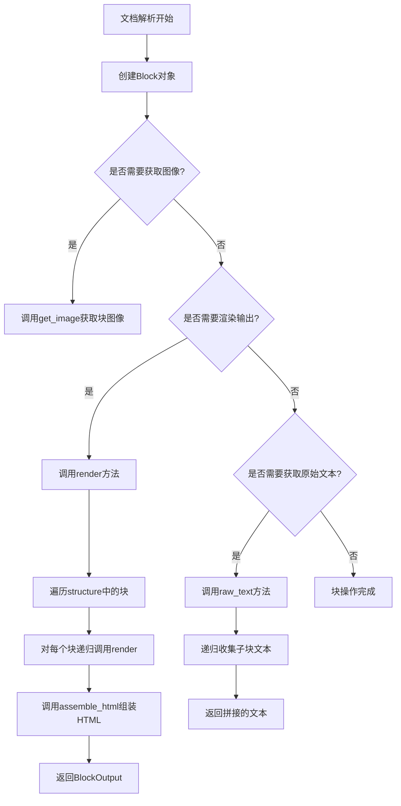
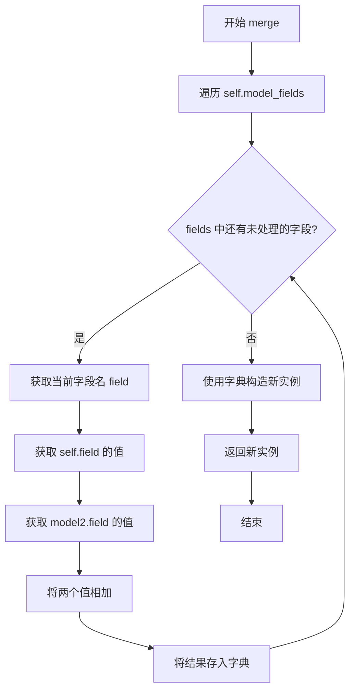
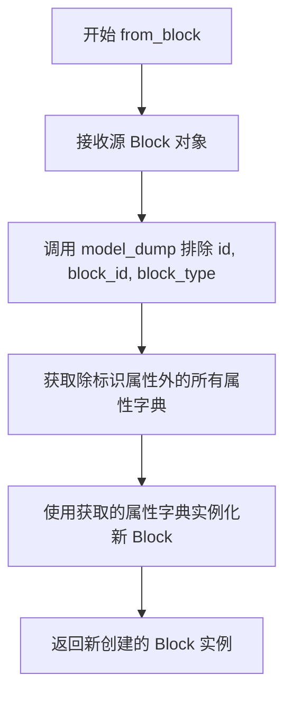
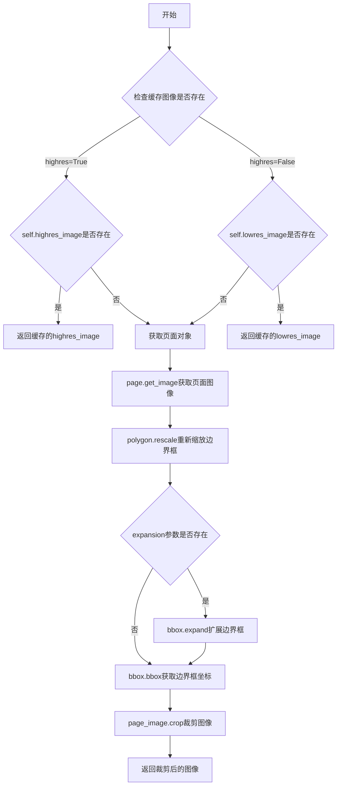
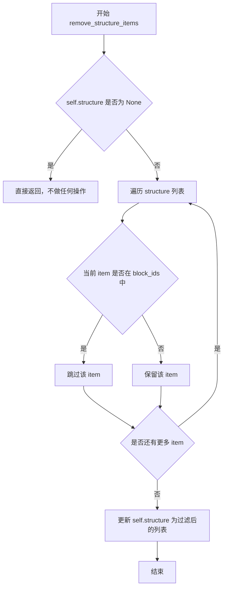
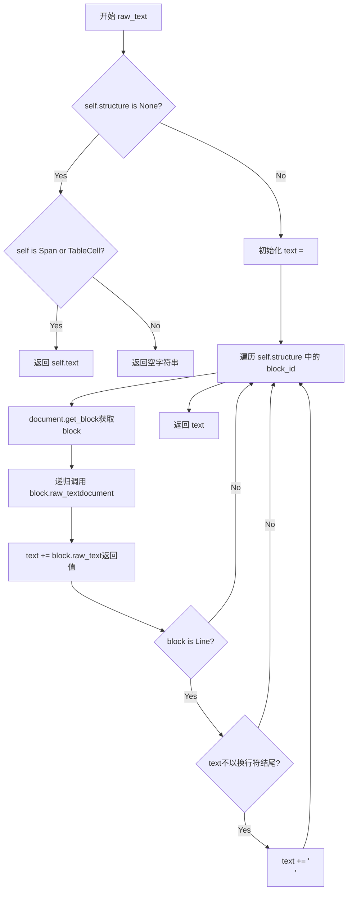

# `marker\marker\schema\blocks\base.py` 详细设计文档

该代码定义了文档解析框架Marker中的核心数据模型，用于表示PDF或文档中的各种内容块（Block），包括文本、图像、表格等，并提供块的标识管理、元数据跟踪、结构关系维护、渲染输出等完整功能。

## 整体流程



## 类结构

```
Block (核心块类)
├── BlockMetadata (元数据类)
├── BlockOutput (输出类)
└── BlockId (标识类)
```

## 全局变量及字段


### `BlockMetadata.llm_request_count`
    
LLM请求次数

类型：`int`
    


### `BlockMetadata.llm_error_count`
    
LLM错误次数

类型：`int`
    


### `BlockMetadata.llm_tokens_used`
    
LLM使用的token数量

类型：`int`
    


### `BlockMetadata.previous_text`
    
前一个块的文本

类型：`str`
    


### `BlockMetadata.previous_type`
    
前一个块的类型

类型：`str`
    


### `BlockMetadata.previous_order`
    
前一个块的顺序

类型：`int`
    


### `BlockOutput.html`
    
块的HTML表示

类型：`str`
    


### `BlockOutput.polygon`
    
块的几何位置

类型：`PolygonBox`
    


### `BlockOutput.id`
    
块的唯一标识

类型：`BlockId`
    


### `BlockOutput.children`
    
子块列表

类型：`List[BlockOutput] | None`
    


### `BlockOutput.section_hierarchy`
    
章节层级结构

类型：`Dict[int, BlockId] | None`
    


### `BlockId.page_id`
    
页面ID

类型：`int`
    


### `BlockId.block_id`
    
块ID

类型：`Optional[int]`
    


### `BlockId.block_type`
    
块类型

类型：`BlockTypes | None`
    


### `Block.polygon`
    
几何边框

类型：`PolygonBox`
    


### `Block.block_description`
    
块描述

类型：`str`
    


### `Block.block_type`
    
块类型

类型：`Optional[BlockTypes]`
    


### `Block.block_id`
    
块ID

类型：`Optional[int]`
    


### `Block.page_id`
    
页面ID

类型：`Optional[int]`
    


### `Block.text_extraction_method`
    
文本提取方法

类型：`Optional[Literal]`
    


### `Block.structure`
    
结构块ID列表

类型：`List[BlockId] | None`
    


### `Block.ignore_for_output`
    
是否忽略输出

类型：`bool`
    


### `Block.replace_output_newlines`
    
是否替换换行符

类型：`bool`
    


### `Block.source`
    
来源类型

类型：`Literal`
    


### `Block.top_k`
    
Top-K配置

类型：`Optional[Dict]`
    


### `Block.metadata`
    
元数据

类型：`BlockMetadata | None`
    


### `Block.lowres_image`
    
低分辨率图像

类型：`Image.Image | None`
    


### `Block.highres_image`
    
高分辨率图像

类型：`Image.Image | None`
    


### `Block.removed`
    
是否已移除

类型：`bool`
    


### `Block._metadata`
    
内部元数据

类型：`Optional[dict]`
    
    

## 全局函数及方法


### `BlockMetadata.merge`

该方法用于合并两个BlockMetadata对象，将两个实例的数值型字段相加，返回一个新的合并后的BlockMetadata实例，常用于聚合多个块的元数据统计信息。

参数：

- `model2`：`BlockMetadata`，要合并的另一个BlockMetadata实例

返回值：`BlockMetadata`，合并后的新BlockMetadata实例

#### 流程图



#### 带注释源码

```python
def merge(self, model2):
    """
    合并两个 BlockMetadata 对象。
    
    该方法遍历当前实例的所有模型字段，将 self 和 model2 
    对应字段的值相加（主要用于数值型字段如 llm_request_count 等），
    然后创建一个新的 BlockMetadata 实例返回。
    
    参数:
        model2: 要合并的另一个 BlockMetadata 实例
        
    返回值:
        合并后的新 BlockMetadata 实例
    """
    return self.__class__(
        **{
            field: getattr(self, field) + getattr(model2, field)
            # 遍历所有模型字段，对每个字段：
            # 1. getattr(self, field) 获取当前实例的字段值
            # 2. getattr(model2, field) 获取传入实例的字段值
            # 3. + 操作符将两者相加（适用于数值型字段）
            # 4. 构建字典，最终通过 ** 解包传入构造函数创建新实例
            for field in self.model_fields
        }
    )
```


### BlockId.__str__

将 BlockId 对象转换为字符串路径表示，生成类似 "/page/1/Title/5" 的路径格式，用于唯一标识文档中的块（Block）位置。

参数：无需参数

返回值：`str`，返回格式化的路径字符串，包含页面ID和可选的块类型及块ID

#### 流程图

```mermaid
flowchart TD
    A[开始 __str__] --> B{self.block_type 是否为 None}
    B -->|是| C{self.block_id 是否为 None}
    B -->|否| D{self.block_id 是否为 None}
    C -->|是| E[返回 f"/page/{self.page_id}"]
    C -->|否| F[返回 f"/page/{self.page_id}/{self.block_type.name}/{self.block_id}"]
    D -->|是| E
    D -->|否| F
    E --> G[结束]
    F --> G
```

#### 带注释源码

```python
def __str__(self):
    """
    将 BlockId 对象转换为字符串路径
    
    转换逻辑：
    - 如果 block_type 或 block_id 任一为 None，返回仅包含页面ID的路径 /page/{page_id}
    - 否则返回完整路径 /page/{page_id}/{block_type}/{block_id}
    
    Returns:
        str: 路径字符串，格式为 /page/{page_id} 或 /page/{page_id}/{block_type}/{block_id}
    """
    # 检查 block_type 或 block_id 是否为 None
    if self.block_type is None or self.block_id is None:
        # 返回仅包含页面ID的基础路径
        return f"/page/{self.page_id}"
    
    # 返回完整的块路径，包含页面ID、块类型名称和块ID
    return f"/page/{self.page_id}/{self.block_type.name}/{self.block_id}"
```


### `BlockId.__hash__`

该方法为 `BlockId` 对象生成哈希值，通过将对象的字符串表示形式传递给 Python 内置的 `hash` 函数实现，使其可以作为字典键或集合元素使用。

参数：

- 无（仅包含隐式参数 `self`）

返回值：`int`，返回 `BlockId` 对象的哈希值

#### 流程图

```mermaid
flowchart TD
    A[开始 __hash__] --> B[调用 self.__str__ 获取字符串表示]
    B --> C{self.block_type 或 self.block_id 是否为 None?}
    C -->|是| D[返回 '/page/{page_id}' 格式字符串]
    C -->|否| E[返回 '/page/{page_id}/{block_type.name}/{block_id}' 格式字符串]
    D --> F[将字符串传递给 hash 函数]
    E --> F
    F --> G[返回哈希值 int]
```

#### 带注释源码

```python
def __hash__(self):
    """
    计算 BlockId 对象的哈希值。
    
    该方法通过将 BlockId 对象转换为字符串表示形式，
    然后使用 Python 内置的 hash 函数生成哈希值。
    这使得 BlockId 对象可以用作字典的键或存储在集合中。
    
    哈希值的计算依赖于 __str__ 方法的输出格式：
    - 当 block_type 或 block_id 为 None 时："/page/{page_id}"
    - 当两者都存在时："/page/{page_id}/{block_type.name}/{block_id}"
    
    Returns:
        int: 对象的哈希值
    """
    return hash(str(self))
```


### `BlockId.__repr__`

该方法返回 `BlockId` 对象的字符串表示形式，生成可用于唯一标识文档中特定块的路径格式字符串。

参数：此方法无显式参数（除隐式 `self` 参数外）。

返回值：`str`，返回对象的字符串表示，格式为 `/page/{page_id}` 或 `/page/{page_id}/{block_type}/{block_id}`。

#### 流程图

```mermaid
flowchart TD
    A[__repr__ 被调用] --> B{self.block_type is None<br>or self.block_id is None?}
    B -->|是| C[返回 f"/page/{self.page_id}"]
    B -->|否| D[返回 f"/page/{self.page_id}/{self.block_type.name}/{self.block_id}"]
    C --> E[结束]
    D --> E
```

#### 带注释源码

```python
def __repr__(self):
    """
    返回 BlockId 对象的字符串表示形式。
    
    该方法实现了 Python 的 __repr__ 特殊方法，用于生成对象的官方字符串表示。
    内部直接调用 __str__ 方法来生成字符串，确保 __repr__ 和 __str__ 行为一致。
    
    返回格式:
        - 如果 block_type 或 block_id 为 None: "/page/{page_id}"
        - 否则: "/page/{page_id}/{block_type}/{block_id}"
    
    示例:
        BlockId(page_id=1, block_id=1, block_type=BlockTypes.Paragraph)
        返回: "/page/1/Paragraph/1"
    """
    return str(self)  # 调用同类的 __str__ 方法生成字符串表示
```


### `BlockId.__eq__`

该方法实现了`BlockId`对象的相等比较功能，支持与另一个`BlockId`实例或字符串进行比较。如果比较对象既不是`BlockId`也不是字符串，则返回`NotImplemented`以允许Python尝试反向比较。

参数：

- `other`：`BlockId | str`，进行比较的对象，可以是`BlockId`实例或字符串

返回值：`bool`，如果相等返回`True`，否则返回`False`

#### 流程图

```mermaid
flowchart TD
    A[开始 __eq__] --> B{other是否为BlockId或str类型}
    B -->|否| C[返回 NotImplemented]
    B -->|是| D{other是否为str类型}
    D -->|是| E[返回 str(self) == other]
    D -->|否| F[比较 self.page_id == other.page_id]
    F --> G[比较 self.block_id == other.block_id]
    G --> H[比较 self.block_type == other.block_type]
    H --> I{三个比较结果都为True?}
    I -->|是| J[返回 True]
    I -->|否| K[返回 False]
```

#### 带注释源码

```python
def __eq__(self, other):
    """
    比较两个 BlockId 对象是否相等，或与字符串进行比较
    
    参数:
        other: 要比较的对象，可以是 BlockId 实例或字符串
    
    返回值:
        bool: 相等返回 True，否则返回 False
        如果类型不兼容返回 NotImplemented
    """
    # 检查 other 是否是 BlockId 或 str 类型
    if not isinstance(other, (BlockId, str)):
        # 返回 NotImplemented 允许 Python 尝试反向比较 (other == self)
        return NotImplemented

    # 如果是字符串类型，则将 BlockId 转为字符串后比较
    if isinstance(other, str):
        return str(self) == other
    else:
        # 否则比较三个关键属性：page_id, block_id, block_type
        return (
            self.page_id == other.page_id
            and self.block_id == other.block_id
            and self.block_type == other.block_type
        )
```


### `BlockId.validate_block_type`

验证块类型字段的值是否为合法的 BlockTypes 枚举值，确保 block_type 属性被设置为有效的文档块类型。

参数：

- `cls`：`<class 'classmethod'>`，Pydantic 模型的类对象，用于访问类级别的方法和属性
- `v`：`BlockTypes | None`，待验证的块类型值，可以是 BlockTypes 枚举中的任意值或 None

返回值：`BlockTypes | None`，验证通过后返回原始的块类型值；如果验证失败则抛出 ValueError 异常

#### 流程图

```mermaid
flowchart TD
    A[开始验证 block_type] --> B{导入 BlockTypes 枚举}
    B --> C{v 是否在 BlockTypes 中?}
    C -->|是| D[返回原始值 v]
    C -->|否| E[抛出 ValueError 异常]
    E --> F[错误信息: Invalid block type: {v}]
    
    style A fill:#f9f,color:#333
    style D fill:#9f9,color:#333
    style E fill:#f99,color:#333
```

#### 带注释源码

```python
@field_validator("block_type")  # Pydantic 装饰器，指定验证 block_type 字段
@classmethod
def validate_block_type(cls, v):
    """
    验证 block_type 字段的值是否为合法的 BlockTypes 枚举值
    
    参数:
        cls: Pydantic 模型的类对象
        v: 待验证的块类型值
    
    返回:
        验证通过后返回原始的块类型值
    
    异常:
        ValueError: 当 v 不在 BlockTypes 枚举中时抛出
    """
    # 延迟导入 BlockTypes，避免循环依赖
    from marker.schema import BlockTypes

    # 检查值是否在有效的 BlockTypes 枚举中
    if v not in BlockTypes:
        # 如果不是有效的块类型，抛出详细的错误信息
        raise ValueError(f"Invalid block type: {v}")
    
    # 验证通过，返回原始值
    return v
```


### `BlockId.to_path`

该方法将 `BlockId` 对象转换为路径格式字符串。通过调用 `__str__` 方法获取字符串表示（如 `/page/1/Title/2`），然后将其中所有的斜杠 `/` 替换为下划线 `_`，生成可用于文件路径或 URL 路径的格式（如 `_page_1_Title_2`）。

参数：

- 该方法无需额外参数（仅包含隐式参数 `self`）

返回值：`str`，返回转换后的路径格式字符串

#### 流程图

```mermaid
flowchart TD
    A[开始: to_path] --> B[调用 strself 获取字符串表示]
    B --> C{判断 block_type 和 block_id 是否为 None}
    C -->|是| D[返回格式: /page/{page_id}]
    C -->|否| E[返回格式: /page/{page_id}/{block_type.name}/{block_id}]
    D --> F[执行 replace'/' '_' 替换]
    E --> F
    F --> G[返回替换后的字符串]
```

#### 带注释源码

```python
def to_path(self):
    # 调用对象的 __str__ 方法获取字符串表示
    # 根据 block_type 和 block_id 是否为 None，返回不同格式：
    # - 若为 None: "/page/{page_id}"
    # - 若不为 None: "/page/{page_id}/{block_type.name}/{block_id}"
    # 然后将字符串中的所有 "/" 替换为 "_"
    return str(self).replace("/", "_")
```


### `Block.id`

这是一个属性方法，用于获取块的唯一标识符。它通过组合页面的 `page_id`、块的 `block_id` 和块的类型 `block_type` 来创建一个 `BlockId` 对象，作为该块在整个文档中的唯一标识。

参数： 无（属性访问，无需参数）

返回值：`BlockId`，返回包含页面ID、块ID和块类型的 `BlockId` 对象，用于唯一标识文档中的该块

#### 流程图

```mermaid
flowchart TD
    A[访问 Block.id 属性] --> B{self.page_id 是否存在}
    B -->|是| C{self.block_id 是否存在}
    B -->|否| D[返回只含 page_id 的 BlockId]
    C -->|是| E{self.block_type 是否存在}
    C -->|否| F[返回只含 page_id 和 block_id 的 BlockId]
    E -->|是| G[返回完整的 BlockId: /page/{page_id}/{block_type}/{block_id}]
    E -->|否| H[返回含 page_id 和 block_id 的 BlockId]
    
    style G fill:#90EE90
    style D fill:#FFE4B5
    style F fill:#FFE4B5
    style H fill:#FFE4B5
```

#### 带注释源码

```python
@property
def id(self) -> BlockId:
    """
    获取块的唯一标识符
    
    该属性通过组合 page_id、block_id 和 block_type 三个字段来创建
    一个 BlockId 对象，用于在文档中唯一标识当前块。
    
    返回值:
        BlockId: 包含页面ID、块ID和块类型的唯一标识对象
    """
    return BlockId(
        page_id=self.page_id,      # 页面的唯一标识符
        block_id=self.block_id,    # 块在页面内的序号ID
        block_type=self.block_type # 块的类型（如文本、表格、图片等）
    )
```


### `Block.from_block`

这是一个类方法（`@classmethod`），用于从现有的 `Block` 对象创建一个新的 `Block` 实例。该方法通过排除 `id`、`block_id` 和 `block_type` 三个属性，复制源块的其他所有属性，从而生成一个具有相同内容但独立身份的新块对象。

参数：

- `block`：`Block`，源 Block 对象，从中复制属性以创建新实例

返回值：`Block`，从源 Block 对象复制属性创建的新 Block 实例

#### 流程图



#### 带注释源码

```python
@classmethod
def from_block(cls, block: Block) -> Block:
    """
    从现有的 Block 对象创建一个新的 Block 实例。
    
    该方法是一个类方法（@classmethod），因此第一个参数是类本身（cls）而非实例。
    它通过以下步骤创建新实例：
    1. 使用 model_dump 方法将源 Block 对象序列化为字典
    2. 排除 id、block_id、block_type 这三个标识性属性
    3. 使用剩余属性通过类构造函数创建新的 Block 实例
    
    这种设计允许：
    - 复制块的视觉内容（polygon、block_description 等）
    - 重置块的标识信息，使其成为独立的新块
    - 保持块的原始属性（如 text_extraction_method、structure 等）
    
    Args:
        cls: 类本身（类方法自动传入）
        block: Block: 源 Block 对象，从中复制属性
        
    Returns:
        Block: 新创建的 Block 实例，包含源块除标识外的所有属性
    """
    # model_dump 将 Pydantic 模型序列化为字典
    # exclude 参数指定要排除的字段，这里排除了三个标识性字段
    # id 是 BlockId 类型，block_id 是 int，block_type 是 BlockTypes
    # 这样新块将拥有新的标识（如果后续设置）
    block_attrs = block.model_dump(exclude=["id", "block_id", "block_type"])
    
    # 使用字典解包将属性传递给类的构造函数
    # cls(**block_attrs) 等同于 Block(**block_attrs)
    # 这会创建一个新的 Block 实例
    return cls(**block_attrs)
```


### `Block.set_internal_metadata`

设置块的内部元数据，用于在处理过程中存储任意数据。

参数：

- `key`：`str`，元数据的键名，用于标识存储的数据
- `data`：`Any`，要存储的元数据值，可以是任意类型

返回值：`None`，该方法直接修改对象内部状态，无返回值

#### 流程图

```mermaid
flowchart TD
    A[开始 set_internal_metadata] --> B{self._metadata is None?}
    B -->|是| C[初始化 self._metadata = {}]
    B -->|否| D[直接执行下一步]
    C --> E[self._metadata[key] = data]
    D --> E
    E --> F[结束]
```

#### 带注释源码

```python
def set_internal_metadata(self, key, data):
    """
    设置块的内部元数据
    
    参数:
        key: 元数据的键名
        data: 要存储的元数据值
    """
    # 检查内部元数据字典是否已初始化
    if self._metadata is None:
        # 如果未初始化，创建一个新的空字典
        self._metadata = {}
    
    # 将数据存储到内部元数据字典中
    self._metadata[key] = data
```


### `Block.get_internal_metadata`

获取块的内部元数据。该方法通过指定的键从块的内部元数据字典中检索数据，如果元数据未初始化或键不存在则返回 None。

参数：

- `key`：任意类型，用于查找内部元数据的键

返回值：任意类型或 `None`，返回与键关联的内部元数据值，如果元数据不存在则返回 `None`

#### 流程图

```mermaid
flowchart TD
    A[开始 get_internal_metadata] --> B{self._metadata 是否为 None?}
    B -->|是| C[返回 None]
    B -->|否| D[调用 self._metadata.get(key)]
    D --> E[返回查找结果]
    
    style A fill:#f9f,stroke:#333
    style C fill:#ff9,stroke:#333
    style E fill:#9f9,stroke:#333
```

#### 带注释源码

```python
def get_internal_metadata(self, key):
    """
    获取块的内部元数据
    
    参数:
        key: 用于查找内部元数据的键
        
    返回:
        与键关联的内部元数据值，如果元数据未初始化或键不存在则返回 None
    """
    # 检查内部元数据字典是否已初始化
    if self._metadata is None:
        # 如果未初始化，返回 None
        return None
    
    # 从内部元数据字典中获取键对应的值
    # 如果键不存在，dict.get() 会自动返回 None
    return self._metadata.get(key)
```


### `Block.get_image`

获取块的图像数据，如果块没有缓存的图像，则从页面图像中裁剪出对应的区域。

参数：

- `self`：`Block` 类的实例方法，隐含参数
- `document`：`Document`，文档对象，用于获取页面对象
- `highres`：`bool`，可选，是否使用高分辨率图像（默认为 False）
- `expansion`：`Tuple[float, float] | None`，可选，图像边界框的扩展系数（默认为 None）
- `remove_blocks`：`Sequence[BlockTypes] | None`，可选，裁剪图像时需要移除的块类型列表（默认为 None）

返回值：`Image.Image | None`，返回裁剪后的块图像，如果无法获取则返回 None

#### 流程图



#### 带注释源码

```python
def get_image(
    self,
    document: Document,
    highres: bool = False,
    expansion: Tuple[float, float] | None = None,
    remove_blocks: Sequence[BlockTypes] | None = None,
) -> Image.Image | None:
    # 根据highres参数选择缓存的图像（高分辨率或低分辨率）
    image = self.highres_image if highres else self.lowres_image
    
    # 如果缓存图像存在，直接返回
    if image is None:
        # 从文档对象获取当前块所在的页面对象
        page = document.get_page(self.page_id)
        
        # 获取页面图像，可选地移除指定类型的块
        page_image = page.get_image(highres=highres, remove_blocks=remove_blocks)

        # 将多边形边界框从页面坐标缩放到实际图像尺寸
        # page.polygon.width/height是页面坐标尺寸，page_image.size是实际图像像素尺寸
        bbox = self.polygon.rescale(
            (page.polygon.width, page.polygon.height), page_image.size
        )
        
        # 如果提供了扩展系数，则扩展边界框
        if expansion:
            bbox = bbox.expand(*expansion)
        
        # 获取最终的边界框坐标 (left, top, right, bottom)
        bbox = bbox.bbox
        
        # 从页面图像中裁剪出块对应的区域
        image = page_image.crop(bbox)
    
    # 返回裁剪后的图像（如果有缓存则直接返回缓存图像）
    return image
```


### `Block.structure_blocks`

获取当前块的结构子块列表。该方法遍历块的 `structure` 属性，通过 `document_page` 对象获取每个块 ID 对应的完整 Block 对象，并返回这些块组成的列表。

参数：

- `document_page`：`Document | PageGroup`，文档页面对象，用于通过块 ID 检索对应的 Block 实例

返回值：`List[Block]`，返回当前块的结构子块列表；如果 structure 为 None，则返回空列表

#### 流程图

```mermaid
flowchart TD
    A[开始 structure_blocks] --> B{self.structure is None?}
    B -->|是| C[返回空列表 []]
    B -->|否| D[遍历 self.structure 中的每个 block_id]
    D --> E[调用 document_page.get_block(block_id)]
    E --> F[获取 Block 对象]
    F --> G{遍历是否完成?}
    G -->|否| D
    G -->|是| H[返回 Block 对象列表]
```

#### 带注释源码

```python
def structure_blocks(self, document_page: Document | PageGroup) -> List[Block]:
    """
    获取当前块的结构子块列表。
    
    该方法通过遍历块的 structure 属性（BlockId 列表），
    从 document_page 中检索每个 ID 对应的 Block 对象，
    并返回由这些 Block 对象组成的列表。
    
    参数:
        document_page: Document 或 PageGroup 对象，
                       提供了 get_block 方法用于通过 BlockId 获取 Block
    
    返回:
        List[Block]: 结构块列表。如果 self.structure 为 None，
                    则返回空列表。
    """
    # 如果 structure 属性为空，直接返回空列表
    if self.structure is None:
        return []
    
    # 遍历 structure 中的每个 BlockId，调用 document_page.get_block 获取对应 Block
    return [document_page.get_block(block_id) for block_id in self.structure]
```


### `Block.get_prev_block`

获取当前块在结构列表中的前一个有效块（根据指定的忽略块类型过滤）。

参数：

- `self`：`Block` 类的实例方法
- `document_page`：`Document | PageGroup`，文档页面对象，用于通过 block_id 获取具体的 Block 对象
- `block`：`Block`，当前块对象，方法会查找此块的前一个块
- `ignored_block_types`：`Optional[List[BlockTypes]] = None`，可选的块类型列表，用于过滤掉不需要考虑的块类型，默认为空列表

返回值：`Block | None`，返回前一个有效块的 Block 对象，如果没有找到（例如当前块是结构中的第一个块，或前面的块都属于被忽略的类型）则返回 `None`

#### 流程图

```mermaid
flowchart TD
    A[开始 get_prev_block] --> B{ignored_block_types 是否为 None?}
    B -->|是| C[设置 ignored_block_types = []]
    B -->|否| D[使用传入的 ignored_block_types]
    C --> E[获取 block.id 在 self.structure 中的索引 structure_idx]
    E --> F{structure_idx == 0?}
    F -->|是| G[返回 None - 当前块是第一个块]
    F -->|否| H[反向遍历 self.structure[:structure_idx]]
    H --> I{当前遍历的 block_type 不在 ignored_block_types 中?}
    I -->|是| J[返回 document_page.get_block(prev_block_id)]
    I -->|否| K{继续遍历}
    K --> H
    H --> L[遍历完成仍未找到]
    L --> M[返回 None]
```

#### 带注释源码

```python
def get_prev_block(
    self,
    document_page: Document | PageGroup,
    block: Block,
    ignored_block_types: Optional[List[BlockTypes]] = None,
):
    """
    获取当前块在结构列表中的前一个有效块
    
    参数:
        document_page: Document | PageGroup - 文档页面对象，用于通过 block_id 获取 Block 对象
        block: Block - 当前块对象
        ignored_block_types: Optional[List[BlockTypes]] - 需要忽略的块类型列表
    
    返回:
        Block | None - 前一个有效块，如果不存在则返回 None
    """
    # 如果没有传入忽略的块类型列表，初始化为空列表
    if ignored_block_types is None:
        ignored_block_types = []

    # 获取当前块在结构列表中的索引位置
    structure_idx = self.structure.index(block.id)
    
    # 如果当前块是结构中的第一个块，则没有前一个块
    if structure_idx == 0:
        return None

    # 反向遍历当前块之前的所有块
    for prev_block_id in reversed(self.structure[:structure_idx]):
        # 如果前一个块的类型不在忽略列表中，则返回该块
        if prev_block_id.block_type not in ignored_block_types:
            return document_page.get_block(prev_block_id)
    
    # 如果所有前面的块都被忽略或不存在，返回 None
    return None
```


### `Block.get_next_block`

获取当前块结构中的下一个块，支持跳过指定的块类型。

参数：

- `self`：`Block` 类实例，表示当前块对象
- `document_page`：`Document | PageGroup`，文档页面对象，用于通过块ID获取块
- `block`：`Optional[Block] = None`，参考块对象。如果提供该参数，方法将返回该块之后的下一个块；如果为 `None`，则从结构中的第一个块开始查找
- `ignored_block_types`：`Optional[List[BlockTypes]] = None`，需要忽略的块类型列表。如果不传或为 `None`，则使用空列表，表示不忽略任何块类型

返回值：`Optional[Block]`，返回找到的下一个有效块；如果没有找到有效的下一个块，则返回 `None`

#### 流程图

```mermaid
flowchart TD
    A[开始 get_next_block] --> B{ignored_block_types is None?}
    B -->|是| C[ignored_block_types = []]
    B -->|否| D[保持原 ignored_block_types]
    C --> E{block is not None?}
    D --> E
    E -->|是| F[structure_idx = self.structure.index(block.id) + 1]
    E -->|否| G[structure_idx = 0]
    F --> H[遍历 self.structure[structure_idx:]]
    G --> H
    H --> I{next_block_id.block_type not in ignored_block_types?}
    I -->|是| J[return document_page.get_block(next_block_id)]
    I -->|否| K[继续下一个 next_block_id]
    K --> H
    H --> L[遍历结束]
    L --> M[return None]
```

#### 带注释源码

```python
def get_next_block(
    self,
    document_page: Document | PageGroup,
    block: Optional[Block] = None,
    ignored_block_types: Optional[List[BlockTypes]] = None,
):
    """
    获取当前块结构中的下一个块
    
    参数:
        document_page: Document | PageGroup - 文档页面对象，用于通过块ID获取块
        block: Optional[Block] - 参考块对象，方法返回该块之后的下一个块
        ignored_block_types: Optional[List[BlockTypes]] - 需要忽略的块类型列表
    
    返回:
        Optional[Block] - 找到的下一个有效块，如果没有则返回None
    """
    # 如果未指定忽略的块类型，初始化为空列表
    if ignored_block_types is None:
        ignored_block_types = []

    # 初始化搜索起始索引为0（从第一个块开始）
    structure_idx = 0
    # 如果提供了参考块，从该块的下一个位置开始搜索
    if block is not None:
        structure_idx = self.structure.index(block.id) + 1

    # 遍历从起始索引开始的所有后续块
    for next_block_id in self.structure[structure_idx:]:
        # 如果该块的类型不在忽略列表中，则返回该块
        if next_block_id.block_type not in ignored_block_types:
            return document_page.get_block(next_block_id)

    # 没有找到有效的下一个块
    return None
```


### `Block.add_structure`

向当前块的 `structure` 列表中添加一个子块的标识符，用于构建块的层级结构。如果 `structure` 为 `None`，则创建一个新的列表并添加块ID；否则直接将块ID追加到现有列表中。

参数：

- `block`：`Block`，需要添加到当前块结构中的子块对象

返回值：`None`，无返回值（方法直接修改对象的 `structure` 属性）

#### 流程图

```mermaid
flowchart TD
    A[开始 add_structure] --> B{self.structure is None?}
    B -->|是| C[创建新列表 self.structure = [block.id]]
    B -->|否| D[追加到列表 self.structure.append(block.id)]
    C --> E[结束]
    D --> E
```

#### 带注释源码

```python
def add_structure(self, block: Block):
    """
    向当前块的 structure 列表中添加一个子块。
    
    参数:
        block: Block - 需要添加到结构中的子块对象
        
    返回:
        None - 直接修改 self.structure 属性
    """
    # 检查 structure 是否为 None
    if self.structure is None:
        # 如果为 None，创建新列表并添加 block 的 id
        self.structure = [block.id]
    else:
        # 如果已存在列表，直接追加 block 的 id
        self.structure.append(block.id)
```


### `Block.update_structure_item`

该方法用于更新 Block 类的结构列表（structure）中的特定 BlockId，将旧的 BlockId 替换为新的 BlockId。

参数：

- `old_id`：`BlockId`，需要被替换的旧 BlockId
- `new_id`：`BlockId`，用于替换的新 BlockId

返回值：`None`，无返回值（方法直接修改对象内部状态）

#### 流程图

```mermaid
flowchart TD
    A[开始 update_structure_item] --> B{self.structure is not None?}
    B -->|否| C[直接返回，方法结束]
    B -->|是| D[遍历 self.structure 列表]
    D --> E{当前项 == old_id?}
    E -->|否| F[继续遍历下一个元素]
    E -->|是| G[将 self.structure[i] 替换为 new_id]
    G --> H[break 退出循环]
    F --> D
    H --> I[方法结束]
```

#### 带注释源码

```python
def update_structure_item(self, old_id: BlockId, new_id: BlockId):
    """
    更新结构列表中的特定 BlockId
    
    参数:
        old_id: BlockId - 需要被替换的旧 BlockId
        new_id: BlockId - 用于替换的新 BlockId
    """
    # 检查 structure 是否存在（不为 None）
    if self.structure is not None:
        # 遍历 structure 列表，enumerate 提供索引和值
        for i, item in enumerate(self.structure):
            # 使用 BlockId 的 __eq__ 方法比较是否匹配
            if item == old_id:
                # 找到匹配的项，使用新 ID 替换旧 ID
                self.structure[i] = new_id
                # 替换后立即退出循环，只替换第一个匹配项
                break
```


### `Block.remove_structure_items`

该方法用于从当前 Block 的 structure 列表中移除指定的 BlockId 项。它接受一个 BlockId 列表作为参数，遍历当前的 structure 列表并过滤掉需要移除的项，直接修改对象的 structure 属性而不返回任何值。

参数：

- `block_ids`：`List[BlockId]`，需要从 structure 列表中移除的 BlockId 对象列表

返回值：`None`，无返回值，直接修改对象的 structure 属性

#### 流程图



#### 带注释源码

```python
def remove_structure_items(self, block_ids: List[BlockId]):
    """
    从 Block 的 structure 列表中移除指定的 BlockId 项
    
    参数:
        block_ids: List[BlockId] - 需要移除的 BlockId 对象列表
        
    返回:
        None - 无返回值，直接修改对象的 structure 属性
    """
    # 检查 structure 是否已初始化（不为 None）
    if self.structure is not None:
        # 使用列表推导式过滤 structure 列表
        # 保留所有不在 block_ids 列表中的项
        self.structure = [item for item in self.structure if item not in block_ids]
```


### `Block.raw_text`

获取Block的原始文本内容，通过递归遍历structure中的所有子块，拼接每个子块的原始文本，对于Line类型的块在文本末尾添加换行符，最终返回完整的文本字符串。

参数：

- `self`：Block，当前Block实例（隐含参数）
- `document`：`Document`，文档对象，用于通过block_id获取具体的块实例

返回值：`str`，返回拼接后的完整原始文本内容

#### 流程图



#### 带注释源码

```python
def raw_text(self, document: Document) -> str:
    # 导入依赖的类型，用于类型检查
    from marker.schema.text.line import Line
    from marker.schema.text.span import Span
    from marker.schema.blocks.tablecell import TableCell

    # 如果structure为空（表示没有子块结构）
    if self.structure is None:
        # 判断当前块是否是Span或TableCell类型
        if isinstance(self, (Span, TableCell)):
            # 直接返回其自身的text属性
            return self.text
        else:
            # 其他类型且无structure的块返回空字符串
            return ""

    # 初始化结果文本字符串
    text = ""
    # 遍历当前块的所有子块ID
    for block_id in self.structure:
        # 从文档中获取对应的块对象
        block = document.get_block(block_id)
        # 递归调用子块的raw_text方法获取文本
        text += block.raw_text(document)
        # 如果当前块是Line类型且文本不以换行符结尾，则添加换行符
        if isinstance(block, Line) and not text.endswith("\n"):
            text += "\n"
    # 返回拼接后的完整文本
    return text
```


### `Block.assemble_html`

该方法用于将子块（child_blocks）组装成HTML内容，通过生成`<content-ref>`标签引用子块，并根据配置决定是否替换换行符或包装在`<p>`标签中。

参数：

- `self`：`Block` 类的实例方法，隐含参数
- `document`：`Document`，文档对象，用于获取页面和块信息
- `child_blocks`：`List[BlockOutput]`，已渲染的子块列表，包含HTML和多边形信息
- `parent_structure`：`Optional[List[str]]`，父级结构信息（可选）
- `block_config`：`Optional[dict]`，块配置字典，用于控制输出行为（可选）

返回值：`str`，生成的HTML字符串

#### 流程图

```mermaid
flowchart TD
    A[开始 assemble_html] --> B{self.ignore_for_output?}
    B -->|True| C[返回空字符串 '']
    B -->|False| D[初始化 template = '']
    D --> E{遍历 child_blocks}
    E -->|每个 c| F[生成 <content-ref src='c.id'></content-ref>]
    F --> G[拼接到 template]
    G --> E
    E -->|遍历完成| H{self.replace_output_newlines?}
    H -->|True| I[替换 \n 为空格]
    I --> J[包装为 <p>template</p>]
    H -->|False| K[返回 template]
    J --> K
```

#### 带注释源码

```python
def assemble_html(
    self,
    document: Document,
    child_blocks: List[BlockOutput],
    parent_structure: Optional[List[str]] = None,
    block_config: Optional[dict] = None,
) -> str:
    # 如果当前块被标记为忽略输出，则直接返回空字符串
    if self.ignore_for_output:
        return ""

    # 初始化HTML模板字符串
    template = ""
    # 遍历所有子块，为每个子块生成content-ref引用标签
    for c in child_blocks:
        template += f"<content-ref src='{c.id}'></content-ref>"

    # 如果需要替换输出中的换行符
    if self.replace_output_newlines:
        # 将换行符替换为空格
        template = template.replace("\n", " ")
        # 用<p>标签包装整个内容
        template = "<p>" + template + "</p>"

    # 返回最终生成的HTML模板
    return template
```


### `Block.assign_section_hierarchy`

该方法用于为当前块分配章节层级结构。当块类型为章节标题（SectionHeader）时，会根据标题级别更新层级字典，删除同级或更低级别的现有条目，并添加当前块的标识。

参数：

- `section_hierarchy`：`dict`，传入的章节层级字典，用于存储各标题级别与块 ID 的映射关系

返回值：`dict`，返回更新后的章节层级字典

#### 流程图

```mermaid
flowchart TD
    A[开始 assign_section_hierarchy] --> B{self.block_type == BlockTypes.SectionHeader<br/>且 self.heading_level 存在?}
    B -->|否| F[直接返回 section_hierarchy]
    B -->|是| C[获取 section_hierarchy 的所有键]
    C --> D{遍历级别 level}
    D -->|level >= self.heading_level| E[删除该级别的条目]
    D -->|level < self.heading_level| G[继续下一个 level]
    E --> G
    G -->|遍历完成| H[将当前块的 id 存入 section_hierarchy]
    H --> F
```

#### 带注释源码

```python
def assign_section_hierarchy(self, section_hierarchy):
    """
    为当前块分配章节层级
    
    当块类型为章节标题(SectionHeader)时:
    1. 删除同级或更低级别的现有层级条目
    2. 将当前块的ID添加到对应层级
    这样可以确保章节层级反映文档中标题的嵌套关系
    """
    # 仅处理章节标题类型的块
    if self.block_type == BlockTypes.SectionHeader and self.heading_level:
        # 获取当前已有的所有层级级别
        levels = list(section_hierarchy.keys())
        
        # 遍历所有层级，删除大于等于当前标题级别的条目
        # 这样可以处理标题级别的变化（如从h2回到h1）
        for level in levels:
            if level >= self.heading_level:
                del section_hierarchy[level]
        
        # 将当前块的ID添加到对应的标题级别
        section_hierarchy[self.heading_level] = self.id
    
    # 返回更新后的层级结构，供父块或兄弟块使用
    return section_hierarchy
```


### `Block.contained_blocks`

获取当前块中包含的所有子块，支持按块类型过滤，并递归收集所有嵌套的子块。

参数：

- `document`：`Document`，文档对象，用于通过块 ID 获取块实例
- `block_types`：`Sequence[BlockTypes] | None`，可选的块类型序列，用于过滤只返回指定类型的块，默认为 `None`（返回所有类型的块）

返回值：`List[Block]`，返回包含的所有子块列表，如果 `structure` 为 `None` 则返回空列表

#### 流程图

```mermaid
flowchart TD
    A[开始 contained_blocks] --> B{self.structure is None?}
    B -->|是| C[返回空列表 []]
    B -->|否| D[初始化空列表 blocks]
    D --> E[遍历 self.structure 中的 block_id]
    E --> F[通过 document.get_block 获取 block]
    G{block.removed?}
    G -->|是| H[跳过当前块，继续下一个]
    G -->|否| I{block_types 为 None 或 block.block_type 在 block_types 中?}
    I -->|否| J[不添加当前块到结果]
    I -->|是| K[添加 block 到 blocks 列表]
    K --> L[递归调用 block.contained_blocks]
    L --> M[将递归返回的块添加到 blocks]
    J --> M
    M --> N{还有更多 block_id?}
    N -->|是| E
    N -->|否| O[返回 blocks 列表]
```

#### 带注释源码

```python
def contained_blocks(
    self, document: Document, block_types: Sequence[BlockTypes] = None
) -> List[Block]:
    """
    获取当前块中包含的所有子块，支持按块类型过滤，并递归收集嵌套子块。
    
    参数:
        document: Document - 文档对象，用于通过块ID获取块实例
        block_types: Sequence[BlockTypes] | None - 可选的块类型序列，用于过滤只返回指定类型的块
    
    返回值:
        List[Block] - 包含的所有子块列表
    """
    # 如果当前块没有结构信息（structure为None），返回空列表
    if self.structure is None:
        return []

    # 初始化用于存储结果块的列表
    blocks = []
    
    # 遍历当前块结构中的所有块ID
    for block_id in self.structure:
        # 通过文档对象获取对应的块实例
        block = document.get_block(block_id)
        
        # 如果块已被移除（removed标记为True），跳过此块
        if block.removed:
            continue
        
        # 检查块类型是否符合过滤条件
        # 条件1: block_types为None（不过滤） 或 块类型在指定类型列表中
        # 条件2: 块未被移除
        if (
            block_types is None or block.block_type in block_types
        ) and not block.removed:
            # 将符合条件的块添加到结果列表
            blocks.append(block)
        
        # 递归调用子块的contained_blocks方法，收集嵌套的子块
        # 这是一个深度优先遍历，会递归获取所有层级的子块
        blocks += block.contained_blocks(document, block_types)
    
    # 返回收集到的所有子块
    return blocks
```


### `Block.replace_block`

该方法用于在块的structure结构列表中用新块替换旧块，通过遍历structure列表找到与旧块ID匹配的项并更新为新块的ID。

参数：

- `block`：`Block`，要进行替换的旧块对象
- `new_block`：`Block`，用于替换的新块对象

返回值：`None`，该方法无返回值，直接修改对象的`structure`属性

#### 流程图

```mermaid
graph TD
    A[开始 replace_block] --> B{self.structure 是否为 None?}
    B -->|是| Z[结束，结构为 None，不做任何修改]
    B -->|否| C[遍历 self.structure 列表]
    C --> D{当前项 == block.id?}
    D -->|否| C
    D -->|是| E[将 self.structure[i] 替换为 new_block.id]
    E --> F[跳出循环]
    F --> Z
```

#### 带注释源码

```python
def replace_block(self, block: Block, new_block: Block):
    """
    用新块替换结构中的旧块
    
    参数:
        block: Block - 要被替换的旧块对象
        new_block: Block - 用于替换的新块对象
    返回:
        None - 直接修改 self.structure 属性
    """
    # 检查 structure 是否存在（可能为 None）
    if self.structure is not None:
        # 遍历结构列表，查找匹配的块ID
        for i, item in enumerate(self.structure):
            # 比较结构中的项是否与旧块的ID匹配
            if item == block.id:
                # 将对应位置的项替换为新块的ID
                self.structure[i] = new_block.id
                # 找到后跳出循环，只替换第一个匹配项
                break
```


### `Block.render`

该方法是 `Block` 类的核心渲染方法，负责将块（Block）及其子块递归渲染为 `BlockOutput` 对象。它通过遍历块的 structure（结构）属性，对每个子块调用自身的 render 方法来构建完整的渲染输出，同时维护章节层级（section_hierarchy）信息。

参数：

- `self`：`Block`，当前要渲染的块实例
- `document`：`Document`，文档对象，用于获取块和页面信息
- `parent_structure`：`Optional[List[str]] = None`，父级结构列表，传递给子块
- `section_hierarchy`：`dict | None = None`，章节层级字典，用于跟踪文档的章节结构
- `block_config`：`Optional[dict] = None`，块配置字典，用于传递渲染配置

返回值：`BlockOutput`，包含渲染后的 HTML、多边形边界、块 ID、子块列表和章节层级的输出对象

#### 流程图

```mermaid
flowchart TD
    A[开始 render 方法] --> B{检查 block_config 是否为 None}
    B -->|是| C[block_config = {}]
    B -->|否| D[使用传入的 block_config]
    C --> E[初始化 section_hierarchy]
    D --> E
    E --> F{检查 section_hierarchy 是否为 None}
    F -->|是| G[section_hierarchy = {}]
    F -->|否| H[保持原 section_hierarchy]
    G --> I[调用 assign_section_hierarchy 更新 section_hierarchy]
    H --> I
    I --> J{检查 self.structure 是否存在且长度 > 0}
    J -->|否| K[child_content = []]
    J -->|是| L[遍历 self.structure 中的每个 block_id]
    L --> M[document.get_block 获取 block]
    M --> N[递归调用 block.render]
    N --> O[复制渲染结果的 section_hierarchy]
    O --> P[将渲染结果添加到 child_content]
    P --> L
    L --> Q{遍历完成?}
    Q -->|否| L
    Q -->|是| K
    K --> R[调用 assemble_html 组装 HTML]
    R --> S[创建并返回 BlockOutput]
    S --> T[结束 render 方法]
```

#### 带注释源码

```python
def render(
    self,
    document: Document,
    parent_structure: Optional[List[str]] = None,
    section_hierarchy: dict | None = None,
    block_config: Optional[dict] = None,
) -> BlockOutput:
    # 如果 block_config 为 None，初始化为空字典
    if block_config is None:
        block_config = {}

    # 初始化子内容列表，用于存储子块的渲染结果
    child_content = []
    
    # 如果 section_hierarchy 为 None，初始化为空字典
    if section_hierarchy is None:
        section_hierarchy = {}
    
    # 调用 assign_section_hierarchy 更新章节层级
    # 该方法会根据当前块的类型（是否为 SectionHeader）更新层级字典
    section_hierarchy = self.assign_section_hierarchy(section_hierarchy)

    # 检查当前块是否有结构（子块）
    if self.structure is not None and len(self.structure) > 0:
        # 遍历结构中的每个块 ID
        for block_id in self.structure:
            # 从文档中获取对应的块对象
            block = document.get_block(block_id)
            
            # 递归调用子块的 render 方法进行渲染
            # 传递当前结构作为父结构
            rendered = block.render(
                document, self.structure, section_hierarchy, block_config
            )
            
            # 从渲染结果中复制章节层级
            # 用于更新同层级块的章节层级信息
            section_hierarchy = (
                rendered.section_hierarchy.copy()
            )  # Update the section hierarchy from the peer blocks
            
            # 将渲染结果添加到子内容列表
            child_content.append(rendered)

    # 使用 assemble_html 方法组装当前块的 HTML 内容
    # 传入文档、子块内容、父结构和块配置
    return BlockOutput(
        html=self.assemble_html(
            document, child_content, parent_structure, block_config
        ),
        # 当前块的多边形边界
        polygon=self.polygon,
        # 当前块的唯一标识
        id=self.id,
        # 子块列表
        children=child_content,
        # 更新后的章节层级
        section_hierarchy=section_hierarchy,
    )
```


### `Block.line_height`

该方法用于计算块中行的平均高度，通过将块的多边形高度除以包含的行数来得出。

参数：
- `document`：`Document`，文档对象，用于检索块的内容

返回值：`float`，返回该块中每行的平均高度

#### 流程图

```mermaid
flowchart TD
    A[开始 line_height] --> B[获取块中所有行块]
    B --> C{行块数量是否为0?}
    C -->|是| D[返回 0]
    C -->|否| E[计算行高: polygon.height / len(lines)]
    E --> F[返回行高]
```

#### 带注释源码

```python
def line_height(self, document: Document) -> float:
    """
    计算该块中行的平均高度
    
    Args:
        document: Document对象，用于获取块的内部结构
        
    Returns:
        float: 每行的平均高度，如果没有任何行则返回0
    """
    # 获取该块中所有类型为Line的子块
    lines = self.contained_blocks(document, (BlockTypes.Line,))
    
    # 如果没有行块，返回0
    if len(lines) == 0:
        return 0
    
    # 计算平均行高 = 多边形高度 / 行数
    return self.polygon.height / len(lines)
```


### `Block.update_metadata`

该方法用于更新 Block 对象的元数据（BlockMetadata），支持对整数类型字段进行累加操作，对字符串类型字段进行覆盖更新。如果元数据对象不存在，则自动创建一个新的 BlockMetadata 实例。

参数：

- `**kwargs`：`Any`，可变数量的关键字参数，键为元数据属性名称，值为要更新或累加的值。支持整数类型（如 `llm_request_count`、`llm_error_count`、`llm_tokens_used`）的累加，以及字符串类型（如 `previous_text`、`previous_type`）的覆盖更新。

返回值：`None`，该方法直接修改对象内部状态，不返回任何值。

#### 流程图

```mermaid
flowchart TD
    A[开始 update_metadata] --> B{self.metadata 是否为 None?}
    B -->|是| C[创建新的 BlockMetadata 实例]
    B -->|否| D[遍历 kwargs 中的键值对]
    C --> D
    D --> E[获取元数据对应属性当前值]
    E --> F{当前值类型是整数且传入值类型是整数?}
    F -->|是| G[执行累加操作: setattr]
    F -->|否| H{当前值类型是字符串且传入值类型是字符串?}
    H -->|是| I[执行覆盖操作: setattr]
    H -->|否| J[抛出 ValueError 异常]
    G --> K{是否还有更多键值对?}
    I --> K
    J --> L[结束/返回异常]
    K -->|是| D
    K -->|否| M[结束]
```

#### 带注释源码

```python
def update_metadata(self, **kwargs):
    """
    更新 Block 对象的元数据。
    
    参数:
        **kwargs: 可变关键字参数，支持以下属性:
            - llm_request_count (int): LLM 请求次数，累加操作
            - llm_error_count (int): LLM 错误次数，累加操作
            - llm_tokens_used (int): LLM 使用的 token 数量，累加操作
            - previous_text (str): 之前的文本内容，覆盖操作
            - previous_type (str): 之前的类型，覆盖操作
            - previous_order (int): 之前的顺序，累加操作
    
    返回:
        None: 直接修改对象内部状态，不返回任何值
    
    异常:
        ValueError: 当属性类型不匹配时抛出，例如尝试为整数类型属性传入字符串值
    """
    # 如果元数据对象不存在，则创建一个新的 BlockMetadata 实例
    if self.metadata is None:
        self.metadata = BlockMetadata()

    # 遍历传入的所有键值对
    for key, value in kwargs.items():
        # 获取元数据对象中对应属性的当前值
        metadata_attr = getattr(self.metadata, key)
        
        # 判断是否为整数类型，执行累加操作
        if isinstance(metadata_attr, int) and isinstance(value, int):
            setattr(self.metadata, key, metadata_attr + value)
        # 判断是否为字符串类型，执行覆盖操作
        elif isinstance(metadata_attr, str) and isinstance(value, str):
            setattr(self.metadata, key, value)
        # 类型不匹配时抛出异常
        else:
            raise ValueError(f"Metadata attribute {key} is not an integer")
```


### `Block.handle_html_output`

处理HTML输出，过滤子块中的引用类型块，组装HTML内容，并将自身HTML与子块HTML合并返回。

参数：

- `self`：`Block`，当前Block实例本身
- `document`：`Document`，文档对象，用于获取页面和块信息
- `child_blocks`：`List[BlockOutput]`，子块的输出列表，包含已渲染的子块信息
- `parent_structure`：`Optional[List[str]]`，父级结构信息，可选
- `block_config`：`Optional[dict]`，块配置字典，可选，用于控制渲染行为

返回值：`str`，拼接后的HTML字符串，包含子块引用HTML和当前块的HTML内容

#### 流程图

```mermaid
flowchart TD
    A[开始 handle_html_output] --> B{block_config is None?}
    B -->|是| C[block_config = {}]
    B -->|否| D[保持 block_config 不变]
    C --> E[过滤 child_blocks]
    D --> E
    E --> F{遍历 child_blocks 中的每个 block}
    F --> G{block.id.block_type == BlockTypes.Reference?}
    G -->|是| H[加入 child_ref_blocks]
    G -->|否| I[跳过]
    H --> F
    I --> F
    F --> J{遍历结束?}
    J -->|否| F
    J -->|是| K[调用 Block.assemble_html]
    K --> L[组装 HTML: html + self.html]
    L --> M[返回最终 HTML 字符串]
```

#### 带注释源码

```python
def handle_html_output(
    self, document, child_blocks, parent_structure, block_config=None
):
    """
    处理HTML输出，过滤引用类型的子块并组装HTML
    
    参数:
        document: Document对象，提供文档上下文
        child_blocks: List[BlockOutput]，已渲染的子块列表
        parent_structure: Optional[List[str]]，父级结构信息
        block_config: Optional[dict]，块配置选项
    
    返回:
        str: 拼接后的完整HTML字符串
    """
    # 如果block_config为None，初始化为空字典
    if block_config is None:
        block_config = {}

    # 从child_blocks中过滤出引用类型的块
    # Reference类型的块需要特殊处理，生成content-ref标签
    child_ref_blocks = [
        block
        for block in child_blocks
        if block.id.block_type == BlockTypes.Reference
    ]
    
    # 调用Block类的assemble_html方法生成引用块的HTML
    # assemble_html会为每个引用块生成<content-ref>标签
    html = Block.assemble_html(
        self, document, child_ref_blocks, parent_structure, block_config
    )
    
    # 将子块的HTML与当前块的HTML拼接并返回
    # 这里的self.html是Block自身的HTML内容属性
    return html + self.html
```

## 关键组件


### BlockMetadata

用于存储文档块的元数据，包含 LLM 请求计数、错误计数、使用的 token 数量以及前一个文本块的信息。提供 merge 方法用于合并两个元数据对象。

### BlockOutput

表示块渲染后的输出结构，包含 HTML 内容、多边形边界框、块 ID、子块列表以及章节层级信息。

### BlockId

唯一标识文档中的块，包含页面 ID、块 ID 和块类型。提供字符串表示、哈希、相等性比较和路径转换功能，并包含块类型的验证器。

### Block

核心文档块类，表示文档中的内容单元。支持多边形边界框、块类型、文本提取方法、层级结构管理。提供图像获取（支持懒加载和可选的块移除）、前后块导航、结构操作、文本提取、HTML 组装、渲染和元数据更新等功能。

### 图像懒加载机制

Block 类通过 lowres_image 和 highres_image 属性实现图像的惰性加载，仅在调用 get_image 方法时才从文档页面获取实际图像数据，并支持图像扩展和指定块类型的移除。

### 结构层次管理

通过 structure 属性维护块的层级结构，提供 add_structure、update_structure_item、remove_structure_items 等方法动态管理块之间的父子关系。

### 渲染与输出系统

render 方法递归渲染块及其子块，assemble_html 方法生成 HTML 输出，支持引用子块的 content-ref 标签、换行符替换和输出忽略控制。

### 章节层级追踪

assign_section_hierarchy 方法根据块的类型（SectionHeader）和级别维护章节层级结构，用于生成目录和导航信息。


## 问题及建议


### 已知问题

-   **BlockId.validate_block_type 性能问题**：每次验证时都在方法内部导入 `BlockTypes`，增加不必要的模块查找开销，应在文件顶部或类级别导入
-   **_metadata 属性设计混乱**：同时存在 `metadata: BlockMetadata | None` 和 `_metadata: Optional[dict] = None` 两个属性，职责不清，容易造成混淆
-   **assign_section_hierarchy 引用未定义属性**：使用了 `self.heading_level` 但 Block 类中未定义此属性，运行时会报错
-   **handle_html_output 引用未定义属性**：调用了 `self.html` 属性但 Block 类中不存在此属性
- **update_metadata 逻辑错误**：方法注释声称更新字符串字段，但代码实际上只是直接赋值而非追加合并
- **contained_blocks 冗余检查**：在循环内部对 `block.removed` 进行了两次检查，第二次检查是多余的
- **列表操作效率低下**：在 `remove_structure_items` 和结构遍历中使用列表成员检查（如 `if item not in block_ids`），对于大型结构性能较差
- **类型注解不完整**：`handle_html_output` 方法的 `document` 参数缺少类型注解
- **get_prev_block/get_next_block 缺少返回类型注解**：这两个方法没有指定返回类型

### 优化建议

- 将 `BlockTypes` 的导入移至文件顶部或类外部，避免每次验证时重复导入
- 清理 `_metadata` 设计，统一使用 `metadata` 字段存储内部数据，或使用 Pydantic 的私有字段装饰器
- 添加缺失的 `heading_level` 属性定义，或在 `assign_section_hierarchy` 中添加防御性检查
- 修复 `handle_html_output` 中的属性引用错误，或删除此未使用的方法
- 修正 `update_metadata` 的实现逻辑以匹配文档注释，或更新注释描述实际行为
- 移除 `contained_blocks` 中冗余的 removed 检查
- 对于大量结构操作，考虑使用集合(Set)替代列表进行成员检查，或使用字典进行快速查找
- 为所有方法添加完整的类型注解，特别是参数类型
- 考虑为 `get_prev_block` 和 `get_next_block` 添加明确的返回类型声明
- 可以使用 `__slots__` 优化内存使用，特别是对于大量 Block 实例的场景

## 其它


### 设计目标与约束

本模块作为Marker文档OCR处理系统的核心schema定义模块，主要目标是为文档中的块级元素（Block）提供统一的数据结构表示、层级关系管理、HTML渲染和文本提取能力。设计约束包括：1）依赖PIL库进行图像处理，必须确保图像操作的性能和内存效率；2）使用Pydantic进行数据验证，需保证模型字段的类型安全和业务规则的正确校验；3）支持多种文本提取方法（pdftext、surya、gemini），需兼容不同的提取策略；4）块结构支持嵌套，需处理递归渲染和层级遍历的场景。

### 错误处理与异常设计

Block模块的错误处理主要体现在以下几个方面：1）BlockId的field_validator对block_type进行校验，若传入无效的BlockTypes枚举值会抛出ValueError；2）get_image方法在page或block不存在时可能返回None而非抛出异常，需调用方进行空值处理；3）update_metadata方法对非整数类型的metadata属性更新会抛出ValueError；4）structure相关操作（structure_blocks、get_prev_block、get_next_block等）在structure为None时返回空列表或None。设计建议：增加更多的自定义异常类（如BlockNotFoundError、InvalidStructureError）以区分不同类型的错误场景；get_image方法应考虑在文档或页面不存在时抛出明确异常而非静默返回None。

### 数据流与状态机

Block对象在文档处理流程中的数据流状态转换如下：1）初始化状态：Block创建时polygon、block_description为必需字段，其他字段如block_type、block_id、page_id可后置设置；2）结构构建状态：通过add_structure、update_structure_item、remove_structure_items方法动态修改structure列表，构建块级元素的层级关系；3）渲染状态：调用render方法触发递归渲染，将Block结构转换为BlockOutput（包含HTML、多边形、层级关系等）；4）输出状态：assemble_html方法根据ignore_for_output和replace_output_newlines标志决定是否输出及输出格式；5）元数据更新状态：通过update_metadata方法累积LLM调用统计信息（tokens_used、error_count等）。状态转换关键点：structure属性从None变为List[BlockId]后，Block才具备层级结构和渲染能力；removed标志为True的Block在contained_blocks等方法中会被过滤。

### 外部依赖与接口契约

本模块的主要外部依赖和接口契约如下：1）PIL.Image：用于存储和裁剪低分辨率/高分辨率页面图像；2）marker.schema.BlockTypes：枚举类型，定义文档块的类型（段落、标题、表格、图片等）；3）marker.schema.polygon.PolygonBox：多边形包围盒，用于表示块的几何位置和尺寸；4）marker.schema.document.Document：文档主对象，提供get_page、get_block等方法获取页面和块；5）marker.schema.groups.page.PageGroup：页面组接口，与Document一起作为structure_blocks等方法的参数类型；6）marker.schema.text.line.Line、marker.schema.text.span.Span、marker.schema.blocks.tablecell.TableCell：用于raw_text方法的文本提取逻辑。接口契约要点：get_block方法接收BlockId返回Block对象；Document.get_page方法接收page_id返回页面对象；所有返回Block对象的方法需处理可能的None值。

### 性能优化与缓存策略

当前实现中存在以下性能优化空间：1）get_image方法在图像已缓存时（lowres_image或highres_image非None）直接返回，否则每次调用都会执行页面图像获取和多边形重缩放操作，建议增加缓存命中率的日志或监控；2）contained_blocks方法采用深度优先遍历，在大型文档中可能产生较多递归调用，建议考虑使用迭代方式或增加遍历深度限制；3）Block的model_dump在from_block方法中每次都排除多个字段，当Block字段较多时有一定开销，可考虑使用更高效的浅拷贝机制；4）metadata的merge方法使用model_fields遍历，在频繁调用场景下可考虑缓存field列表。

### 安全性与数据完整性

安全性与数据完整性设计考虑：1）BlockId的__eq__方法对字符串类型进行了隐式转换比较，需注意可能的类型混淆风险；2）metadata属性使用Optional[BlockMetadata]类型，但_update_internal_metadata方法允许设置任意key-value对，需考虑添加schema验证防止注入攻击；3）assemble_html方法直接拼接content-ref标签和块ID，理论上存在XSS风险（虽然ID通常为数字或枚举值），建议对c.id进行HTML转义；4）模型使用arbitrary_types_allowed=True允许任意类型字段，需确保运行时类型检查的完整性。

### 配置与扩展性

Block模块的配置与扩展性设计：1）block_config字典参数在render、assemble_html等方法中传递，用于控制渲染行为（如自定义模板、过滤器等），当前实现中仅有占位逻辑，扩展性良好；2）text_extraction_method字段支持Literal类型限定三种方法，便于后续添加新的提取策略；3）source字段标记块的来源（layout/heuristics/processor），为不同来源的块提供差异化处理能力；4）top_k字段允许为不同BlockType设置概率阈值，用于后续的AI辅助分类或筛选场景。扩展建议：可考虑引入策略模式（Strategy Pattern）封装不同的assemble_html实现，通过block_config动态选择渲染策略。

### 并发与线程安全性

Block模块的并发使用场景分析：1）Block对象本身作为数据模型，通常在单线程或进程内使用；2）metadata的update_metadata方法存在读-改-写操作（getattr + setattr），在并发场景下可能产生竞态条件，建议使用线程锁或原子操作；3）_metadata字典的set_internal_metadata和get_internal_metadata方法在多线程环境下直接操作共享字典，需考虑加锁保护；4）structure列表的修改（add_structure、remove_structure_items等）非原子操作，并发修改可能导致数据不一致。设计建议：如需支持并发访问，应引入threading.Lock或使用不可变数据结构。

    