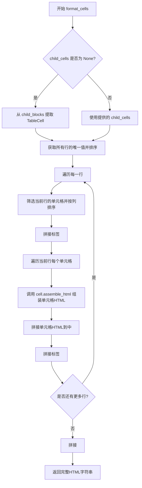
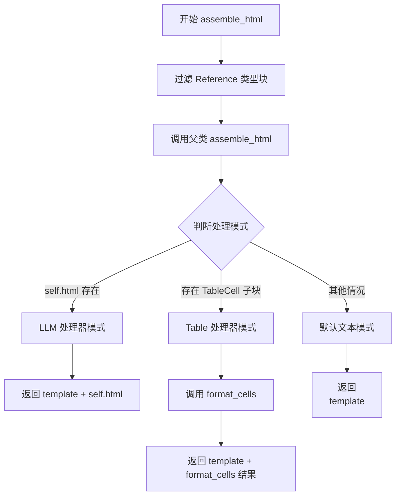

# `marker\marker\schema\blocks\basetable.py` 详细设计文档

该代码定义了一个名为 BaseTable 的基类，继承自 Block 类，用于将文档中的表格块转换为 HTML 表示。它支持两种处理模式：一种是通过 LLM 处理器直接使用预生成的 HTML，另一种是通过表格处理器动态解析和组装表格单元格生成 HTML 表格结构。

## 整体流程

```mermaid
graph TD
A[开始 assemble_html] --> B{self.html 是否存在?}
B -- 是 --> C[使用 LLM 处理器，返回 template + self.html]
B -- 否 --> D{child_blocks > 0 且包含 TableCell?}
D -- 是 --> E[使用表格处理器，调用 format_cells]
E --> F[返回 template + format_cells 结果]
D -- 否 --> G[使用默认文本处理]
G --> H[返回 <p>{template}</p>]
```

## 类结构

```
Block (基类)
└── BaseTable (表格块基类)
    ├── format_cells (静态方法)
    └── assemble_html (实例方法)
```

## 全局变量及字段


### `BaseTable.block_type`
    
表格块的类型标识

类型：`BlockTypes | None`
    


### `BaseTable.html`
    
预生成的 HTML 内容（用于 LLM 处理器）

类型：`str | None`
    
    

## 全局函数及方法


### `BaseTable.format_cells`

该方法是一个静态方法，用于将表格单元格（TableCell）列表组装成 HTML 表格字符串。它首先从子块中提取表格单元格（若未提供），然后按行和列排序后拼接为完整的 HTML 表格结构。

参数：

- `document`：`Any`，文档对象，用于通过块 ID 获取对应的 Block 对象
- `child_blocks`：`List[BlockOutput]`，子块列表，包含表格中的所有子块
- `block_config`：`dict | None`，块配置字典，用于控制表格渲染行为
- `child_cells`：`List[TableCell] | None`，表格单元格列表，若为 None 则自动从 child_blocks 中提取

返回值：`str`，生成的 HTML 表格字符串

#### 流程图



#### 带注释源码

```python
@staticmethod
def format_cells(
    document, child_blocks, block_config, child_cells: List[TableCell] | None = None
):
    # 如果未提供 child_cells，则从 child_blocks 中提取所有 TableCell 类型的块
    if child_cells is None:
        child_cells: List[TableCell] = [
            document.get_block(c.id)
            for c in child_blocks
            if c.id.block_type == BlockTypes.TableCell
        ]

    # 提取所有唯一的行 ID 并排序，确保行按正确顺序排列
    unique_rows = sorted(list(set([c.row_id for c in child_cells])))
    
    # 初始化 HTML 表格结构
    html_repr = "<table><tbody>"
    
    # 遍历每一行
    for row_id in unique_rows:
        # 筛选当前行的所有单元格，并按列 ID 排序
        row_cells = sorted(
            [c for c in child_cells if c.row_id == row_id], key=lambda x: x.col_id
        )
        html_repr += "<tr>"
        
        # 遍历当前行的每个单元格，调用 assemble_html 生成单元格内容
        for cell in row_cells:
            html_repr += cell.assemble_html(
                document, child_blocks, None, block_config
            )
        html_repr += "</tr>"
    
    # 闭合表格标签
    html_repr += "</tbody></table>"
    return html_repr
```


### `BaseTable.assemble_html`

该方法用于将表格块转换为完整的 HTML 表示字符串，通过过滤参考块、调用父类方法，并根据配置选择 LLM 处理、表格处理或默认文本模式来生成最终 HTML。

参数：

- `document`：`Any`，文档对象，用于获取块信息
- `child_blocks`：`List[BlockOutput]`，子块列表，包含所有子块输出
- `parent_structure`：`Any | None`，父结构信息，可选
- `block_config`：`dict | None`，块配置字典，可选

返回值：`str`，完整的 HTML 表示字符串

#### 流程图



#### 带注释源码

```python
def assemble_html(
    self,
    document,
    child_blocks: List[BlockOutput],
    parent_structure=None,
    block_config: dict | None = None,
):
    # 过滤出引用类型的子块，避免重复渲染
    child_ref_blocks = [
        block
        for block in child_blocks
        if block.id.block_type == BlockTypes.Reference
    ]
    # 调用父类的 assemble_html 方法获取基础模板
    template = super().assemble_html(
        document, child_ref_blocks, parent_structure, block_config
    )

    # 获取所有子块的类型集合
    child_block_types = set([c.id.block_type for c in child_blocks])
    
    # 判断处理模式
    if self.html:
        # LLM 处理器模式：当存在 HTML 属性时使用
        return template + self.html
    elif len(child_blocks) > 0 and BlockTypes.TableCell in child_block_types:
        # Table 处理器模式：当存在表格单元格子块时使用
        return template + self.format_cells(document, child_blocks, block_config)
    else:
        # 默认文本模式：处理普通的文本行和跨度
        return f"<p>{template}</p>"
```

## 关键组件


### BaseTable 类

BaseTable类继承自Block，用于表示和处理表格块。它包含两个类字段（block_type和html）和两个核心方法（format_cells和assemble_html），支持通过LLM处理器、表格处理器或默认文本三种策略来组装HTML表示。

### 张量索引与惰性加载机制

通过`document.get_block(c.id)`实现惰性加载，仅在需要时从文档中获取子块，避免一次性加载所有块到内存。

### 反量化支持

代码根据不同的block_type（Reference、TableCell等）进行分类处理，通过`child_block_types`集合和条件判断来识别和处理不同类型的子块，实现对多种块类型的反量化支持。

### 量化策略

代码实现了三种量化策略：
1. LLM处理器策略 - 当self.html存在时使用
2. 表格处理器策略 - 当存在TableCell类型的子块时使用  
3. 默认文本策略 - 其他情况使用

### format_cells 静态方法

该方法接收document、child_blocks、block_config和可选的child_cells参数，通过排序行ID和列ID将TableCell列表组装成HTML表格结构，返回完整的HTML字符串。

### assemble_html 实例方法

该方法是表格HTML组装的核心入口，根据html字段存在性、子块数量和子块类型来决定使用哪种处理策略，最终返回完整HTML内容。

### 表格结构构建

通过`unique_rows`去重排序行ID，然后按行ID分组并按col_id排序单元格，依次组装tr和td标签，构建完整的表格HTML结构。


## 问题及建议


### 已知问题

-   **类型注解语法错误**：在 `format_cells` 方法内部使用类型注解进行变量赋值 (`child_cells: List[TableCell] = [...]`)，这是不规范的用法，应该直接在 if 分支中赋值而不是使用类型注解
-   **字符串拼接效率低**：使用 `+=` 进行 HTML 字符串拼接，在循环中会产生大量中间字符串对象，影响性能，应使用列表 + join 或 StringIO
-   **魔法字符串硬编码**：HTML 标签（`<table>`, `<tbody>`, `<tr>` 等）直接硬编码在代码中，缺乏可配置性和可维护性
-   **异常处理缺失**：对 `document.get_block()` 可能返回 None、`cell.assemble_html()` 可能抛出异常等边界情况没有处理
-   **逻辑分支问题**：当 `self.html` 存在时直接返回，忽略了子块的渲染，可能导致数据丢失
-   **重复计算**：`child_block_types` 的 set 计算和 `unique_rows` 的排序在每次调用都会重新执行
-   **类型注解不完整**：`parent_structure` 参数缺少类型注解，`assemble_html` 方法缺少返回类型注解

### 优化建议

-   **使用列表 join 优化字符串构建**：将 HTML 片段存入列表，最后用 `''.join()` 拼接，避免中间字符串对象
-   **提取魔法字符串为常量**：将 HTML 标签定义为类常量或配置项，提高可维护性
-   **增加异常处理**：添加 try-except 块处理可能的异常情况，或对 None 值进行防御性检查
-   **优化逻辑分支**：重新审视 `self.html` 存在时的处理逻辑，考虑是否需要合并子块渲染结果
-   **补充类型注解**：为 `parent_structure` 参数和 `assemble_html` 方法添加完整的类型注解
-   **考虑缓存**：对于重复调用的场景，可以考虑缓存 `unique_rows` 和排序结果

## 其它


### 设计目标与约束

该代码的核心目标是实现表格块的HTML渲染功能，支持两种处理模式：基于LLM处理的HTML输出和基于文档结构解析的表格单元格格式化。设计约束包括：1) 必须继承自Block基类；2) 需要处理三种情况：LLM处理器输出、表格处理器、默认文本；3) 表格单元格去重和排序逻辑必须保持一致性。

### 错误处理与异常设计

代码中的潜在异常包括：1) child_blocks为None或空列表时的处理；2) document.get_block(c.id)获取不到块时的异常；3) TableCell对象缺少row_id或col_id属性时的处理；4) block_config为None时的默认值处理。当前实现通过if条件判断进行处理，建议增加更明确的异常抛出和日志记录。

### 数据流与状态机

数据流：输入document对象、child_blocks列表、block_config配置 → 判断处理模式 → 根据模式调用format_cells或使用self.html或返回默认段落。状态机包含三种状态：LLM_PROCESSOR状态（self.html存在）、TABLE_PROCESSOR状态（存在TableCell子块）、DEFAULT状态（其他情况）。

### 外部依赖与接口契约

主要依赖：1) marker.schema.BlockTypes枚举；2) marker.schema.blocks.Block基类；3) marker.schema.blocks.BlockOutput；4) marker.schema.blocks.tablecell.TableCell。接口契约：assemble_html方法接收document、child_blocks、parent_structure、block_config四个参数，返回HTML字符串；format_cells为静态方法，接收document、child_blocks、block_config、child_cells参数。

### 性能考虑

性能热点：1) sorted(list(set(...)))双重排序操作；2) 每次调用format_cells都重新遍历child_blocks；3) 字符串拼接效率较低。建议优化：使用列表推导式替代循环中的字符串拼接，考虑使用lxml或BeautifulSoup构建DOM，缓存唯一行列表避免重复计算。

### 安全性考虑

HTML注入风险：直接拼接cell.assemble_html返回的HTML字符串，未进行XSS过滤。改进建议：对模板和单元格HTML输出进行HTML转义处理，验证输出HTML的合法性。

### 版本兼容性

代码使用了Python 3.10+的联合类型语法（|），需要Python 3.10及以上版本。marker库版本兼容性需要确认，建议在文档中标注依赖的marker库版本范围。

### 配置管理

block_config参数为dict类型，允许传入自定义配置。当前实现未使用block_config，建议明确block_config的可用配置选项，如表格样式、是否包含表头等配置项。

### 测试策略

建议测试用例：1) 空child_cells列表；2) 单一单元格；3) 多行多列完整表格；4) 不规则表格（单元格缺失）；5) LLM处理器模式（self.html有值）；6) 无效的block_type情况；7) document.get_block返回None的情况。

### 监控与日志

建议添加日志点：1) 进入assemble_html方法时；2) 选择不同处理模式时；3) format_cells处理行数和单元格数；4) 异常捕获时记录堆栈信息。

### 部署相关

该代码为marker库的内置模块，部署依赖于marker整体项目的部署流程。无需独立部署配置，但需要确保marker库的版本正确安装。


    