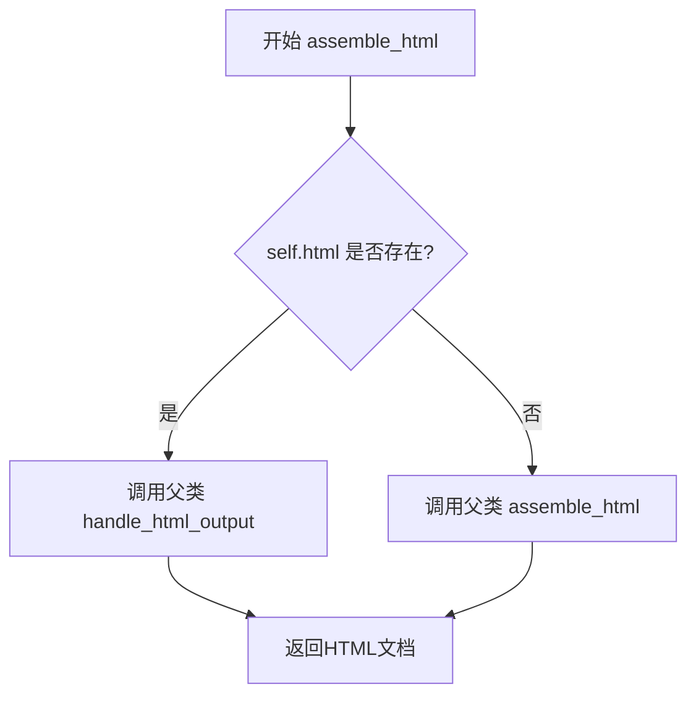

# `marker\marker\schema\blocks\caption.py` 详细设计文档

这是一个Caption类，用于表示图片或表格的文本标题（caption），继承自Block基类，处理HTML组装逻辑，支持在图片或表格上方或下方的描述文本渲染。

## 整体流程



## 类结构

```
Block (抽象基类)
└── Caption (图片/表格标题类)
```

## 全局变量及字段


### `Caption.block_type`
    
块类型标识，固定为BlockTypes.Caption

类型：`BlockTypes`
    


### `Caption.block_description`
    
块的描述信息，说明用于图片或表格的文本描述

类型：`str`
    


### `Caption.replace_output_newlines`
    
是否替换输出中的换行符，设为True

类型：`bool`
    


### `Caption.html`
    
可选的HTML内容，如果存在则优先使用

类型：`str | None`
    
    

## 全局函数及方法


### `Caption.assemble_html`

该方法用于生成Caption块的HTML输出。如果Caption块已有html属性，则调用父类的handle_html_output方法处理；否则调用父类的assemble_html方法生成HTML。

参数：

- `self`：`Caption`，Caption类的实例本身
- `document`：类型未知，文档对象，用于构建输出HTML
- `child_blocks`：类型未知，子块列表，包含Caption的子元素
- `parent_structure`：类型未知，父结构信息，描述Caption在文档中的位置
- `block_config`：类型未知，块配置字典，包含渲染相关的配置选项

返回值：类型未知，返回生成的HTML字符串（由父类方法返回）

#### 流程图

```mermaid
flowchart TD
    A[开始 assemble_html] --> B{self.html 是否存在?}
    B -->|是| C[调用 super().handle_html_output]
    B -->|否| D[调用 super().assemble_html]
    C --> E[返回HTML字符串]
    D --> E
```

#### 带注释源码

```python
def assemble_html(self, document, child_blocks, parent_structure, block_config):
    """
    生成Caption块的HTML输出
    
    参数:
        document: 文档对象，用于构建输出HTML
        child_blocks: 子块列表，包含Caption的子元素
        parent_structure: 父结构信息，描述Caption在文档中的位置
        block_config: 块配置字典，包含渲染相关的配置选项
    
    返回:
        生成的HTML字符串
    """
    # 检查Caption是否已有预生成的html属性
    if self.html:
        # 如果html已存在，调用父类的handle_html_output方法处理
        return super().handle_html_output(
            document, child_blocks, parent_structure, block_config
        )

    # 如果html不存在，调用父类的assemble_html方法生成HTML
    return super().assemble_html(
        document, child_blocks, parent_structure, block_config
    )
```


### `Caption.assemble_html`

该方法是 `Caption` 类的 HTML 组装方法，用于生成图片或表格的说明文字（caption）的 HTML 输出。如果当前 Caption 块已存在预生成的 HTML 内容，则调用父类的 `handle_html_output` 方法；否则调用父类的 `assemble_html` 方法进行默认组装。

参数：

- `self`：`Caption` 类型，当前 Caption 块实例本身
- `document`：`Document` 类型，用于存储输出 HTML 内容的文档对象
- `child_blocks`：`list[Block]` 类型，当前块的子块列表
- `parent_structure`：`dict` 类型，父结构的层次信息
- `block_config`：`BlockConfig` 类型，块配置选项

返回值：`str` 类型，返回生成的 HTML 字符串

#### 流程图

```mermaid
flowchart TD
    A[开始 assemble_html] --> B{self.html 是否存在?}
    B -->|是| C[调用 super().handle_html_output]
    B -->|否| D[调用 super().assemble_html]
    C --> E[返回 HTML 字符串]
    D --> E
```

#### 带注释源码

```python
def assemble_html(self, document, child_blocks, parent_structure, block_config):
    # 检查当前 Caption 块是否已有预生成的 HTML 内容
    if self.html:
        # 如果存在预生成 HTML，调用父类的 handle_html_output 方法处理
        return super().handle_html_output(
            document, child_blocks, parent_structure, block_config
        )

    # 如果没有预生成 HTML，则调用父类的默认 assemble_html 方法
    return super().assemble_html(
        document, child_blocks, parent_structure, block_config
    )
```


### Block.handle_html_output

`handle_html_output` 是 `Block` 基类中负责处理 HTML 输出渲染的核心方法。`Caption` 类通过重写 `assemble_html` 方法来调用此方法，根据是否存在自定义 HTML 内容决定是否使用默认的 HTML 输出处理逻辑。

注意：由于 `handle_html_output` 方法定义在父类 `Block` 中，代码中仅展示其在 `Caption.assemble_html` 方法中的调用方式。

参数：

- `document`：`object`，当前文档对象，包含文档的全局上下文和配置信息
- `child_blocks`：`list[Block]`，当前块的子块列表，用于处理嵌套结构
- `parent_structure`：`dict`，父级结构信息，包含父块的元数据和层级关系
- `block_config`：`dict`，块配置选项，包含渲染相关的参数和设置

返回值：`str`，处理后的 HTML 字符串表示

#### 流程图

```mermaid
flowchart TD
    A[Caption.assemble_html 被调用] --> B{self.html 是否存在?}
    B -->|是| C[调用 super().handle_html_output]
    B -->|否| D[调用 super().assemble_html]
    C --> E[返回默认 HTML 输出结果]
    D --> F[返回组装的 HTML 结果]
    E --> G[流程结束]
    F --> G
```

#### 带注释源码

```python
def assemble_html(self, document, child_blocks, parent_structure, block_config):
    """
    组装 HTML 输出的方法
    
    参数:
        document: 文档对象，包含全局上下文
        child_blocks: 子块列表
        parent_structure: 父级结构信息
        block_config: 块配置选项
    
    返回:
        处理后的 HTML 字符串
    """
    # 如果存在自定义 HTML 内容，则调用父类的 handle_html_output 方法
    if self.html:
        return super().handle_html_output(
            document, child_blocks, parent_structure, block_config
        )

    # 否则使用默认的 assemble_html 方法进行组装
    return super().assemble_html(
        document, child_blocks, parent_structure, block_config
    )
```


## 关键组件


### BlockTypes.Caption（块类型枚举）

标识该Block为Caption（标题/说明）类型，用于区分不同的块种类。

### replace_output_newlines（换行符替换配置）

布尔类型标志，控制输出时是否替换换行符，默认为True。

### html属性（HTML内容存储）

支持直接传入预生成的HTML内容，为None时表示需要通过assemble_html动态生成。

### assemble_html方法（HTML组装逻辑）

核心方法，根据html属性是否存在选择不同的父类方法调用路径，实现Caption块的HTML组装。


## 问题及建议


### 已知问题

-   **逻辑冗余与不清晰**：`assemble_html` 方法中，无论 `self.html` 是否存在，最终都会调用父类的对应方法。如果 `self.html` 存在时调用 `handle_html_output`，不存在时调用 `assemble_html`，这种设计逻辑不清晰，且两者的功能差异未体现。
-   **未使用的类字段**：`replace_output_newlines` 类字段被定义但在代码中未被使用，可能存在功能未实现或遗留代码。
-   **参数类型注解缺失**：方法参数 `document`、`child_blocks`、`parent_structure`、`block_config` 缺少类型注解，影响代码可读性和 IDE 提示。
-   **空值处理不明确**：当 `self.html` 为 `None` 时，虽然逻辑上会调用父类 `assemble_html`，但代码可读性较差，应显式处理空值情况。
-   **方法覆盖目的不明确**：`assemble_html` 方法重写了父类方法，但内部逻辑仅是对父类的调用，功能覆盖意义不大，可能造成过度设计。

### 优化建议

-   **明确方法逻辑**：如果该类主要用于处理 `html` 字段的特殊情况，应在方法中添加明确的业务逻辑处理，而不是简单调用父类方法。
-   **添加类型注解**：为方法参数添加类型注解，如 `document: Document`, `child_blocks: List[Block]`, `parent_structure: Any`, `block_config: Any`。
-   **删除或实现未使用字段**：如果 `replace_output_newlines` 暂未使用，可删除该字段或实现相关功能。
-   **简化代码结构**：如果当前方法仅为透传调用，可考虑移除该方法重写，直接使用父类实现，或在文档中明确说明重写目的。
-   **增强文档注释**：为类和方法添加 docstring，说明该类的用途和方法的行为逻辑。

## 其它


### 设计目标与约束

该类的主要设计目标是实现图片和表格的文本Caption（标题）块的HTML组装功能，支持可选的HTML内容和自动换行处理。设计约束包括：只用于描述图片或表格的文本，必须直接位于图片或表格的上方或下方，必须继承自Block基类。

### 错误处理与异常设计

当HTML内容存在时，调用父类的handle_html_output方法；否则调用父类的assemble_html方法。所有异常由父类Block处理，不在此类中捕获特定异常。如果html属性为None或空字符串，都会回退到父类的默认实现。

### 数据流与数据结构

数据输入流程：外部传入document（文档对象）、child_blocks（子块列表）、parent_structure（父结构信息）、block_config（块配置）。处理流程：首先检查self.html是否存在，若存在则使用handle_html_output，否则使用assemble_html。输出结果为组装好的HTML字符串。

### 外部依赖与接口契约

依赖项：marker.schema.BlockTypes（枚举类）、marker.schema.blocks.Block（基类）。接口契约：assemble_html方法必须返回HTML字符串，参数必须与父类Block的assemble_html方法签名一致，返回值类型与父类相同。

### 性能考虑

由于只是简单的条件判断和调用父类方法，性能开销极低。replace_output_newlines为True会在输出时处理换行符，可能略微影响性能但提供了更好的格式化输出。

### 安全性考虑

html属性为可选类型（str | None），可以防止空值问题。但外部传入的html内容未经过滤，可能存在XSS风险，建议在使用时添加HTML转义处理。

### 测试策略

应测试的场景包括：html为None时的行为、html为空字符串时的行为、html有值时的行为、继承的BlockTypes是否正确、block_description是否正确、replace_output_newlines的默认值。

### 版本兼容性

该代码使用了Python 3.10+的类型注解语法（str | None），需要Python 3.10及以上版本。marker.schema模块的具体版本要求需查阅项目根目录的requirements.txt或pyproject.toml。

    