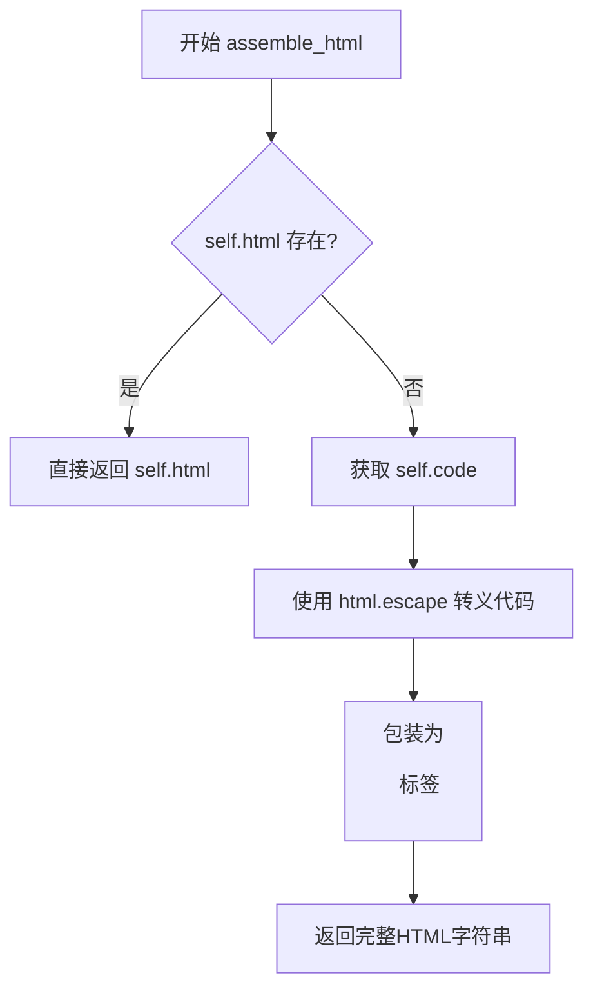
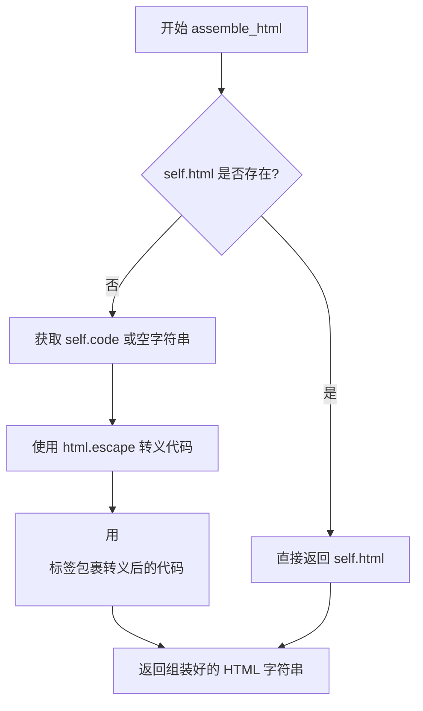

# `marker\marker\schema\blocks\code.py` 详细设计文档

这是一个用于表示和渲染代码块的类，继承自Block基类，负责将代码内容转换为HTML格式的pre标签，支持直接返回预生成的HTML或动态生成代码块的HTML表示。

## 整体流程



## 类结构

```
Block (抽象基类)
└── Code (代码块实现类)
```

## 全局变量及字段


### `Code.block_type`
    
Block type identifier, defaults to BlockTypes.Code

类型：`BlockTypes`
    


### `Code.code`
    
The programming code content

类型：`str | None`
    


### `Code.html`
    
Pre-rendered HTML representation of the code

类型：`str | None`
    


### `Code.block_description`
    
A programming code block.

类型：`str`
    
    

## 全局函数及方法


### `Code.assemble_html`

该方法用于将代码块转换为HTML格式。如果实例已经包含HTML表示，则直接返回；否则将代码内容进行HTML转义并用`<pre>`标签包裹后返回。

参数：

- `document`：`Any`，文档对象，包含文档上下文信息
- `child_blocks`：`list[Block]`，子块列表，用于处理嵌套的块结构
- `parent_structure`：`dict`，父结构信息，包含块的层级关系和样式配置
- `block_config`：`dict`，块配置，包含渲染相关的配置选项

返回值：`str`，返回HTML格式的代码块字符串

#### 流程图



#### 带注释源码

```python
def assemble_html(self, document, child_blocks, parent_structure, block_config):
    """
    将代码块组装成HTML格式。
    
    参数:
        document: 文档对象，提供文档上下文
        child_blocks: 子块列表，处理嵌套块结构
        parent_structure: 父结构信息，包含层级和样式
        block_config: 块配置，渲染相关选项
    
    返回:
        HTML格式的代码块字符串
    """
    # 检查是否已有缓存的HTML表示
    if self.html:
        return self.html
    
    # 获取代码内容，默认为空字符串
    code = self.code or ""
    
    # 使用HTML转义防止XSS攻击，并用<pre>标签包裹
    return f"<pre>{html.escape(code)}</pre>"
```

## 关键组件


### 代码块类 (Code Class)

用于表示文档中的代码块，支持直接存储HTML或通过代码文本自动生成HTML预览。

### 核心方法 (assemble_html)

如果已存在预生成的HTML则直接返回，否则将代码内容转义后包装在pre标签中返回。

### 类字段 (Class Fields)

- `block_type`: BlockTypes类型，标识该块为代码块类型
- `code`: str | None类型，存储原始代码文本
- `html`: str | None类型，存储预生成的HTML片段
- `block_description`: str类型，描述该块为编程代码块


## 问题及建议


### 已知问题

- **属性定义冗余**：`block_description` 在类中作为实例属性定义，但所有实例都使用相同的默认值 `"A programming code block."`，应改为类属性以减少内存开销
- **缺少代码语言支持**：代码块没有 `language` 或类似字段来标识编程语言，无法支持语法高亮功能
- **HTML 生成功能不完整**：生成的 `<pre>` 标签缺少语言标识的 `class` 属性，无法与前端语法高亮库集成；没有处理制表符转换为空格等常见的代码格式化需求
- **输入验证缺失**：`code` 和 `html` 均为可选字段，但未验证两者都为空时的处理逻辑，会生成无意义的空 `<pre>` 标签
- **未使用的参数**：`assemble_html` 方法接收了 `document`、`child_blocks`、`parent_structure` 和 `block_config` 参数但未使用，可能导致调用方传递的参数被忽略
- **缺少文档注释**：方法缺少 docstring，API 使用者无法了解方法的具体行为和预期输入输出

### 优化建议

- 将 `block_description` 改为类属性：`block_description: str = "A programming code block."`
- 添加 `language: str | None = None` 字段以支持代码语言标识
- 在生成的 HTML 中添加语言类名，如 `<pre class="language-{language}">`
- 添加参数校验逻辑，当 `code` 和 `html` 均为空时抛出明确异常或返回占位符
- 清理未使用的参数，或在文档中说明这些参数是为未来扩展预留
- 为 `assemble_html` 方法添加详细的 docstring 说明

## 其它


### 设计目标与约束

本类的设计目标是提供一种将代码块转换为HTML表示的机制，同时确保安全性（防止XSS攻击）。设计约束包括：必须继承自Block基类、必须实现assemble_html方法、code和html字段至少有一个非空。

### 错误处理与异常设计

当前实现未包含显式的错误处理逻辑。若self.code和self.html均为None，会返回空<pre>标签对。对于无效的输入类型（如code字段传入非字符串类型），Python会在字符串操作时抛出TypeError。建议在assemble_html方法中添加类型检查和默认值处理。

### 外部依赖与接口契约

本类依赖以下外部组件：1) html模块（Python标准库）用于HTML转义；2) marker.schema.BlockTypes枚举类；3) marker.schema.blocks.Block基类。接口契约要求：assemble_html方法必须接收document、child_blocks、parent_structure、block_config四个参数，返回HTML字符串。

### 数据流与状态机

数据流：外部调用者创建Code实例并设置code或html字段 → 调用assemble_html方法 → 方法检查html字段是否存在 → 存在则直接返回，否则将code字段转义后包装为<pre>标签返回。状态机较为简单，主要状态为"有预生成HTML"和"需要动态生成HTML"。

### 安全性考虑

代码实现了XSS防护：通过html.escape()对code内容进行转义，防止恶意脚本注入。假设所有输入的code都是用户可控的原始代码，此防护措施是必要的。html字段被假设为已预处理或可信内容，直接返回不转义。

### 性能考虑

当前实现性能开销极低，主要操作是字符串格式化和一次html.escape调用。潜在优化点：对于大量重复调用场景，可考虑缓存HTML结果；使用f-string替代字符串拼接提升少量性能。

### 可扩展性建议

1. 可添加语言类型字段支持语法高亮；2. 可添加行号显示功能；3. 可支持代码折叠功能；4. 可添加复制按钮等交互功能。

### 配置项说明

block_config参数当前未被使用，但根据方法签名设计，该参数用于传递块级配置选项（如是否显示行号、是否启用语法高亮等）。建议后续实现利用此参数扩展功能。

### 使用示例

```python
# 方式1：使用code字段
code_block = Code(code="print('Hello World')")
html_output = code_block.assemble_html(None, [], {}, {})

# 方式2：使用预生成的html字段
code_block = Code(html="<pre><code>print('Hello World')</code></pre>")
html_output = code_block.assemble_html(None, [], {}, {})
```

### 版本与兼容性信息

代码基于Python 3.10+的联合类型语法（str | None），需要运行在Python 3.10及以上版本。marker库版本需与schema模块兼容。

    