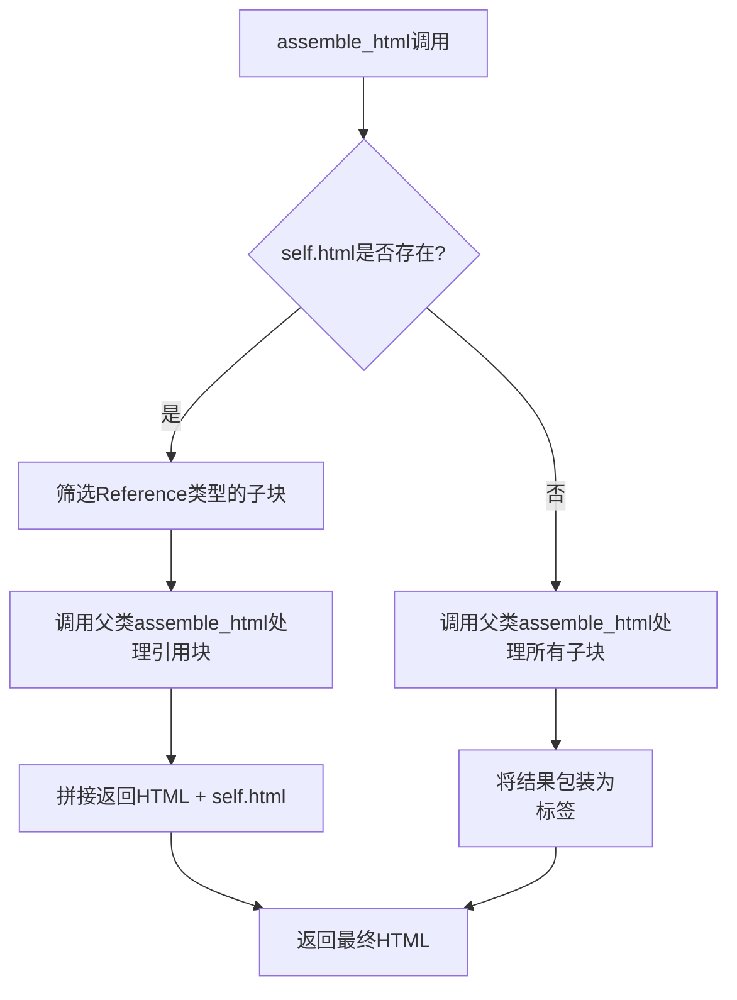

# `marker\marker\schema\blocks\complexregion.py` 详细设计文档

ComplexRegion类是一个文档块处理组件，继承自Block基类，用于表示和组装包含多种不同类型块和图像混合的复杂区域。当文档区域难以归类为单一块类型时使用此类，并通过assemble_html方法将子块组装为HTML内容。

## 整体流程



## 类结构

```
Block (基类)
└── ComplexRegion (继承自Block)
```

## 全局变量及字段


### `BlockTypes`
    
从marker.schema导入的块类型枚举

类型：`enum`
    


### `Block`
    
从marker.schema.blocks导入的基类Block

类型：`class`
    


### `ComplexRegion.block_type`
    
块类型标识，值为BlockTypes.ComplexRegion

类型：`BlockTypes`
    


### `ComplexRegion.html`
    
可选的HTML字符串属性

类型：`str | None`
    


### `ComplexRegion.block_description`
    
块的描述说明

类型：`str`
    
    

## 全局函数及方法


### `ComplexRegion.assemble_html`

该方法用于组装ComplexRegion块的HTML内容。如果当前块已存在预定义的HTML，则合并引用子块的HTML；否则将父类生成的HTML包装在`<p>`标签中返回。

参数：

- `self`：`ComplexRegion`，ComplexRegion类的实例，隐式参数，表示当前块对象本身
- `document`：`Any`，文档对象，包含文档的上下文信息，用于传递给父类方法
- `child_blocks`：`List[Block]`，子块列表，包含当前复杂区域的所有子块
- `parent_structure`：`Any`，父结构信息，包含父块的层级和结构数据
- `block_config`：`Dict[str, Any]`，块配置字典，包含生成HTML所需的配置选项

返回值：`str`，返回组装后的HTML字符串

#### 流程图

```mermaid
flowchart TD
    A[开始 assemble_html] --> B{self.html 是否存在?}
    B -->|是| C[过滤 child_blocks 中 BlockTypes.Reference 类型的块]
    B -->|否| D[直接使用 child_blocks]
    C --> E[调用 super().assemble_html 获取基础 HTML]
    D --> E
    E --> F{self.html 存在?}
    F -->|是| G[返回 基础HTML + self.html]
    F -->|否| H[返回 <p>基础HTML</p>]
    G --> I[结束]
    H --> I
```

#### 带注释源码

```python
def assemble_html(self, document, child_blocks, parent_structure, block_config):
    """
    组装ComplexRegion块的HTML内容
    
    参数:
        document: 文档对象，包含文档上下文
        child_blocks: 子块列表
        parent_structure: 父结构信息
        block_config: 块配置字典
    
    返回:
        组装后的HTML字符串
    """
    # 检查当前块是否已有预定义的HTML内容
    if self.html:
        # 从子块中过滤出引用类型(Reference)的块
        child_ref_blocks = [
            block
            for block in child_blocks
            if block.id.block_type == BlockTypes.Reference
        ]
        # 调用父类方法生成引用块的HTML
        html = super().assemble_html(
            document, child_ref_blocks, parent_structure, block_config
        )
        # 合并父类生成的HTML与当前块的HTML并返回
        return html + self.html
    else:
        # 如果没有预定义HTML，调用父类方法获取模板
        template = super().assemble_html(
            document, child_blocks, parent_structure, block_config
        )
        # 将模板内容包装在<p>标签中返回
        return f"<p>{template}</p>"
```


### `ComplexRegion.assemble_html`

该方法是 `Block` 类的父类方法，供子类 `ComplexRegion` 调用，用于将块内容组装成 HTML 格式。根据当前块是否有预设 HTML 属性，它会调用父类方法或添加额外的 HTML 包装。

参数：

- `document`：`Any`，文档对象，包含文档的上下文信息
- `child_blocks`：`List[Block]`，子块列表，包含当前块的所有子块
- `parent_structure`：`Any`，父结构信息，表示当前块的父级结构
- `block_config`：`Any`，块配置对象，包含块的配置选项

返回值：`str`，返回组装后的 HTML 字符串

#### 流程图

```mermaid
flowchart TD
    A[开始 assemble_html] --> B{self.html 是否存在?}
    B -->|是| C[筛选 child_blocks 中的 Reference 类型块]
    B -->|否| D[使用全部 child_blocks]
    C --> E[调用 super().assemble_html with child_ref_blocks]
    D --> F[调用 super().assemble_html with child_blocks]
    E --> G[返回 html + self.html]
    F --> H[返回 <p>{template}</p>]
    G --> I[结束]
    H --> I
```

#### 带注释源码

```python
def assemble_html(self, document, child_blocks, parent_structure, block_config):
    # 检查当前块是否已有预设的 HTML 内容
    if self.html:
        # 筛选出子块中类型为 Reference 的块
        child_ref_blocks = [
            block
            for block in child_blocks
            if block.id.block_type == BlockTypes.Reference
        ]
        # 调用父类的 assemble_html 方法处理 Reference 类型的子块
        html = super().assemble_html(
            document, child_ref_blocks, parent_structure, block_config
        )
        # 返回父类结果加上当前块的 HTML 内容
        return html + self.html
    else:
        # 调用父类的 assemble_html 方法处理所有子块
        template = super().assemble_html(
            document, child_blocks, parent_structure, block_config
        )
        # 将父类返回的结果用 <p> 标签包裹后返回
        return f"<p>{template}</p>"
```


## 关键组件


### ComplexRegion 类

继承自 Block 的复杂区域块类，用于表示包含多种不同类型块和图像的复杂区域。当难以将区域分类为单一块类型时选择此块。

### BlockTypes 枚举

用于标识不同块类型的枚举类型，这里使用 BlockTypes.ComplexRegion 来标识复杂区域块。

### block_type 字段

类型为 BlockTypes，表示块的类型标识，固定为 ComplexRegion 类型。

### html 字段

类型为 str | None，可选的 HTML 内容，用于存储预定义的 HTML 片段。

### block_description 字段

类型为 str，描述该块的用途，说明这是一个由多种不同类型块和图像组成的复杂区域。

### assemble_html 方法

负责将子块组装为 HTML 输出的方法。通过调用父类的 assemble_html 方法并根据是否存在 html 属性采用不同的处理策略。

### Reference 块过滤逻辑

对子块进行过滤，筛选出类型为 BlockTypes.Reference 的块，用于特殊的 HTML 组装处理。


## 问题及建议


### 已知问题

-   **硬编码 HTML 标签**: `else` 分支中直接硬编码 `<p>` 标签，违反了开闭原则，应该通过配置或参数化方式处理
-   **类型注解缺失**: 方法参数 `document`、`child_blocks`、`parent_structure`、`block_config` 缺少类型注解，影响代码可读性和类型安全
-   **魔法字符串/类型**: `BlockTypes.Reference` 被硬编码在列表推导式中，缺少常量提取
-   **代码重复**: `super().assemble_html()` 在 `if-else` 两条分支中都被调用，参数相同但逻辑未复用
-   **空值判断不严谨**: 仅使用 `if self.html` 判断，未处理空字符串 `""` 的边界情况
-   **缺少文档字符串**: 类和方法均无 docstring，无法生成自动文档
-   **异常处理缺失**: `assemble_html` 方法没有异常处理机制，可能导致调用方崩溃

### 优化建议

-   为所有方法参数添加类型注解，提升代码可维护性
-   将 `<p>` 标签封装为可配置的 `block_config` 参数或类常量
-   将 `BlockTypes.Reference` 提取为类级别常量或配置
-   重构 `assemble_html` 方法，将 `super().assemble_html` 调用提取到 if-else 之前，仅在最后处理 html 拼接逻辑
-   使用 `if self.html is not None and self.html != ""` 或 `if self.html` 配合 `strip()` 处理空字符串边界
-   为类和方法添加详细的 docstring 文档
-   添加 try-except 异常处理，捕获可能的异常并提供有意义的错误信息

## 其它


### 设计目标与约束

- **设计目标**：提供一种灵活的区域处理机制，能够处理包含多种类型块和图像的复杂文档区域，当难以将区域归类为单一块类型时使用此类
- **设计约束**：必须继承自Block基类，block_type必须为BlockTypes.ComplexRegion，仅在难以分类为单一块类型时使用

### 错误处理与异常设计

- **参数校验**：assemble_html方法参数（document, child_blocks, parent_structure, block_config）不应为None，否则可能导致调用父类方法时抛出AttributeError
- **类型检查**：child_blocks中的block对象应包含id属性且id.block_type可访问，否则在过滤Reference类型块时会抛出AttributeError
- **异常传播**：父类Block.assemble_html()可能抛出的异常应向上传播，由调用方处理

### 数据流与状态机

- **输入数据流**：document（文档对象）、child_blocks（子块列表）、parent_structure（父结构）、block_config（块配置）
- **处理逻辑**：根据self.html是否存在分为两条路径 - 有html时过滤Reference类型块并拼接，无html时包装为`<p>`标签
- **输出数据流**：返回HTML字符串

### 外部依赖与接口契约

- **依赖模块**：marker.schema.BlockTypes（块类型枚举）、marker.schema.blocks.Block（基类）
- **接口契约**：assemble_html方法签名必须与父类一致，参数为(document, child_blocks, parent_structure, block_config)，返回字符串类型的HTML
- **父类方法依赖**：依赖Block基类的assemble_html方法实现

### 性能考虑

- **列表推导式**：使用列表推导式过滤child_ref_blocks，时间复杂度O(n)
- **字符串拼接**：使用+进行字符串拼接，在大量调用时可能产生性能问题，建议使用列表 join 方式优化

### 安全性考虑

- **HTML注入风险**：直接拼接self.html和template到返回字符串中，如果html内容来自用户输入，存在XSS风险，应进行HTML转义处理
- **配置验证**：block_config参数应进行验证，防止恶意配置导致安全问题

### 使用示例

```python
# 创建ComplexRegion实例
complex_region = ComplexRegion(
    id=BlockId(...),
    html="<span>Additional content</span>"
)

# 调用assemble_html方法
result = complex_region.assemble_html(
    document=doc,
    child_blocks=[ref_block1, ref_block2, text_block],
    parent_structure=parent,
    block_config=config
)
```

### 配置参数说明

- **html**：可选参数，自定义HTML内容块，当存在时与子 Reference 块组装；为 None 时使用模板包装所有子块
- **block_description**：块描述信息，说明适用场景（难以归类为单一类型的混合区域）

### 版本历史和变更记录

- **初始版本**：实现基本的复杂区域HTML组装功能
- **设计考量**：支持两种模式 - 自定义HTML模式和模板包装模式


    