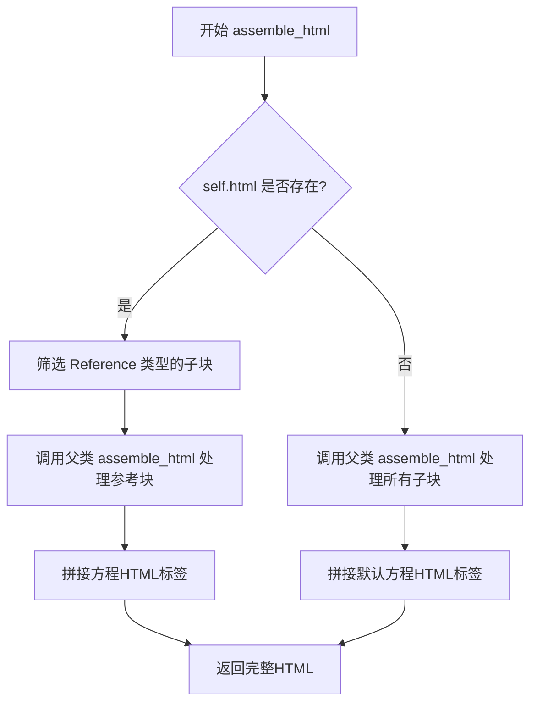
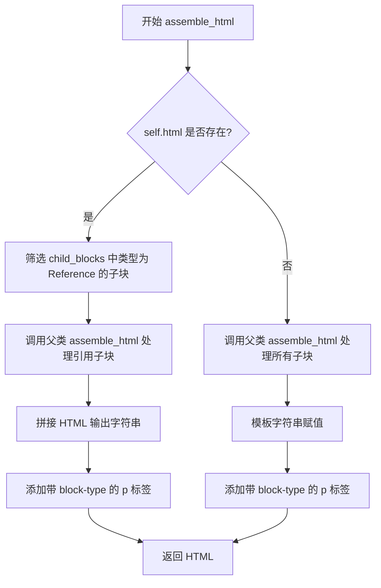
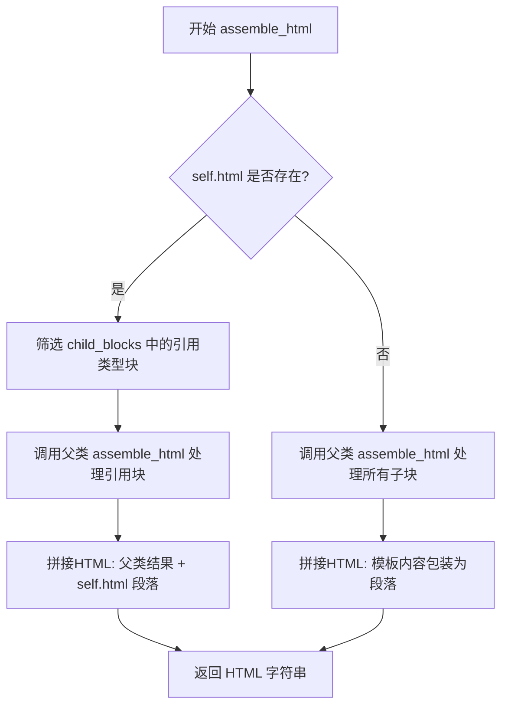
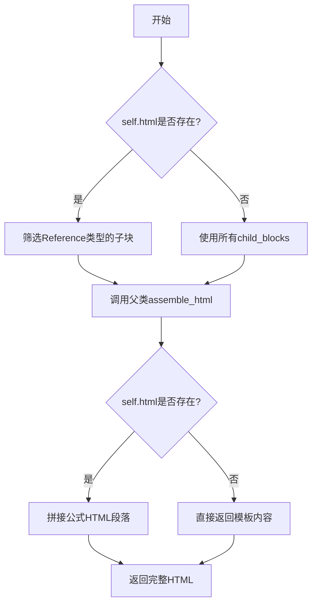
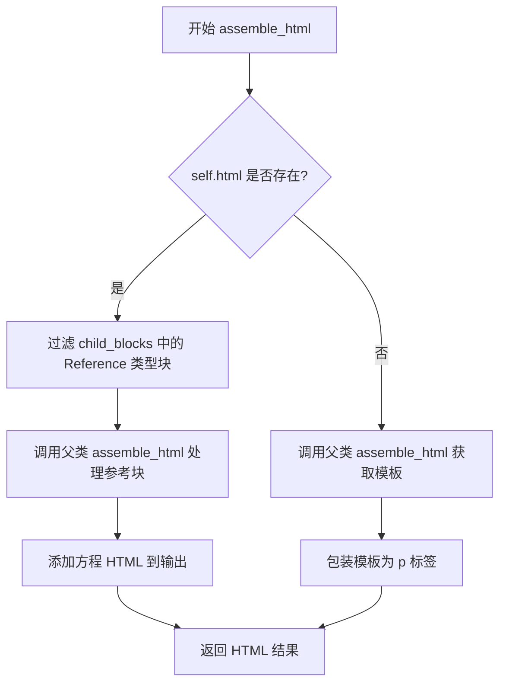

# `marker\marker\schema\blocks\equation.py` 详细设计文档

这是一个用于处理数学方程块的类，继承自Block基类，负责将数学公式转换为HTML表示，支持直接HTML内容和通过子块组装两种方式生成带block-type属性的段落元素。

## 整体流程



## 类结构

```
Block (基类)
└── Equation (方程块类)
```

## 全局变量及字段


### `BlockTypes`
    
从marker.schema导入的块类型枚举

类型：`enum`
    


### `Block`
    
从marker.schema.blocks导入的基类

类型：`class`
    


### `Equation.block_type`
    
方程块的类型标识，值为BlockTypes.Equation

类型：`BlockTypes`
    


### `Equation.html`
    
可选的HTML字符串，用于存储直接定义的方程HTML内容

类型：`str | None`
    


### `Equation.block_description`
    
方程块的描述信息，默认为'A block math equation.'

类型：`str`
    
    

## 全局函数及方法


### `Equation.assemble_html`

该方法用于将数学方程块（Equation）组装成HTML格式。如果方程块已有预定义的HTML内容，则仅处理引用类型的子块；否则处理所有子块。最终都将结果包装在带有块类型属性的 `<p>` 标签中返回。

参数：

- `document`：`Any`，文档对象，提供上下文信息
- `child_blocks`：`List[Block]`，包含该方程块的所有子块列表
- `parent_structure`：`Any | None`，可选参数，父级结构信息，默认为 None
- `block_config`：`Any | None`，可选参数，块配置对象，默认为 None

返回值：`str`，组装完成的HTML字符串

#### 流程图



#### 带注释源码

```python
def assemble_html(
    self, document, child_blocks, parent_structure=None, block_config=None
):
    """
    将数学方程块组装为HTML格式
    
    参数:
        document: 文档对象，提供上下文
        child_blocks: 所有子块列表
        parent_structure: 父级结构（可选）
        block_config: 块配置（可选）
    
    返回:
        拼接好的HTML字符串
    """
    # 检查方程块是否有预定义的HTML内容
    if self.html:
        # 筛选出类型为Reference的子块
        child_ref_blocks = [
            block
            for block in child_blocks
            if block.id.block_type == BlockTypes.Reference
        ]
        # 调用父类方法处理引用子块，获取基础HTML
        html_out = super().assemble_html(
            document, child_ref_blocks, parent_structure, block_config
        )
        # 拼接预定义的方程HTML内容，外层用p标签包裹并标记block-type
        html_out += f"""<p block-type='{self.block_type}'>{self.html}</p>"""
        return html_out
    else:
        # 无预定义HTML时，调用父类方法处理所有子块
        template = super().assemble_html(
            document, child_blocks, parent_structure, block_config
        )
        # 将处理后的模板内容包装在p标签中返回
        return f"<p block-type='{self.block_type}'>{template}</p>"
```


### `Equation.assemble_html`

该方法负责将方程块（Equation Block）转换为HTML表示形式，支持两种模式：当方程块已包含预渲染的HTML内容时，直接使用该内容并仅处理引用类型的子块；当未预渲染时，调用父类的 assemble_html 方法生成子块内容后再包装为HTML段落。

参数：

- `self`：`Equation` 类实例，当前方程块对象
- `document`：文档对象，包含文档的上下文信息，用于传递给父类方法处理
- `child_blocks`：`list[Block]`，子块列表，包含当前方程块的所有子块，可能包含文本、引用等不同类型的块
- `parent_structure`：可选参数，父结构信息，用于维护文档的层级关系，默认为 None
- `block_config`：可选参数，块配置字典，用于自定义块的处理行为，默认为 None

返回值：`str`，返回生成的HTML字符串表示

#### 流程图



#### 带注释源码

```python
def assemble_html(
    self, document, child_blocks, parent_structure=None, block_config=None
):
    # 检查当前方程块是否已经有预渲染的HTML内容
    if self.html:
        # 从子块列表中筛选出引用类型的块（Reference类型的块）
        # 引用块通常用于显示对其他内容的引用或链接
        child_ref_blocks = [
            block
            for block in child_blocks
            if block.id.block_type == BlockTypes.Reference
        ]
        # 调用父类的assemble_html方法处理引用块
        # 使用super()调用Block基类的方法
        html_out = super().assemble_html(
            document, child_ref_blocks, parent_structure, block_config
        )
        # 在父类生成的HTML后面追加当前方程块的HTML内容
        # 使用p标签包裹，并添加block-type属性标识块类型
        html_out += f"""<p block-type='{self.block_type}'>{self.html}</p>"""
        # 返回拼接后的完整HTML
        return html_out
    else:
        # 当没有预渲染HTML时，调用父类方法处理所有子块
        # 父类方法会递归处理子块并生成相应的HTML
        template = super().assemble_html(
            document, child_blocks, parent_structure, block_config
        )
        # 将父类生成的内容包装在p标签中返回
        # block_type属性用于标识这是一个方程块
        return f"<p block-type='{self.block_type}'>{template}</p>"
```

## 关键组件


### BlockTypes.Equation

公式块的类型标识符，用于区分不同类型的文档块。

### Block

父类，提供了assemble_html的基本实现和块结构管理功能。

### Equation类

继承自Block的数学公式块类，负责将数学公式内容组装为HTML格式。

### html属性

类型：str | None

存储预生成的公式HTML内容，如果为None则通过模板生成。

### block_description属性

类型：str

描述该块为数学公式块。

### assemble_html方法

参数：
- document: 文档对象
- child_blocks: 子块列表
- parent_structure: 父结构（可选）
- block_config: 块配置（可选）

返回值：str - 组装好的HTML字符串

逻辑流程：



## 问题及建议


### 已知问题

-   **HTML 内容未转义**：直接使用 `f"""<p block-type='{self.block_type}'>{self.html}</p>"""` 和 `f"<p block-type='{self.block_type}'>{template}</p>"` 拼接 HTML 内容，如果 `self.html` 或 `template` 包含特殊 HTML 字符（如 `<`、`>`、`&` 等），可能导致渲染异常或 XSS 安全漏洞
-   **逻辑处理不一致**：当 `self.html` 存在时，代码过滤掉非 `Reference` 类型的子块；而当 `self.html` 为 `None` 时，则使用所有 `child_blocks`。这种差异可能导致某些场景下子块内容丢失，且逻辑意图不明确
-   **未使用的参数**：`parent_structure` 参数在方法签名中接收但从未使用，可能表明设计不完整或参数冗余
-   **代码重复**：两处分支都包含 `super().assemble_html()` 调用和 HTML 模板包装，违反了 DRY 原则

### 优化建议

-   使用 `html.escape()` 对 `self.html` 和 `template` 进行 HTML 实体转义，防止 XSS 攻击和渲染错误
-   统一处理逻辑，或在代码注释中明确说明为何对 `self.html` 存在与否采用不同的子块过滤策略
-   移除未使用的 `parent_structure` 参数，或在确认其用途后实现相应逻辑
-   提取重复代码，例如定义一个私有方法 `_build_html_output()` 来处理 HTML 包装逻辑，减少代码冗余
-   考虑将 `<p block-type='...'>...</p>` 模板定义为类常量或通过配置管理，提高可维护性

## 其它


### 一段话描述

该代码定义了一个名为 Equation 的类，继承自 Block 类，用于表示数学方程块。它包含方程的 HTML 表示和相关描述，并通过 assemble_html 方法将方程块组装成 HTML 格式，支持直接 HTML 内容或通过子块组装两种模式。

### 文件的整体运行流程

当文档渲染过程中遇到 Equation 类型的块时，系统会创建或调用 Equation 类的实例。如果 Equation 实例已存在预定义的 html 属性，则优先使用该 HTML 内容，并过滤出子块中的 Reference 类型块进行组装；否则，调用父类的 assemble_html 方法获取模板内容，最终都将包装在带有 block-type 属性的 p 标签中返回。

### 类的详细信息

#### 类字段

- **block_type**：BlockTypes 类型，值为 BlockTypes.Equation，表示该块的类型为方程块
- **html**：str | None 类型，可选的 HTML 字符串，用于存储预定义的方程 HTML 内容
- **block_description**：str 类型，值为 "A block math equation."，描述该块为数学方程块

#### 类方法

##### assemble_html

- **参数**：
  - document：类型未定，可能是文档对象，用于访问文档上下文
  - child_blocks：类型未定，可能是块列表，包含该方程块的子块
  - parent_structure：类型未定，默认为 None，表示父级结构信息
  - block_config：类型未定，默认为 None，表示块配置信息
- **返回值**：str 类型，返回组装好的 HTML 字符串
- **功能描述**：组装方程块的 HTML 输出，根据是否存在预定义的 html 属性采用不同的组装策略

**mermaid 流程图**：



**带注释源码**：

```python
def assemble_html(
    self, document, child_blocks, parent_structure=None, block_config=None
):
    # 检查是否存在预定义的 html 属性
    if self.html:
        # 过滤出子块中的 Reference 类型块
        child_ref_blocks = [
            block
            for block in child_blocks
            if block.id.block_type == BlockTypes.Reference
        ]
        # 调用父类方法处理参考块
        html_out = super().assemble_html(
            document, child_ref_blocks, parent_structure, block_config
        )
        # 添加方程的 HTML 内容
        html_out += f"""<p block-type='{self.block_type}'>{self.html}</p>"""
        return html_out
    else:
        # 如果没有预定义 html，则使用子块组装模板
        template = super().assemble_html(
            document, child_blocks, parent_structure, block_config
        )
        # 将模板包装在 p 标签中返回
        return f"<p block-type='{self.block_type}'>{template}</p>"
```

### 全局变量和全局函数信息

该代码片段中未包含全局变量和全局函数。

### 关键组件信息

- **Block**：父类，提供了块的基本结构和 assemble_html 方法的默认实现
- **BlockTypes**：枚举类型，定义了各种块的类型，包括 Equation 和 Reference
- **Reference**：一种块类型，用于表示引用块，在 Equation 类中被用于过滤处理

### 潜在的技术债务或优化空间

1. **类型注解不完整**：document、child_blocks、parent_structure、block_config 参数缺少类型注解，影响代码可读性和静态分析
2. **HTML 拼接方式**：使用字符串拼接而非模板引擎，可能存在 XSS 风险，应考虑对 self.html 内容进行转义处理
3. **异常处理缺失**：assemble_html 方法未包含任何异常处理机制，当父类方法或块处理出错时可能导致程序崩溃
4. **配置灵活性不足**：block_config 参数未被使用，可能需要扩展以支持更多配置选项

### 设计目标与约束

- **设计目标**：提供数学方程块的 HTML 组装能力，支持两种模式——直接 HTML 内容和通过子块组装
- **设计约束**：必须继承自 Block 类，保持与 Marker 架构的一致性；输出的 HTML 必须包含 block-type 属性以标识块类型

### 错误处理与异常设计

- 当前实现未包含显式的错误处理机制
- 建议添加对 document、child_blocks 参数的空值检查
- 应对 self.html 可能包含的 HTML 特殊字符进行转义处理，防止 XSS 攻击
- 父类方法调用可能抛出异常，应考虑捕获并提供有意义的错误信息

### 数据流与状态机

数据流主要分为两条路径：当 self.html 存在时，优先使用预定义内容并过滤 Reference 子块进行组装；当 self.html 不存在时，将所有子块传递给父类方法进行模板组装。状态机方面，Equation 块处于两种状态：有预定义 HTML 和无预定义 HTML，不同状态对应不同的组装策略。

### 外部依赖与接口契约

- **依赖**：marker.schema.BlockTypes（块类型枚举）、marker.schema.blocks.Block（块基类）
- **接口契约**：
  - Equation 类必须实现 assemble_html 方法，返回 HTML 字符串
  - 方法接受 document、child_blocks、parent_structure、block_config 四个参数
  - 返回的 HTML 必须包含 block-type 属性且值为 BlockTypes.Equation
  - 必须调用父类的 assemble_html 方法以保持架构一致性

### 继承关系说明

Equation 继承自 Block，Block 应该定义了基本的块结构和 assemble_html 的抽象实现。BlockTypes 枚举定义了系统中所有可能的块类型，Equation 是其中之一。这种设计遵循了面向对象的开闭原则，便于扩展新的块类型。

### 使用场景分析

该类主要用于文档渲染场景，当解析包含数学方程的文档时，系统会创建 Equation 块并调用 assemble_html 方法生成对应的 HTML 表示。方程可以来自预定义的 HTML 内容（如用户直接输入的 LaTeX 渲染结果）或通过子块动态组装（如包含多个部分的复杂方程）。


    