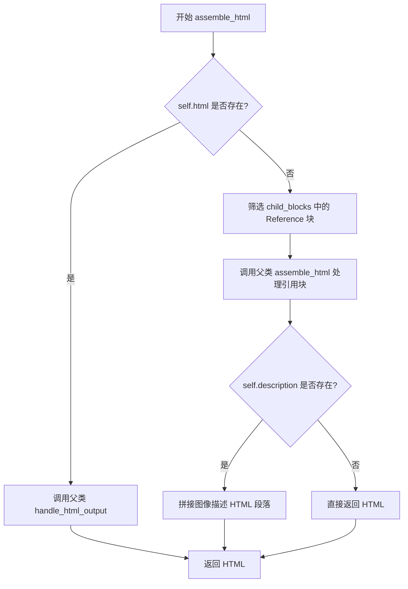
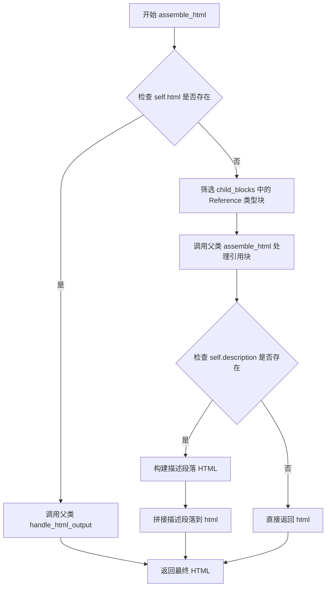
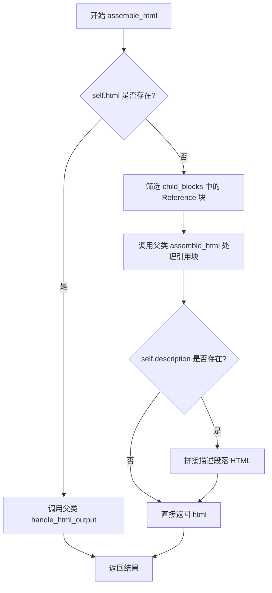

# `marker\marker\schema\blocks\figure.py` 详细设计文档

这是一个用于处理文档中图像（图表、数据可视化等）块的Python类，继承自Block基类，负责将图像块及其引用转换为HTML表示，并支持添加图像描述信息。

## 整体流程



## 类结构

```
Block (基类)
└── Figure (当前类)
```

## 全局变量及字段


### `Figure.block_type`
    
类属性，标识该块类型为Figure

类型：`BlockTypes`
    


### `Figure.description`
    
可选，图像的描述文本

类型：`str | None`
    


### `Figure.html`
    
可选的预定义HTML内容

类型：`str | None`
    


### `Figure.block_description`
    
类属性，描述Figure块的用途

类型：`str`
    
    

## 全局函数及方法


### `Figure.assemble_html`

该方法负责将图像块（Figure）组装成HTML输出，如果当前块已有html属性则直接调用父类方法处理，否则筛选子块中的引用块（Reference）进行HTML组装，并在有描述信息时添加带有角色属性和数据属性的图像描述段落。

参数：

- `self`：Figure 类实例本身，包含图像块的属性如 id、html、description 等
- `document`：object，文档对象，用于处理和构建输出文档的上下文环境
- `child_blocks`：List[Block]，子块列表，包含当前图像块的所有子块元素
- `parent_structure`：object，父结构对象，表示当前块的父级结构信息
- `block_config`：dict | None，可选的块配置字典，用于自定义块的处理行为和样式配置

返回值：`str`，返回组装完成的HTML字符串，包含图像块的HTML表示以及可选的图像描述信息

#### 流程图



#### 带注释源码

```python
def assemble_html(
    self, document, child_blocks, parent_structure, block_config=None
):
    """
    组装图像块的HTML输出
    
    处理逻辑：
    1. 如果当前块已有html属性，委托给父类处理
    2. 否则筛选引用块并调用父类方法组装基础HTML
    3. 如果存在描述信息，追加图像描述的语义化标签
    """
    
    # 检查当前图像块是否已有预生成的HTML内容
    if self.html:
        # 如果已有html，直接调用父类方法处理输出
        return super().handle_html_output(
            document, child_blocks, parent_structure, block_config
        )

    # 从子块中筛选出类型为Reference的引用块
    # 这些引用块通常包含对图像的实际引用信息
    child_ref_blocks = [
        block
        for block in child_blocks
        if block.id.block_type == BlockTypes.Reference
    ]
    
    # 调用父类的assemble_html方法处理引用块
    # 生成图像的基础HTML结构
    html = super().assemble_html(
        document, child_ref_blocks, parent_structure, block_config
    )
    
    # 如果存在图像描述信息，添加语义化的描述段落
    # role='img' 表示这是图像的替代文本内容
    # data-original-image-id 用于关联原始图像元素
    if self.description:
        html += f"<p role='img' data-original-image-id='{self.id}'>Image {self.id} description: {self.description}</p>"
    
    # 返回组装完成的HTML字符串
    return html
```

---

### 类的详细信息

#### Figure 类

**所属文件**：marker/schema/blocks.py（推断）

**父类**：Block

**类描述**：Figure 类继承自 Block 抽象基类，专门用于表示文档中的图像块（如图表、插图等可视化内容），负责将图像数据转换为可访问的HTML结构。

**类字段**：

- `block_type`：BlockTypes，类属性，固定为 BlockTypes.Figure，表示该块的类型为图像
- `description`：str | None，实例属性，图像的可选描述文本，用于提供图像的替代说明
- `html`：str | None，实例属性，预生成的HTML内容，如果存在则直接使用
- `block_description`：str，类属性，固定为 "A chart or other image that contains data."，用于描述该块类型的作用

---

### 关键组件信息

| 组件名称 | 描述 |
|---------|------|
| BlockTypes.Reference | 引用块类型，用于标识子块中的引用元素 |
| super().handle_html_output | 父类方法，用于处理已有HTML的输出 |
| super().assemble_html | 父类方法，用于组装子块的HTML结构 |
| role='img' | ARIA角色属性，标识该元素为图像的替代内容 |
| data-original-image-id | 数据属性，用于关联原始图像元素 |

---

### 潜在的技术债务或优化空间

1. **硬编码的描述格式**：图像描述的HTML格式是硬编码的 `<p role='img' data-original-image-id='...'>`，缺乏灵活性，建议提取为配置项或模板
2. **Reference块筛选逻辑**：直接在方法内部进行块类型筛选，耦合度较高，建议将筛选逻辑下沉到专门的过滤器或工厂类中
3. **描述信息的国际化**：当前描述文本是英文硬编码 "Image {id} description: {description}"，如果需要支持多语言会产生问题
4. **异常处理缺失**：没有对空值、类型错误等边界情况进行处理，document 或 child_blocks 为空时可能导致异常

---

### 其它项目

#### 设计目标与约束

- **设计目标**：将图像块转换为语义化的HTML输出，同时提供图像描述的可访问性支持
- **约束条件**：优先使用预生成的HTML（self.html），如果没有则通过父类方法组装引用块

#### 错误处理与异常设计

- 当前实现没有显式的错误处理机制
- 建议添加对 None 值、类型不匹配等情况的防御性检查

#### 数据流与状态机

- 输入：child_blocks（子块列表）→ 筛选 Reference 块 → 调用父类方法 → 拼接描述 → 输出 HTML 字符串
- 状态转换：存在 self.html → 使用父类方法处理；无 self.html → 组装新 HTML

#### 外部依赖与接口契约

- 依赖 Block 基类的 handle_html_output 和 assemble_html 方法
- 依赖 BlockTypes 枚举进行块类型判断
- 依赖 document 对象提供文档上下文


### `Figure.assemble_html`

该方法用于将 Figure 块（图表或图像）组装成 HTML 格式。如果 Figure 已有预生成的 HTML 内容，则直接调用父类方法处理；否则从子块中提取引用块，调用父类方法生成基础 HTML，并附加图像描述信息。

参数：

- `document`：`Any`，文档对象，用于处理和构建输出
- `child_blocks`：`List[Block]`，当前块的子块列表
- `parent_structure`：`Any`，父级结构信息，用于维护层级关系
- `block_config`：`Any | None`，可选的块配置参数，默认为 None

返回值：`str`，组装完成的 HTML 字符串

#### 流程图



#### 带注释源码

```python
def assemble_html(
    self, document, child_blocks, parent_structure, block_config=None
):
    # 检查 Figure 是否已有预生成的 HTML 内容
    if self.html:
        # 如果已有 HTML，则委托给父类处理标准输出逻辑
        return super().handle_html_output(
            document, child_blocks, parent_structure, block_config
        )

    # 从子块中筛选出类型为 Reference 的块
    # Reference 块通常包含对图像的引用或链接信息
    child_ref_blocks = [
        block
        for block in child_blocks
        if block.id.block_type == BlockTypes.Reference
    ]
    
    # 调用父类的 assemble_html 方法，传入筛选后的引用块
    # 生成基础的 HTML 结构
    html = super().assemble_html(
        document, child_ref_blocks, parent_structure, block_config
    )
    
    # 如果存在图像描述，则附加描述段落
    # 使用 role='img' 属性标记为图像
    # data-original-image-id 用于关联原始图像 ID
    if self.description:
        html += f"<p role='img' data-original-image-id='{self.id}'>Image {self.id} description: {self.description}</p>"
    
    # 返回组装完成的 HTML 字符串
    return html
```


### `Block.handle_html_output()`

该方法是 `Block` 类的父类方法，用于将 Block 对象转换为 HTML 输出格式。Figure 类在处理 HTML 输出时，会先检查自身是否有预设的 HTML 内容，如有则调用父类的该方法进行标准处理。

参数：

- `document`：对象，文档对象，用于构建和存储输出的 HTML 内容
- `child_blocks`：list[Block]，子 Block 列表，包含当前 Block 的所有子元素
- `parent_structure`：对象，父级结构信息，用于维护文档的层级关系
- `block_config`：dict or None，可选的配置字典，用于控制 HTML 输出的行为和格式

返回值：`str`，返回生成的 HTML 字符串

#### 流程图

```mermaid
flowchart TD
    A[Figure.assemble_html 开始] --> B{self.html 是否存在?}
    B -->|是| C[调用 super().handle_html_output]
    B -->|否| D[处理子引用块]
    C --> E[返回 HTML 结果]
    D --> F[调用 super().assemble_html]
    F --> G{self.description 是否存在?}
    G -->|是| H[追加描述段落]
    G -->|否| E
    H --> E
    
    style C fill:#f9f,stroke:#333
    style E fill:#9f9,stroke:#333
```

#### 带注释源码

```python
def handle_html_output(
    self, document, child_blocks, parent_structure, block_config=None
):
    """
    父类 Block 的方法，用于处理 HTML 输出。
    该方法在 Figure 类中被 assemble_html 方法调用，
    当 Figure 对象有预设的 html 属性时使用。
    
    参数:
        document: 文档对象，用于构建 HTML 输出
        child_blocks: 子块列表，包含所有子元素
        parent_structure: 父结构信息
        block_config: 可选的配置参数
    
    返回:
        str: 生成的 HTML 字符串
    """
    # 注意：此方法的实现位于 Block 父类中
    # 在当前代码片段中未直接展示
    # 从 Figure.assemble_html 中的调用方式来看：
    # return super().handle_html_output(
    #     document, child_blocks, parent_structure, block_config
    # )
    pass
```

## 关键组件


### Figure 类

继承自 Block 的类，用于表示文档中的图表或图像块，包含图表的描述和 HTML 表示。

### block_type 字段

类型为 BlockTypes.Figure 的类字段，标识该块为图表类型。

### description 字段

可选的字符串类型字段，用于存储图表的描述信息。

### html 字段

可选的字符串类型字段，用于存储图表的 HTML 表示。

### block_description 类字段

字符串类型，描述该块为"包含数据的图表或其他图像"。

### assemble_html 方法

组装图表的 HTML 输出方法。如果存在 html 则调用父类方法处理；否则提取子引用块并组装，同时在描述存在时添加带 role='img' 的描述段落。

### child_ref_blocks 过滤逻辑

通过列表推导式过滤 child_blocks，只保留 BlockTypes.Reference 类型的子块，实现惰性加载和按需索引。

### 超类方法调用

调用 Block 类的 handle_html_output 和 assemble_html 方法处理已有 HTML 和引用块。


## 问题及建议


### 已知问题

-   **父类方法调用不一致**：在 `assemble_html` 方法中，当 `self.html` 存在时调用 `super().handle_html_output()`，但其他情况调用 `super().assemble_html()`，这两种方法调用逻辑不一致，可能导致行为不可预测
-   **缺少参数类型提示**：`document`、`child_blocks`、`parent_structure`、`block_config` 等参数均未提供类型注解，影响代码可读性和 IDE 辅助功能
-   **硬编码字符串未提取**：`"A chart or other image that contains data."` 和 `"Image {self.id} description:"` 等字符串字面量直接写在代码中，应提取为常量或配置
-   **空值处理风险**：如果 `self.id` 为 `None`，模板字符串 `{self.id}` 将转换为字符串 `"None"`，导致生成的 HTML 包含无效的 image-id
-   **类型注解风格不统一**：使用 `str | None` 而非标准的 `Optional[str]`，与项目其他模块可能不一致
-   **缺少错误处理**：当 `super()` 调用或 HTML 组装过程中发生异常时，没有对应的错误处理机制
-   **列表推导式可优化**：`child_ref_blocks` 的过滤逻辑在每次调用时都会遍历完整的 `child_blocks`，对于大量子块的情况可能影响性能

### 优化建议

-   **统一父类方法调用**：确保所有分支都调用相同的方法，或明确区分不同方法的职责
-   **添加完整类型注解**：为所有方法参数和返回值添加类型提示，如 `def assemble_html(self, document: DocumentType, child_blocks: List[Block], ...)`
-   **提取字符串常量**：将描述性字符串定义为类常量或配置文件，如 `BLOCK_DESCRIPTION = "A chart or other image that contains data."`
-   **添加空值保护**：在使用 `self.id` 前进行空值检查，如 `if self.id is not None`
-   **统一类型注解风格**：根据项目规范选择 `Optional[str]` 或 `str | None` 并保持一致
-   **添加异常处理**：在关键操作周围添加 try-except 块，捕获并记录可能的异常
-   **考虑缓存优化**：如果 `child_blocks` 数据量较大，可考虑预先过滤或使用生成器表达式


## 其它


### 设计目标与约束

本类旨在将PDF文档中的图表、图像元素转换为HTML表示形式，支持两种渲染模式：直接使用预存的HTML内容，或通过子引用块动态构建HTML。设计约束包括：仅处理BlockTypes.Figure类型的块，需配合Block基类实现通用逻辑，子块中仅处理Reference类型的引用块。

### 错误处理与异常设计

代码中未显式定义异常处理逻辑。主要潜在异常场景包括：document对象方法调用异常、child_blocks参数类型不符合预期、id属性不存在或格式错误、super()调用链中的异常。建议在assemble_html方法中添加参数类型检查和异常捕获机制，确保部分子块处理失败时不影响整体流程。

### 数据流与状态机

Figure块的HTML组装流程包含三个状态分支：1) 当self.html存在时，调用父类handle_html_output方法直接处理；2) 当self.html不存在时，首先过滤child_blocks中的Reference类型块，然后调用父类assemble_html方法生成基础HTML；3) 若存在description属性，则追加描述性段落。最终返回完整HTML字符串。

### 外部依赖与接口契约

主要依赖包括：marker.schema.BlockTypes枚举类（定义块类型）、marker.schema.blocks.Block基类（提供通用块处理逻辑）、document对象（需实现HTML输出相关方法）、block_config配置对象（可选）。调用方需确保传入的child_blocks为Block对象列表，parent_structure对象包含必要结构信息。

### 性能考虑

代码中存在不必要的列表推导式过滤操作，当self.html存在时仍会遍历child_blocks进行过滤。建议在self.html存在时直接跳过过滤逻辑。此外，每次调用都会创建新的child_ref_blocks列表，可考虑缓存机制。description字符串拼接使用f-string，效率尚可，但大量Figure块处理时需注意字符串操作开销。

### 安全性考虑

代码将self.id和self.description直接插入HTML字符串，存在XSS风险。当description包含恶意脚本标签时，会被渲染到页面。建议对description进行HTML转义处理，使用html.escape()或类似方法过滤特殊字符。self.id的插入虽为属性值，也需确保来源可信。

### 测试策略建议

应覆盖以下测试场景：1) self.html存在时的HTML生成；2) self.html不存在时的子块引用处理；3) description为空和存在时的不同输出；4) child_blocks为空或全为非Reference类型的情况；5) 异常输入（如None参数）的处理；6) HTML转义安全性测试。建议使用mock对象模拟document和parent_structure。

### 版本兼容性

代码使用Python 3.10+的类型注解语法（str | None），需确保运行环境支持联合类型语法。Block基类方法handle_html_output和assemble_html的签名需与父类保持一致，避免版本升级导致的接口不兼容问题。

    